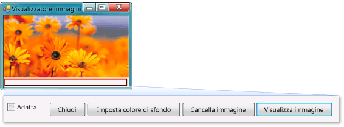

# Esercitazione 1: creare un visualizzatore immagini
[!INCLUDE[vs2017banner](../code-quality/includes/vs2017banner.md)]

In questa esercitazione si compila un programma che carica un'immagine da un file e la visualizza in una finestra.  Viene illustrato come trascinare i controlli quali pulsanti e caselle immagine sul form, impostare le relative proprietà e utilizzare i contenitori per ridimensionare agevolmente il form.  Si inizia inoltre a scrivere il codice.  Vengono illustrate le seguenti procedure:  
  
-   Creare un nuovo progetto.  
  
-   Testare un'applicazione \(eseguirne il debug\).  
  
-   Aggiungere controlli di base come caselle di controllo e pulsanti a un form.  
  
-   Posizionare i controlli sul form utilizzando i layout.  
  
-   Aggiungere finestre di dialogo **Apri file** e **Colore** a un form.  
  
-   Creare codice utilizzando IntelliSense e frammenti di codice.  
  
-   Scrivere metodi per la gestione eventi.  
  
 Al termine delle varie procedure, il programma sarà simile all'immagine che segue.  
  
   
Immagine che si creerà in questa esercitazione  
  
 Per scaricare una versione completa dell'esempio, vedere [Esempio di esercitazione per un visualizzatore immagini completo](http://code.msdn.microsoft.com/Complete-Picture-Viewer-7d91d3a8).  
  
  Per una versione video di questo argomento, vedere [Creare un visualizzatore immagini in Visual Basic](http://go.microsoft.com/fwlink/?LinkId=205207) oppure [Creare un visualizzatore immagini in C\#](http://go.microsoft.com/fwlink/?LinkId=205198).  
  
> [!NOTE]
>  In questi video viene utilizzata una versione precedente di Visual Studio, pertanto vi sono piccole differenze in alcuni comandi di menu e altri elementi dell'interfaccia utente.  Tuttavia, i concetti e le procedure funzionano in modo analogo nella versione corrente di Visual Studio.  In questa esercitazione sono trattati sia Visual C\# sia Visual Basic; concentrarsi sulle informazioni specifiche del linguaggio di programmazione in uso.  
>   
>  Per visualizzare il codice per Visual Basic, scegliere la scheda **VB** all'inizio dei blocchi di codice; per visualizzare il codice per Visual C\#, scegliere la scheda **C\#**.  Se si è interessati a ottenere informazioni su Visual C\+\+, vedere [Introduzione](../misc/getting-started-with-visual-cpp-in-visual-studio-2015.md) e [esercitazione sul linguaggio C\+\+](http://www.cplusplus.com/doc/tutorial/).  
>   
>  Per apprendere come scrivere app Visual C\# o Visual Basic per Windows Store, vedere [Creare la prima app di Windows Store in C\# o Visual Basic](http://msdn.microsoft.com/library/windows/apps/hh974581.aspx).  Per informazioni sulla creazione di app JavaScript per Windows Store, vedere [Creare la prima app di Windows Store in JavaScript](http://msdn.microsoft.com/library/windows/apps/br211385.aspx).  
  
## Argomenti correlati  
  
|Titolo|Descrizione|  
|------------|-----------------|  
|[Passaggio 1: creare un progetto di applicazione Windows Form](../ide/step-1-create-a-windows-forms-application-project.md)|Iniziare creando un progetto di applicazione Windows Form.|  
|[Passaggio 2: eseguire il programma](../ide/step-2-run-your-program.md)|Eseguire il programma applicativo Windows Form creato nel passaggio precedente.|  
|[Passaggio 3: impostare le proprietà del form](../ide/step-3-set-your-form-properties.md)|Modificare l'aspetto del form utilizzando la finestra **Proprietà**.|  
|[Passaggio 4: creare il layout del form con un controllo TableLayoutPanel](../ide/step-4-lay-out-your-form-with-a-tablelayoutpanel-control.md)|Aggiungere un controllo `TableLayoutPanel` al form.|  
|[Passaggio 5: aggiungere controlli al form](../Topic/Step%205:%20Add%20Controls%20to%20Your%20Form.md)|Aggiungere controlli, ad esempio un controllo `PictureBox` e un controllo `CheckBox`, al form.  Aggiungere pulsanti al form.|  
|[Passaggio 6: assegnare un nome ai pulsanti](../ide/step-6-name-your-button-controls.md)|Rinominare i pulsanti con nomi più significativi.|  
|[Passaggio 7: aggiungere componenti di finestra di dialogo al form](../ide/step-7-add-dialog-components-to-your-form.md)|Aggiungere un componente **OpenFileDialog** e un componente **ColorDialog** al form.|  
|[Passaggio 8: scrivere il codice per il gestore dell'evento del pulsante Visualizza immagine](../ide/step-8-write-code-for-the-show-a-picture-button-event-handler.md)|Creare codice utilizzando lo strumento IntelliSense.|  
|[Passaggio 9: rivedere, commentare e testare il codice](../ide/step-9-review-comment-and-test-your-code.md)|Esaminare e testare il codice.  Aggiungere commenti in base alle necessità.|  
|[Passaggio 10: scrivere codice per pulsanti aggiuntivi e una casella di controllo](../Topic/Step%2010:%20Write%20Code%20for%20Additional%20Buttons%20and%20a%20Check%20Box.md)|Scrivere codice per far funzionare altri pulsanti e una casella di controllo utilizzando IntelliSense.|  
|[Passaggio 11: eseguire il programma e provare altre funzionalità](../Topic/Step%2011:%20Run%20Your%20Program%20and%20Try%20Other%20Features.md)|Eseguire il programma e impostare il colore di sfondo.  Provare altre funzionalità, ad esempio la modifica di colori, tipi di carattere e bordi.|