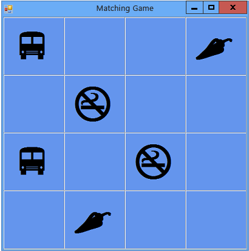

# Esercitazione 3: creare un gioco delle coppie
[!INCLUDE[vs2017banner](../code-quality/includes/vs2017banner.md)]

In questa esercitazione si compila un gioco delle coppie, in cui il giocatore deve riuscire ad accoppiare icone nascoste.  Vengono illustrate le seguenti procedure:  
  
-   Archiviare oggetti, ad esempio icone, in un oggetto `List`.  
  
-   Utilizzare un ciclo `foreach` in Visual C\# o un ciclo `For Each` in Visual Basic per scorrere gli elementi di un elenco.  
  
-   Tenere traccia dello stato di un form utilizzando variabili di riferimento.  
  
-   Compilare un gestore eventi per rispondere a eventi utilizzabili con più oggetti.  
  
-   Creare un timer con conto alla rovescia e quindi generare un evento subito dopo l'avvio.  
  
 Al termine di questa esercitazione, il programma sarà simile all'immagine che segue.  
  
   
Gioco che si creerà in questa esercitazione  
  
 Per scaricare una versione completa dell'esempio, vedere [Esempio dell'esercitazione per il gioco di abbinamenti completo](http://code.msdn.microsoft.com/Complete-Matching-Game-4cffddba).  
  
> [!NOTE]
>  In questa esercitazione sono trattati sia Visual C\# sia Visual Basic; concentrarsi sulle informazioni specifiche del linguaggio di programmazione in uso.  
  
 In caso di blocchi improvvisi o dubbi a livello di programmazione, provare a pubblicare una domanda in uno dei forum MSDN.  Vedere [Forum su Visual Basic](http://social.msdn.microsoft.com/Forums/home?forum=vbgeneral) e [Forum su Visual C\#](http://social.msdn.microsoft.com/Forums/home?forum=csharpgeneral).  Sono inoltre disponibili utilissime risorse di formazione video gratuite.  Per altre informazioni sulla programmazione in Visual Basic, vedere [Nozioni fondamentali di Visual Basic: sviluppo per principianti](http://channel9.msdn.com/Series/Visual-Basic-Development-for-Absolute-Beginners).  Per altre informazioni sulla programmazione in Visual C\#, vedere [Nozioni fondamentali di C\#: sviluppo per principianti](http://channel9.msdn.com/Series/C-Sharp-Fundamentals-Development-for-Absolute-Beginners).  
  
## Argomenti correlati  
  
|Titolo|Descrizione|  
|------------|-----------------|  
|[Passaggio 1: creare un progetto e aggiungere una tabella al form](../ide/step-1-create-a-project-and-add-a-table-to-your-form.md)|Per iniziare, creare il progetto e aggiungere un controllo `TableLayoutPanel` per mantenere allineati i controlli.|  
|[Passaggio 2: aggiungere un oggetto casuale e un elenco di icone](../ide/step-2-add-a-random-object-and-a-list-of-icons.md)|Aggiungere un oggetto `Random` e un oggetto `List` per creare un elenco di icone.|  
|[Passaggio 3: assegnare un'icona casuale a ogni etichetta](../Topic/Step%203:%20Assign%20a%20Random%20Icon%20to%20Each%20Label.md)|Assegnare le icone in modo casuale ai controlli `Label`, in modo che ogni gioco sia diverso.|  
|[Passaggio 4: aggiungere un gestore degli eventi Click a ogni etichetta](../Topic/Step%204:%20Add%20a%20Click%20Event%20Handler%20to%20Each%20Label.md)|Aggiungere un gestore degli eventi Click che modifica il colore dell'etichetta sulla quale viene fatto clic.|  
|[Passaggio 5: aggiungere riferimenti alle etichette](../ide/step-5-add-label-references.md)|Aggiungere variabili di riferimento per tenere traccia delle etichette sulle quali viene fatto clic.|  
|[Passaggio 6: aggiungere un timer](../Topic/Step%206:%20Add%20a%20Timer.md)|Aggiungere un timer al form per tenere traccia del tempo trascorso durante il gioco.|  
|[Passaggio 7: mantenere le coppie visibili](../Topic/Step%207:%20Keep%20Pairs%20Visible.md)|Mantenere le coppie di icone visibili se viene selezionata una coppia corrispondente.|  
|[Passaggio 8: aggiungere un metodo per verificare se il giocatore ha vinto](../ide/step-8-add-a-method-to-verify-whether-the-player-won.md)|Aggiungere un metodo `CheckForWinner()` per verificare se il giocatore ha vinto.|  
|[Passaggio 9: provare altre funzionalità](../ide/step-9-try-other-features.md)|Provare altre funzionalità, ad esempio modificare le icone e i colori oppure aggiungere una griglia e i suoni.  Provare a ingrandire lo schema e a regolare il timer.|