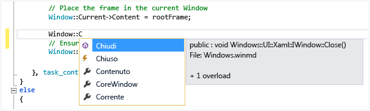

# Utilizzo di IntelliSense
[!INCLUDE[vs2017banner](../code-quality/includes/vs2017banner.md)]

IntelliSense è il termine generale per numerose funzionalità: Elenca membri, Informazioni sul parametro, Informazioni rapide e Completa parola.  Queste funzionalità consentono di acquisire altre informazioni sul codice in uso, tengono traccia dei parametri che si digitano e aggiungono le chiamate a proprietà e metodi con poche sequenze di tasti.  
  
 Molti aspetti di IntelliSense sono specifici del linguaggio.  Per altre informazioni su IntelliSense per i diversi linguaggi, vedere gli argomenti elencati in Vedere anche.  
  
## Elenca membri  
 Un elenco di membri validi di un tipo \(o dello spazio dei nomi\) viene visualizzato dopo avere digitato un carattere del trigger, ad esempio un punto \(`.`\) nel codice gestito o `::` in C\+\+.  Se si continua a digitare caratteri, l'elenco viene filtrato in modo da includere solo i membri che iniziano con tali caratteri.  
  
 Dopo avere selezionato un elemento, è possibile inserirlo nel codice premendo TAB o digitando uno spazio.  Se si seleziona un elemento e si digita un punto, l'elemento viene visualizzato seguito dal punto; questa condizione comporta la visualizzazione di un altro elenco di membri.  Quando si seleziona un elemento ma prima di inserirlo, vengono visualizzate informazioni rapide per l'elemento.  
  
 Nell'elenco dei membri, l'icona a sinistra rappresenta il tipo del membro, ad esempio spazio dei nomi, classe, funzione o variabile.  Per un elenco di icone, vedere [Icone di Visualizzazione classi e Visualizzatore oggetti](../ide/class-view-and-object-browser-icons.md).  L'elenco può essere piuttosto lungo, pertanto è possibile premere PGSU e PGGIÙ per spostarsi rispettivamente verso l'alto o verso il basso nell'elenco.  
  
   
  
 È possibile richiamare la funzionalità **Elenca membri** manualmente digitando CTRL\+J, facendo clic su **Modifica\/Intellisense\/Elenca membri** o sul pulsante **Elenca membri** sulla barra degli strumenti dell'editor.  Se richiamato in una riga vuota o al di fuori di un ambito riconoscibile, l'elenco conterrà simboli dello spazio dei nomi globale.  
  
 Per disattivare la funzionalità Elenca membri per impostazione predefinita \(in modo che non sia presente a meno che specificamente richiamata\) andare a **Strumenti\/Opzioni\/Tutti i linguaggi** e deselezionare **Elenco membri automatico**.  Se si desidera disattivare la funzionalità Elenca membri solo per un linguaggio specifico, andare alle impostazioni **Generali** per quel linguaggio.  
  
 È inoltre possibile modificare la modalità di suggerimento, in cui solo il testo digitato viene inserito nel codice.  Ad esempio, se si immette un identificatore che non è presente nell'elenco e si preme TAB, in modalità di terminazione la voce sostituirà l'identificatore digitato.  Per passare tra modalità di terminazione e modalità di suggerimento, premere CTRL\+ALT\+BARRA SPAZIATRICE o fare clic su **Modifica\/IntelliSense\/Attiva\/Disattiva modalità di terminazione**.  
  
## Informazioni sul parametro  
 Informazioni sul parametro fornisce informazioni relative al numero, ai nomi e ai tipi di parametri richiesti da un metodo, un parametro di tipo generico di attributo \(in C\#\) o da un modello \(in C\+\+\).  
  
 Il parametro in grassetto indica il parametro successivo richiesto durante la digitazione della funzione.  Per le funzioni in overload, è possibile usare i tasti FRECCIA SU e FRECCIA GIÙ per visualizzare informazioni sui parametri alternativi per gli overload della funzione.  
  
   
  
 Se si annotano funzioni e parametri con commenti relativi alla documentazione XML, i commenti verranno visualizzati come informazioni sui parametri.  Per altre informazioni, vedere [Inserimento di commenti al codice XML](../ide/supplying-xml-code-comments.md).  
  
 È possibile richiamare manualmente le Informazioni sul parametro facendo clic su **Modifica\/IntelliSense\/Informazioni sul parametro**, digitando CTRL\+MAIUSC\+BARRA SPAZIATRICE, oppure facendo clic sul pulsante **Informazioni sul parametro** sulla barra degli strumenti dell'editor.  
  
## Informazioni rapide  
 Informazioni rapide visualizza la dichiarazione completa per ogni identificatore incluso nel codice.  
  
   
  
 Quando si seleziona un membro nella casella **Elenca membri**, vengono visualizzate anche le informazioni rapide.  
  
   
  
 È possibile richiamare manualmente le informazioni rapide facendo clic su **Modifica\/IntelliSense\/Informazioni rapide**, digitando CTRL\+I, oppure facendo clic sul pulsante **Informazioni rapide** sulla barra degli strumenti dell'editor.  
  
 Se una funzione è sottoposta a overload, è possibile che IntelliSense non visualizzi le informazioni per tutte le forme di overload.  
  
 È possibile disattivare le informazioni rapide in C\+\+ impostando **Strumenti\/Opzioni\/Editor di testo\/C\/C\+\+\/Avanzate\/Informazioni rapide automatiche** su `false`.  
  
## Completa parola  
 Completa parola completa la digitazione del nome di una variabile, di un comando o di una funzione una volta che sono stati immessi caratteri sufficienti a identificare il termine in modo univoco.  È possibile richiamare Completa parola facendo clic su **Modifica\/IntelliSense\/Completa parola**, digitando CTRL\+BARRA SPAZIATRICE, oppure facendo clic sul pulsante **Completa parola** sulla barra degli strumenti dell'editor.  
  
## Opzioni IntelliSense  
 Le opzioni IntelliSense sono attive per impostazione predefinita.  Per disattivarli, fare clic su **Strumenti\/Opzioni\/Editor di testo** e deselezionare **Informazioni parametri** o **Elenco membri automatico** se non si vuole usare la funzionalità Elenca membri.  
  
## Risoluzione dei problemi relativi a IntelliSense  
 Le opzioni IntelliSense potrebbero non funzionare come previsto, in alcuni casi.  
  
 **Il cursore si trova sotto un errore del codice.** Non è possibile usare IntelliSense se una funzione incompleta o un altro errore esiste nel codice sopra il cursore perché IntelliSense potrebbe non essere in grado di analizzare gli elementi di codice.  È possibile risolvere questo problema commentando il codice applicabile.  
  
 **Il cursore si trova in un commento del codice.** Non è possibile usare IntelliSense se il cursore si trova in un commento nel file di origine.  
  
 **Il cursore si trova in un valore letterale stringa.** Non è possibile usare IntelliSense se il cursore si trova tra virgolette intorno a un valore letterale stringa, come nel seguente esempio:  
  
```  
MessageBox( hWnd, "String literal|") )  
```  
  
 **Le opzioni automatiche sono disattivate.** Per impostazione predefinita, il funzionamento di IntelliSense è automatico, ma è possibile disabilitarlo.  Anche se il completamento automatico delle istruzioni è disabilitato, è possibile richiamare una funzionalità IntelliSense.  
  
## Vedere anche  
 [Funzionalità di IntelliSense specifiche per Visual Basic](../ide/visual-basic-specific-intellisense.md)   
 [IntelliSense per Visual C\#](../ide/visual-csharp-intellisense.md)   
 [IntelliSense per JavaScript](../ide/javascript-intellisense.md)   
 [Inserimento di commenti al codice XML](../ide/supplying-xml-code-comments.md)