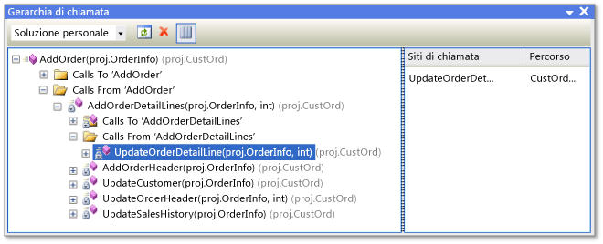

# Visualizzazione della struttura del codice
È possibile esaminare gli oggetti e i membri nei progetti di Visual Studio e oggetti e membri in componenti .NET Framework, componenti COM, librerie a collegamento dinamico (DLL) e librerie dei tipi (TLB).  
  
 Le sezioni seguenti di questo documento descrivono le diverse finestre della struttura di codice.  
  
 [Visualizzazione classi (Visual Basic, C#, C++)](#BKMK_ClassView)  
  
 [Gerarchia di chiamata (Visual Basic, C#, C++)](#BKMK_CallHierarchy)  
  
 [Visualizzatore oggetti](#BKMK_ObjectBrowser)  
  
 [Finestra Definizione codice (C#, C++)](#BKMK_CodeDefinition)  
  
 È anche possibile usare **Esplora soluzioni** per esplorare i tipi e i membri nei progetti, individuare i simboli, visualizzare la gerarchia di chiamata di un metodo, individuare i riferimenti dei simboli ed eseguire altre attività senza dover passare tra le varie finestre degli strumenti elencati in precedenza.  
  
 Se si dispone di Visual Studio Enterprise, è possibile usare mappe di codice per visualizzare la struttura del codice e le relative dipendenze attraverso l'intera soluzione ed eseguire il drill-down nelle parti del codice che interessano. Per altre informazioni, vedere [Map dependencies across your solutions](../modeling/map-dependencies-across-your-solutions.md) (Eseguire il mapping delle dipendenze nelle soluzioni).  
  
> [!NOTE]
>  L'edizione di Visual Studio e le impostazioni in uso possono influire sulle funzionalità nell'IDE, che potrebbero essere diverse da quelle descritte in questo argomento.  
  
##   Visualizzazione classi (Visual Basic, C#, C++)  
 **Visualizzazione classi** viene visualizzato come parte di **Esplora soluzioni** nonché in una finestra separata. La finestra **Visualizzazione classi** visualizza gli elementi di un'applicazione. Nel riquadro superiore vengono visualizzati spazi dei nomi, tipi, enumerazioni, interfacce e classi e nel riquadro inferiore vengono visualizzati i membri che appartengono al tipo selezionato nel riquadro superiore. Tramite questa finestra è possibile passare alle definizioni dei membri nel codice sorgente (o il **Visualizzatore oggetti** se l'elemento è definito all'esterno della soluzione).  
  
 Non è necessario compilare un progetto per visualizzarne gli elementi in **Visualizzazione classi**. La finestra viene aggiornata quando si modifica il codice nel progetto.  
  
 È possibile aggiungere codice al progetto selezionando il nodo del progetto e scegliendo il pulsante **Aggiungi** per aprire la finestra di dialogo **Aggiungi nuovo elemento**. Il codice viene aggiunto in un file separato.  
  
 Se il progetto viene archiviato nel controllo del codice sorgente, ogni elemento **Visualizzazione classi** visualizza un'icona che indica lo stato del codice sorgente del file. I comandi comuni del controllo del codice sorgente , ad esempio **Estrai**, **Archivia** e **Leggi ultima versione**, sono disponibili anche nel menu di scelta rapida per l'elemento.  
  
### Visualizzazione classi - Barra degli strumenti  
 La barra degli strumenti di Visualizzazione classi contiene i comandi seguenti.  
  
|||  
|-|-|  
|**Nuova cartella**|Crea una cartella virtuale o una sottocartella in cui è possibile organizzare gli elementi utilizzati di frequente. Vengono salvate nel file di soluzione attiva (file SUO). Dopo che è possibile rinominare o eliminare un elemento nel codice, potrebbe essere visualizzato in una cartella virtuale come nodo di errore. Per correggere questo problema, eliminare il nodo di errore. Se è stato rinominato un elemento, è possibile spostarlo dalla gerarchia di progetto nella cartella nuovamente.|  
|**Indietro**|Consente di passare all’elemento selezionato in precedenza.|  
|**Avanti**|Consente di passare al successivo elemento selezionato.|  
|**Visualizza diagramma classi** (solo progetti di codice gestito)|Diventa disponibile quando si seleziona uno spazio dei nomi o si digita in **Visualizzazione classi**. Quando viene selezionato uno spazio dei nomi, che contiene tutti i tipi visualizzati dal diagramma classi. Quando viene selezionato uno spazio dei nomi, viene visualizzato solo quel tipo dal diagramma classi.|  
  
### Visualizzazione classi - Impostazioni  
 Il pulsante **Visualizzazione classi - Impostazioni** sulla barra degli strumenti ha le impostazioni seguenti.  
  
|||  
|-|-|  
|**Mostra tipi base**|Vengono visualizzati i tipi di base.|  
|**Mostra tipi derivati**|Vengono visualizzati i tipi derivati.|  
|**Mostra tipi e membri nascosti**|Tipi e membri nascosti (non destinati ai client) vengono visualizzati in grigio chiaro.|  
|**Mostra membri pubblici**|I membri pubblici vengono visualizzati.|  
|**Mostra membri protetti**|I membri protetti vengono visualizzati.|  
|**Mostra membri privati**|I membri privati vengono visualizzati.|  
|**Mostra altri membri**|Altri tipi di membri vengono visualizzati, tra cui i membri interni (o Friend in Visual Basic).|  
|**Mostra membri ereditati**|I membri ereditati vengono visualizzati.|  
|**Show Extension Methods** (Mostra metodi di estensione)|I metodi di estensione vengono visualizzati.|  
  
### Menu di scelta rapida di visualizzazione classi  
 Il menu di scelta rapida in **Visualizzazione classi** può contenere i seguenti comandi, a seconda del tipo di progetto selezionato.  
  
|||  
|-|-|  
|**Vai a definizione**|Trova la definizione dell'elemento nel codice sorgente o nel **Visualizzatore oggetti**, se l'elemento non è definito nel progetto aperto.|  
|**Sfoglia definizione**|Visualizza l'elemento selezionato nel **Visualizzatore oggetti**.|  
|**Trova tutti i riferimenti**|Trova l'elemento oggetto attualmente selezionato e visualizza i risultati in una finestra **Risultati ricerca**.|  
|**Filtra per tipo** (solo codice gestito)|Visualizza solo il tipo selezionato o lo spazio dei nomi. È possibile rimuovere il filtro scegliendo il pulsante **Cancella risultati ricerca** (X) accanto alla casella **Trova**.|  
|**Copia**|Copia il nome completo dell'elemento.|  
|**Ordina alfabeticamente**|Elenca tipi e membri in ordine alfabetico per nome.|  
|**Ordina per tipo di membro**|Elenca i tipi e membri nell'ordine in base al tipo (in cui le classi precedono le interfacce, le interfacce precedono i delegati e i metodi precedono le proprietà).|  
|**Ordina per accesso al membro**|Elenca tipi e membri in ordine, da tipo di accesso, pubblico o privato.|  
|**Raggruppa per tipo di membro**|Ordina i tipi e membri in gruppi in base al tipo di oggetto.|  
|**Vai a dichiarazione** (solo codice C++)|Visualizza la dichiarazione del tipo o membro nel codice sorgente, se disponibile.|  
|**Vai a definizione**|Visualizza la definizione del tipo o membro nel codice sorgente, se disponibile.|  
|**Vai a riferimento**|Visualizza un riferimento al tipo o membro nel codice sorgente, se disponibile.|  
|**Visualizza gerarchia delle chiamate**|Visualizza il metodo selezionato nella finestra **Gerarchia di chiamata**.|  
  
##   Gerarchia di chiamata (Visual Basic, C#, C++)  
 La finestra **Gerarchia di chiamata** visualizza dove viene chiamato un determinato metodo (o proprietà o costruttore) ed elenca i metodi chiamati da quel metodo. È possibile visualizzare più livelli di grafico delle chiamate, che mostra le relazioni chiamante/chiamato tra i metodi di un ambito specificato.  
  
 È possibile visualizzare la finestra **Gerarchia di chiamata** selezionando un metodo (o proprietà o costruttore) e quindi scegliendo **View Class Hierarchy** (Visualizza gerarchia di classi) nel menu di scelta rapida. La visualizzazione dovrebbe essere simile all’immagine seguente:  
  
   
Finestra Gerarchia di chiamata  
  
 Usando l'elenco a discesa sulla barra degli strumenti, è possibile specificare l'ambito della gerarchia: la soluzione, il progetto corrente o il documento corrente.  
  
 Il riquadro principale visualizza le chiamate da e verso il metodo e il riquadro **Siti di chiamata** visualizza il percorso della chiamata selezionata. Per i membri virtuali o astratti viene visualizzato un nodo **Overrides method name** (Esegui override nome metodo). Per i membri di interfaccia viene visualizzato un nodo **Implements method name** (Implementa nome metodo).  
  
 La finestra **Gerarchia di chiamata** non trova riferimenti per il gruppo di metodi, che includono i percorsi in cui un metodo viene aggiunto come gestore eventi o assegnato a un delegato. Per trovare questi riferimenti, usare il comando **Trova tutti i riferimenti**.  
  
 Il menu di scelta rapida nella finestra **Gerarchia di chiamata** contiene i comandi seguenti.  
  
|||  
|-|-|  
|**Aggiungi come nuova radice**|Aggiunge il nodo selezionato come un nuovo nodo radice.|  
|**Rimuovi radice**|Rimuove il nodo radice selezionato dal riquadro di visualizzazione albero.|  
|**Vai a definizione**|Consente di passare alla definizione originale di un metodo.|  
|**Trova tutti i riferimenti**|Trova nel progetto tutti i riferimenti al metodo selezionato.|  
|**Copia**|Copia il nodo selezionato (ma non i sottonodi).|  
|**Aggiorna**|Aggiorna le informazioni.|  
  
##   Visualizzatore oggetti  
 Il **Visualizzatore oggetti** visualizza le descrizioni del codice nei progetti.  
  
 È possibile filtrare ciò che si vuole visualizzare nel **Visualizzatore oggetti**. Usando l'elenco a discesa nella parte superiore della finestra, è possibile scegliere una delle seguenti opzioni:  
  
-   Qualsiasi .NET Framework  
  
-   Silverlight  
  
-   La soluzione attiva.  
  
-   Un set di componenti personalizzato  
  
 I componenti personalizzati possono includere file eseguibili di codice gestito, assembly di librerie, librerie dei tipi e file OCX. Non è possibile aggiungere componenti personalizzati di C++. Le impostazioni personalizzate vengono salvate nella directory dell’applicazione utente di Visual Studio, %APPDATA%\Roaming\Microsoft\VisualStudio\11.0\ObjBrowEX.dat.  
  
 Nel riquadro di sinistra del **Visualizzatore oggetti** vengono visualizzati i contenitori fisici, ad esempio componenti COM e .NET Framework. È possibile espandere i nodi del contenitore per visualizzare gli spazi dei nomi che questi contengono e quindi espandere gli spazi dei nomi per visualizzare i tipi che essi contengono. Quando si seleziona un tipo, nel riquadro di destra sono elencati i relativi membri (ad esempio proprietà e metodi). Il riquadro inferiore destro visualizza informazioni dettagliate sull'elemento selezionato.  
  
 È possibile cercare un elemento specifico usando la casella **Ricerca** nella parte superiore della finestra. Tutte le corrispondenze non applicano la distinzione tra maiuscole e minuscole. I risultati della ricerca vengono visualizzati nel riquadro sinistro. Per cancellare una ricerca, scegliere il pulsante **Cancella ricerca** (X) accanto alla casella **Ricerca**.  
  
 Il **Visualizzatore oggetti** tiene traccia delle selezioni effettuate ed è possibile spostarsi tra le selezioni effettuate usando i pulsanti **Avanti** e **Indietro** sulla barra degli strumenti.  
  
 È possibile usare il **Visualizzatore oggetti** per aggiungere un riferimento all'assembly a una soluzione aperta selezionando un elemento (assembly, spazio dei nomi, tipo o membro) e scegliendo il pulsante **Aggiungi riferimento** sulla barra degli strumenti.  
  
### Visualizzatore oggetti - Impostazioni  
 Con il pulsante **Visualizzatore oggetti - Impostazioni** sulla barra degli strumenti è possibile specificare una delle visualizzazioni seguenti.  
  
|||  
|-|-|  
|**Visualizza spazio dei nomi**|Consente di visualizzare gli spazi dei nomi anziché i contenitori fisici nel riquadro sinistro. Gli spazi dei nomi archiviati in più contenitori fisici vengono uniti.|  
|**Visualizza contenitori**|Consente di visualizzare i contenitori fisici anziché gli spazi dei nomi nel riquadro sinistro. **Visualizza spazio dei nomi** e **Visualizza contenitori** sono impostazioni che si escludono a vicenda.|  
|**Mostra tipi base**|Visualizza tipi di base.|  
|**Mostra tipi derivati**|Visualizza tipi derivati.|  
|**Mostra tipi e membri nascosti**|Visualizza tipi e membri nascosti (non destinati ai client) in grigio chiaro.|  
|**Mostra membri pubblici**|Visualizza membri pubblici.|  
|**Mostra membri protetti**|Visualizza membri protetti.|  
|**Mostra membri privati**|Visualizza membri privati.|  
|**Mostra altri membri**|Visualizza altri tipi di membri, tra cui membri interni (o Friend in Visual Basic).|  
|**Mostra membri ereditati**|Visualizza membri ereditati.|  
|**Show Extension Methods** (Mostra metodi di estensione)|Visualizza metodi di estensione.|  
  
### Comandi del menu di scelta rapida Visualizzatore oggetti  
 Il menu di scelta rapida nel **Visualizzatore oggetti** può contenere i comandi seguenti, a seconda del tipo di elemento selezionato.  
  
|||  
|-|-|  
|**Sfoglia definizione**|Viene illustrato il nodo primario per l'elemento selezionato.|  
|**Trova tutti i riferimenti**|Trova l'elemento oggetto attualmente selezionato e visualizza i risultati in una finestra **Risultati ricerca**.|  
|**Filtra per tipo**|Visualizza solo il tipo selezionato o lo spazio dei nomi. È possibile rimuovere il filtro scegliendo il pulsante **Cancella ricerca**.|  
|**Copia**|Copia il nome completo dell'elemento.|  
|**Rimuovi**|Se l'ambito è un componente personalizzato impostato, rimuove il componente selezionato dall'ambito.|  
|**Ordina alfabeticamente**|Elenca tipi e membri in ordine alfabetico per nome.|  
|**Ordina per tipo di oggetto**|Elenca i tipi e membri nell'ordine in base al tipo (in cui le classi precedono le interfacce, le interfacce precedono i delegati e i metodi precedono le proprietà).|  
|**Ordina per accesso all'oggetto**|Elenca tipi e membri in ordine, da tipo di accesso, pubblico o privato.|  
|**Raggruppa per tipo di oggetto**|Ordina i tipi e membri in gruppi in base al tipo di oggetto.|  
|**Vai a dichiarazione** (solo progetti C++)|Visualizza la dichiarazione del tipo o membro nel codice sorgente, se disponibile.|  
|**Vai a definizione**|Visualizza la definizione del tipo o membro nel codice sorgente, se disponibile.|  
|**Vai a riferimento**|Visualizza un riferimento al tipo o membro nel codice sorgente, se disponibile.|  
|**Visualizza gerarchia delle chiamate**|Visualizza il metodo selezionato nella finestra **Gerarchia di chiamata**.|  
  
##   Finestra Definizione codice (C#, C++)  
 La finestra **Definizione codice** visualizza la definizione di un membro o tipo selezionato nel progetto attivo. È possibile selezionare il tipo o il membro nell'editor di codice o in una finestra di visualizzazione del codice.  
  
 Anche se questa finestra è di sola lettura, è possibile impostarvi punti di interruzione o segnalibri. Per modificare la definizione visualizzata scegliere **Modifica definizione** nel menu di scelta rapida. Verrà quindi aperto il file di origine nell'editor di codice e verrà spostato nel punto di inserimento sulla riga in cui inizia la definizione.  
  
### Menu di scelta rapida di Definizione codice  
 Il menu di scelta rapida nella finestra **Definizione codice** può contenere i comandi seguenti, a seconda del linguaggio di programmazione.  
  
|||  
|-|-|  
|**Crea unit test**|Crea unit test per l'elemento selezionato.|  
|**Genera diagramma sequenza**|Quando si seleziona un metodo, genera un diagramma di sequenza.|  
|**Crea funzione di accesso privata**|Se un unit test è presente nella soluzione, genera un metodo usato dal test per accedere al codice.|  
|**Vai a definizione**|Trova la definizione (o le definizioni per le classi parziali) e le visualizza in una finestra **Risultati ricerca**.|  
|**Trova tutti i riferimenti**|Consente di trovare i riferimenti al tipo o membro nella soluzione.|  
|**Visualizza gerarchia delle chiamate**|Visualizza il metodo nella finestra **Gerarchia di chiamata**.|  
|**Mostra test di chiamata**|Se vi sono unit test nel progetto, vengono illustrati i test che chiamano il codice selezionato.|  
|**Esegui test di chiamata**|Se vi sono unit test nel progetto, vengono eseguiti i test per il codice selezionato.|  
|**Punto di interruzione**|Inserisce un punto di interruzione (o un punto di analisi).|  
|**Esegui fino al cursore**|Esegue il programma in modalità di debug per la posizione del cursore.|  
|**Copia**|Copia l'elemento selezionato.|  
|**Struttura**|Comandi di struttura standard.|  
|**Modifica definizione**|Sposta il punto di inserimento alla definizione nella finestra del codice.|  
|**Scegli codifica**|Apre la finestra **Codifica** che consente di impostare una codifica per il file.|  
  
### Finestra Struttura documento  
 È possibile usare la finestra **Struttura documento** in combinazione con le visualizzazioni di progettazione, ad esempio la finestra di progettazione per una pagina XAML o una finestra di Progettazione Windows Form o con pagine HTML. Questa finestra visualizza gli elementi in una visualizzazione albero in modo che sia possibile visualizzare la struttura logica del form o della pagina e trovare i controlli sono incorporati o nascosti in profondità.  
  
## Vedere anche  
 [Icone di Visualizzazione classi e Visualizzatore oggetti](../ide/class-view-and-object-browser-icons.md)
