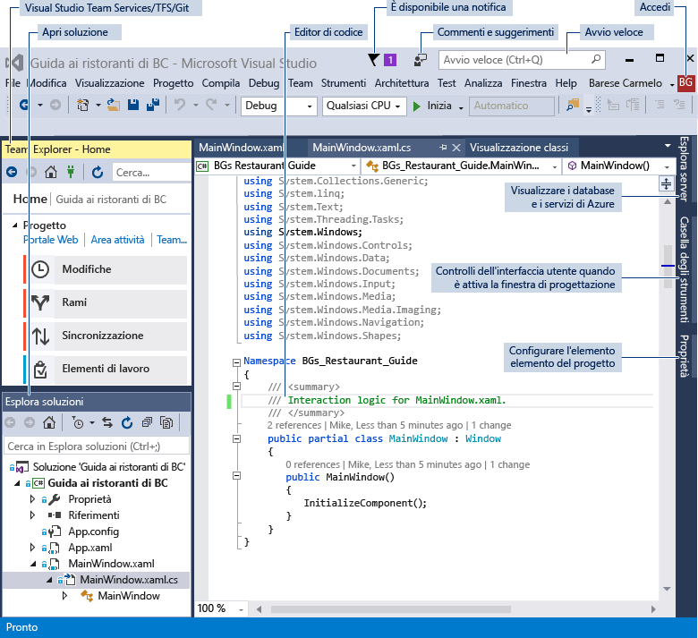
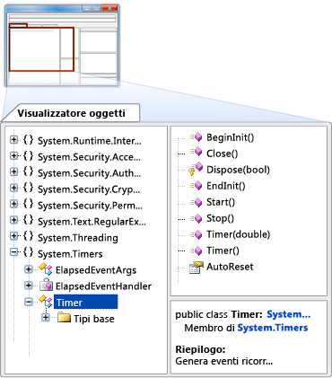
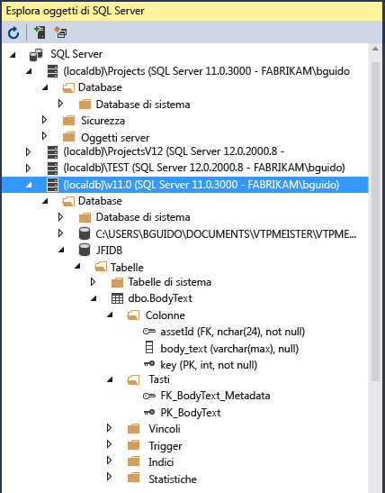

# Panoramica delle funzionalità dell'IDE di Visual Studio
Questo argomento presenta le funzionalità dell'IDE di Visual Studio. L'IDE di Visual Studio è un ambiente di sviluppo integrato, ovvero una superficie creativa utilizzabile per visualizzare e modificare praticamente qualsiasi tipo di codice, per poi eseguire il debug, la compilazione e la pubblicazione di app per Android, iOS, Windows, il Web e il cloud. Sono disponibili versioni per Mac e Windows. In questo articolo verranno presentate alcune delle operazioni eseguibili con Visual Studio e illustrate le procedure per installarlo e usarlo, nonché per creare un progetto semplice. L'articolo include anche informazioni introduttive sul debug e la distribuzione del codice, oltre a una presentazione delle varie finestre degli strumenti.

## Operazioni possibili con l'IDE di Visual Studio
È possibile creare un'app per un telefono Android, ma anche un gioco innovativo con C++. Visual Studio offre moltissime possibilità, grazie anche a modelli che consentono di realizzare siti Web, giochi, app desktop, app per dispositivi mobili, app per Office e molto altro.

È anche possibile aprire semplicemente quasi tutto il codice, praticamente da qualsiasi origine, ed eseguirlo. Se si trova un progetto interessante in GitHub, basta clonare il repository, aprirlo in Visual Studio e iniziare a modificare il codice in base alle specifiche esigenze.

### Creare app per dispositivi mobili
È possibile creare app per dispositivi mobili native per piattaforme diverse con Visual C# e Xamarin o Visual C++ oppure app ibride usando JavaScript con Apache Cordova. Si possono scrivere giochi per dispositivi mobili per Unity, Unreal, DirectX, Cocos e altre piattaforme. Visual Studio include un emulatore Android che consente di eseguire app Android ed eseguirne il debug.

È possibile sfruttare le potenzialità del cloud per le app per dispositivi mobili mediante la creazione di servizi app di Azure. I servizi app di Azure abilitano le app per l'archiviazione di dati nel cloud, consentono di autenticare gli utenti in modo sicuro e adattano automaticamente le risorse in base alle esigenze delle app e delle aziende. Per altre informazioni, vedere [Sviluppo di app per dispositivi mobili](https://www.visualstudio.com/vs/mobile-app-development/).

### Creare app cloud per Azure
Visual Studio offre un gruppo di strumenti che consentono di creare facilmente applicazioni abilitate per il cloud con tecnologia Microsoft Azure. È possibile gestire la configurazione, la compilazione, il debug, l'inserimento in pacchetti e la distribuzione di applicazioni e servizi in Microsoft Azure direttamente dall'IDE. Si possono sfruttare i servizi di Azure per le proprie app usando Servizi connessi. Per ottenere gli strumenti di Azure per .NET, selezionare il carico di lavoro **Sviluppo di Azure** quando si installa Visual Studio. Per altre informazioni, vedere [Visual Studio Tools per Azure](https://www.visualstudio.com/vs/azure-tools/).

### Creare app per il Web
Il mondo moderno è dominato dal Web e Visual Studio può essere utile per scrivere app per questa piattaforma. È possibile creare app Web con ASP.NET, Node.js, Python, JavaScript e TypeScript. Visual Studio riconosce framework Web quali Angular, jQuery, Express e altri. ASP.NET Core e .NET Core supportano i sistemi operativi Windows, Mac e Linux. Per altre informazioni, vedere [Strumenti Web moderni](https://www.visualstudio.com/vs/modern-web-tooling/).

### Scrivere codice in un ambiente di modifica di alto livello
Visual Studio consente di scrivere codice rapidamente e facilmente grazie a funzionalità quali colorazione della sintassi, completamento delle istruzioni, IntelliSense (descrizioni popup dell'elemento di codice selezionato), strutturazione del codice, punti di interruzione per il debug e molto altro ancora.

Per altre informazioni, vedere [Scrittura di codice nell'Editor di testo e del codice](https://docs.microsoft.com/visualstudio/ide/writing-code-in-the-code-and-text-editor).

Visual Studio può essere utile per molte altre operazioni. Per un elenco più completo, vedere [IDE di Visual Studio](https://www.visualstudio.com/vs/).

## Installare l'IDE di Visual Studio
Per iniziare, scaricare Visual Studio e installarlo nel sistema. È possibile scaricarlo da [Visual Studio 2017](https://www.visualstudio.com/vs/visual-studio-2017/).

Visual Studio non è mai stato così leggero. Il nuovo programma di installazione modulare consente di scegliere e installare specifici *carichi di lavoro*, ovvero gruppi di funzionalità necessarie per il linguaggio di programmazione o la piattaforma preferiti. Grazie a questa strategia, il footprint dell'installazione di Visual Studio è minore rispetto al passato e questo significa anche una maggiore velocità di installazione e aggiornamento.

Oltre al miglioramento delle prestazioni di installazione, sono stati introdotti numerosi miglioramenti in Visual Studio 2017 per ottimizzare i tempi complessivi di avvio dell'IDE e di caricamento delle soluzioni. Ad esempio, la nuova funzionalità Caricamento leggero soluzioni, disponibile nel menu principale in **Strumenti**, **Opzioni**, **Progetti e soluzioni**, consente di caricare più velocemente le soluzioni di maggiori dimensioni. Per altre informazioni sull'installazione di Visual Studio nel sistema, vedere [Installare Visual Studio 2017](https://docs.microsoft.com/visualstudio/install/install-visual-studio).

## Accedi
Al primo avvio di Visual Studio, è possibile scegliere facoltativamente di accedere con l'account Microsoft o con l'account aziendale o dell'istituto di istruzione. L'accesso consente di sincronizzare le impostazioni di Visual Studio tra più dispositivi, ad esempio i layout di finestra. Consente inoltre di connettersi automaticamente ai servizi che potrebbero servire, ad esempio le sottoscrizioni di Azure e Visual Studio Team Services.

## Creare un programma

Per apprendere qualcosa, le prove pratiche rappresentano sempre un buon metodo. In questa sezione viene descritta in dettaglio la procedura per creare un nuovo semplice programma.

1. Aprire Visual Studio. Scegliere **File**, **Nuovo**, **Progetto** dal menu. (Usare i valori predefiniti per il progetto.)

  

  In alternativa, è possibile usare la pagina iniziale per creare un nuovo progetto. Per altre informazioni, vedere il post di blog [Harness the Power of the Redesigned Start Page](https://blogs.msdn.microsoft.com/visualstudio/2016/11/29/harness-the-power-of-the-redesigned-start-page/) (Sfruttare le potenti funzionalità della pagina iniziale riprogettata).

1. Verrà visualizzata la finestra di dialogo **Nuovo progetto** con vari modelli di progetto. Scegliere la categoria **Universale di Windows** in **Visual C#**, scegliere il modello **App vuota (Windows universale)** e quindi scegliere il pulsante **OK**.

  

  Verrà così creato un nuovo progetto di app di Windows universale vuota usando i linguaggi di programmazione Visual C# e XAML. Attendere che Visual Studio completi la configurazione iniziale del progetto. Se viene richiesta qualsiasi informazione, per il momento accettare i valori predefiniti.

1. Dovrebbe essere visualizzata entro breve una schermata simile allo screenshot seguente. I file del progetto sono elencati sul lato destro in una finestra denominata Esplora soluzioni.

  

1. In Esplora soluzioni scegliere il piccolo triangolo nero accanto al file MainPage.xaml per espanderlo. Verrà visualizzato un file MainPage.xaml.cs al livello inferiore. Scegliere questo file, che contiene il codice C#, per aprirlo.

  Il codice C# nel file MainPage.xaml.cs viene visualizzato nell'editor del codice sul lato sinistro della schermata. Si noti che la sintassi del codice viene colorata automaticamente per indicare i diversi tipi di codice, ad esempio istruzioni o commenti. Le piccole linee tratteggiate verticali nel codice indicano inoltre le parentesi graffe corrispondenti e i numeri di riga facilitano l'individuazione del codice in un secondo momento. È possibile scegliere i piccoli segni meno racchiusi in un riquadro per comprimere o espandere il codice. Questa funzionalità per la strutturazione del codice consente di nascondere il codice non necessario, migliorando la leggibilità del contenuto visualizzato sullo schermo.

  

  Sono disponibili altri menu e finestre degli strumenti, ma per il momento si procederà con la creazione del programma.

1. Aggiungere un pulsante al form XAML per consentire agli utenti di interagire con l'app. A tale scopo, aprire il file MainPage.xaml. Verrà aperta una doppia visualizzazione con una finestra di progettazione nella parte superiore, per il posizionamento visuale dei controlli, e una visualizzazione del codice nella parte inferiore, che mostra il codice XAML sottostante la finestra di progettazione. Quando si esegue il programma in un secondo momento, gli elementi visibili nella finestra di progettazione diventano una finestra visualizzata agli utenti, ovvero un "form", e il codice XAML sottostante determina ciò che viene visualizzato nel form.

1. Sul lato sinistro dello schermo, scegliere la scheda **Casella degli strumenti** per aprire la casella degli strumenti. La casella degli strumenti contiene numerosi controlli visivi che è possibile aggiungere ai form. Per il momento verrà aggiunto solo un controllo pulsante.

1. Espandere la sezione **Controlli XAML comuni** e quindi trascinare il controllo pulsante più o meno nel centro del form. La posizione esatta non è importante.

  

  Il risultato finale dovrebbe essere simile al seguente.

  

  Il pulsante è nella finestra di progettazione e il codice sottostante (evidenziato) viene aggiunto automaticamente al codice XAML della finestra di progettazione.

1. Verrà ora illustrato come modificare parte del codice XAML. Rinominare il testo nel codice del pulsante da `Button` a `Hello!`.

  

1. Avviare l'app. Per avviare l'app, scegliere il pulsante **Avvia** () sulla barra degli strumenti oppure scegliere F5 oppure scegliere **Debug**, **Avvia debug** dal menu.

  

  Verrà avviato il processo di compilazione dell'app e nella finestra di output verranno visualizzati messaggi di stato. Entro breve dovrebbe comparire il form con il pulsante al centro. Ed ecco un'app in esecuzione.

  

  Naturalmente, questa app non è molto utile al momento, ma è possibile aggiungervi ulteriori funzionalità in seguito.

1. Per interrompere l'esecuzione del programma, scegliere il pulsante Arresta () sulla barra degli strumenti.

Ecco quello che è stato fatto finora: creazione di un nuovo progetto universale di Windows C# in Visual Studio, visualizzazione del relativo codice, aggiunta di un controllo nella finestra di progettazione, modifica del codice XAML e infine esecuzione del progetto. Il processo è stato semplificato per gli scopi di questo esempio, ma mostra comunque alcune parti comuni dell'IDE di Visual Studio che verranno usate per lo sviluppo di app personalizzate. Per altri dettagli su questo esempio, vedere [Creare un'app Hello, world (XAML)](https://docs.microsoft.com/windows/uwp/get-started/create-a-hello-world-app-xaml-universal).

## Eseguire il debug del codice, testarlo e migliorarlo
Non sempre funziona tutto perfettamente. Durante la scrittura del codice è necessario eseguirlo e testarlo per individuare eventuali bug e controllarne le prestazioni. Il sistema di debug all'avanguardia di Visual Studio consente di eseguire il debug del codice in esecuzione nel progetto locale, in un dispositivo remoto o in un emulatore, ad esempio quelli per dispositivi Android o Windows Phone. È possibile esaminare il codice un'istruzione alla volta e controllare le variabili man mano, eseguire applicazioni multithread e impostare punti di interruzione raggiunti solo quando una determinata condizione è true. È possibile monitorare i valori delle variabili durante l'esecuzione del codice e altri aspetti. Tutte queste funzionalità possono essere gestite nell'editor del codice stesso, senza uscire dal codice.

Per le operazioni di test, Visual Studio supporta unit test, IntelliTest, test di carico, test delle prestazioni e altro ancora. Per altri dettagli sul processo di debug di Visual Studio, vedere [Tour delle funzionalità del debugger](https://review.docs.microsoft.com/visualstudio/debugger/debugger-feature-tour?branch=mikejo-tour). Per altre informazioni sui test, vedere [Strumenti di test](https://www.visualstudio.com/vs/testing-tools/). Per altre informazioni su come migliorare le prestazioni delle app, vedere [Strumenti di profilatura](https://docs.microsoft.com/visualstudio/profiling/profiling-tools).

## Distribuire l'applicazione completata  
Quando l'applicazione è pronta per la distribuzione a utenti o clienti, Visual Studio fornisce gli strumenti appropriati, a seconda che si tratti di una distribuzione per Windows Store, per un sito SharePoint o tramite tecnologie InstallShield o Windows Installer. Tutti gli strumenti sono accessibili dall'IDE. Per altre informazioni, vedere [Distribuzione di applicazioni, servizi e componenti](../deployment/deploying-applications-services-and-components.md).

## Panoramica delle funzionalità dell'IDE
Per fornire una panoramica visiva di alto livello di Visual Studio, l'immagine seguente mostra Visual Studio con un progetto aperto con varie finestre degli strumenti fondamentali che molto probabilmente verranno usate.
 - [Esplora soluzioni](../ide/solutions-and-projects-in-visual-studio.md) consente di visualizzare, esplorare e gestire i file del codice.
 - La finestra [Editor](../ide/writing-code-in-the-code-and-text-editor.md) mostra il codice e consente di modificare il codice sorgente e i dati di progettazione.
 - La finestra [Output](../ide/reference/output-window.md) mostra i messaggi di output per compilazione, esecuzione, debug e altre operazioni.
 - [Team Explorer](https://www.visualstudio.com/docs/connect/work-team-explorer) consente di tenere traccia degli elementi di lavoro e di condividere il codice con altri utenti usando tecnologie di controllo della versione come [Git](https://git-scm.com/) e [Team Foundation Version Control (TFVC)](https://www.visualstudio.com/docs/tfvc/overview).
 - [Cloud Explorer](https://azure.microsoft.com/documentation/articles/vs-azure-tools-resources-managing-with-cloud-explorer/) consente di visualizzare e gestire le risorse di Azure, ad esempio macchine virtuali, tabelle, database SQL e altro ancora.

  

Di seguito sono illustrate alcune altre funzionalità di produttività comuni in Visual Studio.  

- La casella di ricerca [Avvio veloce](https://docs.microsoft.com/en-us/visualstudio/ide/reference/quick-launch-environment-options-dialog-box) è un ottimo modo per trovare rapidamente quello che serve in Visual Studio. È sufficiente immettere il nome di quello che si sta cercando e Visual Studio mostra le opzioni per passare direttamente alla destinazione corretta. In Avvio veloce vengono visualizzati anche collegamenti per avviare il programma di installazione di Visual Studio per qualsiasi carico di lavoro o singolo componente.

  

-  [Refactoring](../ide/refactoring-in-visual-studio.md) include operazioni come la ridenominazione intelligente delle variabili, lo spostamento delle righe di codice selezionate in funzioni separate, lo spostamento di codice in altre posizioni, il riordinamento dei parametri di funzione e altro ancora.

   

-  **IntelliSense** è un termine generico che comprende diverse funzionalità comuni che visualizzano le informazioni sul tipo di codice direttamente nell'editor e, in alcuni casi, scrivono automaticamente piccole parti di codice. È come se si avesse a disposizione la documentazione di base all'interno dell'editor, senza dover cercare le informazioni sul tipo in una finestra della Guida separata. Le funzionalità di IntelliSense variano a seconda del linguaggio. Per altre informazioni, vedere [Visual C# IntelliSense](../ide/visual-csharp-intellisense.md), [Visual C++ Intellisense](../ide/visual-cpp-intellisense.md), [JavaScript IntelliSense](../ide/javascript-intellisense.md), [Visual Basic-Specific IntelliSense](../ide/visual-basic-specific-intellisense.md). La figura seguente illustra alcune funzionalità di IntelliSense:  

    

-  Le **linee a zigzag** sono sottolineature rosse ondulate che segnalano errori o problemi potenziali nel codice in tempo reale durante la digitazione e consentono di risolverli immediatamente senza attendere che vengano rilevati durante la fase di compilazione o di esecuzione. Se si passa il mouse su una linea a zigzag, vengono visualizzate informazioni aggiuntive sull'errore. Sul margine sinistro può essere visualizzata anche una lampadina con i suggerimenti su come risolvere l'errore. Per altre informazioni, vedere [Eseguire azioni rapide con le lampadine](../ide/perform-quick-actions-with-light-bulbs.md).  

   

-  Nel menu di scelta rapida dell'editor di testo è possibile aprire la finestra [Gerarchia di chiamata](../ide/reference/call-hierarchy.md) per visualizzare i metodi che chiamano e vengono chiamati dal metodo sotto il cursore (punto di inserimento).

 

-  [CodeLens](../ide/find-code-changes-and-other-history-with-codelens.md) consente di trovare i riferimenti e le modifiche al codice, i bug collegati, gli elementi di lavoro, le revisioni del codice e gli unit test senza uscire dall'editor.

 

-  La finestra [Visualizza definizione](../ide/how-to-view-and-edit-code-by-using-peek-definition-alt-plus-f12.md) mostra un metodo o una definizione di tipo inline senza uscire dal contesto corrente.  

 

-  L'opzione del menu di scelta rapida **Vai a definizione** visualizza direttamente la posizione in cui è definita la funzione o l'oggetto. Facendo clic con il pulsante destro del mouse nell'editor sono disponibili anche altri comandi di spostamento.

 

- Uno strumento correlato, il [Visualizzatore oggetti](http://msdn.microsoft.com/f89acfc5-1152-413d-9f56-3dc16e3f0470), consente di controllare gli assembly .NET o Windows Runtime nel sistema per vedere quali tipi contengono e quali membri (proprietà metodi, eventi) contengono questi tipi.

    

## Gestire il codice sorgente e collaborare con altri utenti
È possibile gestire il codice sorgente in repository GIT ospitati da qualsiasi provider, incluso GitHub. In alternativa, è possibile usare [Visual Studio Team Services (VSTS) ](https://www.visualstudio.com/team-services/) per gestire il codice insieme ai bug e agli elementi di lavoro per l'intero progetto. Per altre informazioni sulla gestione dei repository GIT in Visual Studio con Team Explorer, vedere [Get Started with Git and Team Services](https://www.visualstudio.com/en-us/docs/git/gitquickstart-vs2017) (Introduzione a GIT e Team Services).  Visual Studio include anche altre funzionalità predefinite di controllo del codice sorgente. Per altre informazioni su tali funzionalità, vedere il post di blog [New Git Features in Visual Studio 2017](https://blogs.msdn.microsoft.com/visualstudioalm/2017/03/06/new-git-features-in-visual-studio-2017/) (Nuove funzionalità GIT in Visual Studio 2017).

Visual Studio Team Services è un servizio basato sul cloud progettato per ospitare progetti software e consentire la collaborazione in team. Visual Studio Team Services supporta sistemi Git e di controllo del codice sorgente di Team Foundation, nonché metodologie di sviluppo Scrum, CMMI e Agile. Controllo della versione di Team Foundation (TFVC) usa un unico repository del server centralizzato per tenere traccia e gestire le versioni dei file. Le modifiche locali vengono sempre archiviate nel server centrale, in modo che gli altri sviluppatori possano disporre delle modifiche più recenti.

Team Foundation Server (TFS) è l'hub di gestione del ciclo di vita delle applicazioni per Visual Studio. Consente a tutte le parti interessate di partecipare al processo di sviluppo usando un'unica soluzione. TFS è utile anche per la gestione di team e progetti eterogenei.

Se si ha un account di Visual Studio Team Services o di Team Foundation Server nella rete, è possibile connettersi tramite la finestra Team Explorer in Visual Studio. Da questa finestra è possibile archiviare o estrarre il codice dal controllo del codice sorgente, gestire gli elementi di lavoro, avviare le compilazioni e accedere alle chat team e alle aree di lavoro. È possibile aprire Team Explorer dalla casella **Avvio veloce** o dal menu principale tramite **Visualizza, Team Explorer** o **Team, Gestisci connessioni**.
L'immagine seguente mostra la finestra Team Explorer per una soluzione ospitata in Visual Studio Team Services.

  

Per altre informazioni su Visual Studio Team Services, vedere [Visual Studio Team Services](https://www.visualstudio.com/team-services/). Per altre informazioni su Team Foundation Server, vedere [Team Foundation Server](https://www.visualstudio.com/products/tfs-overview-vs).

## Connettersi ai servizi, ai database e alle risorse basate su cloud
Il cloud è fondamentale per le esigenze attuali che richiedono di essere sempre online e Visual Studio fornisce i mezzi per sfruttarne le potenzialità. La funzionalità Servizi connessi, ad esempio, semplifica la connessione dell'app ai servizi. Le app possono usare questa funzionalità per archiviare i dati in archiviazione di Azure, a titolo di esempio.

Scegliendo un servizio nella pagina **Servizi connessi** viene avviata la procedura guidata Aggiungi servizi connessi che consente di configurare il progetto e scaricare i pacchetti NuGet necessari per iniziare a scrivere il codice per il servizio.

È possibile visualizzare e gestire le risorse del cloud basate su Azure da Visual Studio con [Cloud Explorer](https://azure.microsoft.com/documentation/articles/vs-azure-tools-resources-managing-with-cloud-explorer/). Cloud Explorer mostra le risorse di Azure in tutti gli account gestiti con la sottoscrizione di Azure a cui si è connessi. Per ottenere Clould Explorer, è possibile selezionare il carico di lavoro Sviluppo di Azure nel programma di installazione di Visual Studio.

**Esplora server** consente di esplorare e gestire le istanze e le risorse di SQL Server in Azure, Salesforce.com, Office 365 e siti Web. Per aprire Esplora server, scegliere **Visualizza**, **Esplora server** dal menu principale. Per altre informazioni su Esplora server, vedere [Add new connections](https://docs.microsoft.com/visualstudio/data-tools/add-new-connections) (Aggiungere nuove connessioni).

[SQL Server Data Tools (SSDT)](https://docs.microsoft.com/sql/ssdt/download-sql-server-data-tools-ssdt) è un ambiente di sviluppo avanzato per SQL Server, database SQL di Azure e Azure SQL Data Warehouse. Consente di creare, eseguire il debug, gestire ed effettuare il refactoring di database. È possibile usare un progetto di database o direttamente un'istanza del database connesso locale o remota.

**Esplora oggetti di SQL Server** in Visual Studio offre una visualizzazione degli oggetti di database simile a quella di SQL Server Management Studio. Esplora oggetti di SQL Server consente di eseguire operazioni semplici di progettazione e amministrazione dei database, tra cui la modifica dei dati di tabelle, il confronto di schemi, l'esecuzione di query usando i menu di scelta rapida direttamente da Esplora oggetti di SQL Server e altro ancora. Per altre informazioni, vedere [Manage Objects by Using Object Explorer](https://docs.microsoft.com/sql/ssms/object/manage-objects-by-using-object-explorer) (Gestire oggetti con Esplora oggetti).

  

## Estendere Visual Studio
Se Visual Studio non include la funzionalità esatta di cui si ha bisogno, è possibile aggiungerla. È possibile personalizzare l'IDE in base al flusso e allo stile di lavoro personali, aggiungere il supporto per strumenti esterni non ancora integrati in Visual Studio e modificare le funzionalità esistenti per aumentare la produttività. Visual Studio offre strumenti, controlli e modelli resi disponibili da Microsoft, dai partner e dalla community. Per altre informazioni sull'estensione di Visual Studio, vedere [Estendi Visual Studio IDE](https://www.visualstudio.com/vs/extend/).

## Altre informazioni e novità
Se è la prima volta che si usa Visual Studio, è possibile partire dalle nozioni di base iniziando con [Introduzione a Visual Studio](../ide/get-started-with-visual-studio.md) oppure seguire i corsi gratuiti su Visual Studio disponibili in [Microsoft Virtual Academy](https://mva.microsoft.com/product-training/visual-studio-courses#!index=2&lang=1033).
Per scoprire le nuove funzionalità di Visual Studio 2017, vedere [Novità di Visual Studio 2017](../ide/whats-new-in-visual-studio.md).

La presentazione dell'IDE di Visual Studio e di alcune delle funzionalità principali del programma è così completa.

## Vedere anche
* [IDE di Visual Studio](https://www.visualstudio.com/vs/)
* [Download di Visual Studio](https://www.visualstudio.com/downloads/)
* [Blog di Visual Studio](https://blogs.msdn.microsoft.com/visualstudio/)
* [Forum di Visual Studio](https://social.msdn.microsoft.com/Forums/vstudio/en-US/home?category=visualstudio%2Cvsarch%2Cvsdbg%2Cvstest%2Cvstfs%2Cvsdata%2Cvsappdev%2Cvisualbasic%2Cvisualcsharp%2Cvisualc)
* [Microsoft Virtual Academy](https://mva.microsoft.com/)
* [Channel 9](https://channel9.msdn.com/)

