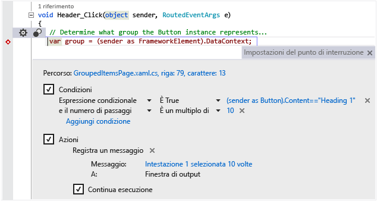

# IDE di Visual Studio
Microsoft Visual Studio 2017 RC è una suite di strumenti per la creazione di software, dalla fase di pianificazione fino alla progettazione dell'interfaccia utente, la codifica, i test, il debug, l'analisi della qualità del codice e delle prestazioni, la distribuzione ai clienti e la raccolta di dati di telemetria sull'utilizzo. Questi strumenti sono progettati per integrarsi perfettamente e sono tutti esposti tramite Visual Studio Integrated Development Environment (IDE).  

 Visual Studio può essere usato per creare diversi tipi di applicazioni, da semplici applicazioni e giochi dello Store per client mobili a sistemi complessi per aziende e data center. È possibile creare  

 - app e giochi non solo per Windows, ma anche per Android e iOS.

 - siti e servizi Web basati su ASP.NET, JQuery, AngularJS e altri framework comuni.

 - applicazioni destinate a diversi tipi di piattaforme e dispositivi, ad esempio Azure, Office, Sharepoint, Hololens, Kinect e Internet of Things, per citare solo alcuni esempi.

 - giochi e applicazioni ad uso intensivo di grafica per un'ampia gamma di dispositivi Windows, tra cui Xbox, con DirectX.

 Per impostazione predefinita, Visual Studio offre supporto per C#, C e C++, JavaScript, F# e Visual Basic. Visual Studio funziona e si integra bene con Xamarin usando [Xamarin per Visual Studio](https://www.xamarin.com/visual-studio) e con applicazioni di terze parti come Unity, usando gli [strumenti di Visual Studio per Unity](../cross-platform/visual-studio-tools-for-unity.md), e con Apache Cordova usando gli [strumenti di Visual Studio Apache Cordova](../misc/get-started-with-visual-studio-tools-for-apache-cordova2.md). È possibile estendere manualmente Visual Studio creando strumenti personalizzati in grado di eseguire attività specializzate con [Visual Studio SDK](../extensibility/visual-studio-sdk.md).

## Novità
 Se non si è mai usato Visual Studio in precedenza, apprendere le nozioni di base iniziando dalla [Guida introduttiva allo sviluppo con Visual Studio](../ide/get-started-with-visual-studio.md) .
Per informazioni sulle nuove funzionalità di Visual Studio 2017 RC, vedere [Novità di Visual Studio 2017 RC](../ide/whats-new-in-visual-studio.md).

## Installare Visual Studio
 Per sapere qual è l'edizione di Visual Studio più adatta alle proprie esigenze, vedere [Prodotti Visual Studio](https://www.visualstudio.com/products/).

 Per installare Visual Studio 2017 RC, scaricarlo dalla pagina [Download di Visual Studio](https://www.visualstudio.com/vs/). Per altre informazioni sul processo di installazione, vedere [Installazione di Visual Studio 2017 RC](https://go.microsoft.com/fwlink/?linkid=833223).

## Panoramica delle funzionalità dell'IDE
 Nell'immagine seguente è visualizzato l'IDE di Visual Studio con un progetto aperto e diverse finestre degli strumenti chiave.
 - [Esplora soluzioni](../ide/solutions-and-projects-in-visual-studio.md) consente di visualizzare ed esplorare i file del codice.
 - [Team Explorer](https://www.visualstudio.com/en-us/docs/connect/work-team-explorer) consente di tenere traccia degli elementi di lavoro e di condividere il codice con altri utenti usando tecnologie di controllo della versione come [Git](https://git-scm.com/) e [Team Foundation Version Control (TFVC)](https://www.visualstudio.com/en-us/docs/tfvc/overview).
 - [Cloud Explorer](https://azure.microsoft.com/en-us/documentation/articles/vs-azure-tools-resources-managing-with-cloud-explorer/) consente di visualizzare e gestire le risorse di Azure, ad esempio macchine virtuali, tabelle, database SQL e altro ancora.
 - La finestra [Editor](../ide/writing-code-in-the-code-and-text-editor.md) consente di visualizzare e modificare il codice sorgente e i dati di progettazione.
 - La finestra [Output](../ide/reference/output-window.md) visualizza l'output di compilazione, esecuzione, debug e altro ancora.

   

 ### Accedi
  Quando si avvia Visual Studio per la prima volta, è possibile accedere usano l'account Microsoft o l'account aziendale o dell'istituto di istruzione. L'accesso consente di sincronizzare le impostazioni, ad esempio i layout delle finestre, tra più dispositivi e di connettersi automaticamente ai servizi richiesti, ad esempio gli abbonamenti di Azure e Visual Studio Team Services. Se si ha una licenza basata sulla sottoscrizione, è necessario accedere a Visual Studio a intervalli regolari per mantenere aggiornati i token di licenza. Se si ha una licenza con codice Product Key, l'accesso non è necessario, ma consente di connettersi più facilmente a Visual Studio Team Services e agli account con Azure, Office 365, Salesforce.com. Per altre informazioni, vedere [Accesso a Visual Studio](../ide/signing-in-to-visual-studio.md).

  Se si hanno più account di Visual Studio Team Services, account di Azure o sottoscrizioni MSDN, è possibile collegarli e accedere alle risorse e ai servizi in tutti gli account con un unico accesso. Per altre informazioni, vedere l'articolo [Usare più account utente](../ide/work-with-multiple-user-accounts.md).

 ### Rimanere aggiornati
  L'icona di notifica a forma di bandierina nell'angolo superiore della barra del titolo segnala la disponibilità di aggiornamenti per Visual Studio o per i relativi componenti installati. È possibile scegliere se ignorare queste notifiche o eseguire gli aggiornamenti. Per altre informazioni, vedere [Notifiche di Visual Studio](../ide/visual-studio-notifications.md).

 ### Trovare elementi e ottenere assistenza
  La finestra [Avvio veloce](../ide/reference/quick-launch-environment-options-dialog-box.md), evidenziata con i bordi rossi nell'immagine che segue, consente di trovare rapidamente comandi, strumenti, funzionalità e altri elementi di Visual Studio quando non si conoscono i tasti di scelta rapida o il percorso del menu. È sufficiente digitare la propria ricerca per ottenere un collegamento da Avvio veloce.

 

 In Visual Studio è possibile premere **F1** per passare alla pagina della Guida per la finestra attiva. È anche possibile premere **F1** nell'editor del codice per passare alla pagina della Guida per l'API o la parola chiave nella posizione corrente del cursore. In un file C#, ad esempio, posizionare il cursore all'interno o alla fine di una dichiarazione `System.String` e premere **F1** per passare alla pagina della Guida per [String](assetId:///T:System.String?qualifyHint=False&autoUpgrade=True).

### Inviare commenti e suggerimenti
 In Visual Studio i commenti e i suggerimenti possono essere inseriti in modo facile e in qualsiasi momento. Fare clic sull'icona relativa ai commenti sulla barra del titolo accanto a **Avvio veloce** , quindi su **Segnala un problema** o **Suggerimento**.

 Le edizioni provvisorie di Visual Studio offrono anche un'opzione **Valuta questo prodotto** . Microsoft esaminerà questi commenti e li userà per migliorare il prodotto. Per altre informazioni, vedere [Comunicazioni con Microsoft](../ide/talk-to-us.md).

### Personalizzare l'IDE
 È possibile personalizzare il layout della finestra per adattarlo al proprio stile di sviluppo. È possibile ancorare, rendere mobili o nascondere tutte le finestre in qualsiasi momento ed è anche possibile eseguire l'editor in modalità schermo intero. È possibile creare e salvare più layout di finestra personalizzati che visualizzano solo le finestre necessarie per contesti specifici. Ad esempio, si può creare un layout a schermo intero in modo che venga visualizzato solo l'editor di codice. Inoltre, si possono creare diversi layout per il debug e per le operazioni del team. Per altre informazioni, vedere [Personalizzazione del layout delle finestre](../ide/customizing-window-layouts-in-visual-studio.md).

 È possibile personalizzare Visual Studio in molti altri modi ed eseguire il roaming delle impostazioni se si lavora su più computer. Per altre informazioni, vedere [Personalizzazione dell'IDE](../ide/personalizing-the-visual-studio-ide.md).

 Per quasi tutte le funzioni sono disponibili scelte rapide da tastiera che è anche possibile personalizzare. Per creare nuove scelte rapide, digitare "Tastiera" in Avvio veloce per aprire la finestra di dialogo della tastiera. Per altre informazioni sulle opzioni, premere F1 per passare alla pagina della Guida. Per altre informazioni, vedere [Tasti di scelta rapida predefiniti in Visual Studio](../ide/default-keyboard-shortcuts-in-visual-studio.md).

## Connessione a Visual Studio Team Services e Team Foundation Server
  Visual Studio Team Services (VSTS) è un servizio basato sul cloud progettato per ospitare progetti software e consentire la collaborazione nei team. Visual Studio Team Services supporta sistemi Git e di controllo del codice sorgente di Team Foundation, nonché metodologie di sviluppo Scrum, CMMI e Agile. Controllo della versione di Team Foundation (TFVC) usa un unico repository del server centralizzato per tenere traccia e gestire le versioni dei file. Le modifiche locali vengono sempre archiviate nel server centrale, in modo che gli altri sviluppatori possano disporre delle modifiche più recenti. Team Foundation Server (TFS) 2015 è l'hub di gestione del ciclo di vita delle applicazioni per Visual Studio. Consente a tutte le parti interessate di partecipare al processo di sviluppo usando un'unica soluzione. TFS è utile anche per la gestione di team e progetti eterogenei.

  Se si ha un account di Visual Studio Team Services o di Team Foundation Server nella rete, è possibile connettersi tramite la finestra Team Explorer. Da questa finestra è possibile archiviare o estrarre il codice dal controllo del codice sorgente, gestire gli elementi di lavoro, avviare le compilazioni e accedere alle chat team e alle aree di lavoro. Per aprire Team Explorer usare **Avvio veloce** o il menu principale da **Visualizza, Team Explorer** o da **Team, Gestisci connessioni**.  Per altre informazioni su Visual Studio Team Services, vedere [www.visualstudio.com](https://www.visualstudio.com/). Per altre informazioni su Team Foundation Server, vedere [Team Foundation Server](https://www.visualstudio.com/products/tfs-overview-vs).

  L'immagine seguente mostra il riquadro Team Explorer per una soluzione ospitata in Visual Studio Team Services:

   

## Creare soluzioni e progetti
  Sebbene sia possibile usare Visual Studio per esplorare i singoli file di codice, di solito viene usato su *progetti*. Un progetto Visual Studio è una raccolta di file e risorse che vengono compilati in un file eseguibile binario singolo per le applicazioni (ad esempio con estensione EXE, DLL, APPX). Per i siti Web non ASP.NET non vengono generati file eseguibili e il progetto contiene solo i file HTML, JavaScript e le immagini. Poiché in alcuni casi potrebbe essere necessario creare più file binari o siti Web strettamente correlati, in Visual Studio è presente il concetto di "soluzione", che può contenere più progetti o siti Web. Un progetto, in realtà, viene creato all'interno di una soluzione, alla quale è possibile aggiungere altri progetti successivamente, se necessario. Ad esempio, se si ha un progetto DLL, è possibile aggiungere un progetto EXE alla soluzione che carica e utilizza il file DLL.

  Un *modello di progetto* è una raccolta di file di codice e di impostazioni di configurazione già popolati che velocizza il processo di creazione di un tipo specifico di applicazione. Visual Studio viene fornito con molti modelli di progetto da cui scegliere e, se nessuno dei modelli predefiniti è adatto alle proprie esigenze, è possibile crearne di personalizzati. Dopo aver creato un progetto con un modello, è possibile iniziare a scrivere il proprio codice nei file forniti o nei nuovi file aggiunti. Per altre informazioni, vedere [Soluzioni e progetti](../ide/solutions-and-projects-in-visual-studio.md). La figura seguente mostra la finestra di dialogo Nuovo progetto con i modelli di progetto disponibili per le applicazioni ASP.NET.

   

## Scrivere, esplorare e approfondire il codice  
 È probabile che la finestra dell'editor sarà la finestra più usata dagli sviluppatori. Visual Studio include il supporto predefinito per la modifica per C#, C++, Visual Basic, F #, JavaScript, TypeScript, XML, HTML e CSS. Visual Studio supporta anche la modifica e la compilazione per molti altri linguaggi.

 È possibile modificare singoli file nell'editor di testo scegliendo **File, Apri, File**. Per modificare i file in un progetto aperto, scegliere e aprire il file in Esplora soluzioni. Il codice viene colorato ed è possibile personalizzare la combinazione di colori digitando "Colori" in Avvio veloce. È possibile avere diverse finestre a schede dell'editor di testo aperte allo stesso momento. È possibile suddividere ogni finestra in modo indipendente. È anche possibile eseguire l'editor di testo in modalità schermo intero.  

   

 L'editor di testo ha un alto livello di interazione (se richiesto) e molte funzionalità per la produttività che consentono di scrivere codice in modo più rapido ed efficace. Le funzionalità variano in base al linguaggio e non è necessario usare alcun linguaggio (digitando "Editor" in Avvio veloce) per attivarle o disattivarle. Alcune delle funzionalità di produttività usate più di frequente sono:  

-  [Refactoring](../ide/refactoring-in-visual-studio.md) include operazioni come la ridenominazione intelligente delle variabili, lo spostamento delle righe di codice selezionate in funzioni separate, lo spostamento di codice in altre posizioni, il riordinamento dei parametri di funzione e altro ancora.

    

-  **IntelliSense** è un termine generico che comprende diverse funzionalità comuni che visualizzano le informazioni sul tipo di codice direttamente nell'editor e, in alcuni casi, scrivono automaticamente piccole parti di codice. È come se si avesse a disposizione la documentazione di base all'interno dell'editor, senza dover cercare le informazioni sul tipo in una finestra della Guida separata. Le funzionalità di IntelliSense variano a seconda del linguaggio. Per altre informazioni, vedere [Visual C# IntelliSense](../ide/visual-csharp-intellisense.md), [Visual C++ Intellisense](../ide/visual-cpp-intellisense.md), [JavaScript IntelliSense](../ide/javascript-intellisense.md), [Visual Basic-Specific IntelliSense](../ide/visual-basic-specific-intellisense.md). La figura seguente illustra alcune funzionalità di IntelliSense:  

       

-  **Linee a zigzag** : segnalano errori o potenziali problemi nel codice in tempo reale durante la digitazione e consentono di risolverli immediatamente senza attendere che vengano rilevati durante la fase di compilazione o di esecuzione. Se si passa il mouse su una linea a zigzag, vengono visualizzate informazioni aggiuntive sull'errore. Sul margine sinistro può essere visualizzata anche una lampadina con i suggerimenti su come risolvere l'errore. Per altre informazioni, vedere [Eseguire azioni rapide con le lampadine](../ide/perform-quick-actions-with-light-bulbs.md).  

    

-  I [segnalibri](../ide/setting-bookmarks-in-code.md) consentono di passare rapidamente a righe specifiche dei file in uso.

    

-  Nel menu di scelta rapida dell'editor di testo è possibile richiamare la finestra [Gerarchia di chiamata](../ide/reference/call-hierarchy.md) per visualizzare i metodi che chiamano e vengono chiamati dal metodo sotto il cursore.

    

-  **CodeLens** consente di trovare i riferimenti e le modifiche al codice, i bug collegati, gli elementi di lavoro, le revisioni del codice e gli unit test senza uscire dall'editor.

    

  Per altre informazioni, vedere [Trovare le modifiche apportate al codice e altri elementi della cronologia](../ide/find-code-changes-and-other-history-with-codelens.md).  

-  La finestra **Visualizza definizione** mostra un metodo o una definizione di tipo inline senza uscire dal contesto corrente. Questa finestra ora funziona anche con XAML.  

    

-  L'opzione del menu di scelta rapida **Vai a definizione** visualizza direttamente la posizione in cui è definita la funzione o l'oggetto. Facendo clic con il pulsante destro del mouse nell'editor sono disponibili anche altri comandi di spostamento.

    

- Uno strumento correlato, [Visualizzatore oggetti](http://msdn.microsoft.com/en-us/f89acfc5-1152-413d-9f56-3dc16e3f0470), consente di controllare gli assembly .NET o Windows Runtime nel sistema per vedere quali tipi contengono e quali metodi e proprietà contengono questi tipi.  

       

 Molte voci dei menu Modifica e Visualizza sono collegate in qualche modo all'editor di codice. Per altre informazioni sull'editor, vedere [Scrittura di codice nell'editor di testo e del codice](../ide/writing-code-in-the-code-and-text-editor.md) e [Modifica del codice](https://www.visualstudio.com/features/ide-vs).  

## Creare e compilare il codice  
 Creare un progetto significa compilare il codice sorgente ed eseguire tutti i passaggi necessari per generare il file eseguibile. I diversi linguaggi hanno operazioni di compilazione distinte, mentre i normali siti Web non vengono compilati. Indipendentemente dal tipo di progetto, il menu **Compila** è la posizione standard in cui si trovano questi comandi. Per compilare ed eseguire il codice con un'unica operazione, premere il tasto F5. Ogni compilatore può essere completamente configurato tramite l'IDE. La barra degli strumenti di compilazione consente di specificare se si vuole creare una versione di debug del programma, con simboli e controllo degli errori aggiuntivo abilitato per supportare i punti di interruzione e l'esecuzione di istruzioni singole nel debugger, oppure una build di rilascio, ossia ciò che viene effettivamente fornito agli utenti al termine della compilazione. Nella pagina delle proprietà di un progetto è possibile configurare ulteriori impostazioni di compilazione e di altro tipo. Scegliere il menu contestuale (pulsante destro del mouse) del nodo del progetto in Esplora soluzioni, quindi il comando Proprietà. Le compilazioni possono essere eseguite anche dalla riga di comando.  

 L'output della compilazione, inclusi i messaggi di errore o di completamento, viene visualizzato nella finestra di output. L'Elenco errori (visualizzato di seguito) contiene informazioni dettagliate sugli errori di compilazione.  

   

## Eseguire il debug del codice  
 Il debugger all'avanguardia di Visual Studio consente di eseguire il debug del codice in esecuzione nel progetto locale, in un dispositivo remoto o in un emulatore, ad esempio quelli per dispositivi Android o Windows Phone. È possibile esaminare il codice un'istruzione alla volta e controllare le variabili man mano, eseguire applicazioni multithread e impostare punti di interruzione raggiunti solo quando una determinata condizione è true. È possibile monitorare i valori delle variabili durante l'esecuzione del codice. Tutte queste funzionalità possono essere gestite nell'editor di codice, senza uscire dal contesto del codice.  

   

 Il debugger stesso ha a disposizione più finestre che consentono di visualizzare e modificare le variabili locali, lo stack di chiamate e altri aspetti dell'ambiente di runtime. Le finestre sono disponibili nel menu **Debug** .  

 La [finestra di controllo immediato](../ide/reference/immediate-window.md) consente di digitare un'espressione e visualizzare immediatamente il risultato.

 La finestra [IntelliTrace](../debugger/intellitrace.md) registra ogni chiamata di metodo e altri eventi in un programma .NET in esecuzione e aiuta a individuare rapidamente la causa di un problema.

 Per altre informazioni, vedere [Debug in Visual Studio](../debugger/debugging-in-visual-studio.md).  

## Eseguire test del codice  
 Visual Studio include un framework unit test per il codice gestito (.NET) e uno per C++ nativo. Per creare gli unit test, aggiungere semplicemente un progetto di test alla soluzione, scrivere i test, quindi eseguirli nella finestra Esplora test. Per altre informazioni, vedere [Eseguire unit test del codice](../test/unit-test-your-code.md).  

   

## Analizzare le prestazioni e la qualità del codice  
 Visual Studio include potenti strumenti per l'analisi statica e di runtime. Gli strumenti di analisi statica consentono di identificare potenziali errori di progettazione, globalizzazione, interoperabilità, prestazioni, sicurezza e altre categorie. Il test delle prestazioni, o profilatura, comporta la misurazione della modalità di esecuzione del programma. Per accedere a questi strumenti, usare il menu **Analizza** . Per altre informazioni, vedere [Miglioramento della qualità con gli strumenti di diagnostica di Visual Studio](../test/improve-code-quality.md).  

## Connessione ai database e ai servizi cloud  
 Lo strumento [Cloud Explorer](https://azure.microsoft.com/en-us/documentation/articles/vs-azure-tools-resources-managing-with-cloud-explorer/) in Visual Studio visualizza le risorse di Azure in tutti gli account gestiti con la sottoscrizione Azure a cui si è connessi. Per avere Cloud Explorer è necessario installare [Azure SDK](https://azure.microsoft.com/en-us/downloads/).

 

 [Esplora server](https://msdn.microsoft.com/en-us/library/cd2cz7yy.aspx) è disponibile anche per esplorare e gestire le istanze e le risorse di SQL Server in Azure, Salesforce.com, Office 365 e siti Web.

 Visual Studio include [Microsoft SQL Server Data Tools](https://msdn.microsoft.com/en-us/data/tools.aspx) (SSDT), che consente di compilare, eseguire il debug, mantenere ed eseguire il refactoring dei database. È possibile usare un progetto di database o direttamente un'istanza del database connesso locale o remota.  

 [Esplora oggetti di SQL Server in Visual Studio](https://msdn.microsoft.com/en-us/library/hh231250.aspx) offre una visualizzazione degli oggetti di database simile a quella di SQL Server Management Studio. Esplora oggetti di SQL Server consente di eseguire operazioni semplici di progettazione e amministrazione del database, tra cui la modifica dei dati della tabella, il confronto di schemi e l'esecuzione di query, usando i menu di scelta rapida direttamente da Esplora oggetti di SQL Server. SQL Server Data Tools include anche strumenti e tipi di progetto specifici per lo sviluppo di SQL Server 2012 Analysis Services, Reporting Services e soluzioni di Integration Services Business Intelligence (precedentemente noto come Business Intelligence Development Studio).  

   

## Distribuire l'applicazione completata  
 Quando l'applicazione è pronta per la distribuzione ai clienti, Visual Studio fornisce gli strumenti appropriati, a seconda che si tratti di una distribuzione per Windows Store, per un sito Sharepoint o tramite tecnologie InstallShield o Windows Installer. Tutti gli strumenti sono accessibili dall'IDE. Per altre informazioni, vedere [Distribuzione di applicazioni, servizi e componenti](../deployment/deploying-applications-services-and-components.md).  

## Strumenti di architettura e modellazione (solo Enterprise)  
 È possibile usare gli strumenti di architettura e modellazione di Visual Studio per progettare e modellare l'applicazione. Questi strumenti consentono di visualizzare la struttura, il comportamento e le relazioni del codice. È possibile creare modelli con diversi livelli di dettaglio in tutto il ciclo di vita dell'applicazione nel contesto del processo di sviluppo. È possibile tenere traccia di requisiti, attività, test case, bug e altre operazioni associate ai modelli collegando gli elementi del modello agli elementi di lavoro di Team Foundation Server e al piano di sviluppo. Per altre informazioni, vedere [Progettare e modellare l'applicazione](../modeling/analyze-and-model-your-architecture.md).  

## Estendere Visual Studio con Visual Studio SDK  
 Visual Studio è una piattaforma estendibile. Un'estensione di Visual Studio è uno strumento personalizzato che si integra con l'IDE. È possibile aggiungere estensioni di terze parti o crearne di proprie. Per altre informazioni, vedere [Sviluppo di estensioni di Visual Studio](../extensibility/starting-to-develop-visual-studio-extensions.md).  

 Le [Linee guida sull'esperienza utente di Visual Studio](../extensibility/ux-guidelines/visual-studio-user-experience-guidelines.md) costituiscono un riferimento essenziale per chiunque scriva estensioni per Visual Studio. Queste linee guida specifiche della piattaforma includono informazioni sulla progettazione di finestre di dialogo, tipi di carattere, colori, icone, controlli comuni e altri modelli di interazione che consentono l’integrazione della nuova funzionalità con Visual Studio.  

## Vedere anche  
 [Installazione di Visual Studio 2017 RC](../install/install-visual-studio.md)   
 [Modifica del codice](https://www.visualstudio.com/features/ide-vs)   
 [Novità di Visual Studio 2017 RC](../ide/whats-new-in-visual-studio.md)   
 [Portabilità, migrazione e aggiornamento dei progetti di Visual Studio](../porting/porting-migrating-and-upgrading-visual-studio-projects.md)   
 [Comunicazioni con Microsoft](../ide/talk-to-us.md)

<!--HONumber=Feb17_HO4-->

