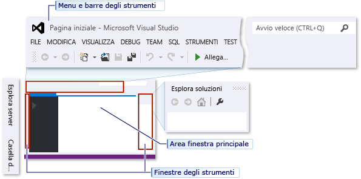
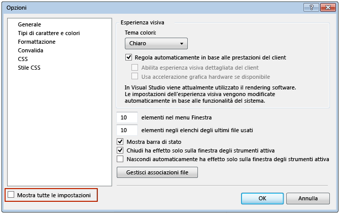
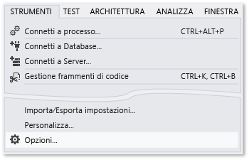
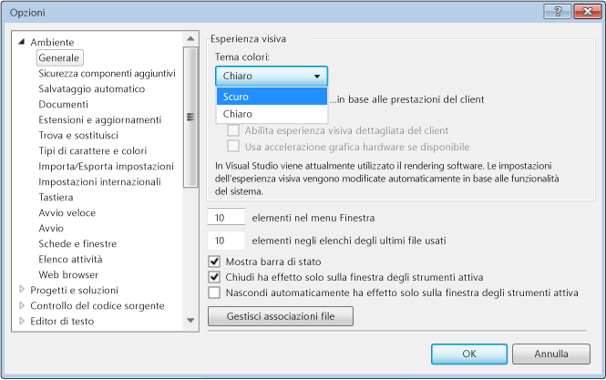
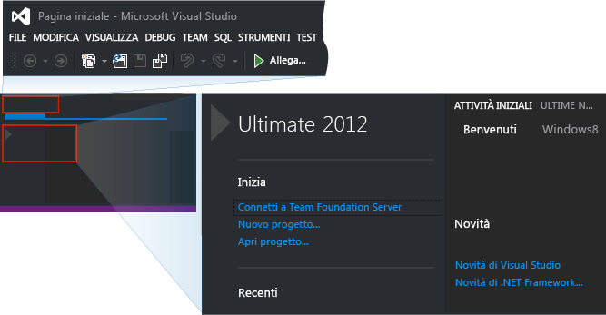
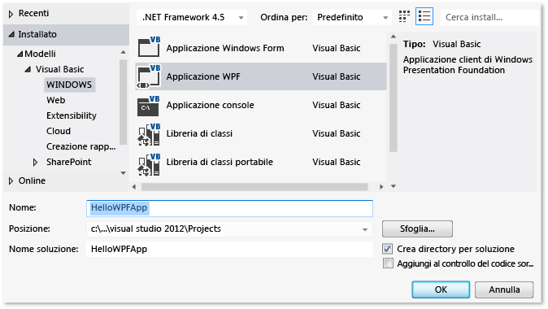
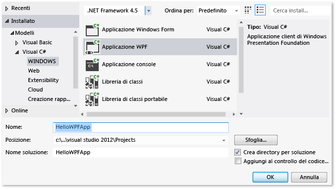
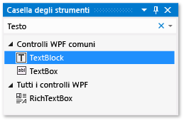
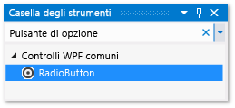
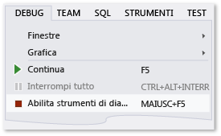

# <a name="walkthrough-create-a-simple-application-with-visual-c-or-visual-basic"></a>Procedura dettagliata: creare un'applicazione semplice con Visual C# o Visual Basic
Completando questa procedura dettagliata, si acquisirà familiarità con molti strumenti, finestre di dialogo e finestre di progettazione che è possibile usare quando si sviluppano applicazioni con Visual Studio. Durante la procedura gli utenti potranno creare una semplice applicazione in stile "Hello, World", progettare l'interfaccia utente, aggiungere codice ed eseguire il debug degli errori, acquisendo al contempo ulteriori informazioni su come lavorare in IDE (Integrated Development Environment).  
  
 Di seguito sono elencate le diverse sezioni di questo argomento:  
  
 [Configurare IDE](../ide/walkthrough-create-a-simple-application-with-visual-csharp-or-visual-basic.md#BKMK_ConfigureIDE)  
  
 [Creare una semplice applicazione](../ide/walkthrough-create-a-simple-application-with-visual-csharp-or-visual-basic.md#BKMK_CreateApp)  
  
 [Eseguire il debug e il test dell'applicazione](../ide/walkthrough-create-a-simple-application-with-visual-csharp-or-visual-basic.md#BKMK_DebugTest)  
  
> [!NOTE]
>  Questa procedura dettagliata è basata su Visual Studio Professional, che offre il modello Applicazione WPF in cui compilare il progetto. Il modello è disponibile anche in Visual Studio Express per Windows Desktop, ma non in Visual Studio Express per Windows e Visual Studio Express per il Web. Per informazioni introduttive su come usare Visual Studio Express per Windows, visitare il [Centro per sviluppatori per app di Windows Store](http://msdn.microsoft.com/windows/apps/br229519). Per informazioni introduttive su come usare Visual Studio Express per il Web, vedere [Get Started with ASP.NET](http://www.asp.net/get-started)(Introduzione ad ASP.NET). Inoltre, l'edizione di Visual Studio e le impostazioni usate determinano i nomi e le posizioni di alcuni elementi dell'interfaccia utente. Vedere [Personalizzare l'IDE di Visual Studio](../ide/personalizing-the-visual-studio-ide.md).  
  
##  <a name="BKMK_ConfigureIDE"></a> Configurare IDE  
 Quando si avvia Visual Studio per la prima volta, viene chiesto di effettuare l'accesso con un Account di servizio Microsoft (MSA). Per informazioni, vedere [Sign into Visual Studio](http://blogs.msdn.com/b/visualstudio/archive/2013/06/28/welcome-sign-in-to-visual-studio.aspx)(Accedere a Visual Studio). Non è necessario accedere adesso ed è possibile farlo in seguito.  
  
 All'avvio di Visual Studio, scegliere quindi una combinazione di impostazioni che applichi un set di personalizzazioni predefinite all'IDE. Ogni combinazione di impostazioni è stata progettata per semplificare lo sviluppo di applicazioni.  
  
 In questa procedura dettagliata si presume che sia stata applicata l'opzione **Impostazioni generali per lo sviluppo**, che richiede la quantità minima di personalizzazione possibile per IDE. Se si è già scelto C# o Visual Basic (entrambi costituiscono un'ottima scelta), non è necessario modificare le impostazioni.  Se si vogliono modificare le impostazioni, è possibile usare l' **Importazione/Esportazione guidata delle impostazioni**. Vedere [Personalizzare l'IDE di Visual Studio](../ide/personalizing-the-visual-studio-ide.md).  
  
 Dopo aver aperto Visual Studio, sarà possibile identificare la finestre degli strumenti, i menu, le barre degli strumenti e lo spazio della finestra principale. Le finestre degli strumenti sono ancorate ai lati sinistro e destro della finestra dell'applicazione, con **Avvio veloce**, la barra dei menu e la barra degli strumenti standard nella parte superiore. Al centro della finestra dell'applicazione si trova **Pagina iniziale**. Quando si carica una soluzione o un progetto, gli editor e le finestre di progettazione vengono visualizzati nello spazio in cui si trova la **pagina iniziale** . Quando si sviluppa un'applicazione, la maggior parte del tempo verrà dedicata a questa area centrale.  
  
 Figura 2: IDE di Visual Studio  
  
   
  
 È possibile apportare personalizzazioni aggiuntive a Visual Studio, ad esempio modificare il tipo di carattere e la dimensione del testo nell'editor o il tema di colore di IDE, mediante la finestra di dialogo **Opzioni** . A seconda della combinazione di impostazioni applicata, alcuni elementi della finestra di dialogo potrebbero non essere visualizzati automaticamente. È possibile assicurarsi che tutte le opzioni possibili vengano visualizzate selezionando la casella di controllo **Mostra tutte le impostazioni** .  
  
 Figura 3: finestra di dialogo Opzioni  
  
   
  
 In questo esempio verrà modificato il tema colori dell'IDE da chiaro a scuro.  È possibile passare direttamente alla creazione di un progetto.  
  
#### <a name="to-change-the-color-theme-of-the-ide"></a>Per modificare il tema colori di IDE  
  
1.  Aprire la finestra di dialogo **Opzioni** scegliendo il menu **Strumenti** nella parte superiore e quindi l'elemento **Opzioni**.  
  
       
  
2.  Modificare **Tema colori** in **Scuro**, quindi scegliere **OK**.  
  
       
  
 I colori in Visual Studio devono corrispondere all'immagine seguente:  
  
   
  
 Il tema colori usato per le immagini nel resto di questa procedura dettagliata è Chiaro. Per altre informazioni sulla personalizzazione dell'IDE, vedere [Personalizzare l'IDE di Visual Studio](../ide/personalizing-the-visual-studio-ide.md).  
  
##  <a name="BKMK_CreateApp"></a> Creare una semplice applicazione  
  
### <a name="create-the-project"></a>Creare il progetto  
 Quando si crea un'applicazione in Visual Studio, è innanzitutto necessario creare un progetto e una soluzione. In questo esempio verrà creato un progetto Windows Presentation Foundation (WPF).  
  
##### <a name="to-create-the-wpf-project"></a>Per creare il progetto WPF  
  
1.  Creare un nuovo progetto. Nella barra dei menu scegliere **File**, **Nuovo**, **Progetto**.  
  
       
  
     È inoltre possibile digitare **Nuovo progetto** nella casella **Avvio veloce** per eseguire la stessa operazione.  
  
       
  
2.  Scegliere il modello applicazione WPF in Visual Basic o Visual C# selezionando nel riquadro a sinistra **Installato**, **Modelli**, **Visual C#**, **Windows**, ad esempio, e quindi selezionando Applicazione WPF nel riquadro centrale.  Denominare il progetto HelloWPFApp nella parte inferiore della finestra di dialogo Nuovo progetto.  
  
       
  
     OR  
  
       
  
 Visual Studio crea il progetto e la soluzione HelloWPFApp e in **Esplora soluzioni** vengono visualizzati i vari file. In WPF Designer vengono illustrate una visualizzazione Progettazione e una visualizzazione XAML suddivise di MainWindow.xaml. È possibile far scorrere la barra di divisione in modo da mostrare più o meno elementi in ciascuna visualizzazione.  È possibile scegliere di visualizzare solo la visualizzazione degli elementi visivi o solo la visualizzazione XAML. Per altre informazioni, vedere [Progettazione WPF per gli sviluppatori di Windows Form](http://msdn.microsoft.com/en-us/47ad0909-e89b-4996-b4ac-874d929f94ca). In **Esplora soluzioni**vengono visualizzati gli elementi indicati di seguito.  
  
 Figura 5: elementi di progetto  
  
   
  
 Dopo aver creato il progetto, sarà possibile personalizzarlo. Nella finestra **Proprietà** (disponibile nel menu **Visualizzazione** ) è possibile visualizzare e modificare le opzioni per elementi di progetto, controlli e altri elementi in un'applicazione. Utilizzando le proprietà del progetto e le pagine delle proprietà, è possibile visualizzare e modificare le opzioni per progetti e soluzioni.  
  
##### <a name="to-change-the-name-of-mainwindowxaml"></a>Per cambiare il nome di MainWindow.xaml  
  
1.  Nella procedura illustrata di seguito verrà assegnato a MainWindow un nome più specifico. In **Esplora soluzioni**selezionare MainWindow.xaml. Dovrebbe essere visualizzata la finestra **Proprietà**, ma qualora non lo fosse scegliere il menu **Visualizzazione** e l'elemento **Finestra Proprietà**. Cambiare la proprietà **Nome file** in `Greetings.xaml`.  
  
       
  
     In**Esplora soluzioni** è possibile notare che il nome del file è ora Greetings.xaml e, se si espande il nodo di MainWindow.xaml (premendo il tasto freccia destra con il nodo attivo), il nome del file MainWindow.xaml.vb o MainWindow.xaml.cs è ora Greetings.xaml.vb o Greetings.xaml.cs. Questo file di codice è annidato sotto il nodo del file con estensione xaml per mostrare che sono strettamente correlati tra loro.  
  
    > [!WARNING]
    >  Questa modifica genera un errore che verrà sottoposto a debug e corretto in un passaggio successivo.  
  
2.  In **Esplora soluzioni**, aprire Greetings.xaml nella finestra di progettazione, premendo il tasto INVIO quando il nodo è attivo e selezionare la barra del titolo della finestra usando il mouse.  
  
3.  Nella finestra **Proprietà** modificare il valore della proprietà **Titolo** in `Greetings`.  
  
 La barra del titolo per MainWindow.xaml indica ora Greetings.  
  
### <a name="design-the-user-interface-ui"></a>Progettare l'interfaccia utente  
 Verranno aggiunti tre tipi di controlli all'applicazione: un controllo TextBlock, due controlli RadioButton e un controllo Button.  
  
##### <a name="to-add-a-textblock-control"></a>Per aggiungere un controllo TextBlock  
  
1.  Aprire la finestra **Casella degli strumenti** scegliendo il menu **Visualizzazione** e l'elemento **Casella degli strumenti** .  
  
2.  Nella **Casella degli strumenti**cercare il controllo TextBlock.  
  
       
  
3.  Aggiungere un controllo TextBlock all'area di progettazione scegliendo l'elemento TextBlock e trascinandolo nell'area di progettazione nella finestra.  Centrare il controllo nella parte superiore della finestra.  
  
 La finestra dovrebbe essere simile a quella illustrata nella figura di seguito.  
  
 Figura 7: finestra Greetings con il controllo TextBlock  
  
   
  
 Il markup XAML dovrebbe essere analogo a quello indicato di seguito.  
  
```  
<TextBlock HorizontalAlignment="Center" TextWrapping="Wrap" VerticalAlignment="Center" RenderTransformOrigin="4.08,2.312" Margin="237,57,221,238"><Run Text="TextBlock"/><InlineUIContainer><TextBlock TextWrapping="Wrap" Text="TextBlock"/>  
```  
  
##### <a name="to-customize-the-text-in-the-text-block"></a>Per personalizzare il testo nel blocco  
  
1.  Nella visualizzazione XAML individuare il markup di TextBlock e modificare l'attributo Text: `Text="Select a message option and then choose the Display button."`  
  
2.  Se TextBlock non si espande in modo da adattarsi alla visualizzazione Progettazione, ingrandire il controllo TextBlock (usando i punti di controllo sui bordi) in modo che venga visualizzato tutto il testo.  
  
3.  Salvare le modifiche premendo CTRL + S oppure usando la voce di menu **File** .  
  
 Verranno successivamente aggiunti due controlli [RadioButton](/dotnet/framework/wpf/controls/radiobutton) al form.  
  
##### <a name="to-add-radio-buttons"></a>Per aggiungere pulsanti di opzione  
  
1.  Nella **Casella degli strumenti**cercare il controllo RadioButton.  
  
       
  
2.  Aggiungere due controlli RadioButton all'area di progettazione scegliendo l'elemento RadioButton e trascinandolo nella finestra nell'area di progettazione due volte, quindi spostare i pulsanti (a tale scopo, selezionarli e usare i tasti di direzione) in modo che i pulsanti vengano visualizzati affiancati sotto il controllo TextBlock.  
  
     La finestra dovrebbe risultare simile alla seguente:  
  
     Figura 8: RadioButtons nella finestra Greetings.  
  
       
  
3.  Nella finestra **Proprietà** per il controllo RadioButton sinistro modificare la proprietà **Nome** (la proprietà nella parte superiore della finestra **Proprietà** ) in `RadioButton1`.  Assicurarsi di aver selezionato il controllo RadioButton e non la griglia sullo sfondo nel modulo: nel campo Tipo della finestra Proprietà sotto il campo Nome si dovrà leggere RadioButton.  
  
4.  Nella finestra **Proprietà** per il controllo RadioButton di destra, impostare la proprietà **Nome** su `RadioButton2`e quindi salvare le modifiche premendo CTRL + S oppure usando la voce di menu **File** .  Assicurarsi di selezionare il controllo RadioButton prima di modificare e salvare.  
  
 È ora possibile aggiungere il testo visualizzato per ogni controllo RadioButton. Nella procedura seguente verrà aggiornata la proprietà **Contenuto** per un controllo RadioButton.  
  
##### <a name="to-add-display-text-for-each-radio-button"></a>Per aggiungere testo visualizzato per ogni pulsante di opzione  
  
1.  Nell'area di progettazione, aprire il menu di scelta rapida per RadioButton1 premendo il pulsante destro del mouse mentre si seleziona RadioButton1, scegliere **Modifica testo**, quindi immettere `Hello`.  
  
2.  Aprire il menu di scelta rapida per RadioButton2 premendo il pulsante destro del mouse mentre si seleziona RadioButton2, scegliere **Modifica testo**, quindi immettere `Goodbye`.  
  
 L'elemento finale dell'interfaccia utente da aggiungere è un controllo [Button](/dotnet/framework/wpf/controls/button).  
  
##### <a name="to-add-the-button-control"></a>Per aggiungere il controllo del pulsante  
  
1.  Nella **Casella degli strumenti**, cercare il controllo **Button** e quindi aggiungerlo all'area di progettazione nei controlli RadioButton selezionando Pulsante e trascinandolo nel modulo nella visualizzazione progettazione.  
  
2.  Nella visualizzazione XAML modificare il valore di **Contenuto** per il controllo Button da `Content="Button"` a `Content="Display"`, quindi salvare le modifiche (CTRL + S oppure la voce di menu **File** ).  
  
     Il markup dovrebbe essere simile all'esempio seguente: `<Button Content="Display" HorizontalAlignment="Left" VerticalAlignment="Top" Width="75" Margin="215,204,0,0"/>`  
  
 La finestra dovrebbe essere simile a quella illustrata nella figura di seguito.  
  
 Figura 9: interfaccia utente finale di Greetings  
  
   
  
### <a name="add-code-to-the-display-button"></a>Aggiungere codice al pulsante Visualizza  
 Quando l'applicazione è in esecuzione, se un utente sceglie un pulsante di opzione e seleziona il pulsante **Visualizza** , verrà visualizzata una finestra di messaggio. Verranno visualizzate una finestra di messaggio per Hello e una per Goodbye. Per creare questo comportamento, è necessario aggiungere codice all'evento Button_Click in Greetings.xaml.vb o Greetings.xaml.cs.  
  
##### <a name="add-code-to-display-message-boxes"></a>Aggiungere codice per visualizzare finestre di messaggio  
  
1.  Nell'area di progettazione fare doppio clic sul pulsante **Visualizza** .  
  
     Verrà visualizzato Greetings.xaml.vb o Greetings.xaml.cs con il cursore nell'evento Button_Click. È inoltre possibile aggiungere un gestore eventi Click come indicato di seguito (se il codice incollato ha una sottolineatura ondulata rossa sotto tutti i nomi, probabilmente non sono stati selezionati e rinominati i controlli RadioButton nell'area di progettazione):  
  
     Per Visual Basic il gestore eventi deve essere analogo al seguente:  
  
    ```vb  
    Private Sub Button_Click_1(sender As Object, e As RoutedEventArgs)  
  
    End Sub  
    ```  
  
     Per Visual C# il gestore eventi deve essere analogo al seguente:  
  
    ```csharp  
    private void Button_Click_1(object sender, RoutedEventArgs e)  
    {  
  
    }  
    ```  
  
2.  Per Visual Basic immettere il codice indicato di seguito.  
  
    ```vb  
    If RadioButton1.IsChecked = True Then  
        MessageBox.Show("Hello.")  
    Else RadioButton2.IsChecked = True  
        MessageBox.Show("Goodbye.")  
    End If  
  
    ```  
  
     Per Visual C# immettere il codice indicato di seguito.  
  
    ```  
    if (RadioButton1.IsChecked == true)  
    {  
        MessageBox.Show("Hello.");  
    }  
    else  
    {  
        RadioButton2.IsChecked = true;  
        MessageBox.Show("Goodbye.");  
    }  
    ```  
  
3.  Salvare l'applicazione.  
  
##  <a name="BKMK_DebugTest"></a> Eseguire il debug e il test dell'applicazione  
 Verrà quindi eseguito il debug dell'applicazione per rilevare eventuali errori e verificare che entrambe le finestre di messaggio vengano visualizzate correttamente. Le istruzioni seguenti indicano come compilare e avviare il debugger, ma in un secondo momento può essere utile leggere [Compilazione di un'applicazione WPF (WPF)](/dotnet/framework/wpf/app-development/building-a-wpf-application-wpf) e [Debug di WPF](../debugger/debugging-wpf.md) per altre informazioni.  
  
### <a name="find-and-fix-errors"></a>Trovare e correggere errori  
 In questo passaggio verrà illustrato l'errore precedentemente generato modificando il nome del file XAML della finestra principale.  
  
##### <a name="to-start-debugging-and-find-the-error"></a>Per avviare il debug e individuare l'errore  
  
1.  Avviare il debugger selezionando **Debug**, quindi **Avvia debug**.  
  
       
  
     Verrà visualizzata una finestra di dialogo in cui è indicato che si è verificata un'eccezione IOException: Impossibile individuare la risorsa 'mainwindow.xaml'.  
  
2.  Scegliere il pulsante **OK** , quindi arrestare il debugger.  
  
       
  
 Il file Mainwindow.xaml è stato rinominato in Greetings.xaml all'inizio di questa procedura dettagliata, ma il codice fa ancora riferimento a Mainwindow.xaml come URI di avvio per l'applicazione. Il progetto non può pertanto essere avviato.  
  
##### <a name="to-specify-greetingsxaml-as-the-startup-uri"></a>Per specificare Greetings.xaml come URI di avvio  
  
1.  In **Esplora soluzioni**aprire il file App.xaml (nel progetto C#) o il file Application.xaml (nel progetto Visual Basic) nella visualizzazione XAML (non può essere aperto nella visualizzazione Progettazione) selezionando il file e premendo Invio oppure facendo doppio clic su di esso.  
  
2.  Modificare `StartupUri="MainWindow.xaml"` in `StartupUri="Greetings.xaml"`, quindi salvare le modifiche con CTRL+S.  
  
 Avviare nuovamente il debugger (premere F5). Verrà visualizzata la finestra Greetings dell'applicazione.  
  
### <a name="to-debug-with-breakpoints"></a>Per eseguire il debug con punti di interruzione  
 Aggiungendo alcuni punti di interruzione, è possibile testare il codice durante il debug. È possibile aggiungere punti di interruzione selezionando **Debug** nel menu principale, quindi **Imposta/Rimuovi punto di interruzione** oppure facendo clic sul margine sinistro dell'editor accanto alla riga di codice in cui si vuole inserire l'interruzione.  
  
##### <a name="to-add-breakpoints"></a>Per aggiungere punti di interruzione  
  
1.  Aprire Greetings.xaml.vb o Greetings.xaml.cs e selezionare la riga seguente: `MessageBox.Show("Hello.")`  
  
2.  Aggiungere un punto di interruzione dal menu selezionando **Debug**, quindi **Imposta/Rimuovi punto di interruzione**.  
  
       
  
     Accanto alla riga di codice nel margine di estrema sinistra della finestra dell'editor verrà visualizzato un cerchio rosso.  
  
3.  Selezionare la riga seguente: `MessageBox.Show("Goodbye.")`.  
  
4.  Premere il tasto F9 per aggiungere un punto di interruzione, quindi il tasto F5 per avviare il debug.  
  
5.  Nella finestra **Greetings** scegliere il pulsante di opzione **Hello** , quindi il pulsante **Visualizza** .  
  
     La riga `MessageBox.Show("Hello.")` viene evidenziata in giallo. Nella parte inferiore di IDE, le finestre Auto, Variabili locali ed Espressioni di controllo sono ancorate insieme sul lato sinistro e le finestre Stack di chiamate, Punti di interruzione, Comando, Controllo immediato e Output sono ancorate insieme sul lato destro.  
  
6.  Nella barra dei menu scegliere **Debug**, **Esci da istruzione/routine**.  
  
     L'applicazione riprende l'esecuzione e verrà visualizzata una finestra di messaggio con la parola "Hello".  
  
7.  Scegliere il pulsante **OK** per chiudere la finestra di messaggio.  
  
8.  Nella finestra **Greetings** scegliere il pulsante di opzione **Goodbye** , quindi il pulsante **Visualizza** .  
  
     La riga `MessageBox.Show("Goodbye.")` viene evidenziata in giallo.  
  
9. Premere il tasto F5 per continuare il debug. Quando verrà visualizzata la finestra del messaggio, scegliere il pulsante **OK** per chiuderla.  
  
10. Premere i tasti MAIUSC + F5 (premere prima il tasto MAIUSC e, tenendolo premuto, premere F5) per arrestare il debug.  
  
11. Nella barra dei menu scegliere **Debug**, **Disabilita tutti i punti di interruzione**.  
  
### <a name="build-a-release-version-of-the-application"></a>Compilare una versione di rilascio dell'applicazione  
 Dopo aver verificato che tutto funzioni, sarà possibile preparare una build di versione dell'applicazione.  
  
##### <a name="to-clean-the-solution-files-and-build-a-release-version"></a>Per pulire i file della soluzione e compilare una versione di rilascio  
  
1.  Nel menu principale, selezionare **Compila**, quindi **Pulisci soluzione** per eliminare i file intermedi e di output creati durante le compilazioni precedenti.  Questa operazione non è necessaria, ma elimina l'output di compilazione di debug.  
  
       
  
2.  Modificare la configurazione della build per HelloWPFApp da **Debug** a **Rilascio** usando il controllo a discesa sulla barra degli strumenti (al momento è selezionato "Debug").  
  
       
  
3.  Compilare la soluzione scegliendo **Compila**, quindi **Compila soluzione** o premendo il tasto F6.  
  
       
  
 La procedura dettagliata è stata completata. È possibile trovare il file con estensione exe compilato nella directory di progetto e soluzione (…\HelloWPFApp\HelloWPFApp\bin\Release\\). Per esaminare altri esempi, vedere [Visual Studio Samples](../ide/visual-studio-samples.md).  
  
## <a name="see-also"></a>Vedere anche  
 [Novità di Visual Studio 2017](../ide/whats-new-in-visual-studio.md)   
 [Get Started Developing with Visual Studio](../ide/get-started-developing-with-visual-studio.md)  (Introduzione allo sviluppo con Visual Studio)  
 [Suggerimenti per la produttività](../ide/productivity-tips-for-visual-studio.md)
