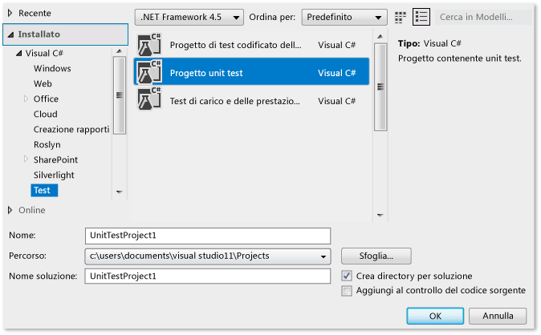
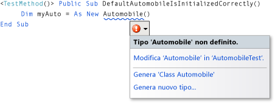
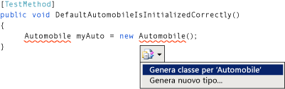
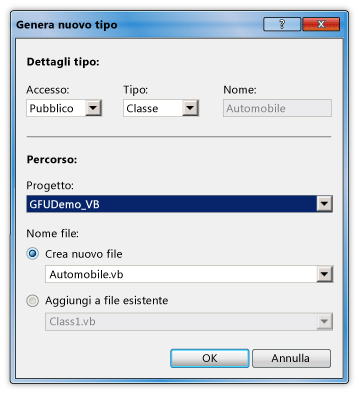
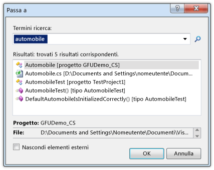
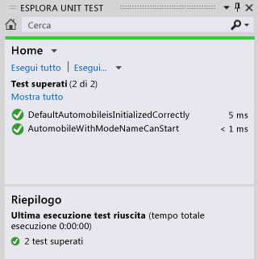

# Procedura dettagliata: supporto test preliminare con la funzionalità di generazione dall'utilizzo
Questo argomento illustra come usare la funzionalità di [generazione dall'utilizzo](../ide/visual-csharp-intellisense.md#generate-from-usage), che supporta lo sviluppo di test preventivi.  
  
 Lo*sviluppo di test preventivi* è un approccio alla progettazione software in cui prima si scrivono unit test in base alle specifiche del prodotto e quindi si scrive il codice sorgente necessario per fare in modo che i test abbiano esito positivo. [!INCLUDE[vsprvs](../code-quality/includes/vsprvs_md.md)] supporta lo sviluppo di test preventivi grazie alla generazione di nuovi tipi e membri nel codice sorgente quando si fa riferimento a essi per la prima volta nei test case, prima che vengano definiti.  
  
 [!INCLUDE[vsprvs](../code-quality/includes/vsprvs_md.md)] genera i nuovi tipi e membri con un'interruzione minima del flusso di lavoro. È possibile creare stub per tipi, metodi, proprietà, campi o costruttori senza abbandonare la posizione corrente nel codice. Quando si apre una finestra di dialogo per specificare le opzioni per la generazione dei tipi, lo stato attivo torna immediatamente al file aperto corrente quando si chiude la finestra di dialogo.  
  
 La funzionalità di generazione dall'utilizzo può essere usata con framework di test che si integrano con [!INCLUDE[vsprvs](../code-quality/includes/vsprvs_md.md)]. In questo argomento viene illustrato il framework di unit test Microsoft.  
  
 [!INCLUDE[note_settings_general](../data-tools/includes/note_settings_general_md.md)]  
  
### Per creare un progetto di libreria di classi Windows e un progetto di test  
  
1.  In [!INCLUDE[csprcs](../data-tools/includes/csprcs_md.md)] o [!INCLUDE[vbprvb](../code-quality/includes/vbprvb_md.md)]creare un nuovo progetto di libreria di classi Windows. Assegnare al progetto il nome `GFUDemo_VB` o `GFUDemo_CS`, a seconda del linguaggio in uso.  
  
2.  In **Esplora soluzioni**fare clic con il pulsante destro del mouse sull'icona della soluzione nella parte superiore, scegliere **Aggiungi**e quindi fare clic su **Nuovo progetto**. Nel riquadro **Tipi di progetto** , a sinistra nella finestra di dialogo **Nuovo progetto** , fare clic su **Test**.  
  
3.  Nel riquadro **Modelli** fare clic su **Progetto unit test** e accettare il nome predefinito UnitTestProject1. La figura seguente mostra la finestra di dialogo quando viene visualizzata in [!INCLUDE[csprcs](../data-tools/includes/csprcs_md.md)]. In [!INCLUDE[vbprvb](../code-quality/includes/vbprvb_md.md)] l'aspetto della finestra di dialogo è simile.  
  
       
Finestra di dialogo Nuovo progetto  
  
4.  Fare clic su **OK** per chiudere la finestra di dialogo **Nuovo progetto** .

5.  Nel progetto della classe in **Esplora soluzioni** fare clic con il pulsante destro del mouse sulla voce **Riferimenti** e scegliere **Aggiungi riferimento**.

6.  Nella finestra di dialogo **Gestione riferimenti** selezionare **Progetti** e quindi scegliere un progetto di unit test.

7.  Fare clic su **OK** per chiudere la finestra di dialogo **Gestione riferimenti**.

8.  Nel file **Class1**, immediatamente dopo l'ultima istruzione **using** esistente, aggiungere un'istruzione **using** per il progetto di test:

    * In Visual Basic aggiungere `Using UnitTestProject1`
    
    * In C# aggiungere `using UnitTestProject1;`
    
9.  Salvare la soluzione. A questo punto, è possibile iniziare a scrivere test.  
  
### Per generare una nuova classe da uno unit test  
  
1.  Il progetto di test contiene un file denominato UnitTest1. Fare doppio clic su questo file in **Esplora soluzioni** per aprirlo nell'editor di codice. Vengono generati una classe di test e un metodo di test.  
  
2.  Individuare la dichiarazione della classe `UnitTest1` e rinominarla in `AutomobileTest`. In C#, se è presente un costruttore `UnitTest1()` , rinominarlo in `AutomobileTest()`.  
  
    > [!NOTE]
    >  IntelliSense offre ora due alternative per il completamento delle istruzioni IntelliSense: la *modalità di terminazione* e la *modalità con suggerimenti*. Usare la modalità con suggerimenti per i casi in cui classi e membri vengono usati prima di essere definiti. Quando una finestra di IntelliSense è aperta, è possibile premere CTRL+ALT+BARRA SPAZIATRICE per passare tra la modalità di terminazione e la modalità con suggerimenti. Per altre informazioni, vedere [Using IntelliSense](../ide/using-intellisense.md) . La modalità con suggerimenti sarà utile quando si digita `Automobile` nel passaggio successivo.  
  
3.  Individuare il metodo `TestMethod1()` e rinominarlo in `DefaultAutomobileIsInitializedCorrectly()`. All'interno di questo metodo creare una nuova istanza di una classe denominata `Automobile`, come illustrato nelle figure seguenti. Verrà visualizzata una sottolineatura ondulata, che indica un errore in fase di compilazione e sotto il nome del tipo verrà visualizzato uno smart tag. La posizione esatta dello smart tag varia a seconda che si stia usando [!INCLUDE[vbprvb](../code-quality/includes/vbprvb_md.md)] o [!INCLUDE[csprcs](../data-tools/includes/csprcs_md.md)].  
  
       
Visual Basic  
  
       
Visual C#  
  
4.  Posizionare il puntatore del mouse sullo smart tag per visualizzare un messaggio di errore che indica che non è ancora stato definito un tipo denominato `Automobile` . Fare clic sullo smart tag o premere CTRL+. (CTRL+punto) per aprire il menu di scelta rapida per la generazione dall'utilizzo, come illustrato nelle figure seguenti.  
  
       
Visual Basic  
  
       
Visual C#  
  
5.  A questo punto sono disponibili due opzioni. È possibile fare clic su **Genera classe per "Automobile"** per creare un nuovo file nel progetto di test e popolarlo con una classe vuota denominata `Automobile`. Questo è un modo rapido per creare una nuova classe in un nuovo file con modificatori di accesso predefiniti nel progetto corrente. È anche possibile fare clic su **Genera nuovo tipo** per aprire la finestra di dialogo **Genera nuovo tipo** . Questo comando fornisce opzioni che includono l'inserimento della classe in un file esistente e l'aggiunta del file a un altro progetto.  
  
     Fare clic su **Genera nuovo tipo** per aprire la finestra di dialogo **Genera nuovo tipo** , illustrata nella figura seguente. Nell'elenco **Progetto** fare clic su **GFUDemo_VB** o **GFUDemo_CS** per indicare a [!INCLUDE[vsprvs](../code-quality/includes/vsprvs_md.md)] di aggiungere il file al progetto di codice sorgente invece che al progetto di test.  
  
       
Finestra di dialogo Genera nuovo tipo  
  
6.  Fare clic su **OK** per chiudere la finestra di dialogo e creare il nuovo file.  
  
7.  In **Esplora soluzioni**esaminare sotto il nodo di progetto GFUDemo_VB o GFUDemo_CS per verificare che sia presente il nuovo file Automobile.vb o Automobile.cs. Nell'editor di codice lo stato attivo è ancora in `AutomobileTest.DefaultAutomobileIsInitializedCorrectly`. È possibile continuare a scrivere il test con un'interruzione minima.  
  
### Per generare uno stub per una proprietà  
  
1.  Si supponga che la specifica del prodotto indichi che la classe `Automobile` ha due proprietà pubbliche denominate `Model` e `TopSpeed`. Queste proprietà devono essere inizializzate con i valori predefiniti `"Not specified"` e `-1` dal costruttore predefinito. Lo unit test seguente verificherà che il costruttore predefinito imposti le proprietà sui valori predefiniti corretti.  
  
     Aggiungere la riga di codice seguente a `DefaultAutomobileIsInitializedCorrectly`.  
  
     [!code-csharp[VbTDDWalkthrough#1](../ide/codesnippet/CSharp/walkthrough-test-first-support-with-the-generate-from-usage-feature_1.cs)]  [!code-vb[VbTDDWalkthrough#1](../ide/codesnippet/VisualBasic/walkthrough-test-first-support-with-the-generate-from-usage-feature_1.vb)]  
  
     Poiché il codice fa riferimento a due proprietà non definite in `Automobile`, viene visualizzato uno smart tag. Fare clic sullo smart tag per `Model` e quindi fare clic su **Genera stub proprietà**. Generare uno stub anche per la proprietà `TopSpeed` .  
  
     Nella classe `Automobile` i tipi delle nuove proprietà vengono dedotti correttamente dal contesto.  
  
     La figura seguente mostra il menu di scelta rapida dello smart tag.  
  
       
Visual Basic  
  
       
Visual C#  
  
### Per individuare il codice sorgente  
  
1.  Usare la funzionalità **Passa a** per passare al file di codice sorgente Automobile.cs o Automobile.vb per poter verificare che le nuove proprietà siano state generate.  
  
     La funzionalità **Passa a** consente di immettere rapidamente una stringa di testo, ad esempio un nome o una parte di un nome di tipo, e passare al percorso desiderato facendo clic sull'elemento nell'elenco dei risultati.  
  
     Aprire la finestra di dialogo **Passa a** facendo clic nell'editor di codice e premendo CTRL +, (CTRL+virgola). Nella casella di testo digitare `automobile`. Fare clic sulla classe **Automobile** nell'elenco e quindi fare clic su **OK**.  
  
     La finestra **Passa a** è illustrata nella figura seguente.  
  
       
Finestra Passa a  
  
### Per generare uno stub per un nuovo costruttore  
  
1.  In questo metodo di test verrà generato uno stub per un costruttore che inizializzerà le proprietà `Model` e `TopSpeed` con i valori specificati. Successivamente, verrà aggiunto altro codice per completare il test. Aggiungere l'ulteriore metodo di test seguente alla classe `AutomobileTest` .  
  
     [!code-csharp[VbTDDWalkthrough#2](../ide/codesnippet/CSharp/walkthrough-test-first-support-with-the-generate-from-usage-feature_2.cs)]  [!code-vb[VbTDDWalkthrough#2](../ide/codesnippet/VisualBasic/walkthrough-test-first-support-with-the-generate-from-usage-feature_2.vb)]  
  
2.  Fare clic sullo smart tag sotto il nuovo costruttore di classe e quindi fare clic su **Genera stub costruttore**. Nel file della classe `Automobile` osservare che il nuovo costruttore ha esaminato i nomi delle variabili locali che vengono usati nella chiamata al costruttore, ha trovato le proprietà che hanno gli stessi nomi nella classe `Automobile` e ha fornito il codice nel corpo del costruttore per archiviare i valori degli argomenti nelle proprietà `Model` e `TopSpeed` . In [!INCLUDE[vbprvb](../code-quality/includes/vbprvb_md.md)]i campi `_model` e `_topSpeed` nel nuovo costruttore sono i campi sottostanti definiti in modo implicito per le proprietà `Model` e `TopSpeed` .  
  
3.  Dopo aver generato il nuovo costruttore, viene visualizzata una sottolineatura ondulata sotto la chiamata al costruttore predefinito in `DefaultAutomobileIsInitializedCorrectly`. Il messaggio di errore indica che la classe `Automobile` non ha un costruttore che accetta zero argomenti. Per generare un costruttore predefinito esplicito che non ha parametri, fare clic sullo smart tag e quindi fare clic su **Genera stub costruttore**.  
  
### Per generare uno stub per un metodo  
  
1.  Si supponga che la specifica indichi che un nuovo oggetto `Automobile` può essere impostato in uno stato di esecuzione se le sue proprietà `Model` e `TopSpeed` sono impostate su valori diversi da quelli predefiniti. Aggiungere le righe seguenti al metodo `AutomobileWithModelNameCanStart` .  
  
     [!code-csharp[VbTDDWalkthrough#3](../ide/codesnippet/CSharp/walkthrough-test-first-support-with-the-generate-from-usage-feature_3.cs)]  [!code-vb[VbTDDWalkthrough#3](../ide/codesnippet/VisualBasic/walkthrough-test-first-support-with-the-generate-from-usage-feature_3.vb)]  
  
2.  Fare clic sullo smart tag per la chiamata al metodo `myAuto.Start` e quindi fare clic su **Genera stub di metodo**.  
  
3.  Fare clic sullo smart tag per la proprietà `IsRunning` e quindi fare clic su **Genera stub proprietà**. La classe `Automobile` contiene ora il codice seguente.  
  
     [!code-csharp[VbTDDWalkthrough#4](../ide/codesnippet/CSharp/walkthrough-test-first-support-with-the-generate-from-usage-feature_4.cs)]  [!code-vb[VbTDDWalkthrough#4](../ide/codesnippet/VisualBasic/walkthrough-test-first-support-with-the-generate-from-usage-feature_4.vb)]  
  
### Per eseguire i test  
  
1.  Scegliere **Esegui unit test** dal menu **Unit test**e quindi fare clic su **Tutti i test**. Questo comando esegue tutti i test in tutti i framework di test scritti per la soluzione corrente.  
  
     In questo caso ci sono due test e hanno entrambi esito negativo, come previsto. Il test `DefaultAutomobileIsInitializedCorrectly` ha esito negativo perché la condizione `Assert.IsTrue` restituisce `False`. Il test `AutomobileWithModelNameCanStart` ha esito negativo perché il metodo `Start` nella classe `Automobile` genera un'eccezione.  
  
     La finestra **Risultati test** è illustrata nella figura seguente.  
  
       
Finestra Risultati test  
  
2.  Nella finestra **Risultati test** fare doppio clic su ogni riga di risultati di test per passare alla posizione di ogni errore nel test.  
  
### Per implementare il codice sorgente  
  
1.  Aggiungere il codice seguente al costruttore predefinito in modo che le proprietà `Model`, `TopSpeed` e `IsRunning` vengano tutte inizializzate con i valori predefiniti corretti, ovvero `"Not specified"`, `-1`e `True` (`true`).  
  
     [!code-csharp[VbTDDWalkthrough#5](../ide/codesnippet/CSharp/walkthrough-test-first-support-with-the-generate-from-usage-feature_5.cs)]  [!code-vb[VbTDDWalkthrough#5](../ide/codesnippet/VisualBasic/walkthrough-test-first-support-with-the-generate-from-usage-feature_5.vb)]  
  
2.  Quando il metodo `Start` viene chiamato, deve impostare il flag `IsRunning` su true solo se la proprietà `Model` o `TopSpeed` è impostata su un valore diverso da quello predefinito. Rimuovere `NotImplementedException` dal corpo del metodo e aggiungere il codice seguente.  
  
     [!code-csharp[VbTDDWalkthrough#6](../ide/codesnippet/CSharp/walkthrough-test-first-support-with-the-generate-from-usage-feature_6.cs)]  [!code-vb[VbTDDWalkthrough#6](../ide/codesnippet/VisualBasic/walkthrough-test-first-support-with-the-generate-from-usage-feature_6.vb)]  
  
### Per eseguire di nuovo il test  
  
1.  Scegliere **Esegui** dal menu **Test**e quindi fare clic su **Tutti i test nella soluzione**. Questa volta il test ha esito positivo. La finestra **Risultati test** è illustrata nella figura seguente.  
  
       
Finestra Risultati test  
  
## Vedere anche  
 [Generazione dall'utilizzo](../ide/visual-csharp-intellisense.md#generate-from-usage)   
 [Scrittura di codice](../ide/writing-code-in-the-code-and-text-editor.md)   
 [Utilizzo di IntelliSense](../ide/using-intellisense.md)   
 [Eseguire unit test del codice](../test/unit-test-your-code.md)
