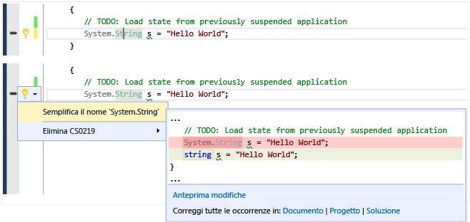
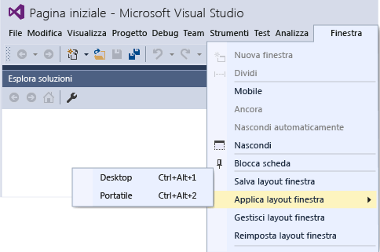

# Novit&#224; di Visual Studio 2015
[!INCLUDE[vs2017banner](../code-quality/includes/vs2017banner.md)]

Visual Studio 2015 è una famiglia integrata di strumenti di produttività per sviluppatori, servizi cloud ed estensioni che consentono all'utente e al team di creare app e giochi di grande impatto per il Web, Windows Store, per il desktop, Android e iOS.  
  
 In questa pagina sono evidenziate alcune delle più importanti funzionalità nuove rispetto a Visual Studio 2013 RTM, incluse le funzionalità introdotte per la prima volta in uno degli aggiornamenti di Visual Studio 2013. Per un elenco completo delle novità di Visual Studio 2015, vedere le [Note sulla versione](https://www.visualstudio.com/news/vs2015-vs).  
  
 Per maggiori informazioni sui numerosi miglioramenti apportati e sulle nuove funzionalità di Visual Studio ALM, vedere [Novità relative alla gestione del ciclo di vita delle applicazioni in Visual Studio 2015](http://msdn.microsoft.com/it-it/54b98a53-6083-4303-869a-8063d8fae938).  
  
## Una nuova esperienza di installazione  
 [!INCLUDE[downloadvs](../debugger/includes/downloadvs_md.md)]  
  
 L'esperienza di installazione di Visual Studio 2015 è stata suddivisa in componenti in modo che è necessario installare le parti che è necessario. In questo modo l'installazione più veloce per molti scenari comuni che coinvolgono lo sviluppo Web o .NET. Se altri tipi di sviluppo, ad esempio sviluppo multipiattaforma per dispositivi mobili, o si lavora in C\+\+ o F \#, scegliere **personalizzato** installazione e quindi scegliere i componenti e il SDK di terze parti facoltativo che è necessario. È inoltre possibile installare i componenti personalizzati in un secondo momento. Ad esempio, se si sceglie l'installazione di base e quindi tentare di creare un nuovo progetto C\+\+, verrà richiesto di scaricare gli strumenti di sviluppo C\+\+.  
  
   
  
## Accedere a più account  
 Con Visual Studio 2015 la nuova esperienza di accesso ottimizzata è concepita in modo da semplificare notevolmente l'accesso alle risorse online, anche quando si hanno più account di Visual Studio. Dopo avere effettuato l'accesso a Visual Studio, si accede automaticamente a tutte le istanze di Visual Studio 2015 e Blend nel computer in uso. L'accesso  avvia automaticamente il roaming delle impostazioni. In Visual Studio 2015 l'account è condiviso tra più funzionalità e, di conseguenza, se si ha un token valido, è possibile accedere agli account di Visual Studio Team Services da **Team Explorer** e alle risorse e ai siti Web dalla sottoscrizione di Microsoft Azure in Esplora server. Le risorse di Azure sono inoltre visualizzate nella finestra di dialogo Nuovo progetto per i progetti di Application Insights, mentre gli account di Servizi mobili di Azure, Archiviazione di Azure, [Microsoft Office 365](http://msdn.microsoft.com/office/aa905340.aspx) e quello per [sviluppatori di Saleforce.com](https://developer.salesforce.com/) sono visualizzati nella nuova finestra di dialogo **Aggiungi servizio connesso**.  
  
 Per usare più account utente in Visual Studio, aggiungerli man mano o tramite il nuovo Gestione account. In questo modo sarà possibile passare immediatamente da un account all'altro quando ci si connette ai servizi o si accede alle risorse online. Visual Studio memorizza gli account aggiunti, che possono quindi essere usati da qualsiasi istanza di Visual Studio o Blend. In Visual Studio verrà effettuato anche il roaming dell'elenco di account \(ma non delle preziose credenziali dell'utente\) tramite l'account di personalizzazione, in modo da poter iniziare rapidamente a usare uno di questi account in un altro dispositivo. Naturalmente è possibile rimuovere gli account dalla finestra di dialogo Impostazioni account in qualsiasi momento. Per un'introduzione, vedere [Gestire più account utente](../ide/work-with-multiple-user-accounts.md).  
  
   
  
## Scegliere la piattaforma o le piattaforme di destinazione  
 Visual Studio 2015 supporta lo sviluppo di app per dispositivi mobili multipiattaforma. È possibile scrivere app e giochi per iOS, Android e Windows e condividere una codebase comune dall'interno dell'IDE di Visual Studio. Tutti questi nuovi tipi di progetto sono disponibili in File, nella finestra di dialogo Nuovo progetto.  
  
 Naturalmente, anche il supporto per le applicazioni desktop classiche è ulteriormente migliorato, con numerosi perfezionamenti a livello di linguaggi, librerie e strumenti.  
  
### App per dispositivi mobili multipiattaforma in C\# con Xamarin per Visual Studio  
 Xamarin è un framework per dispositivi mobili che consente di scrivere codice in C\# con binding nativo alle API iOS e Android. Microsoft ha collaborato attivamente con Xamarin su questa versione di Xamarin per Visual Studio, un'estensione che abilita lo sviluppo per Android, iOS e Windows Phone in una singola soluzione con codice condiviso. Con Xamarin, si utilizzerà una lingua e un codice di base con minime delta tra le piattaforme.  Xamarin per Visual Studio è supportato in Visual Studio 2010 e versioni successive. È la starter edition di Xamarin è incluso in Visual Studio 2015. Per un'introduzione, vedere [Creare app con interfaccia utente nativa con Xamarin in Visual Studio](../cross-platform/build-apps-with-native-ui-using-xamarin-in-visual-studio.md).  
  
### App per dispositivi mobili multipiattaforma in HTML\/JavaScript con Apache Cordova  
 Visual Studio Tools per Apache Cordova è il risultato di una stretta collaborazione tra Microsoft e la community open source di Apache Cordova. Gli strumenti consentono lo sviluppo per dispositivi mobili multipiattaforma usando HTML, CSS e JavaScript \(o TypeScript\). È possibile sviluppare per Android, iOS e Windows con una singola codebase e sfruttare le molteplici funzionalità dell'IDE di Visual Studio, quali JavaScript IntelliSense, DOM Explorer, Console JavaScript, punti di interruzione, espressioni di controllo, variabili locali, Just My Code e molte altre.  Con Visual Studio Tools per Apache Cordova le app possono accedere alle funzionalità native dei dispositivi su tutte le piattaforme tramite plug\-in che forniscono un'API JavaScript comune. Per un'introduzione, vedere [Introduzione a Visual Studio Tools per Apache Cordova](../Topic/Get%20Started%20with%20Visual%20Studio%20Tools%20for%20Apache%20Cordova1.md).  
  
### Giochi per dispositivi mobili multipiattaforma in C\# con Unity  
 Unity è un ecosistema ampiamente diffuso per lo sviluppo di giochi 2D e 3D multipiattaforma. È possibile scrivere un gioco in C\# ed eseguirlo in modo nativo su Android, iOS e Windows Phone e molte altre piattaforme. Visual Studio Tools per Unity è un'estensione che integra Unity con l'IDE di Visual Studio. Con questa estensione sono disponibili tutte le funzionalità dell'IDE e del debugger di Visual Studio, oltre a funzionalità per la produttività progettate per gli sviluppatori di Unity. Visual Studio Tools per Unity Preview 2.0. include il supporto per Visual Studio 2015, oltre a numerose nuove funzionalità, come una migliore visualizzazione per gli oggetti nelle finestre Variabili locali e Espressioni di controllo. Microsoft ha di recente acquisito SyntaxTree, la società che ha creato Visual Studio Tools per Unity. Per scaricare Visual Studio Tools per Unity 2.0 Preview 2 e per altre informazioni su Visual Studio Tools per Unity, vedere [Visual Studio Tools per Unity 2.0](http://Aka.ms/vstu).  
  
### App e librerie multipiattaforma per C\+\+ nativo  
 C\+\+ è un linguaggio disponibile in modo nativo per dispositivi mobili più. Consente di scrivere librerie di codice condiviso tra piattaforme che possono essere compilati per più destinazioni di piattaforma mobile. È possibile creare anche applicazioni per dispositivi mobili completamente in C\+\+. Per modificare, compilare, distribuire il codice multipiattaforma ed eseguirne il debug, è possibile usare Visual C\+\+. Oltre ai modelli per le applicazioni Windows, è possibile creare progetti da modelli per applicazioni attività nativa Android, iOS App o progetti di librerie di codice condiviso per più piattaforme che includono applicazioni ibride Xamarin. Usare IntelliSense specifico della piattaforma per esplorare le API e generare il codice corretto destinato a iOS, Android o Windows. È possibile configurare la compilazione per piattaforme x86 o ARM native e distribuire il codice per un simulatore iOS o ai dispositivi iOS su un Mac collegata alla rete per i dispositivi Android collegati direttamente o utilizzare l'emulatore di Microsoft Visual Studio ad elevate prestazioni per Android per il test. È possibile impostare punti di interruzione, controllare le variabili, visualizzare lo stack ed eseguire il codice C\+\+ un'istruzione alla volta nel debugger di Visual Studio. È possibile condividere tutto il codice, tranne quello più specifico della piattaforma, tra più piattaforme di app e compilarle con una sola soluzione in Visual Studio.  
  
 Per un'introduzione al codice C\+\+ multipiattaforma, vedere [Creare app multipiattaforma con Visual C\+\+](../misc/build-cross-platform-mobile-apps-with-visual-cpp.md)  
  
### App di Windows universale di qualsiasi dispositivo Windows 10  
 Con la piattaforma Windows universale e uno dei nostri core Windows, è possibile eseguire la stessa applicazione su qualsiasi dispositivo Windows 10 dai telefoni ai desktop. È possibile creare queste app di Windows universale usando Visual Studio 2015 e gli strumenti di sviluppo di app di Windows universale.  
  
   
  
 È possibile eseguire le app su telefoni Windows 10, computer desktop Windows 10 o Xbox. Il pacchetto di app non cambia. Con l'introduzione del singolo core unificato Windows 10, un unico pacchetto di app può essere eseguito su tutte le piattaforme. Diverse piattaforme hanno SDK di estensione che è possibile aggiungere alla app per sfruttare i comportamenti specifici di piattaforma. Ad esempio, un SDK di estensione per dispositivi mobili gestisce la pressione del pulsante Indietro su un telefono Windows. Se si fa riferimento a un SDK di estensione nel progetto, è sufficiente aggiungere i controlli di runtime per verificare se tale SDK è disponibile nella piattaforma. In questo modo è possibile avere lo stesso pacchetto di app per ogni piattaforma.  
  
 Usare C\#, Visual Basic, C\+\+ o JavaScript per creare queste [app di Windows universale](http://msdn.microsoft.com/library/dn975273.aspx).  
  
### Web  
 ASP.NET 5 è un aggiornamento principale per MVC, WebAPI e SignalR e viene eseguito in Windows, Mac e Linux.  ASP.NET 5 è stato completamente riprogettato per fornire uno stack .NET pulito e componibile per la compilazione di moderne app basate sul cloud. Strumenti di Visual Studio 2015 sono più strettamente integrati con i comuni strumenti di sviluppo Web, come Bower e Grunt. Per un'introduzione, vedere i numerosi post nel [blog relativo a strumenti e sviluppo Web .NET](http://blogs.msdn.com/b/webdev/).  
  
### Desktop classico e Windows Store  
 Visual Studio 2015 continua a supportare lo sviluppo per desktop classico e Windows Store. Visual Studio si evolverà parallelamente all'evoluzione di Windows.  In Visual Studio 2015 i linguaggi e le librerie per .NET e C\+\+ includono miglioramenti significativi applicabili a tutte le versioni di Windows.  
  
#### .NET Framework  
 Microsoft [!INCLUDE[net_v46](../ide/includes/net_v46_md.md)] include circa 150 nuove API e 50 API aggiornate per supportare un maggior numero di scenari. Ad esempio, più raccolte implementano ora <xref:System.Collections.Generic.IReadOnlyCollection%601> e sono quindi più facilmente utilizzabili. ASP.NET 5, menzionato in precedenza, offre inoltre una piattaforma .NET snella per creare app moderne basate sul cloud.  
  
 Le app di Windows Store scritte in C\# destinate a .NET Framework possono ora sfruttare .NET Native, che consente di compilare le app per il codice nativo invece di IL, mentre con [!INCLUDE[net_v46](../ide/includes/net_v46_md.md)] è incluso anche RyuJIT, un compilatore Just\-In\-Time \(JIT\) a 64 bit.  
  
 I nuovi compilatori C\# e VB \("Roslyn"\) velocizzano significativamente i tempi di compilazione e offrono API complete per l'analisi del codice. Visual Studio 2015 sfrutta le funzionalità di Roslyn per offrire maggiori refactoring, tra cui ridenominazione inline, analizzatori e correzioni rapide.  
  
 I linguaggi C\# e Visual Basic includono entrambi numerosi miglioramenti minori a livello di linguaggio di base e supporto dell'IDE. Questi miglioramenti contribuiscono a rendere l'esperienza di scrittura di codice .NET ancor più intuitiva, comoda e produttiva.  
  
 Per altre informazioni, vedere [Novità](../Topic/What's%20New%20in%20the%20.NET%20Framework.md) e il [blog di .NET](http://blogs.msdn.com/b/dotnet/).  
  
#### C\+\+  
 Visual C\+\+ include significativi miglioramenti relativamente alla conformità del linguaggio C\+\+11\/14, oltre al supporto per lo sviluppo di app per dispositivi multipiattaforma, al supporto per funzioni ripristinabili e await \(attualmente pianificato per la standardizzazione in C\+\+17\), a miglioramenti e correzioni di bug nelle implementazioni della libreria run\-time C \(CRT\) e della libreria standard C\+\+ \(STL\), nelle finestre di dialogo ridimensionabili in MCF, a nuove ottimizzazioni del compilatore, al miglioramento delle prestazioni di compilazione, a nuove funzionalità di diagnostica e a nuovi strumenti di produttività nell'editor del codice.  
  
 Per altre informazioni, vedere [Novità in Visual C\+\+](/visual-cpp/top/what-s-new-for-visual-cpp-in-visual-studio-2015) e il [blog di Visual C\+\+](http://blogs.msdn.com/b/vcblog/).  
  
## Menu Anteprima dispositivo  
 In progetti per la piattaforma Windows universale, la barra dei menu Anteprima dispositivo consente di vedere come verrà eseguito il rendering dell'interfaccia utente basata su XAML in diverse dimensioni dello schermo.  
  
   
  
## Diagnostica della grafica di Visual Studio  
 Poiché Visual Studio 2013, gli strumenti di acquisizione Visual Studio grafica diagnostica ha aggiunto numerose nuove funzionalità, tra cui l'analisi dei Frame, supporto per Windows Phone, modifica dello shader e applica e riga di comando. È inoltre aggiunto supporto per il debug di applicazioni DirectX12. Per ulteriori informazioni, vedere [Visual Studio Graphics Diagnostics](../debugger/visual-studio-graphics-diagnostics.md).  
  
## Connettersi ai servizi  
 Con Visual Studio 2015 è più semplice che mai connettere l'app ai servizi.  La nuova procedura guidata Aggiungi servizio connesso consente di configurare il progetto, aggiungere il supporto necessario per l'autenticazione e scaricare i pacchetti NuGet necessari per iniziare a scrivere codice per il servizio in modo rapido e senza problemi. La procedura guidata Aggiungi servizio connesso si integra anche con il nuovo Gestione account per facilitare l'uso di più account utente e sottoscrizioni. In Visual Studio 2015 è incluso il supporto automatico per i servizi seguenti, presupposto che l'utente disponga di un account:  
  
1.  Servizi mobili di Azure  
  
2.  Archiviazione di Azure  
  
3.  Office 365 \(posta elettronica, contatti, calendari, file, utenti e gruppi\)  
  
4.  Salesforce  
  
 Nuovi servizi verranno aggiunti regolarmente e sarà possibile scoprirli facendo clic sul collegamento per trovare nuovi servizi nella procedura guidata.  
  
   
  
## Progettare l'interfaccia utente  
 L'esperienza Blend per la progettazione di interfacce utente XAML è stata notevolmente migliorata. Blend è stato completamente riprogettato per fornire un'interfaccia utente più intuitiva, funzionalità di modifica XAML più potenti, tra cui IntelliSense e una migliore integrazione con Visual Studio. Per altre informazioni, vedere [Designing XAML in Visual Studio and Blend for Visual Studio](../designers/designing-xaml-in-visual-studio.md).  
  
## Supporto per il debug multipiattaforma  
 È possibile usare Visual Studio per creare ed eseguire il debug di app native per dispositivi mobili eseguite in dispositivi Windows, iOS e Android. Usare [Visual Studio Emulator for Android](http://blogs.msdn.com/b/visualstudioalm/archive/2014/11/12/introducing-visual-studio-s-emulator-for-android.aspx) oppure connettere un dispositivo ed eseguire il debug del codice direttamente in Visual Studio.  
  
-   **JavaScript \/ Cordova**. Usare [Visual Studio Tools per Apache Cordova](http://msdn.microsoft.com/library/dn879821\(v=vs.140\).aspx) per creare app native per Windows, iOS e Android con JavaScript.  
  
     L'articolo [Eseguire il debug dell'app](../Topic/Debug%20Your%20App%20Built%20with%20Visual%20Studio%20Tools%20for%20Apache%20Cordova.md) in MSDN Library offre un'analisi approfondita del supporto del debug di Visual Studio per Cordova.  
  
-   **C\# \/ Xamarin**. Usare [Xamarin](http://msdn.microsoft.com/library/dn879698\(v=vs.140\).aspx) per creare app native per Windows, iOS e Android in Visual Studio con C\#.  
  
     Gli argomenti relativi a [debug](http://developer.xamarin.com/guides/ios/deployment,_testing,_and_metrics/debugging_in_xamarin_ios/) \(iOS\) e [debug nel dispositivo](http://developer.xamarin.com/guides/android/deployment,_testing,_and_metrics/debugging_with_xamarin_android/) delle [guide per sviluppatori Xamarin](http://developer.xamarin.com/guides) descrivono l'esperienza di debug.  
  
-   **C\+\+ \/ Android**. Usare i modelli di [Visual C\+\+ per lo sviluppo per dispositivi mobili multipiattaforma](http://msdnstage.redmond.corp.microsoft.com/library/dn872463\(v=vs.140\).aspx) insieme a strumenti di terze parti come [Android NDK](https://developer.android.com/tools/sdk/ndk/index.html) per creare app native per Windows e Android.  
  
## Debug e diagnostica  
 Per informazioni sulle novità relative al debug, vedere [Novità relative al debugger di Visual Studio 2015](../debugger/what’s-new-for-the-debugger-in-visual-studio-2015.md).  
  
 Per informazioni sulle novità relative alla diagnostica, vedere [Novità introdotte negli strumenti di diagnostica](../profiling/what-s-new-in-profiling-tools.md).  
  
 Di seguito sono nuove o migliorate di strumenti che consentono di eseguono diversi tipi di diagnosi e di analisi nel codice:  
  
### PerfTips  
 PerfTips visualizza il tempo di esecuzione dei metodi durante il debug, consentendo di individuare rapidamente i colli di bottiglia senza dover richiamare il profiler. Per un'introduzione, vedere il post relativo a [PerfTips, informazioni immediate sulle prestazioni durante il debug in Visual Studio](http://blogs.msdn.com/b/visualstudioalm/archive/2014/08/18/perftips-performance-information-at-a-glance-while-debugging-with-visual-studio.aspx)  
  
### Elenco errori  
 L'elenco errori ora supporta l'applicazione del filtro su qualsiasi colonna. Consente inoltre di visualizzare in tempo reale errori, avvisi e analisi di codice nell'intera soluzione C\# o Visual Basic mentre si digita, anche quando una modifica del codice produce migliaia di avvisi. Il nuovo Elenco errori è compatibile con la modalità d'uso esistente. Per altre informazioni, vedere [Finestra Elenco errori](../ide/reference/error-list-window.md).  
  
### Strumento Utilizzo della GPU  
 Questo strumento consente di raccogliere e analizzare i dati di utilizzo della GPU in app e giochi DirectX e di risolvere i problemi nel caso di colli di bottiglia delle prestazioni generati nella CPU o GPU. Per un'introduzione allo strumento, vedere il [post di blog del team di Visual C\+\+](http://blogs.msdn.com/b/vcblog/archive/2014/09/05/gpu-usage-tool-in-visual-studio-2013-update-4-ctp1.aspx).  
  
## Analisi del codice in tempo reale \(lampadine\)  
 Il nuovo compilatore Roslyn per C\# e Visual Basic non offre solo tempi di compilazione più rapidi, ma abilita anche scenari completamente nuovi, come l'analisi del codice in tempo reale che fornisce feedback e suggerimenti estesi e personalizzabili direttamente all'interno dell'editor di codice mentre si digita. In Visual Studio 2015 le lampadine vengono visualizzate nel margine sinistro quando si usa la tastiera o come descrizione comando quando si passa il puntatore del mouse su un errore. La lampadina indica in tempo reale che il compilatore, eventualmente usando un set di regole personalizzate, ha rilevato un problema nel codice, ma che è disponibile un suggerimento per correggere l'errore. Fare clic su una lampadina visualizzata per ottenere suggerimenti sulle azioni da eseguire.  
  
   
  
## Altri miglioramenti dell'IDE  
  
### Impostazioni sincronizzate \(impostazioni di roaming\)  
 In Visual Studio 2013 viene introdotta la funzionalità Impostazioni sincronizzate per alcune delle impostazioni configurate più di frequente, come Editor di testo, KeyBindings, Tema, tipi di carattere e colori, Avvio e Alias di ambiente.  Visual Studio 2015 migliora questa esperienza sincronizzando più impostazioni. La sincronizzazione delle impostazioni viene estesa alla famiglia di applicazioni di Visual Studio, quali Professional, Enterprise, SKU di Express e Blend. Quando si accede a Visual Studio 2015 per la prima volta con lo stesso account usato in Visual Studio 2013, vengono visualizzate le impostazioni sincronizzate applicate in Visual Studio 2013. È possibile accedere alle impostazioni digitando "sincronizza" in **Avvio veloce** o passando a **Strumenti, Opzioni, Ambiente, Impostazioni sincronizzate**.  
  
### Aggiornamenti di estensione automatica  
 Le estensioni di Visual Studio installate, ora verranno aggiornate automaticamente non appena si rende disponibile una nuova versione su Visual Studio Gallery. Vedere [Ricerca e utilizzo di estensioni di Visual Studio](../ide/finding-and-using-visual-studio-extensions.md) per informazioni dettagliate su come personalizzare gli aggiornamenti di estensione automatica.  
  
### Menu Tutte Iniziali Maiuscole  
 In base al feedback degli utenti, i menu di Visual Studio hanno di nuovo tutte le iniziali maiuscole per impostazione predefinita. Se tuttavia si preferisce lo stile TUTTE MAIUSCOLE, è possibile impostarlo all'avvio o nella pagina delle proprietà **Strumenti \> Opzioni \> Generale**:  
  
   
  
### Immagini ad alta risoluzione e supporto per il tocco  
 L'IDE di Visual Studio include ora immagini veramente ad alta risoluzione nelle visualizzazioni a più alta densità di elementi, ad esempio in aree quali menu, menu di scelta rapida, barre dei comandi di finestre degli strumenti e alcuni progetti in Esplora soluzioni. Su un touchscreen, nella finestra dell'editor di codice di Visual Studio è anche possibile usare movimenti come toccare e tenere premuto, avvicinare le dita, toccare e così via per ingrandire, scorrere, selezionare testo e richiamare menu di scelta rapida.  
  
   
  
### Layout personalizzati  
 È possibile creare e archiviare layout di finestra personalizzati ed effettuarne il roaming. Ad esempio, è possibile definire un layout preferito da usare sul computer desktop e un layout diverso da usare su un portatile o su un dispositivo con uno schermo piccolo. In alternativa, si può preferire un layout per un progetto dell'interfaccia utente e un altro per un progetto di database. I tasti di scelta rapida consentono di passare rapidamente da un layout all'altro. Questi layout sono disponibili in qualsiasi istanza di Visual Studio dopo avere eseguito l'accesso. Per altre informazioni, vedere [Creare layout di finestra personalizzati](../misc/create-custom-window-layouts.md).  
  
   
  
### Hub di notifica  
 L'interfaccia utente per l'hub di notifica è stata semplificata per consentire di eseguire facilmente un'analisi rapida. Sono stati aggiunti altri tipi di notifiche tra cui quelle per problemi di prestazioni, problemi di rendering e arresti anomali del sistema e ora è possibile scegliere di non visualizzare più una notifica. Per altre informazioni, vedere [Notifiche di Visual Studio](../ide/visual-studio-notifications.md).  
  
### CodeLens: cercare informazioni sul codice \(solo Enterprise e Professional Edition\)  
 CodeLens consente di rimanere concentrati sulle proprie attività mentre si cercano informazioni sul codice senza uscire dall'editor. È possibile esaminare le modifiche e altri riferimenti della cronologia per elementi di lavoro, bug, revisioni del codice e così via per il codice archiviato in Visual Studio Team Services \(VSTS\) o in Team Foundation Server \(TFS\).  
  
 In Visual Studio Enterprise e Visual Studio Professional ora è possibile:  
  
-   Ottenere la cronologia per un intero file di codice nell'editor di Visual Studio.  
  
       
  
-   Visualizzare un grafico che mostra le persone che hanno modificato il codice. consentendo di individuare i criteri delle modifiche del team e di valutarne l'impatto.  
  
       
  
-   Individuare facilmente la data delle ultime modifiche apportate al codice.  
  
-   Individuare le modifiche in altri rami che hanno effetto sul codice.  
  
 Vedere [CodeLens](../ide/find-code-changes-and-other-history-with-codelens.md).  
  
### Strumenti di architettura e modellazione \(solo edizione Enterprise\)  
 **Mappe codici e grafici delle dipendenze**  
  
 In Visual Studio Enterprise, per comprendere le dipendenze specifiche nel codice, visualizzarle creando mappe codici. È quindi possibile esplorare queste relazioni tramite la mappa, visualizzata accanto al codice. Le mappe codici consentono di tenere traccia della propria posizione nel codice mentre si usa o si esegue il debug del codice, per cui una parte minore di codice verrà letta mentre si acquisiscono altre informazioni sulla progettazione del codice.  
  
 In questa versione, sono stati creati menu di scelta rapida per gli elementi di codice e collegamenti più facili da usare mediante il raggruppamento di comandi in sezioni relative alla selezione, alla modifica, alla gestione di gruppi e alla modifica del layout del contenuto dei gruppi. Si noti inoltre che i progetti di test vengono visualizzati in uno stile diverso da altri progetti e che le icone per gli elementi nella mappa sono state aggiornate a versioni più appropriate.  
  
   
  
 Questi miglioramenti includono:  
  
-   **Diagrammi verticali migliorati**. Per soluzioni Visual Studio di medie e grandi dimensioni, è ora possibile usare un menu Architettura semplificato per ottenere mappe codici più utili per la propria soluzione. Gli assembly della soluzione vengono raggruppati in base alle cartelle della soluzione, per cui è possibile visualizzarli nel contesto e sfruttare il lavoro eseguito per strutturare la soluzione. I riferimenti al progetto e all’assembly verranno visualizzati immediatamente, quindi verranno visualizzati i tipi di collegamento. Inoltre, gli assembly esterni alla soluzione vengono raggruppati in un modo più compatto.  
  
-   **Ai progetti di test viene applicato uno stile diverso e tali progetti possono essere filtrati**. È ora possibile identificare più facilmente e rapidamente i progetti di test nella mappa perché a tali progetti viene applicato uno stile diverso. I progetti possono essere anche filtrati in modo che sia possibile concentrarsi sul codice dell'applicazione.  
  
-   **Collegamenti di dipendenza esterna semplificati**. I collegamenti di dipendenza non rappresentano più l'ereditarietà di System.Object, System.ValueType, System.Enum e System.Delegate che semplifica la visualizzazione delle dipendenze esterne nella mappa codici.  
  
-   **L’analisi dei collegamenti di dipendenza tiene in considerazione i filtri**. È possibile ottenere un diagramma utile e chiaro quando il diagramma si espande per comprendere i contributi a un collegamento di dipendenza. Il diagramma è meno pieno di informazioni e tiene in considerazione le opzioni selezionate per il filtro del collegamento.  
  
-   **Gli elementi di codice vengono aggiunti a una mappa di codice con il relativo contesto**. Poiché i diagrammi vengono ora visualizzati con il relativo contesto \(fino alla cartella della soluzione e dell’assembly che è possibile filtrare se necessario\), è possibile ottenere diagrammi più utili quando si trascinano elementi di codice da Esplora soluzioni, Visualizzazione classi, Visualizzatore oggetti o quando si selezionano elementi in Esplora soluzioni e si sceglie Mostra in mappa codici.  
  
-   **Ottenere mappe di codici reattive più rapidamente**. Le operazioni di trascinamento della selezione producono un risultato immediato e i collegamenti tra i nodi vengono creati molto più rapidamente, senza influire sulle operazioni successive avviate dall'utente, ad esempio l’espansione di un nodo o la richiesta di altri nodi. Quando si creano mappe di codice senza compilare la soluzione, tutti i casi estremi, ad esempio quando gli assembly non vengono compilati, vengono ora elaborati.  
  
-   **Ignorare la ricompilazione della soluzione.** Offre prestazioni migliori durante la creazione e la modifica di diagrammi.  
  
-   **Filtrare nodi e gruppi di elementi di codice**. È possibile ordinare rapidamente le mappe visualizzando o nascondendo gli elementi di codice in base alla categoria e raggruppando gli elementi di codice per cartelle di soluzioni, assembly, spazi dei nomi, cartelle di progetti e tipi.  
  
-   **Filtrare le relazioni in modo da agevolare la lettura dei diagrammi**. Il filtro dei collegamenti si applica ora anche ai collegamenti tra gruppi, che rende l’uso della finestra dei filtri meno invasivo rispetto alle versioni precedenti.  
  
-   **Creare diagrammi da Visualizzazione classi e Visualizzatore oggetti**. Trascinare la selezione di file e assembly in una mappa nuova o esistente dalle finestre Visualizzazione classi e Visualizzatore oggetti.  
  
 Vedere [Map dependencies across your solutions](../modeling/map-dependencies-across-your-solutions.md).  
  
 **Altre modifiche di progettazione e modellazione in questa versione:**  
  
-   **Diagrammi livello**. Aggiornare questi diagrammi con Visualizzazione classi e Visualizzatore oggetti. Per soddisfare i requisiti di progettazione software, usare i diagrammi livello per descrivere le dipendenze desiderate per il software. Mantenere il codice coerente con la progettazione individuando il codice che non soddisfa questi vincoli e convalidando il codice futuro con questa linea di base.  
  
-   **Diagrammi UML**. Per creare diagrammi classi e diagrammi sequenze UML, non è più possibile usare codice, ma si possono usare i nuovi elementi UML.  
  
-   **Esplora architettura** Per creare diagrammi, non è più possibile usare Esplora architettura, ma si può usare Esplora soluzioni.  
  
## Strumenti di estendibilità in Visual Studio  
 Non è mai stato così semplice installare Visual Studio Extensibility Tools \(Visual Studio SDK e modelli\). Infatti ora vengono inclusi come componenti facoltativi durante l'installazione.  Gli strumenti di estendibilità consentono agli sviluppatori di scrivere le estensioni da personalizzare e aggiungere funzionalità a Visual Studio. Per ulteriori informazioni sulle estendibilità di Visual Studio, vedere [Visual Studio SDK](../extensibility/visual-studio-sdk.md).  
  
 Se si desidera includere gli strumenti di estendibilità con l'installazione personalizzata, è possibile trovarli in **Funzionalità \/ Strumenti comuni \/ Strumenti di estendibilità di Visual Studio**.  È inoltre possibile installare gli strumenti di estendibilità in un secondo momento aprendo la finestra di dialogo **Nuovo progetto** e selezionando l’elemento **Installare gli strumenti di estendibilità di Visual Studio**  in **Visual c\# \/ Extensibility**.  
  
## Invio di commenti e suggerimenti  
 È possibile inviare commenti e suggerimenti al team di Visual Studio. Microsoft prende infatti in seria considerazione i commenti e suggerimenti ricevuti dai clienti, esaminando singolarmente tutti quelli pervenuti nel proprio sistema e usandoli per migliorare i propri prodotti.  
  
### Inviare apprezzamenti  
 L'invio di apprezzamenti consente a Microsoft di conoscere quali prodotti o funzionalità hanno soddisfatto o superato le aspettative dei clienti. Nella fase decisionale del processo di progettazione e implementazione di nuove funzionalità vengono infatti usati i dati relativi alle funzionalità più gradite. È per questo motivo che Microsoft invita i propri clienti a esprimere il proprio apprezzamento per una particolare funzionalità di Visual Studio. La procedura per farlo è semplice ed è possibile effettuare questa operazione direttamente dall'IDE.  
  
 È sufficiente fare clic sulla faccina gialla sulla barra del titolo, indicare gli aspetti apprezzati e fare clic sul pulsante **Invia smile**.  
  
 I commenti e suggerimenti inviati verranno inoltrati al team corretto che ne terrà conto per lo sviluppo di nuove funzionalità ancor più gradite agli utenti.  
  
### Inviare commenti su aspetti da migliorare  
 L'invio di commenti su aspetti del prodotto da migliorare consente a Microsoft di gestire il backlog concentrando l'attenzione in primo luogo sulle funzionalità più rilevanti per i propri clienti. Per segnalare un errore o un problema, è possibile usare la funzionalità **Invia faccia imbronciata** direttamente dall'IDE. Anche in questo caso, la procedura è semplicissima:  
  
 Fare clic sulla faccina gialla sulla barra del titolo e quindi su **Invia faccia imbronciata**, specificare gli aspetti da migliorare e infine fare clic sull'apposito pulsante. Per altre informazioni, vedere [Comunicazioni con Microsoft](../ide/talk-to-us.md).  
  
### Segnalare arresti anomali, blocchi e problemi di prestazioni  
 In alcuni casi un breve commento non è sufficiente a comunicare il reale impatto di una funzionalità che non si è apprezzata. Nel caso in cui si sia verificato un arresto anomalo o un blocco oppure si siano riscontrati problemi di prestazioni, è possibile condividere facilmente la procedura per riprodurre il problema, i dump di arresto anomalo del sistema e i file di traccia usando la finestra di dialogo visualizzata dopo l'invio di una faccia imbronciata.  
  
 In primo luogo, inviare un commento con faccia imbronciata come descritto in precedenza. Nella finestra di dialogo visualizzata è possibile classificare i propri commenti e suggerimenti aggiungendo uno dei tag predefiniti o creandone uno nuovo. I tag facilitano l'inoltro dei commenti al team della funzionalità appropriata. Nell'elenco a discesa **Scegliere una categoria** selezionare l'opzione che rappresenta il problema segnalato, quindi eseguire la procedura per riprodurre il problema. Sono anche disponibili procedure dettagliate su come usare Visual Studio per segnalare problemi. Per altre informazioni, vedere [Istruzioni per Invia smile di Visual Studio ](../Topic/Visual%20Studio%20Send%20a%20Smile%20Instructions.md).  
  
### Tenere traccia del problema in Connect  
 Se si vuole tenere traccia dello stato del commento inviato su Visual Studio 2015, passare al sito [Connect](http://connect.microsoft.com/) e segnalare il bug. Una volta segnalato il bug, sarà possibile tornare a Connect per tenere traccia dello stato.  
  
## Vedere anche  
 [Creare app multipiattaforma con Apache Cordova](../Topic/Build%20cross-platform%20apps%20with%20Visual%20Studio%20Tools%20for%20Apache%20Cordova.md)   
 [Creare app con interfaccia utente nativa con Xamarin in Visual Studio](../cross-platform/build-apps-with-native-ui-using-xamarin-in-visual-studio.md)   
 [Creare app multipiattaforma con Visual C\+\+](../misc/build-cross-platform-mobile-apps-with-visual-cpp.md)   
 [Generare unit test per il codice con IntelliTest](../test/generate-unit-tests-for-your-code-with-intellitest.md)   
 [Gestire più account utente](../ide/work-with-multiple-user-accounts.md)   
 [Creare layout di finestra personalizzati](../misc/create-custom-window-layouts.md)   
 [Eseguire azioni rapide con le lampadine](../ide/perform-quick-actions-with-light-bulbs.md)   
 [Novità relative alla gestione del ciclo di vita delle applicazioni in Visual Studio 2015](http://msdn.microsoft.com/it-it/54b98a53-6083-4303-869a-8063d8fae938)