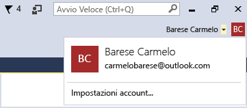
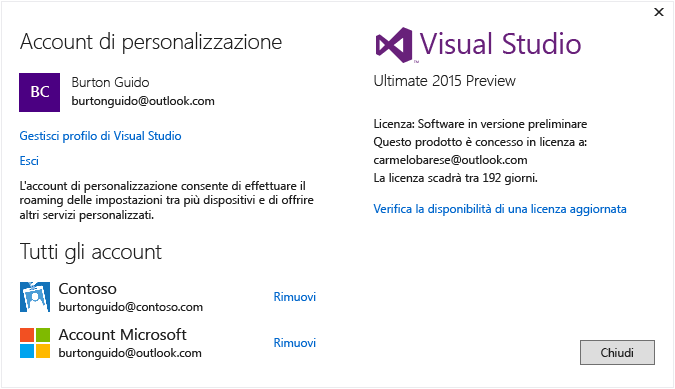

# Work with multiple user accounts
Se si dispone di più account Microsoft e/o di account aziendali o dell’istituto di istruzione è possibile aggiungerli tutti a Visual Studio in modo che le risorse di tutti gli account siano accessibili Da tutti gli account senza dover autenticarsi separatamente. I servizi di Azure, Application Insights, Team Foundation Server e Office 365 attualmente supportano l'esperienza di accesso semplificato. Servizi aggiuntivi possono diventare disponibili come passare del tempo.

 Dopo l'aggiunta di più account in un computer, tale set di account comune con l'utente se si accede a Visual Studio in un altro computer. È importante notare che, anche se si spostano i nomi di account, le credenziali non. Pertanto, verrà richiesto di immettere le credenziali per gli altri account la prima volta che si tenta di utilizzare le risorse nel nuovo computer.  

 Questa procedura dettagliata illustra come aggiungere più account a Visual Studio e come visualizzare le risorse accessibili da tali account in posizioni quali la finestra di dialogo **Aggiungi servizio connesso** , **Esplora server**, e **Team Explorer**.  

## Accedi a Visual Studio  

- Accedere a Visual Studio con un account Microsoft o un account aziendale. Il nome utente dovrebbe essere visualizzato nell'angolo superiore della finestra, come illustrato nella figura seguente:  

       

### Accedere all'account Azure in Esplora server  
 Premere **CTRL+ALT+S** per aprire **Esplora server**. Scegliere l'icona di Azure per espanderla e visualizzare le risorse disponibili nell'account Azure associato all'ID usato per accedere a Visual Studio. Dovrebbe apparire una struttura simile a quella seguente, che però contiene le risorse dell'utente.

   

 La prima volta che si usa Visual Studio su qualsiasi dispositivo specifico, la finestra di dialogo visualizzerà solo le sottoscrizioni registrate con l'ID di accesso all'IDE. È possibile accedere alle risorse per tutti gli altri account direttamente da **Esplora Server** facendo clic sul nodo di Azure e scegliendo **Gestisci e filtra sottoscrizioni** e aggiungendo gli account dal controllo selezione account. È possibile scegliere un altro account, se necessario, facendo clic sulla freccia giù, sceglierlo dall'elenco di account collegati. Dopo aver scelto l'account, è possibile scegliere le sottoscrizioni con tale account che si desidera visualizzare in Esplora Server.  

   

 Alla successiva apertura di Esplora Server, vengono visualizzate le risorse per tale sottoscrizioni.  

### Accedere all'account Azure tramite la finestra di dialogo Aggiungi servizio connesso  

1.  Creare un progetto di app universale in C#.  

2.  Scegliere il nodo del progetto in Esplora soluzioni e quindi **Aggiungi, Servizio connesso**. Viene visualizzata la procedura guidata **Aggiungi servizio connesso** con l'elenco dei servizi dell'account Azure associato all'ID di accesso di Visual Studio. Notare che non è necessario effettuare separatamente l'accesso ad Azure. Tuttavia, è necessario accedere ad altri account la prima volta che si tenta di accedere alle risorse da un determinato computer.  

    > [!WARNING]
    >  Se è la prima volta che si sta creando un'app di Store in Visual Studio in un computer specifico, verrà richiesto di abilitare il dispositivo per la modalità di sviluppo passando a **Impostazioni &#124; Aggiornamento e sicurezza &#124; Per sviluppatori** nel proprio computer. Per altre informazioni, vedere [Abilitare il dispositivo per lo sviluppo](https://msdn.microsoft.com/en-us/library/windows/apps/dn706236.aspx).  

###   Accedere ad Azure Active Directory in un progetto Web  
 Con Azure AD viene abilitato il supporto per end-user Single Sign-On in applicazioni Web ASP.NET o per Autenticazione di AD in servizi API Web. L'autenticazione di dominio è diverso da autenticazione degli account utente singoli; gli utenti che dispongono dell'accesso al dominio Active Directory è possono utilizzare gli account di Windows Azure esistenti per connettersi alle applicazioni web. Le applicazioni di Office 365 inoltre possono utilizzare l'autenticazione di dominio. Per un esempio, creare un'applicazione Web (**File, Nuovo progetto, C#, Cloud, Applicazione Web ASP.NET**). Nella finestra di dialogo Nuovo progetto ASP.NET scegliere **Modifica autenticazione**. Autenticazione guidata viene visualizzata e consente di scegliere il tipo di autenticazione da utilizzare nell'applicazione.  

   

 Per altre informazioni sui diversi tipi di autenticazione in ASP.NET, vedere [Creazione di progetti Web ASP.NET in Visual Studio 2013](http://www.asp.net/visual-studio/overview/2013/creating-web-projects-in-visual-studio#orgauth) (le informazioni sull'autenticazione sono ancora pertinenti per le versioni correnti di Visual Studio).  

### Accedere all'account di Visual Studio Team Services  
 Nel menu principale scegliere **Team, Connetti a Team Foundation Server** per visualizzare la finestra **Team Explorer**. Fare clic su **Seleziona progetti team**. A questo punto nella casella di riepilogo sotto **Seleziona Team Foundation Server**verrà visualizzato l'URL dell'account di Visual Studio Team Services. Quando si seleziona l'URL verrà registrato senza dover immettere nuovamente le credenziali.  

## Aggiungere un secondo account utente a Visual Studio  
 Fare clic sulla freccia GIÙ accanto al nome utente nell'angolo superiore di Visual Studio. Quindi scegliere la voce di menu **Impostazioni account**. Verrà visualizzata la finestra **Gestione account** con l'account usato per accedere. Scegliere il collegamento **Aggiungi nuovo account** in basso nella finestra di dialogo per aggiungere un nuovo account Microsoft oppure un nuovo account aziendale o dell'istituto di istruzione.  

   

 Seguire i prompt visualizzati per immettere le credenziali del nuovo account. La figura seguente mostra Gestione account dopo che un utente ha aggiunto il proprio account aziendale Contoso.com.  

   

## Accedere nuovamente alla procedura guidata Aggiungi servizio connesso e a Esplora server  
 Passare a **Esplora Server** destro del mouse sul nodo di Azure e scegliere Nuovo, **sottoscrizioni Gestisci e filtro**. Scegliere il nuovo account facendo clic sulla freccia accanto al conto corrente a discesa e quindi scegliere le sottoscrizioni che si desidera visualizzare in Esplora Server. Si noterà che tutti i servizi associati alla sottoscrizione specificata. Anche se non attualmente connessi all'IDE di Visual Studio con il secondo account, connesso a tale account servizi e risorse. Lo stesso vale per **Progetto, Aggiungi servizio connesso** e per **Team, Connetti a Team Foundation Server**.

<!--HONumber=Feb17_HO4-->

