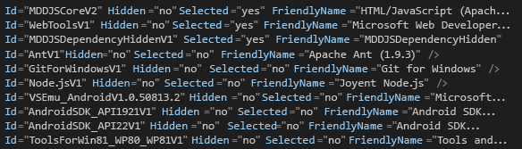

# Procedura: Creare ed eseguire un&#39;installazione automatica di Visual Studio
[!INCLUDE[vs2017banner](../code-quality/includes/vs2017banner.md)]

È possibile eseguire l'applicazione di installazione per [!INCLUDE[vsprvs](../code-quality/includes/vsprvs_md.md)] come un'installazione automatica, cioè invisibile all'utente, su una rete intranet invece che su un supporto tipo DVD. In questo argomento viene illustrato come preparare [!INCLUDE[vsprvs](../code-quality/includes/vsprvs_md.md)] per questo tipo di installazione da una condivisione di rete.  
  
## Creazione di un'immagine di rete  
 Innanzitutto, creare un'immagine di rete del supporto [!INCLUDE[vsprvs](../code-quality/includes/vsprvs_md.md)].  
  
#### Per creare un'immagine di rete  
  
1.  Creare una cartella sul server \(ad esempio, *Drive*:\\IDEinstall\\\).  
  
2.  Effettuare uno dei passaggi indicati di seguito.  
  
    -   Scaricare il programma di avvio automatico Web ed eseguire *Product*.exe \/Layout *Drive*:\\IDEinstall\\.  
  
         OR  
  
    -   Copiare i contenuti del supporto per Visual Studio nella cartella IDEinstall. Dopo aver copiato il contenuto, sarà comunque necessario scaricare qualsiasi software di terze parti da installare.  
  
3.  Condividere la cartella IDEinstall sulla rete e impostare le impostazioni di sicurezza appropriate.  
  
     Il percorso di rete dell'applicazione di installazione per [!INCLUDE[vsprvs](../code-quality/includes/vsprvs_md.md)] è simile a \\\\*ServerName*\\IDEinstall\\*Product*.exe.  
  
    > [!NOTE]
    >  L'installazione potrebbe non riuscire se una combinazione di percorso e nome file supera i 260 caratteri. La lunghezza massima di un percorso in [!INCLUDE[vsprvs](../code-quality/includes/vsprvs_md.md)] è 221 caratteri.  Il nome del percorso locale non deve superare i 70 caratteri e il nome del percorso di rete non deve superare i 39 caratteri.  
  
     L'installazione potrebbe non riuscire anche se i nomi delle cartelle nel percorso includono spazi \(ad esempio, "\\\\*ServerName*\\IDE install" oppure \\\\*ServerName*\\Visual Studio\\\).  
  
## Distribuzione di Visual Studio in modalità automatica  
 Per distribuire [!INCLUDE[vsprvs](../code-quality/includes/vsprvs_md.md)] in modalità automatica, è necessario modificare il file AdminDeployment.xml. A tale scopo, è necessario innanzitutto creare il file AdminDeployment.xml usando il parametro della riga di comando `/CreateAdminFile <file location>`. È quindi possibile usare tale file per effettuare il push di una distribuzione di Visual Studio sulla rete o per inserirla in un'installazione se si inserisce tale file nella directory *Drive*:\\IDEinstall\\packages. Il file AdminDeployment.xml non è univoco per un sistema operativo, architettura, edizione di Visual Studio o lingua del sistema operativo.  
  
> [!CAUTION]
>  In alcuni casi, gli elementi elencati come selezionati nel file AdminDeployment.xml non vengono installati. Per risolvere questo problema, inserire gli elementi contrassegnati "Selected\="yes"" alla **fine** del file AdminDeployment.xml.  
>   
>  Se non si vogliono installare le dipendenze facoltative di un elemento, sarà necessario selezionare prima l'elemento padre e quindi deselezionare le dipendenze facoltative dopo l'elemento padre, come illustrato nella schermata seguente:  
>   
>    
>   
>  Un altro modo per eseguire questa operazione consiste nell'omettere gli elementi figlio facoltativi di un elemento padre, vale a dire di non includere gli elementi "Selected\="no"", ma è necessario comunque inserire tutti gli elementi "Selected\="yes"" alla fine del file AdminDeployment.xml.  
  
> [!IMPORTANT]
>  Durante l'installazione, il computer potrebbe riavviarsi automaticamente una o più volte. Dopo il riavvio, è necessario accedere nuovamente con lo stesso account utente con cui è stato effettuato l'accesso per eseguire l'installazione prima di riavviare il computer. È possibile evitare i riavvii automatici installando i componenti prerequisiti prima di eseguire un'installazione automatica. Per altre informazioni, vedere la sezione intitolata "Evitare il riavvio durante l'installazione" nella [Guida di Visual Studio Administrator](../install/visual-studio-administrator-guide.md).  
  
 Lo schema del file AdminDeployment contiene i seguenti elementi:  
  
|Elemento|Attributo|Valori|Descrizione|  
|--------------|---------------|------------|-----------------|  
|BundleCustomizations|TargetDir|*Percorso*|Si comporta come la sostituzione del percorso nell'interfaccia utente dell'applicazione di installazione. Questo elemento viene ignorato se Visual Studio è già installato.|  
|BundleCustomizations|NoWeb|yes&#124;default|Se il valore di questo elemento è Sì, l'applicazione di installazione non tenta mai di accedere al Web durante l'azione di installazione.|  
|SelectableItemCustomization|Hidden|Yes&#124;No|Se il valore di questo elemento è Sì, nasconde un elemento selezionabile nell'albero della personalizzazione.|  
|SelectableItemCustomization|Selezionati|Yes&#124;No|Seleziona o deseleziona un elemento selezionabile nell'albero della personalizzazione.|  
|BundleCustomizations|Feed|Percorso|Percorso del feed che l'utente vuole usare.  Questo feed viene usato per le successive operazioni di modifica nel computer \("Default" per impostazione predefinita\).|  
|BundleCustomizations|SuppressRefreshPrompt|yes&#124;default|Impedisce che all'utente venga richiesto di aggiornare l'installazione se è disponibile una versione più recente.|  
|BundleCustomizations|NoRefresh|yes&#124;default|Non aggiorna l'installazione se è disponibile una versione più recente.|  
|BundleCustomizations|NoCacheOnlyMode|yes&#124;default|Impedisce il prepopolamento della cache del pacchetto.|  
  
> [!WARNING]
>  L'applicazione di installazione rispetterà lo stato selezionato di un elemento selezionabile anche se è nascosto. Ad esempio, se si desidera installare sempre un elemento selezionabile, è possibile contrassegnarlo come nascosto e selezionato.  
  
#### Per creare un'installazione automatica di Visual Studio  
  
1.  Nel file *Drive*:\\IDEinstall\\AdminDeployment.xml, modificare il valore dell'attributo NoWeb dell'elemento BundleCustomizations da "default" a "yes", come illustrato nell'esempio riportato di seguito:  
  
     Modificare `<BundleCustomizations TargetDir="default" NoWeb="default"/>` in `<BundleCustomizations TargetDir="default" NoWeb="yes"/>`  
  
2.  Modificare l'attributo SelectableItemCustomization in base alle esigenze per i componenti facoltativi, quindi salvare il file.  
  
## Esecuzione dell'installazione automatica  
 È possibile eseguire l'installazione automatica eseguendo automaticamente l'applicazione di installazione per Visual Studio nei computer client o consentendo agli utenti di eseguire autonomamente l'applicazione usando le impostazioni definite.  
  
#### Per eseguire un'installazione automatica in un computer client  
  
-   Aprire il menu **Start**, scegliere **Esegui**, quindi immettere `\\ServerName\IDEinstall\vs_Product.exe /adminfile PathOfTheAdmindeployment.xmlFile`*AdditionalParametersAsNeeded*  
  
     Ad esempio, è possibile specificare la seguente riga di comando: `\\server1\IDEinstall\vs_ultimate.exe /adminfile \\server1\ IDEinstall\AdminDeployment.xml /quiet /norestart`  
  
#### Per abilitare i client in modo da installare manualmente Visual Studio con le impostazioni predefinite  
  
1.  Copiare il file AdminDeployment.xml personalizzato su una condivisione di rete in sola lettura \(ad esempio, \\\\*ServerName*\\IDEinstall\\packages\\AdminDeployment.xml\).  
  
2.  Consentire agli utenti di effettuare l'installazione da tale condivisione.  
  
## Gestione di un'installazione  
 Se si apre il **Pannello di controllo** e si esegue nuovamente l'applicazione di installazione, è possibile modificare le funzionalità di Visual Studio, disinstallare linguaggi di programmazione e ripristinare o disinstallare Visual Studio.  
  
> [!NOTE]
>  Per usare la modalità di manutenzione è necessario disporre delle credenziali amministrative sul computer locale.  
  
#### Per mantenere un'installazione su un computer client  
  
-   Aprire il **Pannello di controllo**, quindi scegliere **Programmi e funzionalità**.  
  
-   Scegliere [!INCLUDE[vsprvs](../code-quality/includes/vsprvs_md.md)], quindi scegliere **Modifica**.  
  
#### Per modificare le impostazioni di AdminDeployment in un computer client dopo l'installazione di Visual Studio  
  
1.  Aggiornare AdminDeployment.xml in base alle esigenze.  
  
2.  Aprire il menu **Start**, quindi scegliere **Esegui**.  
  
3.  Immettere il seguente testo:  
  
     `\\ServerName\IDEinstall\vs_Product.exe /AdminFile PathToAdmindeployment.xmlFile` AdditionalParametersAsNeeded  
  
     Ad esempio, è possibile specificare la seguente riga di comando: `\\server1\IDEinstall\vs_ultimate.exe /adminfile \\server1\IDEinstall\AdminDeployment.xml /quiet /norestart`  
  
 Repair è il parametro predefinito dopo l'installazione di Visual Studio. Se si ripristina Visual Studio con un \/AdminFile aggiornato, si eseguirà l'override delle impostazioni di distribuzione Admin correnti con quelle richiamate da AdminDeployment.xml aggiornato.  
  
## Registrare il prodotto  
 Al termine dell'installazione, è possibile registrare la copia di [!INCLUDE[vsprvs](../code-quality/includes/vsprvs_md.md)] dall'interno di [!INCLUDE[vsprvs](../code-quality/includes/vsprvs_md.md)].  
  
#### Per effettuare la registrazione  
  
1.  Aprire il menu **Guida**, quindi scegliere **Registra prodotto**.  
  
2.  Immettere il codice Product Key  
  
## Vedere anche  
 [Installazione di Visual Studio](../Topic/Installing%20Visual%20Studio%202015.md)