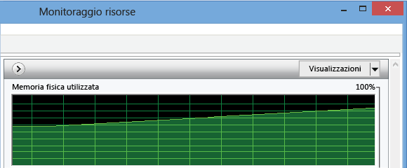
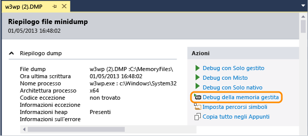
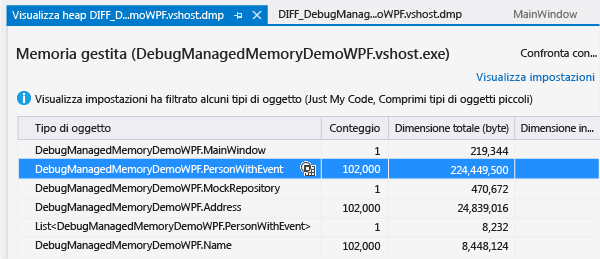
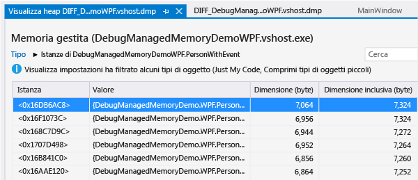
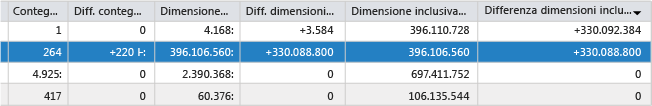

# Analizzare i problemi relativi alla memoria .NET Framework
L'analizzatore di memoria gestita di Visual Studio permette di rilevare perdite di memoria e uso non efficiente della memoria nel codice .NET.  La versione minima di .NET Framework per il codice di destinazione è .NET Framework 4.5.  
  
 Lo strumento di analisi della memoria analizza le informazioni disponibili nei *file di dump con dati dell'heap* che corrispondono a una copia degli oggetti presenti nella memoria di un'app.  È possibile raccogliere file di dump \(con estensione dmp\) dall'IDE di Visual Studio oppure usando altri strumenti di sistema.  
  
-   È possibile analizzare un singolo snapshot per ottenere informazioni sull'impatto relativo dei tipi di oggetto sull'uso della memoria e per individuare nell'app il codice che usa la memoria in modo non efficiente.  
  
-   È anche possibile confrontare \(*diff*\) due snapshot di un'app per individuare le aree del codice che provocano l'incremento dell'uso della memoria nel tempo.  
  
 Per informazioni dettagliate sull'analizzatore di memoria gestita, vedere il post relativo all'[uso di Visual Studio 2013 per la diagnosi di problemi di memoria .NET in produzione](http://blogs.msdn.com/b/visualstudioalm/archive/2013/06/20/using-visual-studio-2013-to-diagnose-net-memory-issues-in-production.aspx) nel blog su Visual Studio ALM \+ Team Foundation Server .  
  
##   Sommario  
 [Uso della memoria nelle app .NET Framework](#BKMK_Memory_use_in__NET_Framework_apps)  
  
 [Identificare un problema di memoria in un'app](#BKMK_Identify_a_memory_issue_in_an_app)  
  
 [Raccogliere snapshot di memoria](#BKMK_Collect_memory_snapshots)  
  
 [Analizzare l'uso della memoria](#BKMK_Analyze_memory_use)  
  
##   Uso della memoria nelle app .NET Framework  
 .NET Framework è un runtime con Garbage Collection. Nella maggior parte delle app, quindi, l'uso della memoria non costituisce un problema.  Nelle applicazioni con esecuzione prolungata, ad esempio servizi e applicazioni Web, e nei dispositivi con quantità limitata di memoria l'accumulo di oggetti in memoria può influire negativamente sulle prestazioni dell'app e del dispositivo in cui è eseguita.  L'uso eccessivo di memoria può privare di risorse l'applicazione e la macchina, nel caso in cui l'esecuzione del Garbage Collector sia troppo frequente o se il sistema operativo deve spostare memoria tra la RAM e il disco.  Nel caso peggiore, è possibile che un'app si arresti in modo anomalo, con un'eccezione di tipo "Memoria insufficiente".  
  
 L'*heap gestito* di .NET è un'area della memoria virtuale in cui sono archiviati gli oggetti di riferimento creati da un'app.  La durata degli oggetti è gestita dal Garbage Collector \(GC\),  che usa i riferimenti per tenere traccia degli oggetti che occupano blocchi di memoria.  Un riferimento viene creato quando si crea un oggetto e lo si assegna a una variabile.  Un singolo oggetto può avere più riferimenti.  Ad esempio, è possibile creare riferimenti aggiuntivi a un oggetto tramite l'aggiunta dell'oggetto a una classe, una raccolta o un'altra struttura di dati oppure tramite l'assegnazione dell'oggetto a una seconda variabile.  Un riferimento può essere creato anche, in modo meno ovvio, da un oggetto che aggiunge un gestore a un evento di un altro oggetto.  In questo caso il secondo oggetto conserva il riferimento al primo oggetto fino alla rimozione esplicita del gestore o all'eliminazione del secondo oggetto.  
  
 Il Garbage Collector mantiene per ogni applicazione un albero dei riferimenti, che tiene traccia degli oggetti a cui l'applicazione fa riferimento.  L'*albero dei riferimenti* ha un insieme di radici, che include oggetti globali e statici, oltre a stack di thread associati e oggetti con istanze create in modo dinamico.  Un oggetto contiene una radice se è presente almeno un oggetto padre che include un riferimento all'oggetto.  Il Garbage Collector può recuperare la memoria di un oggetto solo quando nessun altro oggetto o variabile dell'applicazione include riferimenti a tale oggetto.  
  
  [Sommario](#BKMK_Contents)  
  
##   Identificare un problema di memoria in un'app  
 Il sintomo più evidente di problemi di memoria è individuabile nelle prestazioni dell'app, in particolare in caso di peggioramento delle prestazioni nel tempo.  Anche il peggioramento delle prestazioni di altre app durante l'esecuzione dell'app specifica potrebbe indicare un problema di memoria.  Se si sospetta un problema di memoria, usare uno strumento quale Gestione attività o [Windows Performance Monitor](http://technet.microsoft.com/library/cc749249.aspx) per approfondire la verifica.  Una possibile origine della perdita di memoria potrebbe essere, ad esempio, un incremento inspiegabile nella dimensione totale della memoria:  
  
   
  
 È anche possibile che si notino picchi di memoria superiori a quanto suggerito dalle proprie conoscenze del codice e che potrebbero indicare un uso non efficiente della memoria in una procedura:  
  
   
  
##   Raccogliere snapshot di memoria  
 Lo strumento di analisi della memoria permette di analizzare le informazioni disponibili nei *file di dump* che includono informazioni sull'heap.  È possibile creare file di dump in Visual Studio oppure usare uno strumento quale [ProcDump](http://technet.microsoft.com/sysinternals/dd996900.aspx) disponibile in [Windows Sysinternals](http://technet.microsoft.com/sysinternals).  Vedere il post che include [informazioni sui file di dump e su come crearne uno](http://blogs.msdn.com/b/debugger/archive/2009/12/30/what-is-a-dump-and-how-do-i-create-one.aspx) nel blog del team del Debugger di Visual Studio.  
  
> [!NOTE]
>  La maggior parte degli strumenti può raccogliere informazioni sui file di dump con o senza dati di memoria heap completi.  L'analizzatore di memoria di Visual Studio richiede informazioni complete sull'heap.  
  
 **Per raccogliere un file di dump da Visual Studio**  
  
1.  È possibile creare un file di dump per un processo avviato da un progetto di Visual Studio oppure collegare il debugger a un processo in esecuzione.  Vedere [Connessione a processi in esecuzione](../debugger/attach-to-running-processes-with-the-visual-studio-debugger.md).  
  
2.  Arrestare l'esecuzione.  Il debugger si arresta quando si sceglie **Interrompi tutto** dal menu **Debug** oppure in corrispondenza di un'eccezione o di un punto di interruzione.  
  
3.  Scegliere **Salva dump con nome** dal menu **Debug**.  Nella finestra di dialogo **Salva dump con nome** specificare un percorso e assicurarsi che l'opzione predefinita **Minidump con Heap** sia selezionata nell'elenco **Salva come**.  
  
 **Per confrontare due snapshot di memoria**  
  
 Per analizzare l'incremento nell'uso di memoria di un'app, raccogliere due file di dump da una singola istanza dell'app.  
  
  [Sommario](#BKMK_Contents)  
  
##   Analizzare l'uso della memoria  
 [Filtrare l'elenco di oggetti](#BKMK_Filter_the_list_of_objects) **&#124;** [Analizzare i dati di memoria da un singolo snapshot](#BKMK_Analyze_memory_data_in_from_a_single_snapshot) **&#124;** [Confrontare due snapshot di memoria](#BKMK_Compare_two_memory_snapshots)  
  
 Per analizzare un file di dump alla ricerca di problemi di uso della memoria:  
  
1.  In Visual Studio scegliere **Apri** dal menu **File**, quindi specificare il file di dump.  
  
2.  Nella pagina **Riepilogo file minidump** scegliere **Debug della memoria gestita**.  
  
       
  
 L'analizzatore di memoria avvia una sessione di debug per analizzare il file e mostra i risultati nella pagina Visualizza heap:  
  
  [Sommario](#BKMK_Contents)  
  
###   Filtrare l'elenco di oggetti  
 Per impostazione predefinita, l'analizzatore di memoria filtra l'elenco di oggetti in uno snapshot di memoria per mostrare solo i tipi e le istanze che corrispondono a codice utente e per mostrare solo i tipi la cui dimensione inclusiva totale supera una percentuale di soglia della dimensione totale dell'heap.  È possibile modificare queste opzioni nell'elenco **Impostazioni visualizzazione**:  
  
|||  
|-|-|  
|**Abilita Just My Code**|Just My Code nasconde la maggior parte degli oggetti di sistema più comuni, in modo che nell'elenco siano visualizzati solo i tipi creati dall'utente.   È anche possibile impostare l'opzione Just My Code nella finestra di dialogo **Opzioni** di Visual Studio.  Scegliere **Opzioni e impostazioni** dal menu **Debug**.  Nella scheda **Debug**\/**Generale** selezionare o deselezionare **Just My Code**.|  
|**Comprimi oggetti piccoli**|**Comprimi oggetti piccoli** nasconde tutti i tipi la cui dimensione inclusiva totale è inferiore allo 0,5 percento della dimensione totale dell'heap.|  
  
 È anche possibile filtrare l'elenco di tipi immettendo una stringa nella casella **Cerca**.  L'elenco mostra solo i tipi i cui nomi includono la stringa.  
  
  [Sommario](#BKMK_Contents)  
  
###   Analizzare i dati di memoria da un singolo snapshot  
 Visual Studio avvia una nuova sessione di debug per analizzare il file, quindi mostra i dati della memoria in una finestra Visualizza heap.  
  
   
  
  [Sommario](#BKMK_Contents)  
  
#### Tabella Tipo di oggetto  
 Nella tabella in alto sono elencati tutti i tipi di oggetti conservati in memoria.  
  
-   **Conteggio** mostra il numero di istanze del tipo nello snapshot.  
  
-   **Dimensione \(byte\)** indica la dimensione di tutte le istanze del tipo, esclusa la dimensione degli oggetti a cui include riferimenti.  In  
  
-   **Dimensione inclusiva \(byte\)** sono indicate le dimensioni degli oggetti a cui si fa riferimento.  
  
 Per visualizzare un elenco delle istanze del tipo, è possibile scegliere l'icona relativa alle istanze \(\) nella colonna **Tipo di oggetto**.  
  
#### Tabella Istanza  
   
  
-   L'**istanza** è la posizione di memoria dell'oggetto usato come identificatore di oggetto dell'oggetto.  
  
-   In **Valore** sono mostrati i valori effettivi dei tipi di valore.  È possibile passare il puntatore del mouse sul nome di un tipo di riferimento per visualizzarne i valori di dati in un suggerimento relativo ai dati.  
  
       
  
-   **Dimensione \(byte\)** indica la dimensione dell'oggetto, esclusa la dimensione degli oggetti a cui include riferimenti.  In  
  
-   **Dimensione inclusiva \(byte\)** sono indicate le dimensioni degli oggetti a cui si fa riferimento.  
  
 Per impostazione predefinita, i tipi e le istanze sono ordinati in base alla **Dimensione inclusiva \(byte\)**.  Per cambiare l'ordinamento, scegliere un'intestazione di colonna dell'elenco.  
  
#### Percorsi della radice  
  
-   Per un tipo selezionato dalla tabella **Tipo di oggetto**, nella tabella **Percorsi della radice** sono mostrate le gerarchie univoche di tipi che portano agli oggetti radice per tutti gli oggetti di tipo corrispondente, oltre al numero di riferimenti al tipo che si trova al livello superiore nella gerarchia.  
  
-   Per un oggetto selezionato dall'istanza di un tipo, **Percorsi della radice** mostra un grafico degli oggetti effettivi che includono un riferimento all'istanza.  È possibile passare il puntatore del mouse sul nome dell'oggetto per visualizzarne i valori di dati in un suggerimento relativo ai dati.  
  
#### Tipi a cui si fa riferimento \/ Oggetti a cui si fa riferimento  
  
-   Per un tipo selezionato dalla tabella **Tipo di oggetto**, nella scheda **Tipi a cui si fa riferimento** sono mostrati la dimensione e il numero di tipi a cui si fa riferimento contenuti in tutti gli oggetti del tipo selezionato.  
  
-   Per un'istanza selezionata di un tipo, **Oggetti a cui si fa riferimento** mostra gli oggetti inclusi nell'istanza selezionata.  È possibile passare il puntatore del mouse sul nome per visualizzarne i valori di dati in un suggerimento relativo ai dati.  
  
 **Riferimenti circolari**  
  
 Un oggetto può fare riferimento a un secondo oggetto che contiene in modo diretto o indiretto un riferimento al primo oggetto.  Quando l'analizzatore di memoria incontra questa situazione, interrompe l'espansione del percorso di riferimento e aggiunge un'annotazione **\[Rilevato ciclo\]** all'elenco del primo oggetto, quindi si arresta.  
  
 **Tipi radice**  
  
 L'analizzatore di memoria aggiunge annotazioni agli oggetti radice che descrivono il tipo di riferimento incluso:  
  
|Annotazione|Descrizione|  
|-----------------|-----------------|  
|**Variabile statica** `VariableName`|Una variabile statica.  `VariableName` è il nome della variabile.|  
|**Handle finalizzazione**|Un riferimento dalla coda del finalizzatore.|  
|**Variabile locale**|Una variabile locale.|  
|**Handle sicuro**|Un handle per un riferimento sicuro dalla tabella di handle degli oggetti.|  
|**Asincrono.  Handle bloccato**|Un oggetto bloccato asincrono dalla tabella di handle degli oggetti.|  
|**Handle dipendente**|Un oggetto dipendente dalla tabella di handle degli oggetti.|  
|**Handle bloccato**|Un riferimento sicuro bloccato dalla tabella di handle degli oggetti.|  
|**Handle RefCount**|Un oggetto con conteggio dei riferimenti dalla tabella di handle degli oggetti.|  
|**Handle SizedRef**|Un handle sicuro che conserva una dimensione approssimativa della chiusura collettiva di tutti gli oggetti e di tutte le radici di oggetto in fase di Garbage Collection.|  
|**Variabile locale bloccata**|Una variabile locale bloccata.|  
  
###   Confrontare due snapshot di memoria  
 È possibile confrontare due file di dump di un processo per individuare oggetti che potrebbero essere la causa di perdite di memoria.  L'intervallo tra la raccolta del primo file \(precedente\) e del secondo file \(successivo\) deve essere sufficientemente ampio da rendere chiaramente evidente l'incremento del numero di oggetti persi.  Per confrontare i due file:  
  
1.  Aprire il secondo file di dump, quindi scegliere **Debug della memoria gestita** nella pagina **Riepilogo file minidump**.  
  
2.  Nella pagina del rapporto di analisi sulla memoria aprire l'elenco **Selezionare il file di base**, quindi scegliere **Sfoglia** per specificare il primo file di dump.  
  
 L'analizzatore aggiunge colonne nel riquadro superiore del rapporto per visualizzare la differenza tra i valori **Conteggio**, **Dimensione** e **Dimensione inclusiva** dei tipi rispetto ai valori nello snapshot precedente.  
  
   
  
 Anche la colonna **Diff. conteggio riferimenti** è aggiunta alla tabella **Percorsi della radice**.  
  
  [Sommario](#BKMK_Contents)  
  
## Vedere anche  
 [Post del blog su VS ALM TFS relativo all'uso di Visual Studio 2013 per la diagnosi rei problemi di memoria .NET in produzione](http://blogs.msdn.com/b/visualstudioalm/archive/2013/06/20/using-visual-studio-2013-to-diagnose-net-memory-issues-in-production.aspx)   
 [Channel 9 &#124; Visual Studio TV &#124; Analisi della memoria condivisa](http://channel9.msdn.com/Series/Visual-Studio-2012-Premium-and-Ultimate-Overview/Managed-Memory-Analysis)   
 [Channel 9 &#124; Visual Studio Toolbox &#124; Analisi della memoria condivisa in Visual Studio 2013](http://channel9.msdn.com/Shows/Visual-Studio-Toolbox/Managed-Memory-Analysis-in-Visual-Studio-2013)