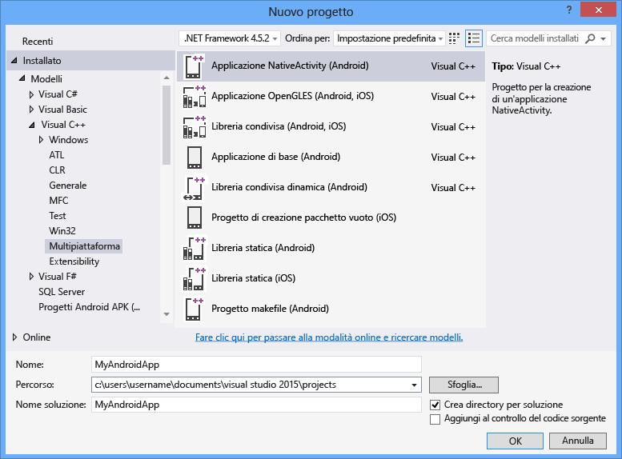

# Creare app multipiattaforma con Visual C++
Per compilare codice multipiattaforma per dispositivi Android, iOS e Windows è possibile usare Visual C\+\+ per lo sviluppo di app per dispositivi mobili multipiattaforma,  Una funzionalità facoltativa disponibile in Visual Studio 2015 che consente lo sviluppo di codice multipiattaforma per iOS, Android e Windows usando Visual C\+\+.  
  
 È possibile usare Visual Studio per creare librerie condivise di codice C\+\+ standard per applicazioni Classic Windows, app Windows Universal, piattaforme iOS e Android.  È possibile creare app native per piattaforme Windows e Android usando solo Visual C\+\+ e gli strumenti di terze parti integrati in Visual Studio.  Se si dispone di un computer Mac, è possibile utilizzare Visual Studio per creare ed eseguire il debug di codice C\+\+ per le applicazioni iOS compilate e distribuite su Mac.  
  
> [!NOTE]
>  Visual C\+\+ per lo sviluppo di app per dispositivi mobili multipiattaforma supporta automaticamente l'API Android livello 19 e 21 ed è quindi utilizzabile con Android 4.4 e 5.0.  È possibile installare altri livelli API con SDK Manager.  Il debugger Android di Visual Studio C\+\+ Android richiede che gli emulatori o i dispositivi di destinazione eseguano almeno l'API Android livello 17 \(versione 4.2\) o versione successiva.  
  
 Questo articolo illustra come iniziare a creare app multipiattaforma usando Visual C\+\+ per lo sviluppo di app per dispositivi mobili multipiattaforma in Visual Studio 2015:  
  
 [Requisiti](#req)   
 [Ottenere gli strumenti](#GetTools)  
 [Creare un nuovo progetto Android NativeActivity](#Create)  
 [Compilare ed eseguire l'app Android NativeActivity](#BuildHello)  
  
##   Requisiti  
  
-   Per i requisiti di installazione, vedere [Requisiti di sistema di Visual Studio 2015](https://www.visualstudio.com/visual-studio-2015-system-requirements-vs).  
  
    > [!IMPORTANT]
    >  Se si usa Windows 7 o Windows Server 2008 R2, è possibile sviluppare codice per applicazioni di Windows classiche, librerie di codice e app Android NativeActivity, nonché librerie di codice e app per iOS, ma non app di Windows Store o di Windows universale.  
  
 Per compilare le app per specifiche piattaforme del dispositivo sono necessari alcuni requisiti aggiuntivi:  
  
-   Gli emulatori Windows Phone e Visual Studio Emulator for Android richiedono un computer in grado di eseguire Hyper\-V.  Per altre informazioni, vedere i [requisiti di sistema](http://msdn.microsoft.com/it-it/4d5bb438-231a-4cd2-84b7-e9660b0e3baf) dell'emulatore.  
  
-   Gli emulatori Android x86 inclusi in Android SDK offrono i risultati migliori nei computer in grado di eseguire il driver HAXM Intel.  A questo scopo è necessario un processore Intel x64 con supporto di VT\-x e della funzionalità del bit di disattivazione dell'esecuzione \(XD, Execute Disable Bit\).  Per altre informazioni, vedere le [istruzioni di installazione per Intel® Hardware Accelerated Execution Manager \- Microsoft Windows](http://go.microsoft.com/fwlink/p/?LinkId=536385).  
  
-   Per la compilazione di app per iOS sono necessari un account del programma per sviluppatori iOS e un computer Mac che esegue Xcode 6.  
  
##   Ottenere gli strumenti  
 Visual C\+\+ per lo sviluppo di app per dispositivi mobili multi piattaforma è un componente facoltativo incluso in Visual Studio 2015.  Per ottenere Visual Studio, passare alla pagina [Download di Visual Studio 2015](http://go.microsoft.com/fwlink/?linkid=517106) e scaricare Visual Studio 2015.  
  
 Il programma di installazione per Visual Studio 2015 include un'opzione che supporta lo sviluppo di app per dispositivi mobili multipiattaforma,  che  offre la scelta di installare Visual C\+\+ Mobile Development e i seguenti strumenti ed SDK comuni.  Molte di queste opzioni sono software open source richiesti dal supporto multipiattaforma.  
  
-   Android Native Development Kit \(R10E, 32 bit\) è necessario per il processo di compilazione Android.  
  
-   Android SDK, Apache Ant e Java SE Development Kit sono richiesti per il processo di compilazione Android.  
  
-   Visual Studio Emulator for Android è un emulatore veloce e capace per lo sviluppo di Android.  
  
 Per istruzioni dettagliate per l'installazione, vedere [Installare Visual C\+\+ per Sviluppo app per dispositivi mobili multipiattaforma](../cross-platform/install-visual-cpp-for-cross-platform-mobile-development.md).  
  
 Per compilare codice per iOS, è necessario impostare e configurare un agente di compilazione remoto sul Mac e connettersi ad esso in Visual Studio.  Per informazioni dettagliate e istruzioni di configurazione, vedere [Installare e configurare gli strumenti per la compilazione con iOS](../cross-platform/install-and-configure-tools-to-build-using-ios.md).  
  
##   Creare un nuovo progetto Android NativeActivity  
 È possibile utilizzare Visual C\+\+ per lo sviluppo di app per dispositivi mobili multipiattaforma per creare, compilare e sottoporre a debug un'app Android completa mediante C\+\+.  Per iniziare, Visual Studio include un modello per un progetto Android NativeActivity.  
  
 In questa esercitazione verrà innanzitutto creato un nuovo progetto e quindi verrà compilata ed eseguita l’app predefinita.  
  
 Prima di creare un nuovo progetto, verificare che tutti i requisiti di sistema siano soddisfatti e che Visual C\+\+ per lo sviluppo di app per dispositivi mobili multipiattaforma per Visual Studio sia installato.  Per ulteriori informazioni vedere [Installare Visual C\+\+ per Sviluppo app per dispositivi mobili multipiattaforma](../cross-platform/install-visual-cpp-for-cross-platform-mobile-development.md).  
  
#### Per creare un nuovo progetto  
  
1.  Aprire Visual Studio.  Nella barra dei menu scegliere **File**, **Nuovo**, **Progetto**.  
  
2.  Nella finestra di dialogo **Nuovo progetto**, in **Modelli**, selezionare **Visual C\+\+**, **Multipiattaforma**, quindi scegliere il modello **Applicazione NativeActivity \(Android\)**.  
  
3.  Assegnare all'app un nome come `MyAndroidApp` e fare clic su **OK**.  
  
       
  
     Visual Studio crea la nuova soluzione e apre Esplora soluzioni.  
  
 La nuova soluzione per app NativeActivity Android include due progetti:  
  
-   **MyAndroidApp.NativeActivity**, che contiene i riferimenti e il codice glue per l'app da eseguire come NativeActivity in Android.  L'implementazione dei punti di ingresso dal codice glue si trova nel file main.cpp.  Le intestazioni precompilate sono invece in pch.h.  Il progetto dell'app viene compilato in una file di libreria condivisa con estensione so che viene selezionato dal progetto Packaging.  
  
-   **MyAndroidApp.Packaging** crea il file con estensione apk per la distribuzione in un emulatore o dispositivo Android.  Questo progetto contiene le risorse e il file AndroidManifest.xml in cui sono state impostate le proprietà del manifesto.  Contiene inoltre il file build.xml che controlla il processo di compilazione Ant.  Per impostazione predefinita, è impostato come progetto di avvio in modo che possa essere distribuito ed eseguito direttamente da Visual Studio.  
  
##   Compilare ed eseguire l'app Android NativeActivity  
 Compilare ed eseguire l'app generata dal modello per verificare l'installazione e la configurazione.  Per impostazione predefinita, il modello imposta la configurazione della soluzione per il debug e la piattaforma della soluzione su x86 per eseguire l'app in Microsoft Visual Studio Emulator for Android.  Se si preferisce testare l'app in un'altra destinazione, caricare l'emulatore apposito o connettere il dispositivo al computer.  
  
#### Per compilare ed eseguire l'app NativeActivity predefinita  
  
1.  Nella barra dei menu scegliere **Compilazione**, **Compila soluzione**.  
  
     La finestra **Output** mostra l'output del processo di compilazione per i due progetti nella soluzione.  
  
2.  Scegliere uno dei profili dell'emulatore VS come destinazione della distribuzione.  
  
     Se sono stati installati altri emulatori o è stato connesso un dispositivo Android, è possibile selezionarli nell'elenco a discesa delle destinazioni della distribuzione.  
  
3.  Premere F5 per avviare il debug o MAIUSC\+F5 per avviare senza eseguire il debug.  
  
     Ecco come viene visualizzata l'app predefinita in Visual Studio Emulator for Android.  
  
       
  
    > [!TIP]
    >  All'avvio dell'emulatore in Visual Studio, il processo di caricamento e distribuzione del codice richiede qualche istante.  Una volta avviata l'app, è possibile impostare i punti di interruzione e usare il debugger per eseguire il codice un'istruzione alla volta, esaminare le variabili locali e controllare i valori.  
  
4.  Premere MAIUSC\+F5 per arrestare il debug.  
  
     L'emulatore è un processo separato che continua a essere eseguito.  È possibile modificare, compilare e distribuire il codice più volte nello stesso emulatore.  
  
## Vedere anche  
 [Scaricare Visual Studio 2015](http://go.microsoft.com/fwlink/?linkid=517106)