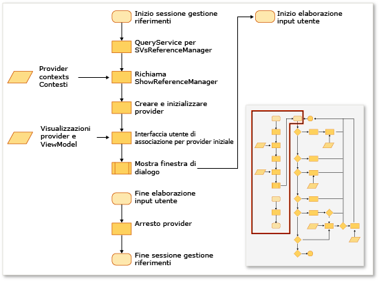
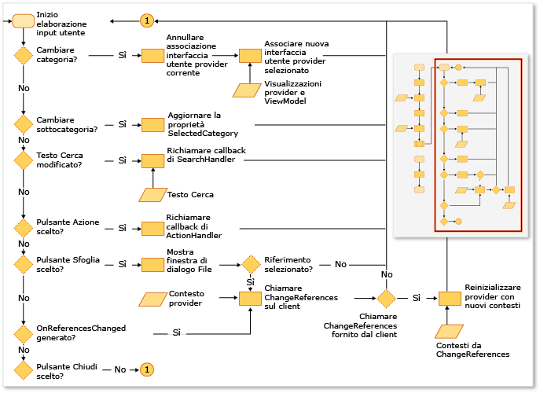

# Estensione di Gestione riferimenti
È possibile aggiungere riferimenti al progetto usando Gestione riferimenti in un'estensione di Visual Studio. Prima che Gestione riferimenti venga visualizzato, deve essere configurato dai progetti in modo da mostrare i dati dai percorsi corretti. Ad esempio, un progetto destinato a [!INCLUDE[net_v40_short](../code-quality/includes/net_v40_short_md.md)] deve inserire gli assembly da una cartella diversa rispetto a un progetto destinato a [!INCLUDE[net_v35_long](../misc/includes/net_v35_long_md.md)].  
  
 In genere, Gestione riferimenti viene configurato usando una raccolta di oggetti ProviderContext dai provider seguenti:  
  
-   <xref:Microsoft.VisualStudio.Shell.Interop.IVsAssemblyReferenceProviderContext>  
  
-   <xref:Microsoft.VisualStudio.Shell.Interop.IVsComReferenceProviderContext>  
  
-   <xref:Microsoft.VisualStudio.Shell.Interop.IVsFileReferenceProviderContext>  
  
-   <xref:Microsoft.VisualStudio.Shell.Interop.IVsProjectReferenceProviderContext>  
  
-   <xref:Microsoft.VisualStudio.Shell.Interop.IVsPlatformReferenceProviderContext>  
  
 Un componente client visualizza Gestione riferimenti chiamando il metodo ShowReferenceManager nel servizio di Visual Studio denominato SVsReferenceManager. Una raccolta di classi IVsReferenceProviderContext viene passata in questo metodo come argomento. Questi contesti determinano le schede visualizzate lungo il lato destro della finestra di dialogo Gestione riferimenti. Ogni provider contiene tutte le informazioni necessarie perché la finestra di dialogo contenga e visualizzi tutti i dati appropriati per consentire l'aggiunta di un riferimento al progetto.  
  
 La figura seguente mostra un riepilogo del processo.  
  
   
  
   
  
## Aggiunta di una scheda personalizzata  
 Per aggiungere una scheda personalizzata, è necessario implementare un oggetto IReferenceProvider, un oggetto IVsReference e un oggetto IVsReferenceProviderContext.  
  
#### Per aggiungere una scheda personalizzata  
  
1.  Implementare l'interfaccia IReferenceProvider e quindi esportarla tramite Managed Extensibility Framework \(MEF\) perché possa essere usata da Gestione riferimenti.  
  
     Gestione riferimenti usa l'oggetto ReferenceProvider per generare gli elementi visualizzati al proprio interno. L'interfaccia per questo oggetto è definita in Microsoft.VisualStudio.ReferenceManager.Contracts.dll.  
  
2.  Implementare un oggetto ProviderContext.  
  
     Gestione riferimenti usa la proprietà GUID di questo oggetto per associare il contesto al provider. Durante l'inizializzazione, Gestione riferimenti passa al provider l'oggetto ProviderContext passato tramite il metodo ShowReferenceManager. L'oggetto ProviderContext deve contenere tutte le informazioni necessarie al provider per enumerare oggetti IVsReference.  
  
3.  Estendere la classe StandardReferenceProviderContext.  
  
     Gestione riferimenti fornisce alcune classi base, come la classe StandardReferenceProviderContext, che è possibile usare per iniziare. La classe Provider può estendere StandardReferenceProvider e l'elemento di riferimento può estendere StandardReferenceItem.  
  
 La classe Provider potrebbe avere un aspetto simile al seguente:  
  
```  
[Export(typeof(IReferenceProvider))] [ExportMetadata("Name", "AssemblyReferenceProvider")] [ExportMetadata("Guid", VSConstants.AssemblyReferenceProvider_string)] internal class AssemblyReferenceProvider : StandardReferenceProvider { }  
```  
  
 La classe Context potrebbe avere un aspetto simile al seguente:  
  
```  
  
[Export(typeof(IVsReferenceProviderContext))] [Export(typeof(IVsAssemblyReferenceProviderContext))] [Export("AssemblyReferenceProviderContext", typeof(IVsReferenceProviderContext))] [Export(VSConstants.AssemblyReferenceProvider_string, typeof(IVsReferenceProviderContext))] [PartCreationPolicy(System.ComponentModel.Composition.CreationPolicy.NonShared)] [ExportMetadata("Name", "AssemblyReferenceProviderContext")] [ExportMetadata("Guid", VSConstants.AssemblyReferenceProvider_string)] public class AssemblyReferenceProviderContext : StandardReferenceProviderContext<IVsAssemblyReference, AssemblyIdentity>, IVsAssemblyReferenceProviderContext { }  
```  
  
 Per la classe dell'elemento di riferimento, è consigliabile implementare IWatchableReference e rendere la classe serializzabile. Usando questo approccio, è possibile trarre vantaggio dai metodi di serializzazione della cache nella classe StandardReferenceProvider, nonché dal servizio ReferenceWatcher, che sincronizza automaticamente gli elementi selezionati tra le diverse schede nella finestra di dialogo:  
  
```  
[Serializable] public class StandardReferenceItem : IWatchableReference { }  
```  
  
 La classe ReferenceProvider contiene due metodi importanti. Il primo metodo è Initialize, che viene chiamato una sola volta al primo caricamento del provider nella finestra di dialogo. Il secondo metodo è SetContext, che viene chiamato immediatamente dopo Initialize, ma che può essere chiamato di nuovo se il progetto non riesce per aggiungere qualsiasi riferimento specificato e di cui si è tentato il commit.  
  
> [!NOTE]
>  Poiché i provider vengono mantenuti per tutta la durata del programma, possono salvare lo stato tra sessioni, ma possono verificarsi condizioni di competizione se l'utente chiude la finestra di dialogo e quindi la riapre velocemente.  
  
## Eseguire l'override dell'origine esistente dell'enumerazione delle schede  
 Alcuni contesti di provider hanno una proprietà chiamata Tabs, il cui tipo è uint. Questa proprietà è una maschera di bit e i suoi valori controllano le schede visualizzate dal provider.  Ad esempio, l'interfaccia IVsAssemblyReferenceProviderContext definisce una proprietà Tabs, che può essere impostata sui valori seguenti:  
  
```  
namespace Microsoft.VisualStudio.Shell.Interop { public enum __VSASSEMBLYPROVIDERTAB { TAB_ASSEMBLY_FRAMEWORK = 1, TAB_ASSEMBLY_EXTENSIONS = 2, TAB_ASSEMBLY_ALL = 3, } }  
```  
  
 La classe IVsPlatformReferenceProviderContext ha una proprietà simile. Non è possibile modificare il nome della scheda, ma è possibile controllare il testo dell'intestazione visualizzato quando l'utente seleziona la scheda. È possibile controllare questo valore tramite i metodi seguenti nella classe IVsAssemblyProviderContext:  
  
```  
void SetTabTitle(uint etabId, string szTabTitle);  
```  
  
## Eseguire l'override del filtro nella finestra di dialogo Sfoglia  
 È possibile specificare un filtro dei tipi personalizzato nella finestra di dialogo Sfoglia in Gestione riferimenti modificando il valore della proprietà BrowseFilter nell'oggetto IFileReferenceProviderContext.  L'esempio seguente mostra questa tecnica per il codice nativo:  
  
```  
  
// Holds a list of provider contexts CComSafeArray<LPUNKNOWN> spProviderContexts; // Creates the file reference context for Browse vsReferenceManager->CreateProviderContext(GUID_FileReferenceProvider, &pFileRefProviderContext)); // Sets the Browse filter pFileRefProviderContext->put_BrowseFilter(wszFilter); spProviderContexts.Add(pFileRefProviderContext); // Show the reference manager hr = srpRefMgr->ShowReferenceManager( spVsRefMgrUser, spProviderContexts, strTitle, HELPKEYWORD_AddReference, GUID_AssemblyReferenceProvider, wszFilter, m_bstrStartBrowse);  
```  
  
## Vedere anche  
 [Procedura: aggiungere o rimuovere riferimenti mediante Gestione riferimenti](../ide/how-to-add-or-remove-references-by-using-the-reference-manager.md)