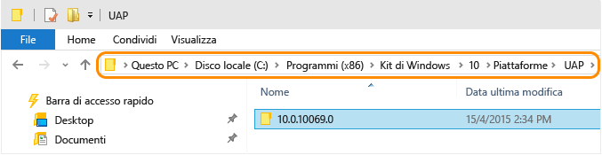
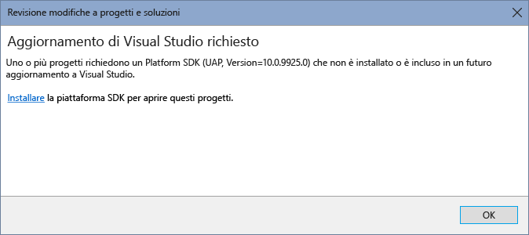

# Migrare le app alla piattaforma UWP (Universal Windows Platform)
Apportare le modifiche manuali necessarie ai file di progetto esistenti per le app di Windows Store 8.1, di Windows Phone 8.1 o di Windows universale create con Visual Studio 2015 RC, in modo da consentirne l'uso con Visual Studio 2015 RTM. Se è presente un'app universale di Windows 8.1 con un progetto di app di Windows e un progetto di Windows Phone, è necessario seguire la procedura per la migrazione dei singoli progetti.  
  
 La piattaforma UWP \(Universal Windows Platform\) consente ora di scegliere come destinazione dell'app una o più famiglie di dispositivi. Per altre informazioni sulle app di Windows universale, vedere questa [Guida della piattaforma](https://msdn.microsoft.com/library/windows/apps/dn894631.aspx).  
  
-   [Migrare le app esistenti di Windows Store 8.1 o Windows Phone 8.1 C\#\/VB](#MigrateCSharp) per usare la piattaforma UWP.  
  
-   [Migrare le app esistenti di Windows Store 8.1 o Windows Phone 8.1 C\+\+](#MigrateCPlusPlus) per usare la piattaforma UWP.  
  
-   [Modifiche richieste per le app di Windows universale esistenti create con Visual Studio 2015 RC](#PreviousVersions).  
  
-   [Modifiche richieste per i progetti di unit test esistenti per le app di Windows universale create con Visual Studio 2015 RC](#MigrateUnitTest).  
  
 Se non si vogliono apportare tutte queste modifiche, vedere le informazioni su come [convertire le app esistenti](http://msdn.microsoft.com/library/windows/apps/xaml/mt238321.aspx) in un nuovo progetto di Windows universale.  
  
##  <a name="MigrateCSharp"></a> Migrare le app esistenti di Windows Store 8.1 o Windows Phone 8.1 C\#\/VB per usare la piattaforma UWP  
  
#### Migrare i file di progetto C\#\/VB  
  
1.  Per trovare il tipo di piattaforma UWP \(Universal Windows Platform\) installato, aprire la cartella **\\Program Files \(x86\)\\Windows Kits\\10\\Platforms\\UAP**, che contiene un elenco di cartelle per ogni piattaforma UWP installata. Il nome della cartella è la versione della piattaforma UWP installata. Ad esempio, in questo dispositivo Windows 10 è installata la versione 10.0.10240.0 della piattaforma UWP \(Universal Windows Platform\).  
  
       
  
     È possibile installare più versioni della piattaforma UWP. Si consiglia di usare la versione più recente disponibile per l'app.  
  
2.  In Esplora File passare alla cartella in cui è archiviato il progetto UWP. In questa cartella creare un file con estensione json. Assegnare al file il nome project.json e quindi aggiungere il contenuto seguente al file:  
  
    ```json  
    { "dependencies": { "Microsoft.ApplicationInsights": "1.0.0", "Microsoft.ApplicationInsights.PersistenceChannel": "1.0.0", "Microsoft.ApplicationInsights.WindowsApps": "1.0.0", "Microsoft.NETCore.UniversalWindowsPlatform": "5.0.0" }, "frameworks": { "uap10.0": {} }, "runtimes": { "win10-arm": {}, "win10-arm-aot": {}, "win10-x86": {}, "win10-x86-aot": {}, "win10-x64": {}, "win10-x64-aot": {} } }  
  
    ```  
  
3.  Creare un file denominato default.rd.xml con i contenuti seguenti. Se si ha un progetto VB, aggiungere questo file alla directory Progetto del progetto. Se si ha un progetto C\#, aggiungere questo file alla directory Proprietà del progetto.  
  
    ```xml  
    <?xml version="1.0"?> <!-- This file contains Runtime Directives used by .NET Native. The defaults here are suitable for most developers. However, you can modify these parameters to modify the behavior of the .NET Native optimizer. Runtime Directives are documented at http://go.microsoft.com/fwlink/?LinkID=391919 To fully enable reflection for App1.MyClass and all of its public/private members <Type Name="App1.MyClass" Dynamic="Required All"/> To enable dynamic creation of the specific instantiation of AppClass<T> over System.Int32 <TypeInstantiation Name="App1.AppClass" Arguments="System.Int32" Activate="Required Public" /> Using the Namespace directive to apply reflection policy to all the types in a particular namespace <Namespace Name="DataClasses.ViewModels" Seralize="All" /> --> <Directives xmlns="http://schemas.microsoft.com/netfx/2013/01/metadata"><Application> <!-- An Assembly element with Name="*Application*" applies to all assemblies in the application package. The asterisks are not wildcards. --> <Assembly Dynamic="Required All" Name="*Application*"/> <!-- Add your application specific runtime directives here. --> </Application></Directives>  
    ```  
  
4.  Aprire la soluzione che contiene le app esistenti di Windows Store 8.1 o Windows Phone 8.1 in Visual Studio.  
  
5.  Fare clic con il pulsante destro del mouse sul progetto esistente per l'app in Esplora soluzioni e quindi scegliere **Scarica progetto**. Dopo aver scaricato il progetto, fare di nuovo clic con il pulsante destro del mouse sul file di progetto e scegliere di modificare il file con estensione csproj o vbproj.  
  
       
  
6.  Trovare l'elemento \<PropertyGroup\> che contiene l'elemento \<TargetPlatformVersion\> con un valore 8.1. Seguire questa procedura per l'elemento \<PropertyGroup\>:  
  
    1.  Impostare il valore dell'elemento \<Platform\> su: **x86**.  
  
    2.  Aggiungere un elemento \<TargetPlatformIdentifier\> e impostarne il valore su: **UAP**.  
  
    3.  Modificare il valore esistente dell'elemento \<TargetPlatformVersion\> sul valore della versione della piattaforma UWP installata. Aggiungere anche un elemento \<TargetPlatformMinVersion\> e assegnargli lo stesso valore.  
  
    4.  Modificare il valore dell'elemento \<MinimumVisualStudioVersion\> impostandolo su: **14**.  
  
    5.  Sostituire l'elemento \<ProjectTypeGuids\> come visualizzato di seguito:  
  
         Per C\#:  
  
        ```xml  
        <ProjectTypeGuids>{A5A43C5B-DE2A-4C0C-9213-0A381AF9435A};{FAE04EC0-301F-11D3-BF4B-00C04F79EFBC}</ProjectTypeGuids>  
        ```  
  
         Per VB:  
  
        ```xml  
        <ProjectTypeGuids>{A5A43C5B-DE2A-4C0C-9213-0A381AF9435A};{F184B08F-C81C-45F6-A57F-5ABD9991F28F}</ProjectTypeGuids>  
        ```  
  
    6.  Aggiungere un elemento \<EnableDotNetNativeCompatibleProfile\> e impostarne il valore su: **true**.  
  
    7.  La dimensione predefinita per le risorse nelle app di Windows universale è 200. Se il progetto include risorse con dimensione diversa da 200, è necessario aggiungere un elemento \<UapDefaultAssetScale\> con il valore della dimensione delle risorse a questo elemento PropertyGroup. Altre informazioni su [asset e scale](http://msdn.microsoft.com/library/jj679352.aspx).  
  
         Ora l'elemento \<PropertyGroup\> dovrebbe essere simile a quello nell'esempio:  
  
        ```xml  
        <PropertyGroup> … <Platform Condition=" '$(Platform)' == '' ">x86</Platform> <TargetPlatformVersion>10.0.10240.0</TargetPlatformVersion> <TargetPlatformMinVersion>10.0.10240.0</TargetPlatformMinVersion> <TargetPlatformIdentifier>UAP</TargetPlatformIdentifier> <MinimumVisualStudioVersion>14</MinimumVisualStudioVersion> <ProjectTypeGuids>{A5A43C5B-DE2A-4C0C-9213-0A381AF9435A};{FAE04EC0-301F-11D3-BF4B-00C04F79EFBC}</ProjectTypeGuids> <EnableDotNetNativeCompatibleProfile>true</EnableDotNetNativeCompatibleProfile> <UapDefaultAssetScale>100</UapDefaultAssetScale> … </PropertyGroup>  
        ```  
  
7.  Sostituire le istanze di 12.0 con 14.0 per riflettere la versione di Visual Studio in uso. Ad esempio, le istanze seguenti:  
  
    ```xml  
    <Project Tools Version="14.0" DefaultTargets="Build" xmlns="http://schemas.microsoft.com/developer/msbuild/2003">  
    ```  
  
    ```  
    <PropertyGroup Condition=" '$(VisualStudioVersion)' == '' or '$(VisualStudioVersion)' < '14.0' "> <VisualStudioVersion>14.0</VisualStudioVersion>  
    ```  
  
8.  Trovare gli elementi \<PropertyGroup\> configurati per la piattaforma AnyCPU all'interno dell'attributo Condition. Rimuovere questi elementi e i relativi elementi figlio. L'elemento AnyCPU non è supportato per le app di Windows 10 in Visual Studio 2015. Ad esempio, è necessario rimuovere gli elementi \<PropertyGroup\> analoghi a quelli riportati di seguito:  
  
    ```xml  
    <PropertyGroup Condition=" '$(Configuration)|$(Platform)' == 'Debug|AnyCPU' "> <PlatformTarget>AnyCPU</PlatformTarget> <DebugSymbols>true</DebugSymbols> <DebugType>full</DebugType> <Optimize>false</Optimize> <OutputPath>bin\Debug\</OutputPath> <DefineConstants>DEBUG;TRACE;NETFX_CORE;WINDOWS_UAP</DefineConstants> <ErrorReport>prompt</ErrorReport> <WarningLevel>4</WarningLevel> </PropertyGroup> <PropertyGroup Condition=" '$(Configuration)|$(Platform)' == 'Release|AnyCPU' "> <PlatformTarget>AnyCPU</PlatformTarget> <DebugType>pdbonly</DebugType> <Optimize>true</Optimize> <OutputPath>bin\Release\</OutputPath> <DefineConstants>TRACE;NETFX_CORE;WINDOWS_UAP</DefineConstants> <ErrorReport>prompt</ErrorReport> <WarningLevel>4</WarningLevel> </PropertyGroup>  
    ```  
  
9. Per ogni elemento \<PropertyGroup\> rimanente, controllare se l'elemento abbia un attributo Condition con una configurazione Rilascio. Se esiste, ma non contiene un elemento \<UseDotNetNativeToolchain\>, aggiungerne uno. Impostare il valore per l'elemento \<UseDotNetNativeToolchain\> su true, ad esempio:  
  
    ```xml  
    <PropertyGroup Condition="'$(Configuration)|$(Platform)' == 'Release|x64'"> <OutputPath>bin\x64\Release\</OutputPath> <DefineConstants>TRACE;NETFX_CORE;WINDOWS_UAP</DefineConstants> <Optimize>true</Optimize> <NoWarn>;2008</NoWarn> <DebugType>pdbonly</DebugType> <PlatformTarget>x64</PlatformTarget> <UseVSHostingProcess>false</UseVSHostingProcess> <ErrorReport>prompt</ErrorReport> <Prefer32Bit>true</Prefer32Bit> <UseDotNetNativeToolchain>true</UseDotNetNativeToolchain> </PropertyGroup>  
    ```  
  
10. Solo per i progetti di Windows Phone, rimuovere l'elemento \<PropertyGroup\> che contiene un elemento \<TargetPlatformIdentifier\> con un valore WindowsPhoneApp. Rimuovere anche gli elementi figlio di questo elemento:  
  
    ```xml  
    <PropertyGroup Condition=" '$(TargetPlatformIdentifier)' == '' "> <TargetPlatformIdentifier>WindowsPhoneApp</TargetPlatformIdentifier> </PropertyGroup>  
    ```  
  
11. Trovare l'elemento \<ItemGroup\> che contiene l'elemento \<AppxManifest\>. Aggiungere l'elemento \<None\> seguente come elemento figlio dell'elemento \<ItemGroup\>:  
  
    ```xml  
    <None Include="project.json" />  
    ```  
  
12. Trovare l'elemento \<ItemGroup\> che contiene altre risorse aggiunte al progetto, ad esempio i file con estensione png del logo \(\<Content Include\="Assets\\Logo.scale\-100.png" \/\>\). Aggiungere l'elemento figlio \<Content\> seguente a questo elemento \<ItemGroup\>:  
  
     **Per C\#:**  
  
    ```xml  
    <Content Include="Properties\default.rd.xml" />  
    ```  
  
     **Per VB:**  
  
    ```xml  
    <Content Include="My Project\default.rd.xml" />  
    ```  
  
13. Trovare l'elemento \<ItemGroup\> che include elementi figlio \<Reference\> che fanno riferimento ai pacchetti NuGet. Prendere nota dei pacchetti NuGet usati, perché sarà necessario scaricarli con Gestione pacchetti NuGet dopo che il progetto è stato ricaricato. Rimuovere l'elemento \<ItemGroup\> con i relativi elementi figlio. Ad esempio, un progetto UWP può includere i pacchetti NuGet seguenti che devono essere rimossi:  
  
    ```xml  
    <ItemGroup> <Reference Include="Microsoft.ApplicationInsights, Version=0.14.3.177, Culture=neutral, PublicKeyToken=31bf3856ad364e35, processorArchitecture=MSIL"> <HintPath>..\packages\Microsoft.ApplicationInsights.0.14.3-build00177\lib\portable-win81+wpa81\Microsoft.ApplicationInsights.dll</HintPath> <Private>True</Private> </Reference> <Reference Include="Microsoft.ApplicationInsights.Extensibility.Windows, Version=0.14.3.177, Culture=neutral, PublicKeyToken=31bf3856ad364e35, processorArchitecture=MSIL"> <HintPath>..\packages\Microsoft.ApplicationInsights.WindowsApps.0.14.3-build00177\lib\win81\Microsoft.ApplicationInsights.Extensibility.Windows.dll</HintPath> <Private>True</Private> </Reference> <Reference Include="Microsoft.ApplicationInsights.PersistenceChannel, Version=0.14.3.186, Culture=neutral, PublicKeyToken=31bf3856ad364e35, processorArchitecture=MSIL"> <HintPath>..\packages\Microsoft.ApplicationInsights.PersistenceChannel.0.14.3-build00177\lib\portable-win81+wpa81\Microsoft.ApplicationInsights.PersistenceChannel.dll</HintPath> <Private>True</Private> </Reference> <Reference Include="System.Numerics.Vectors, Version=4.0.0.0, Culture=neutral, PublicKeyToken=b03f5f7f11d50a3a, processorArchitecture=MSIL"> <HintPath>..\packages\System.Numerics.Vectors.4.0.0\lib\win8\System.Numerics.Vectors.dll</HintPath> <Private>True</Private> </Reference> <Reference Include="System.Numerics.Vectors.WindowsRuntime, Version=4.0.0.0, Culture=neutral, PublicKeyToken=b03f5f7f11d50a3a, processorArchitecture=MSIL"> <HintPath>..\packages\System.Numerics.Vectors.4.0.0\lib\win8\System.Numerics.Vectors.WindowsRuntime.dll</HintPath> <Private>True</Private> </Reference> </ItemGroup>  
    ```  
  
14. Salvare le modifiche.  
  
15. Chiudere il file con estensione csproj o vbproj.  
  
16. Fare clic con il pulsante destro del mouse sul progetto in Esplora soluzioni e scegliere Ricarica progetto dal menu di scelta rapida. A questo punto, tutti i file nel progetto dovrebbero essere visualizzati in Esplora soluzioni.  
  
17. Usare Gestione NuGet per aggiungere di nuovo i pacchetti eliminati in un passaggio precedente.  
  
     Seguire quindi la procedura per [aggiornare i file manifesto del pacchetto](#PackageManifest) per tutti i progetti Windows Store 8.1 o Windows Phone 8.1.  
  
##  <a name="MigrateCPlusPlus"></a> Migrare le app esistenti di Windows Store 8.1 o Windows Phone 8.1 C\+\+ per usare la piattaforma UWP  
  
#### Migrare i file di progetto C\+\+  
  
1.  Per trovare il tipo di piattaforma UWP \(Universal Windows Platform\) installato, aprire la cartella **\\Program Files \(x86\)\\Windows Kits\\10\\Platforms\\UAP**, che contiene un elenco di cartelle per ogni piattaforma UWP installata. Il nome della cartella è la versione della piattaforma UWP installata. Ad esempio, in questo dispositivo Windows 10 è installata la versione 10.0.10240.0 della piattaforma UWP \(Universal Windows Platform\).  
  
       
  
     È possibile installare più versioni della piattaforma UWP. Si consiglia di usare la versione più recente disponibile per l'app.  
  
2.  Aprire la soluzione che contiene le app esistenti di Windows Store 8.1 o Windows Phone 8.1 C\+\+ in Visual Studio.  
  
     Fare clic con il pulsante destro del mouse sul progetto esistente in Esplora soluzioni, quindi selezionare **Scarica progetto**. Dopo aver scaricato il progetto, fare di nuovo clic con il pulsante destro del mouse sul file di progetto e scegliere di modificare il file con estensione vcxproj.  
  
       
  
3.  Trovare l'elemento \<PropertyGroup\> che contiene l'elemento \<ApplicationTypeRevision\> con un valore 8.1. Seguire questa procedura per l'elemento \<PropertyGroup\>:  
  
    1.  Aggiungere un elemento \<WindowsTargetPlatformVersion\> e un elemento \<WindowsTargetPlatformMinVersion\> e assegnare loro il valore della piattaforma UWP \(Universal Windows Platform\) installata.  
  
    2.  Aggiornare il valore dell'elemento ApplicationTypeRevision da 8.1 a 10.0.  
  
    3.  Modificare il valore dell'elemento \<MinimumVisualStudioVersion\> impostandolo su 14.  
  
    4.  Aggiungere un elemento \<EnableDotNetNativeCompatibleProfile\> e impostarne il valore su true.  
  
    5.  La dimensione predefinita per le risorse nelle app di Windows universale è 200. Se il progetto include risorse con dimensione diversa da 200, è necessario aggiungere un elemento \<UapDefaultAssetScale\> con il valore della dimensione delle risorse a questo elemento PropertyGroup. Altre informazioni su [asset e scale](http://msdn.microsoft.com/library/jj679352.aspx).  
  
    6.  Esclusivamente per i progetti Windows Phone, modificare il valore di \<ApplicationType\> da Windows Phone a Windows Store.  
  
         Ora l'elemento \<PropertyGroup\> dovrebbe essere simile a quello nell'esempio:  
  
        ```xml  
        <PropertyGroup> … <WindowsTargetPlatformVersion>10.0.10240.0</WindowsTargetPlatformVersion> <WindowsTargetPlatformMinVersion>10.0.10240.0</WindowsTargetPlatformMinVersion> <ApplicationType>Windows Store</ApplicationType> <ApplicationTypeRevision>10.0</ApplicationTypeRevision> <MinimumVisualStudioVersion>14</MinimumVisualStudioVersion> <EnableDotNetNativeCompatibleProfile>true</EnableDotNetNativeCompatibleProfile> <UapDefaultAssetScale>100</UapDefaultAssetScale> … </PropertyGroup>  
        ```  
  
4.  Modificare tutte le istanze dell'elemento \<PlatformToolset\> in modo che abbiano il valore v140. Ad esempio:  
  
    ```xml  
    <PropertyGroup Condition="'$(Configuration)|$(Platform)'=='Release|Win32'" Label="Configuration"> <ConfigurationType>Application</ConfigurationType> <UseDebugLibraries>false</UseDebugLibraries> <WholeProgramOptimization>true</WholeProgramOptimization> <PlatformToolset>v140</PlatformToolset> <UseDotNetNativeToolchain>true</UseDotNetNativeToolchain> </PropertyGroup>  
    ```  
  
5.  Per ogni elemento \<PropertyGroup\> rimanente, controllare se l'elemento abbia un attributo Condition con una configurazione Rilascio. Se esiste, ma non contiene un elemento \<UseDotNetNativeToolchain\>, aggiungerne uno. Impostare il valore per l'elemento \<UseDotNetNativeToolchain\> su true, ad esempio:  
  
    ```xml  
    <PropertyGroup Condition="'$(Configuration)|$(Platform)'=='Release|X64'" Label="Configuration"> <ConfigurationType>Application</ConfigurationType> <UseDebugLibraries>false</UseDebugLibraries> <WholeProgramOptimization>true</WholeProgramOptimization> <PlatformToolset>v140</PlatformToolset> <UseDotNetNativeToolchain>true</UseDotNetNativeToolchain> </PropertyGroup>  
  
    ```  
  
6.  Salvare le modifiche. Quindi, chiudere il file di progetto.  
  
7.  Fare clic con il pulsante destro del mouse sul file di progetto in Esplora soluzioni e scegliere Ricarica progetto dal menu di scelta rapida. A questo punto, tutti i file nel progetto dovrebbero essere visualizzati in Esplora soluzioni.  
  
     Seguire quindi la procedura per [aggiornare i file manifesto del pacchetto](#PackageManifest) per tutti i progetti Windows Store 8.1 o Windows Phone 8.1.  
  
##  <a name="PackageManifest"></a> Aggiornare il file manifesto del pacchetto per tutti i progetti Windows Store 8.1 o Windows Phone 8.1  
 È necessario aggiornare il file manifesto del pacchetto per ogni progetto nella soluzione.  
  
#### Aggiornare il file manifesto del pacchetto  
  
1.  Aprire il file Package.appxmanifest nel progetto. È necessario modificare il file Package.AppxManifest per tutti i progetti Windows Store e Windows Phone.  
  
2.  È necessario aggiornare l'elemento \<Package\> con i nuovi schemi in base al tipo di progetto esistente. Rimuovere prima gli schemi seguenti in base al tipo di progetto in uso, Windows Store o Windows Phone.  
  
     **PRECEDENTE per il progetto Windows Store:** l'elemento \<Package\> sarà simile al seguente.  
  
    ```xml  
    <Package xmlns="http://schemas.microsoft.com/appx/2010/manifest" xmlns:m2="http://schemas.microsoft.com/appx/2013/manifest">  
  
    ```  
  
     **PRECEDENTE per il progetto Windows Phone:** l'elemento \<Package\> sarà simile al seguente.  
  
    ```xml  
    <Package xmlns="http://schemas.microsoft.com/appx/2010/manifest" xmlns:m2="http://schemas.microsoft.com/appx/2013/manifest" xmlns:m3="http://schemas.microsoft.com/appx/2014/manifest" xmlns:mp="http://schemas.microsoft.com/appx/2014/phone/manifest">  
    ```  
  
     **NUOVO per la piattaforma UWP:** aggiungere gli schemi sotto l'elemento \<Package\>. Rimuovere i prefissi dell'identificatore dello spazio dei nomi associato dagli elementi per gli schemi appena rimossi. Aggiornare la proprietà IgnorableNamespaces su: uap mp. Il nuovo elemento \<Package\> dovrebbe essere simile al seguente.  
  
    ```xml  
    <Package xmlns="http://schemas.microsoft.com/appx/manifest/foundation/windows10" xmlns:uap="http://schemas.microsoft.com/appx/manifest/uap/windows10" xmlns:mp="http://schemas.microsoft.com/appx/2014/phone/manifest" IgnorableNamespaces= "uap mp">  
  
    ```  
  
3.  Aggiungere un elemento figlio \<Dependencies\> all'elemento \<Package\>. Quindi, aggiungere un elemento figlio \<TargetDeviceFamily\> a questo elemento \<Dependencies\> con gli attributi Name, MinVersion e MaxVersionTested. Assegnare all'attributo Name il valore: Windows.Universal. Assegnare a MinVersion e MaxVersionTested il valore della versione della piattaforma UWP installata. Questo elemento dovrebbe essere simile al seguente:  
  
    ```xml  
    <Dependencies> <TargetDeviceFamily Name="Windows.Universal" MinVersion="10.0.10069.0" MaxVersionTested="10.0.10069.0" /> </Dependencies>  
    ```  
  
4.  **Solo per Windows Store:** è necessario aggiungere un elemento figlio \<mp:PhoneIdentity\> all'elemento \<Package\>. Aggiungere un attributo PhoneProductId e un attributo PhonePublisherId. Impostare PhoneProductId in modo che abbia lo stesso valore dell'attributo Name nell'elemento \<Identity\>. Impostare il valore PhonePublishedId su: 00000000\-0000\-0000\-0000\-000000000000, analogamente a quanto segue:  
  
    ```xml  
    <Identity Name="aa3815a1-2d97-4c71-8c99-578135b28cd8" Publisher="CN=xxxxxxxx" Version="1.0.0.0" /> <mp:PhoneIdentity PhoneProductId="aa3815a1-2d97-4c71-8c99-578135b28cd8" PhonePublisherId="00000000-0000-0000-0000-000000000000"/>  
    ```  
  
5.  Trovare l'elemento \<Prerequisites\> ed eliminarlo insieme agli eventuali elementi figlio.  
  
6.  Aggiungere lo spazio dei nomi **uap** ai seguenti elementi \<Resource\>: Scale, DXFeatureLevel. Ad esempio:  
  
    ```xml  
    <Resources> <Resource Language="en-us"/> <Resource uap:Scale="180"/> <Resource uap:DXFeatureLevel="dx11"/> </Resources>  
  
    ```  
  
7.  Aggiungere lo spazio dei nomi **uap** ai seguenti elementi \<Capability\>: documentsLibrary, picturesLibrary, videosLibrary, musicLibrary, enterpriseAuthentication, sharedUserCertificates, removableStorage, appointments e contacts. Ad esempio:  
  
    ```xml  
    <Capabilities> <uap:Capability Name="documentsLibrary"/> <uap:Capability Name="removableStorage"/> </Capabilities>  
  
    ```  
  
8.  Aggiungere lo spazio dei nomi **uap** all'elemento \<VisualElements\> e agli eventuali elementi figlio. Ad esempio:  
  
    ```xml  
    <uap:VisualElements DisplayName="My WWA App" Square150x150Logo="images/150x150.png" Square44x44Logo="images/44x44.png" Description="My WWA App" BackgroundColor="#777777"> <uap:SplashScreen Image="images/splash.png"/> </uap:VisualElements>  
  
    ```  
  
     **Solo per Windows Store:** i nomi delle dimensioni riquadro sono stati modificati. Modificare gli attributi nell'elemento \<VisualElements\> per riflettere le nuove dimensioni riquadro con convergenza. 70x70 diventa 71x71 e 30x30 diventa 44x44.  
  
     **PRECEDENTE:** nomi delle dimensioni riquadro  
  
    ```xml  
    <m2:VisualElements … Square30x30Logo="Assets\SmallLogo.png" …> <m2:DefaultTile … Square70x70Logo="images/70x70.png"> </m2:VisualElements>  
  
    ```  
  
     **NUOVO:** nomi delle dimensioni riquadro  
  
    ```xml  
    <uap:VisualElements … Square44x44Logo="Assets\SmallLogo.png" …> <uap:DefaultTile … Square71x71Logo="images/70x70.png"> </uap:VisualElements>  
  
    ```  
  
9. Aggiungere lo spazio dei nomi **uap** ad \<ApplicationContentUriRules\> e a tutti gli elementi figlio. Ad esempio:  
  
    ```xml  
    <uap:ApplicationContentUriRules> <uap:Rule Type="include" Match="https://www.microsoft.com/"/> <uap:Rule Type="exclude" Match="*.pdf"/> </uap:ApplicationContentUriRules>  
  
    ```  
  
10. Aggiungere lo spazio dei nomi **uap** ai seguenti elementi \<Extension\> e a tutti gli elementi figlio: windows.accountPictureProvide, windows.alarm, windows.appointmentsProvider windows.autoPlayContent, windows.autoPlayDevice, windows.cachedFileUpdate, windows.cameraSettings, windows.fileOpenPicker, windows.fileTypeAssociation, windows.fileSavePicke, windows.lockScreenCall, windows.printTaskSettings, windows.protocol, windows.search, windows.shareTarget. Ad esempio:  
  
    ```xml  
    <Extensions> <uap:Extension Category="windows.alarm"/> <uap:Extension Category="windows.search" EntryPoint="MyActivateableClassId.baz"/> <uap:Extension Category="windows.protocol"> <uap:Protocol Name="mailto" DesiredView="useHalf"> <uap:DisplayName>MailTo Protocol</uap:DisplayName> </uap:Protocol> </uap:Extension> </Extensions>  
  
    ```  
  
11. Aggiungere lo spazio dei nomi **uap** alle attività in background di tipo chatMessageNotification. Ad esempio:  
  
    ```xml  
    <Extension Category="windows.backgroundTasks" EntryPoint="Fabrikam.BackgroundTask" Executable="MyBackground.exe"> <BackgroundTasks ServerName="MyBackgroundTasks"> <uap:Task Type="chatMessageNotification"/> </BackgroundTasks> </Extension>  
  
    ```  
  
12. Modificare le dipendenze framework. Aggiungere un nome dell'editore a tutti gli elementi \<PackageDependency\> e specificare MinVersion se non è già specificato.  
  
     **PRECEDENTE:** elemento \<PackageDependency\>  
  
    ```xml  
    <Dependencies> <PackageDependency Name="Microsoft.VCLibs.120.00" /> </Dependencies>  
  
    ```  
  
     **NUOVO:** elemento \<PackageDependency\>  
  
    ```xml  
    <Dependencies> <PackageDependency Name="Microsoft.VCLibs.120.00" Publisher="CN=Microsoft Corporation, O=Microsoft Corporation, L=Redmond, S=Washington, C=US" MinVersion="12.0.30113.0" /> </Dependencies>  
  
    ```  
  
     Usare i valori Publisher e MinVersion appropriati per il framework che si sta effettivamente usando. Tenere presente che questi nomi possono essere diversi per Windows 10.  
  
13. Sostituire le attività di tipo background gattCharacteristicNotification e rfcommConnection con un'attività di tipo Bluetooth. Ad esempio:  
  
     **PRECEDENTE:**  
  
    ```xml  
    <Extension Category="windows.backgroundTasks" EntryPoint="Fabrikam.BackgroundTask" Executable="MyBackground.exe"> <BackgroundTasks ServerName="MyBackgroundTasks"> <Task Type="rfcommConnection"/> <Task Type="gattCharacteristicNotification"/> </BackgroundTasks> </Extension>  
    ```  
  
     **NUOVO:** sostituito con l'attività di tipo Bluetooth.  
  
    ```xml  
    <Extension Category="windows.backgroundTasks" EntryPoint="Fabrikam.BackgroundTask" Executable="MyBackground.exe"> <BackgroundTasks ServerName="MyBackgroundTasks"> <Task Type="bluetooth"/> </BackgroundTasks> </Extension>  
    ```  
  
14. Sostituire le capacità del dispositivo Bluetooth bluetooth.rfcomm e bluetooth.genericAttributeProfile con una capacità Bluetooth generica. Ad esempio:  
  
     **PRECEDENTE:**  
  
    ```xml  
    <Capabilities> <m2:DeviceCapability Name="bluetooth.rfcomm"> <m2:Device Id="any"> <m2:Function Type="serviceId:34B1CF4D-1069-4AD6-89B6-E161D79BE4D8"/> </m2:Device> </m2:DeviceCapability> <m2:DeviceCapability Name="bluetooth.genericAttributeProfile"> <m2:Device Id="any"> <m2:Function Type="name:heartRate"/> </m2:Device> </m2:DeviceCapability> </Capabilities>  
    ```  
  
     **NUOVO:** sostituito con una capacità Bluetooth generica.  
  
    ```xml  
    <Capabilities> <uap:DeviceCapability Name="bluetooth"/> </Capabilities>  
  
    ```  
  
15. Rimuovere tutti gli elementi deprecati.  
  
    1.  Questi attributi per \<VisualElements\> sono deprecati e devono essere rimossi:  
  
        -   Gli attributi \<VisualElements\>: ForegroundText, ToastCapable  
  
        -   L'attributo DefaultSize di \<DefaultTile\>  
  
        -   L'elemento \<ApplicationView\>  
  
         Ad esempio:  
  
        ```xml  
        <m2:VisualElements … ForegroundText="dark" ToastCapable="true"> <m2:DefaultTile DefaultSize="square150x150Logo"/> <m2:ApplicationView MinWidth="width320"/> </m2:VisualElements>  
  
        ```  
  
    2.  Rimuovere le estensioni Windows.contact e windows.contactPicker e tutti gli elementi contenuti.  
  
16. Salvare il file Package.appxmanifest. Quindi, chiudere Visual Studio.  
  
17. È necessario rimuovere alcuni file nascosti prima di riaprire la soluzione.  
  
    1.  Aprire Esplora file, fare clic su **Visualizza** nella barra degli strumenti e selezionare **Elementi nascosti** ed **Estensioni di file**. Aprire questa cartella nel computer: \<percorso per la posizione della soluzione\>\\.vs\\{Project Name}\\v14. Se esiste un file con estensione suo, eliminarlo.  
  
    2.  Tornare alla cartella in cui si trova la soluzione. Aprire le cartelle per i progetti presenti nella soluzione. Se nelle cartelle del progetto esiste un file con estensione csproj.user o vbproj.user, eliminarlo.  
  
         Ora è possibile riaprire la soluzione in Visual Studio. A questo punto è possibile codificare, compilare ed eseguire il debug dell'app con la piattaforma UWP.  
  
         Informazioni su come [adattare il codice](https://msdn.microsoft.com/library/windows/apps/dn954974.aspx) per sfruttare le nuove caratteristiche della piattaforma UWP.  
  
##  <a name="PreviousVersions"></a> Modifiche richieste per le app di Windows universale esistenti create con Visual Studio 2015 RC  
 Se sono state create app universali di Windows 10 con Visual Studio 2015 RC, è necessario modificare la destinazione del progetto in modo da usare la versione della piattaforma UWP \(Universal Windows Platform\) installata con la versione più recente di Visual Studio 2015. Le versioni precedenti non sono supportate. Le modifiche richieste dipendono dal linguaggio usato per creare l'app:  
  
-   [App C\#\/VB](#RCUpdate10CSharp)  
  
-   [App C\+\+](#RCUpdate10CPlusPlus)  
  
###  <a name="RCUpdate10CSharp"></a> Aggiornare i progetti C\#\/VB in modo che usino la piattaforma UWP più recente  
 Quando si apre la soluzione per l'app esistente, viene indicato che è necessario un aggiornamento per l'app:  
  
   
  
 Se si sceglie di ricaricare il progetto da Esplora soluzioni, verrà visualizzata la finestra di dialogo seguente:  
  
   
  
 Poiché l'SDK della piattaforma UWP per il progetto non è supportato, non sarà possibile installarlo. Fare clic su OK e seguire la procedura descritta di seguito.  
  
##### Aggiornare i progetti C\#\/VB in modo che usino la piattaforma UWP più recente  
  
1.  Per trovare il tipo di piattaforma UWP \(Universal Windows Platform\) installato, aprire la cartella **\\Program Files \(x86\)\\Windows Kits\\10\\Platforms\\UAP**, che contiene un elenco di cartelle per ogni piattaforma UWP installata. Il nome della cartella è la versione della piattaforma UWP installata. Ad esempio, in questo dispositivo Windows 10 è installata la versione 10.0.10240.0 della piattaforma UWP \(Universal Windows Platform\).  
  
       
  
     È possibile installare più versioni della piattaforma UWP. Si consiglia di usare la versione più recente disponibile per l'app.  
  
2.  In Esplora File passare alla cartella in cui è archiviato il progetto UWP. Eliminare il file packages.config e creare un nuovo file con estensione json in questa cartella. Assegnare al file il nome project.json e quindi aggiungere il contenuto seguente al file:  
  
    ```json  
  
    { "dependencies": { "Microsoft.ApplicationInsights": "1.0.0", "Microsoft.ApplicationInsights.PersistenceChannel": "1.0.0", "Microsoft.ApplicationInsights.WindowsApps": "1.0.0", "Microsoft.NETCore.UniversalWindowsPlatform": "5.0.0" }, "frameworks": { "uap10.0": {} }, "runtimes": { "win10-arm": {}, "win10-arm-aot": {}, "win10-x86": {}, "win10-x86-aot": {}, "win10-x64": {}, "win10-x64-aot": {} } }  
  
    ```  
  
3.  Con Visual Studio aprire la soluzione contenente l'app di Windows universale C\#\/VB. Sarà necessario aggiornare il file di progetto \(con estensione csproj o vbproj\). Fare clic con il pulsante destro del mouse sul file di progetto e scegliere di modificarlo.  
  
       
  
4.  Trovare l'elemento \<PropertyGroup\> che contiene gli elementi \<TargetPlatformVersion\> e \<TargetPlatformMinVersion\>. Modificare il valore esistente degli elementi \<TargetPlatformVersion\> e \<TargetPlatformMinVersion\> in modo che corrisponda alla versione della piattaforma UWP installata.  
  
     La dimensione predefinita per le risorse nelle app di Windows universale è 200. I progetti creati con Visual Studio 2015 RC includono risorse con dimensione 100 ed è necessario aggiungere un elemento \<UapDefaultAssetScale\> con valore 100 all'elemento PropertyGroup. Altre informazioni su [asset e scale](http://msdn.microsoft.com/library/jj679352.aspx).  
  
5.  Se sono stati aggiunti riferimenti a SDK di estensione della piattaforma UWP \(Universal Windows Platform\), ad esempio Windows Mobile SDK, sarà necessario aggiornare la versione dell'SDK. Ad esempio, l'elemento \<SDKReference\> seguente:  
  
    ```xml  
    <SDKReference Include="WindowsMobile, Version=10.0.0.1"> <Name>Microsoft Mobile Extension SDK for Universal App Platform</Name> </SDKReference>  
  
    ```  
  
     Deve essere modificato in:  
  
    ```xml  
    <SDKReference Include="WindowsMobile, Version=10.0.10240.0"> <Name>Microsoft Mobile Extension SDK for Universal App Platform</Name> </SDKReference>  
  
    ```  
  
6.  Trovare l'elemento \<Target\> con un attributo Name il cui valore sia EnsureNuGetPackageBuildImports. Eliminare questo elemento e tutti i relativi elementi figlio.  
  
    ```xml  
    <Target Name="EnsureNuGetPackageBuildImports" BeforeTargets="PrepareForBuild"> <PropertyGroup> <ErrorText>This project references NuGet package(s) that are missing on this computer. Use NuGet Package Restore to download them.  For more information, see http://go.microsoft.com/fwlink/?LinkID=322105. The missing file is {0}.</ErrorText> </PropertyGroup> <Error Condition="!Exists('..\packages\Microsoft.Diagnostics.Tracing.EventSource.Redist.1.1.16-beta\build\portable-net45+win8+wpa81\Microsoft.Diagnostics.Tracing.EventSource.Redist.targets')" Text="$([System.String]::Format('$(ErrorText)', '..\packages\Microsoft.Diagnostics.Tracing.EventSource.Redist.1.1.16-beta\build\portable-net45+win8+wpa81\Microsoft.Diagnostics.Tracing.EventSource.Redist.targets'))" /> <Error Condition="!Exists('..\packages\Microsoft.ApplicationInsights.0.14.3-build00177\build\portable-win81+wpa81\Microsoft.ApplicationInsights.targets')" Text="$([System.String]::Format('$(ErrorText)', '..\packages\Microsoft.ApplicationInsights.0.14.3-build00177\build\portable-win81+wpa81\Microsoft.ApplicationInsights.targets'))" /> </Target>  
    ```  
  
7.  Trovare ed eliminare gli elementi \<Import\> con attributi Project e Condition che fanno riferimento a Microsoft.Diagnostics.Tracing.EventSource e Microsoft.ApplicationInsights, ad esempio:  
  
    ```xml  
    <Import Project="..\packages\Microsoft.Diagnostics.Tracing.EventSource.Redist.1.1.16-beta\build\portable-net45+win8+wpa81\Microsoft.Diagnostics.Tracing.EventSource.Redist.targets" Condition="Exists('..\packages\Microsoft.Diagnostics.Tracing.EventSource.Redist.1.1.16-beta\build\portable-net45+win8+wpa81\Microsoft.Diagnostics.Tracing.EventSource.Redist.targets')" /> <Import Project="..\packages\Microsoft.ApplicationInsights.0.14.3-build00177\build\portable-win81+wpa81\Microsoft.ApplicationInsights.targets" Condition="Exists('..\packages\Microsoft.ApplicationInsights.0.14.3-build00177\build\portable-win81+wpa81\Microsoft.ApplicationInsights.targets')" />  
  
    ```  
  
8.  Trovare l'elemento \<ItemGroup\> che include elementi figlio \<Reference\> che fanno riferimento ai pacchetti NuGet. Prendere nota dei pacchetti NuGet a cui viene fatto riferimento, perché queste informazioni saranno necessarie per un passaggio successivo. Una differenza significativa nel formato di progetto Windows 10 tra Visual Studio 2015 RC e Visual Studio 2015 RTM è rappresentata dal fatto che il formato RTM usa [NuGet](http://docs.nuget.org/) versione 3.  
  
     Rimuovere l'elemento \<ItemGroup\> e tutti i relativi elementi figlio. Ad esempio, un progetto UWP creato con Visual Studio RC includerà i pacchetti NuGet seguenti che devono essere rimossi:  
  
    ```xml  
    <ItemGroup> <Reference Include="Microsoft.ApplicationInsights, Version=0.14.3.177, Culture=neutral, PublicKeyToken=31bf3856ad364e35, processorArchitecture=MSIL"> <HintPath>..\packages\Microsoft.ApplicationInsights.0.14.3-build00177\lib\portable-win81+wpa81\Microsoft.ApplicationInsights.dll</HintPath> <Private>True</Private> </Reference> <Reference Include="Microsoft.ApplicationInsights.Extensibility.Windows, Version=0.14.3.177, Culture=neutral, PublicKeyToken=31bf3856ad364e35, processorArchitecture=MSIL"> <HintPath>..\packages\Microsoft.ApplicationInsights.WindowsApps.0.14.3-build00177\lib\win81\Microsoft.ApplicationInsights.Extensibility.Windows.dll</HintPath> <Private>True</Private> </Reference> <Reference Include="Microsoft.ApplicationInsights.PersistenceChannel, Version=0.14.3.186, Culture=neutral, PublicKeyToken=31bf3856ad364e35, processorArchitecture=MSIL"> <HintPath>..\packages\Microsoft.ApplicationInsights.PersistenceChannel.0.14.3-build00177\lib\portable-win81+wpa81\Microsoft.ApplicationInsights.PersistenceChannel.dll</HintPath> <Private>True</Private> </Reference> <Reference Include="System.Numerics.Vectors, Version=4.0.0.0, Culture=neutral, PublicKeyToken=b03f5f7f11d50a3a, processorArchitecture=MSIL"> <HintPath>..\packages\System.Numerics.Vectors.4.0.0\lib\win8\System.Numerics.Vectors.dll</HintPath> <Private>True</Private> </Reference> <Reference Include="System.Numerics.Vectors.WindowsRuntime, Version=4.0.0.0, Culture=neutral, PublicKeyToken=b03f5f7f11d50a3a, processorArchitecture=MSIL"> <HintPath>..\packages\System.Numerics.Vectors.4.0.0\lib\win8\System.Numerics.Vectors.WindowsRuntime.dll</HintPath> <Private>True</Private> </Reference> </ItemGroup>  
  
    ```  
  
9. Trovare l'elemento \<ItemGroup\> che contiene un elemento \<AppxManifest\>. Se è presente un elemento \<None\> con un attributo Include impostato su packages.config, eliminarlo. Aggiungere inoltre un elemento \<None\> con un attributo Include e impostarne il valore su project.json.  
  
10. Salvare le modifiche. Quindi, chiudere il file di progetto.  
  
11. Fare clic con il pulsante destro del mouse sul file di progetto in Esplora soluzioni e scegliere Ricarica progetto dal menu di scelta rapida. A questo punto, tutti i file nel progetto dovrebbero essere visualizzati in Esplora soluzioni.  
  
12. Selezionare il file ApplicationInsights.config in Esplora soluzioni e aprire le relative proprietà. Impostare la proprietà Azione di compilazione su "Contenuto" e la proprietà Copia in directory di output su "Copia se più recente".  
  
13. Aprire il file Package.appxmanifest nel progetto.  
  
    1.  Trovare l'elemento \<TargetDeviceFamily\>. Modificare gli attributi MinVersion e MaxVersionTested in modo che corrispondano alla versione della piattaforma UWP \(Universal Windows Platform\) installata, analogamente a quanto segue:  
  
        ```xml  
        <TargetDeviceFamily Name="Windows.Universal" MinVersion="10.0.10240.0" MaxVersionTested="10.0.10240.0" />  
        ```  
  
    2.  Salvare le modifiche.  
  
14. Usare Gestione NuGet per aggiungere i pacchetti eliminati nel passaggio precedente. Una differenza significativa nel formato di progetto Windows 10 tra Visual Studio 2015 RC e Visual Studio 2015 RTM è rappresentata dal fatto che il formato RTM usa [NuGet](http://docs.nuget.org/) versione 3.  
  
 Ora è possibile codificare, compilare ed eseguire il debug dell'app.  
  
 Se si hanno progetti di unit test per le app di Windows universale, è necessario seguire anche [questi passaggi](#MigrateUnitTest).  
  
###  <a name="RCUpdate10CPlusPlus"></a> Aggiornare i progetti C\+\+ in modo che usino la piattaforma UWP più recente  
  
1.  Per trovare il tipo di piattaforma UWP \(Universal Windows Platform\) installato, aprire la cartella **\\Program Files \(x86\)\\Windows Kits\\10\\Platforms\\UAP**, che contiene un elenco di cartelle per ogni piattaforma UWP installata. Il nome della cartella è la versione della piattaforma UWP installata. Ad esempio, in questo dispositivo Windows 10 è installata la versione 10.0.10240.0 della piattaforma UWP \(Universal Windows Platform\).  
  
       
  
     È possibile installare più versioni della piattaforma UWP. Si consiglia di usare la versione più recente disponibile per l'app.  
  
2.  Aprire la soluzione che contiene l'app di Windows C\+\+ universale. Fare clic con il pulsante destro del mouse sul file con estensione vcxproj del progetto e scegliere di scaricare il file di progetto. Dopo aver scaricato il progetto, fare di nuovo clic con il pulsante destro del mouse sul file di progetto e scegliere di modificarlo.  
  
       
  
3.  Trovare tutti gli elementi \<PropertyGroup\> che non contengono un attributo Condition ma contengono un elemento \<ApplicationTypeRevision\>. Aggiornare il valore di ApplicationTypeRevision da 8.2 a 10.0. Aggiungere un elemento \<WindowsTargetPlatformVersion\> e un elemento \<WindowsTargetPlatformMinVersion\> e impostare i relativi valori in base al valore della versione della piattaforma UWP \(Universal Windows Platform\) installata.  
  
     Aggiungere un elemento \<EnableDotNetNativeCompatibleProfile\> e impostarne il valore su true, se l'elemento non è già presente.  
  
     La dimensione predefinita per le risorse nelle app di Windows universale è 200. I progetti creati con Visual Studio 2015 RC includono risorse con dimensione 100 ed è necessario aggiungere un elemento \<UapDefaultAssetScale\> con valore 100 all'elemento PropertyGroup. Altre informazioni su [asset e scale](http://msdn.microsoft.com/library/jj679352.aspx).  
  
     L'elemento \<PropertyGroup\> sarà simile al seguente:  
  
    ```xml  
    <PropertyGroup Label="Globals"> … <MinimumVisualStudioVersion>14.0</MinimumVisualStudioVersion> <ApplicationType>Windows Store</ApplicationType> <ApplicationTypeRevision>10.0</ApplicationTypeRevision> <WindowsTargetPlatformVersion>10.0.10240.0</WindowsTargetPlatformVersion> <WindowsTargetPlatformMinVersion>10.0.10240.0</WindowsTargetPlatformMinVersion> <EnableDotNetNativeCompatibleProfile>true</EnableDotNetNativeCompatibleProfile> <UapDefaultAssetScale>100</UapDefaultAssetScale> </PropertyGroup>  
  
    ```  
  
4.  Per ogni elemento \<PropertyGroup\> rimanente, controllare se l'elemento abbia un attributo Condition con una configurazione Rilascio. Se esiste, ma non contiene un elemento \<UseDotNetNativeToolchain\>, aggiungerne uno. Impostare il valore per l'elemento \<UseDotNetNativeToolchain\> su true, ad esempio:  
  
    ```xml  
    <PropertyGroup Condition="'$(Configuration)|$(Platform)'=='Release|Win32'" Label="Configuration"> <ConfigurationType>Application</ConfigurationType> <UseDebugLibraries>false</UseDebugLibraries> <WholeProgramOptimization>true</WholeProgramOptimization> <PlatformToolset>v140</PlatformToolset> <UseDotNetNativeToolchain>true</UseDotNetNativeToolchain> </PropertyGroup>  
  
    ```  
  
5.  È necessario aggiornare l'elemento \<EnableDotNetNativeCompatibleProfile\> e l'elemento \<UseDotNetNativeToolchain\> per abilitare .NET Native, ma .NET Native non è abilitato nei modelli C\+\+.  
  
     Salvare le modifiche. Quindi, chiudere il file di progetto.  
  
6.  Fare clic con il pulsante destro del mouse sul file di progetto in Esplora soluzioni e scegliere Ricarica progetto dal menu di scelta rapida. A questo punto, tutti i file nel progetto dovrebbero essere visualizzati in Esplora soluzioni.  
  
7.  Aprire il file Package.appxmanifest nel progetto.  
  
    1.  Trovare l'elemento \<TargetDeviceFamily\>. Modificare gli attributi MinVersion e MaxVersionTested in modo che corrispondano alla versione della piattaforma UWP \(Universal Windows Platform\) installata, analogamente a quanto segue:  
  
        ```xml  
        <TargetDeviceFamily Name="Windows.Universal" MinVersion="10.0.10240.0" MaxVersionTested="10.0.10240.0" />  
        ```  
  
    2.  Salvare le modifiche.  
  
         Ora è possibile codificare, compilare ed eseguire il debug dell'app.  
  
         Se si hanno progetti di unit test per le app di Windows universale, è necessario seguire anche [questi passaggi](#MigrateUnitTest).  
  
##  <a name="MigrateUnitTest"></a> Modifiche richieste per i progetti di unit test esistenti per le app di Windows universale create con Visual Studio 2015 RC  
 Se sono stati creati progetti di unit test per app universali di Windows 10 con Visual Studio 2015 RC, è necessario apportare queste ulteriori modifiche ai file di progetto, per poter usare questi progetti di test con la versione più recente di Visual Studio 2015. Le modifiche richieste dipendono dal linguaggio usato per creare l'app:  
  
-   [App C\#\/VB](#UnitTestRCUpdate10CSharp)  
  
-   [App C\+\+](#UnitTestRCUpdate10CPlusPlus)  
  
###  <a name="UnitTestRCUpdate10CSharp"></a> Aggiornare i progetti di unit test C\#\/VB  
  
1.  Con Visual Studio aprire la soluzione contenente il progetto di unit test C\#\/VB. Modificare il valore dell'elemento \<OuttputType\> in AppContainerExe.  
  
    ```xml  
  
    <OutputType>AppContainerExe</OutputType>  
  
    ```  
  
2.  Sostituire l'elemento \<EnableCoreRuntime\>false\<\/EnableCoreRuntime\> con l'elemento seguente:  
  
    ```xml  
  
    <EnableDotNetNativeCompatibleProfile>true</EnableDotNetNativeCompatibleProfile>  
  
    ```  
  
3.  Rimuovere le righe seguenti:  
  
    ```xml  
  
    <PropertyGroup> <AppXPackage>True</AppXPackage> <AppxPackageIncludePrivateSymbols>true</AppxPackageIncludePrivateSymbols> </PropertyGroup> <PropertyGroup Condition=" '$(Configuration)|$(Platform)' == 'Debug|AnyCPU' "> <PlatformTarget>AnyCPU</PlatformTarget> <DebugSymbols>true</DebugSymbols> <DebugType>full</DebugType> <Optimize>false</Optimize> <OutputPath>bin\Debug\</OutputPath> <DefineConstants>DEBUG;TRACE;NETFX_CORE;WINDOWS_UAP</DefineConstants> <ErrorReport>prompt</ErrorReport> <WarningLevel>4</WarningLevel> </PropertyGroup> <PropertyGroup Condition=" '$(Configuration)|$(Platform)' == 'Release|AnyCPU' "> <PlatformTarget>AnyCPU</PlatformTarget> <DebugType>pdbonly</DebugType> <Optimize>true</Optimize> <OutputPath>bin\Release\</OutputPath> <DefineConstants>TRACE;NETFX_CORE;WINDOWS_UAP</DefineConstants> <ErrorReport>prompt</ErrorReport> <WarningLevel>4</WarningLevel> </PropertyGroup>  
  
    ```  
  
4.  Aggiungere l'elemento \<UseDotNetNativeToolchain\>true\<\/UseDotNetNativeToolchain\> come elemento figlio dei gruppi di proprietà seguenti:  
  
    ```xml  
  
    <PropertyGroup Condition="'$(Configuration)|$(Platform)' == 'Release|ARM'"> <PropertyGroup Condition="'$(Configuration)|$(Platform)' == 'Release|X86'"> <PropertyGroup Condition="'$(Configuration)|$(Platform)' == 'Release|X64'">  
  
    ```  
  
5.  Eliminare gli elementi \<ItemGroup\> seguenti:  
  
    ```xml  
  
    <ItemGroup> <Compile Include="Properties\AssemblyInfo.cs" /> <Compile Include="UnitTest.cs" /> </ItemGroup> <ItemGroup> <AppxManifest Include="Package.appxmanifest"> <SubType>Designer</SubType> </AppxManifest> <None Include="packages.config" /> <None Include="UnitTestProject1_TemporaryKey.pfx" /> </ItemGroup> <ItemGroup> <Content Include="Properties\Default.rd.xml" /> <Content Include="Assets\Logo.scale-240.png" /> <Content Include="Assets\SmallLogo.scale-240.png" /> <Content Include="Assets\SplashScreen.scale-240.png" /> <Content Include="Assets\Square71x71Logo.scale-240.png" /> <Content Include="Assets\StoreLogo.scale-240.png" /> <Content Include="Assets\WideLogo.scale-240.png" /> </ItemGroup>  
  
    ```  
  
     Sostituirli con questi elementi:  
  
    ```xml  
  
    <ItemGroup> <Compile Include="Properties\AssemblyInfo.cs" /> <Compile Include="UnitTestApp.xaml.cs"> <DependentUpon>UnitTestApp.xaml</DependentUpon> </Compile> <Compile Include="UnitTest.cs" /> </ItemGroup> <ItemGroup> <ApplicationDefinition Include="UnitTestApp.xaml"> <Generator>MSBuild:Compile</Generator> <SubType>Designer</SubType> </ApplicationDefinition> </ItemGroup> <ItemGroup> <AppxManifest Include="Package.appxmanifest"> <SubType>Designer</SubType> </AppxManifest> <None Include="UnitTestProject1_TemporaryKey.pfx" /> </ItemGroup> <ItemGroup> <Content Include="Properties\UnitTestApp.rd.xml" /> <Content Include="Assets\LockScreenLogo.scale-200.png" /> <Content Include="Assets\SplashScreen.scale-200.png" /> <Content Include="Assets\Square150x150Logo.scale-200.png" /> <Content Include="Assets\Square44x44Logo.scale-200.png" /> <Content Include="Assets\Square44x44Logo.targetsize-24_altform-unplated.png" /> <Content Include="Assets\StoreLogo.png" /> <Content Include="Assets\Wide310x150Logo.scale-200.png" /> </ItemGroup>  
    ```  
  
6.  Creare un nuovo progetto di unit test e copiare i file UnitTestApp.xaml e UnitTestApp.xaml.cs dal nuovo progetto al progetto di unit test esistente che si sta aggiornando.  
  
7.  Copiare il file UnitTestApp.rd.xml dalla cartella Properties del nuovo progetto di unit test alla cartella Properties del progetto di unit test esistente che si sta aggiornando.  
  
8.  Aprire il file Package.appxmanifest nel progetto. Eliminare quindi dal file gli elementi seguenti:  
  
    ```xml  
  
    <Applications> <Application Id="vstest.executionengine.universal.App" Executable="vstest.executionengine.appcontainer.uap.exe" EntryPoint="Microsoft.VisualStudio.TestPlatform.TestExecutor.AppContainer.App"> <uap:VisualElements DisplayName="UnitTestProject1" Square150x150Logo="Assets\Logo.png" Square44x44Logo="Assets\SmallLogo.png" Description="UnitTestProject1" BackgroundColor="#464646"> <uap:SplashScreen Image="Assets\SplashScreen.png" /> </uap:VisualElements> </Application> </Applications> <Capabilities> <Capability Name="internetClientServer" /> </Capabilities>  
    ```  
  
     Sostituire gli elementi eliminati con gli elementi seguenti. Usare il valore appropriato per ProjectName in base al nome del progetto, al posto di UnitTestProject1 negli elementi seguenti:  
  
    ```xml  
  
    <Applications> <Application Id="vstest.executionengine.universal.App" Executable="$targetnametoken$.exe" EntryPoint="UnitTestProject1.App"> <uap:VisualElements DisplayName="UnitTestProject1" Square150x150Logo="Assets\Square150x150Logo.png" Square44x44Logo="Assets\Square44x44Logo.png" Description="UnitTestProject1" BackgroundColor="transparent"> <uap:DefaultTile Wide310x150Logo="Assets\Wide310x150Logo.png"/> <uap:SplashScreen Image="Assets\SplashScreen.png" /> </uap:VisualElements> </Application> </Applications> <Capabilities> <Capability Name="internetClient" /> </Capabilities>  
    ```  
  
 Ora è possibile eseguire gli unit test.  
  
###  <a name="UnitTestRCUpdate10CPlusPlus"></a> Aggiornare i progetti C\+\+ in modo che usino la piattaforma UWP più recente  
  
1.  Con Visual Studio aprire la soluzione contenente il progetto di unit test C\+\+. Rimuovere gli elementi seguenti:  
  
    ```xml  
  
    <TestApplication>true</TestApplication> <AppxPackage>True</AppxPackage> <CppWindowsStoreUnitTestLibraryType>true</CppWindowsStoreUnitTestLibraryType> <EnableCoreRuntime>false</EnableCoreRuntime>  
  
    ```  
  
2.  Aggiungere gli elementi \<ProjectConfiguration\> seguenti sotto l'elemento \<ItemGroup Label\="ProjectConfigurations"\>, se non sono già presenti nel file:  
  
    ```xml  
  
    <ProjectConfiguration Include="Debug|x64"> <Configuration>Debug</Configuration> <Platform>x64</Platform> </ProjectConfiguration> <ProjectConfiguration Include="Release|x64"> <Configuration>Release</Configuration> <Platform>x64</Platform> </ProjectConfiguration>  
  
    ```  
  
3.  Sostituire ogni occorrenza di questo elemento:  
  
    ```xml  
  
    <ConfigurationType>DynamicLibrary</ConfigurationType>  
  
    ```  
  
     Con il seguente:  
  
    ```xml  
  
    <ConfigurationType>Application</ConfigurationType>  
  
    ```  
  
4.  Aggiungere gli elementi \<PropertyGroup\> seguenti se non sono già presenti nel file:  
  
    ```xml  
  
    <PropertyGroup Condition="'$(Configuration)|$(Platform)'=='Debug|x64'" Label="Configuration"> <ConfigurationType>Application</ConfigurationType> <UseDebugLibraries>true</UseDebugLibraries> <PlatformToolset>v140</PlatformToolset> </PropertyGroup> <PropertyGroup Condition="'$(Configuration)|$(Platform)'=='Release|x64'" Label="Configuration"> <ConfigurationType>Application</ConfigurationType> <UseDebugLibraries>false</UseDebugLibraries> <WholeProgramOptimization>true</WholeProgramOptimization> <PlatformToolset>v140</PlatformToolset> <UseDotNetNativeToolchain>true</UseDotNetNativeToolchain> </PropertyGroup>  
  
    ```  
  
5.  Sostituire ogni occorrenza di questo elemento:  
  
    ```xml  
  
    <AdditionalIncludeDirectories>$(VCInstallDir)UnitTest\include;$(ProjectDir);$(IntermediateOutputPath);%(AdditionalIncludeDirectories)</AdditionalIncludeDirectories>  
    ```  
  
     Con il seguente:  
  
    ```xml  
  
    <AdditionalIncludeDirectories>$(VCInstallDir)UnitTest\include\UWP;$(ProjectDir);$(IntermediateOutputPath);%(AdditionalIncludeDirectories)</AdditionalIncludeDirectories>  
  
    ```  
  
6.  Sostituire ogni occorrenza di questo elemento:  
  
    ```xml  
  
    <AdditionalLibraryDirectories>$(VCInstallDir)UnitTest\Lib;%(AdditionalLibraryDirectories)</AdditionalLibraryDirectories>  
  
    ```  
  
     Con il seguente:  
  
    ```xml  
  
    <AdditionalLibraryDirectories>$(VCInstallDir)UnitTest\lib\UWP;%(AdditionalLibraryDirectories)</AdditionalLibraryDirectories>  
  
    ```  
  
7.  Aggiungere gli elementi \<ItemDefinitionGroup\> seguenti nella sezione che contiene già altri elementi \<ItemDefinitionGroup\>:  
  
    ```xml  
  
    <ItemDefinitionGroup Condition="'$(Configuration)|$(Platform)'=='Debug|x64'"> <ClCompile> <AdditionalOptions>/bigobj %(AdditionalOptions)</AdditionalOptions> <DisableSpecificWarnings>4453;28204</DisableSpecificWarnings> <AdditionalIncludeDirectories>$(VCInstallDir)UnitTest\include\UWP;$(ProjectDir);$(IntermediateOutputPath);%     (AdditionalIncludeDirectories)</AdditionalIncludeDirectories> </ClCompile> <Link> <AdditionalLibraryDirectories>$(VCInstallDir)UnitTest\lib\UWP;%(AdditionalLibraryDirectories)</AdditionalLibraryDirectories> </Link> </ItemDefinitionGroup> <ItemDefinitionGroup Condition="'$(Configuration)|$(Platform)'=='Release|x64'"> <ClCompile> <AdditionalOptions>/bigobj %(AdditionalOptions)</AdditionalOptions> <DisableSpecificWarnings>4453;28204</DisableSpecificWarnings> <AdditionalIncludeDirectories>$(VCInstallDir)UnitTest\include\UWP;$(ProjectDir);$(IntermediateOutputPath);%(AdditionalIncludeDirectories)</AdditionalIncludeDirectories> </ClCompile> <Link> <AdditionalLibraryDirectories>$(VCInstallDir)UnitTest\lib\UWP;%(AdditionalLibraryDirectories)</AdditionalLibraryDirectories> </Link> </ItemDefinitionGroup>  
  
    ```  
  
8.  Eliminare l'elemento \<ItemGroup\> seguente:  
  
    ```xml  
  
    <ItemGroup> <Image Include="Assets\Logo.scale-100.png" /> <Image Include="Assets\SmallLogo.scale-100.png" /> <Image Include="Assets\StoreLogo.scale-100.png" /> <Image Include="Assets\SplashScreen.scale-100.png" /> <Image Include="Assets\WideLogo.scale-100.png" /> </ItemGroup>  
  
    ```  
  
     Sostituirlo con questo elemento \<ItemGroup\>:  
  
    ```xml  
  
    <ItemGroup> <Image Include="Assets\LockScreenLogo.scale-200.png" /> <Image Include="Assets\SplashScreen.scale-200.png" /> <Image Include="Assets\Square44x44Logo.scale-200.png" /> <Image Include="Assets\Square44x44Logo.targetsize-24_altform-unplated.png" /> <Image Include="Assets\Square150x150Logo.scale-200.png" /> <Image Include="Assets\StoreLogo.png" /> <Image Include="Assets\Wide310x150Logo.scale-200.png" /> </ItemGroup>  
  
    ```  
  
9. Eliminare l'elemento \<ItemGroup\> seguente:  
  
    ```xml  
  
    <ItemGroup> <ClInclude Include="pch.h" /> </ItemGroup>  
    ```  
  
     Sostituirlo con questi elementi \<ItemGroup\>:  
  
    ```xml  
  
    <ItemGroup> <ClInclude Include="pch.h" /> <ClInclude Include="UnitTestApp.xaml.h"> <DependentUpon>UnitTestApp.xaml</DependentUpon> </ClInclude> </ItemGroup> <ItemGroup> <ApplicationDefinition Include="UnitTestApp.xaml"> <SubType>Designer</SubType> </ApplicationDefinition> </ItemGroup>  
  
    ```  
  
10. Eliminare l'elemento seguente:  
  
    ```xml  
    <ClCompile Include="UnitTest.cpp"/>  
    ```  
  
     Sostituirlo con questi elementi \<CICompile\>:  
  
    ```xml  
  
    <ClCompile Include="UnitTestApp.xaml.cpp"> <DependentUpon>UnitTestApp.xaml</DependentUpon> </ClCompile> <ClCompile Include="UnitTest.cpp"/>  
  
    ```  
  
11. Aggiungere questo elemento:  
  
    ```xml  
    <Import Project="$(VCTargetsPath)\Microsoft.Cpp.targets" />  
    ```  
  
     Sopra l'elemento seguente nel file:  
  
    ```xml  
  
    <ItemGroup> <Xml Include="UnitTestApp.rd.xml" /> </ItemGroup>  
    ```  
  
12. Creare un nuovo progetto di unit test C\+\+ e copiare i file UnitTestApp.xaml, UnitTestApp.xaml.cpp, UnitTestApp.xaml.h e UnitTestApp.rd.xml da tale progetto al progetto esistente che si sta aggiornando.  
  
13. Aprire il file Package.appxmanifest nel progetto. Eliminare quindi dal file gli elementi seguenti:  
  
    ```xml  
  
    <Applications> <Application Id="vstest.executionengine.universal.App" Executable="vstest.executionengine.appcontainer.uap.exe" EntryPoint="Microsoft.VisualStudio.TestPlatform.TestExecutor.AppContainer.App"> <uap:VisualElements DisplayName="UnitTestProject1" Square150x150Logo="Assets\Logo.png" Square44x44Logo="Assets\SmallLogo.png" Description="UnitTestProject1" BackgroundColor="#464646"> <uap:SplashScreen Image="Assets\SplashScreen.png" /> </uap:VisualElements> </Application> </Applications> <Capabilities> <Capability Name="internetClientServer" /> </Capabilities>  
  
    ```  
  
     Sostituire gli elementi eliminati con gli elementi seguenti. Usare il valore appropriato per ProjectName in base al nome del progetto, al posto di UnitTestProject1 negli elementi seguenti:  
  
    ```xml  
  
    <Applications> <Application Id="vstest.executionengine.universal.App" Executable="$targetnametoken$.exe" EntryPoint="UnitTestProject1.App"> <uap:VisualElements DisplayName="UnitTestProject1" Square150x150Logo="Assets\Square150x150Logo.png" Square44x44Logo="Assets\Square44x44Logo.png" Description="UnitTestProject1" BackgroundColor="transparent"> <uap:DefaultTile Wide310x150Logo="Assets\Wide310x150Logo.png"/> <uap:SplashScreen Image="Assets\SplashScreen.png" /> </uap:VisualElements> </Application> </Applications> <Capabilities> <Capability Name="internetClient" /> </Capabilities>  
  
    ```