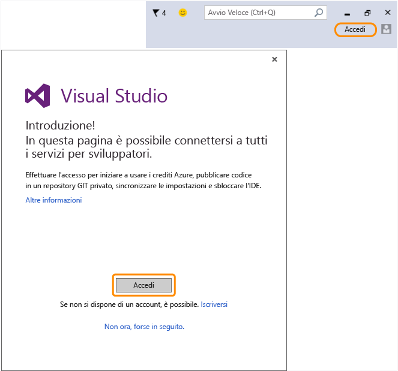

# Tornare a Visual Studio per accedere all&#39;IDE con il nuovo account Microsoft.
L'account Microsoft è stato creato. Tornare a Visual Studio e accedere dalla procedura guidata iniziale durante il primo avvio o dall'angolo superiore destro dell'IDE in qualsiasi momento.  
  
 Accedere all'IDE per iniziare a usare i crediti Azure, pubblicare il codice su un repository Git privato, sincronizzare le impostazioni e sbloccare l'IDE.[Ulteriori informazioni](../ide/signing-in-to-visual-studio.md) su tutti i servizi per sviluppatori disponibili.  
  
 