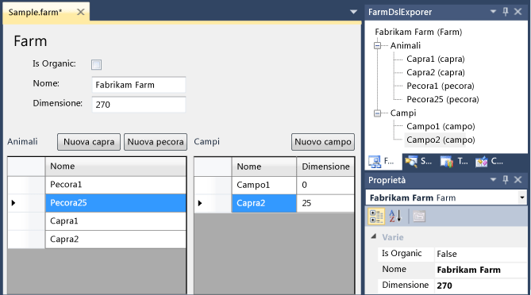
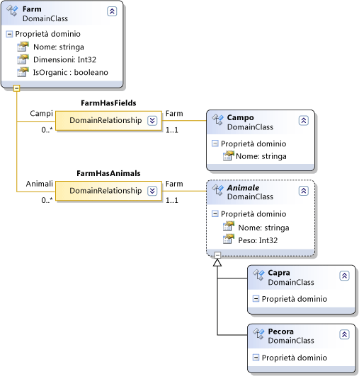
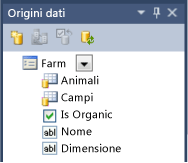

# Creazione di un linguaggio specifico di dominio basato su Windows Form
[!INCLUDE[vs2017banner](../code-quality/includes/vs2017banner.md)]

È possibile utilizzare Windows Form per visualizzare lo stato di un modello \(DSL\) di linguaggio specifico di dominio, anziché utilizzare un diagramma DSL.  In questo argomento viene illustrata l'associazione Windows Form a un modello DSL, utilizzando lo l'sdk di visualizzazione e modellazione [!INCLUDE[vsprvs](../code-quality/includes/vsprvs_md.md)].  
  
   
Un'istanza DSL, con un'interfaccia utente Windows Form e di esplora modelli.  
  
## Creare un Windows Form DSL  
 Il modello **finestra di progettazione minima di Winform** DSL crea un modello DSL minimo che è possibile modificare per soddisfare le proprie esigenze.  
  
#### Per creare un WinForms minimo DSL  
  
1.  Creare un modello DSL dal modello **finestra di progettazione minima di Winform**.  
  
     In questa procedura dettagliata, i nomi seguenti vengono considerati:  
  
    |||  
    |-|-|  
    |Soluzione e nome DSL|FarmApp|  
    |Spazio dei nomi|Company.FarmApp|  
  
2.  Utilizzare l'esempio iniziale che il modello garantisce:  
  
    1.  Trasformare i modelli.  
  
    2.  Compilare ed eseguire l'esempio \(**CTRL\+F5**\).  
  
    3.  Nell'istanza sperimentale di Visual Studio, aprire il file `Sample` nel progetto di debug.  
  
         Si noti che viene visualizzato in un controllo Windows Form.  
  
         È inoltre possibile visualizzare gli elementi del modello vengono visualizzati in Esplora Risorse.  
  
         Aggiungere alcuni elementi nel form o in Esplora Risorse e notare che vengono visualizzati in un'altra visualizzazione.  
  
 Nell'istanza principale [!INCLUDE[vsprvs](../code-quality/includes/vsprvs_md.md)], tenere presente i seguenti punti sulla soluzione DSL:  
  
-   `DslDefinition.dsl` non contiene elementi del diagramma.  Questo perché non verranno utilizzati i diagrammi DSL per visualizzare modelli dell'istanza di questo modello DSL.  Invece, si esegua Windows Form al modello e gli elementi nel form visualizzato il modello.  
  
-   Oltre ai progetti `DslPackage` e `Dsl`, la soluzione contiene un terzo progetto progetto denominato `UI.`**Interfaccia utente** contiene la definizione di un controllo Windows Form.  `DslPackage` dipende da `UI`e `UI` dipende da `Dsl`.  
  
-   Nel progetto `DslPackage`, `UI\DocView.cs` contiene il codice che visualizza il controllo Windows Form definito nel progetto `UI`.  
  
-   Il progetto `UI` contiene un esempio di lavoro di un controllo del form associati al linguaggio DSL.  Tuttavia, non verrà eseguito quando si modifica la definizione di linguaggio DSL.  Il progetto `UI` contiene:  
  
    -   Una classe `ModelViewControl`denominato Windows Form.  
  
    -   Un file `DataBinding.cs` denominato contenente una definizione parziale aggiuntiva `ModelViewControl`.  Per visualizzare il contenuto, in **Esplora soluzioni**, aprire il menu di scelta rapida per il file e scegliere **Visualizza codice**.  
  
### Sul progetto dell'interfaccia utente  
 Quando si aggiorna il file di definizione DSL per definire il proprio linguaggio DSL, sarà necessario aggiornare il controllo nel progetto `UI` visualizzare il linguaggio DSL.  A differenza dei progetti `DslPackage` e `Dsl`, il progetto `UI` di esempio non viene generato da `DslDefinitionl.dsl`.  È possibile aggiungere file .tt per generare codice se si desidera, benché questo non venga analizzato in questa procedura dettagliata.  
  
## Aggiornare la definizione di linguaggio DSL  
 Ciò che segue la definizione di modello DSL è utilizzato in questa procedura dettagliata.  
  
   
  
#### Per aggiornare la definizione di linguaggio DSL  
  
1.  Aprire DslDefinition.dsl nella finestra di progettazione DSL.  
  
2.  Eliminazione **ExampleElement**  
  
3.  Rinominare la classe di dominio **ExampleModel** a `Farm`.  
  
     Immettere le proprietà aggiuntive del dominio denominate `Dimensione` di tipo **Int32**e a `IsOrganic` di tipo **booleano**.  
  
    > [!NOTE]
    >  Se si elimina la classe di dominio radice e si crea una nuova radice, sarà necessario reimpostare la proprietà della radice dell'editor.  In **DSL Explorer**, **Editor**selezionato.  Scegliere nella Finestra Proprietà, impostare **Classe radice** a `Farm`.  
  
4.  Utilizzare lo strumento **Classe di dominio denominata** per creare le classi di dominio:  
  
    -   `Campo` – fornire questo una proprietà aggiuntiva di dominio denominata `Dimensione`.  
  
    -   `Animale` – nella Finestra Proprietà, impostare **Modificatore ereditarietà** a **Abstract**.  
  
5.  Utilizzare lo strumento **Classe dominio** per creare le classi seguenti:  
  
    -   `Pecore`  
  
    -   `Capra`  
  
6.  Utilizzare lo strumento **Ereditarietà** per fare `capra` e `pecore` ereditare da `Animale`.  
  
7.  Utilizzare lo strumento **Incorporamento** per incorporare `Campo` e `Animale` in `Farm`.  
  
8.  È possibile riordinare il diagramma.  Per ridurre il numero di elementi duplicati, utilizzare il comando **Porta sottostruttura qui** il menu di scelta rapida di elementi foglia.  
  
9. **Trasforma tutti i modelli** la barra degli strumenti di Esplora soluzioni.  
  
10. Compilare il progetto **DSL**.  
  
    > [!NOTE]
    >  In questa fase, gli altri progetti non verranno compilati senza errori.  Tuttavia, si desidera compilare il progetto di Dsl in modo che il relativo assembly sia disponibile la procedura guidata origine dati.  
  
## Aggiornare il progetto dell'interfaccia utente  
 Ora è possibile creare un nuovo controllo utente che visualizza le informazioni memorizzate nel modello DSL.  Il modo più semplice per connettere il controllo utente al modello è tramite le associazioni dati.  L'adattatore **ModelingBindingSource** denominato tipo di associazione dati specificamente progettato per connettersi DSLs le interfacce non \- VMSDK.  
  
#### Per definire il modello DSL come origine dati  
  
1.  Scegliere dal menu **Dati**, scegliere **Mostra origini dati**.  
  
     Verrà visualizzata la finestra **Origini dati**.  
  
     Scegliere **Aggiungi nuova origine dati**.  Verrà avviata la **Configurazione guidata origine dati**.  
  
2.  Scegliere **Oggetto**, **Avanti**.  
  
     Espandere **DSL**, **Company.FarmApp**e selezionare **Farm**, la classe radice del modello.  Scegliere **Fine**.  
  
     In Esplora soluzioni, progetti **Interfaccia utente** contiene ora **Properties\\DataSources\\Farm.datasource**  
  
     Le proprietà e le relazioni della classe di modello vengono visualizzati nella finestra Origini dati.  
  
       
  
#### Per connettere il modello in un form  
  
1.  Nel progetto **Interfaccia utente**, eliminare tutti i file esistenti vb.  
  
2.  Aggiungere un nuovo file **Controllo utente** denominato `FarmControl` al progetto **Interfaccia utente**.  
  
3.  Nella finestra **Origini dati**, nel menu a discesa su **Farm**, scegliere **Dettagli**.  
  
     Lasciare le impostazioni predefinite per le altre proprietà.  
  
4.  Aprire FarmControl.cs nella visualizzazione progettazione.  
  
     Trascinare **Farm** dalla finestra Origini dati in FarmControl.  
  
     Un insieme di controlli viene visualizzato, uno per ciascuna proprietà.  Le proprietà di una relazione non generano controlli.  
  
5.  Eliminazione **farmBindingNavigator**.  Ciò viene generata automaticamente nella finestra di progettazione `FarmControl`, ma non è utile per l'applicazione.  
  
6.  Utilizzando la casella degli strumenti, creare due istanze **DataGridView**e denominarle `AnimalGridView` e `FieldGridView`.  
  
    > [!NOTE]
    >  Un passaggio alternativo consiste di trascinare gli animali sistema e gli elementi dalla finestra Origini dati nel controllo.  Attraverso questa azione viene creato automaticamente le griglie dei dati e le associazioni tra la visualizzazione griglia e l'origine dati.  Tuttavia, questa associazione non funziona correttamente per DSLs.  Pertanto è preferibile creare griglie dei dati e le associazioni manualmente.  
  
7.  Se la casella degli strumenti non contiene lo strumento **ModelingBindingSource**, aggiungerlo.  Scegliere dal menu di scelta rapida **Dati**, scegliere **Scegli elementi**.  Nella finestra di dialogo **Scegli elementi della Casella degli strumenti**, **ModelingBindingSource** selezionato da **.NET Framework Tab**.  
  
8.  Utilizzando la casella degli strumenti, creare due istanze **ModelingBindingSource**e denominarle `AnimalBinding` e `FieldBinding`.  
  
9. Impostare la proprietà **DataSource** di ogni **ModelingBindingSource** a **farmBindingSource**.  
  
     Impostare la proprietà **DataMember** a **Animali** o a **Campi**.  
  
10. Impostare le proprietà **DataSource**`AnimalGridView` a `AnimalBinding`e `FieldGridView` a `FieldBinding`.  
  
11. Modificare il layout del controllo farm al gusto.  
  
 **ModelingBindingSource** È un adattatore che esegue numerose funzioni specifiche di DSLs:  
  
-   Esegue il wrapping degli aggiornamenti in una transazione dell'archivio VMSDK.  
  
     Ad esempio, quando l'utente elimina una riga della griglia della visualizzazione dati, un'associazione normale con un'eccezione della transazione.  
  
-   Assicurarsi che, quando l'utente seleziona una riga, nella Finestra Proprietà vengono visualizzate le proprietà dell'elemento del modello corrispondente, anziché la riga della griglia.  
  
   
Schema dei collegamenti tra le origini dati e visualizzazioni.  
  
#### Per completare le associazioni a modello DSL  
  
1.  Aggiungere il codice seguente in un file di codice distinto nel progetto **Interfaccia utente** :  
  
    ```c#  
    using System.ComponentModel;  
    using Microsoft.VisualStudio.Modeling;  
    using Microsoft.VisualStudio.Modeling.Design;  
  
    namespace Company.FarmApp  
    {  
      partial class FarmControl  
      {  
        public IContainer Components { get { return components; } }  
  
        /// <summary>Binds the WinForms data source to the DSL model.  
        /// </summary>  
        /// <param name="nodelRoot">The root element of the model.</param>  
        public void DataBind(ModelElement modelRoot)  
        {  
          WinFormsDataBindingHelper.PreInitializeDataSources(this);  
          this.farmBindingSource.DataSource = modelRoot;  
          WinFormsDataBindingHelper.InitializeDataSources(this);  
        }  
      }  
    }  
    ```  
  
2.  Nel progetto **DslPackage**, modifica **DslPackage \\ DocView.tt** aggiornare la definizione seguente variabile:  
  
    ```c#  
    string viewControlTypeName = "FarmControl";  
    ```  
  
## Test del linguaggio DSL  
 La soluzione DSL è ora compilazione e l'esecuzione, anche se è possibile aggiungere più avanti ulteriori miglioramenti.  
  
#### Per testare il modello DSL  
  
1.  Compilare ed eseguire la soluzione.  
  
2.  Nell'istanza sperimentale di Visual Studio, aprire il file **Esempio**.  
  
3.  In **FarmApp Explorer**, aprire il menu di scelta rapida del nodo radice **Farm** e scegliere **Aggiungere la nuova capra**.  
  
     `Goat1` visualizzato nella visualizzazione **Animali**.  
  
    > [!WARNING]
    >  È necessario utilizzare il menu di scelta rapida del nodo **Farm**, non il nodo **Animali**.  
  
4.  Selezionare il nodo radice **Farm** e visualizzare le proprietà.  
  
     Nella visualizzazione form, modificare **Nome** o **Dimensione** della farm.  
  
     Quando ci si sposta da ogni campo nel form, le modifiche corrispondenti della proprietà nella Finestra Proprietà.  
  
## Miglioramento del linguaggio DSL  
  
#### Per eseguire l'aggiornamento delle proprietà immediatamente  
  
1.  In visualizzazione progettazione di FarmControl.cs, selezionare un campo semplice come nome, la dimensione o IsOrganic.  
  
2.  Nella Finestra Proprietà espandere, **associazioni dati** e aprire **\(Avanzate\)**.  
  
     Nella finestra di dialogo **Formattazione e associazione avanzata**, in **Modalità aggiornamento origine dati**, scegliere **OnPropertyChanged**.  
  
3.  Compilare ed eseguire la soluzione.  
  
     Verificare che quando si modifica il contenuto del campo, la proprietà corrispondente del modello farm passare immediatamente.  
  
#### Per fornire aggiungere pulsanti  
  
1.  In visualizzazione progettazione di FarmControl.cs, utilizzare la casella degli strumenti per creare un pulsante nel form.  
  
     Modificare il nome e il testo del pulsante, ad esempio a `nuove pecore`.  
  
2.  Aprire il file code\-behind del pulsante \(ad esempio facendo doppio clic su.  
  
     Modificarlo come segue:  
  
    ```c#  
    private void NewSheepButton_Click(object sender, EventArgs e)  
    {  
      using (Transaction t = farm.Store.TransactionManager.BeginTransaction("Add sheep"))  
      {  
        elementOperations.MergeElementGroup(farm,  
          new ElementGroup(new Sheep(farm.Partition)));  
        t.Commit();  
      }  
    }  
  
    // The following code is shared with other add buttons:  
    private ElementOperations operationsCache = null;  
    private ElementOperations elementOperations  
    {  
      get  
      {  
        if (operationsCache == null)  
        {  
          operationsCache = new ElementOperations(farm.Store, farm.Partition);  
        }  
        return operationsCache;  
      }  
    }  
    private Farm farm  
    {  
      get { return this.farmBindingSource.DataSource as Farm; }  
    }  
  
    ```  
  
     Sarà inoltre necessario inserire la direttiva seguente:  
  
    ```c#  
  
    using Microsoft.VisualStudio.Modeling;  
  
    ```  
  
3.  Aggiungere i pulsanti simili per le capre i campi e.  
  
4.  Compilare ed eseguire la soluzione.  
  
5.  Verificare che il nuovo pulsante aggiungere un elemento.  Il nuovo elemento deve essere visualizzato in entrambe FarmApp Esplora Risorse e nella visualizzazione corretta della griglia dei dati.  
  
     È possibile modificare il nome dell'elemento nella visualizzazione della griglia.  È inoltre possibile eliminarlo da.  
  
   
  
### Sul codice per aggiungere un elemento  
 Per i nuovi pulsanti dell'elemento, il seguente codice alternativo è leggermente più semplice.  
  
```c#  
private void NewSheepButton_Click(object sender, EventArgs e)  
{  
  using (Transaction t = farm.Store.TransactionManager.BeginTransaction("Add sheep"))  
  {  
    farm.Animals.Add(new Sheep(farm.Partition)); ;  
    t.Commit();  
  }  
}  
  
```  
  
 Tuttavia, tale codice non imposta un nome predefinito del nuovo elemento.  Non esegue alcuna unione personalizzata che è possibile definire in **Direttive di unione dell'elemento** del linguaggio DSL e non esegue alcun codice di unione personalizzata che può essere definito.  
  
 Pertanto è consigliabile utilizzare <xref:Microsoft.VisualStudio.Modeling.ElementOperations> per creare nuovi elementi.  Per ulteriori informazioni, vedere [Personalizzazione della creazione e dello spostamento di elementi](../modeling/customizing-element-creation-and-movement.md).  
  
## Vedere anche  
 [Procedura: definire un linguaggio specifico di dominio](../modeling/how-to-define-a-domain-specific-language.md)   
 [Scrittura di codice per personalizzare un linguaggio specifico di dominio](../modeling/writing-code-to-customise-a-domain-specific-language.md)   
 [Modeling SDK per Visual Studio \- linguaggi specifici di dominio](../modeling/modeling-sdk-for-visual-studio-domain-specific-languages.md)