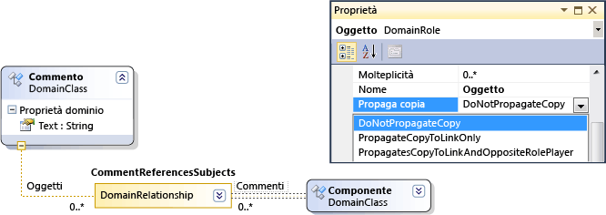
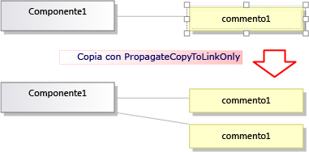
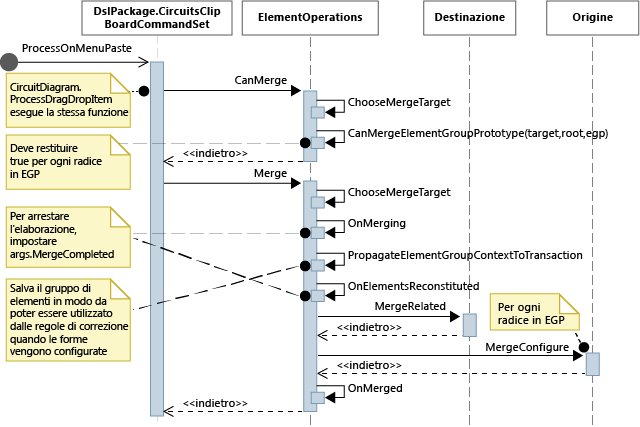

# <a name="customizing-copy-behavior"></a>Personalizzazione del comportamento di copia
In un linguaggio specifico di dominio (DSL, Domain-Specific Language) creato con [!INCLUDE[vsprvs](../code-quality/includes/vsprvs_md.md)] Visualization and Modeling SDK, è possibile modificare il tipo di comportamento che si ottiene quando l'utente copia e incolla degli elementi.  
  
## <a name="standard-copy-and-paste-behavior"></a>Comportamento standard della funzione di copia e incolla  
 Per abilitare la copia, impostare il **abilitare Copia Incolla** proprietà del **Editor** nodo in Esplora DSL.  
  
 Per impostazione predefinita, quando l'utente copia elementi negli Appunti, vengono copiati anche gli elementi seguenti:  
  
-   Discendenti incorporati degli elementi selezionati, cioè elementi che rappresentano la destinazione di relazioni di incorporamento che hanno origine negli elementi copiati.  
  
-   Collegamenti di relazione tra gli elementi copiati.  
  
 Questa regola si applica ricorsivamente a elementi e collegamenti copiati.  
  
   
  
 Gli elementi e i collegamenti copiati vengono serializzati e archiviati in un oggetto <xref:Microsoft.VisualStudio.Modeling.ElementGroupPrototype> (EGP), che viene inserito negli Appunti.  
  
 Un'immagine degli elementi copiati viene anch'essa inserita negli Appunti. Ciò consente all'utente di incollare in altre applicazioni, ad esempio in Word.  
  
 L'utente può copiare elementi in una destinazione che può accettare tali elementi in base alla definizione DSL. In un DSL generato dal modello di soluzione per componenti, ad esempio, l'utente può incollare porte su componenti, ma non sul diagramma e può incollare componenti sul diagramma ma non su altri componenti.  
  
## <a name="customizing-copy-and-paste-behavior"></a>Personalizzazione del comportamento della funzione di copia e incolla  
 Per ulteriori informazioni sulla personalizzazione del modello utilizzando il codice programma, vedere [esplorazione e aggiornamento di un modello nel codice programma](../modeling/navigating-and-updating-a-model-in-program-code.md).  
  
 **Abilitare o disabilitare la copia, Taglia e Incolla.**  
 In Esplora DSL, impostare il **abilitare Copia Incolla** proprietà del **Editor** nodo.  
  
 **Copiare i collegamenti alla stessa destinazione.** Ad esempio, per una casella di commento copiato collegato allo stesso elemento dell'oggetto.  
 Impostare il **propaga copia** proprietà del ruolo da **propagare copia per collegare solo**. Per ulteriori informazioni, vedere [personalizzare il comportamento di Copia collegamento](#customizeLinks).  
  
 Copiare elementi collegati. Ad esempio, quando si copia un nuovo elemento, vengono eseguite le copie anche di eventuali caselle per i commenti collegate.  
 Impostare il **propaga copia** proprietà del ruolo da **propagare Copia collegamento e opposto assegnatario di ruolo**. Per ulteriori informazioni, vedere [personalizzare il comportamento di Copia collegamento](#customizeLinks).  
  
 **Gli elementi duplicati rapidamente copiando e incollando.** In genere, l'elemento che appena copiato è ancora selezionato, e non è possibile incollare lo stesso tipo di elemento su di esso.  
 Aggiungere una direttiva di unione degli elementi alla classe di dominio e impostarla per inoltrare le unioni alla classe padre. Questo avrà lo stesso effetto sulle operazioni di trascinamento. Per ulteriori informazioni, vedere [la creazione degli elementi di personalizzazione e spostamento](../modeling/customizing-element-creation-and-movement.md).  
  
 \- oppure -  
  
 Selezionare il diagramma prima di incollare gli elementi, mediante l'override di `ClipboardCommandSet.ProcessOnPasteCommand()`. Aggiungere il codice seguente in un file personalizzato del progetto DslPackage:  
  
```csharp  
namespace Company.MyDsl {  
using System.Linq;  
using Microsoft.VisualStudio.Modeling.Diagrams;   
using Microsoft.VisualStudio.Modeling.Shell;  
partial class MyDslClipboardCommandSet  
{  
  protected override void ProcessOnMenuPasteCommand()  
  {  
 // Deselect the current selection after copying:  
 Diagram diagram = (this.CurrentModelingDocView as SingleDiagramDocView).Diagram;  
    this.CurrentModelingDocView  
     .SelectObjects(1, new object[] { diagram }, 0);  
  }  
} }  
  
```  
  
 **Creare collegamenti aggiuntivi quando l'utente Incolla su una destinazione selezionata.** Ad esempio, quando una casella di commento viene incollata in un elemento, viene eseguito un collegamento tra di essi.  
 Aggiungere una direttiva di unione degli elementi alla classe di dominio di destinazione e impostarla per elaborare l'unione mediante l'aggiunta di collegamenti. Questo avrà lo stesso effetto sulle operazioni di trascinamento. Per ulteriori informazioni, vedere [la creazione degli elementi di personalizzazione e spostamento](../modeling/customizing-element-creation-and-movement.md).  
  
 \- oppure -  
  
 Eseguire l'override di `ClipboardCommandSet.ProcessOnPasteCommand()` per creare i collegamenti aggiuntivi dopo la chiamata del metodo di base.  
  
 **Personalizzare i formati in cui è possano copiare gli elementi** alle applicazioni esterne, ad esempio, per aggiungere un bordo al form bitmap.  
 Eseguire l'override *MyDsl* `ClipboardCommandSet.ProcessOnMenuCopyCommand()` nel progetto DslPackage.  
  
 **Personalizzare la modalità elementi vengono copiati negli Appunti mediante il comando di copia, ma non in un'operazione di trascinamento.**  
 Eseguire l'override *MyDsl* `ClipboardCommandSet.CopyModelElementsIntoElementGroupPrototype()` nel progetto DslPackage.  
  
 **Mantenere il layout di forme tramite copia e Incolla.**  
 Quando l'utente copia più forme, è possibile conservarne le relative posizioni quando vengono incollate. Questa tecnica è illustrata nell'esempio in [VMSDK: esempio di diagrammi di circuito](http://go.microsoft.com/fwlink/?LinkId=213879).  
  
 Per ottenere questo effetto, aggiungere le forme e i connettori all'elemento ElementGroupPrototype copiato. Il metodo più conveniente per l'override è ElementOperations.CreateElementGroupPrototype(). Per eseguire questa operazione, aggiungere il codice seguente al progetto DSL:  
  
```csharp  
  
public class MyElementOperations : DesignSurfaceElementOperations  
{  
  // Create an EGP to add to the clipboard.  
  // Called when the elements to be copied have been  
  // collected into an ElementGroup.  
 protected override ElementGroupPrototype CreateElementGroupPrototype(ElementGroup elementGroup, ICollection<ModelElement> elements, ClosureType closureType)  
  {  
 // Add the shapes and connectors:  
 // Get the elements already in the group:  
    ModelElement[] mels = elementGroup.ModelElements  
        .Concat(elementGroup.ElementLinks) // Omit if the paste target is not the diagram.  
        .ToArray();  
 // Get their shapes:  
    IEnumerable<PresentationElement> shapes =   
       mels.SelectMany(mel =>   
            PresentationViewsSubject.GetPresentation(mel));  
    elementGroup.AddRange(shapes);  
  
 return base.CreateElementGroupPrototype  
           (elementGroup, elements, closureType);  
  }  
  
 public MyElementOperations(IServiceProvider serviceProvider, ElementOps1Diagram diagram)  
      : base(serviceProvider, diagram)  
  { }  
}  
  
// Replace the standard ElementOperations  
// singleton with your own:  
partial class MyDslDiagram // EDIT NAME  
{  
 /// <summary>  
 /// Singleton ElementOperations attached to this diagram.  
 /// </summary>  
 public override DesignSurfaceElementOperations ElementOperations  
  {  
 get  
    {  
 if (singleton == null)  
      {  
        singleton = new MyElementOperations(this.Store as IServiceProvider, this);  
      }  
 return singleton;  
    }  
  }  
 private MyElementOperations singleton = null;  
}  
  
```  
  
 **Incollare forme in un percorso scelto, ad esempio la posizione corrente del cursore.**  
 Quando l'utente copia più forme, è possibile conservarne le relative posizioni quando vengono incollate. Questa tecnica è illustrata nell'esempio in [VMSDK: esempio di diagrammi di circuito](http://go.microsoft.com/fwlink/?LinkId=213879).  
  
 Per ottenere questo effetto, eseguire l'override di `ClipboardCommandSet.ProcessOnMenuPasteCommand()` per usare la versione di `ElementOperations.Merge()` specifica per il percorso. Per eseguire questa operazione, aggiungere il codice seguente al progetto DslPackage:  
  
```csharp  
  
partial class MyDslClipboardCommandSet // EDIT NAME  
{  
   /// <summary>  
    /// This method assumes we only want to paste things onto the diagram  
    /// - not onto anything contained in the diagram.  
    /// The base method pastes in a free space on the diagram.  
    /// But if the menu was used to invoke paste, we want to paste in the cursor position.  
    /// </summary>  
    protected override void ProcessOnMenuPasteCommand()  
    {  
  
  NestedShapesSampleDocView docView = this.CurrentModelingDocView as NestedShapesSampleDocView;  
  
      // Retrieve data from clipboard:  
      System.Windows.Forms.IDataObject data = System.Windows.Forms.Clipboard.GetDataObject();  
  
      Diagram diagram = docView.CurrentDiagram;  
      if (diagram == null) return;  
  
      if (!docView.IsContextMenuShowing)  
      {  
        // User hit CTRL+V - just use base method.  
  
        // Deselect anything that's selected, otherwise  
        // pasted item will be incompatible:  
        if (!this.IsDiagramSelected())  
        {  
          docView.SelectObjects(1, new object[] { diagram }, 0);  
        }  
  
        // Paste into a convenient spare space on diagram:  
    base.ProcessOnMenuPasteCommand();  
      }  
      else  
      {  
        // User right-clicked - paste at mouse position.  
  
        // Utility class:  
        DesignSurfaceElementOperations op = diagram.ElementOperations;  
  
        ShapeElement pasteTarget = diagram;  
  
        // Check whether what's in the paste buffer is acceptable on the target.  
        if (pasteTarget != null && op.CanMerge(pasteTarget, data))  
        {  
  
        // Although op.Merge would be a no-op if CanMerge failed, we check CanMerge first  
          // so that we don't create an empty transaction (after which Undo would be no-op).  
          using (Transaction t = diagram.Store.TransactionManager.BeginTransaction("paste"))  
          {  
            PointD place = docView.ContextMenuMousePosition;  
            op.Merge(pasteTarget, data, PointD.ToPointF(place));  
            t.Commit();  
          }  
        }  
      }  
    }  
  }  
```  
  
 **Consentire all'utente di trascinamento della selezione di elementi.**  
 Vedere [procedura: aggiungere un gestore di trascinamento e rilascio](../modeling/how-to-add-a-drag-and-drop-handler.md).  
  
##  <a name="customizeLinks"></a>Personalizzazione del comportamento di Copia collegamento  
 Quando l'utente copia un elemento, il comportamento standard prevede che gli eventuali elementi incorporati vengano anch'essi copiati. È possibile modificare il comportamento di copia standard. Nella definizione del linguaggio DSL, selezionare un ruolo a un lato di una relazione e nel set di finestra delle proprietà di **propaga copia** valore.  
  
   
  
 Sono disponibili tre valori:  
  
-   Non propagare copia  
  
-   Propaga copia solo a collegamento - Quando il gruppo viene incollato, la nuova copia del collegamento farà riferimento all'elemento esistente nella posizione a cui punta il collegamento.  
  
-   Propaga copia a collegamento e ad assegnatario di ruolo opposto - Il gruppo copiato include una copia dell'elemento presente nella posizione a cui punta il collegamento.  
  
   
  
 Le modifiche apportate influenzeranno sia gli elementi che l'immagine copiata.  
  
## <a name="programming-copy-and-paste-behavior"></a>Programmazione del comportamento della funzione di copia e incolla  
 Molti aspetti del comportamento di un linguaggio DSL copia, Incolla, la creazione e l'eliminazione di oggetti sono gestiti da un'istanza di <xref:Microsoft.VisualStudio.Modeling.ElementOperations> che è associata al diagramma. È possibile modificare il comportamento del linguaggio DSL derivando la propria classe dal <xref:Microsoft.VisualStudio.Modeling.ElementOperations> ed eseguendo l'override di <xref:Microsoft.VisualStudio.Modeling.Diagrams.Diagram.ElementOperations%2A> proprietà della classe del diagramma.  
  
> [!TIP]
>  Per ulteriori informazioni sulla personalizzazione del modello utilizzando il codice programma, vedere [esplorazione e aggiornamento di un modello nel codice programma](../modeling/navigating-and-updating-a-model-in-program-code.md).  
  
   
  
   
  
#### <a name="to-define-your-own-elementoperations"></a>Per definire il proprio oggetto ElementOperations  
  
1.  In un nuovo file del progetto DSL creare una classe derivata da <xref:Microsoft.VisualStudio.Modeling.Diagrams.DesignSurfaceElementOperations>.  
  
2.  Aggiungere una definizione di classe parziale per la propria classe diagramma. Il nome di questa classe è reperibile **Dsl\GeneratedCode\Diagrams.cs**.  
  
     Nella classe diagramma sovrascrivere <xref:Microsoft.VisualStudio.Modeling.Diagrams.Diagram.ElementOperations%2A> per restituire un'istanza della sottoclasse ElementOperations. È necessario restituire la stessa istanza ad ogni chiamata.  
  
 Aggiungere il codice seguente in un file di codice personalizzato nel progetto DslPackage:  
  
```csharp  
  
using Microsoft.VisualStudio.Modeling;  
using Microsoft.VisualStudio.Modeling.Diagrams;  
using Microsoft.VisualStudio.Modeling.Diagrams.ExtensionEnablement;  
  
  public partial class MyDslDiagram  
  {  
    public override DesignSurfaceElementOperations ElementOperations  
    {  
      get  
      {  
        if (this.elementOperations == null)  
        {  
          this.elementOperations = new MyElementOperations(this.Store as IServiceProvider, this);  
        }  
        return this.elementOperations;  
      }  
    }  
    private MyElementOperations elementOperations = null;  
  }  
  
  public class MyElementOperations : DesignSurfaceElementOperations  
  {  
    public MyElementOperations(IServiceProvider serviceProvider, MyDslDiagram diagram)  
      : base(serviceProvider, diagram)  
    { }  
    // Overridden methods follow  
  }  
  
```  
  
## <a name="receiving-items-dragged-from-other-models"></a>Ricezione di elementi trascinati da altri modelli  
 È anche possibile usare ElementOperations per definire il comportamento per copia, spostamento, eliminazione e trascinamento. A dimostrazione dell'uso di ElementOperations, nell'esempio seguente viene definito un comportamento di trascinamento personalizzato. Tuttavia, a tale scopo è possibile l'approccio alternativo, descritto in [procedura: aggiungere un gestore di trascinamento e rilascio](../modeling/how-to-add-a-drag-and-drop-handler.md), ovvero ed estensibile.  
  
 Definire due metodi nella classe ElementOperations:  
  
-   `CanMerge(ModelElement targetElement, System.Windows.Forms.IDataObject data)` che determina se l'elemento di origine può essere trascinato nella forma, connettore o diagramma di destinazione.  
  
-   `MergeElementGroupPrototype(ModelElement targetElement, ElementGroupPrototype sourcePrototype)` che combina l'elemento di origine nella destinazione.  
  
### <a name="canmerge"></a>CanMerge()  
 `CanMerge()` viene chiamato per stabilire il feedback da visualizzare per l'utente durante lo spostamento del mouse nel diagramma. I parametri per il metodo sono costituiti dall'elemento su cui sta passando il mouse e dai dati sull'origine da cui è stata eseguita l'operazione di trascinamento. L'utente può trascinare da qualsiasi punto dello schermo. L'oggetto di origine può quindi essere di diversi tipi e può essere serializzato in diversi formati. Se l'origine è un modello DSL o UML, il parametro dati è la serializzazione di un oggetto <xref:Microsoft.VisualStudio.Modeling.ElementGroupPrototype>. Le operazioni di trascinamento, di copia e quelle eseguite mediante la casella degli strumenti usano ElementGroupPrototypes per rappresentare frammenti di modelli.  
  
 Un prototipo di gruppo di elementi può contenere qualsiasi numero di elementi e collegamenti. I tipi di elemento sono identificabili mediante i relativi GUID. Il GUID si riferisce alla forma che viene trascinata e non all'elemento del modello sottostante. Nell'esempio seguente `CanMerge()` restituisce true se una forma della classe di un diagramma UML viene trascinata sul diagramma attuale.  
  
```csharp  
public override bool CanMerge(ModelElement targetShape, System.Windows.Forms.IDataObject data)  
 {  
  // Extract the element prototype from the data.  
  ElementGroupPrototype prototype = ElementOperations.GetElementGroupPrototype(this.ServiceProvider, data);  
  if (targetShape is MyTargetShape && prototype != null &&  
        prototype.RootProtoElements.Any(rootElement =>   
          rootElement.DomainClassId.ToString()   
          ==  "3866d10c-cc4e-438b-b46f-bb24380e1678")) // Guid of UML Class shapes  
          // or SourceClass.DomainClassId  
        return true;  
   return base.CanMerge(targetShape, data);  
 }  
  
```  
  
## <a name="mergeelementgroupprototype"></a>MergeElementGroupPrototype()  
 Questo metodo viene chiamato quando l'utente rilascia un elemento in un diagramma, forma o connettore. La sua funzione consiste nell'unire il contenuto trascinato all'elemento di destinazione. In questo esempio il codice determina se può o meno riconoscere la combinazione dei tipi di destinazione e del prototipo. Se li riconosce, il metodo converte gli elementi trascinati in un prototipo degli elementi da aggiungere al modello. Viene chiamato il metodo di base per eseguire l'unione degli elementi convertiti o di quelli non convertiti.  
  
```csharp  
public override void MergeElementGroupPrototype(ModelElement targetShape, ElementGroupPrototype sourcePrototype)  
{  
  ElementGroupPrototype prototypeToMerge = sourcePrototype;  
  MyTargetShape pel = targetShape as MyTargetShape;  
  if (pel != null)  
  {  
    prototypeToMerge = ConvertDraggedTypeToLocal(pel, sourcePrototype);  
  }  
  if (prototypeToMerge != null)  
    base.MergeElementGroupPrototype(targetShape, prototypeToMerge);  
}  
  
```  
  
 In questo esempio vengono trattati elementi della classe UML trascinati da un diagramma classi UML. Il linguaggio DSL non è progettato per archiviare classi UML direttamente, ma viene creato un elemento DSL per ogni classe UML trascinata. Questo risulterà utile, ad esempio, se il DSL è un diagramma di istanza. L'utente potrà trascinare classi nel diagramma per creare istanze di tali classi.  
  
```csharp  
  
private ElementGroupPrototype ConvertDraggedTypeToLocal (MyTargetShape snapshot, ElementGroupPrototype prototype)  
{  
  // Find the UML project:  
  EnvDTE.DTE dte = snapshot.Store.GetService(typeof(EnvDTE.DTE)) as EnvDTE.DTE;  
  foreach (EnvDTE.Project project in dte.Solution.Projects)  
  {  
    IModelingProject modelingProject = project as IModelingProject;  
    if (modelingProject == null) continue; // not a modeling project  
    IModelStore store = modelingProject.Store;  
    if (store == null) continue;  
    // Look for the shape that was dragged:  
    foreach (IDiagram umlDiagram in store.Diagrams())  
    {  
      // Get modeling diagram that implements UML diagram:  
      Diagram diagram = umlDiagram.GetObject<Diagram>();  
      Guid elementId = prototype.SourceRootElementIds.FirstOrDefault();  
      ShapeElement shape = diagram.Partition.ElementDirectory.FindElement(elementId) as ShapeElement;  
      if (shape == null) continue;  
      IClass classElement = shape.ModelElement as IClass;  
      if (classElement == null) continue;  
  
      // Create a prototype of elements in my DSL, based on the UML element:  
      Instance instance = new Instance(snapshot.Store);  
      instance.Type = classElement.Name;  
      // Pack them into a prototype:  
      ElementGroup group = new ElementGroup(instance);  
      return group.CreatePrototype();  
    }  
  }  
  return null;  
}  
  
```  
  
## <a name="standard-copy-behavior"></a>Comportamento di copia standard  
 Il codice in questa sezione mostra metodi di cui è possibile eseguire l'override per modificarne il comportamento di copia. Per aiutare a stabilire come ottenere le proprie personalizzazioni, questa sezione mostra del codice che esegue l'override dei metodi relativi alle operazioni di copia, senza però modificare il comportamento standard  
  
 Quando l'utente preme CTRL+C o usa il comando di menu Copia, viene chiamato il metodo <xref:Microsoft.VisualStudio.Modeling.Shell.ClipboardCommandSet.ProcessOnMenuCopyCommand%2A>. È possibile visualizzare questa impostazione **DslPackage\Generated Code\CommandSet.cs**. Per ulteriori informazioni su come i comandi vengono impostati, vedere [procedura: aggiungere un comando al Menu di scelta rapida](../modeling/how-to-add-a-command-to-the-shortcut-menu.md).  
  
 È possibile eseguire l'override di ProcessOnMenuCopyCommand aggiungendo una definizione di classe parziale di *MyDsl* `ClipboardCommandSet` nel progetto DslPackage.  
  
```csharp  
using System.Collections.Generic;  
using System.Drawing;  
using System.Windows.Forms;  
using Microsoft.VisualStudio.Modeling;  
using Microsoft.VisualStudio.Modeling.Diagrams;  
  
partial class MyDslClipboardCommandSet  
{  
  /// <summary>  
  /// Override ProcessOnMenuCopyCommand() to copy elements to the  
  /// clipboard in different formats, or to perform additional tasks  
  /// before or after copying - for example deselect the copied elements.  
  /// </summary>  
  protected override void ProcessOnMenuCopyCommand()  
  {  
    IList<ModelElement> selectedModelElements = this.SelectedElements;  
    if (selectedModelElements.Count == 0) return;  
  
    // System container for clipboard data.  
    // The IDataObject can contain data in several formats.  
    IDataObject dataObject = new DataObject();  
  
    Bitmap bitmap = null; // For export to other programs.  
    try  
    {  
      #region Create EGP for copying to a DSL.  
      this.CopyModelElementsIntoElementGroupPrototype  
                     (dataObject, selectedModelElements);  
      #endregion  
  
      #region Create bitmap for copying to another application.   
      // Find all the shapes associated with this selection:  
      List<ShapeElement> shapes = new List<ShapeElement>(  
        this.ResolveExportedShapesForClipboardImages  
              (dataObject, selectedModelElements));  
  
      bitmap = this.CreateBitmapForClipboard(shapes);  
      if (bitmap != null)  
      {  
        dataObject.SetData(DataFormats.Bitmap, bitmap);  
      }  
      #endregion   
  
      // Add the data to the clipboard:  
      Clipboard.SetDataObject(dataObject, true, 5, 100);  
    }  
    finally  
    {  
      // Dispose bitmap after SetDataObject:  
      if (bitmap != null) bitmap.Dispose();  
    }  
  }  
/// <summary>  
/// Override this to customize the element group that is copied to the clipboard.  
/// </summary>  
protected override void CopyModelElementsIntoElementGroupPrototype(IDataObject dataObject, IList<ModelElement> selectedModelElements)  
{  
  return this.ElementOperations.Copy(dataObject, selectedModelElements);  
}  
}  
```  
  
 Ogni diagramma presenta un'istanza singleton di ElementOperations. È possibile fornire un proprio derivato. Il file, che può essere inserito nel progetto DSL, avrà lo stesso comportamento del codice di cui esegue l'override:  
  
```csharp  
using System;  
using System.Collections.Generic;  
using System.Linq;  
using Microsoft.VisualStudio.Modeling;  
using Microsoft.VisualStudio.Modeling.Diagrams;  
  
namespace Company.MyDsl  
{  
  partial class MyDslDiagram  
  {  
    /// <summary>  
    /// Singleton ElementOperations attached to this diagram.  
    /// </summary>  
    public override DesignSurfaceElementOperations ElementOperations  
    {  
      get  
      {  
        if (this.elementOperations == null)  
        {  
          this.elementOperations = new MyElementOperations(this.Store as IServiceProvider, this);  
        }  
        return this.elementOperations;  
      }  
    }  
    private MyElementOperations elementOperations = null;  
  }  
  
  // Our own version of ElementOperations so that we can override:  
  public class MyElementOperations : DesignSurfaceElementOperations  
  {  
    public MyElementOperations(IServiceProvider serviceProvider, ElementOps1Diagram diagram)  
      : base(serviceProvider, diagram)  
    { }  
  
    /// <summary>  
    /// Copy elements to the clipboard data.  
    /// Provides a hook for adding custom data.  
    /// </summary>  
    public override void Copy(System.Windows.Forms.IDataObject data,   
      ICollection<ModelElement> elements,   
      ClosureType closureType,   
      System.Drawing.PointF sourcePosition)  
    {  
      if (CanAddElementGroupFormat(elements, closureType))  
      {  
        AddElementGroupFormat(data, elements, closureType);   
      }  
  
      // Override these to store additional data:  
      if (CanAddCustomFormat(elements, closureType))  
      {  
        AddCustomFormat(data, elements, closureType, sourcePosition);  
      }  
    }  
  
    protected override void AddElementGroupFormat(System.Windows.Forms.IDataObject data, ICollection<ModelElement> elements, ClosureType closureType)  
    {  
      // Add the selected elements and those implied by the propagate copy rules:  
      ElementGroup elementGroup = this.CreateElementGroup(elements, closureType);  
  
      // Mark all the elements that are not embedded under other elements:  
      this.MarkRootElements(elementGroup, elements, closureType);  
  
      // Store in the clipboard data:  
      ElementGroupPrototype elementGroupPrototype = this.CreateElementGroupPrototype(elementGroup, elements, closureType);  
      data.SetData(ElementGroupPrototype.DefaultDataFormatName, elementGroupPrototype);  
    }  
  
    /// <summary>  
    /// Override this to store additional elements in the element group:  
    /// </summary>  
    protected override ElementGroupPrototype CreateElementGroupPrototype(ElementGroup elementGroup, ICollection<ModelElement> elements, ClosureType closureType)  
    {  
      ElementGroupPrototype prototype = new ElementGroupPrototype(this.Partition, elementGroup.RootElements, elementGroup);  
      return prototype;  
    }  
  
    /// <summary>  
    /// Create an element group from the given starting elements, using the   
    /// copy propagation rules specified in the DSL Definition.  
    /// By default, this includes all the embedded descendants of the starting elements,  
    /// and also includes reference links where both ends are already included.  
    /// </summary>  
    /// <param name="startElements">model elements to copy</param>  
    /// <param name="closureType"></param>  
    /// <returns></returns>  
    protected override ElementGroup CreateElementGroup(ICollection<ModelElement> startElements, ClosureType closureType)  
    {  
      // ElementClosureWalker finds all the connected elements,   
      // according to the propagate copy rules specified in the DSL Definition:  
      ElementClosureWalker walker = new ElementClosureWalker(this.Partition,   
        closureType, // Normally ClosureType.CopyClosure  
        startElements,   
        true, // Do not load other models.  
        null, // Optional list of domain roles not to traverse.  
        true); // Include relationship links where both ends are already included.  
  
      walker.Traverse(startElements);  
      IList<ModelElement> closureList = walker.ClosureList;  
      Dictionary<object, object> closureContext = walker.Context;  
  
      // create a group for this closure  
      ElementGroup group = new ElementGroup(this.Partition);  
      group.AddRange(closureList, false);  
  
      // create the element group prototype for the group  
      foreach (object key in closureContext.Keys)  
      {  
        group.SourceContext.ContextInfo[key] = closureContext[key];  
      }  
  
      return group;  
    }  
  }  
}  
  
```  
  
## <a name="see-also"></a>Vedere anche  
 [Lo spostamento e la creazione degli elementi di personalizzazione](../modeling/customizing-element-creation-and-movement.md)   
 [Procedura: aggiungere un gestore di trascinamento e rilascio](../modeling/how-to-add-a-drag-and-drop-handler.md)   
 [Personalizzazione del comportamento di eliminazione](../modeling/customizing-deletion-behavior.md)   
 [Esempio: Esempio VMSDK circuito diagrammi](http://go.microsoft.com/fwlink/?LinkId=213879)
 
[!INCLUDE[modeling_sdk_info](includes/modeling_sdk_info.md)]
 
