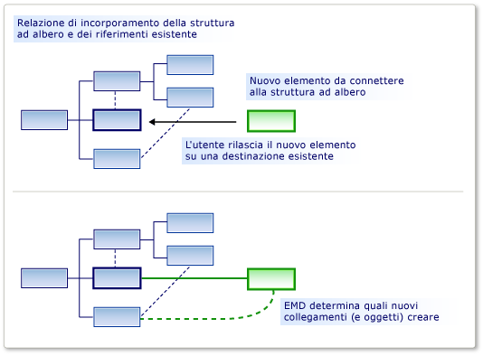

# Personalizzazione della creazione e dello spostamento di elementi
[!INCLUDE[vs2017banner](../code-quality/includes/vs2017banner.md)]

È possibile consentire a un elemento a essere trascinato su un altro, dalla casella degli strumenti o in un'Incolla o operazione di spostamento. È possibile spostati gli elementi collegati a elementi di destinazione, utilizzando le relazioni specificati.  
  
 Una direttiva di unione elementi (EMD) consente di specificare cosa succede quando un elemento del modello *unito* in un altro elemento del modello. Ciò si verifica quando:  
  
-   L'utente trascina dalla casella degli strumenti nel diagramma o una forma.  
  
-   L'utente crea un elemento utilizzando un menu Aggiungi in Esplora risorse o una forma raggruppamento.  
  
-   L'utente sposta un elemento da una corsia a un'altra.  
  
-   L'utente incolla un elemento.  
  
-   Il codice del programma chiama la direttiva di unione di elemento.  
  
 Anche se le operazioni di creazione possono sembrare diverso da operazioni di copia, effettivamente funzionano nello stesso modo. Quando si aggiunge un elemento, ad esempio dalla casella degli strumenti, un prototipo di esso verrà replicato. Il prototipo viene unito nel modello nello stesso modo come elementi che sono stati copiati da un'altra parte del modello.  
  
 La responsabilità di una EMD consiste nel decidere come un oggetto o gruppo di oggetti devono essere unite in una determinata posizione nel modello. In particolare, decide le relazioni tra dovrebbero essere istanziate per creare un collegamento del gruppo nel modello. È inoltre possibile personalizzare per impostare le proprietà e per creare altri oggetti.  
  
   
Il ruolo di una direttiva di unione elementi  
  
 Una EMD viene generata automaticamente quando si definisce una relazione di incorporamento. Questa impostazione predefinita EMD crea un'istanza della relazione quando gli utenti aggiungono nuove istanze figlio al padre. È possibile modificare questi EMDs predefinito, ad esempio aggiungendo codice personalizzato.  
  
 È inoltre possibile aggiungere il proprio EMDs nella definizione DSL, per consentire agli utenti di trascinare o incollare diverse combinazioni di classi di unione e di destinazione.  
  
## <a name="defining-an-element-merge-directive"></a>Definizione di una direttiva di unione elementi  
 È possibile aggiungere direttive di unione degli elementi di classi di dominio, relazioni di dominio, forme, connettori e diagrammi. È possibile aggiungere o individuarli in Esplora DSL sotto la classe di dominio di destinazione. La classe ricevente è la classe di dominio dell'elemento che è già nel modello e in cui verrà unito l'elemento nuovo o copiato.  
  
   
  
 La **classe indicizzazione** è la classe di dominio di elementi che possono essere unite nei membri della classe ricevente. Le istanze delle sottoclassi della classe di indicizzazione verranno unite anche da questo EMD, a meno che non si imposta **si applica alle sottoclassi** su False.  
  
 Esistono due tipi di direttiva di unione:  
  
-   Oggetto **processo Merge** direttiva specifica le relazioni da cui il nuovo elemento deve essere collegato all'albero.  
  
-   Oggetto **Avanti Merge** direttiva reindirizza il nuovo elemento a un altro elemento ricevente, in genere un elemento padre.  
  
 È possibile aggiungere codice personalizzato per unire le direttive:  
  
-   Impostare **accettazione personalizzata utilizza** per aggiungere il proprio codice per determinare se una particolare istanza dell'elemento indicizzazione deve essere unita nell'elemento di destinazione. Quando l'utente trascina dalla casella degli strumenti, il puntatore "non valido" indica se il codice non consente l'unione.  
  
     Ad esempio, è possibile consentire l'unione solo quando l'elemento ricevente è in uno stato specifico.  
  
-   Impostare **unione personalizzata utilizza** aggiungere fornire un codice per definire le modifiche apportate al modello quando viene eseguita l'unione.  
  
     Ad esempio, è possibile impostare le proprietà nell'elemento unito utilizzando i dati dalla nuova posizione nel modello.  
  
> [!NOTE]
>  Se si scrive codice personalizzato di tipo merge, influisce soli operazioni di unione che vengono eseguite utilizzando questa Taiwanese. Se sono presenti altri EMDs che lo stesso tipo di oggetto di tipo merge, o se è presente altro codice personalizzato che crea questi oggetti senza utilizzare il EMD, quindi non verrà essere influenzati dal codice personalizzato di tipo merge.  
>   
>  Se si desidera assicurarsi che un nuovo elemento o una nuova relazione viene sempre elaborato dal codice personalizzato, si consiglia di definire un `AddRule` nella relazione di incorporamento e `DeleteRule` nella classe di dominio dell'elemento. Per ulteriori informazioni, vedere [propagare le modifiche all'interno di modello delle regole](../modeling/rules-propagate-changes-within-the-model.md).  
  
## <a name="example-defining-an-emd-without-custom-code"></a>Esempio: Definizione di una EMD senza codice personalizzato  
 Nell'esempio seguente consente agli utenti di creare un elemento e un connettore nello stesso momento mediante il trascinamento dalla casella degli strumenti in una forma esistente. L'esempio aggiunge una EMD alla definizione DSL. Prima di questa modifica, gli utenti possono trascinare strumenti nel diagramma, ma non sulle forme esistenti.  
  
 Gli utenti è inoltre possono incollare gli elementi su altri elementi.  
  
#### <a name="to-let-users-create-an-element-and-a-connector-at-the-same-time"></a>Per consentire agli utenti di creare contemporaneamente un elemento e un connettore  
  
1.  Creare un nuovo linguaggio specifico di Dominio utilizzando il **linguaggio minimo** modello di soluzione.  
  
     Quando si esegue questo DSL, è possibile creare forme e connettori tra le forme. Non è possibile trascinare un nuovo **ExampleElement** forma dalla casella degli strumenti in una forma esistente.  
  
2.  Per consentire agli utenti di unire gli elementi sul `ExampleElement` forme, creare un nuovo EMD nella `ExampleElement` classe di dominio:  
  
    1.  In **Esplora DSL**, espandere **classi di dominio**. Fare doppio clic su `ExampleElement` e quindi fare clic su **Aggiungi nuovo elemento di tipo Merge direttiva**.  
  
    2.  Assicurarsi che il **Dettagli DSL** finestra è aperta, in modo che è possibile visualizzare i dettagli di EMD nuovo. (Menu: **Visualizzare**, **altre finestre**, **Dettagli DSL**.)  
  
3.  Impostare il **indicizzazione classe** nella finestra Dettagli DSL, per definire la classe di elementi può essere unita nel `ExampleElement` oggetti.  
  
     Per questo esempio, selezionare `ExampleElements`, in modo che l'utente può trascinare elementi nuovi in elementi esistenti.  
  
     Si noti che la classe indicizzazione diventa il nome di EMD in Esplora DSL.  
  
4.  In **unione processo creando collegamenti**, aggiungere due percorsi:  
  
    1.  Un percorso collega il nuovo elemento al modello padre. L'espressione di percorso che è necessario immettere si sposta dall'elemento esistente, backup tramite la relazione di incorporamento del modello padre. Infine, specifica il ruolo nel nuovo collegamento a cui verrà assegnato il nuovo elemento. Il percorso è come segue:  
  
         `ExampleModelHasElements.ExampleModel/!ExampleModel/.Elements`  
  
    2.  L'altro percorso collega il nuovo elemento all'elemento esistente. L'espressione di percorso Specifica la relazione di riferimento e il ruolo a cui verrà assegnato il nuovo elemento. Questo percorso è la seguente:  
  
         `ExampleElementReferencesTargets.Sources`  
  
     È possibile utilizzare lo strumento di navigazione tracciato per creare ogni percorso:  
  
    1.  In **unione processo creando collegamenti a percorsi**, fare clic su **\< aggiungere percorso>**.  
  
    2.  Fare clic sulla freccia giù a destra della voce di elenco. Verrà visualizzata una visualizzazione albero.  
  
    3.  Espandere i nodi dell'albero per formare il percorso che si desidera specificare.  
  
5.  Testare il linguaggio DSL:  
  
    1.  Premere F5 per ricompilare ed eseguire la soluzione.  
  
         La ricompilazione richiede più tempo del solito poiché verrà aggiornato il codice generato da modelli di testo per essere conforme alla nuova definizione DSL.  
  
    2.  Quando l'istanza sperimentale di [!INCLUDE[vsprvs](../code-quality/includes/vsprvs_md.md)] è avviata, aprire un file di modello del linguaggio DSL. Creare alcuni elementi di esempio.  
  
    3.  Trascinare il **elemento esempio** strumento su una forma esistente.  
  
         Verrà visualizzata una nuova forma e collegarla alla forma con un connettore esistente.  
  
    4.  Copiare una forma esistente. Selezionare un'altra forma e incollare.  
  
         Viene creata una copia della prima forma.  Dispone di un nuovo nome e la seconda forma con un connettore è collegato.  
  
 Si noti quanto segue da questa procedura:  
  
-   Tramite la creazione di direttive di Merge degli elementi, è possibile consentire a qualsiasi classe di elemento per accettare qualsiasi altro. Il EMD viene creato nella classe del ricevente dominio e il dominio accettato è specificato nella **classe Index** campo.  
  
-   Definendo i percorsi, è possibile specificare quali collegamenti devono essere utilizzato per connettersi al nuovo elemento al modello esistente.  
  
     I collegamenti desiderati devono includere una relazione di incorporamento.  
  
-   Il EMD influisce sia creazione dalla casella degli strumenti e anche le operazioni Incolla.  
  
     Se si scrive codice personalizzato che crea nuovi elementi, è possibile richiamare in modo esplicito il EMD utilizzando il `ElementOperations.Merge` metodo. Ciò garantisce che il codice collega nuovi elementi nel modello nello stesso modo di altre operazioni. Per ulteriori informazioni, vedere [personalizzazione del comportamento di copia](../modeling/customizing-copy-behavior.md).  
  
## <a name="example-adding-custom-accept-code-to-an-emd"></a>Esempio: Aggiunta di codice accettazione personalizzata a una EMD  
 Aggiungendo codice personalizzato a una EMD, è possibile definire il comportamento di unione più complesso. Questo semplice esempio impedisce all'utente di aggiungere più di un numero fisso di elementi nel diagramma. Nell'esempio viene modificato il valore predefinito EMD che accompagna una relazione di incorporamento.  
  
#### <a name="to-write-custom-accept-code-to-restrict-what-the-user-can-add"></a>Per scrivere codice personalizzato accettare per limitare gli elementi che è possibile aggiungere l'utente  
  
1.  Creare un linguaggio DSL utilizzando il **linguaggio minimo** modello di soluzione. Aprire il diagramma di definizione DSL.  
  
2.  In Esplora DSL espandere **classi di dominio**, `ExampleModel`, **direttive di Merge degli elementi**. Selezionare la direttiva di unione di elemento denominato `ExampleElement`.  
  
     Questo EMD controlla la modalità con cui l'utente può creare nuove `ExampleElement` gli oggetti del modello, ad esempio mediante il trascinamento dalla casella degli strumenti.  
  
3.  Nel **Dettagli DSL** finestra, selezionare **accettazione personalizzata utilizza**.  
  
4.  Ricompilare la soluzione. Questo richiederà più tempo del solito poiché verrà aggiornato il codice generato dal modello.  
  
     Un errore di compilazione sarà segnalato, simile a: "Company.ElementMergeSample.ExampleElement non contiene una definizione per CanMergeExampleElement..."  
  
     È necessario implementare il metodo `CanMergeExampleElement`.  
  
5.  Creare un nuovo file di codice nel **Dsl** progetto. Sostituire il contenuto con il codice riportato di seguito e modificare lo spazio dei nomi per lo spazio dei nomi del progetto.  
  
    ```c#  
    using Microsoft.VisualStudio.Modeling;  
  
    namespace Company.ElementMergeSample // EDIT.  
    {  
      partial class ExampleModel  
      {  
        /// <summary>  
        /// Called whenever an ExampleElement is to be merged into this ExampleModel.  
        /// This happens when the user pastes an ExampleElement  
        /// or drags from the toolbox.  
        /// Determines whether the merge is allowed.  
        /// </summary>  
        /// <param name="rootElement">The root element in the merging EGP.</param>  
        /// <param name="elementGroupPrototype">The EGP that the user wants to merge.</param>  
        /// <returns>True if the merge is allowed</returns>  
        private bool CanMergeExampleElement(ProtoElementBase rootElement, ElementGroupPrototype elementGroupPrototype)  
        {  
          // Allow no more than 4 elements to be added:  
          return this.Elements.Count < 4;  
        }  
      }  
    }  
  
    ```  
  
     Questo semplice esempio limita il numero di elementi che possono essere uniti in del modello padre. Per le condizioni più interessante, il metodo è possibile esaminare le proprietà e i collegamenti dell'oggetto di destinazione. Anche possibile esaminare le proprietà degli elementi di unione, che vengono eseguiti in un <xref:Microsoft.VisualStudio.Modeling.ElementGroupPrototype>. Per ulteriori informazioni su `ElementGroupPrototypes`, vedere [personalizzazione del comportamento di copia](../modeling/customizing-copy-behavior.md). Per ulteriori informazioni su come scrivere codice che legge un modello, vedere [esplorazione e aggiornamento di un modello nel codice programma](../modeling/navigating-and-updating-a-model-in-program-code.md).  
  
6.  Testare il linguaggio DSL:  
  
    1.  Premere F5 per ricompilare la soluzione. Quando l'istanza sperimentale di [!INCLUDE[vsprvs](../code-quality/includes/vsprvs_md.md)] viene aperto, aprire un'istanza del linguaggio DSL.  
  
    2.  Creare nuovi elementi in diversi modi:  
  
        1.  Trascinare il **elemento esempio** strumento nel diagramma.  
  
        2.  Nel **Esplora modelli di esempio**, il pulsante destro del nodo radice e quindi fare clic su **Aggiungi nuovo elemento di esempio**.  
  
        3.  Copiare e incollare un elemento nel diagramma.  
  
    3.  Verificare che non è possibile utilizzare uno dei modi seguenti per aggiungere più di quattro elementi al modello. Infatti, utilizzano la direttiva Element di tipo Merge.  
  
## <a name="example-adding-custom-merge-code-to-an-emd"></a>Esempio: Aggiunta di codice personalizzato di tipo Merge per una EMD  
 Nel codice personalizzato di tipo merge, è possibile definire cosa accade quando l'utente trascina uno strumento o Incolla su un elemento. Esistono due modi per definire un'unione personalizzata:  
  
1.  Impostare **utilizza Merge personalizzata** e fornire il codice richiesto. Il codice sostituisce il codice generato merge. Utilizzare questa opzione se si desidera ridefinire completamente le operazioni eseguite le operazioni di merge.  
  
2.  Eseguire l'override di `MergeRelate` (metodo) e facoltativamente il `MergeDisconnect` (metodo). A tale scopo, è necessario impostare il **Genera una derivata doppia** proprietà della classe di dominio. Il codice può chiamare il codice di unione generato nella classe di base. Utilizzare questa opzione se si desidera eseguire operazioni aggiuntive dopo aver eseguito il merge.  
  
 Questi approcci influiscono solo sui processi di merge che vengono eseguite utilizzando questa Taiwanese. Se si desidera influiscono su tutti i modi in cui è possibile creare l'elemento unito, in alternativa è possibile definire un `AddRule` nella relazione di incorporamento e `DeleteRule` nella classe di dominio unito. Per ulteriori informazioni, vedere [propagare le modifiche all'interno di modello delle regole](../modeling/rules-propagate-changes-within-the-model.md).  
  
#### <a name="to-override-mergerelate"></a>Per eseguire l'override MergeRelate  
  
1.  Nella definizione DSL, assicurarsi che sia stata definita la EMD a cui si desidera aggiungere il codice. Se si desidera, è possibile aggiungere i percorsi e definire accettazione di codice personalizzata come descritto nelle sezioni precedenti.  
  
2.  Nel diagramma DslDefinition, selezionare la classe ricevente dell'unione. In genere si tratta della classe nell'entità finale di origine di una relazione di incorporamento.  
  
     Ad esempio, in un linguaggio DSL generato dalla soluzione linguaggio minimo, selezionare `ExampleModel`.  
  
3.  Nel **proprietà** finestra impostare **Genera una derivata doppia** a **true**.  
  
4.  Ricompilare la soluzione.  
  
5.  Controllare il contenuto di **Dsl\Generated Files\DomainClasses.cs**. Ricerca di metodi denominati `MergeRelate` ed esaminare il relativo contenuto. Ciò consentirà di scrivere le versioni personalizzate.  
  
6.  In un nuovo file di codice, scrivere una classe parziale per la classe ricevente ed eseguire l'override di `MergeRelate` metodo. Ricordare di chiamare il metodo di base. Ad esempio:  
  
    ```c#  
    partial class ExampleModel  
    {  
      /// <summary>  
      /// Called when the user drags or pastes an ExampleElement onto the diagram.  
      /// Sets the time of day as the name.  
      /// </summary>  
      /// <param name="sourceElement">Element to be added</param>  
      /// <param name="elementGroup">Elements to be merged</param>  
      protected override void MergeRelate(ModelElement sourceElement, ElementGroup elementGroup)  
      {  
        // Connect the element according to the EMD:  
        base.MergeRelate(sourceElement, elementGroup);  
  
        // Custom actions:   
        ExampleElement mergingElement = sourceElement as ExampleElement;  
        if (mergingElement != null)  
        {  
          mergingElement.Name = DateTime.Now.ToLongTimeString();  
        }  
      }  
    }  
  
    ```  
  
#### <a name="to-write-custom-merge-code"></a>Per scrivere codice personalizzato di tipo Merge  
  
1.  In **Dsl\Generated Code\DomainClasses.cs**, esaminare i metodi denominati `MergeRelate`. Questi metodi creano collegamenti tra un nuovo elemento e il modello esistente.  
  
     Controllare inoltre i metodi denominati `MergeDisconnect`. Questi metodi scollegare un elemento dal modello quando è da eliminare.  
  
2.  In **Esplora DSL**, selezionare o creare la direttiva di unione elementi che si desidera personalizzare. Nel **Dettagli DSL** finestra impostare **utilizza Merge personalizzato**.  
  
     Quando si imposta questa opzione, il **processo Merge** e **Avanti Merge** opzioni vengono ignorate. Viene invece utilizzato il codice.  
  
3.  Ricompilare la soluzione. Richiederà più tempo del solito poiché verranno aggiornati i file di codice generato dal modello.  
  
     Verranno visualizzati messaggi di errore. Fare doppio clic su messaggi di errore per vedere le istruzioni nel codice generato. Queste istruzioni viene chiesto di fornire due metodi, `MergeRelate`*YourDomainClass* e `MergeDisconnect`*YourDomainClass*  
  
4.  Scrivere i metodi in una definizione di classe parziale in un file di codice. Negli esempi che è controllato in precedenza devono inoltre suggerire le informazioni necessarie.  
  
 Codice personalizzato di tipo merge non influiranno sul codice che crea gli oggetti e relazioni direttamente e non influirà su altre EMDs. Per assicurarsi che le modifiche aggiuntive vengono implementate indipendentemente dalla modalità di creazione dell'elemento, è consigliabile scrivere un `AddRule` e `DeleteRule` invece. Per ulteriori informazioni, vedere [propagare le modifiche all'interno di modello delle regole](../modeling/rules-propagate-changes-within-the-model.md).  
  
## <a name="redirecting-a-merge-operation"></a>Reindirizzamento di un'operazione di unione  
 Una direttiva di unione in avanti reindirizza la destinazione di un'operazione di unione. In genere, la nuova destinazione è il padre di incorporamento della destinazione iniziale.  
  
 In un linguaggio DSL che è stato creato con il modello di diagramma componente, ad esempio, le porte sono incorporate nei componenti. Le porte vengono visualizzate come piccole forme sul bordo di una forma componente. L'utente crea porte trascinando lo strumento di porta in una forma componente. In alcuni casi, l'utente trascina erroneamente lo strumento porta su una porta esistente, anziché il componente, ma l'operazione non riesce. Questo è un semplice errore quando sono presenti diverse porte esistenti. Per consentire all'utente per evitare questa difficoltà, è possibile consentire le porte essere trascinati da una porta esistente, ma l'azione reindirizzato al componente padre. L'operazione funziona come se l'elemento di destinazione sono stati il componente.  
  
 È possibile creare una direttiva di unione in avanti nella soluzione del modello di componente. Se si compila e si esegue la soluzione originale, si noterà che gli utenti possono trascinare un numero qualsiasi di **porta di Input** o **porta di Output** gli elementi dal **della casella degli strumenti** per un **componente** elemento. Tuttavia, è possibile trascinare una porta a una porta esistente. Gli avvisi di puntatore disponibile che questo spostamento non è abilitati. Tuttavia, è possibile creare una direttiva di unione di inoltro in modo che una porta che viene accidentalmente eliminato esistente **porta di Input** viene inoltrato al **componente** elemento.  
  
#### <a name="to-create-a-forward-merge-directive"></a>Per creare una direttiva di unione in avanti  
  
1.  Creare un [!INCLUDE[dsl](../modeling/includes/dsl_md.md)] soluzione utilizzando il modello di componente.  
  
2.  Visualizzazione di **Esplora DSL** aprire Dsldefinition.  
  
3.  Nel **Esplora DSL**, espandere **classi di dominio**.  
  
4.  Il **ComponentPort** classe di dominio astratta è la classe base di entrambi **InPort** e **OutPort**. Fare doppio clic su **ComponentPort** e quindi fare clic su **Aggiungi nuovo elemento di tipo Merge direttiva**.  
  
     Un nuovo **direttiva di unione elementi** nodo viene visualizzato sotto il **direttive di Merge degli elementi** nodo.  
  
5.  Selezionare il **direttiva di unione elementi** nodo e aprire il **Dettagli DSL** finestra.  
  
6.  Nell'elenco di classi di indicizzazione, selezionare **ComponentPort**.  
  
7.  Selezionare **inoltrare Unisci a una classe di dominio diverso**.  
  
8.  Nell'elenco di selezione dei percorsi, espandere **ComponentPort**, espandere **ComponentHasPorts**, quindi selezionare **componente**.  
  
     Il nuovo percorso dovrebbe essere simile a questo:  
  
     **ComponentHasPorts.Component/!Component**  
  
9. Salvare la soluzione e trasformare i modelli facendo clic sul pulsante a destra di **Esplora** barra degli strumenti.  
  
10. Compilare ed eseguire la soluzione. Una nuova istanza della [!INCLUDE[vsprvs](../code-quality/includes/vsprvs_md.md)] viene visualizzata.  
  
11. In **Esplora**, aprire Sample.mydsl. Nel diagramma e **della casella degli strumenti ComponentLanguage** vengono visualizzati.  
  
12. Trascinare un **porta di Input** dal **della casella degli strumenti** a un altro **porta di Input.** Successivamente, trascinare un **OutputPort** per un **InputPort** e quindi in un altro **OutputPort**.  
  
     Non verrà visualizzato il puntatore non disponibile e dovrebbe essere in grado di rilasciare il nuovo **porta di Input** su quello esistente. Selezionare il nuovo **porta di Input** e trascinarlo a un altro punto di **componente**.  
  
## <a name="see-also"></a>Vedere anche  
 [Esplorazione e aggiornamento di un modello nel codice programma](../modeling/navigating-and-updating-a-model-in-program-code.md)   
 [Personalizzazione di strumenti e la casella degli strumenti](../modeling/customizing-tools-and-the-toolbox.md)   
 [Esempio di diagrammi circuito DSL](http://code.msdn.microsoft.com/Visualization-Modeling-SDK-763778e8)