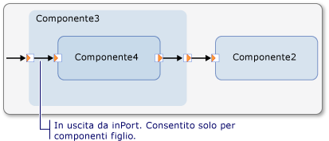
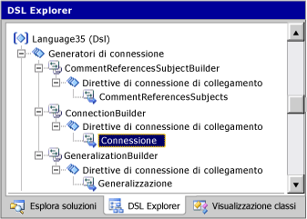
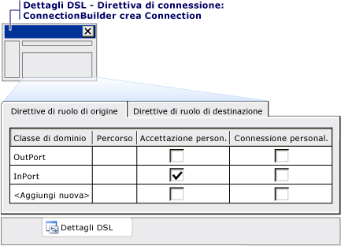

# Personalizzazione di strumenti e della casella degli strumenti
[!INCLUDE[vs2017banner](../code-quality/includes/vs2017banner.md)]

È necessario definire le voci della casella degli strumenti per gli elementi che gli utenti potranno aggiungere ai propri modelli.  Esistono due tipi di strumenti: strumenti elemento e strumenti di connessione.  Nella finestra di progettazione generata, un utente può selezionare uno strumento elemento per trascinare forme nel diagramma e uno strumento di connessione per tracciare i collegamenti tra le forme.  In generale, gli strumenti elemento consentono agli utenti di aggiungere istanze di classi di dominio ai modelli e gli strumenti di connessione consentono di aggiungere istanze di relazioni di dominio.  
  
 In questo argomento  
  
-   [Modalità di definizione della casella degli strumenti](#ToolboxDef)  
  
-   [Personalizzazione di strumenti elemento](#customizing)  
  
-   [Creazione di gruppi di elementi da uno strumento](#groups)  
  
-   [Personalizzazione di strumenti di connessione](#connections)  
  
##  <a name="ToolboxDef"></a> Modalità di definizione della casella degli strumenti  
 In DSL Explorer espandere il nodo Editor e tutti i sottonodi.  Verrà visualizzata una gerarchia simile alla seguente:  
  
```  
  
Editor  
     Toobox Tabs  
        MyDsl          //a tab  
           Tools  
               ExampleElement      // an element tool  
               ExampleRelationship // a connection tool  
  
```  
  
 In questa sezione di DSL Explorer è possibile:  
  
-   Creare nuove schede.  Le schede definiscono le intestazioni di sezione nella casella degli strumenti.  
  
-   Creare nuovi strumenti.  
  
-   Copiare e incollare strumenti.  
  
-   Spostare gli strumenti verso l'alto o verso il basso nell'elenco.  
  
-   Eliminare schede e strumenti.  
  
> [!IMPORTANT]
>  Per aggiungere o incollare elementi in DSL Explorer, fare clic con il pulsante destro del mouse sul nodo padre del padre del nuovo nodo.  Per aggiungere uno strumento, ad esempio, fare clic con il pulsante destro del mouse sulla scheda e non sul nodo **Strumenti**.  Per aggiungere una scheda, fare clic con il pulsante destro del mouse sul nodo **Editor**.  
  
 La proprietà **Icona casella degli strumenti** di ogni strumento fa riferimento a un file bitmap da 16x16 pixel.  Questi file vengono in genere conservati nella cartella **Dsl\\Resources**.  
  
 La proprietà **Classe** di uno strumento elemento fa riferimento a una classe di dominio concreta.  Per impostazione predefinita, lo strumento creerà istanze di questa classe.  È tuttavia possibile scrivere codice per fare in modo che lo strumento crei gruppi di elementi o elementi di tipi diversi.  
  
 La proprietà **Generazione di connessioni** di uno strumento di connessione fa riferimento a un generatore di connessioni che definisce i tipi di elementi a cui lo strumento può connettersi e i tipi di relazioni che crea tra di essi.  I generatori di connessioni sono definiti come nodi in DSL Explorer.  I generatori di connessioni vengono creati automaticamente al momento della definizione delle relazioni di dominio, ma è possibile scrivere codice per personalizzarli.  
  
#### Per aggiungere uno strumento alla casella degli strumenti  
  
1.  In genere si crea uno strumento elemento dopo avere creato una classe di forma e averla mappata a una classe di dominio.  
  
     Si crea invece uno strumento di connessione dopo avere creato una classe connettore e averla mappata a una relazione di riferimento.  
  
2.  In DSL Explorer espandere il nodo **Editor** e il nodo **Schede della casella degli strumenti**.  
  
     Fare clic con il pulsante destro del mouse su un nodo di scheda della casella degli strumenti e scegliere **Aggiungi nuovo strumento elemento** o **Aggiungi nuovo strumento di connessione**.  
  
3.  Impostare la proprietà **Icona casella degli strumenti** in modo che faccia riferimento a un file bitmap da 16x16 pixel.  
  
     Se si vuole definire una nuova icona, creare il file bitmap in Esplora soluzioni nella cartella **Dsl\\Resources**.  Il file deve avere i valori di proprietà seguenti: **Operazione di compilazione** \= **Contenuto**; **Copia nella directory di output** \= **Non copiare**.  
  
4.  **Per uno strumento elemento:** impostare la proprietà **Classe** dello strumento in modo che faccia riferimento a una classe di dominio concreta mappata a una forma.  
  
     **Per uno strumento di connessione:** Impostare la proprietà **Generatore di connessioni** dello strumento su uno degli elementi visualizzati nell'elenco a discesa.  I generatori di connessione vengono creati automaticamente quando si mappa un connettore a una relazione di dominio.  Se di recente si è creato un connettore, normalmente si selezionerà il generatore di connessioni associato.  
  
5.  Per testare il linguaggio specifico di dominio \(DSL\), premere F5 o CTRL\+F5 e nell'istanza sperimentale di [!INCLUDE[vsprvs](../code-quality/includes/vsprvs_md.md)] aprire un file di modello di esempio.  Il nuovo strumento verrà visualizzato nella casella degli strumenti.  Trascinarlo sul diagramma per verificare che crei un nuovo elemento.  
  
     Se lo strumento non viene visualizzato, arrestare l'istanza sperimentale di [!INCLUDE[vsprvs](../code-quality/includes/vsprvs_md.md)].  Dal menu **Start** di Windows, eseguire **Reimposta istanza sperimentale di Microsoft Visual Studio 2010**.  Nel menu **Compila** di [!INCLUDE[vsprvs](../code-quality/includes/vsprvs_md.md)] fare clic su **Ricompila soluzione**.  Testare di nuovo il DSL.  
  
##  <a name="customizing"></a> Personalizzazione di strumenti elemento  
 Per impostazione predefinita, lo strumento creerà una singola istanza della classe specificata, ma è possibile scegliere tra due alternative:  
  
-   Definire le direttive di merge degli elementi su altre classi, per consentire loro di accettare nuove istanze di questa classe e di creare collegamenti aggiuntivi quando viene creato il nuovo elemento.  Ad esempio, è possibile consentire all'utente di rilasciare un commento su un altro elemento e quindi creare un collegamento di riferimento tra i due.  
  
     Queste personalizzazioni influiscono anche su ciò che succede quando l'utente incolla o trascina un elemento.  
  
     Per altre informazioni, vedere [Personalizzazione della creazione e dello spostamento di elementi](../modeling/customizing-element-creation-and-movement.md).  
  
-   Scrivere codice per personalizzare lo strumento in modo che possa creare gruppi di elementi.  Lo strumento è inizializzato dai metodi in ToolboxHelper.cs che possono essere sostituiti.  Per altre informazioni, vedere [Creazione di gruppi di elementi da uno strumento](#groups).  
  
##  <a name="groups"></a> Creazione di gruppi di elementi da uno strumento  
 Ogni strumento elemento contiene un prototipo degli elementi che deve creare.  Per impostazione predefinita, ogni strumento elemento crea un singolo elemento, ma è anche possibile creare un gruppi di oggetti correlati con un solo strumento.  A questo scopo, è necessario inizializzare lo strumento con un prototipo <xref:Microsoft.VisualStudio.Modeling.ElementGroupPrototype> che contiene gli elementi correlati.  
  
 L'esempio seguente è estratto da un DSL in cui è presente un tipo Transistor.  Ogni transistor dispone di tre terminali denominati.  Nello strumento elemento per i transistor è archiviato un prototipo contenente quattro elementi modello e tre collegamenti di relazione.  Quando l'utente trascina lo strumento nel diagramma, viene creata un'istanza del prototipo che viene quindi collegato alla radice del modello.  
  
 Questo codice sostituisce un metodo definito in **Dsl\\GeneratedCode\\ToolboxHelper.cs**.  
  
 Per altre informazioni sulla personalizzazione del modello usando il codice programma, vedere [Esplorazione e aggiornamento di un modello nel codice del programma](../modeling/navigating-and-updating-a-model-in-program-code.md).  
  
```  
using Microsoft.VisualStudio.Modeling;  
using Microsoft.VisualStudio.Modeling.Diagrams;  
  
  public partial class CircuitsToolboxHelper  
  {  
    /// <summary>  
    /// Toolbox initialization, called for each element tool on the toolbox.  
    /// This version deals with each Component subtype separately.  
    /// </summary>  
    /// <param name="store"></param>  
    /// <param name="domainClassId">Identifies the domain class this tool should instantiate.</param>  
    /// <returns>prototype of the object or group of objects to be created by tool</returns>  
    protected override ElementGroupPrototype CreateElementToolPrototype(Store store, Guid domainClassId)  
    {  
        if (domainClassId == Transistor.DomainClassId)  
        {  
            Transistor transistor = new Transistor(store);  
  
            transistor.Base = new ComponentTerminal(store);  
            transistor.Collector = new ComponentTerminal(store);  
            transistor.Emitter = new ComponentTerminal(store);  
  
            transistor.Base.Name = "base";  
            transistor.Collector.Name = "collector";  
            transistor.Emitter.Name = "emitter";  
  
            // Create an ElementGroup for the Toolbox.  
            ElementGroup elementGroup = new ElementGroup(store.DefaultPartition);  
            elementGroup.AddGraph(transistor, true);  
            // AddGraph includes the embedded parts  
  
            return elementGroup.CreatePrototype();  
        }  
        else  
        {  
            return base.CreateElementToolPrototype(store, domainClassId);  
}  }    }  
  
```  
  
##  <a name="connections"></a> Personalizzazione di strumenti di connessione  
 Generalmente uno strumento elemento viene creato quando si crea una nuova classe connettore.  In alternativa, è possibile sottoporre uno strumento a overload consentendo ai tipi delle due entità finali di determinare il tipo di relazione.  È ad esempio possibile definire uno strumento di connessione che può creare sia relazioni Persona\-Persona sia relazioni Persona\-Città.  
  
 Gli strumenti di connessione richiamano i generatori di connessioni.  Usare i generatori di connessioni per specificare il modo in cui gli utenti possono collegare gli elementi nella finestra di progettazione generata.  I generatori di connessioni consentono di specificare gli elementi che si possono collegare e il tipo di collegamento che viene creato tra essi.  
  
 Quando si crea una relazione di riferimento tra classi di dominio, viene automaticamente creato un generatore di connessioni.  È possibile usare questo generatore di connessioni per mappare uno strumento di connessione.  Per altre informazioni sulla creazione di strumenti di connessione, vedere [Configuring the Toolbox](../modeling/customizing-tools-and-the-toolbox.md).  
  
 È possibile modificare il generatore di connessioni predefinito in modo che possa gestire un intervallo di tipi di origine e destinazioni diverso e creare tipi di relazioni diversi.  
  
 È anche possibile scrivere codice personalizzato affinché i generatori di connessioni possano specificare le classi di origine e di destinazione per la connessione, definire il tipo di connessione da effettuare ed eseguire altre azioni associate alla creazione di una connessione.  
  
### Struttura dei generatori di connessioni  
 I generatori di connessioni contengono una o più direttive di collegamento connessione che specificano la relazione di dominio e gli elementi di origine e di destinazione.  Ad esempio, nel modello di soluzione Flusso attività è possibile visualizzare il generatore CommentReferencesSubjectsBuilder in **DSL Explorer**.  Questo generatore di connessioni contiene una direttiva di connessione di collegamento denominata **CommentReferencesSubjects** che è mappata alla relazione di dominio CommentReferencesSubjects.  Questa direttiva di connessione di collegamento contiene una direttiva del ruolo di origine che fa riferimento alla classe di dominio `Comment` e una direttiva del ruolo di destinazione che fa riferimento alla classe di dominio `FlowElement`.  
  
### Uso dei generatori di connessioni per limitare i ruoli di origine e di destinazione  
 È possibile usare i generatori di connessioni per limitare l'occorrenza di determinate classi sia nel ruolo di origine che nel ruolo di destinazione di una determinata relazione di dominio.  Ad esempio, una classe di dominio di base potrebbe avere una relazione di dominio con un'altra classe di dominio, ma non si vuole che tutte le classi derivate della classe di base abbiano gli stessi ruoli in quella relazione.  Nella soluzione Flusso attività, sono presenti quattro classi di dominio concrete \(StartPoint, EndPoint, MergeBranch e Synchronization\) che ereditano direttamente dalla classe di dominio astratta FlowElement e due classi di dominio concrete \(Task e ObjectInState\) che ereditano indirettamente da essa.  Esiste anche una relazione di riferimento Flow che accetta classi di dominio FlowElement sia nel ruolo di origine che in quello di destinazione.  Tuttavia, un'istanza di una classe di dominio EndPoint non dovrebbe essere l'origine di un'istanza di una relazione Flow e un'istanza della classe StartPoint non dovrebbe essere la destinazione di un'istanza di una relazione Flow.  Il generatore di connessioni FlowBuilder ha una direttiva di connessione di collegamento denominata Flow che specifica quali classi di dominio possono rivestire il ruolo di origine \(Task, MergeBranch, StartPoint e Synchronization\) e quali il ruolo di destinazione \(MergeBranch, Endpoint e Synchronization\).  
  
### Generatori di connessione con più direttive di connessione collegamento  
 È possibile aggiungere più di una direttiva di connessione di collegamento a un generatore di connessioni.  Questo consente di non mostrare agli utenti alcune delle complessità del modello di dominio ed evita di creare troppa confusione nella **Casella degli strumenti**.  È possibile aggiungere direttive di connessione collegamento per diverse relazioni di dominio a un singolo generatore di connessioni.  È tuttavia consigliabile combinare le relazioni di dominio quando svolgono approssimativamente la stessa funzione.  
  
 Nella soluzione Flusso attività, lo strumento di connessione Flow viene usato per tracciare istanze per entrambe le relazioni di dominio Flow e ObjectFlow.  Il generatore di connessioni FlowBuilder ha, oltre alla direttiva di connessione di collegamento descritta in precedenza, due direttive di connessione di collegamento denominate ObjectFlow.  Queste direttive specificano che è possibile tracciare un'istanza di una relazione ObjectFlow tra istanze della classe di dominio ObjectInState o da un'istanza di ObjectInState a un'istanza di Task, ma non tra due istanze di Task o da un'istanza di Task a un'istanza di ObjectInState.  Tuttavia, è possibile tracciare un'istanza di una relazione Flow tra due istanze di Task.  Se si compila ed esegue la soluzione Flusso attività, sarà possibile notare che tracciando una relazione Flow da un'istanza di ObjectInState a un'istanza di Task viene creata un'istanza di ObjectFlow, ma tracciando una relazione Flow tra due istanze di Task viene creata un'istanza di Flow.  
  
### Codice personalizzato per i generatori di connessioni  
 Nell'interfaccia utente sono disponibili quattro caselle di controllo che definiscono i vari tipi di personalizzazione dei generatori di connessioni:  
  
-   casella di controllo **Accettazione personalizzata** in una direttiva del ruolo di origine o di destinazione  
  
-   casella di controllo **Connessione personalizzata** in una direttiva del ruolo di origine o di destinazione  
  
-   casella di controllo **Usa la connessione personalizzata** in una direttiva di connessione  
  
-   proprietà **Personalizzato** per il generatore di connessioni  
  
 Per implementare queste personalizzazioni, è necessario fornire codice.  Per informazioni sul codice da fornire, selezionare una delle caselle di controllo, fare clic su Trasforma tutti i modelli e quindi compilare la soluzione.  Verrà visualizzato un report degli errori.  Fare doppio clic sul report degli errori per visualizzare un commento che indica il codice da aggiungere.  
  
> [!NOTE]
>  Per aggiungere il codice personalizzato, creare una definizione di classe parziale in un file di codice separato dai file di codice nelle cartelle GeneratedCode.  Per non perdere il lavoro svolto, non modificare i file di codice generati.  Per altre informazioni, vedere [Override ed estensione delle classi generate](../modeling/overriding-and-extending-the-generated-classes.md).  
  
#### Creazione di codice di connessione personalizzato  
 In ogni direttiva di connessione di collegamento, nella scheda **Direttive ruolo di origine** sono definiti i tipi da cui è possibile trascinare.  Allo stesso modo, nella scheda **Direttive ruolo di destinazione** sono definiti i tipi verso cui è possibile trascinare.  Per ogni tipo, è inoltre possibile specificare se consentire la connessione \(per quella direttiva di connessione di collegamento\) impostando il flag **Accettazione personalizzata** e quindi specificando il codice supplementare.  
  
 È anche possibile personalizzare ciò che accade una volta stabilita la connessione.  Ad esempio, è possibile personalizzare solo il caso in cui il trascinamento si verifica da o a una classe specifica, tutti i casi regolamentati da una direttiva di connessione di collegamento o l'intero generatore di connessioni FlowBuilder.  Per ognuna di queste opzioni, è possibile impostare flag personalizzati al livello appropriato.  Quando si trasformano tutti i modelli e si tenta di compilare la soluzione, i messaggi di errore indirizzano l'utente ai commenti presenti nel codice generato.  I commenti indicano ciò che è necessario fornire.  
  
 Nell'esempio relativo al diagramma dei componenti, il generatore di connessioni per la relazione di dominio Connessione è personalizzato per limitare le connessioni che possono essere stabilite tra le porte.  Nell'illustrazione seguente viene mostrato che è possibile stabilire connessioni solo da elementi `OutPort` a elementi `InPort`, ma è possibile annidare i componenti l'uno all'interno dell'altro.  
  
 **Connessione in ingresso a un elemento OutPort da un componente annidato**  
  
   
  
 È possibile specificare che una connessione può provenire da un componente annidato a un elemento OutPort.  Per specificare tale connessione, è necessario impostare **Usa l'accettazione personalizzata** per il tipo **InPort** come ruolo di origine e per il tipo **OutPort** come ruolo di destinazione nella finestra **Dettagli DSL** come illustrato nelle figure seguenti:  
  
 **Direttiva di connessione di collegamento in DSL Explorer**  
  
   
  
 **Direttiva di connessione di collegamento nella finestra Dettagli DSL**  
  
   
  
 È quindi necessario fornire i metodi nella classe ConnectionBuilder:  
  
```  
  public partial class ConnectionBuilder  
  {  
    /// <summary>  
    /// OK if this component has children  
    /// </summary>  
    private static bool CanAcceptInPortAsSource(InPort candidate)  
    {  
       return candidate.Component.Children.Count > 0;  
    }  
  
    /// <summary>  
    /// Only if source is on parent of target.  
    /// </summary>  
    private static bool CanAcceptInPortAndInPortAsSourceAndTarget                (InPort sourceInPort, InPort targetInPort)  
    {  
      return sourceInPort.Component == targetInPort.Component.Parent;  
    }  
// And similar for OutPorts…  
```  
  
 Per altre informazioni sulla personalizzazione del modello usando il codice programma, vedere [Esplorazione e aggiornamento di un modello nel codice del programma](../modeling/navigating-and-updating-a-model-in-program-code.md).  
  
 È possibile usare un codice simile, ad esempio, per impedire agli utenti di creare cicli con collegamenti padre\-figlio.  Queste limitazioni sono considerati vincoli 'rigidi' in quanto gli utenti non possono violarli.  È anche possibile creare controlli di convalida 'flessibili' che gli utenti possono ignorare temporaneamente tramite la creazione di configurazioni non valide che non possono essere salvate.  
  
### Procedure consigliate per la definizione dei generatori di connessioni  
 È consigliabile definire un generatore di connessioni per creare diversi tipi di relazioni solo se queste sono correlate a livello concettuale.  Nell'esempio relativo al flusso attività, si usa lo stesso generatore per creare flussi tra attività e tra attività e oggetti.  Tuttavia, usare lo stesso generatore per creare relazioni tra commenti e attività potrebbe creare confusione.  
  
 Se si definisce un generatore di connessioni per più tipi di relazioni, è necessario assicurarsi che non possa corrispondere a più di un tipi dalla stessa coppia di oggetti di origine e di destinazione.  In caso contrario, i risultati non saranno prevedibili.  
  
 Usare il codice personalizzato per applicare i vincoli 'rigidi', ma valutare se gli utenti devono avere la possibilità di creare temporaneamente connessioni non valide o meno.  Se si vuole concedere questa possibilità, è possibile modificare i vincoli in modo che le connessioni non vengano convalidate fino a quando gli utenti non tentano di salvare le modifiche.  
  
## Vedere anche  
 [Personalizzazione della creazione e dello spostamento di elementi](../modeling/customizing-element-creation-and-movement.md)   
 [Personalizzazione del comportamento di copia](../modeling/customizing-copy-behavior.md)   
 [Procedura: aggiungere un gestore di trascinamento della selezione](../modeling/how-to-add-a-drag-and-drop-handler.md)   
 [Esplorazione e aggiornamento di un modello nel codice del programma](../modeling/navigating-and-updating-a-model-in-program-code.md)   
 [DSL di esempio di schemi elettrici](http://code.msdn.microsoft.com/Visualization-Modeling-SDK-763778e8)