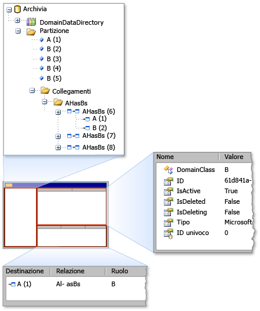

# <a name="debugging-by-using-the-store-viewer"></a>Esecuzione del debug utilizzando il Visualizzatore di archivio
Con il Visualizzatore di archiviazione, è possibile esaminare lo stato di un *archiviare* utilizzato da [!INCLUDE[dsl](../modeling/includes/dsl_md.md)]. Nel Visualizzatore di archiviare vengono visualizzati tutti gli elementi del modello dominio in un negozio specifico, insieme alle proprietà dell'elemento e i collegamenti tra elementi.  
  
## <a name="opening-store-viewer"></a>Aprire l'archivio Visualizzatore  
 Quando si utilizza il [!INCLUDE[vsprvs](../code-quality/includes/vsprvs_md.md)] sperimentale di compilazione, interrompere il codice in un punto di interruzione in un'istanza dell'archivio contiene informazioni sul modello. Quindi, aprire il Visualizzatore di archivio digitando il comando seguente nel **immediato** finestra:  
  
```  
Microsoft.VisualStudio.Modeling.Diagnostics.StoreViewer.Show(mystore);  
```  
  
> [!NOTE]
>  È necessario sostituire `mystore` con il nome dell'istanza di archivio. Inoltre, se si aggiunge lo spazio dei nomi al codice, è possibile digitare il comando per la visualizzazione del Visualizzatore di archivio senza il nome completo dello spazio dei nomi:  
>   
>  `using Microsoft.VisualStudio.Modeling.Diagnostics;`  
>   
>  `...`  
>   
>  `StoreViewer.Show(mystore);`  
  
 Il `Show` metodo dispone di diversi overload. È possibile specificare un'istanza di un archivio o una partizione come parametro.  
  
 In alternativa, è possibile inserire la riga di codice che consente di visualizzare il Visualizzatore di archivio in qualsiasi punto nel codice in cui il parametro passato al `Show` metodo si trova nell'ambito. Questa azione consente di visualizzare il Visualizzatore di archiviazione quando la riga di codice viene eseguito come snapshot del contenuto dell'archivio.  
  
### <a name="using-store-viewer"></a>Visualizzatore di archivio  
 Quando si apre il Visualizzatore di archivio, viene visualizzata una finestra non modale di Windows Form, come mostrato nella figura seguente.  
  
   
Visualizzatore di archivio  
  
 Il Visualizzatore di archivio ha tre riquadri: il riquadro sinistro, riquadro superiore destro e il riquadro in basso a destra. Riquadro di sinistra è una visualizzazione albero dei tipi di `DomainDataDirectory` membro di un archivio. Se si espande il nodo di partizione e fare clic su un elemento, le proprietà dell'elemento vengono visualizzate nel riquadro superiore destro. Se l'elemento è collegato ad altri elementi, gli elementi aggiuntivi vengono visualizzati nel riquadro in basso a destra. Se si fa doppio clic su un elemento nel riquadro in basso a destra, l'elemento viene evidenziato nel riquadro a sinistra.  
  
## <a name="see-also"></a>Vedere anche  
 [Esplorazione e aggiornamento di un modello nel codice del programma](../modeling/navigating-and-updating-a-model-in-program-code.md)