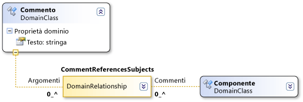

# Sintassi del percorso di dominio
[!INCLUDE[vs2017banner](../code-quality/includes/vs2017banner.md)]

Le definizioni DSL usano una sintassi di tipo XPath per individuare elementi specifici in un modello.  
  
 Normalmente, non è necessario usare questa sintassi direttamente.  Se presente nella finestra Dettagli DSL o Proprietà, è possibile fare clic sulla freccia rivolta verso il basso e usare l'editor dei percorsi.  Tuttavia, il percorso viene visualizzato in questo formato nel campo dopo avere usato l'editor.  
  
 Un percorso di dominio usa il formato seguente:  
  
 *RelationshipName.PropertyName\/\!Role*  
  
   
  
 La sintassi attraversa l'albero del modello.  Ad esempio, la relazione di dominio CommentReferencesSubjects nella figura sopra riportata ha un ruolo Soggetti.  Il segmento di percorso \/\!Subjectt specifica che il percorso termina con gli elementi accessibili tramite il ruolo Soggetti.  
  
 Ogni segmento inizia con il nome di una relazione di dominio.  Se l'attraversamento è da un elemento a una relazione, il segmento di percorso viene visualizzato come *Relationship.PropertyName*.  Se l'hop è da un collegamento a un elemento, il segmento di percorso viene visualizzato come *Relationship\/\!RoleName*.  
  
 Le barre separano la sintassi di un percorso.  Ogni segmento di percorso è un hop da un elemento a un collegamento \(istanza di una relazione\) o da un collegamento a un elemento.  I segmenti di percorso vengono visualizzati spesso in coppie.  Un segmento di percorso rappresenta un hop da un elemento a un collegamento e il segmento successivo rappresenta un hop dal collegamento all'elemento all'altra estremità.  Un collegamento può anche essere l'origine o la destinazione di una relazione stessa.  
  
 Il nome usato per l'hop da un elemento a un collegamento corrisponde al valore dell'oggetto `Property Name` del ruolo.  Il nome usato per l'hop da un collegamento a un elemento corrisponde al nome del ruolo di destinazione.  
  
## Vedere anche  
 [Informazioni su modelli, classi e relazioni](../modeling/understanding-models-classes-and-relationships.md)