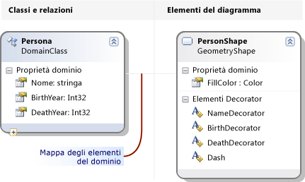
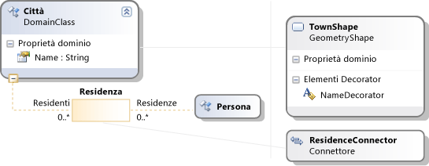

# <a name="getting-started-with-domain-specific-languages"></a>Introduzione ai linguaggi specifici del dominio
Questo argomento illustra i concetti di base per la definizione e utilizzo di un linguaggio specifico di dominio (DSL) creato con il SDK di modellazione per Visual Studio.  


[!INCLUDE[modeling_sdk_info](includes/modeling_sdk_info.md)]

  
 Se si ha familiarità con DSL, è consigliabile che il **Lab strumenti DSL**, che trova in questo sito: [Visualizaton e SDK di modellazione](http://go.microsoft.com/fwlink/?LinkID=186128)  
  
## <a name="what-can-you-do-with-a-domain-specific-language"></a>Cosa si può fare con un linguaggio specifico di dominio?  
 Un linguaggio specifico di dominio è una notazione, generalmente grafica, è progettata per essere utilizzata per uno scopo specifico. Al contrario, i linguaggi, ad esempio UML sono generici. In un linguaggio DSL, è possibile definire i tipi di elemento del modello e le relative relazioni e la modalità di presentazione sullo schermo.  
  
 Quando è stato progettato un linguaggio DSL, è possibile distribuire come parte di un pacchetto di Visual Studio Integration Extension (VSIX). Gli utenti di lavorare con DSL in [!INCLUDE[vsprvs](../code-quality/includes/vsprvs_md.md)]:  
  
   
  
 La notazione è solo una parte di un linguaggio DSL. Con la notazione, il pacchetto VSIX include strumenti che gli utenti possono applicare per modificare e generare il materiale dai relativi modelli.  
  
 Una delle principali applicazioni di DSL consiste nel generare codice programma, i file di configurazione e altri elementi. In particolare in progetti di grandi dimensioni e le linee di prodotti, in cui verranno create diverse varianti di un prodotto, la generazione di molti aspetti variabile da DSL può fornire un notevole aumento in Monitoraggio affidabilità e una risposta molto rapida alle modifiche dei requisiti.  
  
 Il resto di questa panoramica è una procedura dettagliata che presenta le operazioni di base di creazione e utilizzo di un linguaggio specifico di dominio in [!INCLUDE[vsprvs](../code-quality/includes/vsprvs_md.md)].  
  
## <a name="prerequisites"></a>Prerequisiti  
 Per definire un linguaggio specifico di dominio (Domain-Specific Language, DSL) devono essere installati i componenti seguenti:  
  
|||  
|-|-|  
|[!INCLUDE[vsprvs](../code-quality/includes/vsprvs_md.md)]|[http://go.microsoft.com/fwlink/?LinkID=185579](http://go.microsoft.com/fwlink/?LinkId=185579)|  
|[!INCLUDE[vssdk_current_short](../modeling/includes/vssdk_current_short_md.md)]|[http://go.microsoft.com/fwlink/?LinkId=185580](http://go.microsoft.com/fwlink/?LinkId=185580)|  
|SDK di modellazione per Visual Studio||  


[!INCLUDE[modeling_sdk_info](includes/modeling_sdk_info.md)]

  
## <a name="creating-a-dsl-solution"></a>Creazione di una soluzione DSL  
 Per creare un nuovo linguaggio specifico di dominio, creare un nuovo [!INCLUDE[vsprvs](../code-quality/includes/vsprvs_md.md)] soluzione usando il modello di progetto di linguaggio specifico di dominio.  
  
#### <a name="to-create-a-dsl-solution"></a>Per creare una soluzione DSL  
  
1.  Scegliere **Nuovo** dal menu **File**, quindi fare clic su **Progetto**.  
  
2.  In **tipi di progetto**, espandere il **altri tipi di progetto** nodo e fare clic su **estendibilità**.  
  
3.  Fare clic su **progettazione linguaggio specifico di dominio**.  
  
       
  
4.  Nel **nome** digitare **albero genealogico FamilyTree**. Fare clic su **OK**.  
  
     Il **Domain-Specific Language guidata** apre e visualizza un elenco di soluzioni per modello DSL.  
  
     Fare clic su ogni modello per visualizzare la descrizione,  
  
     I modelli sono utili punti di partenza. Ognuno di essi fornisce un completo DSL, è possibile modificare in base alle esigenze. In genere, si potrebbe scegliere il modello più vicino di ciò che si desidera creare.  
  
5.  Questa procedura dettagliata, è possibile scegliere di **Language minimo** modello.  
  
6.  Immettere un'estensione di file per il linguaggio DSL nella pagina appropriata della procedura guidata. Questa estensione verrà usata dai file contenenti le istanze del linguaggio DSL.  
  
    -   Scegliere un'estensione che non è associata a qualsiasi applicazione in computer o in qualsiasi computer in cui si desidera installare del linguaggio DSL. Ad esempio, **docx** e **htm** è le estensioni di nome file non valido.  
  
    -   La procedura guidata avviserà se l'estensione immessa è in uso come DSL. Provare a usare un'estensione di file diversa. È anche possibile reimpostare l'istanza sperimentale di Visual Studio SDK per eliminare le precedenti finestre di progettazione sperimentali. Fare clic su **avviare**, fare clic su **tutti i programmi**, **Microsoft Visual Studio 2010 SDK**, **strumenti**e quindi **reimpostare Microsoft Istanza di Visual Studio 2010 sperimentale**.  
  
7.  Controllare le altre pagine e quindi fare clic su **fine**.  
  
     Viene generata una soluzione che contiene due progetti. Linguaggio Dsl e DslPackage sono denominate. Un file di diagramma viene visualizzata DslDefinition.dsl denominata.  
  
    > [!NOTE]
    >  La maggior parte del codice che è possibile visualizzare nelle cartelle in due progetti viene generato da DslDefinition.dsl. Per questo motivo, la maggior parte di tale linguaggio DSL apportate in questo file.  
  
 L'interfaccia utente ora è simile a quella nell'immagine seguente.  
  
   
  
 Questa soluzione definisce un linguaggio specifico di dominio. Per ulteriori informazioni, vedere [panoramica dell'interfaccia utente di strumenti di linguaggio specifico di dominio](../modeling/overview-of-the-domain-specific-language-tools-user-interface.md).  
  
## <a name="the-important-parts-of-the-dsl-solution"></a>Le parti importanti della soluzione DSL  
 Notare i seguenti aspetti della nuova soluzione.  
  
-   **Dsl\DslDefinition.DSL** si tratta del file che sia visualizzato quando si crea una soluzione DSL. Quasi tutto il codice nella soluzione viene generato da questo file, e la maggior parte delle modifiche apportate a una definizione DSL vengono apportata qui. Per ulteriori informazioni, vedere Working with con il [funziona con il diagramma della definizione DSL](../modeling/working-with-the-dsl-definition-diagram.md).  
  
-   **Progetto DSL** questo progetto contiene codice che definisce il linguaggio specifico di dominio.  
  
-   **Progetto DslPackage** questo progetto contiene codice che consenta di istanze di DSL per essere aperti e modificati [!INCLUDE[vsprvs](../code-quality/includes/vsprvs_md.md)].  
  
##  <a name="Debugging"></a>Esecuzione del linguaggio DSL  
 È possibile eseguire la soluzione DSL, non appena è stato creato. In un secondo momento, è possibile modificare la definizione DSL, gradualmente, eseguire la soluzione dopo ogni modifica.  
  
#### <a name="to-experiment-with-the-dsl"></a>Per sperimentare del linguaggio DSL  
  
1.  Fare clic su **Trasforma tutti i modelli** nella barra degli strumenti Esplora soluzioni. La maggior parte del codice sorgente da DslDefinition.dsl verrà rigenerato.  
  
    > [!NOTE]
    >  Ogni volta che si modifica DslDefinition.dsl, è necessario fare clic su **Trasforma tutti i modelli** prima di ricompilare la soluzione. È possibile automatizzare questo passaggio. Per ulteriori informazioni, vedere [come automatizzare Trasforma tutti i modelli](http://msdn.microsoft.com/en-us/b63cfe20-fe5e-47cc-9506-59b29bca768a).  
  
2.  Premere F5 o scegliere il **Debug** menu, fare clic su **Avvia debug**.  
  
     DSL compila senza che sia installato nell'istanza sperimentale di [!INCLUDE[vsprvs](../code-quality/includes/vsprvs_md.md)].  
  
     Viene avviata un'istanza sperimentale di [!INCLUDE[vsprvs](../code-quality/includes/vsprvs_md.md)] . L'istanza sperimentale accetta le impostazioni da un sottoalbero distinto del Registro di sistema, in cui [!INCLUDE[vsprvs](../code-quality/includes/vsprvs_md.md)] estensioni registrate per scopi di debug. Le normale istanze di [!INCLUDE[vsprvs](../code-quality/includes/vsprvs_md.md)] non hanno accesso alle estensioni sono registrate.  
  
3.  Nell'istanza sperimentale di [!INCLUDE[vsprvs](../code-quality/includes/vsprvs_md.md)], aprire il file di modello denominato **Test** da **Esplora**.  
  
     \- oppure -  
  
     Fare clic sul progetto debug, scegliere **Aggiungi**, quindi fare clic su **elemento**. Nel **Aggiungi elemento** la finestra di dialogo, seleziona il tipo di file di tale linguaggio DSL.  
  
     Il file del modello viene aperto come un diagramma vuoto.  
  
     Casella degli strumenti viene visualizzato strumenti appropriati per il tipo di diagramma.  
  
4.  Utilizzare gli strumenti per creare forme e connettori nel diagramma.  
  
    1.  Per creare forme, trascinare lo strumento di esempio forma nel diagramma.  
  
    2.  Per connettere due forme, fare clic su strumento connettore di esempio, fare clic sulla prima e quindi fare clic sulla seconda forma.  
  
5.  Fare clic sulle etichette di forme di modificarle.  
  
 L'esperimento [!INCLUDE[vsprvs](../code-quality/includes/vsprvs_md.md)] sarà simile all'esempio seguente:  
  
   
  
### <a name="the-content-of-a-model"></a>Il contenuto di un modello  
 Il contenuto di un file che è un'istanza di un linguaggio DSL viene chiamato un *modello*. Il modello contiene *modello**elementi* e *collegamenti* tra gli elementi. La definizione DSL specifica i tipi di elementi del modello e i collegamenti possono esistere nel modello. Ad esempio, in un linguaggio DSL creato dal modello di lingua minimo, è un tipo di elemento del modello e un tipo di collegamento.  
  
 La definizione DSL è possibile specificare come il modello viene visualizzato in un diagramma. È possibile scegliere tra una varietà di stili di forme e connettori. È possibile specificare che alcune forme all'interno di altre forme.  
  
 È possibile visualizzare un modello come un albero di **Explorer** visualizzare durante la modifica di un modello. Quando si aggiungono forme nel diagramma, gli elementi del modello vengono visualizzati anche in Esplora risorse. Anche se è presente alcun diagramma, è possibile utilizzare Esplora risorse.  
  
 Se non è possibile visualizzare Esplora nell'istanza di debug di [!INCLUDE[vsprvs](../code-quality/includes/vsprvs_md.md)]via il **vista** dal menu **altre finestre**e quindi fare clic su  *\<di lingua >* **Esplora**.  
  
### <a name="the-api-of-your-dsl"></a>L'API di tale linguaggio DSL  
 Il modello DSL genera un'API che consente di leggere e aggiornare i modelli di istanze del linguaggio DSL. Un'applicazione dell'API consiste nel generare file di testo da un modello. Per ulteriori informazioni, vedere [generazione codice in fase di progettazione tramite modelli di testo T4](../modeling/design-time-code-generation-by-using-t4-text-templates.md).  
  
 Nella soluzione di debug, aprire i file di modello con estensione "tt". Questi esempi viene illustrato come generare testo da modelli e consentono di testare l'API di tale linguaggio DSL. Uno degli esempi è scritta in [!INCLUDE[vbprvb](../code-quality/includes/vbprvb_md.md)], l'altro in [!INCLUDE[csprcs](../data-tools/includes/csprcs_md.md)].  
  
 In ogni modello di file è il file generato. Espandere il file di modello in Esplora soluzioni e aprire il file generato.  
  
 Il file modello contiene un breve segmento di codice in cui sono elencati tutti gli elementi nel modello.  
  
 Il file generato contiene il risultato.  
  
 Quando si modifica un file di modello, si visualizzeranno le modifiche corrispondenti nei file generati dopo aver rigenerato i file.  
  
##### <a name="to-regenerate-text-files-after-you-change-the-model-file"></a>Per rigenerare i file di testo dopo aver modificato il file del modello  
  
1.  Nell'istanza sperimentale di [!INCLUDE[vsprvs](../code-quality/includes/vsprvs_md.md)], salvare il file di modello.  
  
2.  Assicurarsi che il parametro del nome file in ogni file con estensione tt fa riferimento al file di modello che si sta utilizzando per esperimenti. Salvare il file con estensione tt.  
  
3.  Fare clic su **Trasforma tutti i modelli** nella barra degli strumenti di **Esplora**.  
  
     \- oppure -  
  
     Fare doppio clic su modelli che si desidera rigenerare e quindi fare clic su **Esegui strumento personalizzato**.  
  
 È possibile aggiungere qualsiasi numero di file modello di testo a un progetto. Ogni modello genera un file di risultati.  
  
> [!NOTE]
>  Quando si modifica la definizione DSL, il codice di modello di testo di esempio non funzionerà, a meno che non venga aggiornata.  
  
 Per ulteriori informazioni, vedere [la generazione di codice da un linguaggio specifico di dominio](../modeling/generating-code-from-a-domain-specific-language.md) e [scrittura di codice per personalizzare un linguaggio specifico di dominio](../modeling/writing-code-to-customise-a-domain-specific-language.md).  
  
## <a name="customizing-the-dsl"></a>Personalizzazione del linguaggio DSL  
 Quando si desidera modificare la definizione DSL, chiudere l'istanza sperimentale e aggiornare la definizione principale [!INCLUDE[vsprvs](../code-quality/includes/vsprvs_md.md)] istanza.  
  
> [!NOTE]
>  Dopo avere modificato la definizione DSL, si potrebbero perdere le informazioni nei modelli di prova creato con le versioni precedenti.  Ad esempio, la soluzione di debug contiene un file denominato esempio, che contiene alcune forme e connettori. Dopo aver iniziato a sviluppare la definizione DSL, non saranno visibili e andranno persi quando si salva il file.  
  
 È possibile apportare un'ampia gamma di estensioni per il modello DSL. Negli esempi seguenti è possibile ottenere una visione delle possibilità.  
  
 Dopo ogni modifica, Salva la definizione DSL, fare clic su **Trasforma tutti i modelli** in **Esplora**, quindi premere **F5** per sperimentare DSL modificato.  
  
### <a name="rename-the-types-and-tools"></a>Rinominare i tipi e strumenti  
 Rinominare le classi di dominio esistenti e le relazioni. Ad esempio, a partire da una definizione Dsl creato dal modello di lingua minimo, è possibile eseguire le operazioni di ridenominazione seguenti, per rappresentare strutture ad albero della famiglia del linguaggio DSL.  
  
##### <a name="to-rename-domain-classes-relationships-and-tools"></a>Per rinominare gli strumenti, le relazioni e classi di dominio  
  
1.  Nel diagramma DslDefinition, rinominare **ExampleModel** a **FamilyTreeModel**, **ExampleElement** a **persona**,  **Destinazioni** a **padri**, e **origini** a **figli**. È possibile fare clic su ogni etichetta per modificarla.  
  
       
  
2.  Rinominare gli strumenti di elemento e connettore.  
  
    1.  Aprire la finestra Esplora DSL facendo clic sulla scheda in Esplora soluzioni. Se non è visualizzato, scegliere il **vista** dal menu **altre finestre** e quindi fare clic su **Esplora DSL**. Esplora DSL è visibile solo quando il diagramma della definizione DSL è la finestra attiva.  
  
    2.  Aprire la finestra proprietà e posizionarlo in modo che è possibile visualizzare Esplora DSL e proprietà nello stesso momento.  
  
    3.  In Esplora DSL espandere **Editor**, **schede della casella degli strumenti**,  *\<tale linguaggio DSL >*e quindi **strumenti**.  
  
    4.  Fare clic su **ExampleElement**. Si tratta dell'elemento della casella degli strumenti che è possibile creare gli elementi.  
  
    5.  Nella finestra Proprietà modificare il **nome** proprietà **persona**.  
  
         Si noti che il **didascalia** cambia anche proprietà.  
  
    6.  Allo stesso modo, modificare il nome del **ExampleConnector** strumento per **parentlink:**. Modificare il **didascalia** proprietà in modo che non è una copia della proprietà Name. Ad esempio, immettere **collegamento padre**.  
  
3.  Ricompilazione del linguaggio DSL.  
  
    1.  Salvare il file di definizione DSL.  
  
    2.  Fare clic su **Trasforma tutti i modelli** nella barra degli strumenti di Esplora soluzioni  
  
    3.  Premere F5. Attendere finché l'istanza sperimentale di [!INCLUDE[vsprvs](../code-quality/includes/vsprvs_md.md)] viene visualizzato.  
  
4.  Nella soluzione debug nell'istanza sperimentale di [!INCLUDE[vsprvs](../code-quality/includes/vsprvs_md.md)], aprire il file di un modello. Dalla casella degli strumenti, trascinare gli elementi su di esso. Si noti che le didascalie strumento e i nomi dei tipi in Esplora DSL sono stati modificati.  
  
5.  Salvare il file di modello.  
  
6.  Aprire un file con estensione tt e sostituire le occorrenze dei nomi di tipo e proprietà precedente con i nuovi nomi.  
  
7.  Assicurarsi che il nome del file specificato nel file con estensione tt consente di specificare il modello di test.  
  
8.  Salvare il file con estensione tt. Aprire il file generato per visualizzare il risultato dell'esecuzione del codice nel file con estensione tt. Verificare che sia corretto.  
  
### <a name="add-domain-properties-to-classes"></a>Aggiungere le proprietà del dominio a classi  
 Aggiungere proprietà a una classe di dominio, ad esempio rappresentare gli anni di nascita e morte di una persona.  
  
 Per rendere visibili le nuove proprietà del diagramma, è necessario aggiungere *gli elementi Decorator* alla forma che consente di visualizzare l'elemento del modello. È necessario anche mappare le proprietà per le espressioni Decorator.  
  
##### <a name="to-add-properties-and-display-them"></a>Per aggiungere proprietà e visualizzarli  
  
1.  Aggiungere le proprietà.  
  
    1.  Il diagramma della definizione DSL, destro la **persona** classe di dominio, scegliere **Aggiungi**e quindi fare clic su **proprietà dominio**.  
  
    2.  Digitare un elenco di nuovi nomi di proprietà, ad esempio **nascita** e **morte**. Premere **invio** dopo ciascuna di esse.  
  
2.  Aggiungere gli elementi Decorator che consente di visualizzare le proprietà della forma.  
  
    1.  Seguire la linea grigia compreso tra la classe di dominio della persona a altro lato del diagramma. Si tratta di una mappa di elemento diagramma. La classe di dominio Collega a una classe di forma.  
  
    2.  Fare doppio clic su questa classe di forma, scegliere **Aggiungi**, quindi fare clic su **Decorator testo**.  
  
    3.  Aggiungere due elementi Decorator con nomi quali **BirthDecorator** e **DeathDecorator**.  
  
    4.  Selezionare ogni elemento decorator del nuovo, quindi nella finestra Proprietà impostare il **posizione** campo. Questo determina dove verrà visualizzato il valore della proprietà dominio sulla forma. Ad esempio, impostare **InnerBottomLeft** e **InnerBottomRight**.  
  
           
  
3.  Eseguire il mapping di elementi Decorator alle proprietà.  
  
    1.  Aprire la finestra Dettagli DSL. È in genere in una scheda accanto alla finestra di Output. Se non è visualizzato, scegliere il **vista** dal menu **altre finestre**, quindi fare clic su **dettagli DSL**.  
  
    2.  Il diagramma di definizione DSL, fare clic sulla riga che si connette il **persona** classe di dominio per la classe della forma.  
  
    3.  In **dettagli DSL**via di **Decorator mappe** , selezionare la casella di controllo in un elemento decorator del non mappata. In **proprietà visualizzato**, selezionare la proprietà di dominio che si desidera che il mapping. Ad esempio, eseguire il mapping di **BirthDecorator** a **nascita**.  
  
4.  Salvataggio del linguaggio DSL, fare clic su Trasforma tutti i modelli e premere F5.  
  
5.  Verificare che ora è possibile scegliere le posizioni in cui che si è scelto e digitare i valori al loro in un diagramma del modello di esempio. Inoltre, quando si seleziona un **persona** forma, la finestra proprietà vengono visualizzate le nuove proprietà di nascita e anche fatali.  
  
6.  In un file con estensione TT, è possibile aggiungere il codice che ottiene le proprietà di ogni persona.  
  
   
  
### <a name="define-new-classes"></a>Definire nuove classi  
 È possibile aggiungere relazioni e le classi di dominio a un modello. Ad esempio, è possibile creare una nuova classe per rappresentare città e una nuova relazione per rappresentare che una persona lunga in una città.  
  
 Per rendere i diversi tipi distinti in un diagramma del modello, è possibile mappare le classi di dominio per diversi tipi di forma o alle forme con colori e geometria diversa.  
  
##### <a name="to-add-and-display-a-new-domain-class"></a>Per aggiungere e visualizzare una nuova classe di dominio  
  
1.  Aggiungere una classe di dominio e renderlo un elemento figlio della radice del modello.  
  
    1.  Il diagramma della definizione DSL, fare clic sul **relazione di incorporamento** strumento, fare clic sulla classe radice **FamilyTreeModel**, quindi fare clic su una parte vuota del diagramma.  
  
         Una nuova classe di dominio viene visualizzato, che è connesso il FamilyTreeModel con una relazione di incorporamento.  
  
         Impostare il relativo nome, ad esempio **Città**.  
  
        > [!NOTE]
        >  Ogni classe di dominio, ad eccezione della radice del modello deve essere la destinazione di almeno una relazione di incorporamento, o deve ereditare da una classe che rappresenta la destinazione di un tipo di incorporamento. Per questo motivo, è spesso opportuno creare una classe di dominio utilizzando lo strumento di relazione di incorporamento.  
  
    2.  Aggiungere una proprietà di dominio per la nuova classe, ad esempio **nome**.  
  
2.  Aggiungere una relazione di riferimento tra utente e città.  
  
    1.  Fare clic su di **relazione di riferimento** strumento, fare clic su utente e quindi fare clic su città.  
  
           
  
        > [!NOTE]
        >  Relazioni di riferimento rappresentano i riferimenti incrociati da una parte dell'albero del modello a un altro.  
  
3.  Aggiungere una forma per rappresentare città in diagrammi di modello.  
  
    1.  Trascinare un **forma di geometria** dalla casella degli strumenti nel diagramma e rinominarlo, ad esempio **TownShape**.  
  
    2.  Nella finestra Proprietà, impostare i campi di aspetto della nuova forma, ad esempio colore riempimento e di geometria.  
  
    3.  Aggiungere un elemento Decorator per visualizzare il nome della città e rinominarlo NameDecorator. Impostare la proprietà Position.  
  
4.  Eseguire il mapping di TownShape la classe di dominio di città.  
  
    1.  Fare clic su di **diagramma elemento mappa** strumento, quindi scegliere la classe di dominio di città e la classe di forma TownShape.  
  
    2.  Nel **Decorator mappe** scheda della finestra il **dettagli DSL** finestra con il connettore della mappa selezionato, controllare NameDecorator e impostare **proprietà visualizzato** al nome.  
  
5.  Creare un connettore per visualizzare la relazione tra utente e città.  
  
    1.  Trascinare un connettore dalla casella degli strumenti nel diagramma. Rinominare il file e impostarne le proprietà di aspetto.  
  
    2.  Utilizzare il **diagramma elemento mappa** strumento per collegare il nuovo connettore per la relazione tra utente e città.  
  
           
  
6.  Creare uno strumento dell'elemento per l'esecuzione di una città di nuovo.  
  
    1.  In **Esplora DSL**, espandere **Editor** quindi **schede della casella degli strumenti**.  
  
    2.  Fare doppio clic su  *\<tale linguaggio DSL >* e quindi fare clic su **Aggiungi nuovo elemento strumento**.  
  
    3.  Impostare il **nome** proprietà del nuovo strumento e impostarne il **classe** proprietà città.  
  
    4.  Impostare il **icona casella degli strumenti** proprietà. Fare clic su **[…]**  e il **nome File** selezionare un file di icona.  
  
7.  Creare uno strumento connettore per l'esecuzione di un collegamento tra città e utenti.  
  
    1.  Fare doppio clic su  *\<tale linguaggio DSL >* e quindi fare clic su **aggiungere nuovo strumento connettore**.  
  
    2.  Impostare la proprietà Name del nuovo strumento.  
  
    3.  Nel **ConnectionBuilder** proprietà, selezionare il generatore che contiene il nome della relazione città di persona.  
  
    4.  Impostare il **icona casella degli strumenti**.  
  
8.  Salvare la definizione DSL, fare clic su **Trasforma tutti i modelli**, quindi premere **F5**.  
  
9. Nell'istanza sperimentale di [!INCLUDE[vsprvs](../code-quality/includes/vsprvs_md.md)], aprire il file di un modello. Utilizzare i nuovi strumenti per creare collegamenti tra città e le città. Si noti che è possibile creare solo i collegamenti tra i tipi di elemento corretti.  
  
10. Creare codice che elenca la città in cui vive ogni persona. Modelli di testo sono una delle posizioni in cui è possibile eseguire tale codice. Ad esempio, è possibile modificare il file Sample.tt esistente nella soluzione di debug in modo che contenga il codice seguente:  
  
    ```  
    <#@ template inherits="Microsoft.VisualStudio.TextTemplating.VSHost.ModelingTextTransformation" debug="true" #>  
    <#@ output extension=".txt" #>  
    <#@ FamilyTree processor="FamilyTreeDirectiveProcessor" requires="fileName='Sample.ftree'" #>  
  
    <#  
      foreach (Person person in this.FamilyTreeModel.People)  
      {  
    #>  
        <#= person.Name #><#if (person.Town != null) {#> of <#= person.Town.Name #> <#}#>  
  
    <#  
          foreach (Person child in person.Children)  
      {  
    #>  
                <#= child.Name #>  
    <#  
      }  
      }  
    #>  
  
    ```  
  
     Quando si salva il file *.tt, creerà un file secondario che contiene l'elenco di persone e i relativi residenze. Per ulteriori informazioni, vedere [la generazione di codice da un linguaggio specifico di dominio](../modeling/generating-code-from-a-domain-specific-language.md).  
  
## <a name="validation-and-commands"></a>Convalida e i comandi  
 È possibile sviluppare ulteriormente questo DSL mediante l'aggiunta di vincoli di convalida. Questi vincoli sono metodi che è possibile definire, assicurarsi che il modello è in uno stato corretto. Ad esempio, è possibile definire un vincolo per assicurarsi che la data di nascita di un elemento figlio è successiva a quella dei relativi elementi padre. La funzionalità di convalida viene visualizzato un avviso se l'utente DSL tenta di salvare un modello che causa l'interruzione di uno qualsiasi dei vincoli. Per ulteriori informazioni, vedere [convalida in un linguaggio specifico di dominio](../modeling/validation-in-a-domain-specific-language.md).  
  
 È inoltre possibile definire i comandi di menu che l'utente può richiamare. I comandi è possono modificare il modello. Possono anche interagire con altri modelli di [!INCLUDE[vsprvs](../code-quality/includes/vsprvs_md.md)] e con le risorse esterne. Per ulteriori informazioni, vedere [procedura: modificare un comando di Menu Standard](../modeling/how-to-modify-a-standard-menu-command-in-a-domain-specific-language.md).  
  
## <a name="deploying-the-dsl"></a>Distribuzione del linguaggio DSL  
 Per consentire ad altri utenti di utilizzare il linguaggio specifico di dominio, si distribuisce un [!INCLUDE[vsprvs](../code-quality/includes/vsprvs_md.md)] file Extension (VSIX). Questo viene creato quando si compila la soluzione DSL.  
  
 Individuare il file. VSIX nella cartella bin della soluzione. Copiarlo nel computer in cui si desidera installarlo. In tale computer, fare doppio clic sul file VSIX. DSL può essere usata in tutte le istanze di [!INCLUDE[vsprvs](../code-quality/includes/vsprvs_md.md)] in tale computer.  
  
 È possibile utilizzare la stessa procedura per installare DSL nel proprio computer, in modo che non è necessario utilizzare l'istanza sperimentale di [!INCLUDE[vsprvs](../code-quality/includes/vsprvs_md.md)].  
  
 Per ulteriori informazioni, vedere [soluzioni per la distribuzione di un linguaggio specifico di dominio](../modeling/deploying-domain-specific-language-solutions.md).  
  
##  <a name="Reset"></a>Rimozione di vecchi DSL sperimentale  
 Se è stato creato sperimentale DSL che si desidera, è possibile rimuoverli dal computer reimpostando il [!INCLUDE[vsprvs](../code-quality/includes/vsprvs_md.md)] istanza sperimentale.  
  
 Verranno rimossi dal computer tutte DSL sperimentale e altri sperimentale [!INCLUDE[vsprvs](../code-quality/includes/vsprvs_md.md)] estensioni. Si tratta di estensioni che sono state eseguite in modalità di debug.  
  
 Questa procedura non rimuove DSL o altra [!INCLUDE[vsprvs](../code-quality/includes/vsprvs_md.md)] estensioni che è stato completamente installate eseguendo il file VSIX.  
  
#### <a name="to-reset-the-visual-studio-experimental-instance"></a>Per reimpostare l'istanza sperimentale di Visual Studio  
  
1.  Fare clic su **avviare**, fare clic su **tutti i programmi**, **Microsoft Visual Studio 2010 SDK**, **strumenti**e quindi **reimpostare Microsoft Istanza di Visual Studio 2010 sperimentale**.  
  
2.  Ricompilare qualsiasi DSL sperimentale o altri sperimentale [!INCLUDE[vsprvs](../code-quality/includes/vsprvs_md.md)] estensioni che si desidera utilizzare.  
  
## <a name="see-also"></a>Vedere anche  
 [Informazioni su modelli, classi e relazioni](../modeling/understanding-models-classes-and-relationships.md)   
 [Come definire un linguaggio specifico di dominio](../modeling/how-to-define-a-domain-specific-language.md)   

[!INCLUDE[modeling_sdk_info](includes/modeling_sdk_info.md)]

