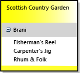

# Procedura: definire un linguaggio specifico di dominio
Per definire un linguaggio specifico di dominio (DSL), si crea una soluzione [!INCLUDE[vsprvs](../code-quality/includes/vsprvs_md.md)] da un modello. La parte più importante della soluzione è il diagramma della definizione DSL, archiviato in DslDefinition.dsl. La definizione DSL definisce le classi e le forme del linguaggio DSL. Dopo la modifica e l'aggiunta a questi elementi, è possibile aggiungere il codice programma per personalizzare il linguaggio DSL in modo più dettagliato.  
  
 Se si ha familiarità con linguaggi specifici di dominio, è consigliabile che il **Lab strumenti DSL**, che è possibile trovare in questo sito: [SDK di visualizzazione e modellazione](http://go.microsoft.com/fwlink/?LinkID=186128)  

[!INCLUDE[modeling_sdk_info](includes/modeling_sdk_info.md)]

  
##  Selezione di una soluzione di modello  
 Per definire un linguaggio specifico di dominio (Domain-Specific Language, DSL) devono essere installati i componenti seguenti:  
  
|||  
|-|-|  
|[!INCLUDE[vsprvs](../code-quality/includes/vsprvs_md.md)]|[http://go.microsoft.com/fwlink/?LinkID=185579](http://go.microsoft.com/fwlink/?LinkId=185579)|  
|[!INCLUDE[vssdk_current_short](../modeling/includes/vssdk_current_short_md.md)]|[http://go.microsoft.com/fwlink/?LinkId=185580](http://go.microsoft.com/fwlink/?LinkId=185580)|  
|SDK di visualizzazione e modellazione di Visual Studio||  

[!INCLUDE[modeling_sdk_info](includes/modeling_sdk_info.md)]

  
 Per creare un nuovo linguaggio specifico di dominio, si crea una nuova soluzione [!INCLUDE[vsprvs](../code-quality/includes/vsprvs_md.md)] con il modello di progetto Linguaggio specifico di dominio.  
  
#### Per creare una soluzione DSL  
  
1.  Creare una soluzione con il **linguaggio specifico di dominio** modello, che può trovarsi in **altri tipi di progetto/Extensibility** nel **nuovo progetto** la finestra di dialogo.  
  
       
  
     Quando fa clic su **OK**, **procedura guidata di linguaggio specifico di dominio** apre e visualizza un elenco di soluzioni di modello DSL.  
  
2.  Fare clic su ogni modello per visualizzare una descrizione. Scegliere la soluzione più simile a quella che si vuole creare.  
  
     Ogni modello DSL definisce un linguaggio DSL di lavoro di base. Sarà possibile modificare questo linguaggio DSL per adattarlo ai propri requisiti.  
  
     Per altre informazioni, fare clic su ogni esempio.  
  
    -   Selezionare **flusso attività** per creare un linguaggio DSL con corsie. Le corsie sono partizioni verticali o orizzontali del diagramma.  
  
    -   Selezionare **modelli componente** per creare un linguaggio DSL con porte. Le porte sono piccole forme sul bordo di una forma più grande.  
  
    -   Selezionare **diagrammi classi** per definire un linguaggio DSL con forme raggruppamento. Le forme raggruppamento contengono elenchi di elementi.  
  
    -   Selezionare **linguaggio minimo** in altri casi, o se non si è sicuri.  
  
    -   Selezionare **Progettazione Windows Form minimo** o **WPF Designer minimo** per creare un linguaggio DSL visualizzato su una superficie Windows Form o WPF. Sarà necessario scrivere il codice per definire l'editor. Per altre informazioni, vedere i seguenti argomenti:  
  
         [Creazione di un linguaggio specifico di dominio basato su Windows Form](../modeling/creating-a-windows-forms-based-domain-specific-language.md)  
  
         [Creazione di un linguaggio specifico di dominio basato su WPF](../modeling/creating-a-wpf-based-domain-specific-language.md)  
  
3.  Immettere un'estensione di file per il linguaggio DSL nella pagina appropriata della procedura guidata. Questa estensione verrà usata dai file contenenti le istanze del linguaggio DSL.  
  
    -   Scegliere un'estensione di file non associata ad alcuna applicazione in questo computer o in un computer in cui si vuole installare il linguaggio DSL. Ad esempio, **docx** e **htm** è le estensioni di nome file inaccettabili.  
  
    -   La procedura guidata avviserà se l'estensione immessa è in uso come DSL. Provare a usare un'estensione di file diversa. È anche possibile reimpostare l'istanza sperimentale di Visual Studio SDK per eliminare le precedenti finestre di progettazione sperimentali. Fare clic su **avviare**, fare clic su **tutti i programmi**, **Microsoft Visual Studio 2010 SDK**, **strumenti**e quindi **reimpostare l'istanza di Microsoft Visual Studio 2010 sperimentale**.  
  
4.  È possibile modificare le impostazioni nelle altre pagine o lasciare i valori predefiniti.  
  
5.  Scegliere **Fine**.  
  
     La procedura guidata crea una soluzione contenente due o tre progetti e genera il codice dalla definizione DSL.  
  
 L'interfaccia utente ora è simile a quella nell'immagine seguente.  
  
   
  
 Questa soluzione definisce un linguaggio specifico di dominio. Per ulteriori informazioni, vedere [panoramica dell'interfaccia utente di strumenti di linguaggio specifico di dominio](../modeling/overview-of-the-domain-specific-language-tools-user-interface.md).  
  
### Testare la soluzione  
 La soluzione per il modello offre un linguaggio DSL di lavoro, che è possibile modificare o usare così com'è.  
  
 Per testare la soluzione, premere F5 o CTRL+F5. Una nuova istanza di [!INCLUDE[vsprvs](../code-quality/includes/vsprvs_md.md)] si apre in modalità sperimentale.  
  
 Nella nuova istanza di [!INCLUDE[vsprvs](../code-quality/includes/vsprvs_md.md)], in Esplora soluzioni aprire il file di esempio. Si apre un diagramma, con una casella degli strumenti.  
  
 Se si esegue una soluzione che è stato creato dal **linguaggio minimo** modello, sperimentale [!INCLUDE[vsprvs](../code-quality/includes/vsprvs_md.md)] sarà simile all'esempio seguente:  
  
   
  
 Sperimentare con gli strumenti. Creare elementi e connetterli.  
  
 Chiudere l'istanza sperimentale di [!INCLUDE[vsprvs](../code-quality/includes/vsprvs_md.md)].  
  
> [!NOTE]
>  Dopo aver modificato il linguaggio DSL, non sarà più possibile visualizzare le forme nel file di test di esempio. Sarà tuttavia possibile creare nuovi elementi.  
  
### Modifica del linguaggio DSL del modello  
 Rinominare e mantenere alcune o tutte le classi di dominio e le classi di forma nella definizione DSL del modello. I nuovi nomi delle classi devono essere nomi CLR validi, senza spazi o segni di punteggiatura.  
  
 È utile mantenere queste classi in particolare:  
  
-   La classe radice appare in alto a sinistra del diagramma di definizione DSL, sotto **classi e relazioni**. Rinominarla con un nome diverso dal linguaggio DSL. Ad esempio, un linguaggio DSL denominato **MusicLibrary** potrebbe essere una classe radice denominata **musica**.  
  
-   La classe diagramma appare in basso a destra del diagramma di definizione DSL, nel **elementi del diagramma** colonna. Per visualizzarla, potrebbe essere necessario scorrere verso destra. In genere è denominato *Dslutente***diagramma**.  
  
-   Se è stata utilizzata la **flusso attività** modello e si desidera creare diagrammi con corsie, mantenere e rinominare la classe di dominio Actor e la forma ActorSwimlane.  
  
 Eliminare o rinominare le altre classi in base ai propri requisiti.  
  
##  Criteri per la definizione DSL  
 È consigliabile sviluppare un linguaggio DSL aggiungendo o modificando una o due funzionalità per volta. Aggiungere una funzionalità, eseguire il linguaggio DSL e testarlo e quindi aggiungere ancora una o due funzionalità. Una funzionalità tipica del linguaggio DSL potrebbe essere:  
  
-   Una classe di dominio, la relazione di incorporamento che connette l'elemento al modello, la forma necessaria per visualizzare gli elementi della classe nel diagramma e lo strumento elemento che consente agli utenti di creare elementi.  
  
-   Le proprietà del dominio di una classe di dominio e gli elementi Decorator che le visualizzano in una forma.  
  
-   Una relazione di riferimento e il connettere che la visualizza nel diagramma e lo strumento connettore che consente agli utenti di creare collegamenti.  
  
-   Una personalizzazione che richiede il codice programma, ad esempio un vincolo di convalida o un comando di menu.  
  
 Le sezioni seguenti descrivono come costruire i tipi più utili di funzionalità DSL. Un linguaggio DSL può essere costruito con molti altri criteri, ma questi sono quelli usati più di frequente.  
  
> [!NOTE]
>  Dopo aver aggiunto una funzionalità, non dimenticare di fare clic su **Trasforma tutti i modelli** sulla barra degli strumenti di Esplora soluzioni prima di compilare ed eseguire il linguaggio DSL.  
  
 La figura seguente mostra la parte relativa a classi e relazioni del linguaggio DSL usato come esempio in questo argomento.  
  
   
  
 La figura successiva è un modello di esempio di questo DSL:  
  
   
  
> [!NOTE]
>  "Modello" si riferisce a un'istanza del linguaggio DSL creata dagli utenti e in genere viene visualizzato come diagramma. Questo argomento descrive sia il diagramma di definizione DSL che i diagrammi del modello visualizzati quando viene usato il linguaggio DSL.  
  
##  Definizione delle classi di dominio  
 Le classi di dominio rappresentano i concetti del linguaggio DSL. Le istanze sono *elementi del modello*. Ad esempio in un **MusicLibrary** DSL potrebbe essere classi di dominio denominato **Album** e **brano**.  
  
 Per creare una classe di dominio, è possibile trascinare il **classe di dominio denominata** strumento al diagramma e quindi rinominare la classe.  
  
 Per ulteriori informazioni, vedere [le proprietà delle classi di dominio](../modeling/properties-of-domain-classes.md).  
  
### Creare una relazione di incorporamento per ogni classe di dominio  
 Ogni classe di dominio, tranne la classe radice, deve essere la destinazione di almeno una relazione di incorporamento o ereditare da una classe che sia la destinazione di una relazione di incorporamento.  
  
 In un modello, ogni elemento del modello è un nodo in un singolo albero di relazioni di incorporamento. L'origine e la destinazione di una relazione di incorporamento sono spesso definite come padre e figlio.  
  
 La selezione di un padre per una classe di dominio dipende da come si vuole far dipendere la durata degli elementi da altri elementi. Se un nodo di un albero viene eliminato, in genere viene eliminato anche il sottoalbero. Le classi indipendenti dell'elemento vengono quindi incorporate direttamente sotto la classe radice.  
  
 In genere, se si visualizza un elemento in un altro elemento, si vuole indicare una relazione con il proprietario. In questo caso, la classe padre più appropriata è la classe del contenitore. Si verifica un'eccezione quando l'elemento visualizzato in un contenitore è effettivamente solo un collegamento di riferimento a un elemento indipendente. In questo caso, eliminando il contenitore si elimina il riferimento, ma non la destinazione.  
  
 Nei criteri della definizione DSL descritti in questo argomento, si suppone che gli elementi visualizzati in un contenitore verranno eliminati quando verrà eliminato il contenitore. È possibile implementare schemi più complessi definendo le regole.  
  
|Come viene visualizzato l'elemento|Classe padre (di incorporamento)|Esempio nel modello di soluzione DSL|  
|------------------------------|--------------------------------|--------------------------------------|  
|Forma in un diagramma.   Corsia.|Classe radice di DSL.|Linguaggio minimo.   Flusso attività: classe Actor.|  
|Forma in una corsia.|Classe di dominio di elementi visualizzati come corsie.|Flusso attività: classe Task.|  
|Elemento in un elenco in una forma, dove l'elemento viene eliminato se viene eliminato il contenitore.   Porta sul bordo di una forma.|Classe di dominio mappata alla forma contenitore.|Diagramma classi: classe Attribute.   Diagramma componenti: classe Port.|  
|Elemento in un elenco, non eliminato se viene eliminato il contenitore.|Classe radice di DSL.   L'elenco visualizza i collegamenti di riferimento.||  
|Non visualizzato direttamente.|La classe di cui costituisce una parte.||  
  
 Nell'esempio della raccolta musicale, gli album sono visualizzati come rettangoli in cui sono elencati i titoli dei brani. Il padre di Album quindi è la classe radice Musica e il padre di Brano è Album.  
  
 Per creare una classe di dominio e il relativo incorporamento nello stesso momento, scegliere il **relazione di incorporamento** strumento, quindi fare clic sulla classe padre e quindi fare clic su una parte vuota del diagramma.  
  
 In genere non è necessario modificare il nome della relazione di incorporamento e dei ruoli perché terranno traccia automaticamente dei nomi delle classi.  
  
 Per ulteriori informazioni, vedere [le proprietà delle relazioni di dominio](../modeling/properties-of-domain-relationships.md) e [le proprietà dei ruoli di dominio](../modeling/properties-of-domain-roles.md).  
  
> [!NOTE]
>  L'incorporamento è diverso dall'ereditarietà. I figli in una relazione di incorporamento non ereditano le funzionalità dai padri.  
  
### Aggiungere le proprietà di dominio a ogni classe di dominio  
 Nelle proprietà di dominio vengono archiviati i valori. Esempi: Nome, Titolo, Data di pubblicazione.  
  
 Fare clic su **proprietà dominio** nella classe, premere il tasto INVIO e quindi digitare il nome di una proprietà. Il tipo predefinito di una proprietà di dominio è String. Se si desidera modificare il tipo, selezionare la proprietà di dominio e impostare il **tipo** nel **proprietà** finestra. Se il tipo desiderato non è presente nell'elenco a discesa, vedere [aggiunta di tipi di proprietà](#addTypes).  
  
 **Impostare una proprietà nome dell'elemento.** Selezionare una proprietà di dominio che può essere utilizzata per identificare gli elementi nella finestra di esplorazione linguaggio. Ad esempio, nella classe di dominio Brano è possibile selezionare la proprietà di dominio Titolo. Nel **proprietà** finestra impostare **è nome elemento** a `true`.  
  
### Creare classi di dominio derivate  
 Per fare in modo che una classe di dominio abbia varianti che ne ereditano le proprietà e le relazioni, creare classi derivanti da essa. Ad esempio, Album potrebbe avere le classi derivate WMA e MP3.  
  
 Creare la classe derivata utilizzando il **classe dominio** strumento.  
  
 Fare clic su di **ereditarietà** strumento, fare clic sulla classe derivata e quindi fare clic su classe di base.  
  
 Impostare il **modificatore ereditarietà** della classe di base per **astratta**. Se si prevede che potrebbero essere necessarie istanze della classe di base, considerare invece la possibilità di creare una classe derivata separata.  
  
 Le classi derivate ereditano le proprietà e i ruoli delle classi di base.  
  
### Ordinare il diagramma di definizione DSL  
 Quando si aggiungono le relazioni, alcune classi appariranno in più posti. Per ridurre il numero di occorrenze e ingrandire il diagramma, fare doppio clic su classe di destinazione di una relazione e quindi fare clic su **Bring Tree Here**. Per l'effetto opposto, fare doppio clic su classe di destinazione di una relazione e scegliere **Split Tree**. Se questi comandi di menu non sono visibili, assicurarsi che sia selezionata solo la classe di dominio.  
  
 Usare CTRL+freccia SU e CTRL+freccia GIÙ per spostare le classi di dominio e le classi di forma.  
  
### Testare le classi di dominio  
  
##### Per testare le nuove classi di dominio  
  
1.  **Fare clic su Trasforma tutti i modelli** sulla barra degli strumenti di Esplora soluzioni, per generare il codice della finestra di progettazione DSL. È possibile automatizzare questo passaggio. Per ulteriori informazioni, vedere [come automatizzare Trasforma tutti i modelli](http://msdn.microsoft.com/en-us/b63cfe20-fe5e-47cc-9506-59b29bca768a).  
  
2.  **Compilare ed eseguire il linguaggio DSL.** Premere F5 o CTRL + F5 per eseguire una nuova istanza della [!INCLUDE[vsprvs](../code-quality/includes/vsprvs_md.md)] in modalità sperimentale. Nell'istanza sperimentale di [!INCLUDE[vsprvs](../code-quality/includes/vsprvs_md.md)] aprire o creare un file con l'estensione di file del linguaggio DSL.  
  
3.  **Aprire Esplora risorse.** Alla parte del diagramma è la finestra di Esplora linguaggio in cui in genere denominata *Linguaggioutente* Explorer. Se questa finestra non è visibile, potrebbe essere in una scheda sotto Esplora soluzioni. Se non riesci a trovarla, nel **visualizzazione** dal menu **altre finestre**, quindi fare clic su *Linguaggioutente***Explorer**.  
  
     La finestra di esplorazione contiene una visualizzazione struttura ad albero del modello.  
  
4.  **Creare nuovi elementi.** Pulsante destro del mouse sul nodo radice nella parte superiore e quindi fare clic su **Aggiungi nuovo***ClasseUtente*.  
  
     Una nuova istanza della classe appare nella finestra di esplorazione linguaggio.  
  
5.  Quando si creano nuove istanze, verificare che ogni istanza abbia un nome diverso. Ciò si verifica solo se è stata impostata la **è nome elemento** flag su una proprietà di dominio.  
  
6.  **Esaminare le proprietà di dominio. Con un'istanza della classe selezionata,** controllare la finestra Proprietà. Deve mostrare le proprietà di dominio definite in questa classe di dominio.  
  
7.  **Salvare il file, chiuderlo e riaprirlo**. Tutte le istanze create devono essere visibili nella finestra di esplorazione, dopo aver espanso i nodi.  
  
##  Definizione di forme nel diagramma  
 È possibile definire classi di elementi visualizzati in un diagramma come rettangoli, ellissi o icone.  
  
#### Per definire una classe di elementi visualizzati come forme in un diagramma  
  
1.  **Definire e testare una classe di dominio come descritto in**[definizione di classi di dominio](#classes) **.  **  
  
    -   Il padre della classe deve essere la classe radice, ovvero deve esserci una relazione di incorporamento tra la classe radice e la nuova classe di dominio.  
  
    -   Se il diagramma ha le corsie, il padre può essere la classe di dominio mappata a una corsia. Prima di continuare con questa procedura, vedere [la definizione di un linguaggio DSL con corsie](#swimlanes).  
  
2.  **Aggiungere una classe di forma** per rappresentare gli elementi nel diagramma modello. Trascinare da uno degli strumenti seguenti al diagramma di definizione DSL:  
  
    -   **Forma geometrica** fornisce un rectangle o ellipse.  
  
    -   **Forma immagine** Visualizza un'immagine che fornisce.  
  
    -   **Forma raggruppamento** è un rettangolo che contiene uno o più elenchi di elementi.  
  
     Rinominare le classi forma, che appariranno sul lato destro del diagramma di definizione DSL, sotto le forme e i connettori.  
  
3.  **Definire un'immagine, se è stata creata una forma immagine**.  
  
    1.  Creare un file di immagine di qualsiasi dimensione. Sono supportati i formati BMP, JPEG, GIF ed EMF.  
  
    2.  In Esplora soluzioni aggiungere il file alla soluzione in Dsl\Resources.  
  
    3.  Tornare al diagramma di definizione DSL e selezionare la nuova classe di forma dell'immagine.  
  
    4.  Nella finestra Proprietà fare clic su di **immagine** proprietà.  
  
    5.  Nel **Seleziona immagine** finestra di dialogo, fare clic sulla casella a discesa sotto **nome File**, selezionare l'immagine.  
  
4.  **Aggiungere elementi Decorator testo alla forma, per visualizzare le proprietà di dominio.**  
  
     Per visualizzare il nome o il titolo dell'elemento modello, sarà probabilmente necessario almeno un elemento Decorator per il testo.  
  
     Fare clic sull'intestazione della classe di forma, scegliere **Aggiungi**, quindi fare clic su **elemento Decorator testo**. Impostare il nome dell'elemento decorator e nella finestra Proprietà impostare il relativo **posizione**.  
  
5.  **Connettere ogni forma con una mappa degli elementi del diagramma alla classe di dominio che dovrebbe includere**.  
  
     Fare clic su di **mappa elementi diagramma** strumento, quindi scegliere la classe di dominio, quindi la classe shape.  
  
6.  **Eseguire il mapping delle proprietà per gli elementi Decorator testo.**  
  
    1.  Selezionare la linea grigia tra la classe di dominio e la classe di forma che rappresenta la mappa degli elementi del diagramma.  
  
    2.  Nel **dettagli DSL** finestra, fare clic su di **mappe elementi Decorator** scheda. Se non viene visualizzato il **dettagli DSL** finestra via il **visualizzazione** dal menu **altre finestre** e quindi fare clic su **dettagli DSL**. Spesso è necessario alzare la parte superiore di questa finestra per visualizzarne tutto il contenuto.  
  
    3.  Selezionare il nome di un elemento Decorator. In **visualizzare proprietà**, selezionare il nome di una proprietà della classe di dominio. Ripetere questa operazione per ogni elemento Decorator.  
  
         Se si desidera visualizzare una proprietà di un elemento correlato, fare clic su Navigatore struttura di menu a discesa sotto **percorso proprietà di visualizzazione**.  
  
    4.  Verificare che accanto al nome di ogni elemento Decorator appaia un segno di spunta.  
  
       
  
7.  **Impostare un elemento della casella degli strumenti per la creazione di elementi della classe di dominio.**  
  
    1.  In **Esplora DSL**, espandere il **Editor** nodo e tutti i sottonodi.  
  
    2.  Pulsante destro del mouse sotto il nodo **schede** che ha lo stesso nome del linguaggio DSL, ad esempio MusicLibrary. Fare clic su **Aggiungi strumento elemento**.  
  
        > [!NOTE]
        >  Se facendo clic su di **strumenti** nodo, non sarà visualizzato **Aggiungi strumento elemento**. Invece, fare clic sul nodo sopra.  
  
    3.  Nella finestra proprietà con il nuovo strumento elemento selezionato, impostare **classe** alla classe di dominio aggiunto di recente.  
  
    4.  Impostare **didascalia** e **Tooltip**.  
  
    5.  Impostare **icona casella degli strumenti** per un'icona che verrà visualizzato nella casella degli strumenti. È possibile impostarla su una nuova icona o su un'icona già usata per un altro strumento.  
  
         Per creare una nuova icona, aprire Dsl\Resources in **Esplora**. Copiare e incollare uno dei file BMP esistenti dello strumento elemento. Rinominare la copia incollata e quindi fare doppio clic per modificarla.  
  
         Tornare al diagramma di definizione DSL, selezionare lo strumento e nella finestra Proprietà fare clic su **[...] ** in **icona casella degli strumenti**. Nel **seleziona Bitmap** la finestra di dialogo, selezionare il. File con estensione BMP dal menu a discesa.  
  
 Per ulteriori informazioni, vedere [le proprietà di forme geometriche](../modeling/properties-of-geometry-shapes.md) e [le proprietà dell'immagine forme](../modeling/properties-of-image-shapes.md).  
  
#### Per testare le forme  
  
1.  **Fare clic su Trasforma tutti i modelli** sulla barra degli strumenti di Esplora soluzioni, per generare il codice della finestra di progettazione DSL.  
  
2.  **Compilare ed eseguire il linguaggio DSL.** Premere F5 o CTRL + F5 per eseguire una nuova istanza della [!INCLUDE[vsprvs](../code-quality/includes/vsprvs_md.md)] in modalità sperimentale. Nell'istanza sperimentale di [!INCLUDE[vsprvs](../code-quality/includes/vsprvs_md.md)] aprire o creare un file con l'estensione di file del linguaggio DSL.  
  
3.  **Verificare che gli strumenti elemento appaiano nella casella degli strumenti.**  
  
4.  **Creare forme** trascinando da uno strumento nel diagramma modello.  
  
5.  **Verificare che venga visualizzato ogni elemento decorator testo,** e che:  
  
    1.  È possibile modificarlo, a meno che non è stato impostato il **è dell'interfaccia utente di sola lettura** flag sulla proprietà di dominio.  
  
    2.  Quando si modifica la proprietà nella finestra Proprietà o nell'elemento Decorator, l'altra visualizzazione viene aggiornata.  
  
 Dopo aver testato una forma, potrebbe essere necessario modificarne alcune proprietà e aggiungere alcune funzionalità avanzate. Per ulteriori informazioni, vedere [personalizzazione ed estensione di un linguaggio specifico di dominio](../modeling/customizing-and-extending-a-domain-specific-language.md).  
  
##  Definizione di relazioni di riferimento  
 È possibile definire una relazione di riferimento tra qualsiasi classe di dominio di origine e qualsiasi classe di dominio di destinazione. Le relazioni di riferimento in genere vengono visualizzate in un diagramma come connettori, ovvero come linee che uniscono le forme.  
  
 Ad esempio, se gli album musicali e gli artisti vengono visualizzati come forme nel diagramma, è possibile definire una relazione denominata ArtistiApparsiNegliAlbum che collega gli artisti agli album a cui hanno lavorato. Vedere l'esempio riportato nella figura.  
  
   
  
 Le relazioni di riferimento possono anche collegare elementi dello stesso tipo. Ad esempio, in un linguaggio DSL che rappresenta un albero genealogico, la relazione tra i genitori e i figli è una relazione di riferimento tra due persone.  
  
### Definire una relazione di riferimento  
 Fare clic sullo strumento Relazione di riferimento, quindi sulla classe di dominio di origine della relazione e infine sulla classe di dominio di destinazione. La classe di destinazione può coincidere con la classe di origine.  
  
 Ogni relazione ha due ruoli, rappresentati dalla linea su ogni lato della casella della relazione. È possibile selezionare ogni ruolo e impostarne le proprietà nella finestra Proprietà.  
  
 **È consigliabile rinominare i ruoli**. In una relazione tra due persone, ad esempio, potrebbe essere necessario sostituire i nomi predefiniti con Genitori e Figli, Manager e Subordinati, Insegnante e Studente e così via.  
  
 **Modificare le molteplicità di ogni ruolo**, se necessario. Se si vuole che ogni persona abbia almeno un manager, impostare la molteplicità visualizzata sotto l'etichetta Manager nel diagramma su 0..1.  
  
 **Aggiungere le proprietà del dominio alla relazione.** Nella figura, la relazione Artista-Album ha una proprietà del ruolo.  
  
 **Impostare la proprietà della relazione, consente i duplicati** se tra la stessa coppia di elementi del modello può esistere più di un collegamento della stessa classe. Ad esempio, è possibile consentire a un insegnante di insegnare più di una materia allo stesso studente.  
  
   
  
 Per ulteriori informazioni, vedere [le proprietà delle relazioni di dominio](../modeling/properties-of-domain-relationships.md) e [le proprietà dei ruoli di dominio](../modeling/properties-of-domain-roles.md).  
  
### Definire un connettore per visualizzare la relazione  
 Un connettore visualizza una linea tra due forme nel diagramma modello.  
  
 Trascinare il **connettore** strumento nel diagramma di definizione DSL.  
  
 Per visualizzare le etichette sul connettore, aggiungere gli elementi Decorator per il testo. Impostarne le posizioni. Per consentire all'utente di spostare un elemento decorator testo, impostare il relativo **è spostabile** proprietà.  
  
 Utilizzare il **mappa elementi diagramma** strumento per collegare il connettore alla relazione di riferimento.  
  
 Con la mappa elementi diagramma selezionata, aprire il **dettagli DSL** finestra e aprire il **mappe elementi Decorator** scheda.  
  
 Selezionare ogni **Decorator** e impostare **visualizzare proprietà** alla proprietà del dominio corretto.  
  
 Assicurarsi che venga visualizzato un segno di spunta accanto a ogni elemento nel **elementi Decorator** elenco.  
  
### Definire uno strumento Generatore di connessioni  
 Nel **Esplora DSL** finestra, espandere il **Editor** nodo e tutti i sottonodi.  
  
 Pulsante destro del mouse sul nodo avente lo stesso nome del linguaggio DSL e quindi fare clic su **Aggiungi nuovo strumento di connessione**.  
  
 Mentre il nuovo strumento è selezionato, nella finestra Proprietà:  
  
-   Impostare il **didascalia** e **Tooltip**.  
  
-   Fare clic su **generatore di connessioni** e selezionare il generatore appropriato per la nuova relazione.  
  
-   Impostare **icona casella degli strumenti** dell'icona che si desidera visualizzare nella casella degli strumenti. È possibile impostarla su una nuova icona o su un'icona già usata per un altro strumento.  
  
     Per creare una nuova icona, aprire Dsl\Resources in **Esplora**. Copiare e incollare uno dei file BMP esistenti dello strumento elemento. Rinominare la copia incollata e quindi fare doppio clic per modificarla.  
  
     Tornare al diagramma di definizione DSL, selezionare lo strumento e nella finestra Proprietà fare clic su **[...] ** in **icona casella degli strumenti**. Nel **seleziona Bitmap** la finestra di dialogo, selezionare il. File con estensione BMP dal menu a discesa.  
  
##### Per testare una relazione di riferimento e un connettore  
  
1.  **Fare clic su Trasforma tutti i modelli** sulla barra degli strumenti di Esplora soluzioni, per generare il codice della finestra di progettazione DSL.  
  
2.  **Compilare ed eseguire il linguaggio DSL.** Premere F5 o CTRL + F5 per eseguire una nuova istanza della [!INCLUDE[vsprvs](../code-quality/includes/vsprvs_md.md)] in modalità sperimentale. Nell'istanza sperimentale di [!INCLUDE[vsprvs](../code-quality/includes/vsprvs_md.md)] aprire o creare un file con l'estensione di file del linguaggio DSL.  
  
3.  **Verificare che lo strumento di connessione visualizzata nella casella degli strumenti.**  
  
4.  **Creare forme** trascinando da uno strumento nel diagramma modello.  
  
5.  **Creare connessioni** tra le forme. Fare clic sullo strumento connettore, quindi su una forma e infine su un'altra forma.  
  
6.  **Verificare che sia possibile creare connessioni tra classi inappropriate.** Ad esempio, se la relazione tra gli album e artisti, verificare che sia possibile collegare gli artisti tra loro.  
  
7.  **Verificare che le molteplicità siano corrette. Ad esempio, verificare che è possibile collegare una persona a più di un manager.**  
  
8.  **Verificare che venga visualizzato ogni elemento decorator testo,** e che:  
  
    1.  È possibile modificarlo, a meno che non è stato impostato il **è dell'interfaccia utente di sola lettura** flag sulla proprietà di dominio.  
  
    2.  Quando si modifica la proprietà nella finestra Proprietà o nell'elemento Decorator, l'altra visualizzazione viene aggiornata.  
  
 Dopo aver testato un connettore, potrebbe essere necessario modificarne alcune proprietà e aggiungere alcune funzionalità avanzate. Per ulteriori informazioni, vedere [personalizzazione ed estensione di un linguaggio specifico di dominio](../modeling/customizing-and-extending-a-domain-specific-language.md).  
  
##  Definizione di forme che contengono elenchi: forme raggruppamento  
 Una forma raggruppamento contiene uno o più elenchi di elementi. Ad esempio, in un linguaggio DSL di una raccolta musicale, è possibile usare forme raggruppamento per rappresentare gli album musicali. In ogni album c'è un elenco di brani.  
  
   
  
 Il metodo più semplice per ottenere questo effetto in una definizione DSL è definire una classe di dominio per il contenitore e una classe di dominio per ogni elenco. La classe contenitore è mappata alla forma raggruppamento.  
  
   
  
 Per ulteriori informazioni, vedere [le proprietà di forme raggruppamento](../modeling/properties-of-compartment-shapes.md).  
  
#### Per definire una forma raggruppamento  
  
1.  **Creare la classe di dominio contenitore**. Fare clic su di **relazione di incorporamento** strumento, fare clic sulla classe radice del modello e quindi fare clic su una parte vuota del diagramma di definizione DSL. Verrà creata la classe di dominio denominata Album nella figura di esempio.  
  
     In alternativa, invece di incorporare il contenitore nella classe radice, è possibile incorporarlo in una classe di dominio mappata a una corsia.  
  
     Aggiungere una proprietà di dominio, ad esempio nome alla classe e impostare il relativo **è nome elemento** flag nella finestra Proprietà.  
  
2.  **Creare la classe di dominio di elemento di elenco**. Fare clic su di **relazione di incorporamento** strumento, fare clic sulla classe contenitore (Album) e quindi fare clic su una parte vuota del diagramma. Verrà creata la classe di dominio denominata Brano nella figura di esempio.  
  
     Aggiungere una proprietà di dominio, ad esempio titolo, alla classe e impostare il relativo **è nome elemento** flag.  
  
     Aggiungere altre proprietà di dominio.  
  
     Aggiungere un'altra classe di dominio di elementi elenco per ogni elenco da visualizzare.  
  
3.  **Per combinare diversi tipi di elemento nell'elenco**, creare le classi che ereditano dalla classe di elenco. Rendere astratta la classe di elenco impostando il relativo **modificatore ereditarietà**.  
  
     Ad esempio, per ordinare la musica classica per compositore invece che per artista, è possibile creare due sottoclassi di Brano, BranoClassico e BranoNonClassico.  
  
4.  **Creare la forma raggruppamento**. Trascinare il **forma raggruppamento** strumento nel diagramma di definizione DSL.  
  
     Aggiungere un elemento Decorator per il testo e impostarne il nome.  
  
     Aggiungere un raggruppamento e impostarne il nome.  
  
5.  Per consentire all'utente di nascondere i raggruppamenti di elenchi, fare doppio clic su classe della forma raggruppamento, scegliere **Aggiungi**, quindi fare clic su **Espandi/Comprimi elemento Decorator**. Nella finestra Proprietà impostare la posizione dell'elemento Decorator.  
  
6.  Fare clic su di **mappa elementi diagramma** strumento, scegliere la classe contenitore di dominio e quindi fare clic sulla forma raggruppamento.  
  
7.  Selezionare il link della la mappa degli elementi del diagramma tra la classe di dominio e la forma. Nel **dettagli DSL** finestra:  
  
    1.  Fare clic su di **elementi Decorator** scheda. Fare clic sul nome dell'elemento decorator e quindi selezionare l'elemento appropriato in **proprietà di visualizzazione**. Verificare che appaia un segno di spunta accanto al nome dell'elemento Decorator.  
  
    2.  Fare clic su di **mappe raggruppamento** scheda.  
  
         Fare clic sul nome del raggruppamento.  
  
         In **percorso raccolta elementi visualizzati**, spostarsi sulla classe di elemento di elenco (brano). Fare clic sulla freccia a discesa per usare lo strumento di selezione.  
  
         In **proprietà di visualizzazione**, selezionare la proprietà che deve essere visualizzata nell'elenco. Nell'esempio, si tratta di Titolo.  
  
> [!NOTE]
>  Usando i campi di percorso nella mappa elementi Decorator e i campi della mappa raggruppamento, è possibile stabilire relazioni più complesse tra le classi di dominio e la forma raggruppamento.  
  
#### Per definire uno strumento per la creazione della forma  
  
1.  **Impostare un elemento della casella degli strumenti per la creazione di elementi della classe di dominio.**  
  
2.  In **Esplora DSL**, espandere il **Editor** nodo e tutti i sottonodi.  
  
3.  Pulsante destro del mouse sotto il nodo **schede** che ha lo stesso nome del linguaggio DSL, ad esempio MusicLibrary. Fare clic su **Aggiungi strumento elemento**.  
  
    > [!NOTE]
    >  Se facendo clic su di **strumenti** nodo, non sarà visualizzato **Aggiungi strumento elemento**. Invece, fare clic sul nodo sopra.  
  
4.  Nella finestra proprietà con il nuovo strumento elemento selezionato, impostare **classe** alla classe di dominio aggiunto di recente.  
  
5.  Impostare **didascalia** e **Tooltip**.  
  
6.  Impostare **icona casella degli strumenti** per un'icona che verrà visualizzato nella casella degli strumenti. È possibile impostarla su una nuova icona o su un'icona già usata per un altro strumento.  
  
     Per creare una nuova icona, aprire Dsl\Resources in **Esplora**. Copiare e incollare uno dei file BMP esistenti dello strumento elemento. Rinominare la copia incollata e quindi fare doppio clic per modificarla.  
  
     Tornare al diagramma di definizione DSL, selezionare lo strumento e nella finestra Proprietà fare clic su **[...] ** in **icona casella degli strumenti**. Nel **seleziona Bitmap** finestra di dialogo, selezionare il file con estensione BMP dal menu a discesa.  
  
#### Per testare una forma raggruppamento  
  
1.  **Fare clic su Trasforma tutti i modelli** sulla barra degli strumenti di Esplora soluzioni, per generare il codice della finestra di progettazione DSL.  
  
2.  **Compilare ed eseguire il linguaggio DSL.** Premere F5 o CTRL + F5 per eseguire una nuova istanza della [!INCLUDE[vsprvs](../code-quality/includes/vsprvs_md.md)] in modalità sperimentale. Nell'istanza sperimentale di [!INCLUDE[vsprvs](../code-quality/includes/vsprvs_md.md)] aprire o creare un file con l'estensione di file del linguaggio DSL.  
  
3.  **Verificare che lo strumento viene visualizzato nella casella degli strumenti.**  
  
4.  Trascinare lo strumento nel diagramma modello. Verrà creata una forma.  
  
     Verificare che il nome dell'elemento venga visualizzato e impostato automaticamente su un valore predefinito.  
  
5.  L'intestazione della nuova forma di mouse e quindi fare clic su Aggiungi *l'elemento dell'elenco.* Nell'esempio, il comando è Aggiungi Brano.  
  
     Verificare che nell'elenco appaia un elemento con un nuovo nome.  
  
6.  Fare clic su uno degli elementi elenco e quindi esaminare la finestra Proprietà. Verranno visualizzate le proprietà degli elementi elenco.  
  
7.  Aprire la finestra di esplorazione linguaggio. Verificare che siano visibili i nodi dei contenitori con all'interno i nodi degli elementi elenco.  
  
   
  
 Dopo aver testato una forma raggruppamento, potrebbe essere necessario modificarne alcune delle proprietà e aggiungere alcune funzionalità avanzate. Per ulteriori informazioni, vedere [personalizzazione ed estensione di un linguaggio specifico di dominio](../modeling/customizing-and-extending-a-domain-specific-language.md).  
  
### Visualizzazione di un collegamento di riferimento in un raggruppamento  
 Un elemento visualizzato in un raggruppamento è in genere figlio dell'elemento rappresentato dalla forma raggruppamento. A volte però potrebbe essere necessario visualizzare un elemento collegato a esso con una relazione di riferimento.  
  
 Ad esempio, è possibile aggiungere un secondo raggruppamento ad AlbumShape che visualizza un elenco degli artisti collegati all'album.  
  
 In questo caso, il raggruppamento deve visualizzare il collegamento, invece dell'elemento referenziato, perché, quando l'utente seleziona l'elemento nel raggruppamento e preme CANC, deve essere eliminato il collegamento, non l'elemento referenziato.  
  
 Tuttavia, è possibile visualizzare il nome dell'elemento referenziato nel raggruppamento.  
  
 La procedura seguente presuppone che siano già state create la classe di dominio, la relazione di riferimento, la forma raggruppamento e la mappa degli elementi del diagramma, come descritto in precedenza in questa sezione.  
  
##### Per visualizzare un collegamento di riferimento in un raggruppamento  
  
1.  **Aggiungere un raggruppamento alla forma raggruppamento**. Nel diagramma di definizione DSL, fare clic su classe della forma raggruppamento, scegliere **Aggiungi**, quindi fare clic su **raggruppamento**.  
  
2.  Impostare **percorso raccolta elementi visualizzati** per passare al collegamento, invece che all'elemento di destinazione. Fare clic sul menu a discesa e usare la visualizzazione struttura ad albero per selezionare la relazione di riferimento invece della destinazione. Nell'esempio, la relazione è **Artistaapparsoneglialbum**.  
  
3.  Impostare **percorso proprietà di visualizzazione** per passare dal collegamento all'elemento di destinazione. Nell'esempio, si tratta **artista**.  
  
4.  Impostare **proprietà di visualizzazione** alla proprietà appropriata dell'elemento di destinazione, ad esempio **nome**.  
  
5.  **Trasforma tutti i modelli**, compilare ed eseguire il linguaggio DSL e aprire un modello di test.  
  
6.  Nel diagramma modello creare le classi appropriate della forma, impostare i nomi e creare un collegamento tra di esse. Nella forma raggruppamento verranno visualizzati i nomi degli elementi collegati.  
  
7.  Selezionare il collegamento o l'elemento nella forma raggruppamento. Verranno rimossi sia il collegamento che l'elemento.  
  
##  Definizione delle porte sul limite di un'altra forma  
 Una porta è una forma che si trova sul limite di un'altra forma.  
  
 Le porte possono essere usate anche per fornire un punto di connessione fisso su un'altra forma, verso cui l'utente può tracciare i connettori. In questo caso, è possibile rendere trasparente la forma della porta.  
  
 Per visualizzare un esempio che utilizza le porte, selezionare il **diagramma dei componenti** modello quando si crea una nuova soluzione DSL. Questo esempio mostra i punti principali che è possibile considerare quando si definiscono le porte:  
  
-   C'è una classe di dominio che rappresenta il contenitore delle porte, `Component`.  
  
-   C'è una classe di dominio che rappresenta le porte. Nell'esempio, si tratta di `ComponentPort`.  
  
-   C'è una relazione di incorporamento dalla classe di dominio del contenitore alla classe di dominio delle porte. Per ulteriori informazioni, vedere [definizione di classi di dominio](#classes).  
  
-   Per combinare tipi diversi di porta nello stesso contenitore, è possibile creare sottoclassi della classe di dominio delle porte. Nell'esempio, `InPort` e `OutPort` ereditano da `ComponentPort`.  
  
-   La classe di dominio del contenitore può essere mappata a qualsiasi tipo di forma. Nell'esempio, si tratta di `ComponentShape`. Per ulteriori informazioni, vedere [definizione di forme](#shapes).  
  
-   Le classi di dominio delle porte vengono mappate alle forme porta. È possibile mappare le classi derivate a classi di forme porta separate o mappare la classe di base a una classe di forme porta.  
  
 Per gli altri aspetti, forme porta si comportano come descritto in [definizione di forme](#shapes).  
  
 Per ulteriori informazioni, vedere [le proprietà di forme porta](../modeling/properties-of-port-shapes.md).  
  
##  Definizione di un linguaggio DSL con corsie  
 Le corsie sono una partizione orizzontale o verticale di un diagramma. Ogni corsia corrisponde a un elemento modello. La definizione DSL richiede una classe di dominio per gli elementi corsia.  
  
 Il modo migliore per creare un linguaggio DSL con corsie è creare una nuova soluzione DSL e scegliere il modello di soluzione Flusso attività. Nella definizione DSL, la classe Actor è la classe di dominio mappata alla corsia. Rinominare questa e le altre classi in base alle esigenze del progetto.  
  
 Per aggiungere una classe che verrà visualizzata come forma in una corsia, creare una relazione di incorporamento tra la classe delle corsie e la nuova classe. Gli utenti potranno trascinare gli elementi da una corsia a un'altra, ma ogni elemento sarà sempre in una determinata corsia. Nel modello di soluzione Flusso attività, FlowElement è figlio della classe delle corsie.  
  
 Per aggiungere una classe che verrà visualizzata come forma indipendentemente dalle corsie, creare una relazione di incorporamento tra la classe radice e la nuova classe. Gli utenti potranno inserire queste forme in qualsiasi punto del diagramma, anche sui limiti delle corsie e all'esterno delle corsie. Nel modello di soluzione Flusso attività, Comment è figlio della classe radice.  
  
 Per ulteriori informazioni, vedere [le proprietà di corsie](../modeling/properties-of-swimlanes.md).  
  
##  Aggiunta di tipi di proprietà  
  
### Enumerazioni di dominio e valori letterali  
 Un'enumerazione di dominio è un tipo con più valori letterali.  
  
 Per aggiungere un'enumerazione di dominio, fare doppio clic sulla radice del modello nel **Esplora DSL** e quindi fare clic su **Aggiungi nuova enumerazione dominio**. L'elemento apparirà nel **Esplora DSL** sotto il **tipi di dominio** nodo. Questo elemento non appare nel diagramma.  
  
 Per aggiungere i valori letterali all'enumerazione di dominio, fare doppio clic sull'enumerazione di dominio nel **Esplora DSL** e quindi fare clic su **aggiungere nuovo valore letterale enumerazione**.  
  
 Per impostazione predefinita, una proprietà con un tipo di enumerazione può essere impostata su un solo valore dell'enumerazione per volta. Se si desidera essere in grado di impostare qualsiasi combinazione di valori, a utenti e programmatori "campo di bit -" impostare il **IsFlags** proprietà dell'enumerazione.  
  
### Tipi esterni  
 Quando si imposta il tipo della proprietà del dominio, se non si trova il tipo desiderato di **tipo** elenco a discesa, è possibile aggiungere un tipo esterno. Ad esempio, è possibile aggiungere il **System.Drawing.Color** tipo all'elenco.  
  
 Per aggiungere un tipo, fare doppio clic sulla radice del modello in Esplora DSL e quindi fare clic su **Aggiungi nuovo tipo esterno**. Nella finestra Proprietà impostare il nome su **colore** e lo spazio dei nomi **System. Drawing**. Questo tipo viene ora visualizzato in Esplora DSL sotto **tipi di dominio**. È possibile sceglierlo quando si imposta il tipo di una proprietà di dominio.  
  
##  Personalizzazione del linguaggio DSL  
 Con le tecniche descritte in questo argomento, è possibile creare rapidamente un linguaggio DSL con una notazione basata su diagramma, un formato XML leggibile e gli strumenti di base necessari per generare il codice e altri artefatti.  
  
 Ci sono due metodi per estendere la definizione DSL:  
  
1.  Ottimizzare il linguaggio DSL usando più funzionalità della definizione DSL. È possibile, ad esempio, creare un solo strumento connettore in grado di creare più tipi di connettore ed è possibile controllare le regole in base a cui, eliminando un elemento, vengono eliminati anche gli elementi correlati. Queste tecniche vengono realizzate per lo più impostando i valori nella definizione DSL e alcune richiedono poche righe di codice programma.  
  
     Per ulteriori informazioni, vedere [personalizzazione ed estensione di un linguaggio specifico di dominio](../modeling/customizing-and-extending-a-domain-specific-language.md).  
  
2.  Estendere gli strumenti di modellazione usando il codice programma per ottenere effetti più avanzati. È possibile, ad esempio, creare comandi di menu che possono cambiare il modello ed è possibile creare strumenti che integrano due o più linguaggi DSL. VMSDK è progettato in modo specifico per facilitare l'integrazione delle estensioni con il codice generato dalla definizione DSL.  Per ulteriori informazioni, vedere [la scrittura di codice per personalizzare un linguaggio specifico di dominio](../modeling/writing-code-to-customise-a-domain-specific-language.md).  
  
### Modifica della definizione DSL  
 Quando si crea un elemento in una definizione DSL, molti valori predefiniti vengono impostati automaticamente. Dopo che sono stati impostati, è possibile cambiarli. Questo semplifica lo sviluppo di un linguaggio DSL, consentendo tuttavia personalizzazioni avanzate.  
  
 Ad esempio, quando si mappa una forma a un elemento, il percorso dell'elemento padre del mapping viene impostato automaticamente in base alla relazione di incorporamento della classe di dominio. Se tuttavia in seguito si cambia la relazione di incorporamento, il percorso dell'elemento padre non viene cambiato automaticamente.  
  
 Tenere quindi presente che, quando si cambiano alcune relazioni nella definizione DSL, non è insolito che vengano segnalati errori quando si salva la definizione o quando si trasformano tutti i modelli. La maggior parte di questi errori è facile da correggere. Fare doppio clic sul report errori per vedere la posizione dell'errore.  
  
 Vedere anche [procedura: modificare Namespace di un linguaggio specifico di dominio](../modeling/how-to-change-the-namespace-of-a-domain-specific-language.md).  
  
##  Risoluzione dei problemi  
 La tabella seguente elenca alcuni dei problemi più comuni riscontrati quando si progetta un linguaggio DSL, oltre ai suggerimenti per risolverli. Ulteriori informazioni sono disponibili di [forum su extensibility di strumenti di visualizzazione](http://go.microsoft.com/fwlink/?LinkId=186074).  
  
|Problema|Suggerimento|  
|-------------|----------------|  
|Le modifiche apportate al file della definizione DSL non hanno effetto.|Fare clic su **Trasforma tutti i modelli** sulla barra degli strumenti sopra Esplora soluzioni e quindi ricompilare la soluzione.|  
|Le forme mostrano il nome di un elemento Decorator invece del valore della proprietà.|Impostare il mapping dell'elemento Decorator. Nel diagramma di definizione DSL fare clic sulla mappa degli elementi del diagramma, ovvero la linea grigia tra la classe di dominio e la classe di forma.   Aprire il **dettagli DSL** finestra. Se è possibile visualizzare, dal menu Visualizza, puntare a **altre finestre**, quindi fare clic su **dettagli DSL**.   Fare clic su di **mappe elementi Decorator** scheda. Selezionare il nome dell'elemento Decorator. Verificare che la casella accanto sia selezionata. In **visualizzare proprietà**, selezionare il nome della proprietà del dominio.   Per ulteriori informazioni, vedere [forme nel diagramma](#shapes).|  
|In Esplora DSL, non è possibile aggiungere un elemento a una raccolta. Ad esempio, quando si fa clic con il pulsante destro del mouse su Strumenti, nel menu manca un comando "Aggiungi strumento".   Nella finestra di esplorazione del linguaggio DSL, non è possibile aggiungere un elemento a un elenco.|Fare clic con il pulsante destro del mouse sull'elemento sopra il nodo con cui si sta provando. Quando si vuole aggiungere un elemento a un elenco, il comando Aggiungi non è nel nodo dell'elenco, ma nel proprietario.|  
|È stata creata una classe di dominio, ma non è possibile creare le istanze nella finestra di esplorazione linguaggio.|Ogni classe di dominio, tranne quella radice, deve essere la destinazione di una relazione di incorporamento.|  
|Nella finestra di esplorazione del linguaggio DSL, gli elementi vengono mostrati solo con i nomi di tipo.|Nella definizione DSL, selezionare una proprietà di dominio della classe e impostare nella finestra proprietà **è nome elemento** su true.|  
|Il linguaggio DSL si apre sempre nell'editor XML.|Ciò può verificarsi a causa di un errore durante la lettura del file. Tuttavia, anche dopo aver corretto l'errore, è necessario reimpostare in modo esplicito l'editor come finestra di progettazione DSL.   Fare clic sull'elemento del progetto, fare clic su **Apri con** e selezionare *Linguaggioutente***Designer (impostazione predefinita)**.|  
|La casella degli strumenti del linguaggio DSL non viene visualizzata dopo aver cambiato i nomi degli assembly.|Controllare e aggiornare **DslPackage\GeneratedCode\Package.tt** per ulteriori informazioni, vedere [procedura: modificare Namespace di un linguaggio specifico di dominio](../modeling/how-to-change-the-namespace-of-a-domain-specific-language.md).|  
|La casella degli strumenti del linguaggio DSL non viene visualizzata, anche se il nome dell'assembly non è stato cambiato.   Oppure viene visualizzata una finestra di messaggio che segnala un errore nel caricamento di un'estensione.|Reimpostare l'istanza sperimentale e ricompilare la soluzione.   1.  In Windows menu Start, in **tutti i programmi**, espandere [!INCLUDE[vssdk_current_long](../misc/includes/vssdk_current_long_md.md)], quindi **strumenti**, quindi fare clic su **Reimposta l'istanza Microsoft Visual Studio sperimentale**. 2.  Nel [!INCLUDE[vsprvs](../code-quality/includes/vsprvs_md.md)] **compilare** menu, fare clic su **Ricompila soluzione**.|  
  
## Vedere anche  
 [Introduzione al linguaggio specifico di dominio](../modeling/getting-started-with-domain-specific-languages.md)   
 [Creazione di un linguaggio specifico di dominio di Windows basata su form](../modeling/creating-a-windows-forms-based-domain-specific-language.md)   
 [Creazione di un linguaggio specifico di dominio basato su WPF](../modeling/creating-a-wpf-based-domain-specific-language.md)

[!INCLUDE[modeling_sdk_info](includes/modeling_sdk_info.md)]

