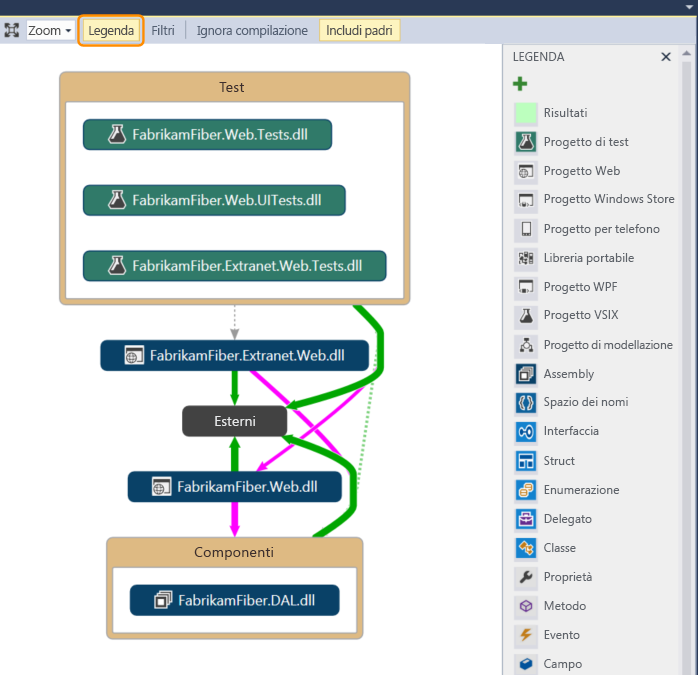
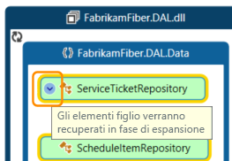
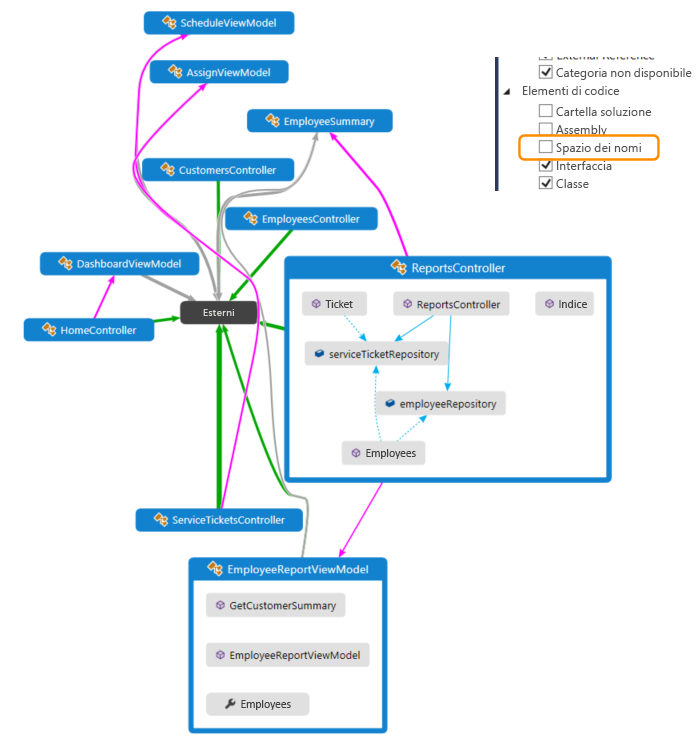
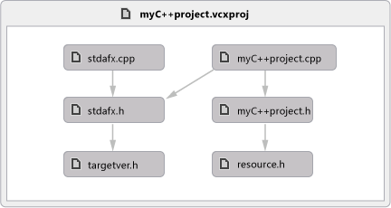
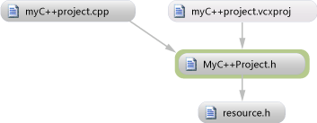

# Eseguire il mapping delle dipendenze nelle soluzioni
Per comprendere le dipendenze in tutto il codice, visualizzarle creando mappe codice. In questo modo è possibile vedere il funzionamento complessivo del codice senza leggere file e righe di codice.  
  
   
  
 **Ecco alcuni video**:  
  
-   [Comprensione delle dipendenze del codice tramite la visualizzazione](http://go.microsoft.com/fwlink/?LinkID=252065)  
  
-   [Visualizza l'impatto di una modifica](http://go.microsoft.com/fwlink/?LinkID=252068)  
  
-   [Informazioni sul codice complesso con le mappe codici](http://go.microsoft.com/fwlink/?LinkID=259869)  
  
##  Introduzione a mappe codice  
 **Per usare le mappe codice saranno necessari**:  
  
-   Visual Studio Enterprise per creare mappe codice tramite l'editor di codice, Esplora soluzioni, Visualizzazione classi o Visualizzatore oggetti.  
  
-   Visual Studio Professional per aprire le mappe codice, apportare modifiche limitate ed esplorare il codice.  
  
> [!WARNING]
>  Prima di condividere le mappe create in Visual Studio Enterprise con altri utenti che usano Visual Studio Professional, assicurarsi che tutti gli elementi nella mappa siano visibili (ad esempio elementi nascosti, gruppi espansi e collegamenti tra gruppi).  
  
 **È possibile eseguire il mapping delle dipendenze per il codice nei seguenti linguaggi**:  
  
-   Visual C# .NET o Visual Basic .NET in una soluzione o in assembly (con estensione dll o exe)  
  
-   Codice C o C++ nativo o gestito in progetti Visual C++, file di intestazione (.h o `#include`) o file binari  
  
-   Progetti X++ e assembly creati da moduli .NET per Microsoft Dynamics AX  
  
 **Nota:** per progetti diversi da C# o Visual Basic .NET, sono disponibili meno opzioni per l'avvio di una mappa codice o per l'aggiunta di elementi a una mappa codice esistente. Ad esempio, non è possibile fare clic con il pulsante destro del mouse su un oggetto nell'editor di testo di un progetto C++ e aggiungerlo a una mappa codice. Tuttavia, è possibile trascinare e rilasciare singoli elementi di codice o file da Esplora soluzioni, Visualizzazione classi e Visualizzatore oggetti.  
  
#### Per visualizzare tutte le dipendenze nella soluzione  
  
1.  Aprire il menu **Architettura** .  
  
2.  Se la soluzione è stata appena aperta e non è stata ancora compilata o se il codice è stato modificato dall'ultima compilazione, scegliere **Genera mappa codici per la soluzione**.  
  
3.  Se il codice non è stato modificato dall'ultima compilazione, scegliere **Genera mappa codici per la soluzione senza compilazione** per accelerare la creazione della mappa.  
  
4.  [Visualizzare tutte le dipendenze](#SeeOverviewSource) per capire come usare le mappe codice per visualizzare le dipendenze complessive nella soluzione.  
  
#### Per visualizzare dipendenze specifiche nella soluzione  
  
1.  Con la soluzione caricata, aprire **Esplora soluzioni**.  
  
2.  Selezionare i progetti, i riferimenti agli assembly, le cartelle, i file, i tipi o i membri di cui eseguire il mapping.  
  
3.  Nel **Esplora** sulla barra degli strumenti, scegliere **Mostra in mappa codice**. In alternativa, scegliere **Mostra in mappa codice**dal menu di scelta rapida. È anche possibile trascinare elementi da Visualizzazione classi o Visualizzatore oggetti in una mappa codice nuova o esistente.  
  
4.  [Visualizzare dipendenze specifiche](#SeeSpecificSource) per informazioni su come usare le mappe codice per visualizzare dipendenze specifiche nella soluzione.  
  
###  Per aggiungere una nuova mappa codice vuota alla soluzione  
  
1.  In **Esplora soluzioni**aprire il menu di scelta rapida per il nodo della soluzione di primo livello. Scegliere **Aggiungi** , quindi **Nuovo elemento**.  
  
2.  In **Installato**scegliere **Generale**.  
  
3.  Nel riquadro destro scegliere **Documento grafico diretto** e quindi scegliere **Aggiungi**.  
  
     Ora si ha una mappa vuota, che viene visualizzata nella cartella **Elementi di soluzione** della soluzione.  
  
#### Per creare una nuova mappa codice vuota senza aggiungerla alla soluzione  
  
1.  Aprire il menu **Architettura** e scegliere **Nuova mappa del codice sorgente**.  
  
     \- oppure -  
  
2.  Aprire il menu **File** e scegliere **Nuovo** , quindi **File**.  
  
3.  In **Installato**scegliere **Generale**.  
  
4.  Nel riquadro destro scegliere **Documento grafico diretto** e quindi scegliere **Apri**.  
  
     Ora si ha una mappa vuota, che non viene visualizzata nelle cartelle della soluzione.  
  
##  Visualizzare le dipendenze complessive  
  
###  Visualizzare le dipendenze nella soluzione  
  
1.  Aprire il menu **Architettura** e scegliere **Genera mappa codici per la soluzione senza compilazione**.  
  
       
  
     Viene visualizzata una mappa che mostra gli assembly di primo livello e i relativi collegamenti aggregati. A una maggiore ampiezza del collegamento aggregato corrisponde un maggior numero di dipendenze che rappresenta.  
  
2.  Usare il pulsante **Legenda** sulla barra degli strumenti del codice per visualizzare o nascondere l'elenco di icone del tipo di progetto (ad esempio Test, Web e Progetto per telefono), gli elementi di codice (ad esempio Classi, Metodi e Proprietà) e i tipi di relazione (ad esempio Eredita da, Implementa e Chiamate).  
  
       
  
     Questa soluzione di esempio contiene cartelle della soluzione (**Test** e **Componenti**), progetti di test, progetti Web e assembly. Per impostazione predefinita, tutte le relazioni del contenitore vengono visualizzate come *gruppi*che è possibile espandere e comprimere. Il gruppo **Esterni** contiene qualsiasi elemento esterno alla soluzione, incluse le dipendenze della piattaforma. Gli assembly esterni mostrano solo gli elementi usati. Per impostazione predefinita, i tipi di base del sistema sono nascosti sulla mappa per evitare confusione.  
  
3.  Per eseguire il drill-down nella mappa, espandere i gruppi che rappresentano progetti e assembly. Per espandere tutti gli elementi premere **CTRL+A** per selezionare tutti i nodi e quindi scegliere **Gruppo**, **Espandi** dal menu di scelta rapida.  
  
       
  
4.  Tuttavia, questa operazione potrebbe non essere utile per una soluzione di grandi dimensioni. Infatti, per soluzioni complesse, i limiti di memoria potrebbero impedire di espandere tutti i gruppi. In alternativa, per visualizzare gli elementi all'interno di un singolo nodo, espanderlo. Spostare il puntatore del mouse sopra il nodo, quindi scegliere il pulsante con la freccia di espansione (freccia giù) quando viene visualizzato.  
  
       
  
     In alternativa, usare la tastiera selezionando l'elemento e premendo il tasto più (**+**). Per esplorare i livelli più profondi di codice, effettuare la stessa operazione per gli spazi dei nomi, i tipi e i membri.  
  
    > [!TIP]
    >  Per ulteriori dettagli relativi all'uso con codice di mapping utilizzando il mouse, tastiera e touch, [cercare e ridisporre le mappe codice](../modeling/browse-and-rearrange-code-maps.md).  
  
5.  Per semplificare la mappa e concentrarsi sulle singole parti, scegliere **Filtri** nella barra degli strumenti della mappa codice e selezionare solo i tipi di nodi e di collegamenti desiderati. Ad esempio, è possibile nascondere tutti i contenitori di Cartella soluzione e Assembly.  
  
       
  
     È anche possibile semplificare la mappa nascondendo o rimuovendo i singoli gruppi ed elementi dalla mappa, senza modificare il codice della soluzione sottostante.  
  
6.  Per visualizzare le relazioni tra elementi, selezionarle nella mappa. I colori dei collegamenti indicano i tipi di relazione, come mostrato nel riquadro **Legenda** .  
  
       
  
     In questo esempio, i collegamenti viola sono chiamate, i collegamenti punteggiati sono riferimenti e i collegamenti azzurro rappresentano l'accesso al campo. I collegamenti verdi possono essere ereditati o possono essere *collegamenti aggregati* che indicano più di un tipo di relazione (o *categoria*).  
  
    > [!TIP]
    >  Se viene visualizzato un collegamento verde, non necessariamente esiste solo una relazione di ereditarietà. Potrebbero essere presenti anche chiamate al metodo, nascoste dalla relazione di ereditarietà. Per visualizzare determinati tipi di collegamenti, usare le caselle di controllo del riquadro **Filtri** per nascondere i tipi cui non si è interessati.  
  
7.  Per altre informazioni su un elemento o un collegamento, spostare il puntatore su di esso finché non viene visualizzata una descrizione comando. In questo modo vengono mostrati i dettagli di un elemento di codice o delle categorie rappresentate da un collegamento.  
  
       
  
8.  Per esaminare gli elementi e le dipendenze rappresentate da un collegamento di aggregazione, prima selezionare il collegamento, quindi aprire il relativo menu di scelta rapida. Scegliere **Mostra collegamenti partecipanti** (o **Mostra collegamenti partecipanti sulla nuova mappa codice**). I gruppi vengono espansi a entrambe le estremità del collegamento e vengono mostrati solo gli elementi e le dipendenze che partecipano al collegamento.  
  
9. Per concentrarsi su parti specifiche della mappa, è possibile continuare a rimuovere gli elementi cui non si è interessati. Ad esempio, per analizzare la visualizzazione delle classi e dei membri, è sufficiente filtrare tutti i nodi dello spazio dei nomi nel riquadro **Filtri** .  
  
       
  
10. Un altro modo per concentrarsi sulla mappa di soluzione complessa consiste nel generare una nuova mappa contenente gli elementi selezionati da una mappa esistente. Tenere premuto **CTRL** durante la selezione di elementi su cui si vuole concentrarsi, aprire il menu di scelta rapida e scegliere **Nuovo grafico dalla selezione**.  
  
       
  
11. Il contesto contenitore viene trasferito alla nuova mappa. Nascondere le cartelle della soluzione e tutti gli altri contenitori che non si vuole visualizzare tramite il riquadro **Filtri** .  
  
       
  
12. Espandere i gruppi e selezionare gli elementi della mappa per visualizzare le relazioni.  
  
       
  
 Vedere anche:  
  
-   [Cercare e ridisporre le mappe del codice](../modeling/browse-and-rearrange-code-maps.md)  
  
-   [Personalizzare le mappe codice modificando i file DGML](../modeling/customize-code-maps-by-editing-the-dgml-files.md)  
  
-   Trovare problemi potenziali nel codice da [eseguendo un analizzatore](../modeling/find-potential-problems-using-code-map-analyzers.md).  
  
###  Visualizzare le dipendenze tra assembly o file binari  
  
1.  [Creare una mappa codice vuota](#GetStarted)o aprire una mappa codice esistente (file con estensione dgml).  
  
2.  Trascinare gli assembly o i file binari di cui eseguire il mapping dall'esterno di Visual Studio nella mappa. Ad esempio, trascinare assembly o file binari da Esplora risorse o Esplora file.  
  
> [!NOTE]
>  È possibile trascinare assembly o file binari da Esplora risorse o Esplora file solo se Esplora risorse o Esplora file e Visual Studio vengono eseguiti allo stesso livello di autorizzazione del controllo di accesso utente. Se, ad esempio, il controllo di accesso utente è attivato e si esegue Visual Studio come amministratore, Esplora risorse o Esplora file blocca l'operazione di trascinamento. Per risolvere questo problema, assicurarsi di eseguire le applicazioni allo stesso livello di autorizzazione oppure disattivare il controllo di accesso dell'utente.  
  
##  Visualizzare dipendenze specifiche  
 Si supponga, ad esempio, di dover eseguire una revisione del codice in alcuni file con modifiche in sospeso. Per visualizzare le dipendenze in queste modifiche, è possibile creare una mappa codice da tali file.  
  
   
  
### Visualizzare dipendenze specifiche nella soluzione  
  
1.  Aprire **Esplora soluzioni**. Selezionare i progetti, i riferimenti agli assembly, le cartelle, i file, i tipi e i membri di proprio interesse. Per trovare elementi con dipendenze da tipi o membri, aprire il menu di scelta rapida del tipo o del membro da **Esplora soluzioni**. Scegliere il tipo di dipendenza e quindi selezionare i risultati.  
  
2.  Eseguire il mapping degli elementi e dei relativi membri. Nel **Esplora** sulla barra degli strumenti fare clic su **Mostra in mappa codice**.  
  
       
  
3.  La mappa visualizza gli elementi selezionati all'interno degli assembly in cui sono contenuti.  
  
       
  
     È anche possibile trascinare elementi da Esplora soluzioni, Visualizzazione classi o Visualizzatore oggetti in una mappa codice nuova o esistente. Per creare una mappa vuota, vedere [Creare una mappa codice vuota](#GetStarted). Per includere la gerarchia padre per gli elementi, tenere premuto **CTRL** quando si trascinano gli elementi oppure usare il pulsante **Includi padri** nella barra degli strumenti della mappa codice per specificare l'azione predefinita.  
  
    > [!NOTE]
    >  Quando si aggiungono elementi da un progetto condiviso in più applicazioni, ad esempio Windows Phone o Windows Store, tali elementi vengono visualizzati nella mappa insieme al progetto di applicazione attivo. Se si cambia il contesto passando a un altro progetto di applicazione e si aggiungono altri elementi dal progetto condiviso, tali elementi vengono visualizzati con il nuovo progetto di applicazione attivo. Le operazioni eseguite con un elemento nella mappa si applicano solo agli elementi che condividono lo stesso contesto.  
  
4.  Per esplorare gli elementi, espanderli. Spostare il puntatore del mouse sopra un elemento, quindi scegliere il pulsante con la freccia di espansione (freccia Giù) quando viene visualizzato.  
  
       
  
     Per espandere tutti gli elementi, selezionarli usando **CTRL+A**, quindi aprire il menu di scelta rapida per la mappa e scegliere **Gruppo**, **Espandi**. Tuttavia, questa opzione non è disponibile se l'espansione di tutti i gruppi crea una mappa inutilizzabile o problemi di memoria.  
  
5.  Continuare a espandere gli elementi desiderati, fino al livello di classe e membro, se necessario.  
  
       
  
     Per visualizzare membri presenti nel codice ma non vengono visualizzati sulla mappa, scegliere il **recupera di nuovo figli** icona  nell'angolo superiore sinistro di un gruppo.  
  
6.  Per visualizzare più elementi correlati a quelli sulla mappa, selezionarne uno e scegliere **Mostra correlati** nella barra degli strumenti della mappa codice, quindi selezionare il tipo di elementi correlati da aggiungere alla mappa. In alternativa, selezionare uno o più elementi, aprire il menu di scelta rapida e quindi scegliere l'opzione **Mostra** per il tipo di elementi correlati da aggiungere alla mappa. Ad esempio:  
  
     Per un **assembly**scegliere:  
  
    |||  
    |-|-|  
    |**Mostra gli assembly a cui fa riferimento**|Aggiungere gli assembly a cui fa riferimento questo assembly. Gli assembly esterni vengono visualizzati nel gruppo **Esterni** .|  
    |**Mostra gli assembly che fanno riferimento a questo**|Aggiungere gli assembly della soluzione che fanno riferimento a questo assembly.|  
  
     Per uno **spazio dei nomi**scegliere **Mostra assembly contenitore**, se non è visibile.  
  
     Per una **classe** o un' **interfaccia**scegliere:  
  
    |||  
    |-|-|  
    |**Mostra tipi Base**|Per una classe, aggiungere la classe base e le interfacce implementate.   Per un'interfaccia, aggiungere le interfacce di base.|  
    |**Mostra tipi derivati**|Per una classe, aggiungere le classi derivate.   Per un'interfaccia, aggiungere le interfacce derivate e le classi o gli struct implementati.|  
    |**Mostra tipi a cui fa riferimento**|Aggiungere tutte le classi e i membri usati.|  
    |**Visualizzare i tipi che fanno riferimento a questo**|Aggiungere tutte le classi e membri che usano la classe.|  
    |**Mostra contenitore Namespace**|Aggiungere lo spazio dei nomi del padre.|  
    |**Mostra contenente Namespace e Assembly**|Aggiungere la gerarchia del contenitore padre.|  
    |**Mostra tutti i tipi di Base**|Aggiungere la gerarchia di interfacce o di classi base in modo ricorsivo.|  
    |**Mostra tutti i tipi derivati**|Per una classe, aggiungere tutte le classi derivate in modo ricorsivo.   Per un'interfaccia, aggiungere tutte le interfacce derivate e implementare classi o struct in modo ricorsivo.|  
  
     Per un **metodo**scegliere:  
  
    |||  
    |-|-|  
    |**Mostra metodi chiamati**|Aggiungere metodi chiamati dal metodo specifico.|  
    |**Mostra campi a cui fa riferimento**|Aggiungere i campi cui questo metodo fa riferimento.|  
    |**Mostra tipo contenitore**|Aggiungere il tipo padre.|  
    |**Mostra tipo contenente, Namespace e Assembly**|Aggiungere la gerarchia del contenitore padre.|  
    |**Mostra metodi sottoposti a override**|Per un metodo che esegue l'override di altri metodi o implementa un metodo di interfaccia, aggiungere tutti i metodi astratti o virtuali nelle classi base sottoposte a override e, se disponibile, il metodo di interfaccia implementato.|  
  
     Per un **campo** o una **proprietà**scegliere:  
  
    |||  
    |-|-|  
    |**Mostra tipo contenitore**|Aggiungere il tipo padre.|  
    |**Mostra tipo contenente, Namespace e Assembly**|Aggiungere la gerarchia del contenitore padre.|  
  
       
  
7.  La mappa visualizza le relazioni. In questo esempio, i metodi chiamati dal metodo `Find` e la relativa posizione nella soluzione o esternamente.  
  
       
  
8.  Per semplificare la mappa e concentrarsi sulle singole parti, scegliere **Filtri** nella barra degli strumenti della mappa codice e selezionare solo i tipi di nodi e di collegamenti desiderati. Ad esempio, disattivare la visualizzazione di Cartelle soluzione, Assembly e Spazi dei nomi.  
  
       
  
##  Visualizzare le dipendenze tra file di intestazione e i file di origine C e C++  
 Per creare mappe più complete per i progetti C++, impostare l'opzione del compilatore di informazioni di visualizzazione (**/FR**) su tali progetti. In caso contrario, viene visualizzato un messaggio con la richiesta di impostare l'opzione. Se si seleziona **OK**, l'opzione viene impostata solo per la mappa corrente. È possibile scegliere di nascondere il messaggio per tutte le mappe successive. Se si nasconde il messaggio, è possibile visualizzarlo nuovamente. Impostare la seguente chiave del Registro di sistema su `0` o eliminare la chiave:  
  
 **HKEY_CURRENT_USER\Software\Microsoft\VisualStudio\14.0\NativeProvider: AutoEnableSbr**  
  
 Quando si apre una soluzione che contiene progetti Visual C++, l'aggiornamento del database di IntelliSense potrebbe richiedere del tempo. Durante questo periodo potrebbe non essere possibile creare mappe codice per file di intestazione (con estensione h o `#include`) o finché il database IntelliSense non ha completato l'aggiornamento. È possibile monitorare lo stato di avanzamento dell'aggiornamento nella barra di stato di Visual Studio. Per risolvere problemi o messaggi che vengono visualizzati perché determinate impostazioni di IntelliSense sono disattivate, vedere [Risoluzione dei problemi relativi alle mappe per il codice C e C++](#Troubleshooting).  
  
-   Per visualizzare le dipendenze tra tutti i file di origine e i file di intestazione nella soluzione, scegliere **Genera grafico dei file di inclusione** dal menu **Architettura**.  
  
       
  
-   Per visualizzare le dipendenze tra i file attualmente aperti e i file di origine e i file di intestazione correlati, aprire il file di origine o il file di intestazione. Aprire il menu di scelta rapida del file in un punto qualsiasi del file. Scegliere **Genera grafico dei file di inclusione**.  
  
       
  
###  Risoluzione dei problemi di mappe per il codice C e C++  
 Gli elementi seguenti non sono supportati nel codice C e C++:  
  
-   I tipi di base non vengono visualizzati nelle mappe che includono la gerarchia padre.  
  
-   La maggior parte delle voci di menu **Mostra** non è disponibile per il codice C e C++.  
  
 Questi problemi potrebbero verificarsi quando si creano mappe del codice per il codice C e C++:  
  
|**Problema**|**Possibile causa**|**Risoluzione**|  
|---------------|------------------------|--------------------|  
|Non è stato possibile generare la mappa codice.|Nessun progetto nella soluzione è stato compilato correttamente.|Correggere gli errori di compilazione che si sono verificati, quindi rigenerare la mappa.|  
|[!INCLUDE[vsprvs](../code-quality/includes/vsprvs_md.md)]smette di rispondere quando si tenta di generare una mappa di codice dal **architettura** menu.|Il file di database del programma (con estensione pdb) potrebbe essere danneggiato.   Nel file pdb sono memorizzate informazioni di debug, ad esempio informazioni sui tipi, sui metodi e sui file di origine.|Ricompilare la soluzione e riprovare.|  
|Alcune impostazioni per il database di esplorazione IntelliSense sono disabilitate.|Alcune impostazioni di IntelliSense potrebbero essere disabilitate nella [!INCLUDE[vsprvs](../code-quality/includes/vsprvs_md.md)] **opzioni** la finestra di dialogo.|Attivare le impostazioni per abilitarle.   Vedere [opzioni, Editor di testo, C/C++, avanzate](../ide/reference/options-text-editor-c-cpp-advanced.md).|  
|Il messaggio **Metodi sconosciuti** viene visualizzato su un nodo di metodo.   Questo problema si verifica perché non è possibile risolvere il nome del metodo.|Il file binario potrebbe non disporre di una tabella di rilocazione di base.|Attivare l'opzione **/FIXED:NO** nel linker.|  
||Il file di database del programma (con estensione pdb) potrebbe non essere compilato.   Nel file pdb sono memorizzate informazioni di debug, ad esempio informazioni sui tipi, sui metodi e sui file di origine.|Attivare l'opzione **/DEBUG** nel linker.|  
||Non è possibile aprire o trovare il file pdb nei percorsi previsti.|Verificare che il file pdb esista nei percorsi previsti.|  
||Le informazioni di debug sono state rimosse dal file pdb.|Se nel linker è stata usata l'opzione **/PDBSTRIPPED** , includere il file pdb completo.|  
||Il chiamante non è una funzione e non è un thunk nel file binario o un puntatore nella sezione di dati.|Quando il chiamante è un thunk, provare a usare `_declspec(dllimport)` per evitare il thunk.|  
  
##  Rendere il codice più rapidamente il rendering delle mappe  
 Quando si genera una mappa per la prima volta, Visual Studio indicizza tutte le dipendenze trovate. Questo processo potrebbe richiedere molto tempo, soprattutto per le soluzioni di grandi dimensioni, ma ciò migliorerà le prestazioni successive. Se il codice viene modificato, Visual Studio reindicizza solo il codice aggiornato. Per ridurre al minimo il tempo necessario per completare il rendering della mappa, tenere presente quanto segue:  
  
-   [Eseguire il mapping solo le dipendenze desiderate.](#SeeSpecificSource)  
  
-   Prima di generare la mappa per un'intera soluzione, ridurre l'ambito della soluzione.  
  
-   Disattivare la compilazione automatica per la soluzione con il pulsante **Ignora compilazione** nella barra degli strumenti della mappa codice.  
  
-   Disattivare la compilazione automatica degli elementi padre con il pulsante **Includi padri** nella barra degli strumenti della mappa codice.  
  
-   Modificare il file della mappa codice per rimuovere i nodi e i collegamenti non necessari. La modifica della mappa non influisce in alcun modo sul codice sottostante. Vedere [personalizzare le mappe codice modificando i file DGML](../modeling/customize-code-maps-by-editing-the-dgml-files.md).  
  
   
  
 Sebbene Visual Studio sia in grado di funzionare con 1 GB di memoria, è consigliabile che il computer disponga di almeno 2 GB di memoria per evitare lunghi ritardi quando viene creato l'indice del codice e viene generata la mappa.  
  
 La creazione di mappe o l'aggiunta di elementi a una mappa da Esplora soluzioni potrebbe richiedere più tempo quando la proprietà **Copia nella directory di output** di un elemento di progetto è impostata su **Copia sempre**. Ciò potrebbe causare problemi nelle compilazioni incrementali e in Visual Studio per ricompilare il progetto ogni volta. Per aumentare le prestazioni, impostare questa proprietà su **Copia se più recente** o su `PreserveNewest`. Vedere [nelle compilazioni incrementali](../msbuild/incremental-builds.md).  
  
 La mappa completata mostrerà le dipendenze solo per il codice compilato correttamente. Se si verificano errori di compilazione per determinati componenti, tali errori vengono visualizzati nella mappa. Assicurarsi quindi che un componente venga effettivamente compilato e contenga le dipendenze prima di prendere decisioni a livello di architettura in base alla mappa.  
  
##  Condividere le mappe codice  
  
### Condividere la mappa con altri utenti di Visual Studio  
 Usare il menu **File** per salvare la mappa.  
  
 -oppure-  
  
 Per salvare la mappa come parte del progetto specifico, sulla barra degli strumenti della mappa, scegliere **condivisione**, **spostare** \< *nome mappa codice*>**DGML in**, quindi scegliere il progetto in cui si desidera salvare la mappa.  
  
   
  
 In Visual Studio la mappa viene salvata come file con estensione dgml da condividere con altri utenti di Visual Studio Enterprise e Visual Studio Professional.  
  
> [!NOTE]
>  Prima di condividere una mappa con gli utenti che usano Visual Studio Professional, assicurarsi di espandere tutti i gruppi, visualizzare i nodi nascosti e i collegamenti tra gruppi e recuperare tutti i nodi eliminati che si vuole vengano visualizzati da altri nella mappa. In caso contrario, altri utenti non saranno in grado di visualizzare questi elementi.  
>   
>  Quando si salva una mappa che è contenuta in un progetto di modellazione o che è stata copiata da un progetto di modellazione in un altro percorso potrebbe verificarsi l'errore seguente:  
>   
>  "Impossibile salvare *nomeFile* all'esterno della directory del progetto. Gli elementi collegati non sono supportati."  
>   
>  In Visual Studio viene visualizzato l'errore, ma viene comunque creata la versione salvata. Per evitare l'errore, creare la mappa all'esterno del progetto di modellazione. Sarà quindi possibile salvarlo quindi nel percorso desiderato. Il semplice tentativo di copiare il file in un altro percorso della soluzione e salvarlo non produrrà alcun effetto.  
  
### Esportare la mappa come immagine in modo che sia possibile copiarla in altre applicazioni, ad esempio in Microsoft Word o PowerPoint.  
  
1.  Nella barra degli strumenti della mappa codice scegliere **Condividi**, **Invia come immagine in un messaggio di posta elettronica** o **Copia immagine**.  
  
2.  Incollare l'immagine in un'altra applicazione.  
  
### Esportare la mappa come file XPS in modo che sia possibile visualizzarla in visualizzatori XAML o XML come Internet Explorer  
  
1.  Nella barra degli strumenti della mappa codice scegliere **Condividi**, **Invia come Portable XPS in un messaggio di posta elettronica** o **Salva come Portable XPS**.  
  
2.  Scegliere la posizione in cui salvare il file.  
  
3.  Assegnare un nome alla mappa codice. Assicurarsi che il **Salva come** casella viene impostata su **file XPS (\*con estensione xps)**. Scegliere **Salva**.  
  
## In quale altro modo è possibile procedere?  
  
-   [Usare le mappe del codice per eseguire il debug delle applicazioni](../modeling/use-code-maps-to-debug-your-applications.md)  
  
-   [Mappare i metodi sullo stack di chiamate durante il debug](../debugger/map-methods-on-the-call-stack-while-debugging-in-visual-studio.md)  
  
-   [Trovare problemi potenziali usando gli analizzatore delle mappe del codice](../modeling/find-potential-problems-using-code-map-analyzers.md)  
  
-   [Cercare e ridisporre le mappe del codice](../modeling/browse-and-rearrange-code-maps.md)  
  
-   [Personalizzare le mappe codice modificando i file DGML](../modeling/customize-code-maps-by-editing-the-dgml-files.md)

