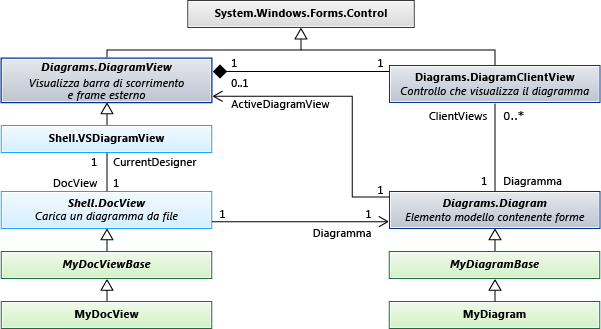

# <a name="navigating-and-updating-a-model-in-program-code"></a>Esplorazione e aggiornamento di un modello nel codice del programma
È possibile scrivere codice per creare ed eliminare gli elementi del modello, impostarne le proprietà e creare ed eliminare collegamenti tra elementi. All'interno di una transazione, è necessario configurare tutte le modifiche. Se gli elementi vengono visualizzati in un diagramma, il diagramma verrà "corretto" automaticamente alla fine della transazione.  
  
## <a name="in-this-topic"></a>In questo argomento  
 [Un esempio di definizione DSL](#example)  
  
 [Lo spostamento tra il modello](#navigation)  
  
 [L'accesso a informazioni sulle classi](#metadata)  
  
 [Eseguire le modifiche all'interno di una transazione](#transaction)  
  
 [Creazione di elementi del modello](#elements)  
  
 [Creazione di collegamenti di relazione](#links)  
  
 [L'eliminazione di elementi](#deleteelements)  
  
 [Eliminazione di collegamenti di relazione](#deletelinks)  
  
 [Riordinare i collegamenti di una relazione](#reorder)  
  
 [Blocchi](#locks)  
  
 [Copia e Incolla](#copy)  
  
 [Esplorazione e aggiornamento di diagrammi](#diagrams)  
  
 [Spostamento tra elementi e forme](#views)  
  
 [Proprietà delle forme e connettori](#shapeProperties)  
  
 [Oggetto DocData e DocView](#docdata)  
  
##  <a name="a-nameexamplea-an-example-dsl-definition"></a><a name="example"></a>Un esempio di definizione DSL  
 Questa è la parte principale di Dsldefinition per gli esempi in questo argomento:  
  
   
  
 Questo modello è un'istanza di questo DSL:  
  
   
  
### <a name="references-and-namespaces"></a>I riferimenti e spazi dei nomi  
 Per eseguire il codice in questo argomento, è necessario fare riferimento:  
  
 `Microsoft.VisualStudio.Modeling.Sdk.11.0.dll`  
  
 Il codice utilizzerà questo spazio dei nomi:  
  
 `using Microsoft.VisualStudio.Modeling;`  
  
 Inoltre, se si scrive il codice in un progetto diverso da quello in cui è definito il linguaggio DSL, è necessario importare l'assembly compilato dal progetto Dsl.  
  
##  <a name="a-namenavigationa-navigating-the-model"></a><a name="navigation"></a>Lo spostamento tra il modello  
  
### <a name="properties"></a>Proprietà  
 Proprietà dominio definiti nella definizione DSL diventano le proprietà che è possibile accedere nel codice del programma:  
  
 `Person henry = ...;`  
  
 `if (henry.BirthDate < 1500) ...`  
  
 `if (henry.Name.EndsWith("VIII")) ...`  
  
 Se si desidera impostare una proprietà, è necessario farlo all'interno di un [transazione](#transaction):  
  
 `henry.Name = "Henry VIII";`  
  
 Se nella definizione DSL, una proprietà **tipo** è **calcolato**, non è possibile impostare. Per ulteriori informazioni, vedere [calcolati e le proprietà di archiviazione personalizzato](../modeling/calculated-and-custom-storage-properties.md).  
  
### <a name="relationships"></a>Relazioni  
 Relazioni di dominio che definiscono nella definizione DSL più coppie di proprietà, uno per la classe a ogni estremità della relazione. I nomi delle proprietà vengono visualizzate nel diagramma DslDefinition come etichette in ruoli a ogni lato della relazione. A seconda della molteplicità di role, il tipo della proprietà è la classe a altra estremità della relazione o una raccolta di tale classe.  
  
 `foreach (Person child in henry.Children) { ... }`  
  
 `FamilyTreeModel ftree = henry.FamilyTreeModel;`  
  
 Le proprietà opposti di una relazione sono sempre reciproco. Quando un collegamento viene creato o eliminato, vengono aggiornate le proprietà del ruolo in entrambi gli elementi. L'espressione seguente (che utilizza le estensioni di `System.Linq`) è sempre true per la relazione ParentsHaveChildren nell'esempio:  
  
 `(Person p) => p.Children.All(child => child.Parents.Contains(p))`  
  
 `&& p.Parents.All(parent => parent.Children.Contains(p));`  
  
 **ElementLinks**. Una relazione è anche rappresentata da un elemento del modello denominato un *collegamento*, che è un'istanza del tipo di relazione di dominio. Un collegamento ha sempre l'elemento di un'origine e una destinazione. L'elemento di origine e l'elemento di destinazione può essere lo stesso.  
  
 È possibile accedere a un collegamento e le relative proprietà:  
  
 `ParentsHaveChildren link = ParentsHaveChildren.GetLink(henry, edward);`  
  
 `// This is now true:`  
  
 `link == null || link.Parent == henry && link.Child == edward`  
  
 Per impostazione predefinita, non più di un'istanza di una relazione è consentita collegare qualsiasi coppia di elementi del modello. Ma se nella definizione DSL, il `Allow Duplicates` flag vale per la relazione, quindi potrebbero essere presenti più di un collegamento, è necessario utilizzare `GetLinks`:  
  
 `foreach (ParentsHaveChildren link in ParentsHaveChildren.GetLinks(henry, edward)) { ... }`  
  
 Esistono anche altri metodi per l'accesso ai collegamenti. Ad esempio:  
  
 `foreach (ParentsHaveChildren link in     ParentsHaveChildren.GetLinksToChildren(henry)) { ... }`  
  
 **Ruoli nascosti.** Se nella definizione DSL, **proprietà generato** è **false** per un determinato ruolo, quindi nessuna proprietà viene generata corrispondente a tale ruolo. È tuttavia possibile accedere ai collegamenti e attraversare i collegamenti utilizzando i metodi della relazione:  
  
 `foreach (Person p in ParentsHaveChildren.GetChildren(henry)) { ... }`  
  
 L'esempio di uso più frequente è il <xref:Microsoft.VisualStudio.Modeling.Diagrams.PresentationViewsSubject>relazione che collega un elemento del modello per la forma che viene visualizzato in un diagramma:</xref:Microsoft.VisualStudio.Modeling.Diagrams.PresentationViewsSubject>  
  
 `PresentationViewsSubject.GetPresentation(henry)[0] as PersonShape`  
  
### <a name="the-element-directory"></a>La Directory elemento  
 È possibile accedere a tutti gli elementi nell'archivio utilizzando la directory di elemento:  
  
 `store.ElementDirectory.AllElements`  
  
 Sono disponibili anche metodi per la ricerca di elementi, ad esempio le operazioni seguenti:  
  
 `store.ElementDirectory.FindElements(Person.DomainClassId);`  
  
 `store.ElementDirectory.GetElement(elementId);`  
  
##  <a name="a-namemetadataa-accessing-class-information"></a><a name="metadata"></a>L'accesso a informazioni sulle classi  
 È possibile ottenere informazioni sulle classi, relazioni e altri aspetti della definizione DSL. Ad esempio:  
  
 `DomainClassInfo personClass = henry.GetDomainClass();`  
  
 `DomainPropertyInfo birthProperty =`  
  
 `personClass.FindDomainProperty("BirthDate")`  
  
 `DomainRelationshipInfo relationship =`  
  
 `link.GetDomainRelationship();`  
  
 `DomainRoleInfo sourceRole = relationship.DomainRole[0];`  
  
 Le classi del predecessore di elementi del modello sono i seguenti:  
  
-   ModelElement - tutti gli elementi e le relazioni sono elementi modello  
  
-   ElementLink - tutte le relazioni sono ElementLinks  
  
##  <a name="a-nametransactiona-perform-changes-inside-a-transaction"></a><a name="transaction"></a>Eseguire le modifiche all'interno di una transazione  
 Ogni volta che il codice del programma cambia nulla nell'archivio, deve essere eseguita all'interno di una transazione. Questo vale per tutti gli elementi del modello, relazioni, forme, diagrammi e le relative proprietà. Per ulteriori informazioni, vedere <xref:Microsoft.VisualStudio.Modeling.Transaction>.</xref:Microsoft.VisualStudio.Modeling.Transaction>  
  
 Il metodo più semplice di gestire una transazione è con un `using` istruzione racchiusa tra un `try...catch` istruzione:  
  
```  
Store store; ...  
try  
{  
  using (Transaction transaction =  
    store.TransactionManager.BeginTransaction("update model"))  
    // Outermost transaction must always have a name.  
  {  
    // Make several changes in Store:  
    Person p = new Person(store);  
    p.FamilyTreeModel = familyTree;  
    p.Name = "Edward VI";  
    // end of changes to Store  
  
    transaction.Commit(); // Don't forget this!  
  } // transaction disposed here  
}  
catch (Exception ex)  
{  
  // If an exception occurs, the Store will be   
  // rolled back to its previous state.  
}  
```  
  
 È possibile apportare qualsiasi numero di modifiche all'interno di una transazione. È possibile aprire le nuove transazioni all'interno di una transazione attiva.  
  
 Per rendere permanenti le modifiche, è necessario `Commit` la transazione prima di eliminarlo. Se si verifica un'eccezione non rilevata all'interno della transazione, l'archivio verrà reimpostato sullo stato precedente le modifiche.  
  
##  <a name="a-nameelementsa-creating-model-elements"></a><a name="elements"></a>Creazione di elementi del modello  
 In questo esempio aggiunge un elemento a un modello esistente:  
  
```  
FamilyTreeModel familyTree = ...; // The root of the model.         
using (Transaction t =  
    familyTree.Store.TransactionManager  
    .BeginTransaction("update model"))  
{  
  // Create a new model element   
  // in the same partition as the model root:  
  Person edward = new Person(familyTree.Partition);  
  // Set its embedding relationship:  
  edward.FamilyTreeModel = familyTree;  
          // same as: familyTree.People.Add(edward);  
  // Set its properties:  
  edward.Name = "Edward VII";  
  t.Commit(); // Don't forget this!  
}  
```  
  
 In questo esempio vengono illustrati questi punti essenziali sulla creazione di un elemento:  
  
-   Creare il nuovo elemento in una partizione specifica dell'archivio. Per gli elementi del modello e le relazioni, ma non le forme, si tratta in genere la partizione predefinita.  
  
-   Rendere la destinazione di una relazione di incorporamento. In DslDefinition di questo esempio, ogni persona deve essere la destinazione della relazione FamilyTreeHasPeople di incorporamento. A tale scopo, è possibile impostare la proprietà del ruolo FamilyTreeModel dell'oggetto utente o aggiungere l'utente alla proprietà dell'oggetto FamilyTreeModel ruolo persone.  
  
-   Impostare le proprietà di un nuovo elemento, in particolare la proprietà per cui `IsName` è impostato su true nel DslDefinition. Questo flag contrassegna la proprietà che consente di identificare in modo univoco l'elemento relativo proprietario. In questo caso, la proprietà Name con flag.  
  
-   La definizione DSL di questo DSL deve siano stata caricata nell'archivio. Se si scrive un'estensione, ad esempio un comando di menu, corrisponderà in genere già true. In altri casi, è possibile in modo esplicito il modello di carico nell'archivio, o utilizzare <xref:Microsoft.VisualStudio.Modeling.Integration.ModelBus>per caricare tale</xref:Microsoft.VisualStudio.Modeling.Integration.ModelBus> Per ulteriori informazioni, vedere [procedura: aprire un modello da File nel codice programma](../modeling/how-to-open-a-model-from-file-in-program-code.md).  
  
 Quando si crea un elemento in questo modo, una forma viene creata automaticamente (se il linguaggio DSL ha un diagramma). Viene visualizzato in una posizione assegnata automaticamente, con forma predefinita, al colore e altre funzionalità. Se si desidera controllare dove e come viene visualizzata la forma associata, vedere [la creazione di un elemento e la relativa forma](#merge).  
  
##  <a name="a-namelinksa-creating-relationship-links"></a><a name="links"></a>Creazione di collegamenti di relazione  
 Esistono due relazioni definite nell'esempio di definizione DSL. Ogni relazione definisce un *proprietà ruolo* sulla classe a ogni estremità della relazione.  
  
 Esistono tre modi in cui è possibile creare un'istanza di una relazione. Ognuno di questi tre metodi ha lo stesso effetto:  
  
-   Impostare la proprietà dell'assegnatario di ruolo di origine. Ad esempio:  
  
    -   `familyTree.People.Add(edward);`  
  
    -   `edward.Parents.Add(henry);`  
  
-   Impostare la proprietà dell'assegnatario di ruolo di destinazione. Ad esempio:  
  
    -   `edward.familyTreeModel = familyTree;`  
  
         La molteplicità di questo ruolo è `1..1`, pertanto viene assegnato il valore.  
  
    -   `henry.Children.Add(edward);`  
  
         La molteplicità di questo ruolo è `0..*`, pertanto è aggiungere alla raccolta.  
  
-   Costruire un'istanza della relazione in modo esplicito. Ad esempio:  
  
    -   `FamilyTreeHasPeople edwardLink = new FamilyTreeHasPeople(familyTreeModel, edward);`  
  
    -   `ParentsHaveChildren edwardHenryLink = new ParentsHaveChildren(henry, edward);`  
  
 L'ultimo metodo è utile se si desidera impostare le proprietà per la relazione stessa.  
  
 Quando si crea un elemento in questo modo, viene creato automaticamente un connettore nel diagramma, ma presenta una forma predefinita, colore e altre funzionalità. Per controllare come viene creato il connettore associato, vedere [la creazione di un elemento e la relativa forma](#merge).  
  
##  <a name="a-namedeleteelementsa-deleting-elements"></a><a name="deleteelements"></a>L'eliminazione di elementi  
 Eliminare un elemento chiamando `Delete()`:  
  
 `henry.Delete();`  
  
 Questa operazione eliminerà anche:  
  
-   Collegamenti di relazione da e verso l'elemento. Ad esempio, `edward.Parents` non conterrà più `henry`.  
  
-   Gli elementi in corrispondenza di ruoli per il quale il `PropagatesDelete` flag è true. Ad esempio, la forma che visualizzi l'elemento verrà eliminata.  
  
 Per impostazione predefinita, ogni relazione di incorporamento è `PropagatesDelete` true al ruolo di destinazione. L'eliminazione di `henry` non comporta l'eliminazione il `familyTree`, ma `familyTree.Delete()` in modo da eliminare tutti i `Persons`. Per ulteriori informazioni, vedere [personalizzazione del comportamento di eliminazione](../modeling/customizing-deletion-behavior.md).  
  
 Per impostazione predefinita, `PropagatesDelete` non vale per i ruoli delle relazioni di riferimento.  
  
 È possibile che le regole di eliminazione omettere propagazioni specifici quando si elimina un oggetto. Ciò è utile se si intende sostituire un elemento per un altro. Specificare il GUID di uno o più ruoli per i quali l'eliminazione non deve essere propagata. È possibile ottenere il GUID della classe di relazione:  
  
 `henry.Delete(ParentsHaveChildren.SourceDomainRoleId);`  
  
 (Questo particolare esempio avrebbe alcun effetto, poiché `PropagatesDelete` è `false` per i ruoli del `ParentsHaveChildren` relazione.)  
  
 In alcuni casi, l'eliminazione viene impedita dall'esistenza di un blocco, sull'elemento o su un elemento che verrà eliminato dal propagazione. È possibile utilizzare `element.CanDelete()` per verificare se l'elemento può essere eliminato.  
  
##  <a name="a-namedeletelinksa-deleting-relationship-links"></a><a name="deletelinks"></a>Eliminazione di collegamenti di relazione  
 È possibile eliminare un collegamento alla relazione tramite la rimozione di un elemento da una proprietà del ruolo:  
  
 `henry.Children.Remove(edward); // or:`  
  
 `edward.Parents.Remove(henry);  // or:`  
  
 È inoltre possibile eliminare il collegamento in modo esplicito:  
  
 `edwardHenryLink.Delete();`  
  
 Questi tre metodi tutti hanno lo stesso effetto. È necessario utilizzare solo uno di essi.  
  
 Se il ruolo ha molteplicità 0..1 o 1..1, è possibile impostare su `null`, o a un altro valore:  
  
 `edward.FamilyTreeModel = null;`o:  
  
 `edward.FamilyTreeModel = anotherFamilyTree;`  
  
##  <a name="a-namereordera-re-ordering-the-links-of-a-relationship"></a><a name="reorder"></a>Riordinare i collegamenti di una relazione  
 I collegamenti di una determinata relazione originato o destinati a un elemento del modello specifico dispone di una sequenza specifica. Vengono visualizzati nell'ordine in cui sono stati aggiunti. Ad esempio, l'istruzione restituirà sempre gli elementi figlio nello stesso ordine:  
  
 `foreach (Person child in henry.Children) ...`  
  
 È possibile modificare l'ordine dei collegamenti:  
  
 `ParentsHaveChildren link = GetLink(henry,edward);`  
  
 `ParentsHaveChildren nextLink = GetLink(henry, elizabeth);`  
  
 `DomainRoleInfo role =`  
  
 `link.GetDomainRelationship().DomainRoles[0];`  
  
 `link.MoveBefore(role, nextLink);`  
  
##  <a name="a-namelocksa-locks"></a><a name="locks"></a>Blocchi  
 Le modifiche potrebbero essere evitate eseguendo un blocco. Impostare blocchi su singoli elementi, partizioni e l'archivio. Se uno di questi livelli dispone di un blocco che impedisce il tipo di modifica che si desidera apportare, quando si tenta, potrebbe essere generata un'eccezione. È possibile individuare se i blocchi vengono impostati utilizzando l'elemento. GetLocks(), che è un metodo di estensione definiti nello spazio dei nomi <xref:Microsoft.VisualStudio.Modeling.Immutability>.</xref:Microsoft.VisualStudio.Modeling.Immutability>  
  
 Per ulteriori informazioni, vedere [che definisce un criterio di blocco per creare segmenti di sola lettura](../modeling/defining-a-locking-policy-to-create-read-only-segments.md).  
  
##  <a name="a-namecopya-copy-and-paste"></a><a name="copy"></a>Copia e Incolla  
 È possibile copiare elementi o gruppi di elementi a un <xref:System.Windows.Forms.IDataObject>:</xref:System.Windows.Forms.IDataObject>  
  
```  
Person person = personShape.ModelElement as Person;  
Person adopter = adopterShape.ModelElement as Person;  
IDataObject data = new DataObject();  
personShape.Diagram.ElementOperations  
      .Copy(data, person.Children.ToList<ModelElement>());  
```  
  
 Gli elementi vengono archiviati come un gruppo di elementi serializzati.  
  
 È possibile unire gli elementi da IDataObject in un modello:  
  
```  
using (Transaction t = targetDiagram.Store.  
        TransactionManager.BeginTransaction("paste"))  
{  
  adopterShape.Diagram.ElementOperations.Merge(adopter, data);  
}  
```  
  
 `Merge ()`grado di accettare uno un `PresentationElement` o `ModelElement`. Se è necessario assegnargli un `PresentationElement`, è inoltre possibile specificare una posizione nel diagramma di destinazione come terzo parametro.  
  
##  <a name="a-namediagramsa-navigating-and-updating-diagrams"></a><a name="diagrams"></a>Esplorazione e aggiornamento di diagrammi  
 In un linguaggio DSL, l'elemento del modello di dominio, che rappresenta un concetto, ad esempio una persona o un brano, è separato dall'elemento forma che rappresenta le informazioni disponibili nel diagramma. Elemento del modello di dominio archivia le proprietà importanti e le relazioni dei concetti. L'elemento forma archivia le dimensioni, posizione e colore di visualizzazione dell'oggetto nel diagramma e il layout dei relativi componenti.  
  
### <a name="presentation-elements"></a>Elementi di presentazione  
   
  
 Nella definizione DSL, ogni elemento che specifica crea una classe derivata da una delle seguenti classi standard.  
  
|Tipo di elemento|Classe base|  
|---------------------|----------------|  
|Classe di dominio|<xref:Microsoft.VisualStudio.Modeling.ModelElement></xref:Microsoft.VisualStudio.Modeling.ModelElement>|  
|Relazione di dominio|<xref:Microsoft.VisualStudio.Modeling.ElementLink></xref:Microsoft.VisualStudio.Modeling.ElementLink>|  
|Forma|<xref:Microsoft.VisualStudio.Modeling.Diagrams.NodeShape></xref:Microsoft.VisualStudio.Modeling.Diagrams.NodeShape>|  
|Connettore|<xref:Microsoft.VisualStudio.Modeling.Diagrams.BinaryLinkShape></xref:Microsoft.VisualStudio.Modeling.Diagrams.BinaryLinkShape>|  
|Diagramma|<xref:Microsoft.VisualStudio.Modeling.Diagrams.Diagram></xref:Microsoft.VisualStudio.Modeling.Diagrams.Diagram>|  
  
 In genere, un elemento in un diagramma rappresenta un elemento del modello. In genere (ma non sempre), un <xref:Microsoft.VisualStudio.Modeling.Diagrams.NodeShape>rappresenta un'istanza della classe di dominio e un <xref:Microsoft.VisualStudio.Modeling.Diagrams.BinaryLinkShape>rappresenta un'istanza di relazione di dominio.</xref:Microsoft.VisualStudio.Modeling.Diagrams.BinaryLinkShape> </xref:Microsoft.VisualStudio.Modeling.Diagrams.NodeShape> Il <xref:Microsoft.VisualStudio.Modeling.Diagrams.PresentationViewsSubject>relazione collega una forma di nodo o un collegamento all'elemento del modello che rappresenta.</xref:Microsoft.VisualStudio.Modeling.Diagrams.PresentationViewsSubject>  
  
 Ogni forma di nodo o un collegamento a cui appartiene un diagramma. Una forma collegamento binario connette due forme di nodo.  
  
 Le forme possono avere forme figlio in due set. Una forma di `NestedChildShapes` set è limitato al rettangolo di selezione dell'elemento padre. Una forma di `RelativeChildShapes` elenco può essere visualizzato all'esterno o in parte all'esterno dei limiti dell'elemento padre, ad esempio un'etichetta o una porta. Non dispone di un diagramma `RelativeChildShapes` e nessun `Parent`.  
  
###  <a name="a-nameviewsa-navigating-between-shapes-and-elements"></a><a name="views"></a>Spostamento tra elementi e forme  
 Gli elementi del modello di dominio e gli elementi forma sono correlati mediante la <xref:Microsoft.VisualStudio.Modeling.Diagrams.PresentationViewsSubject>relazione.</xref:Microsoft.VisualStudio.Modeling.Diagrams.PresentationViewsSubject>  
  
```c#  
// using Microsoft.VisualStudio.Modeling;  
// using Microsoft.VisualStudio.Modeling.Diagrams;  
// using System.Linq;  
Person henry = ...;  
PersonShape henryShape =   
  PresentationViewsSubject.GetPresentation(henry)  
    .FirstOrDefault() as PersonShape;  
```  
  
 La stessa relazione collega relazioni per i connettori nel diagramma:  
  
```  
Descendants link = Descendants.GetLink(henry, edward);  
DescendantConnector dc =  
   PresentationViewsSubject.GetPresentation(link)  
     .FirstOrDefault() as DescendantConnector;  
// dc.FromShape == henryShape && dc.ToShape == edwardShape  
```  
  
 Questa relazione è anche possibile collegare la radice del modello nel diagramma:  
  
```  
FamilyTreeDiagram diagram =   
   PresentationViewsSubject.GetPresentation(familyTree)  
      .FirstOrDefault() as FamilyTreeDiagram;  
```  
  
 Per ottenere l'elemento del modello rappresentato da una forma, utilizzare:  
  
 `henryShape.ModelElement as Person`  
  
 `diagram.ModelElement as FamilyTreeModel`  
  
### <a name="navigating-around-the-diagram"></a>Spostarsi all'interno del diagramma  
 Non è in genere consigliabile spostarsi tra le forme e connettori nel diagramma. Si consiglia di esplorare le relazioni nel modello, lo spostamento tra le forme e connettori solo quando è necessario utilizzare l'aspetto del diagramma. Questi metodi collegano le forme a ogni estremità di connettori:  
  
 `personShape.FromRoleLinkShapes, personShape.ToRoleLinkShapes`  
  
 `connector.FromShape, connector.ToShape`  
  
 Molte forme sono composti; essi sono costituiti da una forma padre e uno o più livelli di elementi figlio. Le forme che sono posizionate rispetto a un'altra forma vengono detti essere relativo *figli*. Quando si sposta la forma padre, spostare gli elementi figlio con esso.  
  
 *Gli elementi figlio relativi* possono essere visualizzati all'esterno del riquadro della forma padre. *Annidati* figli sono visualizzati esclusivamente all'interno dei limiti dell'elemento padre.  
  
 Per ottenere il set principale di forme in un diagramma, utilizzare:  
  
 `Diagram.NestedChildShapes`  
  
 Le classi predecessore di forme e connettori sono:  
  
 <xref:Microsoft.VisualStudio.Modeling.ModelElement></xref:Microsoft.VisualStudio.Modeling.ModelElement>  
  
 --<xref:Microsoft.VisualStudio.Modeling.Diagrams.PresentationElement></xref:Microsoft.VisualStudio.Modeling.Diagrams.PresentationElement>  
  
 --<xref:Microsoft.VisualStudio.Modeling.Diagrams.ShapeElement></xref:Microsoft.VisualStudio.Modeling.Diagrams.ShapeElement>  
  
 -----<xref:Microsoft.VisualStudio.Modeling.Diagrams.NodeShape></xref:Microsoft.VisualStudio.Modeling.Diagrams.NodeShape>  
  
 -------<xref:Microsoft.VisualStudio.Modeling.Diagrams.Diagram></xref:Microsoft.VisualStudio.Modeling.Diagrams.Diagram>  
  
 ------- *YourShape*  
  
 -----<xref:Microsoft.VisualStudio.Modeling.Diagrams.LinkShape></xref:Microsoft.VisualStudio.Modeling.Diagrams.LinkShape>  
  
 -------<xref:Microsoft.VisualStudio.Modeling.Diagrams.BinaryLinkShape></xref:Microsoft.VisualStudio.Modeling.Diagrams.BinaryLinkShape>  
  
 --------- *YourConnector*  
  
###  <a name="a-nameshapepropertiesa-properties-of-shapes-and-connectors"></a><a name="shapeProperties"></a>Proprietà delle forme e connettori  
 Nella maggior parte dei casi, non è necessario apportare le modifiche esplicite alle forme. Dopo aver modificato gli elementi del modello, le regole "correzione" aggiornino le forme e connettori. Per ulteriori informazioni, vedere [risposta in corso di e propagazione delle modifiche](../modeling/responding-to-and-propagating-changes.md).  
  
 Tuttavia, è utile apportare alcune modifiche esplicite alle forme nella finestra delle proprietà che è indipendenti tra gli elementi del modello. Ad esempio, è possibile modificare queste proprietà:  
  
-   <xref:Microsoft.VisualStudio.Modeling.Diagrams.NodeShape.Size%2A>-Determina l'altezza e la larghezza della forma.</xref:Microsoft.VisualStudio.Modeling.Diagrams.NodeShape.Size%2A>  
  
-   <xref:Microsoft.VisualStudio.Modeling.Diagrams.NodeShape.Location%2A>-posizione rispetto alla forma padre o diagramma</xref:Microsoft.VisualStudio.Modeling.Diagrams.NodeShape.Location%2A>  
  
-   <xref:Microsoft.VisualStudio.Modeling.Diagrams.ShapeElement.StyleSet%2A>-il set di penne e pennelli utilizzati per disegnare la forma o connettore</xref:Microsoft.VisualStudio.Modeling.Diagrams.ShapeElement.StyleSet%2A>  
  
-   <xref:Microsoft.VisualStudio.Modeling.Diagrams.ShapeElement.Hide%2A>-la forma viene reso invisibile</xref:Microsoft.VisualStudio.Modeling.Diagrams.ShapeElement.Hide%2A>  
  
-   <xref:Microsoft.VisualStudio.Modeling.Diagrams.ShapeElement.Show%2A>-rende visibile dopo la forma un`Hide()`</xref:Microsoft.VisualStudio.Modeling.Diagrams.ShapeElement.Show%2A>  
  
###  <a name="a-namemergea-creating-an-element-and-its-shape"></a><a name="merge"></a>Creazione di un elemento e la relativa forma  
 Quando si crea un elemento e collegarlo all'interno della struttura delle relazioni di incorporamento, una forma viene automaticamente creata e associata. Questa operazione viene eseguita dalle regole "correzione" eseguite alla fine della transazione. Tuttavia, la forma verrà visualizzato in un percorso assegnato automaticamente e la forma, colore e altre funzionalità avranno i valori predefiniti. Per controllare la modalità di creazione della forma, è possibile utilizzare la funzione di tipo merge. È necessario innanzitutto aggiungere gli elementi che si desidera aggiungere in un ElementGroup e unire il gruppo nel diagramma.  
  
 Questo metodo:  
  
-   Imposta il nome, se è stata assegnata una proprietà come nome dell'elemento.  
  
-   Osserva le direttive di Merge degli elementi specificato nella definizione DSL.  
  
 Questo esempio crea una forma in corrispondenza della posizione del mouse, quando l'utente fa doppio clic nel diagramma. Nella definizione DSL per questo esempio, il `FillColor` proprietà `ExampleShape` è stato esposto.  
  
```  
  
using Microsoft.VisualStudio.Modeling;  
using Microsoft.VisualStudio.Modeling.Diagrams;  
partial class MyDiagram  
{  
  public override void OnDoubleClick(DiagramPointEventArgs e)  
  {  
    base.OnDoubleClick(e);  
  
    using (Transaction t = this.Store.TransactionManager  
        .BeginTransaction("double click"))  
    {  
      ExampleElement element = new ExampleElement(this.Store);  
      ElementGroup group = new ElementGroup(element);  
  
      { // To use a shape of a default size and color, omit this block.  
        ExampleShape shape = new ExampleShape(this.Partition);  
        shape.ModelElement = element;  
        shape.AbsoluteBounds = new RectangleD(0, 0, 1.5, 1.0);  
        shape.FillColor = System.Drawing.Color.Azure;  
        group.Add(shape);  
      }  
  
      this.ElementOperations.MergeElementGroupPrototype(  
        this,  
        group.CreatePrototype(),  
        PointD.ToPointF(e.MousePosition));  
      t.Commit();  
    }  
  }  
}  
  
```  
  
 Se si specifica più di una forma, impostare la relativa posizione utilizzando il `AbsoluteBounds`.  
  
 È inoltre possibile impostare il colore e altre proprietà esposte dei connettori utilizzando questo metodo.  
  
### <a name="use-transactions"></a>Utilizzare le transazioni  
 Forme, connettori e i diagrammi sono sottotipi di <xref:Microsoft.VisualStudio.Modeling.ModelElement>e attivati nell'archivio.</xref:Microsoft.VisualStudio.Modeling.ModelElement> È pertanto necessario apportare modifiche a tali solo all'interno di una transazione. Per ulteriori informazioni, vedere [procedura: utilizzare le transazioni per aggiornare il modello](../modeling/how-to-use-transactions-to-update-the-model.md).  
  
##  <a name="a-namedocdataa-document-view-and-document-data"></a><a name="docdata"></a>Visualizzazione di documenti e dati del documento  
   
  
## <a name="store-partitions"></a>Archiviare le partizioni  
 Quando viene caricato un modello, il diagramma associato viene caricato nello stesso momento. In genere, il modello viene caricato in Store.DefaultPartition e il contenuto del diagramma viene caricato in un'altra partizione. In genere, il contenuto di ogni partizione è caricato e salvato in un file separato.  
  
## <a name="see-also"></a>Vedere anche  
 <xref:Microsoft.VisualStudio.Modeling.ModelElement></xref:Microsoft.VisualStudio.Modeling.ModelElement>   
 [Convalida in un linguaggio specifico di dominio](../modeling/validation-in-a-domain-specific-language.md)   
 [Generazione di codice da un linguaggio specifico di dominio](../modeling/generating-code-from-a-domain-specific-language.md)   
 [Procedura: utilizzare le transazioni per aggiornare il modello](../modeling/how-to-use-transactions-to-update-the-model.md)   
 [L'integrazione di modelli tramite Modelbus di Visual Studio](../modeling/integrating-models-by-using-visual-studio-modelbus.md)   
 [Risposta alle modifiche e propagazione delle modifiche](../modeling/responding-to-and-propagating-changes.md)

