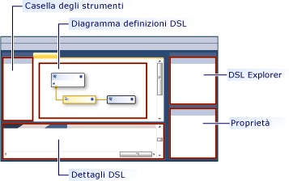
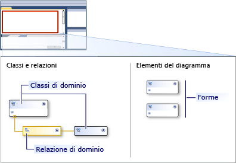
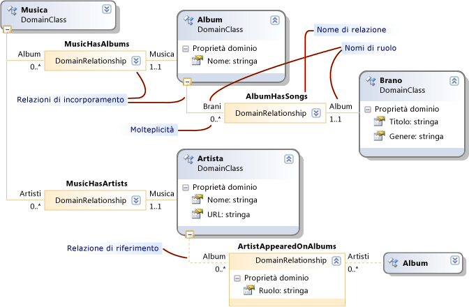

# Informazioni su modelli, classi e relazioni
Un linguaggio specifico di dominio (DSL) è definito dal relativo file di definizione DSL, insieme a qualsiasi codice programma personalizzato che è possibile scrivere. La maggior parte del codice di programma nella soluzione DSL viene generato da questo file.  
  
 In questo argomento descrive le funzionalità centrale di definizione DSL.  
  
## Definizione DSL  
 Quando si apre `Dsl\DslDefinition.dsl`, [!INCLUDE[vsprvs](../code-quality/includes/vsprvs_md.md)] finestra simile nell'immagine seguente.  
  
   
  
 Vengono visualizzate le informazioni più importanti nella definizione DSL del diagramma di definizione DSL. Informazioni aggiuntive, che fa anche parte di Dsldefinition, viene visualizzate in Esplora DSL, che in genere viene visualizzato sul lato del diagramma. È possibile utilizzare il diagramma per le attività più frequenti che con Esplora DSL per le personalizzazioni più avanzate.  
  
 Diagramma di definizione DSL vengono illustrate le classi di dominio che definiscono gli elementi del modello e le relazioni che definiscono i collegamenti tra elementi del modello. Viene inoltre le forme e connettori che consentono di visualizzare gli elementi del modello all'utente.  
  
   
  
 Quando si seleziona un elemento nella definizione DSL, nel diagramma o in Esplora DSL, informazioni su di esso viene visualizzate nella finestra Proprietà. Informazioni aggiuntive possono essere visualizzate nella finestra Dettagli DSL.  
  
### I modelli sono istanze di DSL  
 Oggetto *modello* è un'istanza del linguaggio DSL creata da un utente. Un modello contiene elementi del modello, che sono istanze delle classi di dominio che definiscono e i collegamenti tra gli elementi, che sono istanze delle relazioni di dominio che definiscono. Un modello può inoltre avere forme e connettori, che visualizza gli elementi di modello e i collegamenti in un diagramma. La definizione DSL include le classi forma, connettore classi e una classe per il diagramma.  
  
 Una definizione DSL è noto anche come un *modello di dominio*. Un modello di definizione DSL o di dominio è la rappresentazione in fase di progettazione del linguaggio specifico di dominio, mentre il modello è la creazione di istanze di runtime del linguaggio specifico di dominio.  
  
## Le classi di dominio definiscono gli elementi del modello  
 Classi di dominio vengono utilizzate per creare i vari elementi nel dominio e le relazioni di dominio sono i collegamenti tra gli elementi. Sono la rappresentazione in fase di progettazione degli elementi e i collegamenti che verranno creati dagli utenti del linguaggio specifiche di progettazione quando si creano i modelli.  
  
 Questa illustrazione mostra un modello che è stato creato dall'utente di una libreria di musica DSL. Gli album musicali sono rappresentati da caselle che contengono elenchi di brani. Artisti sono rappresentati da caselle con angoli arrotondati e sono connessi agli album a cui hanno contribuito.  
  
   
  
 Definizione DSL separa due aspetti. L'aspetto degli elementi del modello nel diagramma modello viene definito utilizzando le classi shape e connector. Le informazioni contenute nel modello vengano definite utilizzando le classi di dominio e relazioni di dominio.  
  
 Nella figura seguente mostra le classi di dominio e le relazioni nella definizione DSL del catalogo musicale.  
  
   
  
 La figura mostra quattro classi di dominio: musica, Album, artista e brano. Le classi di dominio definiscono le proprietà di dominio, ad esempio nome, titolo e così via. Nel modello di istanza, i valori di alcune di queste proprietà vengono visualizzati nel diagramma.  
  
 Tra le classi sono relazioni di dominio: MusicHasAlbums, MusicHasArtists, AlbumbHasSongs e Artistaapparsoneglialbum. Le relazioni dispongono di molteplicità, ad esempio 1..1, 0... *. Ad esempio, ogni brano deve essere correlato a un Album tramite la relazione AlbumHasSongs. Ogni Album può avere un numero qualsiasi di brani.  
  
### Ridisposizione di diagramma di definizione DSL  
 Si noti che una classe di dominio può essere visualizzati più volte nel diagramma di definizione DSL, come avviene con Album in questa immagine. È sempre presente una visualizzazione principale, e possono essere presenti alcuni *riferimento* viste.  
  
 Per modificare il diagramma di definizione DSL, è possibile:  
  
-   Scambia principale e fare riferimento alle viste tramite il **Bring Tree Here** e **Split Tree** comandi. Fare doppio clic su una classe di dominio singolo per visualizzare questi comandi.  
  
-   Riordinare le classi di dominio e le classi di forma premendo Ctrl + freccia su e Ctrl + freccia giù.  
  
-   Comprimere o espandere classi tramite l'icona in alto a destra di ciascuna forma.  
  
-   Comprimere parti della struttura ad albero facendo clic sul segno meno (-) nella parte inferiore di una classe di dominio.  
  
## Ereditarietà  
 Classi di dominio possono essere definite utilizzando l'ereditarietà. Per creare una derivazione di ereditarietà, fare clic sullo strumento ereditarietà, la classe derivata, scegliere la classe di base. Un elemento del modello include tutte le proprietà definite in una propria classe di dominio, insieme a tutte le proprietà ereditate dalla classe di base. Eredita inoltre i ruoli nelle relazioni.  
  
 Ereditarietà può essere utilizzato anche tra relazioni, forme e connettori. Ereditarietà deve mantenere nello stesso gruppo. Una forma non può ereditare da una classe di dominio.  
  
## Relazioni di dominio  
 Gli elementi del modello possono essere collegati da relazioni. I collegamenti sempre sono binari; vengono forniti collegamenti esattamente due elementi. Tuttavia, qualsiasi elemento può avere molti collegamenti ad altri oggetti, e può anche essere più di un collegamento tra la stessa coppia di elementi.  
  
 Come è possibile definire diverse classi di elementi, è possibile definire classi diverse di collegamenti. La classe di un collegamento viene chiamata un *relazione dominio*. Una relazione di dominio specifica quali classi dell'elemento che possono connettersi le relative istanze. Ogni entità finale di una relazione viene chiamato un *ruolo*, e la relazione di dominio definisce i nomi per i due ruoli, nonché per la relazione stessa.  
  
 Esistono due tipi di relazioni di dominio: incorporamento di relazioni e riferimento. Diagramma di definizione DSL, le relazioni di incorporamento presentano linee a tinta unita a ogni ruolo e le relazioni di riferimento sono tratteggiate.  
  
### Le relazioni di incorporamento  
 Ogni elemento in un modello, tranne la cui radice è la destinazione di un collegamento di incorporamento. Pertanto, l'intero modello costituisce un singolo albero di incorporamento collegamenti. Una relazione di incorporamento rappresenta contenuto o la proprietà. Due elementi del modello che sono correlati in questo modo sono anche noti come padre e figlio. Viene definito l'elemento figlio di essere incorporati nell'elemento padre.  
  
 Incorporamento di collegamenti non sono in genere visualizzati in modo esplicito come connettori in un diagramma. Al contrario, in genere sono rappresentati dal contenitore. La radice del modello è rappresentata dal diagramma e gli elementi incorporati in essa vengono visualizzati come forme nel diagramma.  
  
 Nell'esempio, la classe radice musica dispone di una relazione di incorporamento MusicHasAlbums all'Album, che ha un AlbumHasSongs incorporamento a brano. Brani vengono visualizzati come elementi in un elenco all'interno di ogni Album. Musica dispone anche di un MusicHasArtists incorporamento alla classe artista, le cui istanze vengono inoltre visualizzati come forme nel diagramma.  
  
 Per impostazione predefinita, gli elementi incorporati vengono eliminati automaticamente quando vengono eliminati i relativi elementi padre.  
  
 Quando un modello viene salvato nel file in formato XML, gli elementi incorporati sono annidati all'interno di elementi padre, a meno che non è stata personalizzata la serializzazione.  
  
> [!NOTE]
>  L'incorporamento è diverso dall'ereditarietà. Gli elementi figlio in una relazione di incorporamento non ereditano le proprietà dell'elemento padre. Incorporamento di un è un tipo di collegamento tra gli elementi del modello. Ereditarietà è una relazione tra classi e di non creare collegamenti tra elementi del modello.  
  
### Incorporamento di regole  
 Ogni elemento in un modello di istanza deve essere la destinazione di un solo collegamento incorporamento, ad eccezione della radice del modello.  
  
 Pertanto, ogni classe di dominio non astratta, ad eccezione della classe radice, deve essere la destinazione di almeno una relazione di incorporamento o ereditare un incorporamento da una classe base. Una classe può essere la destinazione di due o più incorporamenti, ma i relativi elementi di modello di istanza possono avere un solo padre in un momento. La molteplicità dalla destinazione all'origine deve essere 0..1 o 1..1.  
  
### Esplora risorse consente di visualizzare la struttura ad albero di incorporamento  
 Definizione DSL crea inoltre un elenco di cartelle, gli utenti vedono insieme il diagramma del modello.  
  
   
  
 In Esplora Mostra tutti gli elementi nel modello, anche quelli per cui non è stata definita alcuna forma. Visualizza gli elementi e relazioni di incorporamento, ma non fare riferimento a relazioni.  
  
 Per visualizzare i valori delle proprietà di dominio di un elemento, l'utente seleziona un elemento del diagramma del modello o in Esplora modelli e viene visualizzata la finestra Proprietà. Visualizza tutte le proprietà di dominio, inclusi quelli che non vengono visualizzati nel diagramma. Nell'esempio, ogni canzone dispone di un titolo e un genere, ma solo il valore del titolo viene visualizzato nel diagramma.  
  
## Relazioni di riferimento  
 Una relazione di riferimento rappresenta qualsiasi tipo di relazione che non è l'incorporamento.  
  
 Le relazioni di riferimento vengono in genere visualizzate in un diagramma come connettori tra le forme.  
  
 Nella rappresentazione XML del modello, un collegamento di riferimento tra due elementi viene espressa utilizzando *moniker.* Moniker sono, ovvero nomi che identificano in modo univoco ogni elemento nel modello. Il nodo XML per ogni elemento del modello contiene un nodo che specifica il nome della relazione e il moniker dell'elemento.  
  
## Ruoli  
 Ogni relazione di dominio ha due ruoli, un ruolo di origine e un ruolo di destinazione.  
  
 Nell'immagine seguente, la linea tra le **Publisher** classe di dominio e il **PublisherCatalog** relazione di dominio è il ruolo di origine. La linea tra la relazione di dominio e il **Album** classe di dominio è il ruolo di destinazione.  
  
 ![Ruoli e proprietà. ] (../modeling/media/propertycode.png "PropertyCode")  
  
 I nomi associati a una relazione sono particolarmente importanti quando si scrive codice programma che attraversa il modello. Ad esempio, quando si compila la soluzione DSL, la classe generata server di pubblicazione ha una proprietà di catalogo da un insieme di album. La classe Album ha una proprietà server di pubblicazione che è una singola istanza della classe di server di pubblicazione.  
  
 Quando si crea una relazione in una definizione DSL, valori predefiniti sono specificati i nomi di proprietà e relazioni. Tuttavia, è possibile modificarle.  
  
## Molteplicità  
 Molteplicità specificare quanti elementi possa avere lo stesso ruolo in una relazione di dominio. Nell'esempio, zero-a-molti (0...\*) impostazione molteplicità il **catalogo** ruolo specifica che qualsiasi istanza del **Publisher** classe di dominio può contenere tutti i **PublisherCatalog** relazione collega che si desidera assegnare ad essa.  
  
 Configurare la molteplicità di un ruolo digitando nel diagramma o modificando il `Multiplicity` proprietà di **proprietà** finestra. Nella tabella seguente vengono descritte le impostazioni per questa proprietà.  
  
|Tipo di molteplicità|Descrizione|  
|-----------------------|-----------------|  
|0... * (zero a molti)|Ogni istanza della classe di dominio può avere più istanze della relazione o alcuna istanza della relazione.|  
|0..1 (zero a uno)|Ogni istanza della classe di dominio può avere contemporaneamente più istanze della relazione o alcuna istanza della relazione.|  
|1..1 (uno)|Ogni istanza della classe di dominio può avere un'istanza della relazione. È possibile creare più di un'istanza di questa relazione da qualsiasi istanza della classe ruolo. Se la convalida è abilitata, verrà visualizzato un errore di convalida quando un'istanza della classe ruolo non dispone di alcuna istanza della relazione.|  
|1... * (uno a molti)|Ogni istanza della classe sul ruolo che ha questo molteplicità può avere più istanze della relazione e ogni istanza deve avere almeno un'istanza della relazione. Se la convalida è abilitata, verrà visualizzato un errore di convalida quando un'istanza della classe ruolo non dispone di alcuna istanza della relazione.|  
  
## Relazioni di dominio come classi  
 Un collegamento è rappresentato nell'archivio come un'istanza di LinkElement, ovvero una classe derivata di ModelElement. Nel diagramma modello dominio alle relazioni di dominio, è possibile definire queste proprietà.  
  
 È inoltre possibile rendere una relazione di origine o destinazione di altre relazioni. Nel diagramma del modello di dominio, fare doppio clic sulla relazione di dominio e quindi fare clic su **Show As Class**. Verrà visualizzata una finestra di classe aggiuntive. È quindi possibile connettere le relazioni a esso.  
  
 È possibile definire una relazione in parte per ereditarietà, proprio come con le classi di dominio. Selezionare la relazione derivata e impostare **Base relazione** nella finestra Proprietà.  
  
 Una relazione derivata specializza la relazione di base. Il dominio delle classi che devono essere derivati da collegamenti o quello utilizzato per le classi collegate da relazioni di base. Quando viene creato un collegamento della relazione derivata in un modello, è un'istanza della classe derivata sia le relazioni di base. Nel codice programma, è possibile passare all'estremità opposta del collegamento utilizzando le proprietà generate per la base o per la classe derivata.  
  
## Vedere anche  
 [Glossario sugli strumenti di linguaggio specifico di dominio](http://msdn.microsoft.com/en-us/ca5e84cb-a315-465c-be24-76aa3df276aa)

