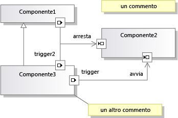

# <a name="understanding-the-dsl-code"></a>Informazioni sul codice DSL
Una soluzione di linguaggio specifico di dominio (DSL) genera un'API che è possibile usare per leggere e aggiornare le istanze del linguaggio DSL in [!INCLUDE[vsprvs](../code-quality/includes/vsprvs_md.md)]. Questa API è definita nel codice generato dalla definizione DSL. Questo argomento descrive l'API generata.  
  
## <a name="the-example-solution-component-diagrams"></a>Soluzione di esempio: Diagrammi componente  
 Per creare la soluzione che rappresenta l'origine della maggior parte degli esempi in questo argomento, creare un DSL dal **modelli componente** modello di soluzione. che è uno dei modelli standard visualizzati quando si crea una nuova soluzione DSL.  
  
> [!NOTE]
>  Il modello DSL diagrammi componente non è correlato ai diagrammi componente UML che è possibile creare tramite il menu di architettura in Visual Studio. Nel **nuovo progetto** finestra di dialogo espandere **altri tipi di progetto\extensibility** e quindi fare clic su **progettista del linguaggio specifico di dominio**.  
  
 Premere F5 e, se non si ha familiarità con questo modello di soluzione, fare delle prove. Si noti in particolare che, per creare le porte, è necessario trascinare uno strumento porta su un componente e che è possibile collegare le porte.  
  
   
  
## <a name="the-structure-of-the-dsl-solution"></a>Struttura della soluzione DSL  
 Il **Dsl** progetto definisce l'API per il linguaggio DSL. Il **DslPackage** progetto definisce l'integrazione con [!INCLUDE[vsprvs](../code-quality/includes/vsprvs_md.md)]. È anche possibile aggiungere i propri progetti, che possono anche contenere codice generato dal modello.  
  
### <a name="the-code-directories"></a>Directory di codice  
 La maggior parte del codice in ciascuno di questi progetti è generato da **Dsl\DslDefinition.dsl**. Il codice generato è nel **codice generato** cartella. Per visualizzare un file generato, fare clic su **[+]** accanto la generazione di **. tt** file.  
  
 È consigliabile esaminare il codice generato per poter comprendere il linguaggio DSL. Per visualizzare i file generati, espandere i file *.tt in Esplora soluzioni.  
  
 Il \*i file con estensione tt contengono pochissimo codice di generazione. Invece, usano le direttive `<#include>` per includere i file dei modelli condivisi. I file condivisi sono reperibili **\Programmi\Microsoft Visual Studio 10.0\Common7\IDE\Extensions\Microsoft\DSL SDK\DSL Designer\11.0\TextTemplates**  
  
 Quando si aggiunge il proprio codice programma alla soluzione DSL, aggiungerlo in un file separato, al di fuori della cartella del codice generato. È consigliabile creare un **codice personalizzato** cartella. Quando si aggiunge un nuovo file di codice a una cartella personalizzata, ricordare di correggere lo spazio dei nomi nello scheletro del codice iniziale.  
  
 È consigliabile non modificare direttamente il codice generato, perché le modifiche andranno perse quando si ricompilerà la soluzione. Invece, per personalizzare il linguaggio DSL:  
  
-   Regolare i diversi parametri nella definizione DSL.  
  
-   Scrivere le classi parziali in file di codice separati, per eseguire l'override dei metodi definiti nelle classi generate o ereditati da esse. In alcuni casi, è necessario impostare il **genera una derivata doppia** opzione di una classe nella definizione DSL, per poter eseguire l'override di un metodo generato.  
  
-   Impostare nella definizione DSL le opzioni che causano la generazione di codice in modo che forniscano degli hook per il proprio codice.  
  
     Ad esempio, se si imposta la **ha un costruttore personalizzato** opzione di una classe di dominio e quindi compilare la soluzione, verranno visualizzati messaggi di errore. Quando si fa doppio clic su uno di questi messaggi di errore, nel codice generato verranno visualizzati commenti che spiegano che cosa debba contenere il codice personalizzato.  
  
-   Scrivere i modelli di testo per generare il codice specifico dell'applicazione. È possibile usare file di inclusione per condividere le parti dei modelli comuni a più progetti ed è possibile creare modelli di progetto [!INCLUDE[vsprvs](../code-quality/includes/vsprvs_md.md)] per impostare i progetti inizializzati con la propria struttura di file.  
  
## <a name="generated-files-in-dsl"></a>File generati in DSL  
 Vengono visualizzati i seguenti file generati nel **Dsl** progetto.  
  
 *Dslutente*`Schema.xsd`  
  
 Schema per i file contenenti le istanze del linguaggio DSL. Questo file viene copiato per la compilazione (**bin**) directory. Quando si installa il linguaggio DSL, è possibile copiare questo file per **\Programmi\Microsoft Visual Studio 11.0\Xml\Schemas** in modo che sia possono convalidare i file del modello. Per ulteriori informazioni, vedere [la distribuzione di soluzioni di linguaggio specifico di dominio](../modeling/deploying-domain-specific-language-solutions.md).  
  
 Se si personalizza la serializzazione impostando le opzioni in Esplora DSL, lo schema cambierà di conseguenza. Se, tuttavia, si scrive il proprio codice di serializzazione, questo file potrebbe non rappresentare più lo schema effettivo. Per ulteriori informazioni, vedere [archiviazione File di personalizzazione e la serializzazione XML](../modeling/customizing-file-storage-and-xml-serialization.md).  
  
 `ConnectionBuilders.cs`  
  
 Un generatore di connessioni è una classe che crea relazioni. È il codice associato a uno strumento di connessione. Questo file contiene una coppia di classi per ogni strumento di connessione. I nomi sono derivati dai nomi dello strumento di connessione e relazione di dominio: *relazione*generatore e *Strumentoconnettore*ConnectAction.  
  
 Nell'esempio di soluzione componente, uno dei generatori di connessione si chiama ConnectionBuilder, ma è una coincidenza, perché la relazione di dominio è denominata Connection.  
  
 La relazione viene creata nel *relazione* `Builder.Connect()` metodo. La versione predefinita verifica che gli elementi modello di origine e di destinazione siano accettabili e quindi crea l'istanza della relazione. Ad esempio:  
  
 `CommentReferencesSubject(sourceAccepted, targetAccepted);`  
  
 Ogni classe generatore viene generata da un nodo di **generatori di connessione** sezione in Esplora DSL. Un metodo `Connect` può creare relazioni tra una o più coppie di classi di dominio. Ogni coppia viene definita da una direttiva di collegamento connessione, disponibile in Esplora DSL sotto il nodo del generatore.  
  
 Ad esempio, è possibile aggiungere a un generatore di connessioni le direttive di collegamento connessione per ciascuno dei tre tipi di relazione nel linguaggio DSL di esempio. In questo modo l'utente otterrà un solo strumento di connessione. Il tipo di relazione di cui viene creata l'istanza dipenderà dai tipi degli elementi di origine e di destinazione selezionati dall'utente.  Per aggiungere le direttive di collegamento connessione, fare clic con il pulsante destro del mouse su un generatore in Esplora DSL.  
  
 Per scrivere il codice personalizzato che viene eseguito quando viene creato un tipo specifico di relazione di dominio, selezionare la direttiva di collegamento connessione appropriata sotto il nodo del generatore. Nella finestra Proprietà impostare **Usa una connessione personalizzata**. Ricompilare la soluzione e quindi scrivere il codice per correggere gli errori risultanti.  
  
 Per scrivere codice personalizzato che viene eseguito ogni volta che l'utente utilizza questo strumento di connessione, impostare il **è personalizzato** proprietà del generatore di connessione. È possibile scrivere il codice che decide se un elemento di origine sia consentito, se una specifica combinazione di origine e destinazione sia consentita e quali aggiornamenti del modello sia necessario eseguire quando viene stabilita una connessione. Ad esempio, è possibile consentire una connessione solo se non creerà un ciclo nel diagramma. Invece di un singolo collegamento di relazione, è possibile creare un'istanza di uno schema più complesso con diversi elementi correlati tra l'origine e la destinazione.  
  
 `Connectors.cs`  
  
 Contiene le classi per i connettori, che sono gli elementi del diagramma che rappresentano in genere le relazioni di riferimento. Ogni classe è generata da un connettore nella definizione DSL. Ogni connettore viene derivata da<xref:Microsoft.VisualStudio.Modeling.Diagrams.BinaryLinkShape></xref:Microsoft.VisualStudio.Modeling.Diagrams.BinaryLinkShape>  
  
 Per rendere il colore e alcune altre funzionalità dello stile variabili in fase di esecuzione, fare doppio clic su classe nel diagramma di definizione DSL e scegliere **Aggiungi esposta**.  
  
 Per rendere funzionalità aggiuntive dello stile variabili in fase di esecuzione, vedere ad esempio <xref:Microsoft.VisualStudio.Modeling.Diagrams.TextField>e <xref:Microsoft.VisualStudio.Modeling.Diagrams.ShapeElement>.</xref:Microsoft.VisualStudio.Modeling.Diagrams.ShapeElement> </xref:Microsoft.VisualStudio.Modeling.Diagrams.TextField>  
  
 `Diagram.cs`  
  
 Contiene la classe che definisce il diagramma. Deriva da <xref:Microsoft.VisualStudio.Modeling.Diagrams.Diagram>.</xref:Microsoft.VisualStudio.Modeling.Diagrams.Diagram>  
  
 Per rendere il colore e alcune altre funzionalità dello stile variabili in fase di esecuzione, fare doppio clic su classe nel diagramma di definizione DSL e scegliere **Aggiungi esposta**.  
  
 Inoltre, questo file contiene la regola `FixupDiagram`, che risponde quando un nuovo elemento viene aggiunto al modello. La regola aggiunge una nuova forma e la collega all'elemento modello.  
  
 `DirectiveProcessor.cs`  
  
 Questo processore di direttive aiuta gli utenti a scrivere modelli di testo che leggono un'istanza del linguaggio DSL. Il processore di direttive carica gli assembly (DLL) per il linguaggio DSL e inserisce in modo efficace le istruzioni `using` per lo spazio dei nomi. Questo consente al codice dei modelli di testo di usare le classi e le relazioni definite nel linguaggio DSL.  
  
 Per ulteriori informazioni, vedere [la generazione di codice da un linguaggio specifico di dominio](../modeling/generating-code-from-a-domain-specific-language.md) e [creazione personalizzata T4 testo modello direttiva processori](../modeling/creating-custom-t4-text-template-directive-processors.md).  
  
 `DomainClasses.cs`  
  
 Implementazioni delle classi di dominio definite, incluse le classi astratte e la classe radice del modello. Derivano da <xref:Microsoft.VisualStudio.Modeling.ModelElement>.</xref:Microsoft.VisualStudio.Modeling.ModelElement>  
  
 Ogni classe di dominio contiene:  
  
-   Una definizione di proprietà e una classe di gestore annidata per ogni proprietà di dominio. È possibile eseguire l'override di OnValueChanging() e di OnValueChanged(). Per ulteriori informazioni, vedere [gestori di modifica del valore proprietà dominio](../modeling/domain-property-value-change-handlers.md).  
  
     Nel linguaggio DSL di esempio, la classe `Comment` contiene una proprietà `Text` e una classe di gestore `TextPropertyHandler`.  
  
-   Proprietà della funzione di accesso per le relazioni a cui la classe di dominio partecipa. Non ci sono classi annidate per le proprietà del ruolo.  
  
     Nel linguaggio DSL di esempio, la classe `Comment` ha funzioni di accesso che accedono al modello padre con la relazione di incorporamento `ComponentModelHasComments`.  
  
-   Costruttori. Se si desidera eseguire l'override di questi, impostare **ha un costruttore personalizzato** sulla classe di dominio.  
  
-   Metodi del gestore EGP (Element Group Prototype). Questi sono necessari se l'utente può *unione* (aggiungere) un altro elemento nelle istanze di questa classe. L'utente in genere esegue questa operazione trascinando da uno strumento elemento o da un'altra forma oppure incollando.  
  
     Nel linguaggio DSL di esempio, è possibile unire una porta di input o una porta di output in un componente. Anche componenti e commenti possono essere uniti nel modello. In  
  
     I metodi del gestore EGP nella classe dei componenti consentono a un componente di accettare le porte, ma non i commenti. Il gestore EGP nella classe radice del modello accetta commenti e componenti, ma non le porte.  
  
 `DomainModel.cs`  
  
 Classe che rappresenta il modello di dominio. Deriva da <xref:Microsoft.VisualStudio.Modeling.DomainModel>.</xref:Microsoft.VisualStudio.Modeling.DomainModel>  
  
> [!NOTE]
>  È diversa dalla classe radice del modello.  
  
 Le chiusure di copie ed eliminazioni definiscono quali altri elementi devono essere inclusi quando un elemento viene copiato o eliminato. È possibile controllare questo comportamento impostando il **propaga copia** e **Propaga eliminazione** proprietà dei ruoli su ciascun lato di ogni relazione. Per determinare i valori in modo dinamico, è possibile scrivere codice per eseguire l'override dei metodi delle classi delle chiusure. 
  
 `DomainModelResx.resx`  
  
 Contiene stringhe come le descrizioni delle classi di dominio e delle proprietà, i nomi delle proprietà, le etichette delle caselle degli strumenti, i messaggi di errore standard e altre stringhe che possono essere visualizzate per l'utente. Contiene anche le icone degli strumenti e le immagini per le forme immagine.  
  
 Questo file è associato all'assembly compilato e contiene i valori predefiniti di queste risorse. È possibile localizzare il linguaggio DSL creando un assembly satellite contenente una versione localizzata delle risorse, che verrà usata quando il linguaggio DSL verrà installato in impostazioni cultura corrispondenti alle risorse localizzate. Per ulteriori informazioni, vedere [la distribuzione di soluzioni di linguaggio specifico di dominio](../modeling/deploying-domain-specific-language-solutions.md).  
  
 `DomainRelationships.cs`  
  
 Ogni collegamento tra due elementi in un modello è rappresentato da un' istanza di una classe di relazioni di dominio. Tutte le classi di relazione sono derivate da <xref:Microsoft.VisualStudio.Modeling.ElementLink>, che a sua volta deriva da <xref:Microsoft.VisualStudio.Modeling.ModelElement>.</xref:Microsoft.VisualStudio.Modeling.ModelElement> </xref:Microsoft.VisualStudio.Modeling.ElementLink> Essendo un ModelElement, un'istanza di una relazione può avere proprietà e può essere l'origine o la destinazione di una relazione.  
  
 `HelpKeywordHelper.cs`  
  
 Contiene le funzioni usate quando l'utente preme F1.  
  
 `MultiplicityValidation.cs`  
  
 Nei ruoli delle relazioni in cui si specifica una molteplicità di 1..1 o 1..*, l'utente deve essere avvisato che è richiesta almeno un'istanza della relazione. Questo file contiene i vincoli di convalida che implementano gli avvisi. Il collegamento 1..1 di un oggetto padre di incorporamento non è verificato.  
  
 Per questi vincoli da eseguire, è necessario impostare una del **utilizza... ** opzioni di **editor\convalida** nodo in Esplora DSL. Per ulteriori informazioni, vedere [convalida in un linguaggio specifico di dominio](../modeling/validation-in-a-domain-specific-language.md).  
  
 `PropertiesGrid.cs`  
  
 Questo file contiene codice solo se un descrittore di tipo personalizzato è stato collegato a una proprietà di dominio. Per ulteriori informazioni, vedere [personalizzazione della finestra proprietà](../modeling/customizing-the-properties-window.md).  
  
 `SerializationHelper.cs`  
  
-   Metodo di convalida per verificare che due elementi non siano referenziati dallo stesso moniker. Per ulteriori informazioni, vedere [archiviazione File di personalizzazione e la serializzazione XML](../modeling/customizing-file-storage-and-xml-serialization.md).  
  
-   Classe SerializationHelper, che fornisce le funzioni usate in comune dalle classi di serializzazione.  
  
 `Serializer.cs`  
  
 Classe di serializzatori per ogni classe di dominio, relazione, forma, connettore, diagramma e modello.  
  
 Molte delle funzionalità di queste classi possono essere controllate dalle impostazioni in Esplora DSL sotto **il comportamento di serializzazione Xml**.  
  
 `Shapes.cs`  
  
 Classe per ogni classe di forme nella definizione DSL. Le forme derivano da <xref:Microsoft.VisualStudio.Modeling.Diagrams.NodeShape>.</xref:Microsoft.VisualStudio.Modeling.Diagrams.NodeShape> Per ulteriori informazioni, vedere [archiviazione File di personalizzazione e la serializzazione XML](../modeling/customizing-file-storage-and-xml-serialization.md).  
  
 Per eseguire l'override dei metodi generati con i propri metodi in una classe parziale, impostare **genera una derivata doppia** per il connettore nella definizione DSL. Per sostituire un costruttore con il proprio codice, impostare **ha un costruttore personalizzato**.  
  
 Per rendere il colore e alcune altre funzionalità dello stile variabili in fase di esecuzione, fare doppio clic su classe nel diagramma di definizione DSL e scegliere **Aggiungi esposta**.  
  
 Per rendere funzionalità aggiuntive dello stile variabili in fase di esecuzione, vedere ad esempio <xref:Microsoft.VisualStudio.Modeling.Diagrams.TextField>e <xref:Microsoft.VisualStudio.Modeling.Diagrams.ShapeElement></xref:Microsoft.VisualStudio.Modeling.Diagrams.ShapeElement> </xref:Microsoft.VisualStudio.Modeling.Diagrams.TextField>  
  
 `ToolboxHelper.cs`  
  
 Imposta la casella degli strumenti installando prototipi di gruppi di elementi negli strumenti elemento. Copie di questi prototipi vengono unite con gli elementi di destinazione quando l'utente esegue lo strumento.  
  
 È possibile eseguire l'override di `CreateElementPrototype()` per definire un elemento della casella degli strumenti che crea un gruppo di diversi oggetti. È possibile, ad esempio, definire un elemento per rappresentare oggetti che hanno sottocomponenti. Dopo aver cambiato il codice, reimpostare l'istanza sperimentale di [!INCLUDE[vsprvs](../code-quality/includes/vsprvs_md.md)] per cancellare la cache della casella degli strumenti.  
  
## <a name="generated-files-in-the-dslpackage-project"></a>File generati nel progetto DslPackage  
 DslPackage accoppia il modello DSL con la shell di [!INCLUDE[vsprvs](../code-quality/includes/vsprvs_md.md)], gestendo la finestra, la casella degli strumenti e i comandi di menu. La maggior parte delle classi sono derivate doppie ed è quindi possibile eseguire l'override dei metodi.  
  
 `CommandSet.cs`  
  
 Comandi di menu di scelta rapida visibili nel diagramma. È possibile adattare o aggiungere elementi a questo set. Questo file contiene il codice per i comandi. La posizione dei comandi nei menu è determinata dal file Commands.vsct. Per ulteriori informazioni, vedere [azioni e comandi utente scrittura](../modeling/writing-user-commands-and-actions.md).  
  
 `Constants.cs`  
  
 GUID.  
  
 `DocData.cs`  
  
 *Dslutente* `DocData` gestisce il caricamento e salvataggio di un modello di file e crea l'istanza dell'archivio.  
  
 Se, ad esempio, si vuole salvare il linguaggio DSL in un database invece che in un file, è possibile eseguire l'override dei metodi `Load` e `Save`.  
  
 `DocView.cs`  
  
 *Dslutente* `DocView` gestisce la finestra in cui viene visualizzata nel diagramma. È possibile, ad esempio, incorporare il diagramma in un Windows Form:  
  
 Aggiungere un file di controllo utente al progetto DslPackage. Aggiungere un pannello in cui visualizzare il diagramma. Aggiungere i pulsanti e gli altri controlli. Nella visualizzazione codice del form aggiungere il codice seguente, modificando i nomi in base al linguaggio DSL:  
  
```  
using System;  
using System.Collections.Generic;  
using System.ComponentModel;  
using System.Drawing;  
using System.Data;  
using System.Linq;  
using System.Text;  
using System.Windows.Forms;  
using Microsoft.VisualStudio.Modeling;  
using Microsoft.VisualStudio.Modeling.Shell;  
  
namespace Company.EmbedInForm  
{  
  public partial class UserControl1 : UserControl  
  {  
    public UserControl1()  
    {  
      InitializeComponent();  
    }  
  
    private DiagramDocView docView;  
  
    public UserControl1(DiagramDocView docView, Control content)  
      : this()  
    {  
      this.docView = docView;  
      panel1.Controls.Add(content);  
    }  
  
    private void button1_Click(object sender, EventArgs e)  
    {  
      ExampleModel modelRoot = this.docView.CurrentDiagram.ModelElement as ExampleModel;  
      foreach (ExampleElement element in modelRoot.Elements)  
      {  
       listBox1.Items.Add(element.Name);  
      }  
    }  
  }  
  internal partial class EmbedInFormDocView  
  {  
  
    private ContainerControl container;  
  
    /// <summary>  
    /// Return a User Control instead of the DSL window.   
    /// The user control will contain the DSL window.  
    /// </summary>  
  
    public override System.Windows.Forms.IWin32Window Window  
    {  
      get  
      {  
        if (container == null)  
        {  
          // Put the normal DSL Window inside our control  
          container = new UserControl1(this, (Control)base.Window);  
        }  
        return container;  
      }  
    }  
  }  
  
}  
  
```  
  
 `EditorFactory.cs`  
  
 Crea un'istanza di `DocData` e di `DocView`. Realizza un'interfaccia standard che [!INCLUDE[vsprvs](../code-quality/includes/vsprvs_md.md)] usa per aprire un editor quando viene avviato il pacchetto DSL. Viene referenziato nell'attributo `ProvideEditorFactory` in Package.cs  
  
 `GeneratedVSCT.vsct`  
  
 Individua i comandi di menu standard nei menu, ad esempio il menu di scelta rapida diagramma, il **modificare** menu e così via. Codice per i comandi in CommandSet.cs. È possibile rilocare o modificare i comandi standard ed è possibile aggiungere i propri comandi. Per ulteriori informazioni, vedere [azioni e comandi utente scrittura](../modeling/writing-user-commands-and-actions.md).  
  
 `ModelExplorer.cs`  
  
 Definisce Esplora modelli per il linguaggio DSL. È la visualizzazione struttura ad albero che l'utente vede insieme al diagramma.  
  
 È possibile, ad esempio, eseguire l'override di `InsertTreeView()` per cambiare l'ordine in cui gli elementi appaiono in Esplora modelli.  
  
 Per mantenere la selezione in Esplora modelli sincronizzata con la selezione nel diagramma, è possibile usare il codice seguente:  
  
```  
protected override void OnSelectionChanged(global::System.EventArgs e)  
{  
base.OnSelectionChanged(e);  
// get the selected element  
DslModeling::ModelElement selectedElement =   
this.PrimarySelection as DslModeling::ModelElement;  
// Select in the model explorer  
SelectInModelExplorer<YOURLANGUAGEExplorerToolWindow>(selectedElement);  
}  
private void SelectInModelExplorer<T>(DslModeling::ModelElement modelElement)  
where T : DslShell.ModelExplorerToolWindow  
{  
DslShell::ModelingPackage package =   
this.GetService(typeof(VSShell.Package)) as DslShell::ModelingPackage;  
  
if (package != null)  
{  
// find the model explorer window  
T explorerWindow = package.GetToolWindow(typeof(T), true) as T;  
if (explorerWindow != null)  
{  
// get the tree container  
DslShell.ModelExplorerTreeContainer treeContainer =   
explorerWindow.TreeContainer;  
// find the tree node  
DslShell.ExplorerTreeNode treeNode =   
treeContainer.FindNodeForElement(modelElement);  
// select the node  
explorerWindow.TreeContainer.ObjectModelBrowser.SelectedNode = treeNode;  
}  
}  
}  
  
```  
  
 `ModelExplorerToolWindow.cs`  
  
 Definisce la finestra in cui viene visualizzato Esplora modelli. Gestisce la selezione di elementi nella finestra di esplorazione.  
  
 `Package.cs`  
  
 Questo file definisce come il linguaggio DSL si integra in [!INCLUDE[vsprvs](../code-quality/includes/vsprvs_md.md)]. Gli attributi nella classe dei pacchetti registrano il linguaggio DSL come gestore per i file con l'estensione di file specificata, definiscono la casella degli strumenti e definiscono come aprire una nuova finestra. Il metodo Initialize() viene chiamato una volta quando il primo DSL viene caricato in un'istanza di [!INCLUDE[vsprvs](../code-quality/includes/vsprvs_md.md)].  
  
 `Source.extension.vsixmanifest`  
  
 Per personalizzare questo file, modificare il file `.tt`.  
  
> [!WARNING]
>  Se si modifica il file tt per poter includere risorse come icone o immagini, verificare che la risorsa venga inclusa nella build VSIX. In Esplora soluzioni selezionare il file e verificare che il **Includi in VSIX** è `True`.  
  
 Questo file controlla come il linguaggio DSL viene incluso nel pacchetto in un'estensione VSIX (Visual Studio Integration Extension). Per ulteriori informazioni, vedere [la distribuzione di soluzioni di linguaggio specifico di dominio](../modeling/deploying-domain-specific-language-solutions.md).  
  
## <a name="see-also"></a>Vedere anche  
 [Procedura: definire un linguaggio specifico di dominio](../modeling/how-to-define-a-domain-specific-language.md)   
 [Informazioni su modelli, classi e relazioni](../modeling/understanding-models-classes-and-relationships.md)   
 [Personalizzazione ed estensione di un linguaggio specifico di dominio](../modeling/customizing-and-extending-a-domain-specific-language.md)   
 [Scrittura di codice per personalizzare un linguaggio specifico di dominio](../modeling/writing-code-to-customise-a-domain-specific-language.md)

