# Use code maps to debug your applications
[!INCLUDE[vs2017banner](../code-quality/includes/vs2017banner.md)]

Le mappe codice consentono di evitare di perdersi nelle codebase di grandi dimensioni, nel codice con cui si ha poca familiarità o nel codice legacy.  Quando si esegue il debug, ad esempio, potrebbe essere necessario esaminare il codice in file e progetti diversi.  Usare le mappe codice per esplorare queste parti di codice e comprendere le relazioni tra loro.  In questo modo, non è necessario tenere traccia di questo codice a mente o creare un diagramma separato.  Se il lavoro viene interrotto, le mappe codice consentono di aggiornare la memoria relativa al codice usato.  
  
 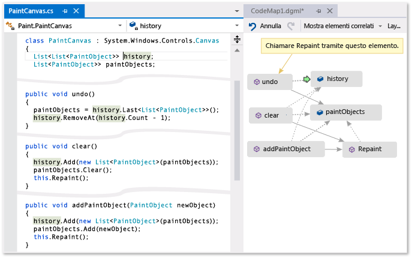  
  
 **Una freccia verde indica la posizione del cursore nell'editor**  
  
 Per informazioni dettagliate sui comandi e sulle azioni che è possibile usare quando si usano le mappe codice, vedere [Browse and rearrange code maps](../modeling/browse-and-rearrange-code-maps.md).  
  
## Informazioni sul problema  
 Si supponga che sia presente un bug in un programma di disegno su cui si sta lavorando.  Per riprodurre il bug, aprire la soluzione in Visual Studio Ultimate e premere **F5** per avviare il debug.  
  
 Quando si disegna una linea e si sceglie l'opzione **Annulla ultimo tratto** non succede niente finché non si disegna la riga successiva.  
  
 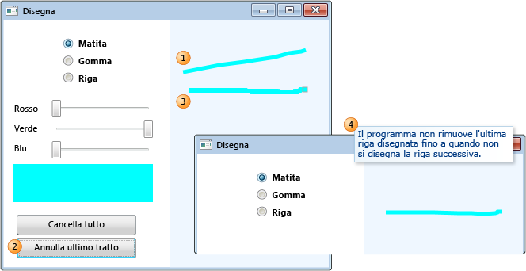  
  
 Di conseguenza, iniziare l'analisi cercando il metodo `Undo`.  Il metodo si trova nella classe `PaintCanvas`.  
  
   
  
## Avviare il mapping del codice  
 A questo punto è possibile avviare il mapping del metodo `undo` e le relative relazioni.  Nell'editor di codice aggiungere il metodo `undo` e i campi a cui viene fatto riferimento a una nuova mappa codice.  Quando si crea una nuova mappa, l'indicizzazione del codice potrebbe richiedere del tempo.  Ciò consente alle operazioni successive di essere eseguite più velocemente.  
  
   
  
> [!TIP]
>  L'evidenziazione verde indica gli ultimi elementi aggiunti alla mappa.  La freccia verde indica la posizione del cursore nel codice.  Le frecce tra gli elementi rappresentano relazioni diverse.  È possibile ottenere altre informazioni sugli elementi nella mappa spostandovi sopra il mouse ed esaminando le relative descrizioni comandi.  
  
 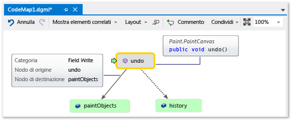  
  
## Passare al codice ed esaminarlo dal mapping  
 Per visualizzare la definizione di codice per ogni campo, fare doppio clic sul campo nella mappa o selezionare il campo e premere **F12**.  La freccia verde si sposta tra gli elementi nella mappa.  Il cursore nell'editor di codice viene spostato automaticamente.  
  
 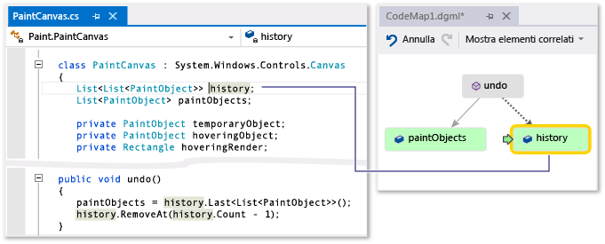  
  
 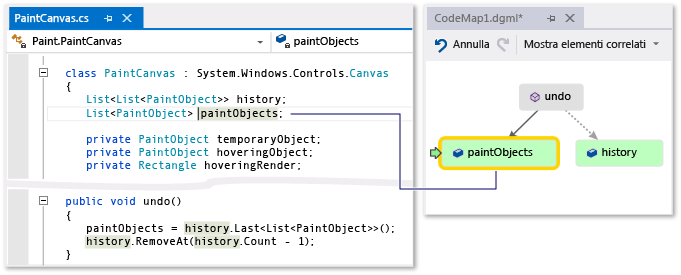  
  
> [!TIP]
>  È inoltre possibile spostare la freccia verde sulla mappa spostando il cursore nell'editor di codice.  
  
## Informazioni sulle relazioni tra parti di codice  
 A questo punto si desidera sapere quale altro codice interagisce con i campi `history` e `paintObjects`.  È possibile aggiungere tutti i metodi che fanno riferimento a questi campi alla mappa.  Questa operazione può essere eseguita dalla mappa o dall'editor di codice.  
  
 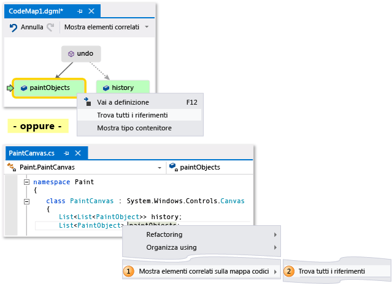  
  
   
  
> [!NOTE]
>  Se si aggiungono elementi da un progetto condiviso in più applicazioni, ad esempio Windows Phone o Windows Store, tali elementi vengono sempre visualizzati nella mappa insieme al progetto di app attualmente attivo.  Se pertanto si modifica il contesto in un altro progetto di app, il contesto nella mappa viene modificato anche per tutti gli elementi appena aggiunti dal progetto condiviso.  Le operazioni eseguite con un elemento nella mappa si applicano solo agli elementi che condividono lo stesso contesto.  
  
 Modificare il layout per ridisporre il flusso di relazioni e rendere la mappa più facile da leggere.  È inoltre possibile spostare elementi nella mappa trascinandoli.  
  
 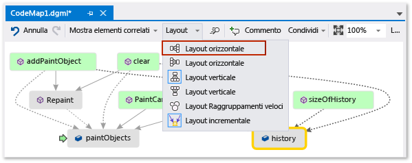  
  
> [!TIP]
>  Per impostazione predefinita, l'opzione **Layout incrementale** è attivata.  Ciò consente di ridisporre la mappa il meno possibile quando vengono aggiunti nuovi elementi.  Per ridisporre l'intera mappa ogni volta che si aggiungono nuovi elementi, disabilitare **Layout incrementale**.  
  
 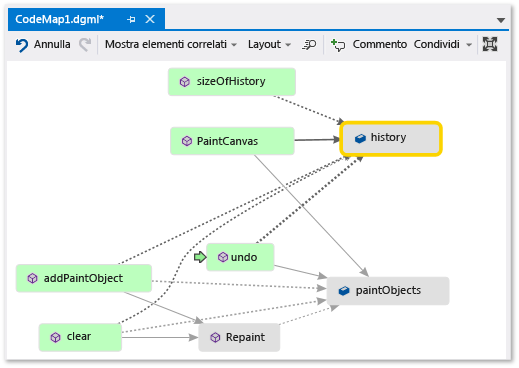  
  
 Esaminiamo questi metodi.  Nella mappa fare doppio clic sul metodo **PaintCanvas** oppure selezionarlo e premere **F12**.  Questo metodo crea `history` e `paintObjects` come elenchi vuoti.  
  
 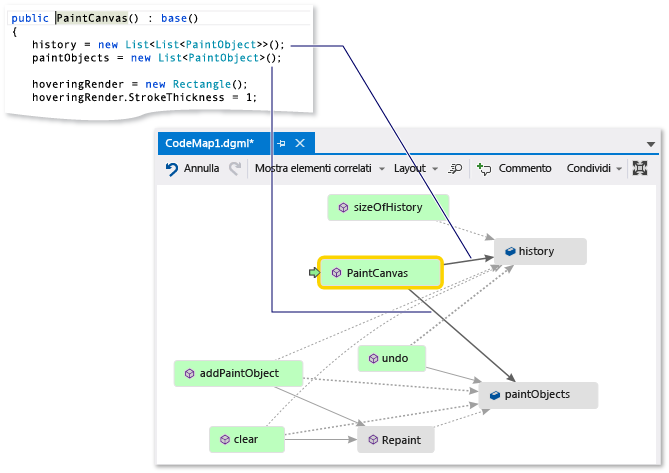  
  
 A questo punto, ripetere gli stessi passaggi per esaminare la definizione del metodo `clear`.  Il metodo `clear` esegue alcune attività con `paintObjects` e `history` e quindi chiama il metodo `Repaint`.  
  
 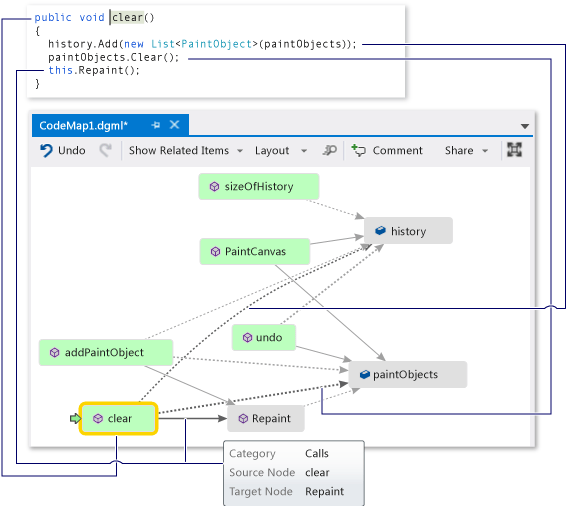  
  
 A questo punto, esaminare la definizione del metodo `addPaintObject`.  Tale metodo esegue alcune attività con `history` e `paintObjects`.  e chiama inoltre `Repaint`.  
  
 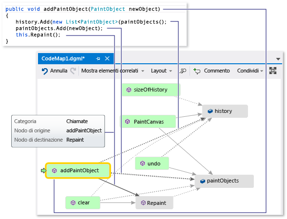  
  
## Individuare il problema esaminando il mapping  
 Sembra che tutti i metodi che modificano `history` e `paintObjects` chiamino `Repaint`.  Tuttavia il metodo `undo` non chiama `Repaint`, anche se `undo` modifica gli stessi campi.  Pertanto, è possibile risolvere il problema chiamando `Repaint` da `undo`.  
  
 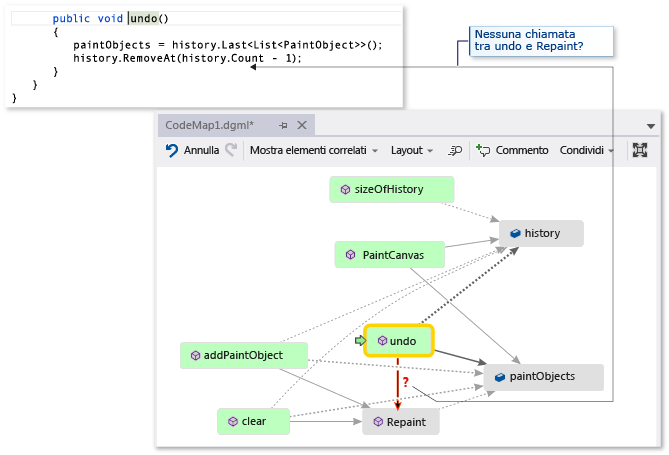  
  
 Se non fosse stata disponibile una mappa che mostrava questa chiamata mancante, sarebbe stato più difficile individuare il problema, specialmente in caso di codice più complesso.  
  
## Condividere l'individuazione e passaggi successivi  
 Prima che l'utente o un altro sviluppatore corregga il bug, è possibile inserire note nella mappa sul problema e su come correggerlo.  
  
 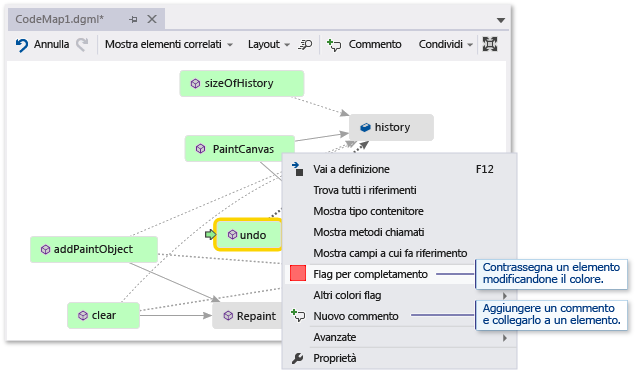  
  
 Ad esempio, è possibile aggiungere commenti alla mappa e contrassegnare gli elementi usando i colori.  
  
 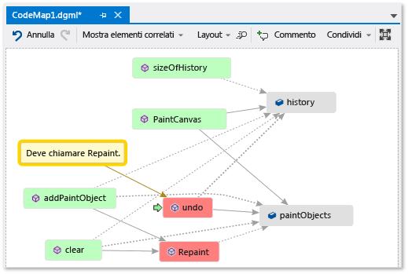  
  
 Se Microsoft Outlook è installato, è possibile inviare la mappa ad altre persone tramite posta elettronica.  È inoltre possibile esportare la mappa come un'immagine o in un altro formato.  
  
 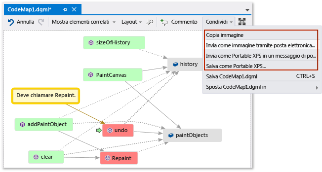  
  
## Correggere il problema e visualizzare le operazioni effettuate  
 Per correggere il bug, aggiungere la chiamata per `Repaint` a `undo`.  
  
 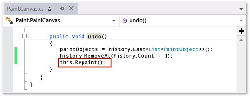  
  
 Per confermare la correzione, riavviare la sessione di debug e tentare di riprodurre il bug.  A questo punto l'opzione **Annulla ultimo tratto** funziona come previsto e consente di verificare che le correzioni apportate siano corrette.  
  
 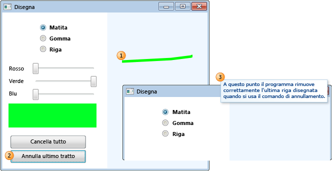  
  
 È possibile aggiornare la mappa per mostrare la correzione apportata.  
  
 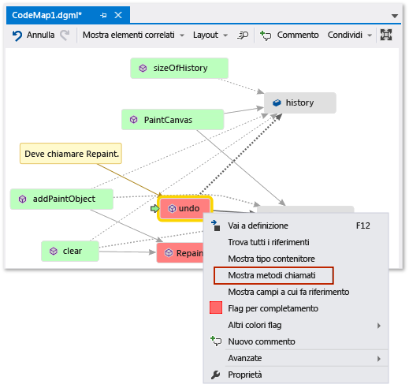  
  
 La mappa mostrerà un collegamento tra **undo** e **Repaint**.  
  
 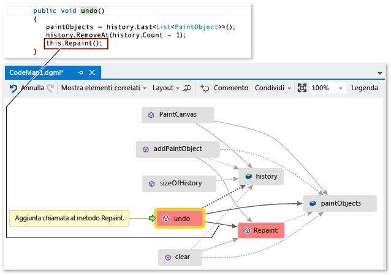  
  
> [!NOTE]
>  Quando si aggiorna la mappa, è possibile che venga visualizzato un messaggio che indica che l'indice di codice usato per creare la mappa è stato aggiornato.  Ciò significa che un utente ha modificato il codice e di conseguenza la mappa non corrisponde al codice corrente.  L'aggiornamento della mappa non verrà arrestato, ma potrebbe essere necessario ricreare la mappa per confermare che corrisponde al codice.  
  
 A questo punto l'analisi è terminata.  Il problema è stato individuato e corretto eseguendo il mapping del codice.  Si dispone inoltre di una mappa che consente di spostarsi nel codice e di ricordare quanto indicato e che mostra i passaggi eseguiti per correggere il problema.  
  
## Vedere anche  
 [Mappare i metodi sullo stack di chiamate durante il debug](../debugger/map-methods-on-the-call-stack-while-debugging-in-visual-studio.md)   
 [Visualize code](../modeling/visualize-code.md)