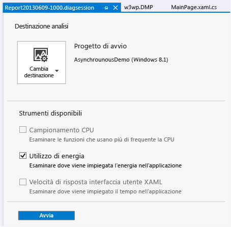
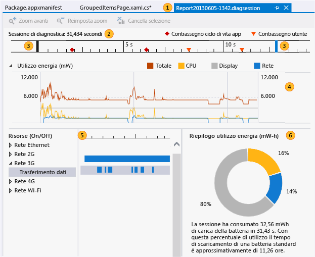
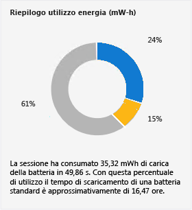

# <a name="analyze-energy-use-in-store-apps"></a>Analizzare il consumo di energia nelle app dello Store
Il profiler **Utilizzo di energia** consente di analizzare il consumo di energia e potenza delle applicazioni Windows Store su dispositivi tablet a bassa potenza alimentati completamente o in parte dalle batterie integrate. In un dispositivo alimentato a batteria, un'applicazione che utilizza una quantità eccessiva di energia può causare l'insoddisfazione del cliente al punto tale da comportarne, alla fine, la disinstallazione. L'ottimizzazione del consumo di energia può aumentare l'adozione e l'uso dell'applicazione da parte dei clienti.  
  
##  <a name="BKMK_What_the_Energy_Consumption_tool_is__how_it_works__and_what_it_measures"></a> Che cos'è il profiler Consumo di energia, come funziona e cosa misura  
 Il profiler Utilizzo di energia acquisisce le attività dello schermo, della CPU e delle connessioni di rete di un dispositivo durante una sessione di profilatura. Genera quindi stime della potenza utilizzata per tali attività e la quantità totale di energia per una sessione di profilatura.  
  
> [!NOTE]
>  Il profiler energia stima la potenza e l'utilizzo di energia tramite un modello software basato su hardware di dispositivo di riferimento standard rappresentativo dei dispositivi tablet a basso consumo sui quali potrebbe essere eseguita l'applicazione. Per fornire stime ottimali, è consigliabile raccogliere i dati del profilo su un dispositivo tablet a basso consumo.  
>   
>  Sebbene il modello fornisca buone stime per un'ampia gamma di dispositivi a basso consumo, i valori effettivi del dispositivo profilato saranno probabilmente diversi. Utilizzare i valori per individuare le attività dello schermo, della CPU e delle attività di rete dispendiose rispetto ad altri utilizzi di risorse e che potrebbero pertanto essere possibili candidati per l'ottimizzazione.  
  
 Nel profiler Utilizzo di energia vengono utilizzate queste definizioni di *potenza* ed *energia*:  
  
-   *Potenza* : misura la frequenza di utilizzo della forza per eseguire il lavoro svolto in un periodo di tempo. In elettrotecnica, l'unità di potenza standard è un *watt*, definito come la frequenza con cui viene eseguito un lavoro quando un ampere di corrente fluisce attraverso una differenza di potenziale elettrico di un volt. Nel grafico **Utilizzo energia** le unità vengono visualizzate come milliwatt **mW** che corrispondono a un millesimo di watt.  
  
     Si noti che poiché la potenza è una frequenza, presenta una direzione (il lavoro può aumentare o diminuire in un periodo di tempo) e una velocità (la quantità di aumento o diminuzione del lavoro).  
  
-   *Energia* : misura la quantità totale di potenza, come capacità o potenziale, come nella capacità di potenza di una batteria, o come il totale complessivo della potenza consumata in un periodo di tempo. L'unità di energia è un wattora, la quantità di potenza di un watt applicato continuamente per un'ora. In **Riepilogo energia**le unità vengono visualizzate come milliwatt-ore **mW-h**.  
  
   
  
 Ad esempio, la batteria completamente carica di un tablet dispone di una certa quantità di energia immagazzinata. Mentre l'energia viene utilizzata per eseguire attività quali la comunicazione in rete, il calcolo dei valori o la visualizzazione di grafica, la potenza della batteria viene consumata con frequenze diverse. In qualsiasi momento, il totale della potenza utilizzata viene misurato anche in base all'energia.  
  
##  <a name="BKMK_Identify_scenarios_with_user_marks"></a> Identificare scenari con contrassegni utente  
 Puoi aggiungere *contrassegni utente* ai dati di profilatura per identificare aree nel righello della sequenza temporale.  
  
   
  
 Il contrassegno viene visualizzato come triangolo arancione nella sequenza temporale in corrispondenza del momento in cui il metodo viene eseguito. Il messaggio e l'ora vengono visualizzati come descrizione comando al passaggio del mouse sul contrassegno. Se due o più contrassegni utente sono vicini, i contrassegni vengono uniti e i dati della descrizione comando vengono combinati. Puoi eseguire lo zoom avanti nella sequenza temporale per separare i contrassegni.  
  
 **Aggiungere contrassegni a codice C#, Visual Basic, C++**  
  
 Per aggiungere un contrassegno utente al codice C#, Visual Basic e C++, creare innanzitutto un oggetto [Windows.Foundation.Diagnostics LoggingChannel](http://msdn.microsoft.com/library/windows/apps/windows.foundation.diagnostics.loggingchannel.aspx) . In secondo luogo, inserire chiamate ai metodi [LoggingChannel.LogMessage](http://msdn.microsoft.com/library/windows/apps/dn264210.aspx) in corrispondenza dei punti nel codice che vuole contrassegnare. Usare [LoggingLevel.Information](http://msdn.microsoft.com/library/windows/apps/windows.foundation.diagnostics.logginglevel.aspx) nelle chiamate.  
  
 Al momento dell'esecuzione del metodo, verrà aggiunto un contrassegno utente ai dati di profilatura con un messaggio.  
  
> [!NOTE]
>  -   Windows.Foundation.Diagnostics LoggingChannel implementa l'interfaccia [Windows.Foundation.IClosable](/uwp/api/windows.foundation.iclosable) (proiettata come [System.IDisposable](/dotnet/api/system.idisposable) in C# e VB). Per evitare un consumo eccessivo di risorse del sistema operativo, chiamare [LoggingChannel.Close](/uwp/api/Windows.Foundation.Diagnostics.LoggingChannel) ([Windows.Foundation.Diagnostics.LoggingChannel.Dispose](/uwp/api/Windows.Foundation.Diagnostics.LoggingChannel) in C# e VB) quando non si usa più un canale di registrazione.  
> -   Ogni canale di registrazione aperto deve avere un nome univoco. Il tentativo di creare un nuovo canale di registrazione con lo stesso nome di uno non eliminato genera un'eccezione.  
  
 Per esempi, vedere [Esempio di LoggingSession](http://code.msdn.microsoft.com/windowsapps/LoggingSession-Sample-ccd52336) in Windows SDK.  
  
 **Aggiungere contrassegni al codice JavaScript**  
  
 Per aggiungere contrassegni utente aggiungi il seguente codice in corrispondenza dei punti nel codice che desideri contrassegnare:  
  
```  
if (performance && performance.mark) {  
    performance.mark(markDescription);  
}  
```  
  
 *markDescription* è una stringa che contiene il messaggio da visualizzare nella descrizione comando del contrassegno utente.  
  
##  <a name="BKMK_Configure_your_environment_for_profiling"></a> Configurare l'ambiente per la profilatura  
 Per ottenere stime ottimali, è consigliabile profilare il consumo di energia dell'applicazione su un dispositivo a basso consumo alimentato dalle batterie integrate. Poiché Visual Studio non viene eseguito nella maggior parte di questi dispositivi, è necessario connettere il computer che esegue Visual Studio al dispositivo usando Visual Studio Remote Tools. Per connetterti a un dispositivo remoto, devi configurare sia il progetto di Visual Studio che il dispositivo remoto. Per altre informazioni, vedere [Eseguire app di Windows Store in un computer remoto](../debugger/run-windows-store-apps-on-a-remote-machine.md).  
  
> [!TIP]
>  -   Sconsigliamo la profilatura dell'energia nel simulatore di Windows Store o nel computer di Visual Studio. La profilatura sul dispositivo effettivo fornisce dati molto più realistici.  
> -   Eseguire la profilatura sul dispositivo di destinazione mentre è alimentato dalle batterie.  
> -   Chiudere le altre applicazioni che potrebbero utilizzare le stesse risorse (rete, CPU o schermo).  
  
##  <a name="BKMK_Collect_energy_profile_data_for_your_app"></a> Raccogliere dati relativi al profilo energetico per l'applicazione  
  
1.  Scegliere **Avvia strumenti di diagnostica senza debug** dal menu **Debug**.  
  
       
  
2.  Scegliere **Utilizzo di energia** , quindi **Avvia**.  
  
    > [!NOTE]
    >  Quando si avvia il profiler **Utilizzo di energia** , è possibile che venga visualizzata la finestra **Controllo dell'account utente** nella quale viene richiesta l'autorizzazione a eseguire VsEtwCollector.exe. Scegliere **Sì**.  
  
3.  Verificare la funzionalità dell'applicazione per la raccolta di dati.  
  
4.  Per interrompere la profilatura, passa di nuovo a Visual Studio (ALT+TAB) e nella pagina dell'hub di diagnostica scegli **Arresta raccolta** .  
  
       
  
     Visual Studio consente di analizzare i dati raccolti e visualizzare i risultati.  
  
##  <a name="BKMK_Collect_energy_profile_data_for_an_installed_app"></a> Raccogliere dati relativi al profilo energetico per un'applicazione installata  
 Lo strumento Utilizzo di energia può essere eseguito solo su applicazioni Windows Store 8.1 avviate da una soluzione di Visual Studio o installate da Windows Store. Se una soluzione è aperta in Visual Studio, la destinazione predefinita è **Progetto di avvio**. Per impostare come destinazione un'applicazione installata:  
  
1.  Scegliere **Cambia destinazione** , quindi **Applicazione installata**.  
  
2.  Dall'elenco **Seleziona pacchetto di applicazioni installato** scegliere la destinazione.  
  
3.  Scegliere **Utilizzo di energia** nella pagina dell'hub di diagnostica.  
  
4.  Scegliere **Avvia** per iniziare la profilatura.  
  
 Per interrompere la profilatura, passa di nuovo a Visual Studio (ALT+TAB) e nella pagina dell'hub di diagnostica scegli **Arresta raccolta** .  
  
##  <a name="BKMK_Analyze_energy_profile_data"></a> Analizzare i dati relativi al profilo energetico  
 I dati relativi al profilo energetico vengono visualizzati in una finestra di documento di Visual Studio:  
  
   
  
|||  
|-|-|  
||Il file di rapporto è denominato Report*YYYYMMDD-HHMM*.diagsession. Puoi modificare il nome del file se decidi di salvarlo.|  
||La sequenza temporale mostra la durata della sessione di profilatura, gli eventi di attivazione del ciclo di vita dell'app e i contrassegni utente.|  
||Puoi limitare il rapporto a una parte della sequenza temporale trascinando le barre blu per selezionare un'area della stessa.|  
||**Utilizzo energia** è un grafico a più linee in cui viene visualizzata la modifica della potenza in uscita causata da una risorsa del dispositivo durante una sessione di profilatura. Il profiler Consumo di energia consente di tenere traccia della potenza utilizzata dalla CPU, dalle attività di rete e dallo schermo.|  
||Nel grafico **Risorse (On/Off)**  vengono fornite informazioni sui costi energetici della rete. La barra **Rete** rappresenta il tempo di apertura della connessione di rete. La barra figlio **Trasferimento dati** rappresenta il momento in cui l'app stava ricevendo o inviando dati sulla rete.|  
||In **Riepilogo utilizzo energia** viene visualizzata la quantità proporzionale di energia totale utilizzata dalla CPU, dalle attività di rete e dallo schermo nella sequenza temporale selezionata.|  
  
 **Per analizzare i dati relativi al profilo energetico**  
  
 Individua un'area in cui la potenza delle risorse ha raggiunto il massimo livello. Correlare l'area di picco alla funzionalità dell'applicazione. Utilizzare quindi le barre di controllo della sequenza temporale per eseguire lo zoom avanti sull'area. Se sei concentrato sull'utilizzo della rete, espandi il nodo **Rete** del grafico **Risorse (On/Off)**  per confrontare l'ora di apertura della connessione di rete col momento in cui l'app stava ricevendo e trasferendo dati sulla rete. La riduzione del tempo durante il quale la rete rimane inutilmente aperta costituisce un'ottimizzazione particolarmente efficace.  
  
##  <a name="BKMK_Optimize_energy_use"></a> Ottimizzare l'utilizzo di energia  
 Oltre alla trasmissione di dati, le connessioni di rete comportano un costo in termini di energia per l'inizializzazione, la gestione e la chiusura della connessione. Alcune reti mantengono aperta la connessione per un certo periodo successivo all'invio o alla ricezione dei dati per consentire la trasmissione di più dati tramite una singola connessione. Puoi utilizzare il riquadro **Risorse (On/Off)** per esaminare la modalità di interazione dell'app con la connessione.  
  
   
  
 Se le barre **Rete** e **Trasferimento dati** indicano che la connessione rimane aperta per lunghi periodi di tempo per trasmettere in modo intermittente una serie di pacchetti di dati di piccole dimensioni, puoi suddividere i dati in batch per inviarli in un'unica trasmissione, riducendo il tempo in cui la rete rimane aperta e risparmiando costi energetici.  
  
   
  
 Hai un controllo minore sui costi energetici dello schermo. La maggior parte degli schermi richiede più energia per visualizzare i colori chiari rispetto a quelli più scuri, quindi l'utilizzo di uno sfondo scuro è un modo per ridurre i costi.  
  
##  <a name="BKMK_Other_resources"></a> Altre risorse  
  
-   Nelle sezioni relative allo **stato della connessione e la gestione dei costi** per [C#/VB/C++ e XAML](http://msdn.microsoft.com/en-us/0ee0b706-8432-4d49-9801-306ed90764e1) e per [HTML e JavaScript](http://msdn.microsoft.com/en-us/372afa6a-1c7c-4657-967d-03a77cd8e933) nel Centro sviluppatori Windows vengono descritte le API di Windows che forniscono informazioni sulla connettività di rete utilizzabili nell'applicazione per ridurre il costo del traffico di rete.  
  
     Il simulatore di Visual Studio per le app di Windows Store consente di simulare le proprietà di connessione dati delle API delle informazioni di rete. Vedere [Run Windows Store apps in the simulator](../debugger/run-windows-store-apps-in-the-simulator.md)  
  
-   Gli strumenti **Temporizzazione funzione JavaScript** e **Utilizzo CPU** consentono di ridurre il carico della CPU quando è provocato da funzioni inefficienti. Vedere [Analizzare l'utilizzo della CPU](../profiling/analyze-cpu-usage-in-a-windows-universal-app.md).

## <a name="see-also"></a>Vedere anche
 [Profilatura in Visual Studio](../profiling/index.md) [Panoramica delle funzionalità di profilatura](../profiling/profiling-feature-tour.md)
