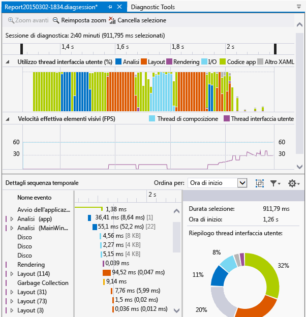
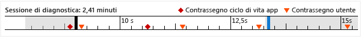
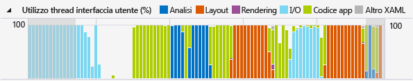
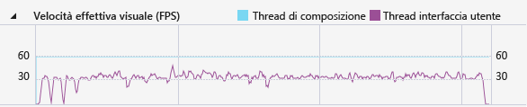

# Sequenza temporale applicazione
Utilizzare il profiler **Sequenza temporale applicazione** per individuare e correggere problemi di prestazioni correlati all’interazione dell’applicazione nelle applicazioni XAML. Questo strumento consente di migliorare le prestazioni delle applicazioni XAML fornendo una visualizzazione dettagliata dell’utilizzo delle risorse delle applicazioni. È possibile analizzare il tempo impiegato dall'applicazione nella preparazione dei fotogrammi dell'interfaccia utente (layout e rendering), per soddisfare le richieste di rete e disco e in scenari come l’avvio dell’applicazione, il caricamento delle pagine e il ridimensionamento di Windows.  
  
 **Sequenza temporale applicazione** è uno degli strumenti che possono essere avviati con il comando **Debug/Profiler prestazioni**.  
  
 Questo strumento sostituisce lo strumento **Velocità di risposta interfaccia utente XAML** che faceva parte del set di strumenti diagnostici per Visual Studio 2013.  
  
 È possibile utilizzare questo strumento sulle piattaforme seguenti:  
  
1.  App Universal Windows (su Windows 10)  
  
2.  Windows Store 8.1  
  
3.  Windows Phone 8.1 (piattaforma XAML comune)  
  
4.  Windows Presentation Foundation (.Net 4.0 e versioni successive)  
  
5.  Windows 7  
  
> [!NOTE]
>  È possibile raccogliere e analizzare i dati sull’utilizzo della CPU e sul consumo di energia insieme ai dati della **Sequenza temporale applicazione** . Vedere [Esecuzione degli strumenti di profilatura con o senza il debugger](../profiling/running-profiling-tools-with-or-without-the-debugger.md).
  
##   Raccogliere dati sulla sequenza temporale applicazione  
 È possibile profilare la velocità di risposta dell'app nel computer locale, nel dispositivo connesso, negli emulatori o nel simulatore Visual Studio o in un dispositivo remoto. Vedere [Esecuzione degli strumenti di profilatura con o senza il debugger](../profiling/running-profiling-tools-with-or-without-the-debugger.md).
  
> [!TIP]
>  Se possibile, eseguire l'app direttamente nel dispositivo. Le prestazioni dell'applicazione osservate nel simulatore o tramite Connessione Desktop remoto potrebbero non essere indicative delle prestazioni effettive nel dispositivo. D'altro canto, la raccolta di dati usando Visual Studio Remote Tools non influisce sui dati delle prestazioni.  
  
 I passaggi principali sono indicati di seguito.  
  
1.  Aprire l’app XAML.  
  
2.  Fare clic su **Debug/Profiler prestazioni**. Verrà visualizzato un elenco di strumenti di profilatura nella finestra di .diagsession.  
  
3.  Selezionare **Sequenza temporale applicazione** e fare clic su **Avvia** nella parte inferiore della finestra.  
  
    > [!NOTE]
    >  È possibile che venga visualizzata una finestra Controllo dell’account utente che richiede le autorizzazioni per l’esecuzione di VsEtwCollector.exe. Scegliere **Sì**.  
  
4.  Eseguire lo scenario di interesse per la profilatura nell'app per raccogliere dati sulle prestazioni.  
  
5.  Per interrompere la profilatura, tornare alla finestra di .diagsession e fare clic su **Arresta** nella parte superiore della finestra.  
  
     Visual Studio consente di analizzare i dati raccolti e visualizzare i risultati.  
  
       
  
##   Analizzare i dati di profilatura della sequenza temporale  
 Dopo aver raccolto i dati di profilatura, è possibile utilizzare la procedura indicata di seguito per avviare l'analisi:  
  
1.  Esaminare le informazioni nei grafici **Utilizzo thread UI** e **Velocità effettiva visuale (FPS)** , quindi utilizzare le barre di navigazione della sequenza temporale per selezionare un intervallo di tempo da analizzare.  
  
2.  Usando le informazioni contenute nel grafico **Utilizzo thread UI** o **Velocità effettiva visuale (FPS)** , esaminare i dettagli nella visualizzazione **Dettagli sequenza temporale** per individuare le possibili cause di qualsiasi mancanza apparente di velocità di risposta.  
  
###   Creare report su scenari, categorie ed eventi  
 Lo strumento **Sequenza temporale dell’applicazione** visualizza i dati temporali per scenari, categorie ed eventi correlati alle prestazioni di XAML.  
  
###   Sequenza temporale della sessione di diagnostica  
   
  
 Il righello nella parte superiore della pagina mostra la sequenza temporale per le informazioni profilate. Questa sequenza temporale si applica sia al grafico **Utilizzo di thread UI** che al grafico **Velocità effettiva visuale** . Puoi limitare l'ambito del rapporto trascinando le barre di navigazione sulla sequenza temporale per selezionare un segmento della stessa.  
  
 Nella sequenza temporale vengono inoltre visualizzati tutti i contrassegni utente inseriti e gli eventi del ciclo di vita di attivazione dell'applicazione.  
  
###   Grafico Utilizzo thread interfaccia utente  
   
  
 Il grafico **Utilizzo thread UI (%)** è un grafico a barre che visualizza la quantità relativa di tempo impiegato in una categoria durante l'estensione di una raccolta.  
  
###   Grafico Velocità effettiva elementi visivi  
   
  
 Nel grafico a linee **Velocità effettiva visuale (FPS)** vengono visualizzati i frame al secondo (FPS) nel thread UI e di composizione dell'applicazione.  
  
###   Dettagli sequenza temporale  
 Dedicare tempo all’analisi del report fornito nella visualizzazione dei dettagli. Viene fornita una visualizzazione dettagliata dell'utilizzo della CPU dell'applicazione classificata in base al sottosistema di Framework dell'interfaccia utente o al componente del sistema che ha utilizzato la CPU.  
  
 Sono supportati i seguenti eventi:  
  
|||  
|-|-|  
|**Analisi**|Tempo impiegato per l'analisi dei file XAML e la creazione di oggetti.   Espandendo un nodo **Analisi** in **Dettagli sequenza temporale** , viene visualizzata la catena di dipendenze di tutti i file XAML analizzati in seguito all'evento radice. In questo modo, è possibile identificare l'analisi di file e la creazione di oggetti non necessarie in scenari in cui le prestazioni sono un fattore importante e quindi ottimizzarle.|  
|**Layout**|Nelle applicazioni di grandi dimensioni, migliaia di elementi potrebbero apparire sullo schermo contemporaneamente. Ciò potrebbe comportare una bassa frequenza dei fotogrammi dell'interfaccia utente e una velocità di risposta dell’applicazione conseguentemente scarsa. L'evento Layout determina in modo accurato il costo del layout di ogni elemento (ad esempio il tempo impiegato in Arrange, Measure, ApplyTemplate, ArrangeOverride e ArrangeOverride) e crea le strutture ad albero visive che hanno preso parte a un passaggio di Layout. È possibile utilizzare questa visualizzazione per determinare quali strutture ad albero logiche devono essere eliminate o per valutare altri meccanismi di rinvio per ottimizzare il passaggio di layout.|  
|**Rendering**|Tempo impiegato per disegnare elementi XAML sullo schermo.|  
|**I/0**|Tempo impiegato per il recupero di dati dal disco locale o dalle risorse di rete cui è possibile accedere tramite l' [API Microsoft Windows Internet (WinINet)](https://msdn.microsoft.com/en-us/library/windows/desktop/aa385331.aspx).|  
|**Codice app**|Tempo impiegato per l'esecuzione del codice dell'applicazione (utente) non correlato all'analisi o al layout.|  
|**Altro XAML**|Tempo impiegato per l'esecuzione del codice runtime XAML.|  
  
> [!TIP]
>  Scegliere lo strumento **Utilizzo CPU** insieme allo strumento **Sequenza temporale applicazione** quando si avvia la profilatura per visualizzare metodi di app eseguiti nel thread dell'interfaccia utente. Lo spostamento di codice di app a esecuzione prolungata in un thread in background può migliorare la velocità di risposta dell'interfaccia utente.  
  
####   Personalizzazione dei dettagli della sequenza temporale  
 Usare la barra degli strumenti **Dettagli sequenza temporale** per ordinare, filtrare e specificare le annotazioni delle voci della visualizzazione **Dettagli sequenza temporale** .  
  
|||  
|-|-|  
|**Ordina per**|Ordina in base a ora di inizio o lunghezza degli eventi.|  
||Aggiunge o rimuove una categoria **Frame** di primo livello che raggruppa gli eventi per frame.|  
||Filtra l'elenco in base a categorie selezionate e alla lunghezza degli eventi.|  
||Permette di specificare le annotazioni negli eventi.|  
  
## Vedere anche  
 [Blog del team WPF: Nuovo strumento di analisi delle prestazioni dell'interfaccia utente per applicazioni WPF](http://blogs.msdn.com/b/wpf/archive/2015/01/16/new-ui-performance-analysis-tool-for-wpf-applications.aspx)   
 [Procedure consigliate per app di Windows Store scritte in C++, C# e Visual Basic](http://msdn.microsoft.com/en-us/567bcefa-5da5-4e42-a4b8-1358c71adfa2)   
 [Ottimizzazione delle prestazioni di applicazioni WPF](http://msdn.microsoft.com/Library/ac8c6aa3-3c68-4a24-9827-3b6c829c1ebf)
