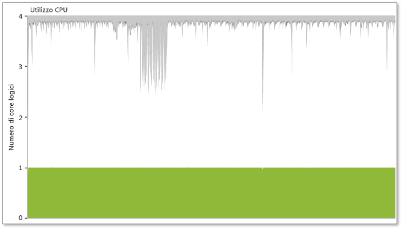
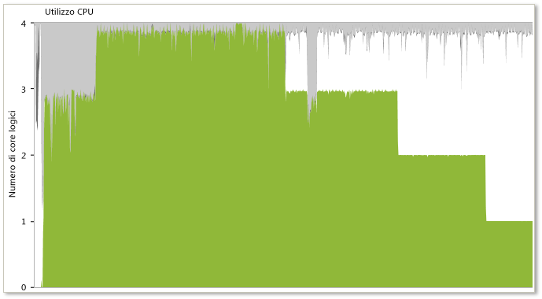
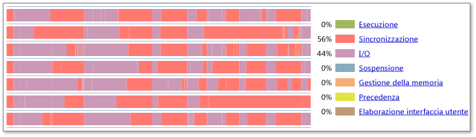
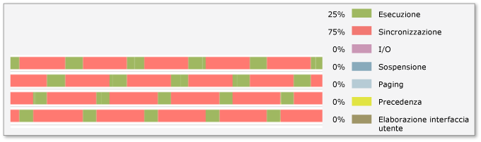

# Modelli comuni per applicazioni multithreading con comportamenti non validi
Il visualizzatore di concorrenza consente agli sviluppatori di visualizzare il comportamento di un'applicazione multithreading. Questo strumento include una raccolta di modelli comuni per applicazioni multithreading con comportamenti non validi. La raccolta include modelli visivi tipici e riconoscibili esposti tramite lo strumento, insieme a una spiegazione del comportamento rappresentato da ogni modello, il risultato probabile di tale comportamento e l'approccio più comune per risolverlo.  
  
## Conflitti di blocco ed esecuzione serializzata  
   
  
 In alcuni casi un'applicazione parallelizzata continua a funzionare in modo seriale anche se ha più thread e il computer dispone di un numero sufficiente di core logici. Il primo sintomo è costituito da scarse prestazioni multithreading, talvolta addirittura leggermente inferiori rispetto a un'implementazione seriale. In qualsiasi momento nella visualizzazione Thread non è visibile l'esecuzione di più thread in parallelo, ma di un solo thread. A questo punto, se si fa clic su un segmento di sincronizzazione in un thread, è possibile visualizzare uno stack di chiamate per il thread bloccato (stack di chiamate di blocco) e il thread che ha rimosso la condizione di blocco (stack di chiamate di sblocco). Se lo stack di chiamate di sblocco si verifica nel processo che si sta analizzando, viene visualizzato anche un connettore pronto per thread. A questo punto, dagli stack di chiamate di blocco e di sblocco è possibile passare al codice per analizzare in modo più approfondito la causa della serializzazione.  
  
 Come illustrato nella figura seguente, il visualizzatore di concorrenza può esporre questo sintomo anche nella visualizzazione Utilizzo CPU, dove è evidente che, nonostante la presenza di più thread, l'applicazione utilizza un solo core logico.  
  
 Per altre informazioni, vedere "Performance Pattern 1: Identifying Lock Contention" (Modello di prestazioni 1: identificazione dei conflitti di blocco) nel blog di Hazim Shafi [Parallel Performance Tools For Windows](http://go.microsoft.com/fwlink/?LinkID=160569) (Strumenti per le prestazioni in parallelo per Windows) nel sito Web dei blog di MSDN.  
  
   
  
## Distribuzione del carico ineguale  
   
  
 Quando si verifica una distribuzione irregolare del lavoro tra diversi thread paralleli in un'applicazione, man mano che ogni thread completa il proprio lavoro viene visualizzato un tipico modello a gradini, come illustrato nella figura precedente. Nella maggior parte dei casi il visualizzatore di concorrenza indica orari di inizio molto ravvicinati per ogni thread simultaneo. Tuttavia, anziché terminare simultaneamente, questi thread di solito terminano in modo irregolare. Questo modello indica una distribuzione irregolare del lavoro all'interno di un gruppo di thread paralleli. Ciò potrebbe causare una diminuzione delle prestazioni. L'approccio migliore a questo problema consiste nel rivalutare l'algoritmo tramite il quale il lavoro viene suddiviso tra i thread paralleli.  
  
 Come illustrato nella figura seguente, il visualizzatore di concorrenza può esporre questo sintomo anche nella visualizzazione Utilizzo CPU, dove l'utilizzo della CPU viene rappresentato sotto forma di una scala discendente.  
  
   
  
## Oversubscription  
   
  
 In caso di oversubscription, il numero di thread attivi in un processo è maggiore del numero di core logici disponibili nel sistema. L'illustrazione precedente mostra i risultati dell'oversubscription con una significativa rappresentazione per bande della precedenza in tutti i thread attivi. La legenda, poi, indica che una percentuale elevata di tempo (l'84% in questo esempio) viene impiegata nella precedenza. Questo può indicare che il processo richiede al sistema di eseguire più thread simultanei rispetto al numero di core logici. Tuttavia, questo potrebbe indicare anche che altri processi nel sistema stanno usando le risorse che dovrebbero invece essere disponibili per il processo in questione.  
  
 Quando si valuta questo problema è opportuno considerare quanto segue:  
  
-   Potrebbe essersi verificata l'oversubscription di tutto il sistema. Prendere in considerazione la possibilità che altri processi nel sistema abbiano assunto la precedenza sui thread in questione. Quando si sofferma il mouse su un segmento di precedenza nella visualizzazione Thread, un tooltip identifica il thread e il processo che ha assunto la precedenza su di esso. Quest'ultimo può non essere l'unico ad essere stato eseguito durante l'intero periodo di esecuzione del processo che interessa, ma rappresenta un indizio di ciò che ha creato la pressione di precedenza su di esso.  
  
-   Valutare in che modo il processo determina il numero di thread appropriato per l'esecuzione durante questa fase di lavoro. Se il processo calcola direttamente il numero di thread paralleli attivi, è consigliabile considerare la possibilità di modificare l'algoritmo corrispondente per tener conto in modo più efficiente del numero di core logici disponibili nel sistema. Se si usa il runtime di concorrenza, la Task Parallel Library o PLINQ, il calcolo del numero di thread viene eseguito da queste librerie.  
  
## I/O inefficiente  
   
  
 Un uso eccessivo o improprio delle operazioni di I/O è una causa comune dell'inefficienza delle applicazioni. Osservare l'illustrazione precedente. Il profilo cronologia visibile mostra che il 44% della durata visibile dei thread viene utilizzata da operazioni di I/O. La cronologia mostra un gran numero di operazioni di I/O, il che indica che l'applicazione sottoposta a profilatura è spesso bloccata da queste. Per vedere i dettagli relativi al tipo di operazioni I/O e ai punti in corrispondenza dei quali il programma si blocca, fare zoom avanti sulle aree problematiche, esaminare il profilo cronologia visibile e quindi fare clic su un blocco I/O specifico per visualizzare gli stack di chiamate correnti.  
  
## Serie di istruzioni di blocco  
   
  
 Le serie di istruzioni di blocco si verificano quando l'applicazione acquisisce blocchi in base al principio del primo arrivato e la frequenza di arrivo in corrispondenza del blocco è maggiore della frequenza di acquisizione. A causa della combinazione di queste due condizioni le richieste per il blocco iniziano ad accumularsi. Per opporsi a questo problema è possibile fare uso di blocchi "non equi", ovvero blocchi che danno accesso al primo thread che li trova in stato sbloccato. L'illustrazione precedente mostra questo tipo di comportamento delle serie di istruzioni. Per risolvere il problema, ridurre i conflitti tra gli oggetti di sincronizzazione e usare blocchi non equi.  
  
## Vedere anche  
 [Threads View](../profiling/threads-view-parallel-performance.md) (Visualizzazione thread)