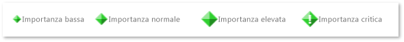
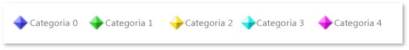

# Marcatori di flag
[!INCLUDE[vs2017banner](../code-quality/includes/vs2017banner.md)]

Un marcatore del flag rappresenta un elemento che si sia verificato un istante di tempo in un'applicazione.  Un flag può rappresentare molti tipi di eventi di applicazioni.  Ad esempio, un flag può visualizzare quando un particolare elemento di lavoro ha subito scheduling o quando un'eccezione è stata generata.  Il runtime come Task Parallel Library può anche generare i flag.  
  
## Importanza del flag  
 I flag vengono visualizzati in dimensioni differenti in base alla loro importanza.  Come il marcatore, l'importanza può essere bassa, normale, elevata, o critica.  In questa illustrazione viene mostrato l'aspetto dei marcatori per livello di importanza:  
  
   
Marcatori che illustrano l'importanza del flag  
  
## Categoria del flag  
 Un flag viene visualizzato in uno dei cinque colori diversi in base alla sua categoria.  I colori vengono riutilizzati se sono presenti più di cinque categorie.  Non è possibile selezionare il colore.  Come il marcatore, la categoria può essere un intero qualsiasi.  L'illustrazione seguente mostra i colori per le prime cinque categorie.  
  
   
Marcatori che mostrano le categorie  
  
## Avvisi  
 Un avviso è un flag colorato di rosso che rappresenta un evento critico di un'applicazione, come un'eccezione.  Di seguito è riportato un avviso:  
  
   
Un marcatore di avviso  
  
## Flag di aggregazione  
 Talvolta i flag si verificano in modo da chiudere tra di loro nel Visualizzatore della concorrenza ciò che non può essere rappresentato singolarmente.  In questo caso viene mostrato un *flag di aggregazione* grigio che rappresenta i flag sottostanti di base.  Quando si posiziona il puntatore su una di queste icone, verrà visualizzata un consiglio con il numero di flag sottostanti rappresentati.  Per visualizzare i flag, ingrandire.  Se si esegue lo zoom in qualsiasi modo e non viene ancora visualizzato un flag di aggregazione, è possibile visualizzare i flag sottostanti di base in [Rapporto marcatori](../profiling/markers-report.md).  
  
 Flag di aggregazione sono rappresentati in dimensioni differenti.  La dimensione dipende dal livello di importanza del flag più importante nell'aggregazione.  Nella figura seguente vengono illustrati i flag di aggregazione per ordine di importanza crescente.  
  
   
Flag di aggregazione per livello di importanza  
  
## Vedere anche  
 [Marcatori del visualizzatore di concorrenza](../profiling/concurrency-visualizer-markers.md)   
 [SDK del visualizzatore di concorrenza](../profiling/concurrency-visualizer-sdk.md)