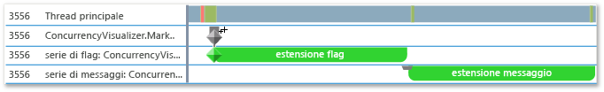
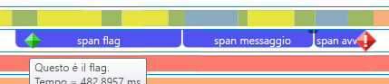
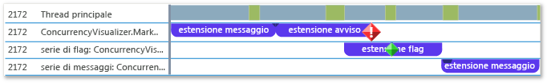

# <a name="how-to-use-the-concurrency-visualizer-markers-sdk"></a>Procedura: utilizzare l'SDK dei marcatori del visualizzatore di concorrenza
Questo argomento illustra come usare l'SDK del visualizzatore di concorrenza per creare intervalli e scrivere flag, messaggi e avvisi.  
  
### <a name="to-use-c"></a>Per usare C++  
  
1.  Aggiungere il supporto dell'SDK del visualizzatore di concorrenza all'applicazione. Per altre informazioni, vedere [SDK del visualizzatore di concorrenza](../profiling/concurrency-visualizer-sdk.md).  
  
2.  Aggiungere un'istruzione `include` e un'istruzione `using` per l'SDK.  
  
    ```C++  
  
    #include <cvmarkersobj.h>  
    using namespace Concurrency::diagnostic;  
  
    ```  
  
3.  Aggiungere il codice per creare tre intervalli nella serie di marcatori predefiniti e scrivere un flag, un messaggio e un avviso, uno per ogni intervallo. I metodi per la scrittura di flag, messaggi e avvisi sono membri della classe [marker_series](../profiling/marker-series-class.md). Il costruttore per la classe [span](../profiling/span-class.md) richiede un oggetto `marker_series`, in modo che ogni intervallo sia associato a una serie di marcatori specifica. Una classe `span` termina quando viene eliminata.  
  
    ```C++  
  
    marker_series series;  
    span *flagSpan = new span(series, 1, _T("flag span"));  
    series.write_flag(_T("Here is the flag."));  
    delete flagSpan;  
  
    span *messageSpan = new span(series, 2, _T("message span"));  
    series.write_flag(_T("Here is the message."));  
    delete messageSpan;  
  
    span *alertSpan = new span(series, 3, _T("alert span"));  
    series.write_flag(_T("Here is the alert."));  
    delete alertSpan;  
  
    ```  
  
4.  Nella barra dei menu scegliere **Analizza**, **Visualizzatore di concorrenza**, **Avvio con progetto corrente** per eseguire l'app e visualizzare il visualizzatore di concorrenza. La figura seguente mostra i tre intervalli e i tre marcatori nel visualizzatore di concorrenza.  
  
       
  
5.  Aggiungere il codice per creare un'altra serie di marcatori personalizzati chiamando il costruttore per `marker_series` che accetta un nome di stringa per la serie di marcatori.  
  
    ```C++  
  
    marker_series flagSeries(_T("flag series"));  
    span *flagSeriesSpan = new span(flagSeries, 1, _T("flag span"));  
    flagSeries.write_flag(1, _T("flag"));  
    // Sleep to even out the display in the Concurrency Visualizer.  
    Sleep(50);  
    delete flagSeriesSpan;  
  
    marker_series messageSeries(_T("message series"));  
    span *messageSeriesSpan = new span(messageSeries, 1, _T("message span"));  
    messageSeries.write_message(1, _T("message"));  
    // Sleep to even out the display in the Concurrency Visualizer.  
    Sleep(50);  
    delete messageSeriesSpan;  
  
    ```  
  
6.  Avviare il progetto corrente per visualizzare il visualizzatore di concorrenza. Le due serie di marcatori vengono visualizzate nelle rispettive corsie nella visualizzazione Thread. La figura seguente mostra i due nuovi intervalli.  
  
       
  
### <a name="to-use-visual-basic-or-c"></a>Per usare Visual Basic o C# #
  
1.  Aggiungere il supporto dell'SDK del visualizzatore di concorrenza all'applicazione. Per altre informazioni, vedere [SDK del visualizzatore di concorrenza](../profiling/concurrency-visualizer-sdk.md).  
  
2.  Aggiungere un'istruzione `using` o `Imports` per l'SDK.  
  
    ```VB  
    Imports Microsoft.ConcurrencyVisualizer.Instrumentation  
  
    ```  
  
    ```CSharp  
    using Microsoft.ConcurrencyVisualizer.Instrumentation;  
    ```  
  
3.  Aggiungere il codice per creare tre intervalli nella serie di marcatori predefiniti e scrivere un flag, un messaggio e un avviso, uno per ogni intervallo. Viene creato un oggetto <xref:Microsoft.ConcurrencyVisualizer.Instrumentation.Span> tramite la chiamata al metodo statico [EnterSpan](assetId:///EnterSpan?qualifyHint=False&autoUpgrade=True). Per scrivere nella serie predefinita, vengono usati i metodi statici di scrittura della classe <xref:Microsoft.ConcurrencyVisualizer.Instrumentation.Markers>.  
  
    ```VB  
  
    Dim flagSpan As Span = Markers.EnterSpan("flag span")  
    Markers.WriteFlag("Here is the flag.")  
    flagSpan.Leave()  
  
    Dim messageSpan As Span = Markers.EnterSpan("message span")  
    ' Sleep for a millisecond to even out the display in the Concurrency Visualizer.  
    System.Threading.Thread.Sleep(1)  
    Markers.WriteMessage("Here is a message")  
    messageSpan.Leave()  
  
    Dim alertSpan As Span = Markers.EnterSpan("alert span")  
    ' Sleep for a millisecond to even out the display in the Concurrency Visualizer.  
    System.Threading.Thread.Sleep(1)  
    Markers.WriteAlert("Here is an alert")  
    alertSpan.Leave()  
  
    ```  
  
    ```CSharp  
  
    Span flagSpan = Markers.EnterSpan("flag span");  
    Markers.WriteFlag("Here is the flag.");  
    flagSpan.Leave();  
  
    Span messageSpan = Markers.EnterSpan("message span");  
    // Sleep for a millisecond to even out the display in the Concurrency Visualizer.  
    System.Threading.Thread.Sleep(1);  
    Markers.WriteMessage("Here is a message");  
    messageSpan.Leave();  
  
    Span alertSpan = Markers.EnterSpan("alert span");  
    // Sleep for a millisecond to even out the display in the Concurrency Visualizer.  
    System.Threading.Thread.Sleep(1);  
    Markers.WriteAlert("Here is an alert");  
    alertSpan.Leave();  
    ```  
  
4.  Nella barra dei menu scegliere **Analizza**, **Visualizzatore di concorrenza**, **Avvio con progetto corrente** per eseguire l'app e visualizzare il visualizzatore di concorrenza. La figura seguente mostra i tre intervalli e i tre marcatori nella visualizzazione Thread del visualizzatore di concorrenza.  
  
       
  
5.  Aggiungere codice per creare una serie di marcatori dei clienti tramite il metodo statico <xref:Microsoft.ConcurrencyVisualizer.Instrumentation.Markers.CreateMarkerSeries%2A>. La classe <xref:Microsoft.ConcurrencyVisualizer.Instrumentation.MarkerSeries> contiene metodi per la creazione di espansioni e la scrittura di flag, messaggi e avvisi.  
  
    ```VB  
  
    Dim flagSeries As MarkerSeries = Markers.DefaultWriter.CreateMarkerSeries("flag series")  
    Dim flagSeriesSpan As Span = flagSeries.EnterSpan("flag span")  
    System.Threading.Thread.Sleep(1)  
    flagSeries.WriteFlag(1, "flag")  
    System.Threading.Thread.Sleep(1)  
    flagSeriesSpan.Leave()  
  
    Dim messageSeries As MarkerSeries = Markers.DefaultWriter.CreateMarkerSeries("message series")  
    Dim messageSeriesSpan As Span = messageSeries.EnterSpan("message span")  
    messageSeries.WriteMessage("message")  
    System.Threading.Thread.Sleep(1)  
    messageSeriesSpan.Leave()  
    ```  
  
    ```CSharp  
  
    MarkerSeries flagSeries = Markers.DefaultWriter.CreateMarkerSeries("flag series");  
    Span flagSeriesSpan = flagSeries.EnterSpan("flag span");  
    System.Threading.Thread.Sleep(1);  
    flagSeries.WriteFlag(1, "flag");  
    System.Threading.Thread.Sleep(1);  
    flagSeriesSpan.Leave();  
  
    MarkerSeries messageSeries = Markers.DefaultWriter.CreateMarkerSeries("message series");  
    Span messageSeriesSpan = messageSeries.EnterSpan("message span");  
    messageSeries.WriteMessage("message");  
    System.Threading.Thread.Sleep(1);  
    messageSeriesSpan.Leave();  
    ```  
  
6.  Avviare il progetto corrente per visualizzare il visualizzatore di concorrenza. Le tre serie di marcatori vengono visualizzate nelle rispettive corsie nella visualizzazione Thread. La figura seguente mostra i tre nuovi intervalli.  
  
       
  
## <a name="see-also"></a>Vedere anche  
 [Concurrency Visualizer SDK](../profiling/concurrency-visualizer-sdk.md) (SDK del visualizzatore di concorrenza)

