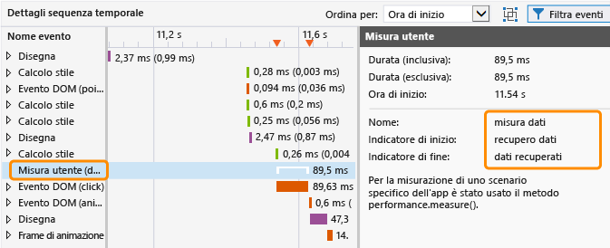
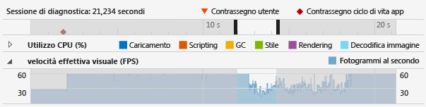
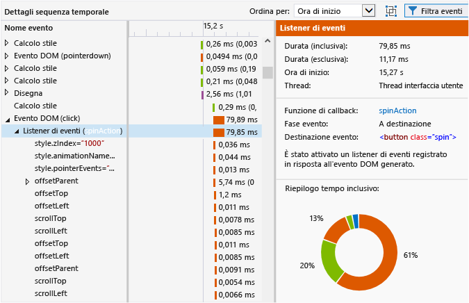
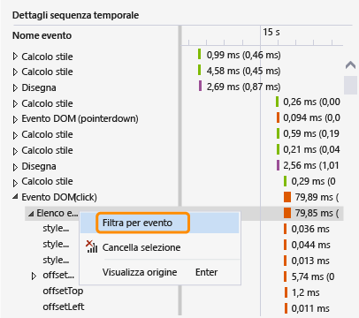
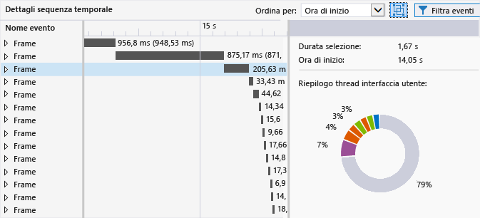

# <a name="analyze-html-ui-responsiveness-in-universal-windows-apps"></a>Analizzare la velocità di risposta dell'interfaccia utente HTML nelle app di Windows universali
Questo argomento descrive come isolare i problemi di prestazioni nelle app usando il profiler della velocità di risposta dell'interfaccia utente, uno strumento per le prestazioni disponibile per le app di Windows universali.  
  
 Questo profiler può aiutare a isolare problemi come quelli associati alla velocità di risposta dell'interfaccia utente o agli effetti collaterali della piattaforma, che si presentano in genere con questi sintomi:  
  
-   Mancanza di velocità di risposta dell'interfaccia utente. La risposta dell'app può essere lenta se il thread UI viene bloccato. Le operazioni che potrebbero bloccare il thread UI includono codice JavaScript sincrono eccessivo, layout o operazioni di calcolo CSS eccessive, richieste XHR sincrone, operazioni di Garbage Collection, tempi di disegno eccessivi o codice JavaScript che richiede un uso intensivo del processore.  
  
-   Tempo di caricamento lento per l'app o per una pagina. Questo problema è in genere dovuto a un tempo eccessivo destinato al caricamento delle risorse.  
  
-   Gli aggiornamenti visivi che sono meno frequenti del previsto. Ciò si verifica se il thread UI è troppo occupato a mantenere una frequenza dei fotogrammi uniforme. Ad esempio, se il thread UI è occupato, i fotogrammi potrebbero essere rimossi. Il lavoro di alcuni thread non UI, ad esempio le richieste di rete, la decodifica delle immagini e i disegni, può anche limitare la frequenza degli aggiornamenti visivi. (Non tutti i disegni vengono eseguiti nel thread UI).  
  
##  <a name="RunningProfiler"></a> Eseguire lo strumento della velocità di risposta dell'interfaccia HTML  
 È possibile usare lo strumento della velocità di risposta dell'interfaccia utente HTML quando un'app di Windows Universal o Windows Store funzionante è aperta in Visual Studio o è installata in un computer che esegue Windows 8 o versioni successive.  
  
1.  Se si esegue l'app da Visual Studio, nell'elenco **Avvia debug** sulla barra degli strumenti **Standard** scegliere una destinazione di distribuzione, ad esempio uno degli emulatori Windows Phone, **Computer locale**, **Simulatore**o **Computer remoto**.  
  
2.  Scegliere **Profiler prestazioni** dal menu **Debug**.  
  
     Se si vuole modificare la destinazione di analisi del profiler, scegliere **Modifica destinazione**.  
  
       
  
     Sono disponibili le seguenti opzioni per la destinazione di analisi:  
  
    -   **Progetto di avvio**. Scegliere questa opzione per analizzare il progetto di avvio corrente. Se si esegue l'app in un dispositivo o computer remoto, è necessario usare questa impostazione, che corrisponde al valore predefinito.  
  
    -   **App in esecuzione**. Scegliere questa opzione per selezionare un'app Windows Store da un elenco di app in esecuzione. Non è possibile usare questa opzione quando si esegue l'app in un dispositivo o computer remoto.  
  
         È possibile usare questa opzione per analizzare le prestazioni delle app in esecuzione nel computer quando non si ha accesso al codice sorgente.  
  
    -   **App installata**. Scegliere questa opzione per selezionare un'app installata da analizzare. Non è possibile usare questa opzione quando si esegue l'app in un dispositivo o computer remoto.  
  
         È possibile usare questa opzione per analizzare le prestazioni delle app installate nel computer quando non si ha accesso al codice sorgente. Questa opzione può essere utile anche quando si vuole semplicemente analizzare le prestazioni di qualsiasi app, al di là dello sviluppo delle app.  
  
3.  Da **Strumenti disponibili** selezionare **Velocità di risposta interfaccia utente HTML** e quindi scegliere **Avvia**.  
  
4.  Quando si avvia il profiler della velocità di risposta dell'interfaccia utente, la finestra Controllo dell'account utente potrebbe richiedere l'autorizzazione a eseguire Visual Studio ETW Collector.exe. Scegliere **Sì**.  
  
     Interagire con l'app per verificare lo scenario di prestazioni rilevante. Per un flusso di lavoro dettagliato, vedere [Isolare un problema di risposta dell'interfaccia utente](#Workflow) e [Isolare un problema di velocità effettiva visuale](#IsolateVisualThroughput).  
  
5.  Passare a Visual Studio premendo ALT+TAB.  
  
6.  Per interrompere la profilatura dell'app e visualizzare i dati raccolti dal profiler, scegliere **Arresta raccolta**.  
  
##  <a name="IsolateAnIssue"></a> Isolare un problema  
 Nella seguente sezione vengono descritti i suggerimenti per isolare i problemi di prestazioni. Per una spiegazione dettagliata della procedura di identificazione e risoluzione dei problemi di prestazioni mediante un'app di esempio per la verifica delle prestazioni, vedere [Procedura dettagliata: Miglioramento della velocità di risposta dell'interfaccia utente](../profiling/walkthrough-improving-ui-responsiveness-html.md).  
  
###  <a name="Workflow"></a> Isolare un problema di risposta dell'interfaccia utente  
 Questi passaggi forniscono un flusso di lavoro consigliato che può essere utile per usare il profiler della velocità di risposta dell'interfaccia utente in modo più efficace:  
  
1.  Aprire l'app in Visual Studio.  
  
2.  Eseguire i test dell'app per i problemi di velocità di risposta dell'interfaccia utente. Premere CTRL+F5 per avviare l'app senza debug.  
  
     Se si rileva un problema, continuare a eseguire i test per tentare di restringere l'intervallo di tempo in cui il problema si verifica o per tentare di identificare i trigger che causano il comportamento.  
  
3.  Passare a Visual Studio (ALT+TAB) e arrestare l'app (MAIUSC+F5).  
  
4.  Facoltativamente, è possibile aggiungere contrassegni utente al codice usando [Contrassegnare il codice per l'analisi](#ProfileMark).  
  
    > [!TIP]
    >  I contrassegni utente consentono di identificare il problema relativo alla velocità di risposta quando si visualizzano i dati del profiler. Ad esempio, è possibile aggiungere un contrassegno utente all'inizio e alla fine di una sezione di codice che causa un problema di velocità di risposta.  
  
5.  Eseguire il profiler della velocità di risposta dell'interfaccia utente seguendo le istruzioni della sezione precedente.  
  
6.  Impostare per l'app lo stato che restituisce un problema di velocità di risposta dell'interfaccia utente.  
  
7.  Passare a Visual Studio (premendo ALT+TAB) e scegliere **Arresta** nella scheda del profiler della velocità di risposta dell'interfaccia utente.  
  
8.  Se si sono aggiunti contrassegni utente, questi vengono riportati nella [visualizzazione della sequenza temporale della sessione di diagnostica](#Ruler) del profiler. La figura seguente mostra un contrassegno utente singolo usato per specificare una determinata operazione nel codice.  
  
       
  
9. Identificare un'area di interesse nella sequenza temporale e nei grafici del profiler usando i contrassegni utente, gli eventi del ciclo di vita dell'app o i dati visualizzati nei grafici. Di seguito sono riportate alcune linee guida che facilitano l'analisi e l'utilizzo dei dati nei grafici:  
  
    -   Usare la [visualizzazione della sequenza temporale della sessione di diagnostica](#Ruler) per visualizzare i [contrassegni del codice per l'analisi](#ProfileMark), gli eventi del ciclo di vita dell'app e la sequenza temporale associata per questi eventi e quella per i dati negli altri grafici.  
  
    -   Usare il [grafico dell'utilizzo della CPU](#CPUutilization) per visualizzare informazioni generali sull'attività della CPU e il tipo di lavoro gestito durante un periodo di tempo specifico. I periodi di attività eccessiva della CPU con più probabilità restituiscono problemi di velocità di risposta e fotogrammi rimossi.  
  
    -   Se si sta sviluppando un gioco o un'app multimediale avanzata, usare il [Visualizzare la velocità effettiva visuale (FPS)](#VisualThroughput) per identificare i periodi di tempo in cui la frequenza dei fotogrammi è diminuita.  
  
10. Selezionare l'area di interesse in uno dei grafici facendo clic su una parte del grafico e trascinando il puntatore del mouse per effettuare una selezione o tramite il tasto TAB e i tasti di direzione. Quando si seleziona un periodo di tempo, il grafico dei dettagli della sequenza temporale nel riquadro inferiore del profiler cambia per mostrare solo il periodo di tempo selezionato.  
  
     Nella figura seguente viene mostrato il grafico dell'utilizzo della CPU con un'area di interesse evidenziata.  
  
       
  
11. Nella sezione [Visualizzare i dettagli della sequenza temporale](#TimelineDetails) sono disponibili informazioni dettagliate sugli eventi che si verificano troppo spesso o il cui completamento richiede troppo tempo. Ad esempio, cercare quanto segue:  
  
    -   Listener di eventi, timer e callback del frame di animazione. A seconda dell'evento specifico, i dati forniti includono l'ID di elementi DOM modificati, il nome delle proprietà CSS modificate, un collegamento al percorso di origine e il nome della funzione di callback o dell'evento associato.  
  
    -   Eventi di script o layout che hanno prodotto elementi di rendering, ad esempio chiamate a `window.getComputedStyles`. Viene fornito l'elemento DOM associato per l'evento.  
  
    -   Pagine o risorse URL caricate dall'app, ad esempio valutazioni di script per eventi di analisi HTML. Viene fornito il nome file o la risorsa.  
  
    -   Altri eventi specificati in [Riferimento dell'evento del profiler](#ProfilerEvents).  
  
    > [!TIP]
    >  La maggior parte delle informazioni utili del profiler viene visualizzata nel grafico dei dettagli della sequenza temporale.  
  
12. Con un'area selezionata nel grafico dell'utilizzo della CPU o della velocità effettiva visuale (FPS), scegliere **Zoom avanti** (il pulsante o il menu di scelta rapida) per ottenere informazioni più dettagliate. La sequenza temporale del grafico cambia per visualizzare solo il periodo di tempo selezionato.  
  
13. Dopo aver fatto zoom avanti, selezionare una parte del grafico dell'utilizzo della CPU o della velocità effettiva visuale. Quando si esegue una selezione, il grafico dei dettagli della sequenza temporale nel riquadro inferiore del profiler cambia per mostrare solo il periodo di tempo selezionato.  
  
###  <a name="IsolateVisualThroughput"></a> Isolare un problema di velocità effettiva visuale  
 I periodi di utilizzo eccessivo della CPU possono comportare frequenze fotogrammi basse o incoerenti. Se si sviluppano giochi e app multimediali avanzate, il grafico della velocità effettiva visuale può fornire dati più importanti del grafico dell'utilizzo della CPU.  
  
 Per isolare un problema di velocità effettiva visuale, seguire i passaggi descritti nella sezione precedente, ma usare il grafico della velocità effettiva visuale come uno dei punti chiave.  
  
###  <a name="ProfileMark"></a> Contrassegnare il codice per l'analisi  
 Per isolare una sezione del codice dell'app associata ai dati che compaiono nei grafici, è possibile aggiungere una chiamata di funzione nell'app per indicare al profiler di inserire un contrassegno utente (un triangolo invertito) nella sequenza temporale al momento dell'esecuzione della funzione. Qualsiasi contrassegno utente aggiunto compare nella sequenza temporale per il grafico dell'utilizzo della CPU, il grafico della velocità effettiva visuale e il grafico dei dettagli della sequenza temporale.  
  
 Per aggiungere un contrassegno utente, aggiungere all'app il codice seguente. In questo esempio si utilizza "getting data" come descrizione dell'evento.  
  
```javascript  
if (performance && performance.mark) {  
    performance.mark("getting data");  
}  
  
```  
  
 La descrizione dell'evento compare come descrizione comando quando si posiziona il puntatore del mouse sul contrassegno utente. È possibile aggiungere tutti i contrassegni utente necessari.  
  
> [!NOTE]
> Anche  `console.timeStamp`, un comando Chrome, è visualizzato come contrassegno utente.  
  
 La figura seguente mostra il righello di diagnostica con un unico contrassegno utente e la relativa descrizione comando.  
  
   
  
 È possibile anche creare eventi generati da strumenti nella visualizzazione dei dettagli della sequenza temporale per mostrare il tempo trascorso tra due contrassegni utente. Il codice seguente permette di aggiungere un secondo contrassegno utente e una misura del tempo trascorso tra l'esecuzione dei due contrassegni utenti. Il codice precedente mostra il primo contrassegno utente.  
  
```javascript  
if (performance.mark && performance.measure) {  
    performance.mark("data retrieved");  
    performance.measure("data measure", "getting data", "data retrieved");  
}  
```  
  
 Se il secondo contrassegno utente non è specificato, `performance.measure` usa un timestamp come secondo contrassegno utente. Il primo contrassegno utente è obbligatorio.  
  
 La misurazione della durata è visualizzata come evento **Misura utente** nella visualizzazione dei dettagli della sequenza temporale. Se si seleziona questo evento, saranno mostrate informazioni dettagliate.  
  
   
  
##  <a name="AnalyzeData"></a> Analizzare i dati  
 Nelle sezioni seguenti vengono fornite le informazioni per interpretare i dati visualizzati nel profiler.  
  
###  <a name="Ruler"></a> Visualizzare la sequenza temporale della sessione di diagnostica  
 Il righello nella parte superiore del profiler mostra la sequenza temporale delle informazioni profilate. Questa sequenza temporale è applicabile sia al grafico dell'utilizzo della CPU che al grafico della velocità effettiva visuale.  
  
 Ecco come appare la sequenza temporale della sessione di diagnostica con una descrizione comando visualizzata per diversi eventi del ciclo di vita dell'app:  
  
   
  
 La sequenza temporale mostra quando si verificano eventi del ciclo di vita dell'app, ad esempio l'evento di attivazione, nonché i contrassegni utente (triangoli con l'etichetta Contrassegno utente) che è possibile aggiungere al codice. È possibile selezionare gli eventi per visualizzare descrizioni comandi con informazioni aggiuntive. Per altre informazioni sui contrassegni utente, vedere [Contrassegnare il codice per l'analisi](#ProfileMark) in questo argomento.  
  
 Gli eventi del ciclo di vita dell'app vengono visualizzati come simboli a forma di rombo. Si tratta di eventi DOM che includono i seguenti:  
  
-   Eventi `DOMContentLoaded` e `Load`, che in genere si verificano nel gestore eventi attivato nel codice. Una descrizione comando per l'evento mostra l'evento specifico e l'URL.  
  
-   Un evento di navigazione, che si verifica quando passi a una pagina diversa. Una descrizione comando per l'evento mostra l'URL della pagina di destinazione.  
  
###  <a name="CPUUtilization"></a> Visualizzare l'utilizzo della CPU  
 Il grafico dell'utilizzo della CPU consente di identificare i periodi di tempo in cui l'attività della CPU è eccessiva. Fornisce informazioni sull'utilizzo medio della CPU da parte dell'app in un periodo di tempo. Le informazioni sono contraddistinte da colori per rappresentare le seguenti categorie specifiche: **Caricamento**, **Scripting**, Garbage Collection (**GC**), **Stile**, **Rendering**e **Decodifica immagine**. Per altre informazioni su queste categorie, vedere [Riferimento dell'evento del profiler](#ProfilerEvents) più avanti in questo argomento.  
  
 Il grafico dell'utilizzo della CPU mostra la quantità di tempo trascorso in tutti i thread dell'app, combinando i valori di utilizzo per una o più CPU in un singolo valore percentuale. Il valore di utilizzo della CPU può superare il 100% quando sono in uso più CPU.  
  
> [!NOTE]
>  L'utilizzo della GPU non compare nel grafico.  
  
 Questo esempio mostra l'aspetto del grafico relativo all'utilizzo della CPU:  
  
   
  
 Usare questo grafico per:  
  
-   Identificare aree problematiche generali.  
  
-   Scegliere un periodo di tempo specifico da visualizzare nel grafico dei dettagli della sequenza temporale. Fare clic su una parte del grafico e trascinare il puntatore del mouse per effettuare la selezione di un periodo di tempo specifico.  
  
-   Scegliere il pulsante **Zoom avanti** per ottenere una visualizzazione più dettagliata di un periodo di tempo selezionato.  
  
 Per altre informazioni sull'uso del grafico, vedere [Isolare un problema di risposta dell'interfaccia utente](#Workflow) in questo argomento.  
  
###  <a name="VisualThroughput"></a> Visualizzare la velocità effettiva visuale (FPS)  
 Il grafico della velocità effettiva visuale consente di identificare i periodi di tempo in cui la frequenza dei fotogrammi è diminuita. Mostra i fotogrammi al secondo (FPS) dell'app. Questo grafico risulta particolarmente utile per lo sviluppo di giochi e app multimediali avanzate.  
  
 Il valore FPS visualizzato potrebbe essere diverso dalla frequenza dei fotogrammi effettiva. Tenere presente queste informazioni durante l'esame dei dati del grafico:  
  
-   Il grafico mostra la frequenza dei fotogrammi che l'app è in grado di raggiungere in un dato momento. Quando l'app è inattiva, la frequenza dei fotogrammi è uguale alla frequenza di aggiornamento del monitor.  
  
-   Il grafico mostra la frequenza dei fotogrammi effettiva se l'app esegue operazioni che richiedono aggiornamenti visivi.  
  
-   Il grafico mostra un valore zero se i fotogrammi vengono rimossi.  
  
 Questo esempio mostra l'aspetto del grafico relativo alla velocità effettiva visuale:  
  
   
  
 Usare il grafico della velocità effettiva visuale per:  
  
-   Identificare aree problematiche generali.  
  
-   Scegliere un periodo di tempo specifico da visualizzare nel grafico dei dettagli della sequenza temporale. Fare clic su una parte del grafico e trascinare il puntatore del mouse per effettuare la selezione di un periodo di tempo specifico.  
  
-   Scegliere il pulsante **Zoom avanti** per ottenere una visualizzazione più dettagliata di un periodo di tempo selezionato.  
  
###  <a name="TimelineDetails"></a> Visualizzare i dettagli della sequenza temporale  
 Il grafico dei dettagli della sequenza temporale viene visualizzato nel riquadro inferiore del profiler della velocità di risposta dell'interfaccia utente. Fornisce informazioni sequenziali e gerarchiche sugli eventi che utilizzano la maggior quantità di tempo della CPU durante i periodi di tempo selezionati. Il grafico può aiutare a determinare la causa un evento particolare e, per alcuni eventi, la modalità di mapping dell'evento al codice sorgente. Questo grafico è utile anche per determinare il tempo necessario per disegnare sullo schermo gli aggiornamenti visivi.  
  
 Il grafico mostra anche il lavoro del thread UI e il lavoro dei thread in background che possono contribuire a rallentare gli aggiornamenti visivi. Il grafico non mostra il lavoro della compilazione JIT JavaScript, il lavoro asincrono della GPU, il lavoro eseguito all'esterno del processo host (ad esempio per RuntimeBroker.exe e dwm.exe) o il lavoro per le aree di Windows Runtime che non sono ancora state instrumentate per la profilatura (come le operazioni di I/O del disco).  
  
> [!TIP]
>  Quando si verifica un evento in un thread in background, l'ID thread viene visualizzato tra parentesi accanto al nome dell'evento.  
  
 Questo esempio mostra l'aspetto del grafico dei dettagli della sequenza temporale quando viene selezionato il listener di eventi per un evento di clic su DOM:  
  
   
  
 In questa figura il gestore dell'evento **spinAction** nella colonna **Nome evento** è un collegamento che, se selezionato, conduce al gestore dell'evento nel codice sorgente. Nel riquadro destro la proprietà **Funzione di callback** fornisce lo stesso collegamento al codice sorgente. Altre proprietà forniscono inoltre informazioni sull'evento, ad esempio l'elemento DOM associato.  
  
 Se si seleziona una parte della sequenza temporale per il grafico dell'utilizzo della CPU e per quello della velocità effettiva visuale (FPS), il grafico dei dettagli della sequenza temporale mostra informazioni dettagliate per il periodo di tempo selezionato.  
  
 Gli eventi nel grafico dei dettagli della sequenza temporale sono contraddistinti dal colore per rappresentare le stesse categorie di lavoro che compaiono nel grafico dell'utilizzo della CPU. Per altre informazioni sulle categorie di eventi e sugli eventi specifici, vedere [Riferimento dell'evento del profiler](#ProfilerEvents) in questo argomento.  
  
 Usare il grafico dei dettagli della sequenza temporale per:  
  
-   Visualizzare l'ora di inizio, la durata e l'ora di fine approssimative di un evento in una sequenza temporale e nella visualizzazione griglia. Il grafico dei dettagli della sequenza temporale può mostrare periodi che variano da 30 millisecondi a 30 secondi nella visualizzazione griglia, a seconda dello stato di zoom. Per i valori di durata:  
  
    -   I tempi inclusivi rappresentano la durata dell'evento inclusi gli elementi figlio dell'evento. Questo valore compare per primo nella visualizzazione griglia.  
  
    -   I tempi esclusivi rappresentano la durata dell'evento esclusi gli elementi figlio dell'evento. Questo valore compare tra parentesi nella visualizzazione griglia.  
  
-   Espandere un evento nella gerarchia per visualizzare gli elementi figlio dell'evento. Gli elementi figlio dell'evento sono altri eventi generati dall'evento padre. Ad esempio, un evento DOM può avere listener di eventi che appaiono come elementi figlio. Un listener di eventi può avere generato altri eventi, ad esempio un evento layout.  
  
-   Ordinare eventi in base all'ora di inizio (impostazione predefinita) o alla durata. Usare l'elenco **Ordina per** per selezionare un metodo di ordinamento.  
  
-   Visualizzare i dettagli per ogni evento nel riquadro dei dettagli (riquadro di destra). Le proprietà variano in base al particolare evento, come illustrato negli esempi seguenti:  
  
    -   Per timer, listener di eventi (eventi DOM) e callback dei frame di animazione, la proprietà **Funzione di callback** fornisce un collegamento al percorso del codice sorgente insieme al nome del gestore dell'evento o della funzione di callback.  
  
    -   Per i timer, i listener di eventi (eventi DOM), gli eventi di layout e i callback dei fotogrammi di animazione, un riepilogo con codifica colori dell'evento selezionato e tutti i relativi elementi figlio sono visibili nella sezione **Riepilogo tempo inclusivo** (anello con codifica colori). Ogni sezione dell'immagine contraddistinta dal colore rappresenta un tipo di evento. Le descrizioni comandi forniscono il nome del tipo di evento.  
  
    > [!TIP]
    >  Il grafico dei dettagli della sequenza temporale e **Riepilogo tempo inclusivo** possono aiutare a identificare aree per l'ottimizzazione. Se una di queste visualizzazioni mostra numeri elevati di piccole attività, l'evento può essere un candidato per l'ottimizzazione. È ad esempio possibile che un'app aggiorni gli elementi DOM molto frequentemente, con conseguente aumento del numero di eventi di layout e di analisi HTML. È possibile ottimizzare le prestazioni suddividendo in batch il lavoro.  
  
###  <a name="FilterTimelineDetails"></a> Filtrare i dettagli della sequenza temporale  
 È possibile filtrare la visualizzazione nei dettagli della sequenza temporale in base a un evento particolare selezionando **Filtra per evento** dal menu di scelta rapida per un evento specifico. Quando si sceglie questa opzione, l'ambito della sequenza temporale e della visualizzazione viene definito sull'evento selezionato. La selezione nel grafico dell'utilizzo della CPU definisce l'ambito sull'evento specifico.  
  
   
  
###  <a name="FilterEvents"></a> Filtrare gli eventi  
 È possibile filtrare alcuni eventi dal grafico dei dettagli della sequenza temporale per ridurre il rumore nei dati o eliminare i dati non attinenti allo scenario specifico. È possibile filtrare in base al nome o alla durata degli eventi oppure in base a filtri specifici descritti in questo argomento.  
  
 Per filtrare la decodifica immagine, il download speculativo e gli eventi GC, deselezionare l'opzione **Attività in background** dall'icona filtro nel riquadro inferiore. Poiché questi eventi non sono molto utilizzabili, sono nascosti per impostazione predefinita.  
  
   
  
 Per filtrare gli eventi di richiesta HTTP, deselezionare l'opzione **Traffico di rete** dall'icona filtro nel riquadro inferiore. Per impostazione predefinita, questi eventi sono visibili nel grafico dettagli della sequenza temporale.  
  
 Per escludere l'attività del thread dell'interfaccia utente dal filtro, deselezionare l'opzione **Attività dell'interfaccia utente** .  
  
> [!TIP]
>  Deselezionare questa opzione e quindi selezionare l'opzione Traffico di rete per esaminare i problemi relativi alla latenza di rete.  
  
 Per escludere le misure utente da filtro, deselezionare l'opzione **Misure utente** . Le misure utente sono eventi di primo livello senza elementi figlio.  
  
###  <a name="GroupFrames"></a> Raggruppare gli eventi per frame  
 È possibile raggruppare gli eventi inclusi nella visualizzazione dei dettagli della sequenza temporale in base a singoli frame. Questi eventi frame sono eventi generati da strumenti e rappresentano i contenitori eventi di primo livello per tutte le operazioni dei thread dell'interfaccia utente che si verificano tra eventi Paint. Per abilitare questa visualizzazione, selezionare **Raggruppa eventi di primo livello in base ai frame**.  
  
   
  
 Quando si raggruppano gli eventi in base ai frame, ogni evento di primo livello nella visualizzazione dei dettagli della sequenza temporale rappresenta un frame.  
  
   
  
##  <a name="SaveSession"></a> Salvare una sessione di diagnostica  
 In Visual Studio è possibile salvare una sessione di diagnostica quando si chiude la scheda associata alla sessione. Le sessioni salvate possono essere riaperte in un momento successivo.  
  
##  <a name="ProfilerEvents"></a> Riferimento dell'evento del profiler  
 Gli eventi del profiler sono suddivisi in categorie e contraddistinti dal colore nel profiler della velocità di risposta dell'interfaccia utente. Ecco le categorie di eventi:  
  
-   **Caricamento.** Indica il tempo impiegato per il recupero delle risorse dell'app e l'analisi di HTML e CSS al primo caricamento dell'app. Può includere le richieste di rete.  
  
-   **Scripting.** Indica il tempo impiegato per l'analisi e l'esecuzione di JavaScript. Include eventi DOM, timer, valutazione script e il lavoro dei frame di animazione. Include sia il codice utente che il codice di libreria.  
  
-   **GC.** Indica il tempo impiegato nell'operazione di Garbage Collection.  
  
-   **Stile.** Indica il tempo impiegato per l'analisi di CSS e il calcolo del layout e della presentazione dell'elemento.  
  
-   **Rendering.** Indica il tempo impiegato per disegnare lo schermo.  
  
-   **Decodifica immagine.** Indica il tempo impiegato per la decompressione e la decodifica delle immagini.  
  
 Per le categorie relative a script e stile, il profiler della velocità di risposta dell'interfaccia utente potrebbe fornire dati su cui è possibile intervenire nel grafico dei dettagli della sequenza temporale. Se ci si rende conto che si tratta di un problema di scripting, è possibile eseguire il profiler di campionamento della CPU con il profiler della velocità di risposta interfaccia utente. In alternativa, è possibile usare il profiler di funzioni di Visual Studio per ottenere dati più dettagliati. Per altre informazioni, vedere [Memoria JavaScript](../profiling/javascript-memory.md).  
  
 Per le altre categorie di eventi, è possibile che si identifichino gli effetti collaterali della piattaforma che derivano dall'aggiunta di funzionalità all'app, ma in questi casi è possibile che non si riesca a risolvere i problemi di prestazioni specifici tramite il profiler della velocità di risposta dell'interfaccia utente.  
  
 Questa tabella mostra gli eventi e le relative descrizioni:  
  
|Evento|Categoria di eventi|Quando si verifica|  
|-----------|--------------------|-----------------|  
|Analisi CSS|Caricamento|È stato rilevato nuovo contenuto CSS e ne è stata tentata l'analisi.|  
|Analisi HTML|Caricamento|È stato rilevato nuovo contenuto HTML ed è stata tentata l'analisi del contenuto nei nodi e l'inserimento del contenuto nell'albero DOM.|  
|Richiesta HTTP|Caricamento|Una risorsa remota è stata trovata nel DOM o è stato creato un evento XMLHttpRequest che ha generato una richiesta HTTP.|  
|Download speculativo|Caricamento|Sono state cercate le risorse richieste nel contenuto HTML della pagina in modo da consentire una pianificazione rapida delle successive richieste HTTP di risorse.|  
|Callback del frame di animazione|Scripting|Il browser stava per eseguire il rendering di un altro frame e questo ha attivato una funzione di callback fornita dall'app.|  
|Evento DOM|Scripting|Un evento DOM si è verificato ed è stato eseguito.<br /><br /> La proprietà `context` per l'evento DOM, ad esempio  `DOMContentLoaded` o `click`, è racchiusa tra parentesi.|  
|Listener di eventi|Scripting|Un listener di eventi è stato chiamato ed eseguito.|  
|Listener query supporti|Scripting|Una query supporti registrata è stata invalidata e ciò ha provocato l'esecuzione del listener o dei listener associati.|  
|Mutation observer|Scripting|Uno o più elementi DOM osservati sono stati modificati e ciò ha provocato l'esecuzione di un callback associato di MutationObserver.|  
|Valutazione script|Scripting|Un nuovo elemento SCRIPT è stato trovato nel DOM ed è stata tentata l'analisi e l'esecuzione dello script.|  
|Timer|Scripting|Un timer pianificato è scaduto e questo ha comportato l'esecuzione della funzione di callback associata.|  
|Callback asincrono di Windows Runtime|Scripting|Un'operazione asincrona che attiva una funzione di callback `Promise` è stata completata da un oggetto Windows Runtime.|  
|Evento Windows Runtime|Scripting|Un evento che si è verificato in un oggetto Windows Runtime ha attivato un listener registrato.|  
|Garbage Collection|GC|Tempo impiegato per raccogliere la memoria per gli oggetti non più utilizzati.|  
|Calcolo CSS|Stile|Modifiche apportate al DOM che hanno richiesto il ricalcolo delle proprietà di stile di tutti gli elementi interessati.|  
|Layout|Stile|Modifiche apportate al DOM che hanno richiesto il ricalcolo delle dimensioni e/o della posizione di tutti gli elementi interessati.|  
|Disegna|Rendering|Sono state apportate modifiche visive al DOM ed è stata tentata una nuova esecuzione del rendering di parti della pagina.|  
|Rendering del livello|Rendering|Sono state apportate modifiche visive a un frammento del DOM (denominato livello) di cui è stato eseguito il rendering in modo indipendente e le modifiche hanno richiesto il rendering di una parte della pagina.|  
|Decodifica immagine|Decodifica immagine|Un'immagine è stata inclusa nel DOM ed è stata tentata la decompressione e la decodifica dell'immagine dal formato originale in una bitmap.|  
|Frame|N/D|A causa delle modifiche visive apportate a DOM, tutte le parti interessate della pagina sono state ridisegnate. Evento generato da strumenti e usato per il raggruppamento.|  
|Misura utente|N/D|Uno scenario specifico dell'app è stato misurato tramite il metodo `performance.measure` . Evento generato da strumenti e usato per l'analisi di codice.|  
  
##  <a name="Tips"></a> Informazioni aggiuntive  
  
-   Guardare [il video](http://channel9.msdn.com/Events/Build/2013/3-316) della conferenza Build 2013 sul profiler della velocità di risposta dell'interfaccia utente.  
  
-   Leggere i suggerimenti sulle prestazioni per le app di Windows Store compilate per Windows utilizzando JavaScript. Per altre informazioni, vedere [Procedure consigliate per le prestazioni delle app di Windows Store scritte in JavaScript](http://msdn.microsoft.com/library/windows/apps/hh465194.aspx).  
  
-   Per informazioni sulle prestazioni e sul modello di esecuzione di codice a thread singolo, vedere [Esecuzione di codice](http://msdn.microsoft.com/library/windows/apps/hh781217.aspx).  
  
## <a name="see-also"></a>Vedere anche  
 [Profiling Tools](../profiling/profiling-tools.md) (Strumenti di profilatura)
