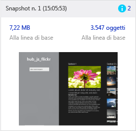
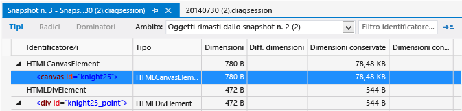
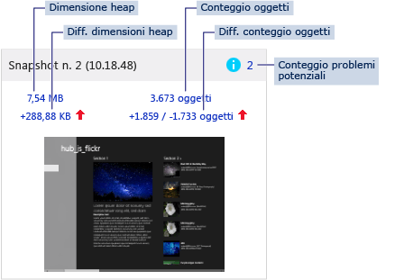
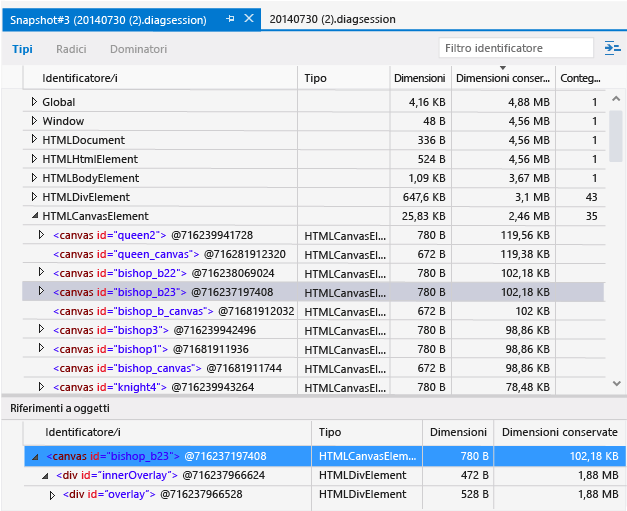
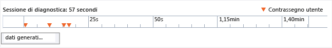

# <a name="analyze-javascript-memory-usage-in-uwp-apps"></a>Analizzare l'utilizzo della memoria di JavaScript nelle app UWP
JavaScript Memory Analyzer, disponibile in Visual Studio, ti aiuta a comprendere l'utilizzo della memoria e a individuare le perdite di memoria nelle app di Windows Store create per Windows con JavaScript. Le app supportate includono le app di Windows universali.
  
 JavaScript Memory Analyzer è in grado di effettuare automaticamente queste operazioni:  
  
-   Individuare rapidamente i problemi di utilizzo della memoria nell'app sottolineando i dati più rilevanti.  
  
     Questi dati vengono presentati in riepiloghi che mostrano le differenze tra due snapshot e forniscono collegamenti a visualizzazioni più dettagliate.  
  
-   Fornire visualizzazioni di dominatori, tipi e radici per isolare i problemi.  
  
-   Ridurre le informazioni non utilizzabili nei dati dell'heap JavaScript.  
  
     Gli oggetti non creati nel codice dell'app vengono esclusi dal filtro. Puoi anche filtrare i dati in base al nome dell'oggetto.  
  
 Per un'esercitazione che consente di eseguire in modo guidato il processo di identificazione di una perdita di memoria in un'app in funzione, vedere [Procedura dettagliata: Trovare una perdita di memoria (JavaScript)](../profiling/walkthrough-find-a-memory-leak-javascript.md).  
  
 Contenuto dell'argomento:  
  
 [Eseguire JavaScript Memory Analyzer](#Run)   
 [Controllare l'uso della memoria](#Check)   
 [Isolare una perdita di memoria](#Isolate)   
 [Visualizzare il riepilogo dell'uso della memoria in tempo reale](#LiveMemory)   
 [Visualizzare il riepilogo di uno snapshot](#SnapshotSummary)   
 [Visualizzare i dettagli dello snapshot](#SnapshotDetails)   
 [Visualizzare le differenze di uno snapshot](#SnapshotDiff)   
 [Visualizzare gli oggetti in base al dominatore](#FoldObjects)   
 [Filtrare i dati in base all'identificatore](#Filter)   
 [Trovare un oggetto nell'albero degli oggetti](#ShowInRootsView)   
 [Visualizzare riferimenti a oggetti condivisi](#References)   
 [Mostrare oggetti incorporati](#BuiltInValues)   
 [Salvare file delle sessioni di diagnostica](#Save)   
 [Associare il codice sorgente a dati sull'uso della memoria](#JSConsoleCommands)   
 [Suggerimenti per l'identificazione dei problemi di memoria](#Tips)  
  
##  <a name="Run"></a> Eseguire JavaScript Memory Analyzer  
 È possibile usare Memory Analyzer quando un'app di Windows Store funzionante è aperta in Visual Studio o installata in un computer che esegue [!INCLUDE[win8](../debugger/includes/win8_md.md)] o versione successiva.  
  
#### <a name="to-run-the-memory-analyzer"></a>Per eseguire l'analizzatore di memoria  
  
1.  Aprire Visual Studio.  
  
2.  Se esegui l'app da Visual Studio, nell'elenco **Avvia debug** della barra degli strumenti **Standard** scegli la destinazione del debug per il tuo progetto, ovvero un emulatore Windows Phone oppure, per un'app di Windows Store, **Computer locale**, **Simulatore**o **Computer remoto**.  
  
     Per altre informazioni su queste opzioni, vedere [Eseguire app da Visual Studio](../debugger/run-store-apps-from-visual-studio.md).  
  
3.  Nella barra dei menu scegliere **Debug** e quindi **Profiler prestazioni...**.  
  
     Per impostazione predefinita, viene analizzato il progetto di avvio corrente. Per modificare la destinazione di analisi, scegli **Cambia destinazione**.  
  
       
  
     Sono disponibili le seguenti opzioni per la destinazione di analisi:  
  
    -   **Progetto di avvio**. Analizza il progetto di avvio corrente. Se esegui l'app in un computer remoto, devi scegliere questa opzione, ovvero quella predefinita.  
  
    -   **App in esecuzione**. Consente di selezionare un'app Windows Store da un elenco di app in esecuzione. Non puoi usare questa opzione se esegui l'app in un computer remoto.  
  
         Usa questa opzione per analizzare l'utilizzo della memoria delle app che esegui nel tuo computer quando non puoi accedere al codice sorgente.  
  
    -   **App installata**. Consente di selezionare un'app Windows Store che desideri analizzare. Non puoi usare questa opzione se esegui l'app in un computer remoto.  
  
         Usa questa opzione per analizzare l'utilizzo della memoria delle app installate nel tuo computer quando non puoi accedere al codice sorgente. Questa opzione può essere utile anche quando vuoi semplicemente analizzare l'utilizzo della memoria di qualsiasi app, al di là dello sviluppo delle tue.  
  
4.  In **Strumenti disponibili**seleziona la casella di controllo **Memoria JavaScript** e scegli **Avvia**.  
  
5.  Quando avvii l'analizzatore di memoria, la finestra Controllo dell'account utente potrebbe richiedere l'autorizzazione per eseguire Visual Studio ETW Collector.exe. Scegliere **Sì**.  
  
     Interagisci con l'app per testare gli scenari di utilizzo della memoria pertinenti e visualizzare il grafico relativo, come illustrato nelle sezioni seguenti.  
  
6.  Passa a Visual Studio premendo ALT+TAB.  
  
7.  Per visualizzare i dati raccolti dall'analizzatore di memoria, scegli **Crea snapshot heap**. Vedi [View a snapshot summary](#SnapshotSummary) più avanti in questo argomento.  
  
##  <a name="Check"></a> Controllare l'uso della memoria  
 Puoi tentare di individuare le perdite di memoria usando diverse visualizzazioni diverse in JavaScript Memory Analyzer. Se sospetti già che si siano verificate perdite di memoria nell'app, vedi [Isolate a memory leak](#Isolate) per un flusso di lavoro consigliato.  
  
 Per facilitare l'identificazione delle perdite di memoria in un'app sono disponibili le seguenti visualizzazioni:  
  
-   [Visualizzare il riepilogo dell'utilizzo della memoria in tempo reale](#LiveMemory). Utilizza il grafico dell'utilizzo della memoria per individuare gli aumenti improvvisi dell'utilizzo della memoria o un aumento costante dell'utilizzo della memoria derivante da specifiche azioni. Usa la visualizzazione di riepilogo dell'utilizzo della memoria in tempo reale per creare snapshot heap. Gli snapshot sono visualizzati in una raccolta nel grafico di utilizzo della memoria.  
  
    > [!TIP]
    >  Noterai un picco nell'utilizzo della memoria quando crei uno snapshot. Usa i riepiloghi snapshot per un'indicazione più accurata della crescita.  
  
-   [View a snapshot summary](#SnapshotSummary). Puoi visualizzare le informazioni di riepilogo dello snapshot durante o dopo una sessione di profilatura della memoria. Usa i riepiloghi dello snapshot per accedere ai dettagli dello snapshot e alle visualizzazioni che mostrano le differenze dello snapshot.  
  
    > [!TIP]
    >  In genere, le visualizzazioni che mostrano le differenze dello snapshot forniranno le informazioni utili sulle perdite di memoria.  
  
-   [Visualizzare i dettagli dello snapshot](#SnapshotDetails). Mostra in dettaglio i dati sull'utilizzo della memoria per un singolo snapshot.  
  
-   [Visualizzare le differenze di uno snapshot](#SnapshotDiff). Mostra i valori differenti tra gli snapshot. Queste visualizzazioni mostrano le differenze nelle dimensioni e nei conteggi degli oggetti.  
  
##  <a name="Isolate"></a> Isolare una perdita di memoria  
 Questi passaggi forniscono un flusso di lavoro che può aiutarti a usare JavaScript Memory Analyzer in modo più efficace. Queste operazioni possono essere utili se ritieni che l'app abbia una perdita di memoria. Per un'esercitazione che consente di eseguire in modo guidato il processo di identificazione di una perdita di memoria in un'app in funzione, vedere [Procedura dettagliata: Trovare una perdita di memoria (JavaScript)](../profiling/walkthrough-find-a-memory-leak-javascript.md).  
  
1.  Apri l'app in Visual Studio.  
  
2.  Esegui JavaScript Memory Analyzer. Per altre informazioni, vedi [Eseguire JavaScript Memory Analyzer](#Run).  
  
3.  Esegui l'app nello scenario che vuoi testare. Ad esempio, lo scenario può implicare una mutazione DOM estesa quando viene caricata una pagina specifica oppure all'avvio dell'app.  
  
4.  Ripeti lo scenario di test per un massimo di altre quattro volte.  
  
    > [!TIP]
    >  In questo modo potrai verificare se è possibile escludere le operazioni di inizializzazione dai risultati.  
  
5.  Passa a Visual Studio (ALT+TAB).  
  
6.  Crea uno snapshot heap della linea di base scegliendo **Crea snapshot heap**.  
  
     Nella figura seguente viene illustrato un esempio di uno snapshot della linea di base.  
  
       
  
    > [!TIP]
    >  Per un controllo più preciso sulla temporizzazione degli snapshot, puoi usare il comando [Associate source code with memory usage data](#JSConsoleCommands) nel codice.  
  
7.  Passa all'app e ripeti lo scenario da testare (una sola volta).  
  
8.  Passa a Visual Studio e crea un secondo snapshot.  
  
9. Passa all'app e ripeti lo scenario da testare (una sola volta).  
  
10. Passa a Visual Studio e crea un terzo snapshot.  
  
     Nella figura seguente viene illustrato un esempio di un secondo e di un terzo snapshot.  
  
       
  
     Creando uno snapshot della linea di base e quindi un secondo e un terzo snapshot in questo flusso di lavoro, potrai escludere più facilmente le modifiche non associate a perdite di memoria. Ad esempio, potrebbero esserci modifiche previste, come l'aggiornamento delle intestazioni e dei piè di pagina di una pagina, che comportano modifiche nell'utilizzo della memoria, ma che potrebbero non essere correlate alle perdite di memoria.  
  
11. Dal terzo snapshot scegli un collegamento a una delle visualizzazioni differenziali:  
  
    -   Dimensioni heap differenziali (collegamento a sinistra sotto le dimensioni dell'heap). Il testo del collegamento mostra la differenza tra le dimensioni heap dello snapshot corrente e quelle dello snapshot precedente.  
  
    -   Conteggio oggetti differenziale (collegamento a destra sotto il conteggio oggetti). Il testo del collegamento mostra due valori, ad esempio +1858 / -1765. Il primo è il numero di nuovi oggetti aggiunti rispetto allo snapshot precedente, mentre il secondo valore indica il numero di oggetti rimossi dallo snapshot precedente.  
  
     Con questi collegamenti viene aperta una visualizzazione dettagli snapshot differenziale dei tipi sull'heap, ordinati in base alle dimensioni o al conteggio oggetti mantenuti, a seconda del collegamento aperto.  
  
12. Per identificare più facilmente i problemi di utilizzo della memoria, scegli una delle seguenti opzioni di filtro di **Ambito** :  
  
    -   **Oggetti rimasti dallo snapshot #2**.  
  
    -   **Oggetti aggiunti tra lo snapshot #2 e #3**  
  
    > [!TIP]
    >  Per analizzare le perdite di memoria, usa la visualizzazione filtrata degli oggetti rimasti dello snapshot precedente. Se ad esempio il conteggio oggetti differenziale è +205 / -195, in questa visualizzazione saranno inclusi i 10 oggetti rimasti che potrebbero essere la causa di perdite di memoria.  
  
     Nella figura seguente è illustrata una visualizzazione differenziale di oggetti rimasti dallo snapshot #2.  
  
       
  
     Nella figura precedente sono illustrati due oggetti rimasti dallo snapshot precedente. Controlla se questo è il comportamento previsto della tua app specifica. In caso contrario, questo potrebbe indicare un problema di memoria.  
  
13. Per esaminare la destinazione degli oggetti delle visualizzazioni che mostrano le differenze nella radice dell'oggetto globale, che ne impedisce l'elaborazione in Garbage Collection, apri il menu di scelta rapida per un oggetto e scegli **Mostra in visualizzazione radice**. È possibile che un numero elevato di oggetti venga mantenuto in memoria perché vengono usati come riferimento da un singolo oggetto o da alcuni oggetti che contengono una radice nell'oggetto globale.  
  
14. Se sono presenti troppi oggetti nella visualizzazione degli oggetti rimasti, prova a isolare il periodo in cui si è verificata la perdita di memoria e quindi crea di nuovo i tre snapshot. Per isolare maggiormente la perdita di memoria, usa [Associate source code with memory usage data](#JSConsoleCommands), [Associate source code with memory usage data](#JSConsoleCommands)e altri dati sull'uso della memoria disponibili in Memory Analyzer.  
  
##  <a name="LiveMemory"></a> Visualizzare il riepilogo dell'uso della memoria in tempo reale  
 La visualizzazione di riepilogo dell'utilizzo della memoria in tempo reale fornisce un grafico relativo all'app in esecuzione e una raccolta di tutte le sezioni di riepilogo dello snapshot. In questa visualizzazione puoi eseguire attività di base, ad esempio acquisire snapshot, analizzare informazioni di riepilogo e passare ad altre visualizzazioni. Quando interrompi la raccolta dei dati, il grafico relativo alla memoria viene chiuso ed è visibile solo la visualizzazione [View a snapshot summary](#SnapshotSummary) .  
  
 Il grafico relativo alla memoria mostra una visualizzazione in tempo reale della memoria di processo dell'app, inclusi i byte privati, la memoria nativa e l'heap JavaScript. Il grafico relativo alla memoria è una visualizzazione scorrevole della memoria di processo. e ha l'aspetto seguente:  
  
   
  
 Se hai aggiunto contrassegni utente al codice dell'app (vedi [Associate source code with memory usage data](#JSConsoleCommands)), nel grafico relativo all'uso della memoria appare un triangolo capovolto che indica il punto iniziale di questa sezione del codice.  
  
 Parte della memoria mostrata nel grafico è allocata dal runtime JavaScript. Non puoi controllare questo utilizzo della memoria nella tua app. L'utilizzo della memoria mostrato nel grafico aumenta all'acquisizione del primo snapshot e aumenta in misura minima per ogni snapshot aggiuntivo.  
  
##  <a name="SnapshotSummary"></a> Visualizzare il riepilogo di uno snapshot  
 Per acquisire uno snapshot dello stato corrente dell'utilizzo della memoria dell'app, scegli **Crea snapshot heap** nel grafico. Una sezione di riepilogo dello snapshot, che compare sia nel riepilogo di utilizzo della memoria in tempo reale (quando l'app è in esecuzione) sia nel riepilogo dello snapshot (quando l'app non è in esecuzione), contiene informazioni sull'heap JavaScript e collegamenti a informazioni più dettagliate. Se acquisisci due o più snapshot, uno di essi fornisce informazioni aggiuntive basate sul confronto tra i dati dello snapshot corrente e quelli dello snapshot precedente.  
  
> [!NOTE]
>  JavaScript Memory Analyzer forza un'operazione di Garbage Collection prima di ogni snapshot, In questo modo otterrai risultati più coerenti tra le esecuzioni.  
  
 Di seguito è riportato un esempio di riepilogo di uno snapshot quando acquisisci più snapshot.  
  
   
  
 Il riepilogo dello snapshot include:  
  
-   Titolo e timestamp dello snapshot.  
  
-   Conteggio dei potenziali problemi (contrassegnati con un'icona informativa blu). Se presente, questo numero identifica i potenziali problemi di memoria, ad esempio nodi non collegati al DOM. Il conteggio è collegato alla visualizzazione Tipi dello snapshot, in cui gli oggetti sono ordinati per tipo di problema per mettere in evidenza i potenziali problemi. La descrizione del problema è riportata in una descrizione comando.  
  
-   Dimensioni heap. Questo numero include oggetti ed elementi DOM che il motore di runtime JavaScript aggiunge all'heap JavaScript. Le dimensioni heap sono collegate alla visualizzazione Tipi dello snapshot.  
  
-   Dimensioni heap differenziali. Questo valore mostra la differenza tra le dimensioni heap dello snapshot corrente e le dimensioni heap dello snapshot precedente. Il valore è seguito da una freccia su rossa in caso di un aumento della memoria o da una freccia giù verde in caso di una diminuzione. Se le dimensioni heap rimangono invariate tra gli snapshot, verrà visualizzato il testo **Nessuna modifica** anziché un numero. Per il primo snapshot, verrà visualizzato il testo **Linea di base**. Le dimensioni heap differenziali sono collegate alla visualizzazione Tipi delle differenze dello snapshot.  
  
-   Conteggio oggetti. Questo conteggio mostra solo gli oggetti creati nell'app ed esclude quelli incorporati creati dal runtime JavaScript. Il conteggio di oggetti è un collegamento alla visualizzazione Tipi dei dettagli dello snapshot.  
  
-   Conteggio oggetti differenziale. Sono riportati due valori: il primo è il numero di nuovi oggetti aggiunti rispetto allo snapshot precedente e il secondo valore indica il numero di oggetti rimossi dallo snapshot precedente. Ad esempio, la figura mostra che sono stati aggiunti 1.859 oggetti e che ne sono stati rimossi 1.733 dopo lo snapshot n.1. Questo valore è seguito da una freccia su rossa se il conteggio oggetti totale è aumentato o da una freccia giù verde se è diminuito. Se il conteggio oggetti rimane invariato, verrà visualizzato il testo **Nessuna modifica** anziché un numero. Per il primo snapshot, verrà visualizzato il testo **Linea di base**. Il conteggio oggetti differenziale è collegato alla visualizzazione Tipi delle differenze dello snapshot.  
  
-   Schermata creata al momento dell'acquisizione dello snapshot.  
  
##  <a name="SnapshotDetails"></a> Visualizzare i dettagli dello snapshot  
 Nelle visualizzazioni relative ai dettagli dello snapshot puoi vedere informazioni dettagliate sull'utilizzo della memoria per ogni snapshot.  
  
 Dalla visualizzazione di riepilogo dello snapshot, scegli un collegamento per visualizzare i dettagli dello snapshot. Il collegamento delle dimensioni heap, ad esempio, consente di visualizzare i dettagli dello snapshot con la visualizzazione Tipi aperta per impostazione predefinita.  
  
 Questa figura mostra la visualizzazione Tipi in un dettaglio snapshot, con i dati sull'utilizzo della memoria ordinati in base alle dimensioni conservate.  
  
   
  
 Nella visualizzazione dei dettagli dello snapshot puoi esaminare i dati sull'utilizzo della memoria in base al tipo, alla radice o al dominatore scegliendo l'opzione desiderata sulla barra degli strumenti:  
  
-   **Tipi**. Mostra il conteggio delle istanze e le dimensioni totali di oggetti sull'heap, raggruppati per tipo. Per impostazione predefinita, sono ordinati in base al conteggio delle istanze.  
  
    > [!TIP]
    >  In genere le visualizzazioni differenze sull'heap oggetto sono quelle più utili per identificare una perdita di memoria in quanto forniscono un filtro **Ambito** per facilitare l'identificazione degli oggetti rimasti.  
  
-   **Radici**. Mostra una visualizzazione gerarchica di oggetti, dagli oggetti radice fino ai riferimenti figlio. Per impostazione predefinita, i nodi figlio sono ordinati in base alla colonna delle dimensioni conservate, con le dimensioni di grandezza massima nella parte superiore.  
  
-   **Dominatori**. Mostra un elenco di oggetti sull'heap con riferimenti esclusivi ad altri oggetti. I dominatori vengono ordinati in base alle dimensioni conservate.  
  
    > [!TIP]
    >  Quando rimuovi un dominatore dalla memoria, recuperi tutta la memoria conservata dall'oggetto. Per alcune app la visualizzazione Dominatori può aiutare a chiarire le dimensioni di memoria mantenute perché ti consente di analizzare la catena completa dei riferimenti agli oggetti.  
  
 Tutte e tre le visualizzazioni mostrano tipi di valore simili, tra cui:  
  
-   **Identificatore/i**. Nome che identifica meglio l'oggetto. Ad esempio, per gli elementi HTML i dettagli dello snapshot mostrano il valore dell'attributo ID, se ne viene usato uno.  
  
-   **Tipo**. Tipo di oggetto, ad esempio un elemento collegamento HTML o un elemento div.  
  
-   **Dimensioni**. Dimensioni oggetto, escluse le dimensioni degli oggetti a cui si fa riferimento.  
  
-   **Dimensioni conservate**. Dimensioni dell'oggetto più quelle di tutti gli oggetti figlio che non hanno altri oggetti padre. Ai fini pratici, si tratta della quantità di memoria conservata dall'oggetto, pertanto se elimini l'oggetto recuperi la quantità di memoria specificata.  
  
-   **Conteggio**. Numero di istanze dell'oggetto. Questo valore compare solo nella visualizzazione Tipi.  
  
##  <a name="SnapshotDiff"></a> Visualizzare le differenze di uno snapshot  
 In JavaScript Memory Analyzer puoi confrontare uno snapshot con uno precedente nelle visualizzazioni che mostrano le differenze dello snapshot.  
  
 Nella visualizzazione di riepilogo dello snapshot puoi visualizzare i dettagli differenziali dello snapshot scegliendo i collegamenti della dimensione heap differenziale o del conteggio oggetti differenziale dopo la creazione di uno o più snapshot.  
  
 Puoi visualizzare informazioni sulle differenze su tipi, radice e dominatori. La visualizzazione differenziale dello snapshot illustra invece informazioni tra cui gli oggetti aggiunti all'heap tra i due snapshot.  
  
 Di seguito viene mostrata la visualizzazione Tipi nelle differenze di uno snapshot.  
  
   
  
 Nella visualizzazione delle differenze dello snapshot le visualizzazioni dominatori, tipi e radice sono uguali a quelle della finestra [Visualizzare i dettagli dello snapshot](#SnapshotDetails) . Le differenze dello snapshot mostrano le stesse informazioni dei dettagli dello snapshot, con questi valori aggiuntivi:  
  
-   **Diff. dimensioni**. Differenza tra le dimensioni dell'oggetto nello snapshot corrente e quelle dello snapshot precedente, escluse le dimensioni di qualsiasi oggetto a cui si fa riferimento.  
  
-   **Diff. dimensioni conservate**. Differenza tra le dimensioni conservate dell'oggetto nello snapshot corrente e quelle conservate nello snapshot precedente. Le dimensioni conservate includono le dimensioni dell'oggetto più quelle di tutti gli oggetti figlio che non hanno altri oggetti padre. Ai fini pratici, le dimensioni conservate corrispondono alla quantità di memoria conservata dall'oggetto, quindi eliminando l'oggetto si recupera la quantità di memoria specificata.  
  
 Per filtrare le informazioni sulle differenze tra gli snapshot, scegli uno dei filtri **Ambito** nella parte superiore delle visualizzazioni delle differenze.  
  
-   **Oggetti rimasti dallo snapshot #\<numero>**. Questo filtro mostra la differenze tra gli oggetti aggiunti all'heap e quelli rimossi dall'heap rispetto allo snapshot della linea di base e allo snapshot precedente. Ad esempio, se il conteggio oggetti nel riepilogo dello snapshot indica +205 / -195, questo filtro consente di visualizzare i dieci oggetti che sono stati aggiunti ma non rimossi.  
  
    > [!TIP]
    >  Per mostrare le informazioni più utili in questo filtro, segui la procedura descritta in [Isolate a memory leak](#Isolate).  
  
-   **Oggetti aggiunti tra lo snapshot #\<numero> e #\<numero>**. Questo filtro mostra tutti gli oggetti aggiunti all'heap rispetto allo snapshot precedente.  
  
-   **Tutti gli oggetti nello snapshot #\<numero>**. Con questa impostazione di filtro non viene escluso nessuno oggetto sull'heap.  
  
 Per mostrare riferimenti a oggetti non corrispondenti al filtro **Ambito** corrente, selezionare **Mostra riferimenti non corrispondenti** nell'elenco delle impostazioni  nell'angolo in alto a destra del riquadro. Se abiliti questa impostazioni, i riferimenti non corrispondenti saranno visualizzati in testo grigio.  
  
> [!TIP]
>  Ti consigliamo di seguire la procedura descritta in [Isolate a memory leak](#Isolate) e quindi di usare gli oggetti rimasti dopo l'applicazione del filtro **Ambito** per identificare gli oggetti in cui si verificano perdite di memoria.  
  
##  <a name="FoldObjects"></a> Visualizzare gli oggetti in base al dominatore  
 Nelle visualizzazioni Tipi e Dominatori puoi scegliere se visualizzare gli oggetti ridotti nei rispettivi dominatori (visualizzazione predefinita della scheda Dominatori). Se è selezionata questa visualizzazione, solo i dominatori saranno mostrati nella visualizzazione di primo livello degli oggetti. Gli oggetti discendenti da oggetti non globali sono nascosti dalla visualizzazione di primo livello. Nel caso di alcune app, ciò può aiutare a chiarire quali sono gli oggetti che provocano una perdita di memoria, grazie alla riduzione di rumore nei dati.  
  
 Per attivare o disattivare la visualizzazione degli oggetti in base al dominatore, scegli il pulsante **Riduci gli oggetti in base a quello dominante** .   
  
 Per altre informazioni sui dominatori, vedi [Visualizzare i dettagli dello snapshot](#SnapshotDetails).  
  
##  <a name="Filter"></a> Filtrare i dati in base all'identificatore  
 Nelle visualizzazioni Dominatori e Tipi puoi filtrare i dati cercando identificatori specifici. Per cercare un identificatore, digita semplicemente il suo nome nella casella di testo **Filtro identificatore** posta in alto a destra. Quando inizi a digitare i caratteri, gli identificatori che non contengono i caratteri digitati vengono esclusi.  
  
 Poiché ogni visualizzazione dispone di un filtro, il filtro non viene mantenuto quando passi a un'altra visualizzazione.  
  
##  <a name="ShowInRootsView"></a> Trovare un oggetto nell'albero degli oggetti  
 Nelle visualizzazioni Tipi e Dominatori puoi vedere la relazione di un oggetto specifico con l'oggetto `Global` . Gli oggetti la cui radice è l'oggetto `Global` non verranno sottoposti a Garbage Collection. Puoi trovare con facilità un oggetto noto nella visualizzazione radice senza cercare nell'intero albero di oggetti `Global` . A questo scopo, apri il menu di scelta rapida per un oggetto nella visualizzazione dominatori o tipo e scegli **Mostra in visualizzazione radice**.  
  
##  <a name="References"></a> Visualizzare riferimenti a oggetti condivisi  
 Nelle visualizzazioni Tipi e Dominatori il riquadro inferiore contiene un elenco di riferimenti a oggetti che contiene riferimenti condivisi. Quando scegli un oggetto nel riquadro superiore, nell'elenco dei riferimenti a oggetti vengono visualizzati tutti gli oggetti che puntano a tale oggetto.  
  
> [!NOTE]
>  I riferimenti circolari sono mostrati con un asterisco (*) e una descrizione informativa e non possono essere espansi. In caso contrario, impedirebbero di spostarsi verso l'alto nell'albero dei riferimenti e identificare gli oggetti che conservano memoria.  
  
 Per altre informazioni sull'identificazione di oggetti equivalenti, scegliere **Visualizza ID oggetto** nell'elenco delle impostazioni  nell'angolo in alto a destra del riquadro superiore. Questa opzione consente di visualizzare gli ID oggetto accanto ai nomi degli oggetti nell'elenco **Identificatore/i** (gli ID vengono visualizzati in tutte le visualizzazioni, non solo nell'elenco dei riferimenti a oggetti). Gli oggetti con lo stesso ID sono riferimenti condivisi.  
  
 Di seguito viene mostrato l'elenco di riferimenti a oggetti per un elemento selezionato con ID visualizzati.  
  
   
  
##  <a name="BuiltInValues"></a> Mostrare oggetti incorporati  
 Per impostazione predefinita, le visualizzazioni Dominatori e Tipi mostrano solo gli oggetti creati nell'app. Questo ti consente di escludere le informazioni non necessarie e di isolare i problemi correlati all'app. Talvolta può comunque essere utile visualizzare tutti gli oggetti generati per l'app dal runtime JavaScript.  
  
 Per visualizzare questi oggetti, scegliere **Mostra incorporati** nell'elenco delle impostazioni  nell'angolo in alto a destra del riquadro.  
  
##  <a name="Save"></a> Salvare file delle sessioni di diagnostica  
 I riepiloghi degli snapshot di diagnostica e le visualizzazioni dei dettagli associate vengono salvati come file con estensione diagsession. **Esplora soluzioni** visualizza le sessioni di diagnostica precedenti nella cartella Sessioni di diagnostica. In **Esplora soluzioni**puoi aprire sessioni precedenti oppure rimuovere o rinominare file.  
  
##  <a name="JSConsoleCommands"></a> Associare il codice sorgente a dati sull'uso della memoria  
 Per isolare la sezione di codice in cui si è verificato un problema di memoria, usa i metodi seguenti:  
  
-   Cerca i nomi delle classi e gli ID degli elementi DOM nelle visualizzazioni dei dettagli e delle differenze.  
  
-   Cerca i valori stringa nelle visualizzazioni dei dettagli e delle differenze che potrebbero essere associati al codice sorgente.  
  
-   Usa il comando [Trovare un oggetto nella struttura ad albero di oggetti](#ShowInRootsView) per spostarti verso l'alto nell'albero degli oggetti. In questo modo sarà più semplice identificare il codice sorgente associato.  
  
-   Aggiungi i controlli di Memory Analyzer al codice sorgente.  
  
 Puoi usare i comandi seguenti nel codice sorgente:  
  
-   `console.takeHeapSnapshot` accetta uno snapshot dell'heap che compare in JavaScript Memory Analyzer. Questo comando è uno dei [comandi della console JavaScript](../debugger/javascript-console-commands.md).  
  
-   `performance.mark` imposta un contrassegno utente (triangolo invertito) che viene visualizzato nella sequenza temporale del grafico relativo alla memoria nella visualizzazione di riepilogo quando l'app è in esecuzione. Questo comando accetta un argomento stringa che descrive l'evento e compare come descrizione comando nel grafico relativo alla memoria. La descrizione non deve superare 100 caratteri.  
  
> [!TIP]
>  Usa `console.takeHeapSnapshot` per velocizzare l'analisi quando si ripetono gli scenari di utilizzo della memoria.  
  
 Questi comandi generano un'eccezione se li aggiungi all'app ed esegui quest'ultima all'esterno di JavaScript Memory Analyzer. Puoi tuttavia verificare se i comandi sono presenti prima di usarli. (I comandi non sono presenti nella fase di avvio della sessione.) Per verificare di poter chiamare `takeHeapSnapshot`, usa questo codice:  
  
```javascript  
if (console && console.takeHeapSnapshot) {  
    console.takeHeapSnapshot();  
}  
```  
  
 Per verificare di poter chiamare `performance.mark`, usa questo codice:  
  
```javascript  
if (performance && performance.mark) {  
    performance.mark("message_string");  
}  
  
```  
  
 Di seguito è riportato un grafico relativo alla memoria con diversi contrassegni utente e la descrizione comando per il contrassegno utente selezionato, per il quale l'argomento di stringa `performance.mark` è impostato su "dati generati":  
  
   
  
##  <a name="Tips"></a> Suggerimenti per l'identificazione dei problemi di memoria  
  
-   Seguire il flusso di lavoro descritto in [Isolare una perdita di memoria](#Isolate) e usare il filtro **Oggetti rimasti dallo snapshot #\<numero>** in una visualizzazione differenze per identificare gli oggetti in cui potrebbero verificarsi perdite di memoria.  
  
-   Usa [Trovare un oggetto nella struttura ad albero di oggetti](#ShowInRootsView) per visualizzare il punto della gerarchia della memoria in cui si fa riferimento a un oggetto. La visualizzazione radice mostra in che modo un oggetto contiene una radice nell'oggetto globale, in quanto tale condizione impedisce che venga incluso nella Garbage Collection.  
  
-   Quando la causa di un problema di memoria è difficilmente identificabile, usa le diverse visualizzazioni, ad esempio dei dominatori e dei tipi, per cercare gli elementi in comune, in particolare per identificare un oggetto (o alcuni oggetti) che potrebbero contenere riferimenti a molti degli altri oggetti presenti nella visualizzazione.  
  
-   Cercare gli oggetti mantenuti inavvertitamente in memoria dopo che l'utente è passato a un'altra pagina, una causa comune dei problemi di memoria. Ad esempio:  
  
    -   L'uso non corretto della funzione [URL.CreateObjectUrl](http://msdn.microsoft.com/library/windows/apps/hh453196.aspx) può causare questo problema.  
  
    -   Con alcuni oggetti viene fornito un metodo `dispose` , oltre a consigli per l'uso. Ad esempio, è necessario chiamare `dispose` in un oggetto [WinJS.Binding.List](http://msdn.microsoft.com/library/windows/apps/Hh700774.aspx) se si chiama il metodo `createFiltered` dell'elenco e quindi si esce dalla pagina.  
  
    -   Potrebbe essere necessario rimuovere uno o più listener di eventi. Per altre informazioni, vedere [Visualizzare i listener di eventi DOM](../debugger/view-dom-event-listeners.md).  
  
-   Guardare l'ultima parte di [questo video](http://channel9.msdn.com/Events/Build/2013/3-316) della conferenza Build 2013 su JavaScript Memory Analyzer.  
  
-   Leggere l'argomento [Gestione della memoria in app di Windows Store](http://msdn.microsoft.com/magazine/jj651575.aspx).  
  
-   Considerare la possibilità di modificare temporaneamente il codice per isolare i problemi. Può, ad esempio, essere necessario:  
  
    -   Usare i comandi per l'analizzatore di memoria, `console.takeSnapshot` e `performance.mark`. Per informazioni, vedere [Associate source code with memory usage data](#JSConsoleCommands).  
  
         Questi comandi consentono di isolare i problemi che non puoi isolare manualmente acquisendo uno snapshot heap.  
  
    -   Creare un oggetto test e analizzarlo nelle visualizzazioni di JavaScript Memory Analyzer, ad esempio la visualizzazione Tipi. Ad esempio, puoi collegare un oggetto di grandi dimensioni a un altro oggetto per vedere se un oggetto o un elemento specifico è stato sottoposto a Garbage Collection.  
  
## <a name="see-also"></a>Vedere anche  
 [Procedura dettagliata: trovare una perdita di memoria (JavaScript)](../profiling/walkthrough-find-a-memory-leak-javascript.md)
