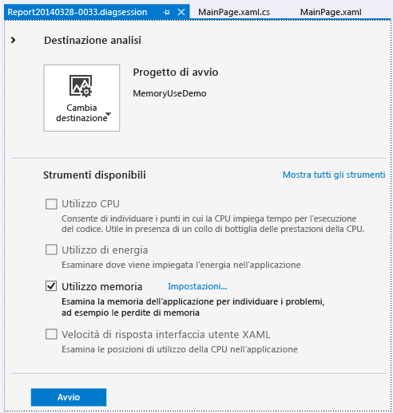
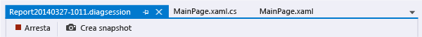
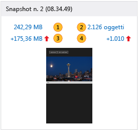
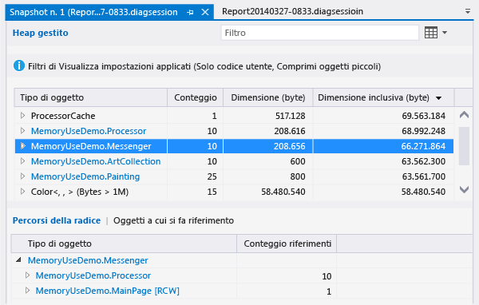
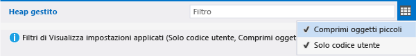
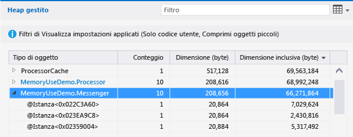
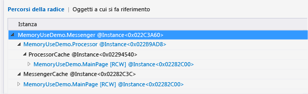
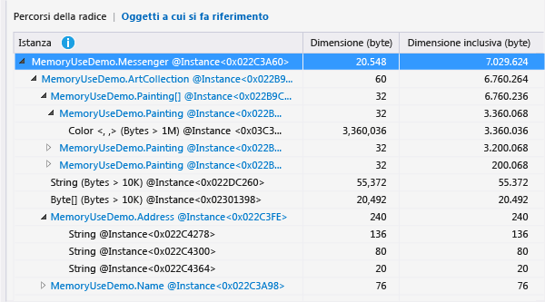
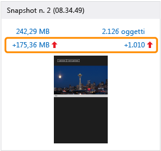

# Utilizzo memoria senza debug
È possibile usare lo strumento **Utilizzo memoria** senza debug per eseguire le operazioni seguenti:  
  
-   Monitorare l'uso della memoria delle tue app direttamente in Visual Studio mentre sviluppi uno scenario.  
  
-   Creare snapshot dettagliati dello stato della memoria dell'app.  
  
-   Confrontare snapshot per trovare la causa principale dei problemi di memoria.  
  
 Questo argomento descrive come usare lo strumento Utilizzo memoria per analizzare un'app XAML universale di Windows. Se si vuole analizzare l'uso della memoria nelle app universali di Windows che usano JavaScript e HTML, vedere [Analizzare l'utilizzo della memoria (JavaScript)](http://msdn.microsoft.com/library/windows/apps/jj819176.aspx).  
  
##   Avviare una sessione di diagnostica con lo strumento Utilizzo memoria  
  
1.  Aprire un progetto universale di Windows C# in Visual Studio.  
  
2.  Nella barra dei menu scegliere **Debug/Profiler prestazioni...**.  
  
3.  Selezionare **Utilizzo memoria** e quindi scegliere il pulsante **Avvio** nella parte inferiore della pagina.  
  
       
  
##   Monitorare l'uso della memoria  
 Oltre a usare lo strumento **Utilizzo memoria** per generare rapporti dettagliati con cui trovare e correggere errori, è possibile usarlo anche per studiare gli effetti in tempo reale sulla memoria di uno scenario che si sta sviluppando attivamente.  
  
 Quando si avvia una sessione di diagnostica, l'app viene avviata e nella finestra **Strumenti di diagnostica** viene visualizzato un grafico della sequenza temporale dell'uso della memoria dell'app.  
  
   
  
 Il grafico della sequenza temporale mostra le fluttuazioni nella memoria dell'app durante la sua esecuzione. Eventuali picchi nel grafico in genere indicano che alcune stringhe di codice stanno raccogliendo o creando dati, per poi rimuoverli al termine del processo. Picchi significativi indicano aree che potrebbero essere ottimizzate. Più preoccupante sarebbe un aumento del consumo di memoria che non torna ai valori normali, perché può indicare un uso della memoria non efficiente o addirittura una perdita di memoria.  
  
###   Chiudere una sessione di monitoraggio  
   
  
 Per arrestare una sessione di monitoraggio senza creare un report, chiudi semplicemente la finestra di diagnostica. Per generare un rapporto dopo aver creato snapshot della memoria, scegliere **Arresta**.  
  
##   Creare snapshot dello stato della memoria dell'app  
 Se viene riscontrato un problema di memoria su cui si vuole indagare, è possibile creare alcuni snapshot durante la sessione di diagnostica per acquisire oggetti in memoria in determinati momenti. Dato che un'app usa un gran numero di tipi di oggetti, potresti voler concentrare la tua analisi su un solo scenario. È anche una buona idea acquisire uno snapshot di base dell'app prima che si verifichi un problema di memoria, un altro dopo che il problema si presenta per la prima volta e uno o più snapshot aggiuntivi se puoi ripetere lo scenario.  
  
 Per raccogliere snapshot, avvia una nuova sessione di diagnostica. Scegliere **Crea snapshot** quando si vogliono acquisire i dati di memoria. Per generare un rapporto, scegliere **Arresta**.  
  
##   Pagina delle informazioni generali dello strumento Utilizzo memoria  
 Una volta completata la raccolta dei dati, lo strumento Utilizzo memoria arresta l'app e visualizza un report con informazioni generali.  
  
   
  
###   Visualizzazioni snapshot dello strumento Utilizzo memoria  
 Usa le viste degli snapshot per aprire report dettagli in nuove finestre di Visual Studio. Esistono due tipi di viste degli snapshot:  
  
-   Un [rapporto dei dettagli degli snapshot](../profiling/memory-usage-without-debugging2.md#BKMK_Snapshot_details_reports) mostra i tipi e le istanze in un solo snapshot.  
  
-   Un [rapporto delle differenze degli snapshot](../profiling/memory-usage-without-debugging2.md#BKMK_Snapshot_difference__diff__reports) confronta i tipi e le istanze in due snapshot.  
  
   
  
 Gli elementi numerati nell'immagine della vista dello snapshot sono link che aprono viste di report di Utilizzo memoria.  
  
|||  
|-|-|  
||Il testo del link indica il numero totale di byte in memoria quando è stato creato lo snapshot.   Scegli questo link per visualizzare un report dettagli dello snapshot, ordinato in base alla dimensione totale delle istanze di tipo.|  
||Il testo del link indica il numero totale di oggetti in memoria quando è stato creato lo snapshot.   Scegli questo link per visualizzare un report dettagli dello snapshot, ordinato in base al numero di istanze dei tipi.|  
||Il testo del link indica la differenza tra la dimensione totale degli oggetti in memoria al momento dello snapshot e la dimensione totale dello snapshot precedente.   Il testo del link è un numero positivo quando la dimensione della memoria dello snapshot è maggiore rispetto allo snapshot precedente e un numero negativo quando la dimensione è minore. Il testo del link **Alla linea di base** indica che lo snapshot è il primo della sessione di diagnostica, mentre il testo **Nessuna differenza** indica che la differenza è zero.   Scegli questo link per visualizzare un report delle differenze degli snapshot, ordinato in base alla differenza riguardo alla dimensione totale delle istanze dei tipi.|  
||Il testo del link mostra la differenza tra il numero totale di oggetti di memoria nello snapshot e il numero di oggetti nello snapshot precedente.   Scegli questo link per visualizzare un report delle differenze degli snapshot, ordinato in base alla differenza riguardo al numero totale di istanze dei tipi.|  
  
##   Rapporti degli snapshot  
   
  
###   Alberi dei rapporti degli snapshot  
  
####   Heap gestito  
 L'albero dell'heap gestito [albero Heap gestito (dettagli di snapshot)](../profiling/memory-usage-without-debugging2.md#BKMK_Managed_Heap_tree__Snapshot_details_) e l'[albero Heap gestito (differenze di snapshot)](../profiling/memory-usage-without-debugging2.md#BKMK_Managed_Heap_tree__Snapshot_diff_) mostrano i tipi e le istanze presenti nel rapporto. Quando si seleziona un tipo o un'istanza, vengono visualizzati gli alberi **Percorsi della radice** e **Oggetti a cui si fa riferimento** per l'elemento selezionato.  
  
####   Percorsi della radice  
 L'[albero Percorsi della radice (dettagli di snapshot)](../profiling/memory-usage-without-debugging2.md#BKMK_Paths_to_Root_tree__Snapshot_details_) e l'[albero Percorsi della radice (differenze di snapshot)](../profiling/memory-usage-without-debugging2.md#BKMK_Paths_to_Root_tree__Snapshot_diff_) mostrano la catena di oggetti che fanno riferimento al tipo o all'istanza. Garbage Collector di .NET Framework pulisce la memoria per un oggetto solo una volta rilasciati tutti i riferimenti.  
  
####   Oggetti a cui si fa riferimento  
 L'[albero Oggetti a cui si fa riferimento (dettagli di snapshot)](../profiling/memory-usage-without-debugging2.md#BKMK_Referenced_Objects_tree__Snapshot_details_) e l'[albero Oggetti a cui si fa riferimento (differenze di snapshot)](../profiling/memory-usage-without-debugging2.md#BKMK_Referenced_Objects_tree__Snapshot_diff_) mostrano gli oggetti a cui fa riferimento l'istanza o il tipo selezionato.  
  
###   Campi Tipo di oggetto e Istanza  
 Quando una voce **Tipo di oggetto** ha voci figlio, è possibile scegliere l'icona a forma di freccia per visualizzarle. Se il colore del testo **Tipo di oggetto** è blu, è possibile scegliere di passare all'oggetto nel suo file di codice sorgente. Il file di origine si apre in una finestra separata.  
  
 I nomi di istanza sono ID univoci generati dallo strumento Utilizzo memoria.  
  
 Se si nota un tipo che non risulta facilmente identificabile o se non si capisce in che modo sia interessato dal codice, probabilmente si tratta di un oggetto di .NET Framework, del sistema operativo o del compilatore visualizzato dallo strumento Utilizzo memoria perché coinvolto nelle catene di proprietà degli oggetti.  
  
###   Filtri degli alberi dei rapporti  
 La maggior parte delle app contiene un numero sorprendentemente elevato di tipi, molti dei quali sono irrilevanti per uno sviluppatore di app. Lo strumento **Utilizzo memoria** definisce due filtri utilizzabili per nascondere la maggior parte di questi tipi negli alberi **Heap gestito** e **Percorsi della radice**. Puoi anche filtrare un albero per nome di tipo.  
  
   
  
####   Filtro  
 Immettere una stringa nella casella **Filtro** per limitare la visualizzazione dell'albero ai tipi che contengono il testo specificato. Il filtro non fa distinzione tra maiuscole e minuscole e riconosce la stringa specificata in ogni parte dei nomi di tipo.  
  
####   Comprimi oggetti piccoli  
 Quando questo filtro è applicato, i tipi per cui l'impostazione **Dimensione (byte)** è minore dello 0,5% della dimensione totale della memoria dello snapshot vengono nascosti nell'elenco **Heap gestito**.  
  
####   Just My Code  
 Il filtro **Just My Code** nasconde la maggior parte delle istanze generate da codice esterno. I tipi esterni sono di proprietà del sistema operativo o di componenti .NET Framework oppure sono generati dal compilatore.  
  
##   Rapporti dettagli degli snapshot  
 Usa un report dettagli di uno snapshot per concentrarti su un solo snapshot di una sessione di diagnostica. Per aprire un report dettagli, scegli uno dei link in una visualizzazione snapshot, come mostrato nell'immagine. Entrambi i collegamenti aprono lo stesso rapporto e l'unica differenza è il tipo di ordinamento iniziale dell'albero **Heap gestito** nel rapporto. In entrambi i casi, puoi modificare il tipo di ordinamento dopo l'apertura del report.  
  
   
  
-   Il link **MB** ordina il rapporto in base alla colonna **Dimensione inclusiva (byte)**.  
  
-   Il link **Oggetti** ordina il rapporto in base alla colonna **Conteggio**.  
  
###   Albero Heap gestito (dettagli di snapshot)  
 Nell'albero **Heap gestito** sono elencati i tipi di oggetti contenuti in memoria. Puoi espandere un nome di tipo per visualizzare le dieci istanze più grandi del tipo, ordinate in base alla dimensione. Quando si seleziona un tipo o un'istanza, vengono visualizzati gli alberi **Percorsi della radice** e **Oggetti a cui si fa riferimento** per l'elemento selezionato.  
  
   
  
|||  
|-|-|  
|**Tipo di oggetto**|Nome dell'istanza di tipo o di oggetto.|  
|**Conteggio**|Numero di istanze di oggetto del tipo. Il numero è sempre 1 per un'istanza.|  
|**Dimensioni (byte)**|Per un tipo, dimensione di tutte le istanze del tipo nello snapshot della memoria, esclusa la dimensione degli oggetti contenuti nelle istanze.   Per un'istanza o un tipo, dimensione dell'oggetto, esclusa la dimensione degli oggetti contenuti nell'istanza. istanze.|  
|**Dimensione inclusiva (byte)**|Dimensione delle istanze del tipo o di una singola istanza, inclusa la dimensione degli oggetti contenuti.|  
  
###   Albero Percorsi della radice (dettagli di snapshot)  
 L'albero **Percorsi della radice** mostra la catena di oggetti che fanno riferimento al tipo o all'istanza. Garbage Collector di .NET Framework pulisce la memoria per un oggetto solo una volta rilasciati tutti i riferimenti.  
  
   
  
 Quando si visualizza un tipo nell'albero **Percorsi della radice**, il numero di oggetti dei tipi che contengono riferimenti al tipo viene visualizzato nella colonna **Conteggio riferimenti**. La colonna non è visualizzata quando analizzi un'istanza.  
  
###   Albero Oggetti a cui si fa riferimento (dettagli di snapshot)  
 L'albero **Oggetti a cui si fa riferimento** mostra gli oggetti a cui fa riferimento l'istanza o il tipo selezionato.  
  
   
  
|||  
|-|-|  
|**Tipo di oggetto / Istanza**|Nome dell'istanza di tipo o di oggetto.|  
|**Dimensioni (byte)**|Per un tipo, dimensione di tutte le istanze del tipo, esclusa la dimensione degli oggetti contenuti nel tipo.   Per un'istanza, dimensione dell'oggetto, esclusa la dimensione degli oggetti contenuti nell'oggetto.|  
|**Dimensione inclusiva (byte)**|Dimensione totale delle istanze del tipo o dimensione dell'istanza, inclusa la dimensione degli oggetti contenuti.|  
  
##   Rapporti delle differenze di snapshot  
 Un report delle differenze degli snapshot mostra le modifiche tra uno snapshot principale e lo snapshot creato immediatamente prima. Per aprire un report delle differenze, scegli uno dei link in una visualizzazione snapshot, come mostrato nell'immagine. Entrambi i collegamenti aprono lo stesso rapporto e l'unica differenza è il tipo di ordinamento iniziale dell'albero **Heap gestito** nel rapporto. Puoi modificare il tipo di ordinamento dopo l'apertura del report.  
  
   
  
-   Il link **MB** ordina il rapporto in base alla colonna **Dimensione inclusiva (byte)**.  
  
-   Il link **Oggetti** ordina il rapporto in base alla colonna **Conteggio**.  
  
###   Albero Heap gestito (differenze di snapshot)  
 Nell'albero **Heap gestito** sono elencati i tipi di oggetti contenuti in memoria. Puoi espandere un nome di tipo per visualizzare le dieci istanze più grandi del tipo, ordinate in base alla dimensione. Quando si seleziona un tipo o un'istanza, vengono visualizzati gli alberi **Percorsi della radice** e **Oggetti a cui si fa riferimento** per l'elemento selezionato.  
  
   
  
 Si noti che le colonne **Conteggio**, **Dimensione (byte)** e **Dimensione inclusiva (byte)** sono state compresse nell'immagine.  
  
|||  
|-|-|  
|**Tipo di oggetto**|Nome dell'istanza di tipo o di oggetto.|  
|**Conteggio**|Numero di istanze di un tipo nello snapshot principale. Il valore di **Conteggio** è sempre 1 per un'istanza.|  
|**Diff. conteggio**|Per un tipo, differenza nel numero di istanze del tipo tra lo snapshot principale e quello precedente. Il campo è vuoto per un'istanza.|  
|**Dimensioni (byte)**|Dimensione degli oggetti nello snapshot principale, esclusa la dimensione degli oggetti contenuti negli oggetti. Per un tipo, **Dimensione (byte)** e **Dimensione inclusiva (byte)** corrispondono ai totali delle dimensioni delle istanze di tipo.|  
|**Diff. dimensione totale (byte)**|Per un tipo, differenza nella dimensione totale delle istanze del tipo tra lo snapshot principale e quello precedente, esclusa la dimensione degli oggetti contenuti nelle istanze. Il campo è vuoto per un'istanza.|  
|**Dimensione inclusiva (byte)**|Dimensione degli oggetti nello snapshot principale, inclusa la dimensione degli oggetti contenuti negli oggetti.|  
|**Differenza dimensioni inclusive (byte)**|Per un tipo, differenza nella dimensione di tutte le istanze del tipo tra lo snapshot principale e quello precedente, inclusa la dimensione degli oggetti contenuti negli oggetti. Il campo è vuoto per un'istanza.|  
  
###   Albero Percorsi della radice (differenza di snapshot)  
 L'albero **Percorsi della radice** mostra la catena di oggetti che fanno riferimento al tipo o all'istanza. Garbage Collector di .NET Framework pulisce la memoria per un oggetto solo una volta rilasciati tutti i riferimenti.  
  
   
  
###   Albero Oggetti a cui si fa riferimento (differenza di snapshot)  
 L'albero **Oggetti a cui si fa riferimento** mostra gli oggetti a cui fa riferimento l'istanza o il tipo principale.  
  
   
  
|||  
|-|-|  
|**Tipo di oggetto / Istanza**|Nome dell'istanza di tipo o di oggetto.|  
|**Dimensioni (byte)**|Per un'istanza, dimensione dell'oggetto nello snapshot principale, esclusa la dimensione degli oggetti contenuti nell'istanza.   Per un tipo, dimensione totale di tutte le istanze del tipo nello snapshot principale, esclusa la dimensione degli oggetti contenuti nell'istanza.|  
|**Dimensione inclusiva (byte)**|Dimensione degli oggetti nello snapshot principale, inclusa la dimensione degli oggetti contenuti negli oggetti.|  
  
## Vedere anche  
 [Memoria JavaScript](../profiling/javascript-memory.md)
 [Strumenti di profilatura](../profiling/profiling-tools.md)
 [Procedure consigliate per app di Windows Store scritte in C++, C# e Visual Basic](http://msdn.microsoft.com/library/windows/apps/hh750313.aspx)   
 [Diagnosing memory issues with the new Memory Usage Tool in Visual Studio](http://go.microsoft.com/fwlink/p/?LinkId=394706) (Diagnostica dei problemi di memoria con il nuovo strumento Utilizzo memoria in Visual Studio)
