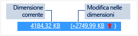

# Utilizzo memoria
[!INCLUDE[vs2017banner](../code-quality/includes/vs2017banner.md)]

È possibile rilevare perdite di memoria e memoria inefficiente mentre si sta eseguendo il debug con lo strumento di diagnostica **Utilizzo memoria** integrato nel debugger. Lo strumento Utilizzo memoria consente di eseguire uno o più *snapshot* dell'heap di memoria gestito e nativo. È possibile raccogliere snapshot di app.NET, native o in modalità mista \(.NET e native\).  
  
-   È possibile analizzare un singolo snapshot per ottenere informazioni sull'impatto relativo dei tipi di oggetto sull'uso della memoria e per trovare nell'app il codice che usa la memoria in modo non efficiente.  
  
-   È anche possibile confrontare \(diff\) due snapshot di un'app per trovare le aree del codice che provocano l'incremento dell'uso della memoria nel tempo.  
  
 Il grafico seguente mostra la finestra **Strumenti di diagnostica** in Visual Studio 2015 Update 1:  
  
   
  
 Anche se è possibile raccogliere snapshot di memoria in qualsiasi momento nello strumento **Utilizzo memoria** è possibile usare il debugger di Visual Studio per controllare la modalità di esecuzione dell'applicazione durante l'analisi dei problemi di prestazioni. L'impostazione dei punti di interruzione, l'esecuzione di istruzioni, l'azione Interrompi tutto e altre azioni del debugger consentono di concentrare l'analisi delle prestazioni sui percorsi del codice più rilevanti. L'esecuzione di tali azioni durante l'esecuzione dell'app può eliminare il rumore dal codice che non interessa l'utente e può ridurre notevolmente la quantità di tempo necessaria per la diagnosi di un problema.  
  
 È inoltre possibile usare lo strumento di memoria all'esterno del debugger. Vedere [Analizzare l'uso della memoria senza debug](../Topic/Memory%20Usage%20without%20Debugging1.md).  
  
> [!NOTE]
>  **Supporto allocatore personalizzato.** Il profiler della memoria nativo raccoglie dati relativi a eventi [ETW](https://msdn.microsoft.com/en-us/library/windows/desktop/bb968803\(v=vs.85\).aspx) di allocazione generati in fase di esecuzione.  Gli allocatori in CRT e Windows SDK sono stati annotati a livello di origine in modo che sia possibile acquisirne i dati di allocazione.  Nella scrittura degli allocatori, fare in modo che qualsiasi funzione che restituisce un puntatore alla memoria heap appena allocata possa essere decorata con [\_\_declspec](/visual-cpp/cpp/declspec)\(allocator\), come illustrato in questo esempio per myMalloc:  
>   
>  `__declspec(allocator) void* myMalloc(size_t size)`  
  
## Analizzare l’uso della memoria con il debugger  
  
> [!NOTE]
>  Poiché la raccolta di dati può influire sulle prestazioni di debug delle app native o in modalità mista, gli snapshot di memoria sono disattivati per impostazione predefinita. Per abilitare app native o in modalità mista di snapshot, avviare una sessione di debug \(tasto di scelta rapida: **F5**\). Quando la finestra **Strumenti di diagnostica** verrà visualizzata, scegliere la scheda Utilizzo memoria e quindi scegliere **Abilita snapshot**.  
>   
>    
>   
>  Arrestare \(tasto di scelta rapida: **MAIUSC \+ F5**\) e riavviare il debug.  
  
 Ogni volta che si vuole acquisire lo stato della memoria, scegliere **Crea snapshot** nella barra degli strumenti del riepilogo **Utilizzo memoria**.  
  
   
  
> [!TIP]
>  -   Per creare una linea di base per i confronti di memoria, si consiglia di creare uno snapshot all'inizio di una sessione di debug.  
> -   Poiché può essere difficile acquisire il profilo di memoria di un'operazione di proprio interesse quando l'app alloca e dealloca spesso la memoria, impostare punti di interruzione all'inizio e alla fine dell'operazione o eseguire l'operazione per trovare il punto esatto in cui è stata modificata la memoria.  
  
## Visualizzazione dei dettagli dello snapshot di memoria  
 Nelle righe della tabella di riepilogo Utilizzo memoria sono elencati gli snapshot creati durante la sessione di debug.  
  
 Le colonne della riga dipendono dalla modalità di debug scelta nelle proprietà del progetto: .NET, nativa o mista \(nativa e .NET\).  
  
-   Le colonne **Oggetto gestito** e **Allocazioni native** visualizzano il numero di oggetti nella memoria .NET e nativa quando è stato creato lo snapshot.  
  
-   Le colonne **Dimensione heap gestito** e **Dimensione heap nativo** visualizzano il numero di byte negli heap .NET e nativi.  
  
-   Quando si eseguono più snapshot, le celle della tabella di riepilogo includono la modifica del valore tra lo snapshot della riga e lo snapshot precedente.  
  
       
  
 **Per visualizzare un report dettagliato:**  
  
-   Per visualizzare i dettagli solo dello snapshot selezionato scegliere il collegamento corrente.  
  
-   Per visualizzare i dettagli della differenza tra lo snapshot corrente e quello precedente, scegliere il collegamento di modifica.  
  
 Il report verrà visualizzato in una finestra separata.  
  
## Report dettagli di Utilizzo memoria  
  
### Report di tipi gestiti  
 Scegliere il collegamento corrente di una cella **Oggetti gestiti** o **Dimensione heap gestito** nella tabella di riepilogo Utilizzo memoria.  
  
   
  
 Il riquadro superiore mostra il numero e la dimensione dei tipi dello snapshot, inclusa la dimensione di tutti gli oggetti cui fa riferimento il tipo \(**Dimensione inclusiva**\).  
  
 L'albero **Percorsi della radice** del riquadro inferiore mostra gli oggetti che fanno riferimento al tipo selezionato nel riquadro superiore. Il Garbage Collector di .NET Framework pulisce la memoria per un oggetto solo quando è stato rilasciato l'ultimo tipo cui fa riferimento.  
  
 L'albero **Tipi a cui si fa riferimento** mostra i riferimenti mantenuti dal tipo selezionato nel riquadro superiore.  
  
   
  
 Per visualizzare le istanze di un tipo selezionato nel riquadro superiore, scegliere l'icona .  
  
   
  
 La visualizzazione **Istanze** mostra le istanze dell'oggetto selezionato nello snapshot nel riquadro superiore. I riquadri Percorsi della radice e Oggetti a cui si fa riferimento mostrano gli oggetti che fanno riferimento all'istanza selezionata e i tipi cui fa riferimento l'istanza selezionata. Quando il debugger viene interrotto nel punto in cui è stato creato lo snapshot, è possibile passare il mouse sulla cella Valore per visualizzare i valori dell'oggetto in una descrizione comando.  
  
### Report di tipo nativo  
 Scegliere il collegamento corrente di una cella **Allocazioni native** o **Dimensione heap nativo** della tabella di riepilogo Utilizzo memoria della finestra **Strumenti di diagnostica**.  
  
   
  
 La **Visualizzazione Tipi** mostra il numero e la dimensione dei tipi dello snapshot.  
  
-   Scegliere l'icona delle istanze \(\) di un tipo selezionato per visualizzare le informazioni sugli oggetti del tipo selezionato nello snapshot.  
  
     La visualizzazione **Istanze** mostra ogni istanza del tipo selezionato. La selezione di un'istanza consente di visualizzare lo stack di chiamate che ha comportato la creazione dell'istanza nel riquadro **Stack di chiamate allocazione**.  
  
       
  
-   Scegliere **Visualizzazione stack** dall'elenco **Modalità di visualizzazione** per visualizzare lo stack di allocazione per il tipo selezionato.  
  
       
  
### Report di modifica \(Diff\)  
  
-   Scegliere il collegamento di modifica in una cella della tabella di riepilogo della scheda **Utilizzo memoria** nella finestra **Strumenti di diagnostica**.  
  
       
  
-   Scegliere uno snapshot dall'elenco **Confronta con** di un report gestito o nativo.  
  
       
  
 Il report di modifica aggiunge colonne \(contrassegnate con **\(Diff\)**\) al report di base che mostra la differenza tra il valore di snapshot di base e lo snapshot di confronto. Ecco un esempio di come potrebbe apparire un report delle differenze di visualizzazione del tipo nativo:  
  
   
  
## Blog e video  
 [Finestra del debugger degli strumenti di diagnostica in Visual Studio 2015](http://blogs.msdn.com/b/visualstudioalm/archive/2015/01/16/diagnostic-tools-debugger-window-in-visual-studio-2015.aspx)  
  
 [Blog: Strumento di utilizzo della memoria durante il debug in Visual Studio 2015](http://blogs.msdn.com/b/visualstudioalm/archive/2014/11/13/memory-usage-tool-while-debugging-in-visual-studio-2015.aspx)  
  
 [Blog su Visual C\+\+: Diagnostica della memoria nativa in Visual Studio 2015 Preview](http://blogs.msdn.com/b/vcblog/archive/2014/11/21/native-memory-diagnostics-in-vs2015-preview.aspx)  
  
 [Blog su Visual C\+\+: Strumenti di diagnostica della memoria nativa per Visual Studio 2015 CTP](http://blogs.msdn.com/b/vcblog/archive/2014/06/04/native-memory-diagnostic-tools-for-visual-studio-14-ctp1.aspx)