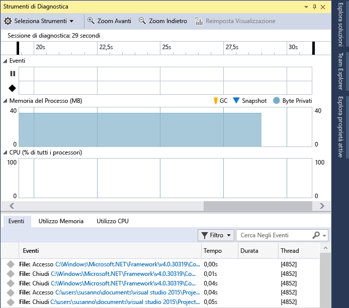

# Esecuzione degli strumenti di profilatura con o senza il debugger
Visual Studio offre ora una vasta gamma di strumenti per le prestazioni, alcuni dei quali (ad esempio, **Utilizzo CPU** e **Utilizzo memoria**) possono essere eseguiti con o senza il debugger. Gli strumenti per le prestazioni privi di debugger devono essere eseguiti su configurazioni di rilascio; al contrario, gli strumenti di debugger integrati devono essere eseguiti sulle configurazioni di debug.  
  
## Lo strumento deve essere eseguito con o senza il debugger?  
 Gli strumenti per le prestazioni con debugger integrato consentono di eseguire molte più operazioni rispetto a quelli privi di debugger, ad esempio, consentono di impostare punti di interruzione e di esaminare i valori delle variabili. Gli strumenti privi di debugger offrono un'esperienza di utilizzo analoga a quella dell'app pubblicata.  
  
 Di seguito sono riportate alcune domande che permettono di stabilire lo strumento più adatto alle proprie esigenze:  
  
1.  Il problema si è verificato durante lo sviluppo dell'applicazione o nella versione rilasciata?  
  
     Se il problema riscontrato dall'utente si è verificato durante la fase di sviluppo, non è necessario eseguire gli strumenti per le prestazioni in una build di versione. Se il problema si è verificato in una versione di rilascio, è necessario riprodurre l'errore utilizzando una configurazione di rilascio e, successivamente, decidere se utilizzare il debugger per analizzare il problema in modo più approfondito.  
  
2.  Il problema è causato da elevata elaborazione della CPU?  
  
     Molti problemi sono causati da problemi operativi esterni, ad esempio l'I/O del file o la velocità di risposta della rete. Per questo motivo, non è importante se gli strumenti per le prestazioni vengono eseguiti con o senza debugger. Se il problema è causato da chiamate di CPU intensiva, aumenta la differenza tra configurazione di rilascio e configurazione di debug. Pertanto, è opportuno verificare se il problema è presente nella compilazione di rilascio, prima di utilizzare gli strumenti di debugger integrati.  
  
3.  È necessario misurare le prestazioni in modo preciso o si può accettare anche un valore approssimativo?  
  
     Nelle compilazioni di debug mancano alcune funzionalità di ottimizzazione offerte dalle build di versione, ad esempio l'incorporamento di chiamate di funzione e di costanti, l'eliminazione di percorsi di codice non usati e l'archiviazione di variabili in modalità non utilizzabili dal debugger. Il debbuger stesso modifica i tempi operativi poiché esegue alcune operazioni necessarie per il debug (ad esempio, l'individuazione di eccezione e di eventi di caricamento del modulo). I valori relativi alle prestazioni negli strumenti integrati nel debugger sono meno precisi perché non considerano le ottimizzazioni del debugger, ma tuttavia possono essere utili quando vengono confrontati con le altre misurazioni relative effettuate durante il debug. I valori relativi alle prestazioni per le configurazioni di rilascio con strumenti privi di debugger non sono molto accurati.
  
##   Raccogliere dati di profilatura durante il debug  
 La sezione seguente si occupa dell’esecuzione del debug in locale. È possibile trovare informazioni sul debug in un dispositivo o sul debug remoto nelle sezioni successive.  
  
1.  Aprire il progetto di cui si vuole eseguire il debug, quindi fare clic su **Debug/Avvia debug** (oppure usare **Avvia** sulla barra degli strumenti o **F5**).  
  
2.  La finestra **Strumenti di diagnostica** viene visualizzata automaticamente, a meno che non sia stata disattivata. Per visualizzare di nuovo la finestra, fare clic su **Debug/Windows/Mostra strumenti di diagnostica**.  
  
3.  Eseguire gli scenari per i quali si vuole raccogliere dati.  
  
     Quando si esegue la sessione, è possibile visualizzare informazioni su eventi, memoria di processo e utilizzo della CPU.  
  
     Il grafico seguente mostra la finestra **Strumenti di diagnostica** in Visual Studio 2015 Update 1:  
  
       
  
4.  È possibile scegliere se visualizzare **Utilizzo memoria** o **Utilizzo CPU** (o entrambi) tramite l'impostazione **Seleziona strumenti** nella barra degli strumenti. Se si usa Visual Studio Enterprise, è possibile abilitare o disabilitare IntelliTrace in **Strumenti/Opzioni/IntelliTrace**.  
  
5.  La sessione di diagnostica termina quando si interrompe il debug.  
  
 In Visual Studio 2015 Update 1 la finestra **Strumenti di diagnostica** rende più semplice concentrarsi sugli eventi a cui si è interessati.   I nomi degli eventi sono ora accompagnati da prefissi di categoria (**Movimento**, **Output programma**, **Punto di interruzione**, **File** e così via), permettendo così di esaminare rapidamente l'elenco relativo a una determinata categoria o ignorare le categorie a cui non si è interessati.  
  
 La finestra dispone ora di una casella di ricerca, tramite cui si può trovare una specifica stringa ovunque nell'elenco eventi. Ad esempio, l'immagine seguente mostra i risultati della ricerca della stringa "install", che ha restituito quattro eventi:  
  
   
  
 È anche possibile escludere eventi dalla visualizzazione nella finestra o includerli nuovamente. Nell'elenco a discesa **Filtro** è possibile selezionare o deselezionare specifiche categorie di eventi. I nomi delle categorie sono uguali ai prefissi.  
  
   
  
 Per altre informazioni, vedere l'articolo relativo a come [eseguire ricerche e applicare filtri nella scheda Eventi della finestra Strumenti di diagnostica](http://blogs.msdn.com/b/visualstudioalm/archive/2015/11/12/searching-and-filtering-the-events-tab-of-the-diagnostic-tools-window.aspx).  
  
## Raccogliere dati di profilatura senza il debug  
 Per l'esecuzione di alcuni strumenti di profilatura, è necessario disporre di privilegi di amministratore. È possibile avviare Visual Studio come amministratore oppure è possibile scegliere di eseguire gli strumenti come amministratore quando si avvia la sessione di diagnostica.  
  
1.  Aprire il progetto in Visual Studio.  
  
2.  Scegliere **Profiler prestazioni** dal menu **Debug** (combinazione di tasti: ALT + F2).  
  
3.  Nella pagina di avvio di diagnostica scegliere uno o più strumenti da eseguire nella sessione. Vengono visualizzati solo gli strumenti applicabili al tipo di progetto, al sistema operativo e al linguaggio di programmazione. Quando si sceglie uno strumento di diagnostica, le selezioni degli strumenti che non possono essere eseguiti nella stessa sessione di diagnostica sono disattivate. Ecco le possibili scelte per un'app di Windows universale in C#:  
  
       
  
4.  Per avviare la sessione di diagnostica, fare clic su **Avvia**.  
  
5.  Eseguire gli scenari per cui si vogliono raccogliere dati.  
  
     Durante la sessione alcuni strumenti visualizzano grafici dei dati in tempo reale nella pagina di avvio degli strumenti di diagnostica.  
  
       
  
6.  Per terminare la sessione di diagnostica, scegliere **Arrestare la raccolta**.  
  
 Quando si arresta la raccolta di dati in una sessione di diagnostica, i dati vengono analizzati e il report viene visualizzato nella pagina Diagnostica.  
  
 È anche possibile aprire i file di sessione .diagnostic salvati dall'elenco dei file aperti di recente nella pagina di avvio degli strumenti di diagnostica.  
  
   
  
## Rapporto di profilatura  
   
  
|||  
|-|-|  
||La sequenza temporale mostra la durata della sessione di profilatura, gli eventi di attivazione del ciclo di vita dell'app e i contrassegni utente.|  
||Puoi limitare il rapporto a una parte della sequenza temporale trascinando le barre blu per selezionare un'area della stessa.|  
||Uno strumento visualizza uno o più grafici master. Se la sessione di diagnostica viene creata con più strumenti, vengono visualizzati tutti i grafici master.|  
||È possibile comprimere ed espandere i singoli grafici.|  
||Quando i dati includono informazioni da più strumenti, i dettagli per ogni strumento sono raccolti in schede.|  
||Uno strumento può avere una o più visualizzazioni dettagli. La visualizzazione viene filtrata in base alla sezione selezionata della cronologia.|  
  
## Impostazione della destinazione di analisi su un altro dispositivo  
 Prima di avviare l'app dal progetto di Visual Studio, è anche possibile eseguire sessioni di diagnostica su destinazioni alternative. Ad esempio, potrebbe essere necessario diagnosticare problemi di prestazioni in una versione dell'app installata da Windows App Store.  
  
   
  
 È possibile avviare app già installate in un dispositivo oppure collegare gli strumenti di diagnostica ad alcune app già in esecuzione. Quando si sceglie **Applicazione in esecuzione** o **Applicazione installata**, è possibile selezionare l'app da un elenco che individua le app nella destinazione di distribuzione specificata.  
  
   
  
 Quando si sceglie **Internet Explorer**, specificare l'URL per poter modificare la destinazione di distribuzione del telefono.  
  
   
  
## Remote Debugging  
 L’esecuzione di una sessione di diagnostica in un PC o tablet remoto richiede che Visual Studio Remote Tools sia installato e in esecuzione sulla destinazione remota. Per le app desktop, vedere [Debug remoto](../debugger/remote-debugging.md).  Per le app universali di Windows, vedere [Eseguire app di Windows Store in un computer remoto](../debugger/run-windows-store-apps-on-a-remote-machine.md).  
  
## Post di blog e articoli MSDN a cura del team di sviluppo di diagnostica  
 [MSDN Magazine: Analyze Performance While Debugging in Visual Studio 2015](https://msdn.microsoft.com/en-us/magazine/dn973013.aspx) (Analizzare le prestazioni durante il debug in Visual Studio 2015)  
  
 [MSDN Magazine: Use IntelliTrace to Diagnose Issues Faster](https://msdn.microsoft.com/en-us/magazine/dn973014.aspx) (Usare IntelliTrace per diagnosticare i problemi più velocemente)  
  
 [Post di blog: Diagnosing Event Handler Leaks with the Memory Usage Tool in Visual Studio 2015](http://blogs.msdn.com/b/visualstudioalm/archive/2015/04/29/diagnosing-event-handler-leaks-with-the-memory-usage-tool-in-visual-studio-2015.aspx) (Diagnosi delle perdite di memoria del gestore eventi con lo strumento Utilizzo memoria in Visual Studio 2015)  
  
 [Video: Debug cronologico con IntelliTrace in Microsoft Visual Studio Ultimate 2015](https://channel9.msdn.com/Events/Ignite/2015/BRK3716)  
  
 [Video: Problemi di prestazioni di debug in Visual Studio 2015](https://channel9.msdn.com/Events/Build/2015/3-731)  
  
 [PerfTips: Performance Information at-a-glance while Debugging with Visual Studio](http://blogs.msdn.com/b/visualstudioalm/archive/2014/08/18/perftips-performance-information-at-a-glance-while-debugging-with-visual-studio.aspx) (Informazioni immediate sulle prestazioni durante il debug in Visual Studio)  
  
 [Diagnostic Tools debugger window in Visual Studio 2015](http://blogs.msdn.com/b/visualstudioalm/archive/2015/01/16/diagnostic-tools-debugger-window-in-visual-studio-2015.aspx) (Finestra del debugger degli strumenti di diagnostica in Visual Studio 2015)  
  
 [IntelliTrace in Visual Studio Enterprise 2015](http://blogs.msdn.com/b/visualstudioalm/archive/2015/01/16/intellitrace-in-visual-studio-ultimate-2015.aspx)

