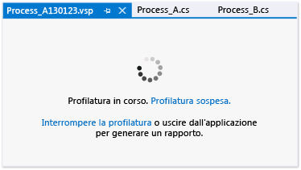

# Impostazione delle opzioni generali della sessione di prestazioni
[!INCLUDE[vs2017banner](../code-quality/includes/vs2017banner.md)]

È possibile impostare il metodo di raccolta e le convenzioni di denominazione dei dati di profilatura per una sessione di prestazioni degli strumenti di profilatura di [!INCLUDE[vsprvs](../code-quality/includes/vsprvs_md.md)] nella pagina **Generale** della finestra di dialogo delle proprietà della sessione di prestazioni.  Per aprire questa finestra di dialogo da **Esplora prestazioni**, fare clic con il pulsante destro del mouse sulla sessione di prestazioni, quindi scegliere **Proprietà**.  
  
 **Requisiti**  
  
-   [!INCLUDE[vsUltLong](../code-quality/includes/vsultlong_md.md)], [!INCLUDE[vsPreLong](../code-quality/includes/vsprelong_md.md)], [!INCLUDE[vsPro](../code-quality/includes/vspro_md.md)]  
  
## Scelta dei metodi di raccolta  
 Scegliere il metodo di raccolta base selezionando una delle opzioni disponibili in **Insieme di profilo**.  Nella tabella seguente sono illustrate le opzioni disponibili:  
  
|||  
|-|-|  
|**Campionamento**.  Il metodo di campionamento consente di raccogliere informazioni di profilo a intervalli regolari.  Questo metodo è utile per individuare i problemi correlati all'utilizzo del processore ed è il metodo consigliato per l'avvio della maggior parte delle analisi delle prestazioni.|-   [Raccolta di statistiche sulle prestazioni tramite il campionamento](../profiling/collecting-performance-statistics-by-using-sampling.md)|  
|**Strumentazione**.  Il metodo di strumentazione inserisce in una copia di un modulo codice di profilo che registra ogni chiamata di funzione, ingresso e uscita delle funzioni nel modulo durante un'esecuzione del profilo.  Questo metodo consente di raccogliere informazioni di intervallo dettagliate su una sezione di codice e di valutare l'impatto delle operazioni di input e output sulle prestazioni dell'applicazione.|-   [Raccolta di dati di intervallo dettagliati tramite la strumentazione](../profiling/collecting-detailed-timing-data-by-using-instrumentation.md)|  
|**Concorrenza**.  Il metodo di concorrenza consente di raccogliere dati per ogni evento che blocca l'esecuzione del codice, ad esempio quando un thread attende che venga rimosso un blocco sull'accesso a una risorsa dell'applicazione.  Questo metodo è utile per l'analisi delle applicazioni multithreading.|-   [Raccolta di dati di concorrenza di thread e processi](../profiling/collecting-thread-and-process-concurrency-data.md)|  
  
 È possibile raccogliere i dati di memoria .NET tramite i metodi di campionamento o strumentazione.  Selezionare il tipo di dati in **Profilo di memoria .NET.**  
  
|||  
|-|-|  
|**Raccogliere le informazioni sull'allocazione dell'oggetto .NET**.  Per impostazione predefinita, i dati includono il numero e le dimensioni degli oggetti allocati.  Selezionare o deselezionare questa casella di controllo per abilitare o disabilitare la raccolta dei dati di memoria .NET.   **Raccogliere anche le informazioni sulla durata dell'oggetto .NET**.  Selezionare questa casella di controllo per includere i dati sulle generazioni di Garbage Collection utilizzate per recuperare gli oggetti di memoria.|-   [Raccolta di dati di durata e allocazione di memoria .NET](../profiling/collecting-dotnet-memory-allocation-and-lifetime-data.md)|  
  
 Una pagina della sessione di profilatura viene visualizzata quando si comincia a profilare un'applicazione, dove è possibile sospendere, riprendere e interrompere la profilatura.  
  
   
  
## Impostazione delle opzioni dei file Datra di profilatura  
  
|||  
|-|-|  
|**Rapporto**.  Per impostazione predefinita, al file dei dati di profilo \(vsp\) viene assegnato il nome dell'applicazione profilata. Tale file è contenuto nella cartella del progetto o della soluzione.  Viene inoltra aggiunta una stringa data al nome e ai file di dati viene aggiunto un numero incrementale per evitare che si creino nomi duplicati.  Queste opzioni possono essere modificate.|-   [Procedura: impostare le opzioni relative ai nomi file dei dati di profilatura](../profiling/how-to-set-performance-data-file-name-options.md)|