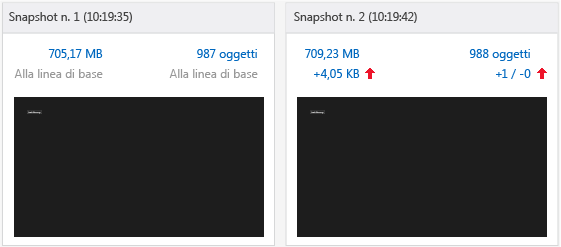
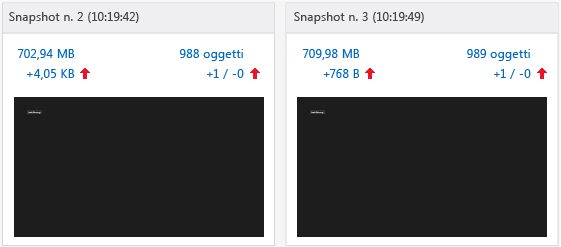
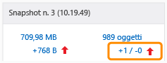
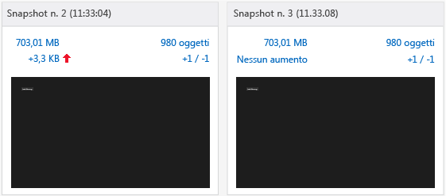

# <a name="walkthrough-find-a-memory-leak-javascript"></a>Procedura dettagliata: trovare una perdita di memoria (JavaScript)
  
  
 Questa procedura dettagliata ti assiste nel processo di identificazione e risoluzione di un semplice problema di memoria usando JavaScript Memory Analyzer. JavaScript Memory Analyzer è disponibile in Visual Studio per le app Windows Store compilate per Windows con JavaScript. In questo scenario creerai un'app che conserva erroneamente gli elementi DOM in memoria anziché eliminare gli elementi alla stessa velocità con cui vengono creati.  
  
 Anche se la causa della perdita di memoria in questa app è molto specifica, i passaggi riportati in questo articolo illustrano un flusso di lavoro che risulta in genere efficace nell'isolare gli oggetti che provocano la perdita di memoria.  
  
### <a name="running-the-javascript-memory-analyzer-test-app"></a>Esecuzione dell'app di test di JavaScript Memory Analyzer  
  
1.  In Visual Studio scegli **File**, **Nuovo**, **Progetto**.  
  
2.  Scegli **JavaScript** nel riquadro sinistro, quindi scegli **Windows**, **Windows 8**, **Universale** o **App di Windows Phone**.  
  
    > [!IMPORTANT]
    >  I risultati dell'utilizzo della memoria illustrati in questo argomento vengono testati su un'applicazione Windows 8.  
  
3.  Scegli il modello di progetto **Applicazione vuota** nel riquadro centrale.  
  
4.  Nella casella **Nome** specifica un nome come `JS_Mem_Tester`, quindi scegli **OK**.  
  
5.  In **Esplora soluzioni** aprire il file default.html e incollare il codice seguente tra i tag \<body>:  
  
    ```html  
    <div class="wrapper">  
        <div id="item"></div>  
        <button class="memleak" style="display: block" >Leak Memory</button>  
    </div>  
    ```  
  
    > [!IMPORTANT]
    >  Se usi un modello di app universale Windows 8.1, dovrai aggiornare il codice HTML e CSS nei progetti .Windows e .WindowsPhone.  
  
6.  Apri default.css e aggiungi il codice CSS seguente:  
  
    ```css  
    .memleak {  
        position: absolute; top: 100px; left: 100px;  
    }  
    ```  
  
7.  Apri default.js e sostituisci tutto il codice con il seguente:  
  
    ```javascript  
    (function () {  
        "use strict";  
  
        var app = WinJS.Application;  
        var activation = Windows.ApplicationModel.Activation;  
  
        var wrapper;  
        var elem;  
  
        app.onactivated = function (args) {  
            if (args.detail.kind === activation.ActivationKind.launch) {  
                if (args.detail.previousExecutionState !== activation.ApplicationExecutionState.terminated) {  
                } else {  
                }  
                args.setPromise(WinJS.UI.processAll());  
  
                elem = document.getElementById("item");  
                wrapper = document.querySelector(".wrapper");  
                var btn = document.querySelector(".memleak");  
                btn.addEventListener("click", btnHandler);  
                run();  
            }  
        };  
  
        app.oncheckpoint = function (args) {  
        };  
  
        app.start();  
  
        function run() {  
            initialize();  
            load();  
        }  
  
        function initialize() {  
  
            if (wrapper != null) {  
                elem.removeNode(true);  
            }  
        }  
  
        function load() {  
  
            var newDiv = document.createElement("div");  
  
            newDiv.style.zIndex = "-1";  
            newDiv.id = "item";  
  
            wrapper.appendChild(newDiv);  
        }  
  
        function btnHandler(args) {  
            run();  
        }  
  
    })();  
    ```  
  
8.  Premere il tasto F5 per avviare il debug. Verifica che il pulsante **Perdita memoria** sia presente nella pagina.  
  
9. Torna a Visual Studio (ALT+TAB) e premi MAIUSC+F5 per arrestare il debug.  
  
     Dopo aver verificato il funzionamento dell'app, puoi analizzare l'utilizzo della memoria.  
  
### <a name="analyzing-the-memory-usage"></a>Analisi dell'utilizzo della memoria  
  
1.  Sulla barra degli strumenti **Debug** , nell'elenco **Avvia debug** , scegli la destinazione di debug per il progetto aggiornato: uno degli emulatori Windows Phone o **Simulatore**.  
  
    > [!TIP]
    >  Per un'app di Windows Store, puoi anche scegliere **Computer locale** o **Computer remoto** in questo elenco. L'emulatore o il simulatore può essere posizionato accanto a Visual Studio per poter passare agevolmente tra l'app in esecuzione e JavaScript Memory Analyzer. Per altre informazioni, vedere [Eseguire app da Visual Studio](../debugger/run-store-apps-from-visual-studio.md) ed [Eseguire app di Windows Store in un computer remoto](../debugger/run-windows-store-apps-on-a-remote-machine.md).  
  
2.  Scegliere **Profiler prestazioni** dal menu **Debug**.  
  
3.  In **Strumenti disponibili**scegli **Memoria JavaScript**e scegli **Avvia**.  
  
     In questa esercitazione assocerai Memory Analyzer al progetto di avvio. Per informazioni su altre opzioni, come l'associazione dell'analizzatore di memoria a un'app installata, vedere [Memoria JavaScript](../profiling/javascript-memory.md).  
  
     Quando avvii l'analizzatore di memoria, potresti vedere un messaggio di Controllo dell'account utente che richiede l'autorizzazione a eseguire VsEtwCollector.exe. Scegliere **Sì**.  
  
4.  Scegli il pulsante **Perdita memoria** quattro volte in successione.  
  
     Quando scegli il pulsante, il codice di gestione dell'evento in default.js non funziona, cosa che si tradurrà in una perdita di memoria. Lo userai per scopi diagnostici.  
  
    > [!TIP]
    >  La ripetizione dello scenario che desideri testare per una perdita di memoria ti consente di filtrare più facilmente le informazioni non interessanti, ad esempio oggetti aggiunti all'heap durante l'inizializzazione dell'app o il caricamento di una pagina.  
  
5.  Dall'app in esecuzione passa a Visual Studio (ALT+TAB).  
  
     JavaScript Memory Analyzer visualizza informazioni in una nuova scheda in Visual Studio.  
  
     Il grafico relativo alla memoria in questa visualizzazione di riepilogo mostra l'utilizzo della memoria del processo nel tempo. La visualizzazione include inoltre comandi come **Crea snapshot heap**. Uno snapshot fornisce informazioni dettagliate sull'utilizzo della memoria in un momento specifico. Per altre informazioni, vedere [Memoria JavaScript](../profiling/javascript-memory.md).  
  
6.  Scegli **Crea snapshot heap**.  
  
7.  Passa all'app e scegli **Perdita memoria**.  
  
8.  Passa a Visual Studio e scegli **Crea snapshot heap** .  
  
     Questa illustrazione mostra lo snapshot della linea di base (n.1) e lo snapshot n.2.  
  
       
  
    > [!NOTE]
    >  L'Emulatore Windows Phone non mostra una schermata dell'app quando è stato scattato lo snapshot.  
  
9. Passa all'app e scegli nuovamente il pulsante **Perdita memoria** .  
  
10. Passa a Visual Studio e scegli **Crea snapshot heap** per la terza volta.  
  
    > [!TIP]
    >  Creando un terzo snapshot in questo flusso di lavoro, puoi escludere le modifiche non associate a perdite di memoria dello snapshot della linea di base rispetto al secondo snapshot. Ad esempio, è possibile che vi siano modifiche previste, come l'aggiornamento delle intestazioni e dei piè di pagina di una pagina, che generano modifica nell'utilizzo della memoria, ma che potrebbero non essere correlate alle perdite di memoria.  
  
     Questa illustrazione mostra lo snapshot n.2 e lo snapshot n.3.  
  
       
  
11. In Visual Studio scegli **Arresta** per interrompere la profilatura.  
  
12. In Visual Studio confronta gli snapshot. Lo Snapshot n. 2 mostra quanto segue:  
  
    -   Le dimensioni dell'heap (indicate dalla freccia su rossa a sinistra) sono aumentate di parecchi KB rispetto allo snapshot n.1.  
  
        > [!IMPORTANT]
        >  I valori di utilizzo esatti della memoria per le dimensioni dell'heap dipendono dalla destinazione di debug.  
  
    -   Il numero di oggetti sull'heap (indicato dalla freccia su rossa a destra) è aumentato rispetto allo snapshot n.1. È stato aggiunto un oggetto (+1) e non è stato rimosso alcun oggetto (-0).  
  
     Lo Snapshot n. 3 mostra quanto segue:  
  
    -   Le dimensioni dell'heap sono aumentate ancora di parecchie centinaia di byte rispetto allo snapshot n. 2.  
  
    -   Il numero di oggetti sull'heap è aumentato ancora rispetto allo snapshot n.2. È stato aggiunto un oggetto (+1) e non è stato rimosso alcun oggetto (-0).  
  
13. Nello snapshot n. 3 scegli il testo del collegamento a destra, che mostra un valore di +1/-0 accanto alla freccia su rossa.  
  
       
  
     Verrà aperta una visualizzazione differenziale degli oggetti sull'heap, denominata **Snapshot n. 3 - Snapshot n. 2**, con la visualizzazione Tipi aperta per impostazione predefinita. Per impostazione predefinita, vedrai un elenco di oggetti aggiunti all'heap tra lo snapshot n. 2 e lo snapshot n. 3.  
  
14. Nel filtro **Ambito** scegli **Oggetti rimasti dallo snapshot n. 2**.  
  
15. Apri l'oggetto HTMLDivElement nella parte superiore dell'albero di oggetti come illustrato di seguito.  
  
       
  
     Questa visualizzazione mostra informazioni utili sulla perdita di memoria, ad esempio:  
  
    -   Questa visualizzazione mostra un elemento DIV con un ID di `item`e le dimensioni conservate per l'oggetto sono parecchie centinaia di byte (il valore esatto potrà variare).  
  
    -   Questo oggetto è rimasto dallo snapshot n. 2 e rappresenta una potenziale perdita di memoria.  
  
     In questa fase è bene avere una certa conoscenza dell'app. La scelta del pulsante **Perdita memoria** dovrebbe eliminare un elemento DIV e aggiungerne un altro, pertanto il codice non sembra funzionare. La sezione successiva spiega come risolvere questo problema.  
  
    > [!TIP]
    >  Talvolta, individuare un oggetto relativamente all'oggetto `Global` può aiutare a identificare quell'oggetto. A questo scopo, apri il menu di scelta rapida per l'identificatore e scegli **Mostra in visualizzazione radice**.  
  
##  <a name="a-namefixingmemorya-fixing-the-memory-issue"></a><a name="FixingMemory"></a> Correzione del problema di memoria  
  
1.  Usando i dati ottenuti dal profiler, esamina il codice responsabile della rimozione di elementi DOM con un ID "item". Questo si verifica nella funzione `initialize()`.  
  
    ```javascript  
    function initialize() {  
  
        if (wrapper != null) {  
            elem.removeNode(true);  
        }  
    }  
    ```  
  
     `elem.removeNode(true)`, probabilmente, non funziona correttamente. Esamina il modo in cui il codice memorizza nella cache l'elemento DOM e rileva un problema; il riferimento all'elemento memorizzato nella cache non viene aggiornato.  
  
2.  Nel file default.js aggiungi la seguente riga di codice alla funzione di caricamento, appena prima di chiamare `appendChild`:  
  
    ```javascript  
    elem = newDiv;  
    ```  
  
     Questo codice aggiorna il riferimento all'elemento memorizzato nella cache in modo che l'elemento venga rimosso correttamente quando scegli il pulsante **Perdita memoria** . Il codice completo per la funzione di caricamento ha ora il seguente aspetto:  
  
    ```javascript  
    function load() {  
  
        wrapper = document.querySelector(".wrapper");  
  
        var newDiv = document.createElement("div");  
  
        newDiv.style.zIndex = "-1";  
        newDiv.id = "item";  
        elem = newDiv;  
  
        wrapper.appendChild(newDiv);  
    }  
    ```  
  
3.  Scegliere **Prestazioni e diagnostica** dal menu **Debug**.  
  
4.  In **Strumenti disponibili**scegli **Memoria JavaScript**e scegli **Avvia**.  
  
5.  Segui la stessa procedura per eseguire tre snapshot. I passaggi sono riepilogati di seguito:  
  
    1.  Nell'app scegli il pulsante **Perdita memoria** quattro volte in successione.  
  
    2.  Passa a Visual Studio e scegli **Crea snapshot heap** per lo snapshot della linea di base.  
  
    3.  Nell'app scegli il pulsante **Perdita memoria** .  
  
    4.  Passa a Visual Studio e scegli **Crea snapshot heap** per il secondo snapshot.  
  
    5.  Nell'app scegli il pulsante **Perdita memoria** .  
  
    6.  Passa a Visual Studio e scegli **Crea snapshot heap** per il terzo snapshot.  
  
     Lo snapshot n. 3 indica che le dimensioni dell'heap non sono aumentate ( **Nessun aumento** ) rispetto allo snapshot n. 2 e che il numero di oggetti è ora +1/-1, a indicare che è stato aggiunto un oggetto e ne è stato rimosso un altro. Questo è il comportamento desiderato.  
  
     L'illustrazione seguente mostra lo snapshot n. 2 e lo snapshot n. 3.  
  
       
  
## <a name="see-also"></a>Vedere anche  
 [Memoria JavaScript](../profiling/javascript-memory.md)
