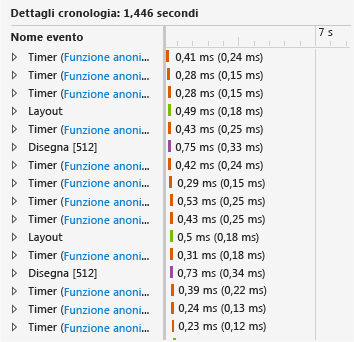
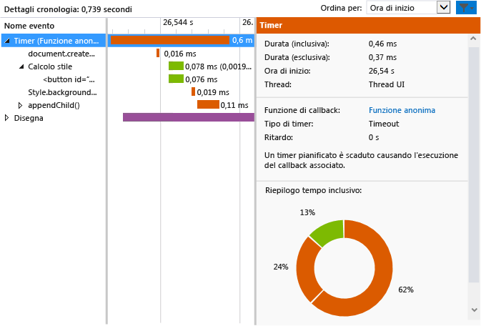

# <a name="walkthrough-improving-ui-responsiveness-html"></a>Procedura dettagliata: Miglioramento della velocità di risposta dell'interfaccia utente (JavaScript)
Questa procedura dettagliata descrive i passaggi per identificare e risolvere un problema di prestazioni tramite il [profiler della velocità di risposta interfaccia utente HTML](../profiling/html-ui-responsiveness.md). Il profiler è disponibile in Visual Studio per le app universali di Windows e le app di Windows Store con JavaScript. In questo scenario creerai un'app di test delle prestazioni che aggiorna gli elementi DOM troppo frequentemente e userai il profiler per identificare e risolvere il problema.  
  
### <a name="creating-and-running-the-performance-test-app"></a>Creazione ed esecuzione dell'app di test delle prestazioni  
  
1.  In Visual Studio creare un nuovo progetto JavaScript universale di Windows. Selezionare **File / Nuovo / Progetto**. Scegliere **JavaScript** nel riquadro sinistro, quindi scegliere **Windows**, **Windows 10** e infine **Universale** o **Windows Phone**.  
  
2.  > [!IMPORTANT]
    >  I risultati diagnostici illustrati in questo argomento sono relativi a un'app Windows 8.  
  
3.  Scegliere uno dei modelli di progetto vuoti nel riquadro centrale, ad esempio **Applicazione vuota**.  
  
4.  Nella casella **Nome** specificare un nome come `JS_Perf_Tester`, quindi scegliere **OK**.  
  
5.  In **Esplora soluzioni** aprire il file default.html e incollare il codice seguente tra i tag \<body>:  
  
    ```html  
    <div class="wrapper">  
        <button id="content">Waiting for values</button>  
    </div>  
    ```  
  
6.  Apri default.css e aggiungi il codice CSS seguente:  
  
    ```css  
    #content {  
        margin-left: 100px;  
        margin-top: 100px;  
    }  
    ```  
  
7.  Apri default.js e sostituisci tutto il codice con il seguente:  
  
    ```javascript  
    (function () {  
        "use strict";  
  
        var app = WinJS.Application;  
        var activation = Windows.ApplicationModel.Activation;  
  
        var content;  
        var wrapper;  
  
        app.onactivated = function (args) {  
            if (args.detail.kind === activation.ActivationKind.launch) {  
                if (args.detail.previousExecutionState !== activation.ApplicationExecutionState.terminated) {  
  
                    content = document.getElementById("content");  
                    wrapper = document.querySelector(".wrapper");  
  
                    content.addEventListener("click", handler);  
  
                } else {  
                }  
  
                args.setPromise(WinJS.UI.processAll());  
            }  
        };  
  
        app.oncheckpoint = function (args) {  
        };  
  
        app.start();  
  
        var idx = 0;  
        var count = 0;  
        var max = 5000;  
        var text = ["what", "is", "the", "Matrix?"];  
        var color = ["red", "crimson", "maroon", "purple"];  
  
        function increment() {  
  
            setTimeout(function () {  
  
                idx++;  
                count++;  
  
                if (idx > 3) { idx = 0; }  
                if (count < max) { increment(); }  
  
            }, 1000);  
        }  
  
        function setValues() {  
  
            content = document.getElementById("content");  
            content.removeNode(true);  
  
            var newNode = document.createElement("button");  
            newNode.id = "content";  
            newNode.textContent = text[idx];  
            //newNode.textContent = getData();  
            newNode.style.backgroundColor = color[idx];  
            //newNode.style.animationName = "move";  
            //count++;  
  
            wrapper.appendChild(newNode);  
  
        }  
  
        function update() {  
  
            setTimeout(function () {  
  
                setValues();  
                if (count < max) { update(); }  
            });  
        }  
  
        function handler(args) {  
  
            content.textContent = "eenie";  
            increment();  
            update();  
        }  
  
    })();  
  
    ```  
  
8.  Premere il tasto F5 per avviare il debug. Verificare che il pulsante **In attesa di valori** sia presente nella pagina.  
  
9. Scegliere **In attesa di valori** e verificare che il testo e il colore del pulsante si aggiornino circa una volta al secondo. Si tratta di un comportamento correlato alla progettazione.  
  
10. Torna a Visual Studio (ALT+TAB) e premi MAIUSC+F5 per arrestare il debug.  
  
     Dopo aver verificato il corretto funzionamento dell'app, puoi esaminarne le prestazioni usando il profiler.  
  
### <a name="analyzing-performance-data"></a>Analisi dei dati delle prestazioni  
  
1.  Nella barra degli strumenti **Debug**, nell'elenco **Avvia debug**, scegliere uno degli emulatori Windows Phone oppure **Simulatore**.  
  
2.  Scegliere **Prestazioni e diagnostica** dal menu **Debug**.  
  
3.  In **Strumenti disponibili** scegliere **Velocità di risposta interfaccia utente HTML** e quindi **Avvia**.  
  
     In questa esercitazione assocerai il profiler al progetto di avvio. Per informazioni su altre opzioni, ad esempio l'associazione del profiler a un'app installata, vedere [Velocità di risposta interfaccia utente HTML](../profiling/html-ui-responsiveness.md).  
  
     Quando avvii il profiler, potresti vedere un messaggio di Controllo dell'account utente che richiede l'autorizzazione a eseguire VsEtwCollector.exe. Scegliere **Sì**.  
  
4.  Nell'app in esecuzione, scegliere **In attesa di valori** e attendere circa 10 secondi. Verifica che il testo e il colore del pulsante si aggiornino circa una volta al secondo.  
  
5.  Dall'app in esecuzione passa a Visual Studio (ALT+TAB).  
  
6.  Scegliere **Arresta raccolta**.  
  
     Il profiler visualizza informazioni in una nuova scheda in Visual Studio. Quando analizzi i dati relativi alla velocità effettiva visuale (FPS) e all'utilizzo della CPU, puoi identificare con facilità alcune tendenze:  
  
    -   L'utilizzo della CPU aumenta considerevolmente dopo circa 3 secondi (dopo che è stato premuto il pulsante **In attesa di valori**) e mostra un chiaro schema di eventi (una combinazione coerente di eventi di scripting, stile e rendering) da questo punto in avanti.  
  
    -   La velocità effettiva visuale rimane inalterata e il valore FPS rimane su 60 (nessun fotogramma eliminato).  
  
     Esaminiamo ora una sezione tipica del grafico di utilizzo della CPU per analizzare il comportamento dell'app in questo periodo di intensa attività.  
  
7.  Seleziona una porzione di uno-due secondi nella parte centrale del grafico di utilizzo della CPU (fai clic e trascina o usa i tasti freccia e TAB). La figura seguente mostra il grafico di utilizzo della CPU dopo una selezione. L'area non condivisa è la sezione.  
  
       
  
8.  Scegliere **Zoom avanti**.  
  
     Il grafico cambia per mostrare in maggior dettaglio il periodo selezionato. La figura seguente mostra il grafico di utilizzo della CPU dopo l'esecuzione dello zoom avanti. I dati specifici possono variare, ma il modello generale rimane tale.  
  
       
  
     I dettagli della sequenza temporale nel riquadro inferiore riguardano il periodo selezionato.  
  
       
  
     Gli eventi nei dettagli della sequenza temporale confermano tendenze visibili nel grafico di utilizzo della CPU: molti eventi hanno luogo in brevi periodi di tempo. La visualizzazione dei dettagli della sequenza temporale mostra che si tratta di eventi `Timer`, `Layout` e `Paint`.  
  
9. Usare il menu di scelta rapida o fare clic con il pulsante destro del mouse su uno degli eventi `Timer` nel riquadro inferiore, quindi scegliere **Filtra per evento**. Di seguito è riportato un esempio di dettagli tipici per uno degli eventi `Timer` in questa app di test.  
  
       
  
     Dai dati puoi rilevare diversi fatti. Ad esempio:  
  
    -   Ogni evento `Timer`, codificato con colori per poterlo identificare come evento di scripting, include una chiamata a `document.createElement`, seguita da un calcolo di stile e da una chiamata a `style.backgroundColor` e `appendChild()`.  
  
    -   Nel breve intervallo di tempo selezionato (circa uno-due secondi), hanno luogo numerosi eventi `Timer`, `Layout` e `Paint`. Gli eventi `Timer` si verificano molto più frequentemente dell'aggiornamento al secondo che si verifica dopo l'esecuzione dell'app e la scelta del pulsante **In attesa di valori**.  
  
10. A scopo di analisi, scegli il collegamento alla funzione anonima per uno degli eventi `Timer` nel riquadro inferiore sinistro. La funzione seguente si apre in default.js:  
  
    ```javascript  
    function update() {  
  
        setTimeout(function () {  
  
            setValues();  
            if (count < max) { update(); }  
        });  
    }  
    ```  
  
     Questa funzione ricorsiva imposta un ciclo che chiama la funzione `setValues()`, che aggiorna il pulsante nell'interfaccia utente. Esaminando i diversi eventi timer nel profiler, noterai che la maggior parte o tutti gli eventi timer derivano da questo codice, che viene eseguito troppo spesso e presumibilmente causa il problema.  
  
### <a name="fixing-the-performance-issue"></a>Risoluzione del problema di prestazioni  
  
1.  Sostituisci la funzione `update()` con il codice seguente:  
  
    ```javascript  
    function update() {  
  
        setTimeout(function () {  
  
            setValues();  
            if (count < max) { update(); }  
        }, 1000 );  
    }  
    ```  
  
     La versione corretta del codice include un ritardo di 1000 millisecondi, che è stato omesso dalla versione precedente del codice, con conseguente uso di un valore di ritardo predefinito. Dai dati del profiler, risulta che il valore predefinito è zero millisecondi, che comporta un'esecuzione della funzione `setValues()` troppo frequente.  
  
2.  Esegui nuovamente il profiler della velocità di risposta interfaccia utente HTML e verifica il grafico di utilizzo della CPU. Noterai che il numero eccessivo di eventi non si verifica più e che l'utilizzo della CPU è sceso quasi a zero. Problema risolto.  
  
## <a name="see-also"></a>Vedere anche  
 [Velocità di risposta interfaccia utente HTML](../profiling/html-ui-responsiveness.md)
