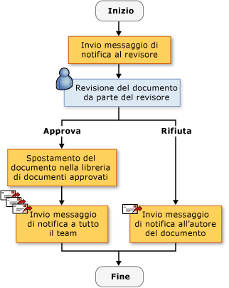
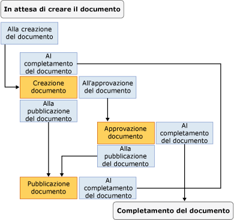

# Creazione di soluzioni flusso di lavoro SharePoint
  In [!INCLUDE[vsprvs](../sharepoint/includes/vsprvs-md.md)] sono disponibili gli strumenti per creare flussi di lavoro personalizzati che consentono di gestire il ciclo di vita di documenti e voci di elenco in un sito Web di SharePoint.  Gli elementi forniti includono una finestra di progettazione, un set di controlli dell'attività e i riferimenti all'assembly necessari.  [!INCLUDE[vsprvs](../sharepoint/includes/vsprvs-md.md)] include inoltre la **Personalizzazione guidata SharePoint** per consentire la creazione e la configurazione dei flussi di lavoro.  
  
 Per l'elenco di prerequisiti relativi alla creazione di progetti SharePoint in [!INCLUDE[vsprvs](../sharepoint/includes/vsprvs-md.md)], vedere [Requisiti per lo sviluppo di soluzioni SharePoint](../sharepoint/requirements-for-developing-sharepoint-solutions.md).  Per ulteriori informazioni su SharePoint, vedere [Prodotti e tecnologie Microsoft SharePoint](http://go.microsoft.com/fwlink/?LinkId=178470).  
  
## Flussi di lavoro SharePoint  
 Quando si aggiunge un flusso di lavoro a un elenco o una libreria SharePoint, su tutti gli elementi della libreria o dell'elenco viene applicato un processo aziendale.  Un flusso di lavoro descrive le azioni che il sistema o gli utenti devono eseguire su ogni elemento, ad esempio l'invio dell'elemento da modificare e rivedere.  Queste azioni, note come *attività*, sono i blocchi predefiniti del flusso di lavoro.  
  
 I flussi di lavoro di SharePoint possono essere creati in [!INCLUDE[vsprvs](../sharepoint/includes/vsprvs-md.md)] e distribuiti in un sito Web di SharePoint.  Una volta distribuito in SharePoint, un flusso di lavoro può essere associato a una libreria o un elenco.  Può quindi essere avviato automaticamente mediante un processo o manualmente da un utente.  Per ulteriori informazioni sul funzionamento del flusso di lavoro, vedere [Utilizzo dei flussi di lavoro per gestire processi](http://go.microsoft.com/fwlink/?LinkId=79757).  
  
## Creazione di flussi di lavoro SharePoint personalizzati  
 In [!INCLUDE[vsprvs](../sharepoint/includes/vsprvs-md.md)] sono disponibili due progetti flusso di lavoro di SharePoint: **Flusso di lavoro sequenzialeFlusso di lavoro macchina a stati**.  
  
 Un *flusso di lavoro sequenziale* rappresenta una serie di passaggi  che vengono eseguiti uno dopo l'altro fino al completamento dell'ultima attività.  La loro esecuzione è sempre rigidamente sequenziale.  Poiché possono ricevere eventi esterni e includere flussi logici paralleli, l'ordine esatto di esecuzione può variare.  Nella figura seguente viene illustrato un esempio di flusso di lavoro sequenziale.  
  
   
  
 Il *flusso di lavoro macchina a stati* rappresenta un insieme di stati, transizioni e azioni.  I passaggi in un flusso di lavoro macchina a stati vengono eseguiti in modo asincrono,  ovvero non necessariamente uno dopo l'altro, ma conseguentemente ad azioni e stati.  Viene assegnato uno stato iniziale e successivamente, in seguito a un evento, si verifica una transizione a un altro stato.  La macchina a stati può disporre di uno stato finale che consente di determinare la fine del flusso di lavoro.  Nel diagramma seguente è mostrato un esempio di flusso di lavoro macchina a stati.  
  
   
  
 Per ulteriori informazioni sui tipi di flusso di lavoro, vedere [Tipi di flusso di lavoro](http://go.microsoft.com/fwlink/?LinkId=178995).  
  
### Utilizzo della procedura guidata  
 Quando si crea un progetto flusso di lavoro di SharePoint in [!INCLUDE[vsprvs](../sharepoint/includes/vsprvs-md.md)], innanzitutto si specificano le impostazioni nella **Personalizzazione guidata SharePoint**.  Queste impostazioni vengono utilizzate dalla procedura guidata per creare un progetto in **Esplora soluzioni**.  In tale progetto sono contenuti un file di codice, diversi file utilizzati per distribuire il flusso di lavoro e i riferimenti agli assembly necessari per creare un flusso di lavoro di SharePoint personalizzato.  
  
 Una volta creato il flusso di lavoro, è possibile modificarne le proprietà nella relativa finestra.  Sebbene la maggior parte delle proprietà del flusso di lavoro possano essere modificate direttamente nella finestra Proprietà, alcune richiedono la selezione del pulsante con i puntini di sospensione \(\) per modificare i valori.  Questo pulsante consente di riavviare la **Personalizzazione guidata SharePoint**.  Dopo aver apportato le modifiche ai valori della proprietà, selezionare il pulsante **Fine** per renderle effettive.  
  
> [!NOTE]  
>  La proprietà **Tipo di flusso di lavoro** è di sola lettura e non può essere modificata.  Se si desidera modificare il tipo è necessario creare un altro flusso di lavoro.  
  
## Progettazione di un flusso di lavoro di SharePoint  
 Dopo aver definito tutti i passaggi nel processo aziendale, utilizzare Progettazione flussi di lavoro di [!INCLUDE[vsprvs](../sharepoint/includes/vsprvs-md.md)] per progettare il flusso di lavoro di SharePoint.  Per aprire la finestra di progettazione, fare doppio clic su Workflow1.cs o Workflow1.vb in **Esplora soluzioni**, oppure aprire il menu di scelta rapida per uno di tali file e quindi scegliere **Apri**.  
  
### Attività  
 Per progettare un flusso di lavoro, aggiungere le attività dalla **Casella degli strumenti** a una *pianificazione del flusso di lavoro* nella finestra di progettazione.  Una pianificazione del flusso di lavoro contiene la sequenza delle attività nell'ordine in cui devono essere eseguite.  
  
 Sono disponibili tre tipi di attività:  
  
-   Le *attività semplici* eseguono una sola unità di lavoro, ad esempio "ritarda per un giorno" o "avvia servizio Web".  
  
-   Le *attività composte* contengono altre attività, ad esempio un'attività condizionale potrebbe contenere due rami.  
  
 Entrambi tipi di attività sono disponibili nella **Casella degli strumenti**.  
  
 Per le attività è possibile specificare proprietà, metodi ed eventi,  Utilizzare la finestra **Proprietà** per impostare le proprietà di un'attività.  
  
 È anche possibile creare un'attività personalizzata.  Per ulteriori informazioni, vedere [Procedura dettagliata: creare un'attività personalizzata per un flusso di lavoro del sito](../sharepoint/walkthrough-create-a-custom-site-workflow-activity.md).  
  
 Le attività sono organizzate nelle schede seguenti della **Casella degli strumenti**:  
  
-   **Flusso di lavoro SharePoint**  
  
-   **Windows Workflow v3.0**  
  
-   **Windows Workflow v3.5**  
  
 Non tutte le attività del flusso di lavoro principali sono supportate da SharePoint.  Per ulteriori informazioni, vedere [Attività del flusso di lavoro per una panoramica di Windows SharePoint Services](http://go.microsoft.com/fwlink/?LinkID=156094).  
  
#### Attività del flusso di lavoro SharePoint  
 Nelle schede **Flusso di lavoro di SharePoint** sono contenute attività specifiche da utilizzare in [!INCLUDE[wss_14_long](../sharepoint/includes/wss-14-long-md.md)].  Queste attività semplificano lo sviluppo di flussi di lavoro relativi al ciclo di vita dei documenti.  Per ulteriori informazioni sulle attività elencate nella scheda **Flusso di lavoro di SharePoint**, vedere [Cenni preliminari sulle attività dei flussi di lavoro per Windows SharePoint Services](http://go.microsoft.com/fwlink/?LinkID=156094).  
  
#### Attività del flusso di lavoro Windows  
 Nelle schede **Flusso di lavoro di Windows** sono contenute le attività fornite da [!INCLUDE[TLA#tla_workflow](../sharepoint/includes/tlasharptla-workflow-md.md)].  È possibile utilizzare queste attività per creare pianificazioni del flusso di lavoro per qualsiasi tipo di applicazione del flusso di lavoro di Windows.  
  
 Per ulteriori informazioni sulle attività elencate nelle schede **Flusso di lavoro Windows**, vedere [Attività di Windows Workflow Foundation](http://go.microsoft.com/fwlink/?LinkID=156096).  Per ulteriori informazioni su Windows Workflow Foundation, vedere [Cenni preliminari su Windows](http://go.microsoft.com/fwlink/?LinkID=128632).  
  
### Utilizzo di attività nella finestra di progettazione  
 La pianificazione del flusso di lavoro può contenere una combinazione di attività del flusso di lavoro Windows e del flusso di lavoro SharePoint.  
  
 Nella finestra di progettazione vengono visualizzati dei segnali visivi che consentono di posizionare e configurare correttamente le attività.  Quando si trascina o si effettua una copia di un'attività nella pianificazione del flusso di lavoro, nella finestra di progettazione vengono visualizzate in verde delle icone con il segno di addizione \(\+\) che indicano le posizioni valide per quell'attività nel flusso di lavoro.  Non è possibile posizionare un'attività in una posizione non valida.  Ad esempio, non è possibile posizionare un'attività Send come prima attività in un ramo di attività Listen.  Per ulteriori informazioni, vedere [Portale per gli sviluppatori di SharePoint Designer](http://go.microsoft.com/fwlink/?LinkId=178476).  
  
## Raccolta delle informazioni durante il flusso di lavoro  
 È possibile raccogliere nel flusso di lavoro informazioni dagli utenti a orari predefinite  utilizzando i moduli o le proprietà dell'elemento.  
  
### Form  
 I form sono simili a finestre di dialogo in cui sono contenute domande e possibilità di risposta per gli utenti.  
  
 In un flusso di lavoro possono essere utilizzati quattro tipi di form:  
  
-   Associazione  
  
-   Avvio  
  
-   Modifica  
  
-   Attività  
  
 In [!INCLUDE[vsprvs](../sharepoint/includes/vsprvs-md.md)] sono inclusi i modelli di elemento per il form di associazione e di avvio.  Un *form di associazione* può consentire all'amministratore di installare i parametri di immissione del flusso di lavoro, ad esempio un limite di spesa per un apposito flusso di lavoro.  Un esempio di un *di un form di avvio* può consentire all'utente di un flusso di lavoro di spesa immettere l'importo speso nel flusso di lavoro.  Per ulteriori informazioni su questi tipi di form, vedere [Modelli di progetto e di elementi di progetto SharePoint](../sharepoint/sharepoint-project-and-project-item-templates.md).  
  
### Proprietà dell'elemento  
 È possibile raccogliere informazioni dagli utenti anche utilizzando le proprietà di un elemento nella libreria o nell'elenco SharePoint.  Nel file di codice principale \(Workflow1.cs o Workflow1.vb\) viene dichiarata un'istanza della classe Microsoft.SharePoint.Workflow.SPWorkflowActivationProperties.WorkflowProperties denominata `workflowProperties`.  Utilizzare l'oggetto `workflowProperties` per accedere alle proprietà della libreria o dell'elenco presente nel codice.  Per un esempio, vedere [Procedura dettagliata: creazione e debug di una soluzione flusso di lavoro SharePoint](../sharepoint/walkthrough-creating-and-debugging-a-sharepoint-workflow-solution.md).  
  
## Debug di un modello di flusso di lavoro SharePoint  
 È possibile eseguire il debug di un progetto flusso di lavoro di SharePoint come se si trattasse del debug di altri progetti basati su Web di [!INCLUDE[vsprvs](../sharepoint/includes/vsprvs-md.md)].  In [!INCLUDE[vsprvs](../sharepoint/includes/vsprvs-md.md)], quando si avvia il relativo debugger [!INCLUDE[vsprvs](../sharepoint/includes/vsprvs-md.md)], vengono utilizzate le impostazioni specificate nella **Personalizzazione guidata SharePoint**  per aprire il sito Web appropriato di SharePoint e associare automaticamente il modello di flusso di lavoro alla libreria o all'elenco corretto.  In [!INCLUDE[vsprvs](../sharepoint/includes/vsprvs-md.md)], inoltre, il debugger di [!INCLUDE[vsprvs](../sharepoint/includes/vsprvs-md.md)] viene associato al processo di [!INCLUDE[wss_14_long](../sharepoint/includes/wss-14-long-md.md)] denominato w3wp.exe.  
  
 Per testare il flusso di lavoro è necessario avviarlo manualmente.  Per ulteriori informazioni, vedere la sezione Debug di flussi di lavoro in [Debug di soluzioni SharePoint](../sharepoint/debugging-sharepoint-solutions.md).  Per ulteriori informazioni sul debug delle applicazioni Web di [!INCLUDE[vsprvs](../sharepoint/includes/vsprvs-md.md)], vedere [Debug di script e applicazioni Web](../debugger/debugging-web-applications-and-script.md).  
  
## Distribuzione di un modello di flusso di lavoro SharePoint  
 I progetti flusso di lavoro di SharePoint per [!INCLUDE[vsprvs](../sharepoint/includes/vsprvs-md.md)] vengono distribuiti come gli altri progetti SharePoint per [!INCLUDE[vsprvs](../sharepoint/includes/vsprvs-md.md)].  Per ulteriori informazioni, vedere [Creazione del pacchetto e distribuzione delle soluzioni SharePoint](../sharepoint/packaging-and-deploying-sharepoint-solutions.md).  
  
## Importazione di flussi di lavoro riutilizzabili globalmente  
 Oltre alla creazione di flussi di lavoro riutilizzabili specifici del sito, SharePoint Designer consente la creazione di *flussi di lavoro riutilizzabili globalmente*, ovvero flussi di lavoro che possono essere utilizzati da qualsiasi sito di SharePoint.  Il progetto di importazione del flusso di lavoro riutilizzabile in [!INCLUDE[vsprvs](../sharepoint/includes/vsprvs-md.md)] al momento non importa flussi di lavoro riutilizzabili globalmente.  Tuttavia, è possibile utilizzare SharePoint Designer per convertire un flusso di lavoro riutilizzabile globalmente in un flusso di lavoro riutilizzabile o importare il flusso di lavoro come flusso di lavoro dichiarativo non convertito.  Per ulteriori informazioni, vedere [Importazione di elementi da un sito di SharePoint esistente](../sharepoint/importing-items-from-an-existing-sharepoint-site.md).  
  
## Argomenti correlati  
  
|Titolo|Descrizione|  
|------------|-----------------|  
|[Procedura dettagliata: creazione e debug di una soluzione flusso di lavoro SharePoint](../sharepoint/walkthrough-creating-and-debugging-a-sharepoint-workflow-solution.md)|Vengono illustrati dettagliatamente la creazione e il debug di un semplice flusso di lavoro di [!INCLUDE[vsprvs](../sharepoint/includes/vsprvs-md.md)].|  
|[Procedura dettagliata: creazione di un flusso di lavoro con form di associazione e di avvio](../sharepoint/walkthrough-creating-a-workflow-with-association-and-initiation-forms.md)|Viene illustrata dettagliatamente la creazione di un flusso di lavoro completo di [!INCLUDE[vsprvs](../sharepoint/includes/vsprvs-md.md)] dotato anche di form di associazione e avvio.|  
|[Procedura dettagliata: aggiungere una pagina dell'applicazione a un flusso di lavoro](../sharepoint/walkthrough-add-an-application-page-to-a-workflow.md)|Si basa sull'argomento [Procedura dettagliata: creazione di un flusso di lavoro con form di associazione e di avvio](../sharepoint/walkthrough-creating-a-workflow-with-association-and-initiation-forms.md) e include un'ulteriore pagina dell'applicazione con estensione aspx relativa ai dati immessi nel flusso di lavoro.|  
|[Procedura dettagliata: creare un'attività personalizzata per un flusso di lavoro del sito](../sharepoint/walkthrough-create-a-custom-site-workflow-activity.md)|Viene illustrato come effettuare due attività principali: creazione di un flusso di lavoro a livello di sito e creazione di un'attività personalizzata del flusso di lavoro.|  
|[Procedura dettagliata: Importare un flusso di lavoro riutilizzabile di SharePoint Designer in Visual Studio](../sharepoint/walkthrough-import-a-sharepoint-designer-reusable-workflow-into-visual-studio.md)|Viene illustrato come importare i flussi di lavoro dichiarativi riutilizzabili creati in SharePoint Designer 2010 in un progetto SharePoint per [!INCLUDE[vsprvs](../sharepoint/includes/vsprvs-md.md)].|  
  
## Vedere anche  
 [Developing SharePoint Solutions](../sharepoint/developing-sharepoint-solutions.md)   
 [Compilazione e debug delle soluzioni SharePoint](../sharepoint/building-and-debugging-sharepoint-solutions.md)   
 [Creazione di pagine applicazione per SharePoint](../sharepoint/creating-application-pages-for-sharepoint.md)  
  
  