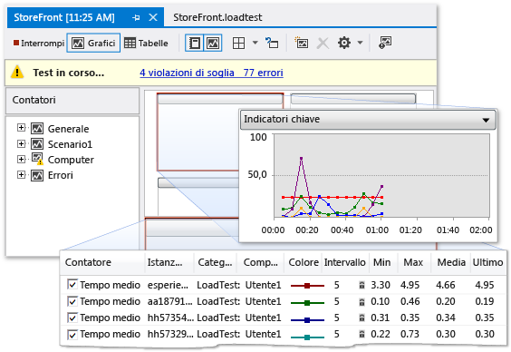

# Profilatura delle prestazioni di applicazioni di SharePoint
  Se le applicazioni di SharePoint vengono eseguite lentamente o in modo inefficiente, è possibile utilizzare le funzionalità di profilatura di Visual Studio per identificare il codice problematico e altri elementi.  Tramite la funzionalità di test di carico, è possibile determinare l'esecuzione di un'applicazione SharePoint in condizioni di stress, ad esempio quando molti utenti accedono contemporaneamente all'applicazione.  Eseguendo i test delle prestazioni Web, è possibile misurare l'esecuzione dell'applicazione sul Web.  Utilizzando i test codificati dell'interfaccia utente, è possibile verificare che l'intera applicazione SharePoint, inclusa l'interfaccia utente, funzioni correttamente.  Quando si utilizzano insieme, questi test possono consentire di identificare i problemi di prestazioni prima di distribuire l'applicazione.  
  
## Panoramica degli strumenti di profilatura  
 Per profilatura si intende il processo di rilevare e registrare il comportamento dell'applicazione durante l'esecuzione.  Profilando l'applicazione, è possibile identificare i problemi come i colli di bottiglia, il codice inefficiente e problemi di allocazione della memoria che rallentano notevolmente l'esecuzione delle applicazioni o utilizzano troppa memoria.  Ad esempio, è possibile utilizzare la profilatura per identificare le aree sensibili del codice, che rappresentano segmenti di codice chiamati di frequente e che possono rallentare le prestazioni generali dell'applicazione.  Dopo aver identificato le aree sensibili, è spesso possibile ottimizzarle o eliminarle.  
  
 È possibile utilizzare diversi strumenti di profilatura nell'ambiente di sviluppo integrato \(IDE\) per identificare e individuare questi tipi di problemi di prestazioni.  Questi strumenti funzionano per i progetti di SharePoint in modo analogo a quanto avviene per altri tipi di progetti di Visual Studio.  La Creazione guidata sessione di prestazioni degli Strumenti di profilatura consente di creare una sessione di prestazioni che utilizza i test che vengono specificati.  Una sessione di prestazioni è un set di dati di configurazione utilizzati per la raccolta di informazioni sulle prestazioni di un'applicazione, con i risultati di una o più esecuzioni della profilatura.  Le sessioni di prestazioni vengono archiviate nella cartella del progetto e visualizzarle in **Esplora prestazioni**.  Per ulteriori informazioni, vedere [Informazioni sui metodi di profilatura](../profiling/understanding-performance-collection-methods.md).  
  
 Dopo avere creato ed eseguito un'analisi del profilo nell'applicazione, un rapporto fornisce dettagli sulle relative prestazioni.  Questo rapporto può includere elementi quali un grafico dell'utilizzo della CPU nel tempo, uno stack di chiamate di funzioni gerarchiche o un albero delle chiamate.  Il contenuto esatto del rapporto può variare, a seconda del tipo di test eseguiti, come il campionamento o la strumentazione.  Per ulteriori informazioni, vedere [Cenni preliminari sui rapporti degli strumenti di profilatura](http://go.microsoft.com/fwlink/?LinkId=224689).  
  
## Processo della sessione di prestazioni  
 Per la profilatura di un'applicazione, utilizzare la Creazione guidata sessione di prestazioni degli Strumenti di profilatura per creare una sessione di prestazioni.  Sulla barra dei menu, scegliere **Analizza**, **Avvia Creazione guidata sessione di prestazioni**.  Una volta completata la procedura guidata, è possibile immettere le informazioni necessarie per la sessione di prestazioni, quali il metodo di profilo desiderato e l'applicazione che si desidera profilare.  Per ulteriori informazioni, vedere [Procedura: Profilare un sito Web o un'applicazione Web utilizzando la Creazione guidata sessione di prestazioni](http://go.microsoft.com/fwlink/?LinkId=224692).  In alternativa, è possibile utilizzare le opzioni della riga di comando per installare ed eseguire una sessione di prestazioni.  Per ulteriori informazioni, vedere [Utilizzare gli strumenti di profilatura da riga di comando](http://go.microsoft.com/fwlink/?LinkId=224703).  Se si desidera configurare manualmente ogni aspetto di una sessione di prestazioni, vedere [Procedura: creare manualmente sessioni di prestazioni con Strumenti di profilatura](http://go.microsoft.com/fwlink/?LinkId=224691).  È inoltre possibile creare una sessione di prestazioni da uno unit test, aprendo il menu di scelta rapida per lo unit test nella finestra **Risultati test** e scegliendo **Crea sessione prestazioni**.  
  
 Dopo aver impostato una sessione di prestazioni, la configurazione della sessione viene salvata, il server viene configurato per fornire i dati di profilatura e l'applicazione viene eseguita.  Quando si utilizza l'applicazione, i dati delle prestazioni vengono scritti in un file di log.  Le sessioni di prestazioni sono elencate in **Esplora prestazioni** nella cartella **Destinazioni**.  Dopo il completamento di una sessione di prestazioni, il rapporto viene visualizzato nella cartella **Rapporti** di **Esplora prestazioni**.  Per visualizzare il rapporto, aprirlo in **Esplora prestazioni**.  Per visualizzare o configurare le proprietà di una sessione di prestazioni, aprire il menu di scelta rapida in **Esplora prestazioni**, quindi scegliere **Proprietà**.  Per ulteriori informazioni sulle proprietà specifiche di una sessione di prestazioni, vedere [Configurazione delle sessioni di prestazioni per gli strumenti di profilatura](http://go.microsoft.com/fwlink/?LinkId=224694).  Per informazioni su come interpretare i risultati di una sessione di prestazioni, vedere [Analisi dei dati degli strumenti di profilatura](http://go.microsoft.com/fwlink/?LinkId=224704).  
  
## Test di stress  
 È possibile analizzare le prestazioni di stress delle applicazioni creando test di carico e test Web in Visual Studio Ultimate.  Quando si crea un test di carico in Visual Studio, specificare una combinazione di fattori, chiamato uno scenario, in base a cui testare l'applicazione.  Questi fattori includono modello di carico, modello di combinazione di test, combinazione di reti e combinazione di Web browser.  Caricare scenari di test che includono sia unit test che test delle prestazioni Web.  
  
 Figura 1: Esempio di risultati del test di carico  
  
   
  
 I test delle prestazioni Web simulano il modo in cui un utente finale può interagire con un'applicazione SharePoint.  È possibile creare test delle prestazioni Web registrando le richieste HTTP in una sessione del browser oppure utilizzando **Registrazione test prestazioni Web**.  Le richieste Web vengono visualizzate nell' **Editor dei test delle prestazioni Web** quando la sessione del browser è completata.  È quindi possibile procedere al debug dei risultati nel **Visualizzatore risultati test prestazioni Web**.  È inoltre possibile compilare manualmente i test delle prestazioni Web tramite l'**Editor test prestazioni Web**.  
  
## Test delle interfacce utente  
 I test codificati dell'interfaccia utente consentono di eseguire l'applicazione SharePoint tramite la relativa interfaccia utente.  Questi test sono applicati ai controlli dell'interfaccia utente, ad esempio pulsanti e menu, per verificarne il corretto funzionamento.  Questo tipo di test è particolarmente utile se si esegue la convalida o altra logica nell'interfaccia utente, ad esempio in una pagina Web.  È inoltre possibile utilizzare test codificati dell'interfaccia utente per automatizzare i test manuali.  I test codificati dell'interfaccia utente per le applicazioni SharePoint vengono creati in modo analogo ai test per altri tipi di applicazioni.  Per ulteriori informazioni, vedere [Test delle applicazioni di SharePoint 2010 con test codificati dell'interfaccia utente](../test/testing-sharepoint-2010-applications-with-coded-ui-tests.md).  
  
## Argomenti correlati  
  
|Titolo|Descrizione|  
|------------|-----------------|  
|[Walkthrough: Profiling a SharePoint Application](../sharepoint/walkthrough-profiling-a-sharepoint-application.md)|Viene illustrato come eseguire un'analisi del profilo di campionamento su un'applicazione SharePoint.|  
|[Create and run a load test](http://msdn.microsoft.com/it-it/7041cbcf-9ab1-4579-98ff-8f296aeaded4)|Viene descritto come creare i test di carico, che consente di effettuare test di stress delle applicazioni SharePoint.|  
|[Creating and Editing Web Performance Tests](http://msdn.microsoft.com/it-it/8bf5f2a7-c693-47d6-9282-5946480151dc)|Viene descritto come creare test delle prestazioni Web, che consente di simulare la modalità di interazione di un utente con il sito di SharePoint sul Web.|  
|[Eseguire unit test del codice](../test/unit-test-your-code.md)|Viene descritto come individuare errori logici nel codice utilizzando gli unit test.|  
|[Test delle applicazioni di SharePoint 2010 con test codificati dell'interfaccia utente](../test/testing-sharepoint-2010-applications-with-coded-ui-tests.md)|Viene descritto come verificare l'interfaccia utente delle applicazioni SharePoint.|  
  
## Vedere anche  
 [Compilazione e debug delle soluzioni SharePoint](../sharepoint/building-and-debugging-sharepoint-solutions.md)   
 [Test dell'applicazione](../Topic/Test%20apps%20early%20and%20often.md)   
 [Migliorare la qualità del codice](../test/improve-code-quality.md)  
  
  