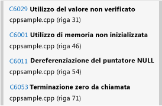
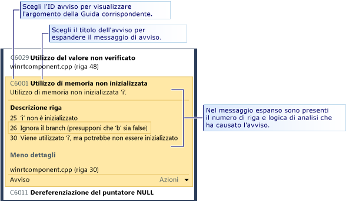
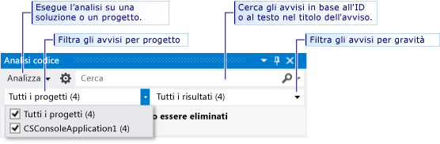

# Analizzare la qualità del codice C++ nelle app dello Store con l'analisi statica del codice di Visual Studio
  
  
 Lo strumento di analisi del codice disponibile nelle edizioni di Visual Studio Express esamina il codice alla ricerca di un set di errori comuni e di violazioni delle procedure di programmazione ottimali. Gli avvisi di analisi del codice sono diversi rispetto agli errori e agli avvisi del compilatore in quanto durante l'analisi del codice vengono cercati modelli di codice specifici che risultano validi ma che potrebbero causare problemi a te o ad altre persone che usano il codice. L'analisi del codice può inoltre trovare difetti all'interno del codice che di solito sono difficili da individuare tramite l'esecuzione di test. L'esecuzione dello strumento di analisi del codice a intervalli regolari durante il processo di sviluppo può migliorare la qualità dell'app completata.  
  
> [!NOTE]
>  In Visual Studio Ultimate, Visual Studio Premium e Visual Studio Professional puoi usare le funzionalità complete degli strumenti di analisi del codice. Vedere [Analisi della qualità dell'applicazione tramite gli strumenti di analisi del codice](http://msdn.microsoft.com/library/dd264897.aspx) in MSDN Library.  
  
## Contenuto dell'argomento  
 Puoi acquisire informazioni su:  
  
 [Esecuzione dell'analisi del codice](../test/analyze-cpp-code-quality-of-store-apps-using-visual-studio-static-code-analysis.md#BKMK_Run)  
  
 [Analizzare e risolvere gli avvisi di analisi del codice](../test/analyze-cpp-code-quality-of-store-apps-using-visual-studio-static-code-analysis.md#BKMK_Analyze)  
  
 [Eliminazione degli avvisi di analisi del codice](../test/analyze-cpp-code-quality-of-store-apps-using-visual-studio-static-code-analysis.md#BKMK_Suppress)  
  
 [Ricerca e filtro dei risultati dell'analisi del codice](../test/analyze-cpp-code-quality-of-store-apps-using-visual-studio-static-code-analysis.md#BKMK_Search)  
  
 [Avvisi di analisi del codice C++](../test/analyze-cpp-code-quality-of-store-apps-using-visual-studio-static-code-analysis.md#Warnings)  
  
##   Esecuzione dell'analisi del codice  
 Per eseguire l'analisi del codice nella soluzione di Visual Studio:  
  
-   Dal menu **Genera** scegliere **Esegui analisi del codice sulla soluzione**.  
  
 Per eseguire automaticamente l'analisi codice ogni volta che compili un progetto:  
  
1.  In Esplora soluzioni scegliere il nome del progetto, quindi scegliere **Proprietà**.  
  
2.  Nella pagina delle proprietà del progetto scegliere **Analisi codice**, quindi **Attiva analisi codice per C/C++ in fase di compilazione**.  
  
 La soluzione viene compilata e viene eseguita l'analisi del codice. I risultati vengono visualizzati nella finestra Analisi codice.  
  
   
  
##   Analizzare e risolvere gli avvisi di analisi del codice  
 Per analizzare un avviso specifico, scegliere il titolo dell'avviso nella finestra Analisi codice. L'avviso si espande per visualizzare le informazioni dettagliate sul problema. Quando possibile, l'analisi del codice mostra il numero di riga e la logica dell'analisi che ha portato all'avviso.  
  
   
  
 Quando espandi un avviso, le righe di codice che hanno provocato l'avviso sono evidenziate nell'editor di Visual Studio Code.  
  
   
  
 Dopo aver compreso il problema, è possibile risolverlo nel codice. Eseguire quindi di nuovo l'analisi del codice per verificare che l'avviso non venga più visualizzato nella finestra Analisi codice e che la correzione non generi nuovi avvisi.  
  
> [!TIP]
>  Puoi rieseguire l'analisi del codice dalla finestra Analisi codice. Scegliere il pulsante **Analizza**, quindi scegliere l'ambito dell'analisi. Puoi rieseguire l'analisi dell'intera soluzione o di un progetto selezionato.  
  
##   Eliminazione degli avvisi di analisi del codice  
 In alcuni casi potresti decidere di non correggere un avviso di analisi del codice. Puoi decidere che risolvere il problema richiede un'eccessiva ricodificazione relativamente alla probabilità che il problema si ripresenti in qualsiasi implementazione realistica del codice. Oppure potresti ritenere che l'analisi utilizzata nell'avviso sia inadeguata per il contesto specifico. Puoi eliminare gli avvisi in modo che non vengano più visualizzati nella finestra Analisi codice.  
  
 Per eliminare un avviso:  
  
1.  Se le informazioni dettagliate non sono visualizzate, espandi il titolo dell'avviso.  
  
2.  Scegliere il collegamento **Azioni** nella parte inferiore dell'avviso.  
  
3.  Scegliere **Elimina messaggio** e quindi scegliere **In origine**.  
  
 L'eliminazione di un messaggio inserisce un `#pragma(warning:`*WarningId*`)` che elimina l'avviso per la riga di codice.  
  
##   Ricerca e filtro dei risultati dell'analisi del codice  
 Puoi effettuare una ricerca in lunghi elenchi di messaggi di avviso e filtrare gli avvisi nelle soluzioni composte da più progetti.  
  
   
  
##   Avvisi di analisi del codice C++  
 L'analisi del codice genera gli avvisi seguenti per il codice C++:  
  
|Regola|Descrizione|  
|----------|-----------------|  
|[C6001](../code-quality/c6001.md)|Utilizzo di memoria non inizializzata|  
|[C6011](../code-quality/c6011.md)|Dereferenziazione del puntatore Null|  
|[C6029](../code-quality/c6029.md)|Utilizzo del valore non verificato|  
|[C6053](../code-quality/c6053.md)|Terminazione zero da chiamata|  
|[C6059](../code-quality/c6059.md)|Concatenazione non valida|  
|[C6063](../code-quality/c6063.md)|Argomento stringa mancante per formattare la funzione|  
|[C6064](../code-quality/c6064.md)|Argomento Integer mancante per formattare la funzione|  
|[C6066](../code-quality/c6066.md)|Argomento puntatore mancante per formattare la funzione|  
|[C6067](../code-quality/c6067.md)|Argomento puntatore stringa mancante per formattare la funzione|  
|[C6101](../code-quality/c6101.md)|Restituzione di memoria non inizializzata|  
|[C6200](../code-quality/c6200.md)|L'indice supera il limite massimo del buffer|  
|[C6201](../code-quality/c6201.md)|L'indice supera il limite massimo del buffer di stack|  
|[C6270](../code-quality/c6270.md)|Argomento Float mancante per formattare la funzione|  
|[C6271](../code-quality/c6271.md)|Argomento aggiuntivo per formattare la funzione|  
|[C6272](../code-quality/c6272.md)|Argomento non Float per formattare la funzione|  
|[C6273](../code-quality/c6273.md)|Argomento non Integer per formattare la funzione|  
|[C6274](../code-quality/c6274.md)|Argomento non Character per formattare la funzione|  
|[C6276](../code-quality/c6276.md)|Cast stringa non valido|  
|[C6277](../code-quality/c6277.md)|Chiamata CreateProcess non valida|  
|[C6284](../code-quality/c6284.md)|Argomento di oggetto non valido per formattare la funzione|  
|[C6290](../code-quality/c6290.md)|Precedenza Logical-Not Bitwise-And|  
|[C6291](../code-quality/c6291.md)|Precedenza Logical-Not Bitwise-Or|  
|[C6302](../code-quality/c6302.md)|Argomento stringa di caratteri non valido per formattare la funzione|  
|[C6303](../code-quality/c6303.md)|Argomento stringa di caratteri wide non valido per formattare la funzione|  
|[C6305](../code-quality/c6305.md)|Uso dimensione e conteggio non corrispondente|  
|[C6306](../code-quality/c6306.md)|Chiamata di funzione dell'argomento variabile non corretto|  
|[C6328](../code-quality/c6328.md)|Tipo argomento potenzialmente non corrispondente|  
|[C6385](../code-quality/c6385.md)|Overrun di lettura|  
|[C6386](../code-quality/c6386.md)|Overrun di scrittura|  
|[C6387](../code-quality/c6387.md)|Valore parametro non valido|  
|[C6500](../code-quality/c6500.md)|Proprietà attributo non valido|  
|[C6501](../code-quality/c6501.md)|Conflitto valori di proprietà attributo|  
|[C6503](../code-quality/c6503.md)|I riferimenti non possono essere Null|  
|[C6504](../code-quality/c6504.md)|Null su non puntatore|  
|[C6505](../code-quality/c6505.md)|MustCheck su nullo|  
|[C6506](../code-quality/c6506.md)|Dimensioni buffer su non puntatore o matrice|  
|[C6507](http://msdn.microsoft.com/en-us/18f88cd1-d035-4403-a6a4-12dd0affcf21)|Errata corrispondenza null al livello di dereferenziazione zero|  
|[C6508](../code-quality/c6508.md)|Accesso in scrittura a costante|  
|[C6509](../code-quality/c6509.md)|Restituzione utilizzati in precondizione|  
|[C6510](../code-quality/c6510.md)|Null terminato su non puntatore|  
|[C6511](../code-quality/c6511.md)|MustCheck deve essere Yes o No|  
|[C6513](../code-quality/c6513.md)|Dimensioni elemento senza dimensione buffer|  
|[C6514](../code-quality/c6514.md)|Le dimensioni del buffer superano le dimensioni della matrice|  
|[C6515](../code-quality/c6515.md)|Dimensioni buffer su non puntatore|  
|[C6516](../code-quality/c6516.md)|Nessuna proprietà su attributo|  
|[C6517](../code-quality/c6517.md)|Dimensioni valide su buffer non leggibile|  
|[C6518](../code-quality/c6518.md)|Dimensioni scrivibili su buffer non scrivibile|  
|[C6519](http://msdn.microsoft.com/en-us/2b6326b0-0539-4d26-8fb1-720114933232)|Annotazione non valida: il valore della proprietà 'NeedsRelease' deve essere Yes o No|  
|[C6521](http://msdn.microsoft.com/en-us/e98d0ae3-6f13-47b2-9a15-15d4055af9ef)|Deferenziazione stringa dimensioni non valida|  
|[C6522](../code-quality/c6522.md)|Tipo stringa dimensioni non valida|  
|[C6523](http://msdn.microsoft.com/en-us/11397a31-b224-46b0-afb7-d49ca576a3bb)|Parametro stringa dimensioni non valido|  
|[C6525](../code-quality/c6525.md)|Percorso irraggiungibile stringa dimensioni non valida|  
|[C6526](http://msdn.microsoft.com/en-us/59c590c7-0098-4166-a1ac-87f324596002)|Tipo buffer stringa dimensioni non valido|  
|[C6527](../code-quality/c6527.md)|Annotazione non valida: la proprietà 'NeedsRelease' non può essere utilizzata con valori di tipo void|  
|[C6530](../code-quality/c6530.md)|Stile stringa formato non riconosciuto|  
|[C6540](../code-quality/c6540.md)|L'utilizzo delle annotazioni di attributo in questa funzione invalida tutte le relative annotazioni __declspec|  
|[C6551](../code-quality/c6551.md)|Specifica di dimensione non valida: espressione non analizzabile|  
|[C6552](../code-quality/c6552.md)|Deref= o Notref= non valido: espressione non analizzabile|  
|[C6701](../code-quality/c6701.md)|Il valore non è un valore Yes/No/Maybe valido|  
|[C6702](../code-quality/c6702.md)|Il valore non è un valore stringa|  
|[C6703](../code-quality/c6703.md)|Il valore non è un numero|  
|[C6704](../code-quality/c6704.md)|Errore imprevisto dell'espressione dell'annotazione|  
|[C6705](../code-quality/c6705.md)|Numero previsto di argomenti per l'annotazione non corrispondente al numero effettivo di argomenti per l'annotazione|  
|[C6706](../code-quality/c6706.md)|Errore di annotazione imprevisto per l'annotazione|  
|[C28021](../code-quality/c28021.md)|Il parametro annotato deve essere un puntatore|  
|[C28182](../code-quality/c28182.md)|Deferenziazione del puntatore NULL. Il puntatore contiene lo stesso valore NULL contenuto in un altro puntatore.|  
|[C28202](../code-quality/c28202.md)|Riferimento non valido a membro non statico|  
|[C28203](../code-quality/c28203.md)|Riferimento ambiguo al membro di classe.|  
|[C28205](../code-quality/c28205.md)|_Success\_ o _On_failure\_ usato in un contesto non valido|  
|[C28206](../code-quality/c28206.md)|L'operando sinistro punta a uno struct. Utilizzare '->'|  
|[C28207](../code-quality/c28207.md)|L'operando sinistro è uno struct. Utilizzare '.'|  
|[C28210](../code-quality/c28210.md)|Impossibile definire le annotazioni per il contesto __On_failure in un precontesto esplicito|  
|[C28211](../code-quality/c28211.md)|Previsto nome contesto statico per SAL_context|  
|[C28212](../code-quality/c28212.md)|Prevista espressione del puntatore per l'annotazione|  
|[C28213](../code-quality/c28213.md)|L'annotazione _Use_decl_annotations\_ deve essere usata per fare riferimento, senza alcuna modifica, a una dichiarazione precedente.|  
|[C28214](../code-quality/c28214.md)|I nomi di parametro di attributo devono essere p1...p9|  
|[C28215](../code-quality/c28215.md)|Impossibile applicare typefix a un parametro che già dispone di un typefix|  
|[C28216](../code-quality/c28216.md)|L'annotazione checkReturn si applica soltanto a postcondizioni per il parametro di funzione specifico.|  
|[C28217](../code-quality/c28217.md)|Per la funzione, il numero di parametri per l'annotazione non corrisponde a quello trovato nel file|  
|[C28218](../code-quality/c28218.md)|Per il parametro della funzione, nell'annotazione, il numero di parametri dell'annotazione non corrisponde a quello trovato nel file|  
|[C28219](../code-quality/c28219.md)|Membro di enumerazione previsto per l'annotazione del parametro nell'annotazione|  
|[C28220](../code-quality/c28220.md)|Espressione integer prevista per l'annotazione del parametro nell'annotazione|  
|[C28221](../code-quality/c28221.md)|Prevista espressione di tipo String per il parametro nell'annotazione|  
|[C28222](../code-quality/c28222.md)|Previsto __yes, \__no o \__maybe per l'annotazione|  
|[C28223](../code-quality/c28223.md)|Token o identificatore previsto mancante per l'annotazione, parametro|  
|[C28224](../code-quality/c28224.md)|L'annotazione richiede parametri|  
|[C28225](../code-quality/c28225.md)|Numero non corretto di parametri necessari nell'annotazione|  
|[C28226](../code-quality/c28226.md)|L'annotazione non può essere anche PrimOp nella dichiarazione corrente|  
|[C28227](../code-quality/c28227.md)|L'annotazione non può essere anche PrimOp nella dichiarazione precedente|  
|[C28228](../code-quality/c28228.md)|Parametro di annotazione: Impossibile utilizzare il tipo nelle annotazioni|  
|[C28229](../code-quality/c28229.md)|L'annotazione non supporta parametri|  
|[C28230](../code-quality/c28230.md)|Il tipo di parametro non ha membro.|  
|[C28231](../code-quality/c28231.md)|L'annotazione è valida solo in una matrice|  
|[C28232](../code-quality/c28232.md)|Pre, post o deref non applicato ad alcuna annotazione|  
|[C28233](../code-quality/c28233.md)|Pre, post o deref applicato a un blocco|  
|[C28234](../code-quality/c28234.md)|L'espressione __At non si applica alla funzione corrente|  
|[C28235](../code-quality/c28235.md)|La funzione non può fungere autonomamente da annotazione|  
|[C28236](../code-quality/c28236.md)|Impossibile utilizzare l'annotazione in un'espressione|  
|[C28237](../code-quality/c28237.md)|L'annotazione nel parametro non è più supportata|  
|[C28238](../code-quality/c28238.md)|L'annotazione nel parametro presenta più di un valore, stringValue e longValue. Utilizzare paramn=xxx|  
|[C28239](../code-quality/c28239.md)|L'annotazione nel parametro presenta sia stringValue, o longValue, che paramn=xxx. Utilizzare solo paramn=xxx|  
|[C28240](../code-quality/c28240.md)|L'annotazione nel parametro presenta param2 ma nessun param1|  
|[C28241](../code-quality/c28241.md)|Annotazione per la funzione nel parametro non riconosciuta|  
|[C28243](../code-quality/c28243.md)|L'annotazione per la funzione nel parametro richiede più dereferenziazioni di quante ne siano consentite dal tipo annotato effettivo|  
|[C28245](../code-quality/c28245.md)|L'annotazione per la funzione annota 'this' in una funzione non membro|  
|[C28246](../code-quality/c28246.md)|Nell'annotazione per la funzione, il parametro non corrisponde al tipo del parametro|  
|[C28250](../code-quality/c28250.md)|Annotazione incoerente per la funzione: errore dell'istanza precedente.|  
|[C28251](../code-quality/c28251.md)|Annotazione incoerente per la funzione: errore dell'istanza.|  
|[C28252](../code-quality/c28252.md)|Annotazione incoerente per la funzione: il parametro presenta altre annotazioni su questa istanza.|  
|[C28253](../code-quality/c28253.md)|Annotazione incoerente per la funzione: il parametro presenta altre annotazioni su questa istanza.|  
|[C28254](../code-quality/c28254.md)|dynamic_cast<>() non è supportato nelle annotazioni|  
|[C28262](../code-quality/c28262.md)|Errore di sintassi dell'annotazione rilevato nella funzione per l'annotazione|  
|[C28263](../code-quality/c28263.md)|Errore di sintassi nell'annotazione condizionale rilevato nell'oggetto annotazione intrinseco|  
|[C28264](http://msdn.microsoft.com/en-us/bf6ea983-a06e-4752-a042-747a7dbf338c)|I valori degli elenchi di risultati devono essere costanti.|  
|[C28267](../code-quality/c28267.md)|Errore di sintassi dell'annotazione rilevato nella funzione per l'annotazione.|  
|[C28272](../code-quality/c28272.md)|L'annotazione per la funzione, parametro, durante l'analisi non è coerente con la dichiarazione della funzione|  
|[C28273](../code-quality/c28273.md)|Per la funzione, le informazioni non sono coerenti con la dichiarazione della funzione|  
|[C28275](../code-quality/c28275.md)|Il parametro to _Macro_value\_ è null|  
|[C28279](../code-quality/c28279.md)|Per il simbolo è stato trovato un 'begin' senza il corrispondente 'end'|  
|[C28280](../code-quality/c28280.md)|Per il simbolo, è stato trovato un 'end' senza un 'begin' corrispondente|  
|[C28282](../code-quality/c28282.md)|Le stringhe di formato devono essere nelle precondizioni|  
|[C28285](../code-quality/c28285.md)|Per la funzione, errore di sintassi nel parametro|  
|[C28286](../code-quality/c28286.md)|Per la funzione, errore di sintassi vicino alla fine|  
|[C28287](../code-quality/c28287.md)|Per la funzione, errore di sintassi nell'annotazione _At\_() (nome parametro non riconosciuto)|  
|[C28288](../code-quality/c28288.md)|Per la funzione, errore di sintassi nell'annotazione _At\_() (nome parametro non valido)|  
|[C28289](../code-quality/c28289.md)|Per la funzione: ReadableTo o WritableTo non disponeva di limit-spec come parametro|  
|[C28290](../code-quality/c28290.md)|L'annotazione per la funzione contiene un numero di riferimenti esterni maggiore del numero di parametri effettivi|  
|[C28291](../code-quality/c28291.md)|Il post null/notnull al livello deref 0 è privo di significato per la funzione.|  
|[C28300](../code-quality/c28300.md)|Operandi dell'espressione di tipi incompatibili per l'operatore|  
|[C28301](../code-quality/c28301.md)|Nessuna annotazione per la prima dichiarazione di funzione.|  
|[C28302](../code-quality/c28302.md)|Operatore _Deref\_ aggiuntivo rilevato nell'annotazione.|  
|[C28303](../code-quality/c28303.md)|Operatore _Deref\_ ambiguo trovato nell'annotazione.|  
|[C28304](../code-quality/c28304.md)|Operatore _Notref\_ non correttamente posizionato applicato al token.|  
|[C28305](../code-quality/c28305.md)|È stato individuato un errore durante l'analisi di un token.|  
|[C28350](../code-quality/c28350.md)|L'annotazione descrive una situazione non applicabile in modo condizionale.|  
|[C28351](../code-quality/c28351.md)|L'annotazione descrive la posizione nella condizione in cui non è possibile utilizzare un valore dinamico (variabile).|

