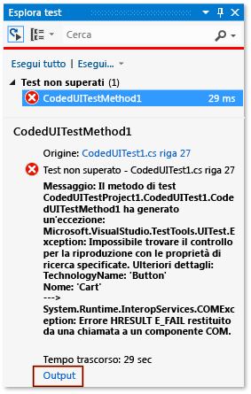
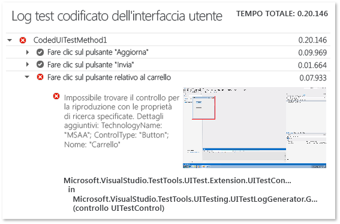

# <a name="analyzing-coded-ui-tests-using-coded-ui-test-logs"></a>Analisi dei test codificati dell'interfaccia utente utilizzando i log dei test codificati dell'interfaccia utente
I log dei test codificati dell'interfaccia utente filtrano e registrano informazioni importanti sulle esecuzioni dei test codificati dell'interfaccia utente.  
  
 **Requirements**  
  
-   Visual Studio Enterprise  
  
## <a name="why-should-i-do-this"></a>Perché si deve eseguire questa operazione?  
 I log sono presentati in un formato che consente il debug rapido degli errori.  
  
## <a name="how-do-i-do-this"></a>Quali operazioni si devono eseguire?  
  
### <a name="step-1-enable-logging"></a>Passaggio 1: Abilitare la registrazione  
 A seconda dello scenario in uso, abilitare la registrazione usando uno dei metodi seguenti.  
  
-   Selezionare .NET Framework versione 4 senza file App.config nel progetto di test  
  
    -   Aprire il file **QTAgent32_40.exe.config**.  
  
         Per impostazione predefinita, il file si trova in **\<drive>:\Programmi (x86)\Microsoft Visual Studio 12.0\Common7\IDE**.  
  
         Modificare il valore per EqtTraceLevel e impostarlo sul livello di log desiderato.  
  
         Salvare il file.  
  
-   Selezionare .NET Framework versione 4.5 senza file App.config nel progetto di test  
  
    -   Aprire il file **QTAgent32.exe.config**.  
  
         Per impostazione predefinita, il file si trova in **\<drive>:\Programmi (x86)\Microsoft Visual Studio 12.0\Common7\IDE**.  
  
         Modificare il valore di EqtTraceLevel e impostarlo sul livello di log desiderato.  
  
         Salvare il file.  
  
-   File App.config presente nel progetto di test  
  
    -   Aprire il file App.config nel progetto.  
  
         Aggiungere il codice seguente nel nodo di configurazione:  
  
         `<system.diagnostics>     <switches>       <add name="EqtTraceLevel" value="4" />     </switches>  </system.diagnostics>`  
  
-   Abilitare la registrazione dal codice di test stesso  
  
    -   <xref:Microsoft.VisualStudio.TestTools.UITesting.PlaybackSettings.LoggerOverrideState%2A> = HtmlLoggerState.AllActionSnapshot;  
  
### <a name="step-2-run-your-coded-ui-test-and-view-the-log"></a>Passaggio 2: eseguire il test codificato dell'interfaccia utente e visualizzare il log  
 Quando si esegue un test codificato dell'interfaccia utente dopo avere apportato le modifiche appropriate al file **QTAgent32.exe.config**, verrà visualizzato un collegamento di output nei risultati di Esplora test. I file di log vengono generati sia per i test con esito negativo, sia per quelli con esito positivo quando il livello di traccia è impostato su "dettagliato".  
  
1.  Dal menu **TEST** scegliere **Windows**, quindi selezionare **Esplora test**.  
  
2.  Scegliere **Compila soluzione** dal menu **Compila**.  
  
3.  In Esplora test selezionare il test codificato dell'interfaccia utente che si vuole eseguire, aprire il relativo menu di scelta rapida e quindi scegliere **Esegui test selezionati**.  
  
     I test automatizzati verranno eseguiti e segnaleranno se sono stati superati o se hanno avuto esito negativo.  
  
    > [!TIP]
    >  Per visualizzare Esplora test dal menu **Test**, selezionare **Windows**, quindi scegliere **Esplora test**.  
  
4.  Scegliere il collegamento **Output** nei risultati di Esplora test.  
  
       
  
     Verrà visualizzato l'output del test in cui è incluso un collegamento al log azioni.  
  
       
  
5.  Scegliere il collegamento UITestActionLog.html.  
  
     Il log verrà visualizzato nel browser Web.  
  
       
  
## <a name="q--a"></a>Domande e risposte  
  
### <a name="q-what-happened-to-the-enablehtmllogger-key"></a>D: Che cosa è accaduto alla chiave EnableHtmlLogger?  
 Nelle versioni precedenti di Visual Studio sono presenti altre due impostazioni di configurazione per abilitare il logger html nel test codificato dell'interfaccia utente:  
  
```  
  
<add key="EnableHtmlLogger" value="true"/>  
  
<add key="EnableSnapshotInfo" value="true"/>  
  
```  
  
 Entrambe queste impostazioni sono deprecate a partire da Visual Studio 2012. EqtTraceLevel è l'unica impostazione che occorre modificare per abilitare il logger html.  
  
## <a name="see-also"></a>Vedere anche  
 [Usare l'automazione dell'interfaccia utente per testare il codice](../test/use-ui-automation-to-test-your-code.md)   
 [Procedura: Eseguire test da Microsoft Visual Studio](http://msdn.microsoft.com/Library/1a1207a9-2a33-4a1e-a1e3-ddf0181b1046)

