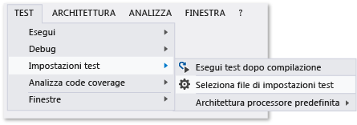

# <a name="configure-unit-tests-by-using-a-runsettings-file"></a>Configurazione di unit test usando un file con estensione runsettings
Gli unit test in Visual Studio possono essere configurati usando un file \*.runsettings. Il nome file non è rilevante, purché si usi l'estensione "runsettings". Ad esempio, è possibile modificare la versione di .NET Framework in cui vengono eseguiti i test, la directory in cui vengono recapitati i risultati e i dati raccolti durante l'esecuzione dei test.  
  
 Se non si vogliono eseguire configurazioni particolari, non sarà necessario alcun file \*.runsettings. L'opzione più frequente consiste nel personalizzare il [code coverage](../test/customizing-code-coverage-analysis.md).  
  
> [!NOTE]
>  **File con estensione runsettings e testsettings**  
>   
>  Sono disponibili due tipi di file per la configurazione dei test. I file \*.runsettings sono usati per gli unit test. I file con estensione \*testsettings sono usati per [test in ambiente lab](/devops-test-docs/test/specifying-test-settings-for-visual-studio-tests), test relativi a caricamento e prestazioni Web e per la personalizzazione di alcuni tipi di adattatori di dati di diagnostica, ad esempio IntelliTrace e gli adattatori di log eventi.  
>   
>  Nelle edizioni precedenti di Visual Studio, fino alla 2010, la personalizzazione degli unit test viene eseguita con file \*.testsettings. È ancora possibile usare questa procedura, ma l'esecuzione dei test sarà più lenta rispetto all'uso delle configurazioni equivalenti in un file con estensione \*runsettings.  
  
## <a name="customizing-tests-with-a-runsettings-file"></a>Personalizzazione dei test con un file con estensione runsettings  
  
1.  Aggiungere un file XML alla soluzione di Visual Studio e rinominarlo in test.runsettings. Il nome del file non è rilevante, ma l'estensione deve essere runsettings.  
  
2.  Sostituire il contenuto del file con l' [esempio](#example).  
  
     Modificarlo in base alle proprie esigenze.  
  
3.  Nel menu **Test** scegliere **Impostazioni test**, quindi **Seleziona file di impostazioni test**.  
  
 È possibile creare più file con estensione \*runsettings nella soluzione e abilitarli o disabilitarli in momenti diversi tramite il menu **Impostazioni test**.  
  
   
  
##  <a name="example"></a> Copiare il file di esempio con estensione runsettings  
 Di seguito è riportato un tipico file \*.runsettings. Ogni elemento del file è facoltativo, perché ogni valore ha un'impostazione predefinita.  
  
```xml  
<?xml version="1.0" encoding="utf-8"?>  
<RunSettings>  
  <!-- Configurations that affect the Test Framework -->  
  <RunConfiguration>  
    <MaxCpuCount>1</MaxCpuCount>  
    <!-- Path relative to solution directory -->  
    <ResultsDirectory>.\TestResults</ResultsDirectory>  
  
    <!-- [x86] | x64    
      - You can also change it from menu Test, Test Settings, Default Processor Architecture -->  
    <TargetPlatform>x86</TargetPlatform>  
  
    <!-- Framework35 | [Framework40] | Framework45 -->  
    <TargetFrameworkVersion>Framework40</TargetFrameworkVersion>  
  
    <!-- Path to Test Adapters -->  
    <TestAdaptersPaths>%SystemDrive%\Temp\foo;%SystemDrive%\Temp\bar</TestAdaptersPaths>  
  </RunConfiguration>  
  
  <!-- Configurations for data collectors -->  
  <DataCollectionRunSettings>  
    <DataCollectors>  
      <DataCollector friendlyName="Code Coverage" uri="datacollector://Microsoft/CodeCoverage/2.0" assemblyQualifiedName="Microsoft.VisualStudio.Coverage.DynamicCoverageDataCollector, Microsoft.VisualStudio.TraceCollector, Version=11.0.0.0, Culture=neutral, PublicKeyToken=b03f5f7f11d50a3a">  
        <Configuration>  
          <CodeCoverage>  
            <ModulePaths>  
              <Exclude>  
                <ModulePath>.*CPPUnitTestFramework.*</ModulePath>  
              </Exclude>  
            </ModulePaths>  
  
            <!-- We recommend you do not change the following values: -->  
            <UseVerifiableInstrumentation>True</UseVerifiableInstrumentation>  
            <AllowLowIntegrityProcesses>True</AllowLowIntegrityProcesses>  
            <CollectFromChildProcesses>True</CollectFromChildProcesses>  
            <CollectAspDotNet>False</CollectAspDotNet>  
  
          </CodeCoverage>  
        </Configuration>  
      </DataCollector>  
  
    </DataCollectors>  
  </DataCollectionRunSettings>  
  
  <!-- Parameters used by tests at runtime -->  
  <TestRunParameters>  
    <Parameter name="webAppUrl" value="http://localhost" />  
    <Parameter name="webAppUserName" value="Admin" />  
    <Parameter name="webAppPassword" value="Password" />  
  </TestRunParameters>  
  
  <!-- Adapter Specific sections -->  
  
  <!-- MSTest adapter -->  
  <MSTest>  
    <MapInconclusiveToFailed>True</MapInconclusiveToFailed>  
    <CaptureTraceOutput>false</CaptureTraceOutput>  
    <DeleteDeploymentDirectoryAfterTestRunIsComplete>False</DeleteDeploymentDirectoryAfterTestRunIsComplete>  
    <DeploymentEnabled>False</DeploymentEnabled>  
    <AssemblyResolution>  
      <Directory Path="D:\myfolder\bin\" includeSubDirectories="false"/>  
    </AssemblyResolution>  
  </MSTest>  
  
</RunSettings>  
```  
  
 Il file con estensione runsettings viene usato anche per configurare il [code coverage](../test/customizing-code-coverage-analysis.md).  
  
 Nella parte restante di questo argomento viene descritto il contenuto del file.  
  
## <a name="edit-your-runsettings-file"></a>Modificare il file con estensione runsettings  
 Il file con estensione runsettings include gli elementi seguenti.  
  
### <a name="test-run-configuration"></a>Configurazione dell'esecuzione dei test  
  
|Nodo|Impostazione predefinita|Valori|  
|----------|-------------|------------|  
|`ResultsDirectory`||La directory in cui verranno inseriti i risultati del test.|  
|`TargetFrameworkVersion`|Framework40|Framework35, Framework40, Framework45<br /><br /> Indica quale versione del framework unit test viene usata per trovare ed eseguire i test. Può essere diversa dalla versione della piattaforma .NET specificata nelle proprietà di compilazione del progetto di unit test.|  
|`TargetPlatform`|x86|x86, x64|  
|`TreatTestAdapterErrorsAsWarnings`|false|false, true|  
|`TestAdaptersPaths`||Uno o più percorsi della directory in cui si trovano i TestAdapter.|  
|`MaxCpuCount`|1|Determina il livello di esecuzione parallela dei test durante l'esecuzione di unit test, in base ai core disponibili nel computer.  Il motore di esecuzione dei test viene avviato come processo distinto in ogni core disponibile e assegna a ogni core un contenitore con test da eseguire, ad esempio un assembly, una DLL o un artefatto pertinente.  Il contenitore di test è l'unità di pianificazione.  In ogni contenitore, i test vengono eseguiti in base al framework di test.  Se sono presenti molti contenitori di questo tipo, non appena termina l'esecuzione dei test in un contenitore, i processi vengono assegnati al successivo contenitore disponibile.<br /><br /> MaxCpuCount può essere:<br /><br /> n, dove 1 < = n < = numero di core: verranno avviati fino a n processi<br /><br /> n, dove n = qualsiasi altro valore: il numero massimo di processi avviati corrisponderà ai core disponibili nel computer|  
  
### <a name="diagnostic-data-adapters-data-collectors"></a>Adattatori dati di diagnostica (agenti di raccolta dati)  
 L'elemento `DataCollectors` specifica le impostazioni degli adattatori dati di diagnostica. Gli adattatori dati di diagnostica vengono usati per raccogliere informazioni aggiuntive sull'ambiente e l'applicazione sottoposta a test. Le impostazioni di ogni adattatore sono predefinite. È quindi necessario specificarle solo se non si vogliono usare quelle predefinite.  
  
#### <a name="code-coverage-adapter"></a>Adattatore di code coverage  
 L'agente di raccolta dati di code coverage crea un log in cui le parti del codice dell'applicazione sono state eseguite nel test. Per altre informazioni sulla personalizzazione delle impostazioni per il code coverage, vedere [Customizing Code Coverage Analysis](../test/customizing-code-coverage-analysis.md) (Personalizzazione dell'analisi del code coverage).  
  
#### <a name="other-diagnostic-data-adapters"></a>Altri adattatori dati di diagnostica  
 L'adattatore code coverage è attualmente l'unico adattatore che può essere personalizzato usando il file di impostazioni esecuzione test.  
  
 Per personalizzare qualsiasi altro tipo di adattatore dati di diagnostica, è necessario usare un file di impostazioni di test. Per altre informazioni, vedere [Specifying Test Settings for Visual Studio Tests](/devops-test-docs/test/specifying-test-settings-for-visual-studio-tests) (Specifica delle impostazioni test di Visual Studio).  
  
#### <a name="testrunparameters"></a>TestRunParameters  
 TestRunParameters consente di definire le variabili e i valori disponibili per i test in fase di esecuzione.  
  
### <a name="mstest-run-settings"></a>Impostazioni di esecuzione MSTest  
 Queste impostazioni sono specifiche dell'adattatore di test che esegue i metodi di test con l'attributo `[TestMethod]` .  
  
|Configurazione|Impostazione predefinita|Valori|  
|-------------------|-------------|------------|  
|ForcedLegacyMode|false|In Visual Studio 2012, l'adapter MSTest è stato ottimizzato per essere più veloce e più scalabile. Un comportamento, ad esempio l'ordine in cui vengono eseguiti i test, potrebbe non essere esattamente come quello nelle versioni precedenti di Visual Studio. Impostare questo valore su `true` per usare l'adattatore di test precedente.<br /><br /> Ad esempio, lo si può usare nel caso in cui sia presente un file app.config specificato per uno unit test.<br /><br /> È consigliabile provare a effettuare il refactoring dei test per consentire l'uso dell'adattatore più recente.|  
|IgnoreTestImpact|false|La funzionalità dell'impatto sui test assegna la priorità ai test interessati da modifiche recenti, una volta eseguiti in MSTest o da Microsoft Test Manager. Questa impostazione disattiva la funzionalità. Per altre informazioni, vedere [Procedura: Raccogliere dati per verificare i test da eseguire dopo che sono state apportate modifiche al codice](http://msdn.microsoft.com/Library/2f921ea1-9bb0-4870-a30f-0521fc22cb47).|  
|SettingsFile||È possibile specificare un file di impostazioni di test da usare con l'adattatore MSTest. È inoltre possibile specificare un file di impostazioni test usando il menu **Test**, **Impostazioni test**, **Seleziona file di impostazioni test**.<br /><br /> Se si specifica questo valore, è necessario impostare anche **ForcedlegacyMode** su **true**.<br /><br /> `<RunSettings>   <MSTest>     <SettingsFile>my.testsettings</SettingsFile>      <ForcedLegacyMode>true</ForcedLegacyMode>    </MSTest> </RunSettings>`|  
|KeepExecutorAliveAfterLegacyRun|false|Una volta completata l'esecuzione di un test, MSTest viene arrestato. Qualsiasi processo avviato come parte del test verrà interrotto in questo momento. Se si desidera che l'executor di test rimanga attivo, impostare questa configurazione su true.<br /><br /> Ad esempio, lo si può usare per mantenere in esecuzione il browser tra i test codificati dell'interfaccia utente.|  
|DeploymentEnabled|true|Se viene impostata su false, gli elementi della distribuzione specificati nel metodo di test non verranno copiati nella directory di distribuzione.|  
|CaptureTraceOutput|true|È possibile scrivere nella traccia di debug dal metodo di test usando Trace.WriteLine. Usando questa configurazione, è possibile disattivare queste tracce di debug.|  
|DeleteDeploymentDirectoryAfterTestRunIsComplete|true|È possibile mantenere la directory di distribuzione dopo un'esecuzione di test impostando questo valore su false.|  
|MapInconclusiveToFailed|false|Se lo stato di un test è Senza risultati, in genere ne viene eseguito il mapping allo stato Ignorato in Esplora test. Se si desidera che i test senza risultati vengano mostrati come Test non superato, usare questa configurazione.|  
|InProcMode|false|Se si desidera che i test vengano eseguiti nello stesso processo dell'adattatore MSTest, impostare questo valore su true. Questa impostazione fornisce un lieve miglioramento delle prestazioni. Se un test viene terminato con un'eccezione, gli altri test non proseguono.|  
|AssemblyResolution|false|È possibile specificare i percorsi di assembly aggiuntivi durante la ricerca e l'esecuzione di unit test.  Ad esempio, è possibile usare questi percorsi per gli assembly di dipendenza che non si trovano nella stessa directory dell'assembly di test.  Per specificare un percorso, usare un elemento "Directory Path".  I percorsi possono contenere variabili di ambiente.<br /><br /> `<AssemblyResolution>  <Directory Path>"D:\myfolder\bin\" includeSubDirectories="false"/> </AssemblyResolution>`|  
  
## <a name="see-also"></a>Vedere anche  
 [Customizing Code Coverage Analysis](../test/customizing-code-coverage-analysis.md)  (Personalizzazione dell'analisi del code coverage)  
 [Specifica delle impostazioni test di Visual Studio](/devops-test-docs/test/specifying-test-settings-for-visual-studio-tests)
