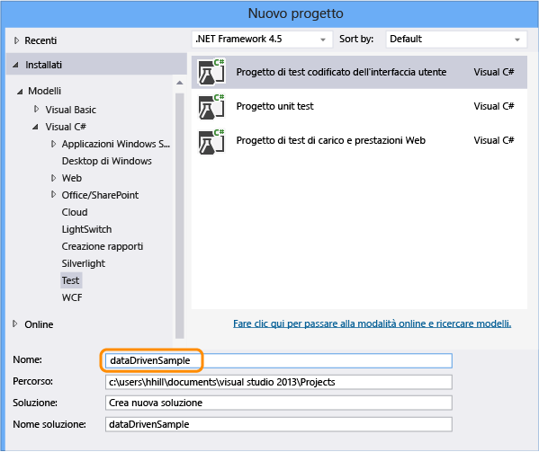
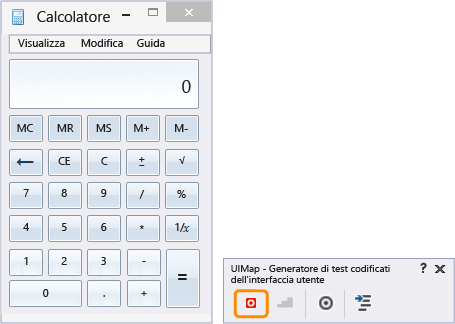
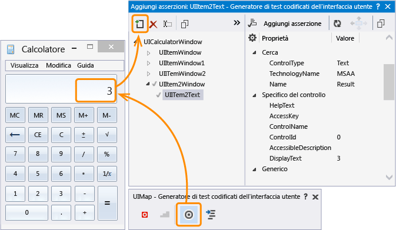
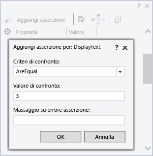
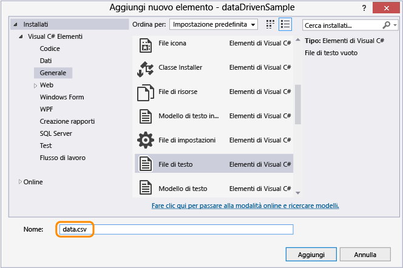
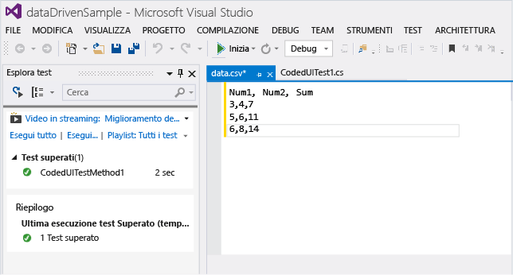
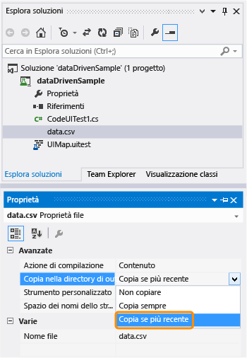
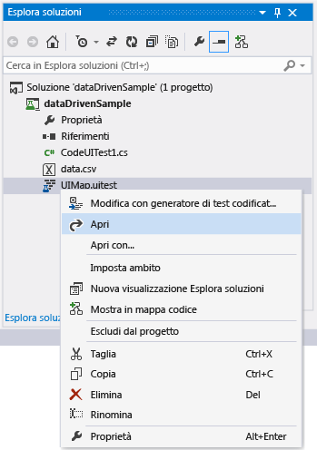
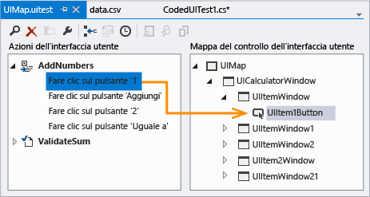
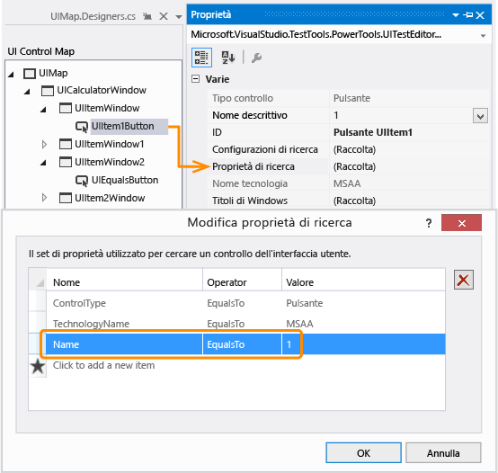

# <a name="creating-a-data-driven-coded-ui-test"></a>Creazione di un test codificati dell'interfaccia utente basato sui dati
Per testare condizioni diverse, è possibile eseguire il test più volte con valori di parametro diversi. I test codificati dell'interfaccia utente basati sui dati offrono un modo conveniente per effettuare questa operazione. È possibile definire i valori dei parametri in un'origine dati e ogni riga nell'origine dati è un'iterazione del test codificato dell'interfaccia utente. Il risultato complessivo del test si baserà sul risultato di tutte le iterazioni. Se, ad esempio, un'iterazione test non riesce, il risultato complessivo del test sarà errato.  
  
 **Requirements**  
  
-   Visual Studio Enterprise  
  
## <a name="create-a-data-driven-coded-ui-test"></a>Creare un test codificato dell'interfaccia utente basato sui dati  
 In questo esempio viene creato un test codificato dell'interfaccia utente che viene eseguito sull'applicazione Calcolatrice Windows. Aggiunge due numeri insieme e usa un'asserzione per convalidare la somma. Quindi, l'asserzione e i valori dei parametri per i due numeri sono codificati per diventare basati sui dati ed essere archiviati in un file con valori delimitati da virgole (CSV).  
  
#### <a name="step-1---create-a-coded-ui-test"></a>Passaggio 1: creare un test codificato dell'interfaccia utente  
  
1.  Creare un progetto.  
  
       
  
2.  Scegliere di registrare le azioni.  
  
       
  
3.  Aprire l'app Calcolatrice e avviare la registrazione del test.  
  
       
  
4.  Aggiungere 1 più 2, mettere in pausa la registrazione e generare il metodo di test. I valori di input dell'utente verranno in seguito sostituiti con valori di un file di dati.  
  
       
  
     Chiudere il generatore di test. Il metodo viene aggiunto al test:  
  
    ```c#  
    [TestMethod]  
    public void CodedUITestMethod1()  
    {  
        // To generate code for this test, select "Generate Code for Coded UI Test" from the shortcut menu and select one of the menu items.  
        this.UIMap.AddNumbers();  
  
    }  
    ```  
  
5.  Usare il metodo `AddNumbers()` per verificare che il test venga eseguito. Posizionare il cursore nel metodo di test indicato sopra, aprire il menu di scelta rapida e scegliere **Esegui test**. (scelta rapida da tastiera: Ctrl + R, T).  
  
     Nella finestra Esplora test viene visualizzato il risultato del test che mostra se il test è stato superato o meno. Per aprire la finestra Esplora test, scegliere **Windows** dal menu **TEST** e quindi scegliere **Esplora test**.  
  
6.  Poiché un'origine dati può essere usata anche per i valori di parametro di asserzione, che sono usati dal test per verificare i valori previsti, viene aggiunta un'asserzione per convalidare la somma dei due numeri. Posizionare il cursore nel metodo di test indicato sopra, aprire il menu di scelta rapida, scegliere **Genera codice per test codificato dell'interfaccia utente** e **Usa il generatore di test codificati dell'interfaccia utente**.  
  
     Mappare il controllo di testo nella calcolatrice che visualizza la somma.  
  
       
  
7.  Aggiungere un'asserzione che convalida il valore della somma. Scegliere la proprietà **DisplayText** con il valore **3** e quindi scegliere **Aggiungi asserzione**. Usare il comparatore **AreEqual** e verificare che il valore di confronto sia **3**.  
  
       
  
8.  Dopo aver configurato l'asserzione, generare di nuovo il codice dal generatore. In questo modo viene creato un nuovo metodo per la convalida.  
  
       
  
     Poiché il metodo `ValidateSum` convalida i risultati del metodo `AddNumbers`, spostarlo nella parte inferiore del blocco di codice.  
  
    ```c#  
    public void CodedUITestMethod1()  
    {  
  
        // To generate code for this test, select "Generate Code for Coded UI Test" from the shortcut menu and select one of the menu items.  
        this.UIMap.AddNumbers();  
        this.UIMap.ValidateSum();  
  
    }  
    ```  
  
9. Verificare che il test venga eseguito tramite il metodo `ValidateSum()`. Posizionare il cursore nel metodo di test indicato sopra, aprire il menu di scelta rapida e scegliere **Esegui test**. (scelta rapida da tastiera: Ctrl + R, T).  
  
     A questo punto, tutti i valori dei parametri sono definiti nei relativi metodi come costanti. Ora verrà creato un set di dati in modo che il test sia basato sui dati.  
  
#### <a name="step-2---create-a-data-set"></a>Passaggio 2: creare un set di dati  
  
1.  Aggiungere un file di testo al progetto dataDrivenSample denominato `data.csv`.  
  
       
  
2.  Popolare il file CSV con i dati seguenti:  
  
    |Num1|Num2|Sum|  
    |----------|----------|---------|  
    |3|4|7|  
    |5|6|11|  
    |6|8|14|  
  
     Dopo aver aggiunto i dati, il file viene visualizzato come segue:  
  
       
  
3.  È importante salvare il file CSV usando la codifica corretta. Scegliere **Opzioni di salvataggio avanzate** dal menu **FILE** e quindi scegliere **Unicode (UTF-8 senza firma digitale) – Codepage 65001** come codifica.  
  
4.  Il file CSV deve essere copiato nella directory di output; diversamente, non è possibile eseguire il test. Usare la finestra Proprietà per copiarlo.  
  
       
  
     Dopo aver creato il set di dati, è associare i dati al test.  
  
#### <a name="step-3--add-data-source-binding"></a>Passaggio3: aggiungere l'associazione origine dati  
  
1.  Per associare l'origine dati, aggiungere un attributo `DataSource` all'interno dell'attributo `[TestMethod]` che si trova immediatamente sopra il metodo di test.  
  
    ```  
    [DataSource("Microsoft.VisualStudio.TestTools.DataSource.CSV", "|DataDirectory|\\data.csv", "data#csv", DataAccessMethod.Sequential), DeploymentItem("data.csv"), TestMethod]  
    public void CodedUITestMethod1()  
    {  
  
        // To generate code for this test, select "Generate Code for Coded UI Test" from the shortcut menu and select one of the menu items.  
        this.UIMap.AddNumbers();  
        this.UIMap.ValidateSum();  
  
    }  
  
    ```  
  
     L'origine dati è ora disponibile per essere usata in questo metodo di test.  
  
    > [!TIP]
    >  Per esempi sull'uso di altri tipi di origine dati, ad esempio XML, SQL Express ed Excel, vedere gli [esempi di attributi dell'origine dati](#CreateDataDrivenCUIT_QA_DataSourceAttributes) nella sezione delle domande e risposte.  
  
2.  Eseguire il test.  
  
     Si noti che il test viene eseguito tramite tre iterazioni; questo perché l'origine dati che era associata contiene tre righe di dati. Tuttavia, si noterà anche che il test continua a usare i valori di parametro costanti e aggiunge ogni volta 1 + 2 con una somma pari a 3.  
  
     Il test verrà quindi configurato in modo da usare i valori del file di origine dati.  
  
#### <a name="step-4--use-the-data-in-the-coded-ui-test"></a>Passaggio 4: usare i dati nel test codificato dell'interfaccia utente  
  
1.  Aggiungere `using Microsoft.VisualStudio.TestTools.UITesting.WinControls` alla parte superiore del file CodedUITest.cs:  
  
    ```  
    using System;  
    using System.Collections.Generic;  
    using System.Text.RegularExpressions;  
    using System.Windows.Input;  
    using System.Windows.Forms;  
    using System.Drawing;  
    using Microsoft.VisualStudio.TestTools.UITesting;  
    using Microsoft.VisualStudio.TestTools.UnitTesting;  
    using Microsoft.VisualStudio.TestTools.UITest.Extension;  
    using Keyboard = Microsoft.VisualStudio.TestTools.UITesting.Keyboard;  
    using Microsoft.VisualStudio.TestTools.UITesting.WinControls;  
    ```  
  
2.  Aggiungere `TestContext.DataRow[]` nel metodo `CodedUITestMethod1()` che applicherà i valori dall'origine dati. I valori dell'origine dati eseguono l'override delle costanti assegnate ai controlli UIMap tramite i controlli `SearchProperties`:  
  
    ```  
    public void CodedUITestMethod1()  
    {  
  
        // To generate code for this test, select "Generate Code for Coded UI Test" from the shortcut menu and select one of the menu items.  
        this.UIMap.UICalculatorWindow.UIItemWindow.UIItem1Button.SearchProperties[WinButton.PropertyNames.Name] = TestContext.DataRow["Num1"].ToString();this.UIMap.UICalculatorWindow.UIItemWindow21.UIItem2Button.SearchProperties[WinButton.PropertyNames.Name] = TestContext.DataRow["Num2"].ToString();  
        this.UIMap.AddNumbers();  
        this.UIMap.ValidateSumExpectedValues.UIItem2TextDisplayText = TestContext.DataRow["Sum"].ToString();  
        this.UIMap.ValidateSum();  
  
    }  
    ```  
  
     Per determinare le proprietà di ricerca alle quali codificare i dati, usare l'Editor test codificati dell'interfaccia utente.  
  
    -   Aprire il file UIMap.uitest.  
  
           
  
    -   Scegliere l'azione dell'interfaccia utente e osservare il mapping di controllo dell'interfaccia utente corrispondente. Si noti come il mapping corrisponda al codice, ad esempio `this.UIMap.UICalculatorWindow.UIItemWindow.UIItem1Button`.  
  
           
  
    -   Nella finestra Proprietà aprire **Proprietà di ricerca**. Il valore **Nome** delle proprietà di ricerca è costituito dagli elementi che sono stati modificati nel codice usando l'origine dati. Ad esempio, a `SearchProperties` vengono assegnati i valori della prima colonna di ciascuna riga di dati: `UIItem1Button.SearchProperties[WinButton.PropertyNames.Name] = TestContext.DataRow["Num1"].ToString();`. Per le tre iterazioni, questo test imposterà il valore **Nome** per la proprietà di ricerca su 3, quindi su 5 e infine su 6.  
  
           
  
3.  Salvare la soluzione.  
  
#### <a name="step-5--run-the-data-driven-test"></a>Passaggio 5: esecuzione del test basato sui dati  
  
1.  Eseguire di nuovo il test per verificare che ora sia basato sui dati.  
  
     Dovrebbe venire visualizzato il test eseguito tramite le tre iterazioni che usano i valori nel file con estensione csv. Anche la convalida dovrebbe funzionare e il test dovrebbe essere visualizzato come superato in Esplora test.  
  
 **Linee guida**  
  
 Per altre informazioni, vedere [Testing for Continuous Delivery with Visual Studio 2012 – Chapter 2: Unit Testing: Testing the Inside](http://go.microsoft.com/fwlink/?LinkID=255188) (Test per la distribuzione continua con Visual Studio 2012 - Capitolo 2: Unit test: test interni) e [Testing for Continuous Delivery with Visual Studio 2012 – Chapter 5: Automating System Tests](http://go.microsoft.com/fwlink/?LinkID=255196) (Test per la distribuzione continua con Visual Studio 2012 - Capitolo 5: Automazione dei test di sistema)  
  
## <a name="q--a"></a>Domande e risposte  
  
###  <a name="CreateDataDrivenCUIT_QA_DataSourceAttributes"></a>Quali sono gli attributi di origine dati per altri tipi di origine dati, ad esempio SQL Express o XML?  
 È possibile usare le stringhe di origine dati di esempio nella tabella seguente copiandole nel codice e apportando le personalizzazioni necessarie.  
  
 **Tipi di origini dati e attributi**  
  
-   CSV  
  
     `[DataSource("Microsoft.VisualStudio.TestTools.DataSource.CSV", "|DataDirectory|\\data.csv", "data#csv", DataAccessMethod.Sequential), DeploymentItem("data.csv"), TestMethod]`  
  
-   Excel  
  
     `DataSource("System.Data.Odbc", "Dsn=ExcelFiles;Driver={Microsoft Excel Driver (*.xls)};dbq=|DataDirectory|\\Data.xls;defaultdir=.;driverid=790;maxbuffersize=2048;pagetimeout=5;readonly=true", "Sheet1$", DataAccessMethod.Sequential), DeploymentItem("Sheet1.xls"), TestMethod]`  
  
-   Test case in Team Foundation Server  
  
     `[DataSource("Microsoft.VisualStudio.TestTools.DataSource.TestCase", "http://vlm13261329:8080/tfs/DefaultCollection;Agile", "30", DataAccessMethod.Sequential), TestMethod]`  
  
-   XML  
  
     `[DataSource("Microsoft.VisualStudio.TestTools.DataSource.XML", "|DataDirectory|\\data.xml", "Iterations", DataAccessMethod.Sequential), DeploymentItem("data.xml"), TestMethod]`  
  
-   SQL Express  
  
     `[DataSource("System.Data.SqlClient", "Data Source=.\\sqlexpress;Initial Catalog=tempdb;Integrated Security=True", "Data", DataAccessMethod.Sequential), TestMethod]`  
  
### <a name="q-can-i-use-data-driven-tests-on-my-windows-phone-app"></a>D: È possibile usare i test basati su dati in un'app per Windows Phone?  
 **R:** Sì. I test codificati dell'interfaccia utente basati sui dati per Windows Phone sono definiti tramite l'uso dell'attributo DataRow su un metodo di test. Nell'esempio seguente x e y usano i valori di 1 e 2 per la prima iterazione e di -1 e -2 per la seconda iterazione del test.  
  
```  
[DataRow(1, 2, DisplayName = "Add positive numbers")]  
[DataRow(-1, -2, DisplayName = "Add negative numbers")]  
[TestMethod]  
public void DataDrivingDemo_MyTestMethod(int x, int y)  
  
```  
  
 Per altre informazioni, vedere [Usare test codificati dell'interfaccia utente basati sui dati sulle app per Windows Phone](../test/test-windows-phone-8-1-apps-with-coded-ui-tests.md#TestingPhoneAppsCodedUI_DataDriven).  
  
### <a name="q-why-cant-i-modify-the-code-in-the-uimapdesigner-file"></a>D: Perché non è possibile modificare il codice nel file UIMap.Designer?  
 **R**: Qualsiasi modifica del codice eseguita nel file UIMapDesigner.cs verrà sovrascritta ogni volta che si genera codice usando UIMap - Generatore di test codificati dell'interfaccia utente. In questo esempio, e nella maggior parte dei casi, le modifiche al codice necessarie per consentire a un test di usare un'origine dati possono essere apportate al file del codice sorgente (ovvero CodedUITest1.cs).  
  
 Se è necessario modificare un metodo registrato, copiarlo nel file UIMap.cs e rinominarlo. Il file UIMap.cs può essere usato per eseguire l'override dei metodi e delle proprietà contenuti nel file UIMapDesigner.cs. È necessario rimuovere il riferimento al metodo originale nel file Coded UITest.cs e sostituirlo con il nome del metodo rinominato.  
  
## <a name="see-also"></a>Vedere anche  
 <xref:Microsoft.VisualStudio.TestTools.UITest.Common.UIMap.UIMap>   
 <xref:Microsoft.VisualStudio.TestTools.UnitTesting.Assert>   
 [Usare l'automazione dell'interfaccia utente per testare il codice](../test/use-ui-automation-to-test-your-code.md)   
 [Creazione di test codificati dell'interfaccia utente](../test/use-ui-automation-to-test-your-code.md#VerifyingCodeUsingCUITCreate)   
 [Procedure consigliate per i test codificati dell'interfaccia utente](../test/best-practices-for-coded-ui-tests.md)   
 [Configurazioni e piattaforme supportate per i test codificati dell'interfaccia utente e le registrazioni delle azioni](../test/supported-configurations-and-platforms-for-coded-ui-tests-and-action-recordings.md)

