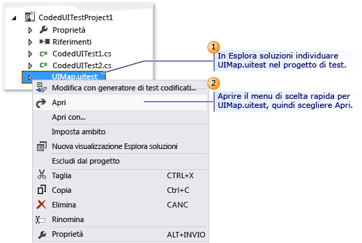
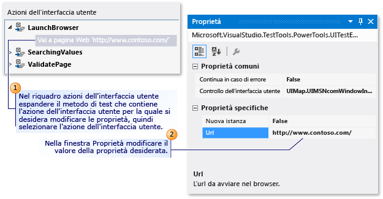
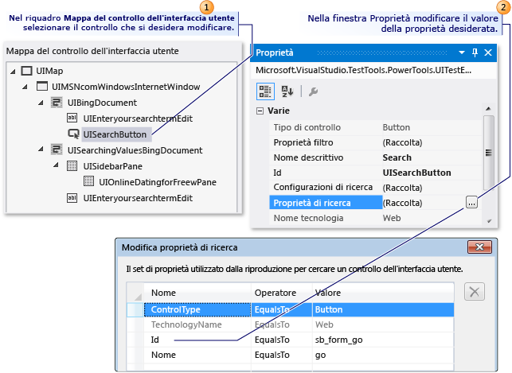
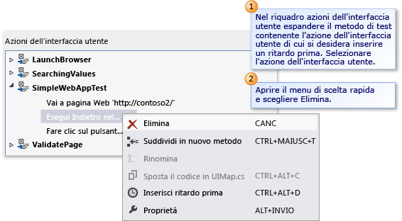
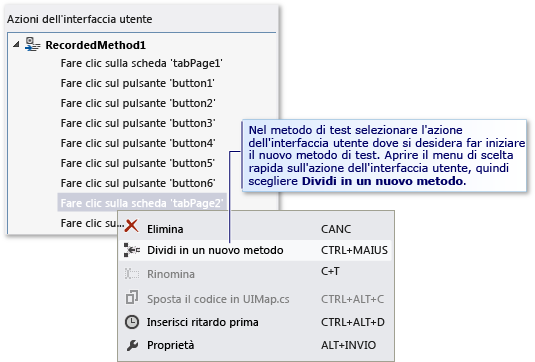
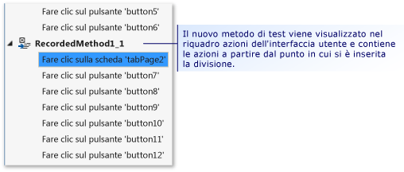
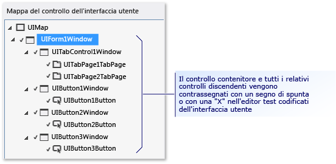
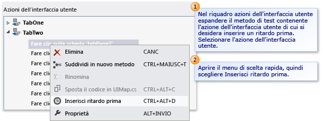
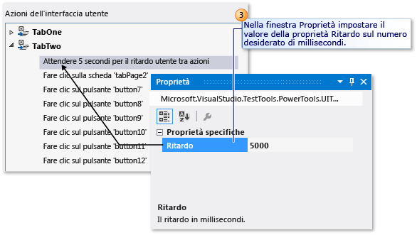

# Modifica di test codificati dell'interfaccia utente con l'editor di test codificato dell'interfaccia utente
L'Editor di test codificati dell'interfaccia utente consente di modificare facilmente i test. Con l'Editor di test codificati dell'interfaccia utente è possibile individuare, visualizzare e modificare le proprietà dei metodi di test e delle azioni dell'interfaccia utente. Inoltre, è possibile usare la mappa del controllo dell'interfaccia utente per visualizzare e modificare i corrispondenti controlli.  
  
 **Requisiti**  
  
-   Visual Studio Enterprise  
  
## Perché si deve eseguire questa operazione?  
 Usare l'Editor di test codificati dell'interfaccia utente è più rapido ed efficiente che modificare il codice nei metodi di test codificato dell'interfaccia utente con l'editor del codice. Con l'Editor di test codificati dell'interfaccia utente, è possibile usare la barra degli strumenti e i menu di scelta rapida per individuare rapidamente e modificare i valori delle proprietà associati a controlli e azioni dell'interfaccia utente. Ad esempio, è possibile usare la barra degli strumenti dell'Editor di test codificati dell'interfaccia utente per eseguire i comandi seguenti:  
  
   
  
1.  [Trova](../ide/finding-and-replacing-text.md) consente di individuare controlli e azioni dell'interfaccia utente.  
  
2.  [Elimina](#CodedUITestEditor_DeleteUIActions) rimuove le azioni dell'interfaccia utente indesiderate.  
  
3.  **Rinomina** modifica i nomi di controlli e metodi di test.  
  
4.  **Proprietà** apre la finestra Proprietà per gli elementi selezionati.  
  
5.  [Suddividi in nuovo metodo](#CodedUITestEditor_SplitMethods) consente di modularizzare le azioni dell'interfaccia utente.  
  
6.  [Sposta codice](#CodedUITestEditor_MoveMethods) aggiunge codice personalizzato ai metodi di test.  
  
7.  [Inserisci ritardo prima](#CodedUITestEditor_InsertDelay) aggiunge una pausa prima di un'azione dell'interfaccia utente, specificata in millisecondi.  
  
8.  [Individua controllo dell'interfaccia utente](#CodedUITestEditor_LocateUIControl) identifica la posizione del controllo nell'interfaccia utente dell'applicazione sottoposta a test.  
  
9. [Individua tutto](#CodedUITestEditor_LocateDecendants) consente di verificare la proprietà del controllo e le modifiche significative ai controlli dell'applicazione.  
  
## Quali operazioni si devono eseguire?  
 In [!INCLUDE[vs_dev11_long](../data-tools/includes/vs_dev11_long_md.md)], aprendo il file UIMap.uitest affiliato al test codificato dell'interfaccia utente nel progetto di test codificato dell'interfaccia utente, il test codificato dell'interfaccia utente verrà automaticamente visualizzato nell'Editor di test codificati dell'interfaccia utente. Le seguenti procedure descrivono come sia quindi possibile individuare e modificare i metodi di test e le proprietà per i controlli e le azioni dell'interfaccia utente usando la barra degli strumenti e i menu di scelta rapida dell'editor.  
  
## Aprire un test codificato dell'interfaccia utente  
 È possibile visualizzare e modificare il test codificato dell'interfaccia utente basato su Visual C# e Visual Basic usando l'Editor di test codificati dell'interfaccia utente.  
  
   
  
 In Esplora soluzioni aprire il menu di scelta rapida per **UIMap.uitest** e scegliere **Apri**. Il test codificato dell'interfaccia utente viene visualizzato nell'Editor test codificati dell'interfaccia utente. Ora è possibile visualizzare e modificare i metodi registrati, i le azioni e i corrispondenti controlli nel test codificato dell'interfaccia utente.  
  
> [!TIP]
>  Quando si seleziona un'azione dell'interfaccia utente che si trova in un metodo nel riquadro **Azioni dell'interfaccia utente**, viene evidenziato il controllo corrispondente. È possibile modificare anche le proprietà delle azioni dell'interfaccia utente o dei controlli.  
  
 *Non viene visualizzato* l'Editor di test codificati dell'interfaccia utente  
 È possibile che si usi una versione di Visual Studio Enterprise precedente alla 2012. L'Editor di test codificati dell'interfaccia utente era disponibile anche in Visual Studio 2010 Feature Pack 2 con una sottoscrizione MSDN. [!INCLUDE[crdefault](../test/includes/crdefault_md.md)][Microsoft Visual Studio 2010 Feature Pack 2](http://go.microsoft.com/fwlink/?LinkID=204119).  
  
##   Modificare le proprietà delle azioni dell'interfaccia utente e le proprietà dei controlli corrispondenti  
 Usando l'Editor di test codificati dell'interfaccia utente, è possibile individuare rapidamente e visualizzare tutte le azioni dell'interfaccia utente nei metodi di test. Quando si seleziona l'azione dell'interfaccia utente nell'editor, il controllo corrispondente viene automaticamente evidenziato. Analogamente, se si seleziona un controllo, vengono evidenziate le azioni dell'interfaccia utente associate. Quando si seleziona un'azione dell'interfaccia utente o un controllo, è facile usare la finestra Proprietà per modificare le proprietà corrispondenti.  
  
   
Modificare le proprietà di un'azione dell'interfaccia utente  
  
 Per modificare le proprietà di un'azione dell'interfaccia utente, nel riquadro **Azioni dell'interfaccia utente** espandere il metodo di test contenente un'azione dell'interfaccia utente di cui si vogliono modificare le proprietà, selezionare l'azione dell'interfaccia utente e quindi modificare le proprietà usando la finestra Proprietà.  
  
 Ad esempio, se un server non è disponibile e al Web browser è associata l'azione dell'interfaccia utente **Vai a pagina Web 'http://Contoso1/default.aspx'**, è possibile sostituire l'URL con `‘http://Contoso2/default.aspx’`.  
  
   
Modificare le proprietà del controllo  
  
 La modifica delle proprietà di un controllo è come quella delle azioni dell'interfaccia utente. Nel riquadro **Mappa del controllo dell'interfaccia utente** selezionare il controllo su cui intervenire e modificarne le proprietà usando la finestra Proprietà.  
  
 Ad esempio, uno sviluppatore potrebbe avere cambiato la proprietà **(ID)** in un pulsante nel codice sorgente dell'applicazione di cui è in corso il test da "idSubmit" a "idLogin". Con la proprietà **(ID)** modificata nell'applicazione, il test codificato dell'interfaccia utente non potrà individuare il pulsante e avrà esito negativo. In questo caso, il tester può aprire la raccolta **Proprietà di ricerca** e modificare la proprietà **Id** in modo che corrisponda al nuovo valore usato dallo sviluppatore nell'applicazione. Il tester potrebbe anche cambiare la proprietà **Nome descrittivo** da "Invia" ad "Accesso". Con questa modifica, l'azione dell'interfaccia utente associata nell'Editor di test codificati dell'interfaccia utente viene aggiornata da "Scegli pulsante 'Invia'" a "Scegli pulsante 'Accesso'".  
  
 Dopo aver completato le modifiche, salvarle nel file UIMap.Designer scegliendo **Salva** sulla barra degli strumenti di [!INCLUDE[vsprvs](../code-quality/includes/vsprvs_md.md)].  
  
 *Altre informazioni*  
 **Suggerimenti**  
  
-    Se la finestra Proprietà non viene visualizzata, tenere premuto **ALT** mentre si preme **INVIO** oppure, in alternativa, premere **F4**.  
  
-    Per annullare le modifiche apportate alle proprietà, scegliere **Annulla** dal menu **Modifica** oppure premere CTRL+Z.  
  
-    È possibile usare il pulsante **Trova** sulla barra degli strumenti dell'editor di test codificati dell'interfaccia utente per aprire lo strumento Trova e sostituisci in Visual Studio. Quindi è possibile usare il controllo Trova per individuare l'azione dell'interfaccia utente nell'Editor di test codificati dell'interfaccia utente. Ad esempio, è possibile provare a cercare "Fare clic sul pulsante 'Accesso'". Questo è utile nei test di grandi dimensioni. Si noti che non è possibile usare la funzionalità di sostituzione dello strumento Trova e sostituisci nell'Editor di test codificati dell'interfaccia utente. Per altre informazioni, vedere la sezione relativa al controllo di ricerca in [Ricerca e sostituzione di testo](../ide/finding-and-replacing-text.md).  
  
-    A volte può essere difficile identificare la posizione dei controlli nell'interfaccia utente dell'applicazione sottoposta a test. Una delle funzionalità dell'Editor di test codificati dell'interfaccia utente consente di selezionare un controllo elencato nella mappa del controllo dell'interfaccia utente e visualizzarne la posizione nell'applicazione sottoposta a test. [!INCLUDE[crdefault](../test/includes/crdefault_md.md)][Individuazione di un controllo dell'interfaccia utente nell'applicazione sottoposta a test](#CodedUITestEditor_LocateUIControl) più avanti in questo argomento.  
  
-    Potrebbe essere necessario espandere il controllo contenitore in cui è presente il controllo da modificare. [!INCLUDE[crdefault](../test/includes/crdefault_md.md)][Individuazione di un controllo e dei discendenti](#CodedUITestEditor_LocateDecendants) più avanti in questo argomento.  
  
##   Eliminare le azioni indesiderate dell'interfaccia utente  
 È possibile rimuovere facilmente le azioni indesiderate dell'interfaccia utente nel test codificato dell'interfaccia utente.  
  
   
  
 Nel riquadro **Azioni dell'interfaccia utente** espandere il metodo di test contenente l'azione dell'interfaccia utente che si vuole eliminare. Aprire il menu di scelta rapida per l'azione dell'interfaccia utente e scegliere **Elimina**.  
  
##   Suddividere un metodo di test in due metodi distinti  
 È possibile suddividere un metodo di test per perfezionare o per modularizzare le azioni dell'interfaccia utente. Ad esempio, il test potrebbe disporre di un solo metodo di test con azioni dell'interfaccia utente in due controlli contenitore. La modularizzazione delle azioni dell'interfaccia utente può essere ottimizzata con due metodi corrispondenti a un solo contenitore.  
  
   
  
   
  
 Nel riquadro **Azioni dell'interfaccia utente** espandere il metodo di test che si vuole suddividere in due metodi distinti e selezionare l'azione dell'interfaccia utente con cui far iniziare il nuovo metodo di test. Aprire il menu di scelta rapida per l'azione dell'interfaccia utente e quindi scegliere **Suddividi in nuovo metodo**scegliere il pulsante **Suddividi in nuovo metodo** sulla barra degli strumenti dell'Editor di test codificati dell'interfaccia utente. Il nuovo metodo di test viene visualizzato nel riquadro Azioni dell'interfaccia utente che contiene le azioni dell'interfaccia utente a iniziare dall'azione in cui è stata specificata la suddivisione.  
  
 Dopo aver completato la suddivisione del metodo, salvare le modifiche apportate al file UIMap.Designer scegliendo **Salva** sulla barra degli strumenti di [!INCLUDE[vsprvs](../code-quality/includes/vsprvs_md.md)].  
  
 *Altre informazioni*  
 **Problemi importanti**  
  
-    **Avviso**: quando si suddivide un metodo, è necessario modificare qualsiasi codice che chiama il metodo esistente in modo che chiami anche il nuovo metodo che si sta per creare se si vuole che queste azioni dell'interfaccia utente siano incluse. Quando si suddivide un metodo, verrà visualizzata una finestra di dialogo di Microsoft Visual Studio che avvisa che è necessario modificare qualsiasi codice chiami il metodo esistente in modo che chiami anche il nuovo metodo che si sta per creare. Scegliere **Sì**.  
  
 **Suggerimenti**  
  
-    Per annullare la suddivisione, scegliere **Annulla** dal menu **Modifica** oppure premere CTRL+Z.  
  
-    È possibile rinominare il nuovo metodo. Selezionarlo nel riquadro Azioni dell'interfaccia utente e scegliere il pulsante **Rinomina** sulla barra degli strumenti dell'Editor di test codificati dell'interfaccia utente.  
  
     -oppure-  
  
     Aprire il menu di scelta rapida per il nuovo metodo di test e scegliere **Rinomina**.  
  
     Verrà visualizzata una finestra di dialogo di Microsoft Visual Studio che avvisa che è necessario modificare qualsiasi codice faccia riferimento al metodo. Scegliere **Sì**.  
  
##   Spostare un metodo di test nel file UIMap per facilitare la personalizzazione  
 Se si determina che uno dei metodi di test nel test codificato dell'interfaccia utente richieda un codice personalizzato, è necessario spostarlo nel file UIMap.cs o UIMap.vb. In caso contrario, il codice verrà sovrascritto ogni volta che il test codificato dell'interfaccia utente verrà ricompilato. Se non si sposta il metodo, il codice personalizzato verrà sovrascritto ogni volta che il test verrà ricompilato.  
  
 Nel riquadro **Azioni dell'interfaccia utente** selezionare il metodo di test che si vuole spostare nel file di UIMap.vb o UIMap.cs per facilitare la funzionalità di codice personalizzato che non verrà sovrascritta quando il codice di test verrà ricompilato. Scegliere poi il pulsante **Sposta codice** sulla barra degli strumenti dell'Editor di test codificati dell'interfaccia utente o aprire il menu di scelta rapida per il metodo di test e scegliere **Sposta codice**. Il metodo di test verrà rimosso dal file UIMap.uitest e non verrà più visualizzato nel riquadro delle azioni dell'interfaccia utente. Per modificare il file di test spostato, aprire il file UIMap.cs o UIMap.vb da Esplora soluzioni.  
  
 Dopo aver completato lo spostamento del metodo, salvare le modifiche apportate al file UIMap.Designer scegliendo **Salva** sulla barra degli strumenti di [!INCLUDE[vsprvs](../code-quality/includes/vsprvs_md.md)].  
  
 *Altre informazioni*  
 **Problemi importanti**  
  
-    **Avviso**: dopo aver spostato il metodo, non è più possibile modificarlo tramite l'Editor di test codificati dell'interfaccia utente. È necessario aggiungere il codice personalizzato e gestirlo usando l'editor del codice. Quando si sposta un metodo, verrà visualizzata una finestra di dialogo di Microsoft Visual Studio che avvisa che il metodo verrà spostato dal file UIMap.uitest al file UIMap.cs o UIMap.vb e che non sarà più possibile modificare il metodo usando l'Editor di test codificati dell'interfaccia utente. Scegliere **Sì**.  
  
 **Suggerimenti**  
  
-    Per annullare lo spostamento, scegliere **Annulla** dal menu **Modifica** oppure premere CTRL+Z. Tuttavia, è poi necessario rimuovere manualmente il codice dal file UIMap.cs o UIMap.vb.  
  
##   Individuazione di un controllo dell'interfaccia utente nell'applicazione sottoposta a test  
 A volte può essere difficile identificare la posizione dei controlli nell'interfaccia utente dell'applicazione sottoposta a test. Una delle funzionalità dell'Editor di test codificati dell'interfaccia utente consente di selezionare un controllo elencato nella mappa del controllo dell'interfaccia utente e visualizzarne la posizione nell'applicazione sottoposta a test. La funzionalità **Individua controllo dell'interfaccia utente** nell'applicazione sottoposta a test consente anche di verificare le modifiche delle proprietà di ricerca apportate a un controllo.  
  
   
  
   
  
 Nel riquadro **Mappa del controllo dell'interfaccia utente** selezionare il controllo che si vuole individuare nell'applicazione associata al test. Aprire quindi il menu di scelta rapida per il controllo e quindi scegliere **Individua controllo dell'interfaccia utente**. Nell'applicazione di cui è in corso il test, il controllo viene identificato da un bordo blu.  
  
 *Altre informazioni*  
 **Problemi importanti**  
  
-    **Avviso**: prima di individuare un controllo dell'interfaccia utente, verificare che l'applicazione associata al test sia in esecuzione.  
  
 **Suggerimenti**  
  
-    In alternativa, è possibile usare l'opzione **Individua tutto** per verificare che tutti i controlli all'interno di un contenitore possano essere individuati correttamente. Questa opzione viene descritta nella sezione successiva.  
  
##   Individuazione di un controllo e dei discendenti  
 È possibile verificare che tutti i controlli in un contenitore possano essere individuati correttamente nell'interfaccia utente dell'applicazione sottoposta a test. Può essere utile per la verifica delle eventuali modifiche delle proprietà di ricerca apportate nel contenitore. Inoltre, se sono state apportate modifiche considerevoli nell'interfaccia utente dell'applicazione sottoposta a test, è possibile verificare che le proprietà di ricerca del controllo esistenti siano ancora corrette.  
  
   
  
   
  
 Nel riquadro **Mappa del controllo dell'interfaccia utente** selezionare il controllo contenitore da individuare e per cui visualizzare tutti i discendenti. Aprire quindi il menu di scelta rapida per il controllo e scegliere **Individua tutto**. Il controllo contenitore e tutti i controlli discendenti vengono contrassegnati nell'Editor di test codificati dell'interfaccia utente con un segno di spunta verde o una "X" rossa. Questi contrassegni consentono di sapere se i controlli sono stati individuati nell'applicazione sottoposta a test.  
  
 *Altre informazioni*  
 **Problemi importanti**  
  
-    **Avviso**: prima di individuare i controlli dell'interfaccia utente, verificare che l'applicazione associata al test sia in esecuzione.  
  
##   Inserimento di un ritardo prima di un'azione dell'interfaccia utente  
 Talvolta, potrebbe essere necessario fare in modo che il test attenda che si verifichino determinati eventi, ad esempio che venga visualizzata una finestra, venga nascosto l'indicatore di stato e così via. Usando l'Editor di test codificati dell'interfaccia utente, è possibile inserire un ritardo prima di un'azione dell'interfaccia utente per raggiungere questo risultato. È possibile specificare il numero di secondi di ritardo desiderati.  
  
   
  
   
  
 Nel riquadro **Azioni dell'interfaccia utente** espandere il metodo di test contenente l'azione dell'interfaccia utente prima della quale si vuole inserire un ritardo. Selezionare l'azione dell'interfaccia utente. Aprire quindi il menu di scelta rapida per l'azione dell'interfaccia utente e scegliere **Inserisci ritardo prima**. Un ritardo viene inserito ed evidenziato prima dell'azione dell'interfaccia utente selezionata con il testo seguente: **Attendere 1 secondo per ritardo utente tra azioni**. Nella finestra Proprietà impostare il valore della proprietà **Ritardo** sul numero desiderato di millisecondi.  
  
 Dopo aver inserito il ritardo, per salvare le modifiche nel file UIMap.Designer, scegliere **Salva** sulla barra degli strumenti di [!INCLUDE[vsprvs](../code-quality/includes/vsprvs_md.md)].  
  
 *Altre informazioni*  
 **Note**  
  
-    Se è necessario verificare che un controllo specifico sia disponibile prima di un'azione dell'interfaccia utente, è consigliabile valutare se aggiungere codice personalizzato al metodo di test usando il metodo UITestControl.WaitForControlXXX() appropriato. [!INCLUDE[crdefault](../test/includes/crdefault_md.md)][Impostazione dei test codificati dell'interfaccia utente per l'attesa di eventi specifici durante la riproduzione](../test/making-coded-ui-tests-wait-for-specific-events-during-playback.md).  
  
 **Suggerimenti**  
  
-    Se la finestra Proprietà non viene visualizzata, tenere premuto ALT mentre si preme INVIO oppure, in alternativa, premere F4.  
  
## Risorse esterne  
  
### Materiale sussidiario  
 [Test per la distribuzione continua con Visual Studio 2012 – Capitolo 2: Unit Testing: Test interni](http://go.microsoft.com/fwlink/?LinkID=255188)  
  
### Domande frequenti  
 [Domande frequenti sui test codificati dell'interfaccia utente - 1](http://go.microsoft.com/fwlink/?LinkID=230576)  
  
 [Domande frequenti sui test codificati dell'interfaccia utente - 2](http://go.microsoft.com/fwlink/?LinkID=230578)  
  
### Forum  
 [Test di automazione dell'interfaccia utente di Visual Studio (include CodedUI)](http://go.microsoft.com/fwlink/?LinkID=224497)  
  
## Vedere anche  
 [Usare l'automazione dell'interfaccia utente per testare il codice](../test/use-ui-automation-to-test-your-code.md)   
 [Creazione di test codificati dell'interfaccia utente](../test/use-ui-automation-to-test-your-code.md#VerifyingCodeUsingCUITCreate)   
 [Creazione di un test codificato dell'interfaccia utente basato sui dati](../test/creating-a-data-driven-coded-ui-test.md)   
 [Generazione di un test codificato dell'interfaccia utente da una registrazione delle azioni esistente](/devops-test-docs/test/generating-a-coded-ui-test-from-an-existing-action-recording)   
 [Procedura dettagliata: Creazione, modifica e gestione di un test codificato dell'interfaccia utente](../test/walkthrough-creating-editing-and-maintaining-a-coded-ui-test.md)

