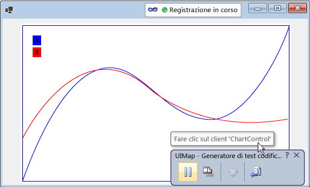
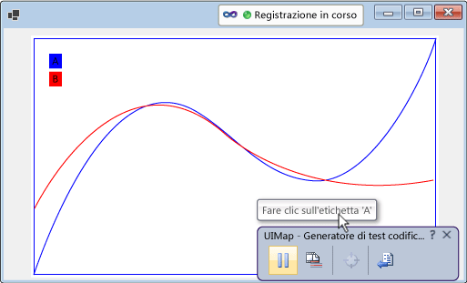

# Abilitare il test codificato dell&#39;interfaccia utente per i controlli
[!INCLUDE[vs2017banner](../code-quality/includes/vs2017banner.md)]

Il controllo può essere verificato più facilmente se si implementa il supporto per il framework di test codificati dell'interfaccia utente.  È possibile aggiungere gradualmente livelli crescenti di supporto.  È possibile iniziare supportando la registrazione, la riproduzione, e la convalida delle proprietà.  È possibile compilare su quello per consentire al generatore di test codificati dell'interfaccia utente di riconoscere le proprietà personalizzate del controllo, e di fornire le classi personalizzate per accedere a quelle proprietà dal codice generato.  È inoltre possibile facilitare il generatore di test codificati dell'interfaccia utente ad acquisire le azioni in una modalità che si avvicina di più allo scopo dell'azione registrata.  
  
 **In questo argomento:**  
  
1.  [Supportare registrazione, riproduzione, e convalida delle proprietà implementando l'accessibilità.](../test/enable-coded-ui-testing-of-your-controls.md#recordandplayback)  
  
2.  [Supportare la convalida della proprietà personalizzata implementando un provider di proprietà](../test/enable-coded-ui-testing-of-your-controls.md#customproprties)  
  
3.  [Supportare la generazione di codice implementando una classe per accedere alle proprietà personalizzate](../test/enable-coded-ui-testing-of-your-controls.md#codegeneration)  
  
4.  [Supportare le azioni Intent-Aware implementando un Filtro Azione](../test/enable-coded-ui-testing-of-your-controls.md#intentawareactions)  
  
   
  
##  <a name="recordandplayback"></a> Supportare registrazione, riproduzione, e convalida delle proprietà implementando l'accessibilità.  
 Il generatore di test codificati dell'interfaccia utente acquisisce informazioni sui controlli incontrati durante la registrazione e quindi genera il codice per riprodurre quella sessione.  Se il controllo non supporta l'accessibilità, il generatore di test codificati dell'interfaccia utente acquisisce le azioni \(quali i clic del mouse\) utilizzando le coordinate dello schermo.  Quando il test viene riprodotto, il codice generato emetterà i clic del mouse nelle stesse coordinate dello schermo.  Se il controllo viene visualizzato in un punto diverso dello schermo quando il test viene riprodotto, il codice generato non sarà in grado di eseguire tale azione nel controllo.  Questi errori si possono verificare se il test viene riprodotto in diverse configurazioni dello schermo, in ambienti diversi, o dopo che sono state apportate modifiche al layout dell'interfaccia utente.  
  
   
  
 Se si implementa l'accessibilità, tuttavia, il generatore di test codificati la utilizzerà per acquisire informazioni sul controllo quando registra un test e genera il codice.  Quindi, quando si esegue il test, il codice generato riprodurrà tali eventi sul controllo, anche se è altrove nell'interfaccia utente.  Gli autori del test potranno inoltre creare le asserzioni utilizzando le proprietà di base del controllo.  
  
   
  
### Per supportare registrazione e riproduzione, convalida della proprietà, e navigazione per un controllo di Windows form  
 Implementare l'accessibilità per il controllo come descritto nella procedura seguente, e descritto in dettaglio in <xref:System.Windows.Forms.AccessibleObject>.  
  
   
  
1.  Implementare una classe che derivi da <xref:System.Windows.Forms.Control.ControlAccessibleObject>, ed eseguire l'override della proprietà <xref:System.Windows.Forms.Control.AccessibilityObject%2A> per restituire un oggetto della classe.  
  
    ```c#  
    public partial class ChartControl : UserControl  
    {  
        // Overridden to return the custom AccessibleObject for the control.  
        protected override AccessibleObject CreateAccessibilityInstance()  
        {  
            return new ChartControlAccessibleObject(this);  
        }  
  
        // Inner class ChartControlAccessibleObject represents accessible information  
        // associated with the ChartControl and is used when recording tests.  
        public class ChartControlAccessibleObject : ControlAccessibleObject  
        {  
            ChartControl myControl;  
            public ChartControlAccessibleObject(ChartControl ctrl)  
                : base(ctrl)  
            {  
                myControl = ctrl;  
            }  
        }  
    }  
    ```  
  
2.  Eseguire l'override dei metodi e delle proprietà <xref:System.Windows.Forms.AccessibleObject.Role%2A>, <xref:System.Windows.Forms.AccessibleObject.State%2A>, <xref:System.Windows.Forms.AccessibleObject.GetChild%2A> e <xref:System.Windows.Forms.AccessibleObject.GetChildCount%2A> dell'oggetto accessibile.  
  
3.  Implementare un altro oggetto accessibilità per il controllo figlio ed eseguire l'override della proprietà <xref:System.Windows.Forms.Control.AccessibilityObject%2A> del controllo figlio per restituire tale oggetto accessibilità.  
  
4.  Eseguire l'override delle proprietà e dei metodi <xref:System.Windows.Forms.AccessibleObject.Bounds%2A>, <xref:System.Windows.Forms.AccessibleObject.Name%2A>, <xref:System.Windows.Forms.AccessibleObject.Parent%2A>, <xref:System.Windows.Forms.AccessibleObject.Role%2A>, <xref:System.Windows.Forms.AccessibleObject.State%2A>, <xref:System.Windows.Forms.AccessibleObject.Navigate%2A>, e <xref:System.Windows.Forms.AccessibleObject.Select%2A> per l'oggetto accessibilità del controllo figlio.  
  
> [!NOTE]
>  Questo argomento inizia con l'esempio di accessibilità in <xref:System.Windows.Forms.AccessibleObject> in questa procedura, e quindi le compilazioni su quella nelle procedure restanti.  Se si desidera creare una versione funzionante dell'esempio di accessibilità, creare un'applicazione console e quindi sostituire il codice in Program.cs con il codice di esempio.  Sarà necessario aggiungere riferimenti a Accessibilità, System.Drawing, e System.Windows.Forms.  È necessario modificare **Incorpora tipi di interoperabilità** per l'Accessibilità su False per eliminare un avviso di compilazione.  È possibile modificare il tipo di output del progetto da Applicazione console ad Applicazione Windows in modo che non venga visualizzata una finestra della console quando si esegue l'applicazione.  
  
##  <a name="customproprties"></a> Supportare la convalida della proprietà personalizzata implementando un provider di proprietà  
 Dopo aver implementato il supporto di base per la registrazione, riproduzione, e convalida delle proprietà, è possibile rendere disponibili le proprietà personalizzate del controllo ai test codificati dell'interfaccia utente mediante l'implementazione di un plug\-in <xref:Microsoft.VisualStudio.TestTools.UITesting.UITestPropertyProvider>.  Ad esempio, la procedura seguente crea un provider di proprietà che consente ai test codificati dell'interfaccia utente di accedere alla proprietà di stato dei controlli figlio CurveLegend del controllo grafico.  
  
   
  
### Per supportare la convalida delle proprietà personalizzate  
   
  
1.  Eseguire l'override della proprietà <xref:System.Windows.Forms.AccessibleObject.Description%2A> dell'oggetto accessibile curve legend per passare valori di proprietà avanzate nella stringa di descrizione, separati dalla descrizione principale \(e tra loro se si stanno implementando più proprietà\) con il punto e virgola \(;\).  
  
    ```c#  
    public class CurveLegendAccessibleObject : AccessibleObject  
    {  
        // add the state property value to the description  
        public override string Description  
        {  
            get  
            {  
                // Add “;” and the state value to the end  
                // of the curve legend’s description  
                return "CurveLegend; " + State.ToString();  
            }  
        }  
    }  
    ```  
  
2.  Creare un pacchetto di estensione di test dell'interfaccia utente per il controllo creando un progetto libreria di classi e aggiungere riferimenti a Accessibilità, Microsoft.VisualStudio.TestTools.UITesting, Microsoft.VisualStudio.TestTools.UITest.Common, e Microsoft.VisualStudio.TestTools.Extension.  Modificare **Incorpora tipi di interoperabilità** per l'Accessibilità su False.  
  
3.  Aggiungere una classe di provider di proprietà che sia derivata da <xref:Microsoft.VisualStudio.TestTools.UITesting.UITestPropertyProvider>.  
  
    ```c#  
    using System;  
    using System.Collections.Generic;  
    using Accessibility;  
    using Microsoft.VisualStudio.TestTools.UITesting;  
    using Microsoft.VisualStudio.TestTools.UITest.Extension;  
    using Microsoft.VisualStudio.TestTools.UITesting.WinControls;  
    using Microsoft.VisualStudio.TestTools.UITest.Common;  
  
    namespace ChartControlExtensionPackage  
    {  
        public class ChartControlPropertyProvider : UITestPropertyProvider  
        {  
        }  
    }  
    ```  
  
4.  Implementare il provider di proprietà inserendo i nomi di proprietà e i descrittori di proprietà in <xref:System.Collections.Generic.Dictionary%602>.  
  
<CodeContentPlaceHolder>3</CodeContentPlaceHolder>  
5.  Eseguire l'override di <xref:Microsoft.VisualStudio.TestTools.UITesting.UITestPropertyProvider.GetControlSupportLevel%2A?displayProperty=fullName> per indicare che l'assembly fornisce supporto specifico del controllo per il controllo e i suoi elementi figlio.  
  
<CodeContentPlaceHolder>4</CodeContentPlaceHolder>  
6.  Eseguire l'override dei rimanenti metodi astratti di <xref:Microsoft.VisualStudio.TestTools.UITesting.UITestPropertyProvider?displayProperty=fullName>.  
  
<CodeContentPlaceHolder>5</CodeContentPlaceHolder>  
7.  Aggiungere una classe del pacchetto di estensione che sia derivata da <xref:Microsoft.VisualStudio.TestTools.UITest.Extension.UITestExtensionPackage>.  
  
<CodeContentPlaceHolder>6</CodeContentPlaceHolder>  
8.  Definire l'attributo `UITestExtensionPackage` per l'assembly.  
  
<CodeContentPlaceHolder>7</CodeContentPlaceHolder>  
9. Nella classe del pacchetto di estensione, eseguire l'override di <xref:Microsoft.VisualStudio.TestTools.UITest.Extension.UITestExtensionPackage.GetService%2A?displayProperty=fullName> per restituire la classe del provider di proprietà quando un provider di proprietà è obbligatorio.  
  
<CodeContentPlaceHolder>8</CodeContentPlaceHolder>  
10. Eseguire l'override delle proprietà e dei metodi astratti rimanenti <xref:Microsoft.VisualStudio.TestTools.UITest.Extension.UITestExtensionPackage>.  
  
<CodeContentPlaceHolder>9</CodeContentPlaceHolder>  
11. Compilare i file binari e copiarli in **%ProgramFiles%\\Common\\Microsoft Shared\\VSTT\\10.0\\UITestExtensionPackages**.  
  
> [!NOTE]
>  Questo pacchetto di estensione viene applicato a qualsiasi controllo che è di tipo "testo".  Se si stanno testando più controlli dello stesso tipo, è necessario testarli separatamente e definire quali pacchetti di estensione vengono distribuiti quando si registrano i test.  
  
##  <a name="codegeneration"></a> Supportare la generazione di codice implementando una classe per accedere alle proprietà personalizzate  
 Quando il generatore di test codificati dell'interfaccia utente genera il codice da una registrazione della sessione, utilizza la classe <xref:Microsoft.VisualStudio.TestTools.UITesting.UITestControl> per accedere ai controlli.  
  
<CodeContentPlaceHolder>10</CodeContentPlaceHolder>  
 Se è stato implementato un provider di proprietà per fornire accesso alle proprietà personalizzate del controllo, è possibile aggiungere una classe specializzata utilizzata per accedere a quelle proprietà in modo da semplificare il codice generato.  
  
<CodeContentPlaceHolder>11</CodeContentPlaceHolder>  
### Per aggiungere una classe specializzata per accedere al controllo  
   
  
1.  Implementare una classe che sia derivata da <xref:Microsoft.VisualStudio.TestTools.UITesting.WinControls.WinControl> e aggiungere il tipo del controllo alla raccolta di proprietà di ricerca nel costruttore.  
  
<CodeContentPlaceHolder>12</CodeContentPlaceHolder>  
2.  Implementare le proprietà personalizzate del controllo come proprietà della classe.  
  
<CodeContentPlaceHolder>13</CodeContentPlaceHolder>  
3.  Eseguire l'override del metodo <xref:Microsoft.VisualStudio.TestTools.UITesting.UITestPropertyProvider.GetSpecializedClass%2A?displayProperty=fullName> del provider di proprietà per restituire il tipo della nuova classe per i controlli figlio della curve legend.  
  
<CodeContentPlaceHolder>14</CodeContentPlaceHolder>  
4.  Eseguire l'override del metodo <xref:Microsoft.VisualStudio.TestTools.UITesting.UITestPropertyProvider.GetPropertyNamesClassType%2A> del provider di proprietà per restituire il tipo del metodo della nuova classe PropertyNames.  
  
<CodeContentPlaceHolder>15</CodeContentPlaceHolder>  
##  <a name="intentawareactions"></a> Supportare le azioni Intent\-Aware implementando un Filtro Azione  
 Quando Visual Studio registra un test, acquisisce ogni evento di mouse e tastiera.  Tuttavia, in alcuni casi, lo scopo dell'azione può perdersi nella serie di eventi di mouse e tastiera.  Ad esempio, se il controllo supporta il completamento automatico, lo stesso set di eventi di mouse e tastiera può comportare un valore diverso quando il test viene riprodotto in un ambiente diverso.  È possibile aggiungere un plug\-in del filtro azione che sostituisce la serie di eventi di mouse e tastiera con una sola azione.  In questo modo, è possibile sostituire la sequenza di eventi di mouse e tastiera derivanti dalla selezione di un valore con una sola azione che imposta il valore.  Questa operazione consente di proteggere i test codificati dell'interfaccia utente dalle differenze nel completamento automatico da un ambiente a un altro.  
  
### Per supportare le azioni intent\-aware  
   
  
1.  Implementare una classe di filtro azione che sia derivata da <xref:Microsoft.VisualStudio.TestTools.UITest.Common.UITestActionFilter>, sostituendo le proprietà <xref:Microsoft.VisualStudio.TestTools.UITest.Common.UITestActionFilter.ApplyTimeout%2A>, <xref:Microsoft.VisualStudio.TestTools.UITest.Common.UITestActionFilter.Category%2A>, <xref:Microsoft.VisualStudio.TestTools.UITest.Common.UITestActionFilter.Enabled%2A>, <xref:Microsoft.VisualStudio.TestTools.UITest.Common.UITestActionFilter.FilterType%2A>, <xref:Microsoft.VisualStudio.TestTools.UITest.Common.UITestActionFilter.Group%2A> e <xref:Microsoft.VisualStudio.TestTools.UITest.Common.UITestActionFilter.Name%2A>.  
  
<CodeContentPlaceHolder>16</CodeContentPlaceHolder>  
2.  Eseguire l'override di <xref:Microsoft.VisualStudio.TestTools.UITest.Common.UITestActionFilter.ProcessRule%2A>.  In questo esempio si sostituisce un'azione di doppio clic con un'azione di clic singolo.  
  
<CodeContentPlaceHolder>17</CodeContentPlaceHolder>  
3.  Aggiungere il filtro azione al metodo <xref:Microsoft.VisualStudio.TestTools.UITest.Extension.UITestExtensionPackage.GetService%2A> del pacchetto di estensione.  
  
<CodeContentPlaceHolder>18</CodeContentPlaceHolder>  
4.  Compilare i file binari e copiarli in %ProgramFiles%\\Common Files\\Microsoft Shared\\VSTT\\10.0\\UITestExtensionPackages.  
  
> [!NOTE]
>  Il filtro azione non dipende dall'implementazione di accessibilità o dal provider di proprietà.  
  
## Eseguire il debug del provider di proprietà o del filtro azione  
 Il provider di proprietà e il filtro azione sono distribuiti in un pacchetto di estensione che viene caricato ed eseguito dal generatore di test codificati dell'interfaccia utente in un processo distinto dall'applicazione.  
  
#### Per eseguire il debug del provider di proprietà o del filtro azione  
  
1.  Compilare la versione di debug del pacchetto di estensione copiare i file .dll e .pdb in %ProgramFiles%\\Common Files\\Microsoft Shared\\VSTT\\10.0\\UITestExtensionPackages.  
  
2.  Eseguire l'applicazione \(non nel debugger\).  
  
3.  Eseguire il generatore di test codificati dell'interfaccia utente  
  
     `codedUITestBuilder.exe  /standalone`  
  
4.  Associare il debugger al processo codedUITestBuilder.  
  
5.  Impostare i punti di interruzione nel codice.  
  
6.  Nel generatore di test codificati dell'interfaccia utente, creare le asserzioni per verificare il provider di proprietà, e le azioni di registrazione per verificare il filtro azione.  
  
## Risorse esterne  
  
### Linee guida  
 [Test per una distribuzione continua con Visual Studio 2012 – Capitolo 2: Unit Testing: Testing the Inside](http://go.microsoft.com/fwlink/?LinkID=255188)  
  
## Vedere anche  
 <xref:System.Windows.Forms.AccessibleObject>   
 [Usare l'automazione dell'interfaccia utente per testare il codice](../test/use-ui-automation-to-test-your-code.md)